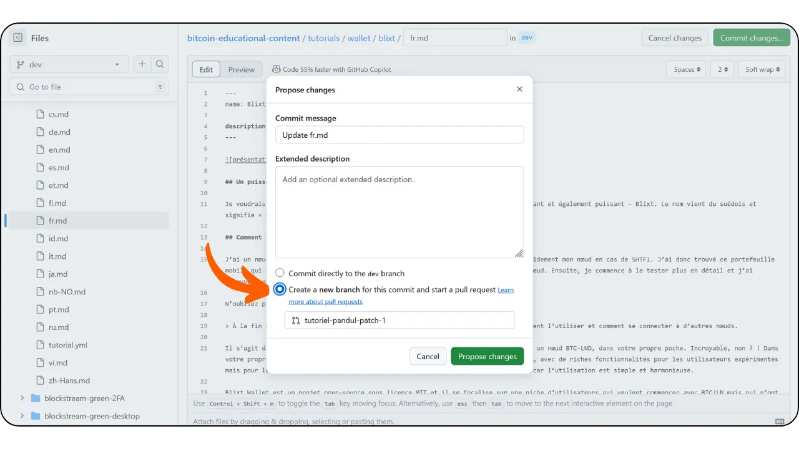
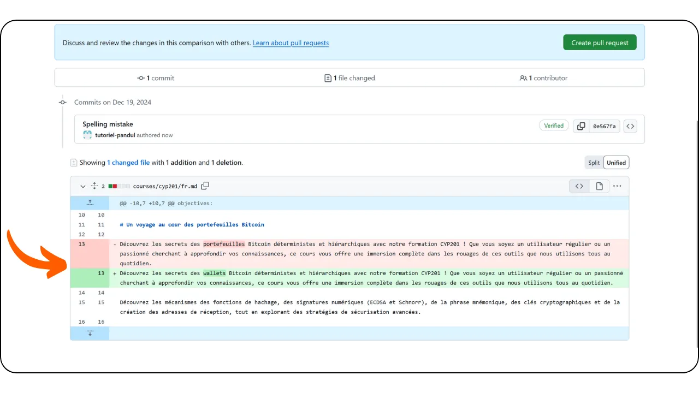

## Em resumo

Se quiseres participar na revisão e correção de conteúdos para a Plan ₿ Network, junta-te ao [nosso grupo do Telegram] (https://t.me/PlanBNetwork_ContentBuilder) dedicado às contribuições. Apresenta-te brevemente, depois especifica o conteúdo que gostarias de rever e a língua. Faça suas correções em um ramo de trabalho e envie um PR assim que sua revisão for concluída.

Se não percebeu a parte acima, não se preocupe - este tutorial é para si!

---
## O que é o Plano ₿ Rede?

Plan ₿ Network é uma plataforma para aprender sobre Bitcoin através de inúmeros cursos e tutoriais para todos. Atualmente, todo o nosso conteúdo é de código aberto, hospedado em um repositório GitHub e aberto a contribuições para revisão e criação de conteúdo.

A Plan ₿ Network tem como objetivo tornar-se a praça pública do ciberespaço Bitcoin, ligando e encorajando as comunidades Bitcoin em todo o mundo.

## Porquê contribuir?

A Plan ₿ Network é fundamentalmente multilingue, pois o nosso objetivo é tornar os recursos Bitcoin acessíveis a todos em todo o mundo. Acreditamos que a língua não deve ser uma barreira para o dinheiro soberano.

Para o conseguir, utilizamos uma abordagem Humano x IA. Através do nosso [programa](https://github.com/Asi0Flammeus/LLM-Translator), podemos traduzir automaticamente o nosso conteúdo para muitas línguas. No entanto, precisamos que um falante fluente o reveja para garantir que o conteúdo é inteligível e não contém termos inadequados.

Se quiser ajudar a construir este projeto educativo para promover a educação sobre Bitcoin na sua comunidade, pode começar por rever um curso ou um tutorial.

Além disso, como prezamos o modelo *Value4Value*, recompensaremos as contribuições de revisão. A recompensa será baseada na extensão do conteúdo, na precisão linguística da nossa tradução automática e na dificuldade do conteúdo.

## Preciso de saber como funciona o GitHub?

Não precisa de ser um especialista em GitHub para rever conteúdos. Embora seja sempre melhor compreender o que está a fazer (e porquê), pode simplesmente seguir as instruções abaixo para contribuir.

No entanto, se não estiver familiarizado com o Git e o GitHub e quiser saber mais, pode consultar o nosso artigo introdutório sobre estas ferramentas:

https://planb.network/tutorials/others/contribution/create-github-account-a75fc39d-f0d0-44dc-9cd5-cd94aee0c07c
## 1. Criar uma conta

- Crie uma conta no [GitHub] (https://github.com/) para começar a contribuir. Se pretender obter orientação sobre como criar a sua conta GitHub, também temos um tutorial detalhado:

https://planb.network/tutorials/others/contribution/create-github-account-a75fc39d-f0d0-44dc-9cd5-cd94aee0c07c

- É também necessária uma conta na aplicação de mensagens [Telegram] (https://telegram.org/).

## 2. Juntar-se ao grupo Telegram

- Junte-se [ao grupo PBN Content Builder] (https://t.me/PlanBNetwork_ContentBuilder) no Telegram.

- Apresente-se brevemente e especifique o conteúdo para o qual pretende contribuir e a língua numa mensagem para o canal "Geral".
- Um membro da equipa criará então um problema no GitHub para a sua futura contribuição. Encontrará aí todas as informações necessárias para iniciar a sua revisão.

## 3. Rever e editar o conteúdo através da interface do GitHub

- A questão contém uma descrição (cf. \**A\**) com ligações para o conteúdo original e o ficheiro a rever.
- Se quiser encarregar-se da revisão, deixe um comentário sobre a questão (cf. \**B\**) para indicar que vai trabalhar nela. Assim, evita-se a duplicação de esforços.
- Clique na ligação ao lado do ficheiro a rever (cf. \**C\**) para aceder ao conteúdo.

- Pode agora ver a interface do GitHub do ficheiro a rever.
- O painel da esquerda permite-lhe navegar através do seu ramo (cf. \**A\**) e ficheiros (cf. \**B\**).
- Clicar no ícone do lápis para iniciar a revisão (cf. \**C\**).

- Se esta for a sua primeira contribuição, o GitHub pedir-lhe-á para bifurcar o repositório de origem. Basta clicar no botão.

- Chega então à interface do Editor (cf. \**A\**), onde pode ver o caminho do ficheiro e o ramo correspondente (cf. \**B\**) e alternar entre os modos de edição e de pré-visualização (cf. \**C\**).

NB. Recomenda-se a revisão na janela de código, com o conteúdo original apresentado numa janela separada. Por exemplo, pode ver o texto no sítio Web da Plan ₿ Network ou na pré-visualização do GitHub num separador do browser. Utilize `ctrl + F` para localizar erros e fazer correcções na vista de código à medida que avança.

## 4. Autorizar alterações

- Pode começar a rever e a corrigir o conteúdo conforme necessário.
- Quando quiser fazer uma pausa na sua sessão, pode confirmar as suas alterações, mesmo que a revisão não esteja concluída. É como guardar o seu progresso no GitHub.
- Clique no botão "Confirmar alterações...".

- Acrescentar uma mensagem descritiva para as suas alterações (cf. \**A\**).
- Se necessário, acrescentar mais contexto na descrição (cf. \**B\**).
- Clicar no botão "Propor alterações" (cf. \**C\**).

- Se esta não for sua primeira contribuição, o GitHub solicitará que você crie um novo ramo. Você nunca deve fazer commit diretamente no branch principal `dev`. Se você já fez commits em um branch de trabalho existente, selecione esse branch. Caso contrário, escolha a opção "Criar um novo ramo" para criar um novo ramo.

- Acederá então a uma página que resume todas as suas alterações. Percorrendo-a, pode ver as alterações exactas: os itens eliminados aparecem a vermelho, enquanto os itens adicionados aparecem a verde.

- Se não tiver concluído a sua revisão e pretender continuar o seu trabalho mais tarde, pode simplesmente sair.
- Desde que tenha efectuado o commit das suas alterações, estas são guardadas no seu fork do GitHub.
- Para retomar o seu trabalho, aceda à sua bifurcação do repositório de conteúdos Plan ₿ Network através do seu perfil GitHub.

- Selecione o ramo que contém o seu progresso (cf. \**A\**), localize o seu ficheiro de conteúdo (cf. \**B\**) e, em seguida, clique no ícone do lápis para continuar a revisão.

## 5. Criar um PR com o ramo dedicado

- Se tudo parecer bem e tiver terminado as suas alterações, clique no botão verde "Create Pull Request".

- Chegará então à página PR. Um Pull Request é um pedido para submeter alterações feitas num ramo de um repositório remoto para revisão e possível fusão no ramo principal.
- Adicione um título e uma breve descrição ao seu PR. O título deve corresponder à edição em que está a trabalhar. Por exemplo, se o título da edição for `[TRADUÇÃO] Curso CYP201 - FR`, utilize o mesmo título para a sua RP (cf. \**A\**). Na descrição, mencione a questão associada utilizando o seu número, precedido de "Encerra". Esta ação encerrará automaticamente o problema quando o PR for fundido (cf. \**B\**).
- Se tudo parecer bem, clique no botão verde "Create Pull Request" (cf. \**C\**).

## 6. Regras a seguir ao revisar conteúdo

- Antes de começar uma nova revisão, anuncie-a no [grupo do Telegram](https://t.me/PlanBNetwork_ContentBuilder) ou informe o seu coordenador do Plan ₿ Network. Eles abrirão um [issue](https://docs.github.com/en/issues/tracking-your-work-with-issues/about-issues), onde você pode comentar que está começando o trabalho.
- É importante sempre verificar a versão original em inglês (ou francês) do curso/tutorial ao revisar. Sinta-se à vontade para fazer ajustes para melhorar a fluidez, mas não mude o significado original geral.
- Ferramentas LLM podem traduzir literalmente algumas palavras relacionadas ao Bitcoin, como Lightning Network, que se tornaria "Rede Relâmpago" em português. Em casos como este, é aconselhável usar a palavra original em inglês para maior clareza, a menos que as regras do seu idioma exijam que você traduza cada palavra.
- Se você encontrar citações, certifique-se de fazer alguma pesquisa online para encontrar a tradução correta em seu idioma.
- NÃO traduza as palavras estáticas no início do texto, que são usadas para descrever seu conteúdo: "name", "description", "objectives".
- Se você encontrar "Plan ₿ Network" no texto, deixe-o nesta forma original. Não traduza a palavra "plan" ou a palavra "network". Além disso, NÃO use o artigo ao apresentar o Plan ₿ Network, e considere-o como uma marca. O mesmo se aplica a "₿-CERT", "BIZ SCHOOL", "TECH SCHOOL", que também devem ser mantidos na forma original.
- Preste atenção à pontuação estranha, como '\*\*\', que pode representar uma má renderização do símbolo em negrito **. Sempre verifique o texto original em inglês para ver se deve haver um texto em negrito. Em geral, para renderizar o texto em negrito, insira dois asteriscos ** tanto antes quanto depois da palavra/frase. Você pode encontrar mais informações sobre a linguagem markdown [aqui](https://www.markdownguide.org/basic-syntax/).
- Quando terminar sua revisão, você pode voltar ao issue inicial aberto pelo coordenador, comentar com "Proofreading done" e inserir seu link PR lá.

## 7. Aguardar a revisão

- Parabéns, o seu PR foi submetido! Pode acompanhar o seu progresso no separador "Pull requests" no [repositório GitHub do Plan ₿ Network](https://github.com/PlanB-Network/bitcoin-educational-content/pulls):

- Muito obrigado pela sua contribuiçªo! Após a aprovação, um membro da equipa da Plan ₿ Network entrará em contacto consigo para enviar a sua recompensa. \**Os pagamentos são feitos exclusivamente através da Lightning Network\**.
- Se quiser começar de novo, volte ao passo 2 e envie uma nova mensagem no grupo do Telegram para continuar a contribuir para outros conteúdos. Certifique-se de sincronizar sua bifurcação antes de criar uma nova ramificação de trabalho. Para fazer isso, vá para a página inicial da sua bifurcação, selecione a ramificação principal chamada `dev` (cf. \**A\**), depois clique no botão "Sync fork" (cf. \**B\**). Se houver atualizações disponíveis para o seu fork, um botão "Update branch" aparecerá. Basta clicar nele para realizar a atualização.

- Se tiver quaisquer observações, perguntas ou comentários sobre este projeto, não hesite em enviar um DM [para o grupo de Telegrama dos contribuidores] (https://t.me/PlanBNetwork_ContentBuilder).
