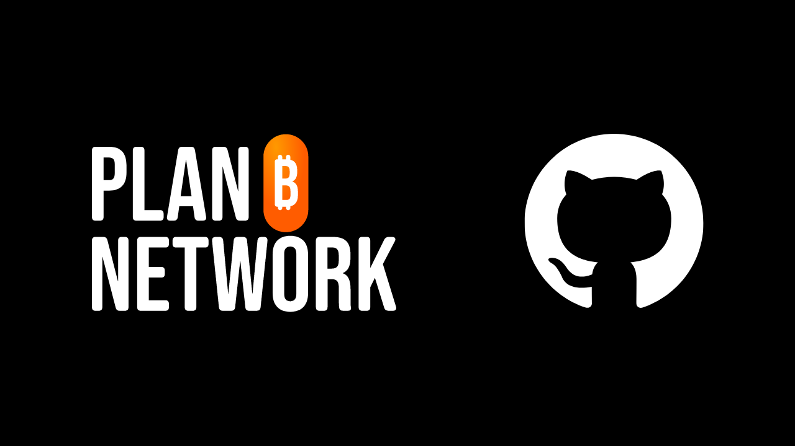

## Tóm tắt

Nếu bạn muốn hiệu đính hoặc xem lại nội dung cho Plan ₿ Network, hãy tham gia [nhóm Telegram của chúng tôi](https://t.me/PlanBNetwork_ContentBuilder) dành riêng cho các đóng góp. Giới thiệu ngắn gọn về bản thân, sau đó nêu rõ nội dung bạn muốn xem lại và ngôn ngữ. Thực hiện các chỉnh sửa của bạn trên một nhánh đang hoạt động và gửi PR sau khi hoàn tất quá trình xem lại.

Nếu bạn không hiểu phần trên, đừng lo lắng - hướng dẫn này là dành cho bạn!

---
## Plan ₿ Network là gì?

Plan ₿ Network là một nền tảng để tìm hiểu về Bitcoin thông qua nhiều khóa học và hướng dẫn dành cho mọi người. Hiện tại, tất cả nội dung của chúng tôi đều là mã nguồn mở, được lưu trữ trên kho lưu trữ GitHub và mở cho các đóng góp để đánh giá và tạo nội dung.

Plan ₿ Network hướng tới mục tiêu trở thành diễn đàn công cộng của không gian mạng Bitcoin, kết nối và khuyến khích cộng đồng Bitcoin trên toàn thế giới.

## Tại sao phải đóng góp?

Plan ₿ Network về cơ bản là đa ngôn ngữ, vì mục tiêu của chúng tôi là làm cho tài nguyên Bitcoin có thể tiếp cận được với mọi người trên toàn thế giới. Chúng tôi tin rằng ngôn ngữ không nên là rào cản đối với tiền tệ có chủ quyền.

Để đạt được điều này, chúng tôi sử dụng phương pháp tiếp cận Con người x AI. Thông qua [chương trình](https://github.com/Asi0Flammeus/LLM-Translator), chúng tôi có thể tự động dịch nội dung của mình sang nhiều ngôn ngữ. Tuy nhiên, chúng tôi cần một người nói lưu loát để xem lại nội dung nhằm đảm bảo nội dung dễ hiểu và không có các thuật ngữ không phù hợp.

Nếu bạn muốn giúp xây dựng dự án giáo dục này để thúc đẩy giáo dục Bitcoin trong cộng đồng của mình, bạn có thể bắt đầu bằng cách xem lại một khóa học hoặc hướng dẫn.

Ngoài ra, vì chúng tôi trân trọng mô hình *Value4Value*, chúng tôi sẽ thưởng cho các đóng góp đánh giá. Phần thưởng sẽ dựa trên độ dài của nội dung, độ chính xác về mặt ngôn ngữ của bản dịch tự động của chúng tôi và độ khó của nội dung.

## Tôi có cần biết GitHub hoạt động như thế nào không?

Bạn không cần phải là chuyên gia GitHub để đánh giá nội dung. Mặc dù hiểu rõ mình đang làm gì (và tại sao) luôn tốt hơn, bạn chỉ cần làm theo hướng dẫn bên dưới để đóng góp.

Tuy nhiên, nếu bạn chưa quen với Git và GitHub và muốn tìm hiểu thêm, bạn có thể xem bài viết giới thiệu của chúng tôi về các công cụ này:

https://planb.network/tutorials/others/contribution/create-github-account-a75fc39d-f0d0-44dc-9cd5-cd94aee0c07c
## 1. Tạo một tài khoản

- Tạo một tài khoản trên [GitHub](https://github.com/) để bắt đầu đóng góp. Nếu bạn muốn được hướng dẫn về cách tạo tài khoản GitHub, hãy xem hướng dẫn được đề cập ở trên.

-

- Bạn cũng sẽ cần có một tài khoản trên ứng dụng nhắn tin [Telegram](https://telegram.org/).

## 2. Tham gia nhóm Telegram

- Tham gia [nhóm PBN Content Builder](https://t.me/PlanBNetwork_ContentBuilder) trên Telegram.

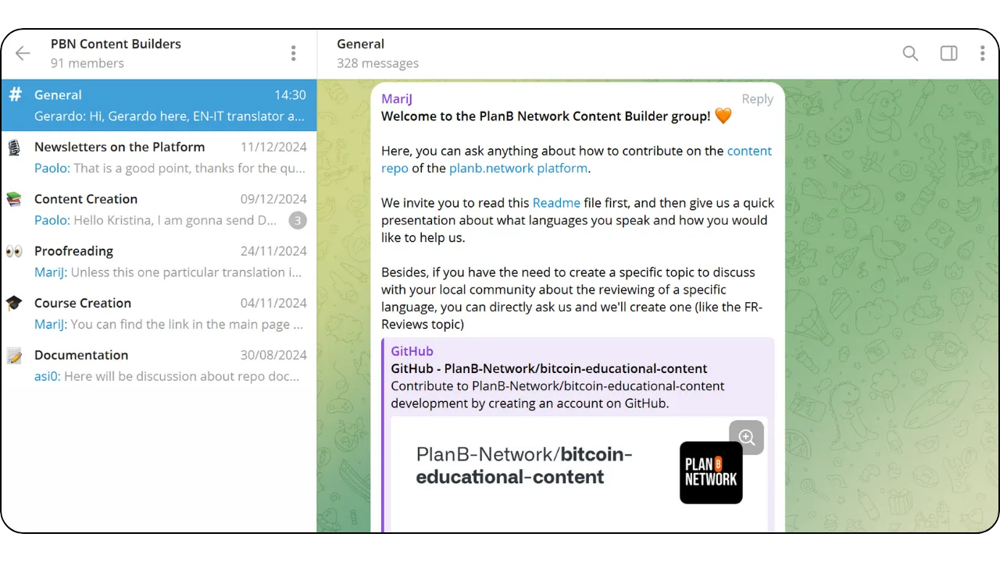

- Giới thiệu ngắn gọn về bản thân và nêu rõ nội dung bạn muốn đóng góp cũng như ngôn ngữ trong tin nhắn gửi đến kênh "Chung".
- Sau đó, một thành viên trong nhóm sẽ tạo một vấn đề trên GitHub cho đóng góp trong tương lai của bạn. Bạn sẽ tìm thấy tất cả thông tin cần thiết để bắt đầu đánh giá của mình tại đó.

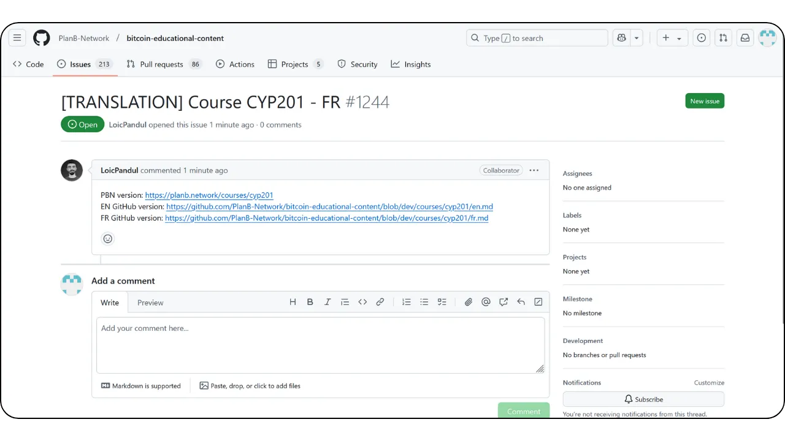

## 3. Xem lại và chỉnh sửa nội dung thông qua giao diện GitHub

- Số báo này có phần mô tả (xem \**A\**) với các liên kết đến nội dung gốc và tệp để xem xét.
- Nếu bạn muốn chịu trách nhiệm đánh giá, hãy để lại bình luận về vấn đề (xem \**B\**) để cho biết bạn sẽ xử lý vấn đề đó. Điều này ngăn ngừa các nỗ lực trùng lặp.
- Nhấp vào liên kết bên cạnh tệp để xem lại (xem \**C\**) để truy cập nội dung.

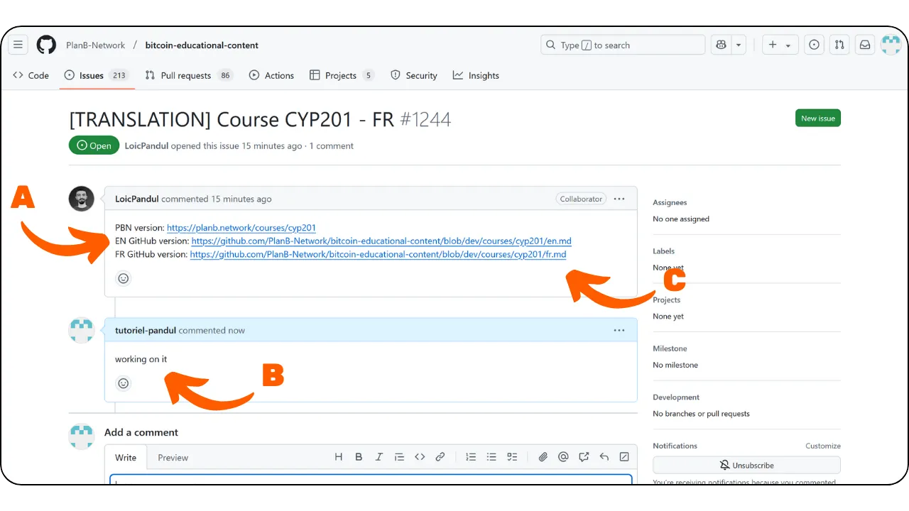

- Bây giờ bạn có thể xem giao diện GitHub của tệp để đánh giá.
- Bảng bên trái cho phép bạn điều hướng qua nhánh (so sánh \**A\**) và các tệp (so sánh \**B\**).
- Nhấp vào biểu tượng bút chì để bắt đầu xem lại (xem \**C\**).

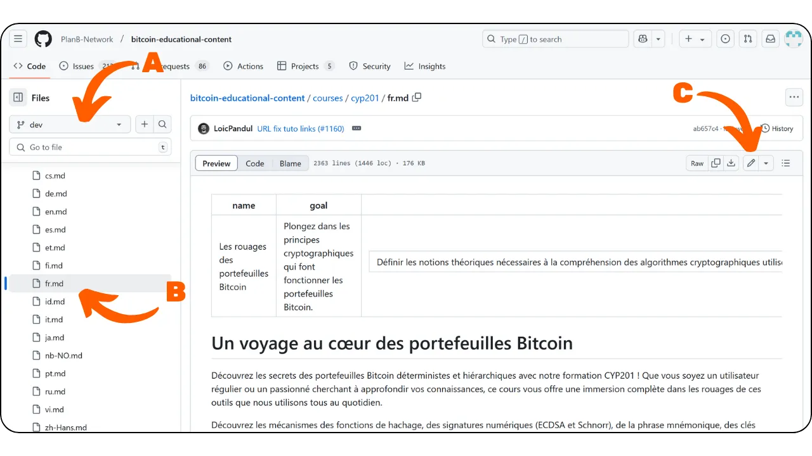

- Nếu đây là lần đóng góp đầu tiên của bạn, GitHub sẽ nhắc bạn phân nhánh kho lưu trữ nguồn. Chỉ cần nhấp vào nút.

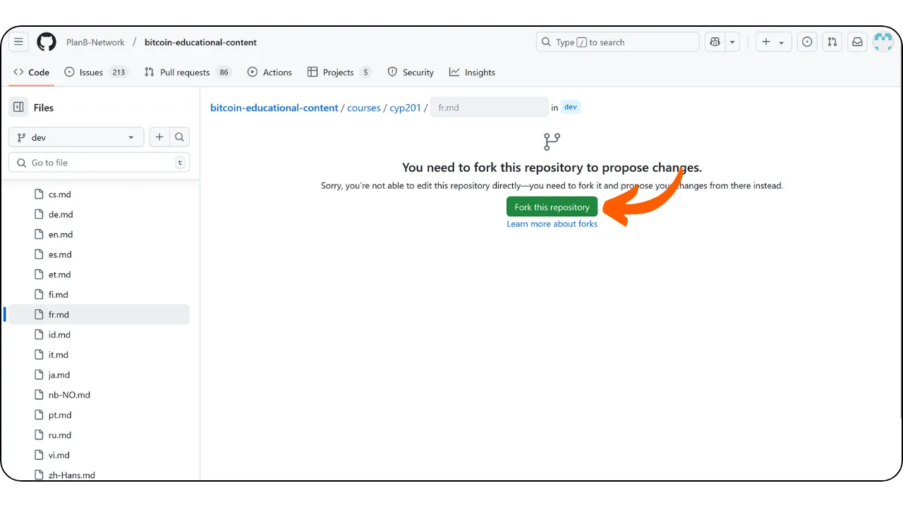

- Sau đó, bạn sẽ đến giao diện Trình chỉnh sửa (so sánh \**A\**), nơi bạn có thể thấy đường dẫn tệp và nhánh tương ứng (so sánh \**B\**) và chuyển đổi giữa chế độ chỉnh sửa và chế độ xem trước (so sánh \**C\**).

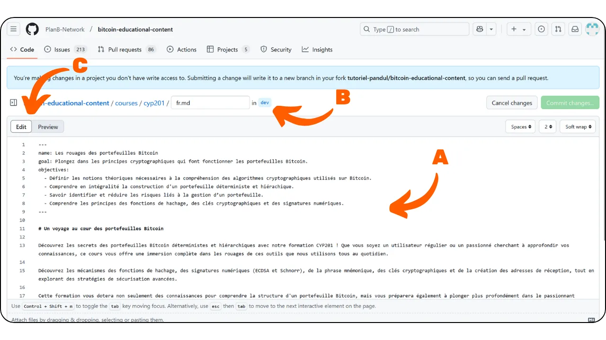

NB. Bạn nên xem lại trong cửa sổ mã, với nội dung gốc được hiển thị trong một cửa sổ riêng. Ví dụ, bạn có thể xem văn bản trên trang web Plan ₿ Network hoặc trong bản xem trước GitHub trên tab trình duyệt. Sử dụng `ctrl + F` để xác định lỗi và sửa lỗi trong chế độ xem mã khi bạn thực hiện.

## 4. Cam kết thay đổi

- Bạn có thể bắt đầu xem lại và chỉnh sửa nội dung khi cần thiết.
- Khi bạn muốn tạm dừng phiên làm việc, bạn có thể cam kết các thay đổi của mình, ngay cả khi quá trình đánh giá chưa hoàn tất. Giống như lưu tiến trình của bạn trên GitHub.
- Nhấp vào nút "Xác nhận thay đổi...".

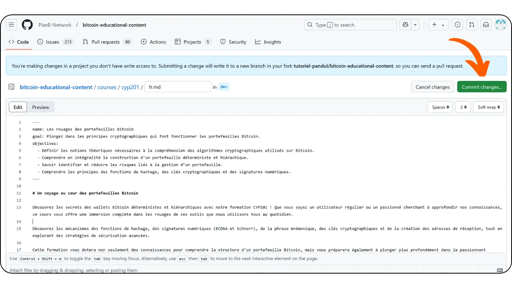

- Thêm thông điệp mô tả cho những thay đổi của bạn (xem \**A\**).
- Thêm ngữ cảnh vào phần mô tả nếu cần thiết (xem \**B\**).
- Nhấp vào nút "Đề xuất thay đổi" (so sánh \**C\**).

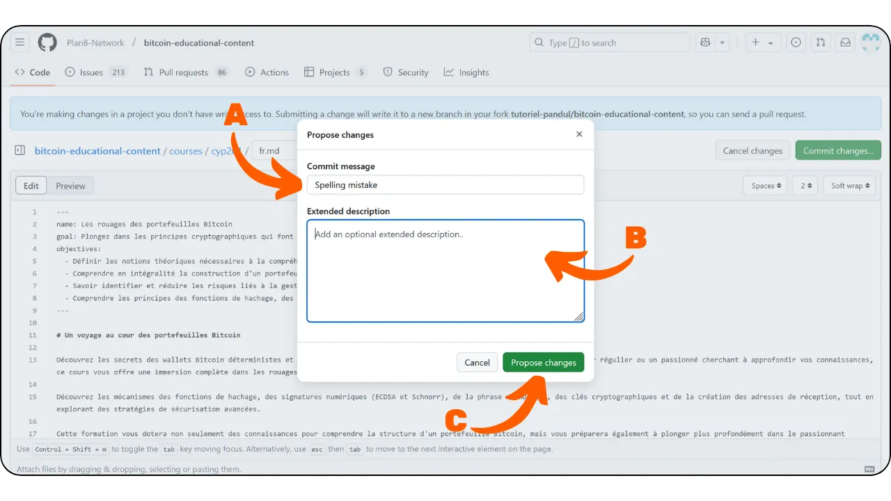

- Nếu đây không phải là lần đóng góp đầu tiên của bạn, GitHub sẽ nhắc bạn tạo một nhánh mới. Bạn không bao giờ nên cam kết trực tiếp vào nhánh chính `dev`. Nếu bạn đã thực hiện cam kết trên một nhánh đang hoạt động hiện có, hãy chọn nhánh đó. Nếu không, hãy chọn tùy chọn "Create a new branch" để tạo một nhánh mới.

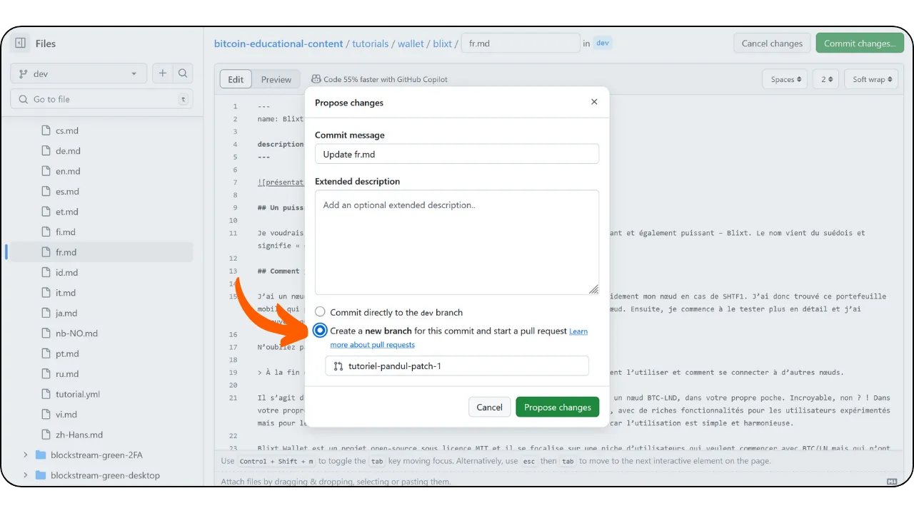

- Sau đó, bạn sẽ truy cập vào trang tóm tắt tất cả các thay đổi của mình. Bằng cách cuộn qua trang, bạn có thể thấy các sửa đổi chính xác: các mục đã xóa sẽ hiển thị màu đỏ, trong khi các mục đã thêm sẽ hiển thị màu xanh lá cây.

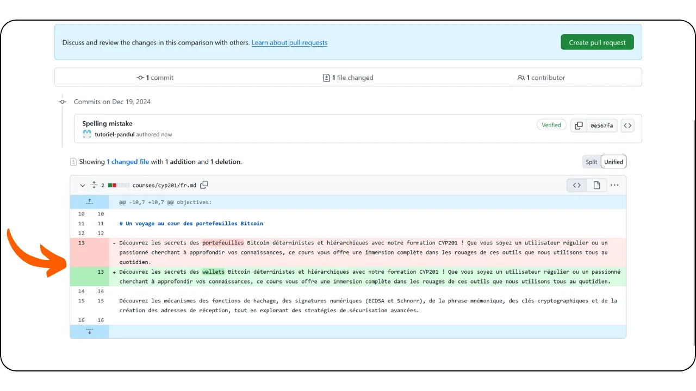

- Nếu bạn chưa hoàn tất việc đánh giá và muốn tiếp tục công việc sau, bạn chỉ cần thoát.
- Chỉ cần bạn đã cam kết những thay đổi của mình, chúng sẽ được lưu trên nhánh GitHub của bạn.
- Để tiếp tục công việc của bạn, hãy truy cập vào nhánh kho lưu trữ nội dung Plan ₿ Network thông qua hồ sơ GitHub của bạn.

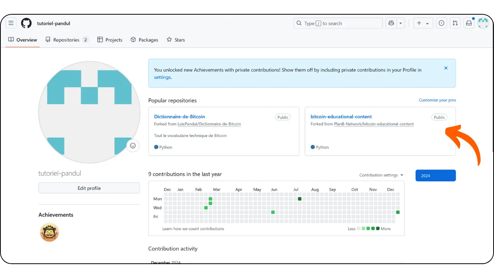

- Chọn nhánh chứa tiến trình của bạn (so sánh \**A\**), tìm tệp nội dung của bạn (so sánh \**B\**), sau đó nhấp vào biểu tượng bút chì để tiếp tục xem lại.

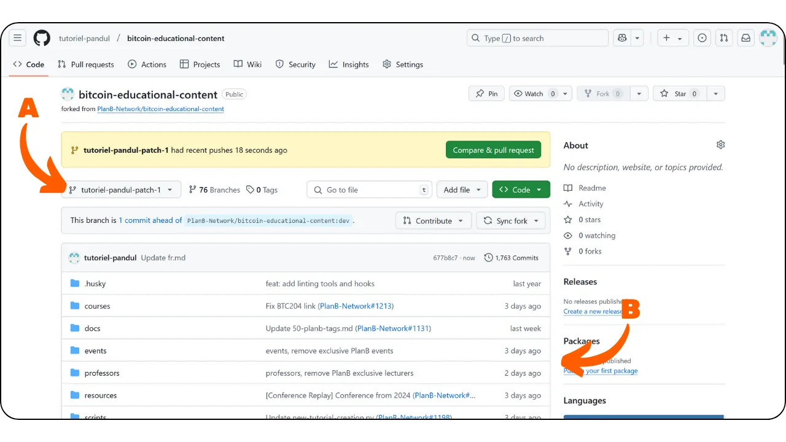

## 5. Tạo PR với chi nhánh chuyên dụng

- Nếu mọi thứ có vẻ ổn và bạn đã hoàn tất các thay đổi, hãy nhấp vào nút màu xanh lá cây "Tạo yêu cầu kéo".

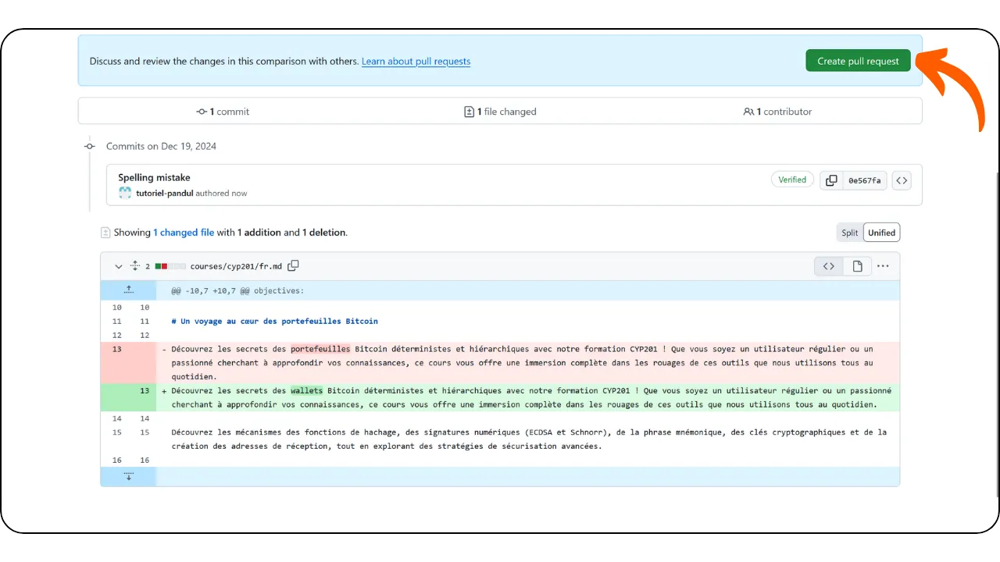

- Sau đó, bạn sẽ đến trang PR. Yêu cầu kéo là yêu cầu gửi các thay đổi được thực hiện trên một nhánh của kho lưu trữ từ xa để xem xét và có thể hợp nhất vào nhánh chính.
- Thêm tiêu đề và mô tả ngắn vào PR của bạn. Tiêu đề phải khớp với vấn đề bạn đang giải quyết. Ví dụ, nếu tiêu đề vấn đề là `[TRANSLATION] Course CYP201 - FR`, hãy sử dụng cùng tiêu đề cho PR của bạn (so sánh \**A\**). Trong phần mô tả, hãy đề cập đến vấn đề liên quan bằng cách sử dụng số của nó, bắt đầu bằng "Closes". Thao tác này sẽ tự động đóng vấn đề sau khi PR được hợp nhất (so sánh \**B\**).
- Nếu mọi thứ ổn, hãy nhấp vào nút màu xanh lá cây "Tạo yêu cầu kéo" (so sánh \**C\**).

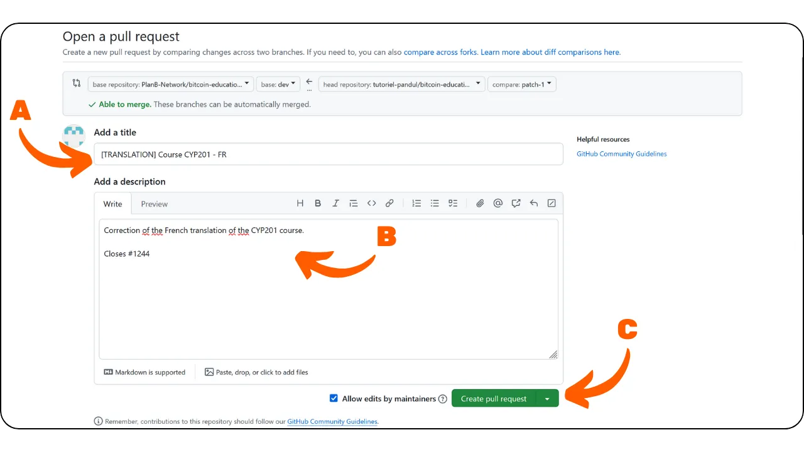

## 6. Quy tắc cần tuân theo khi hiệu đính nội dung

- Trước khi bắt đầu một lần hiệu đính mới, hãy thông báo trong [nhóm Telegram](https://t.me/PlanBNetwork_ContentBuilder) hoặc cho người điều phối của bạn trong Plan ₿ Network biết. Họ sẽ mở một [issue](https://docs.github.com/en/issues/tracking-your-work-with-issues/about-issues), nơi bạn có thể bình luận rằng bạn đang bắt đầu công việc.
- Điều quan trọng là luôn kiểm tra phiên bản gốc bằng tiếng Anh (hoặc tiếng Pháp) của khóa học/tutorial khi hiệu đính. Hãy thoải mái thực hiện các điều chỉnh để cải thiện tính mạch lạc, nhưng đừng thay đổi ý nghĩa tổng thể ban đầu.
- Các công cụ LLM có thể dịch một số từ liên quan đến Bitcoin một cách nghĩa đen, như Lightning Network, sẽ trở thành "Mạng Lưới Sét" trong tiếng Việt. Trong những trường hợp như vậy, nên sử dụng từ gốc bằng tiếng Anh để rõ ràng hơn, trừ khi quy tắc ngôn ngữ của bạn yêu cầu bạn dịch từng từ một.
- Nếu bạn tìm thấy các trích dẫn, hãy đảm bảo thực hiện một số nghiên cứu trực tuyến để tìm ra bản dịch chính xác trong ngôn ngữ của bạn.
- KHÔNG dịch các từ tĩnh ở đầu văn bản, được sử dụng để mô tả nội dung của nó: "name", "description", "objectives".
- Nếu bạn tìm thấy "Plan ₿ Network" trong văn bản, hãy để nguyên dạng gốc này. Đừng dịch từ "plan" hoặc từ "network". Hơn nữa, ĐỪNG sử dụng mạo từ khi giới thiệu Plan ₿ Network, và coi đó như một thương hiệu. Điều tương tự cũng áp dụng cho "₿-CERT", "BIZ SCHOOL", "TECH SCHOOL", cũng nên được giữ nguyên dạng gốc.
- Hãy chú ý đến dấu câu kỳ lạ như '\*\*\', có thể đại diện cho việc hiển thị sai ký hiệu in đậm **. Luôn kiểm tra văn bản gốc bằng tiếng Anh để xem liệu có cần văn bản in đậm hay không. Nói chung, để hiển thị văn bản in đậm, vui lòng chèn hai dấu hoa thị ** cả trước và sau từ/câu. Bạn có thể tìm thêm thông tin về ngôn ngữ markdown [tại đây](https://www.markdownguide.org/basic-syntax/).
- Khi bạn hoàn thành việc hiệu đính, bạn có thể quay lại vấn đề ban đầu được mở bởi người điều phối, bình luận với "Proofreading done" và chèn liên kết PR của bạn vào đó.

## 7. Chờ đánh giá

- Xin chúc mừng, PR của bạn đã được gửi! Bạn có thể theo dõi tiến trình của nó trong tab "Yêu cầu kéo" trên [Kho lưu trữ GitHub của Plan ₿ Network] (https://github.com/PlanB-Network/bitcoin-educational-content/pulls):

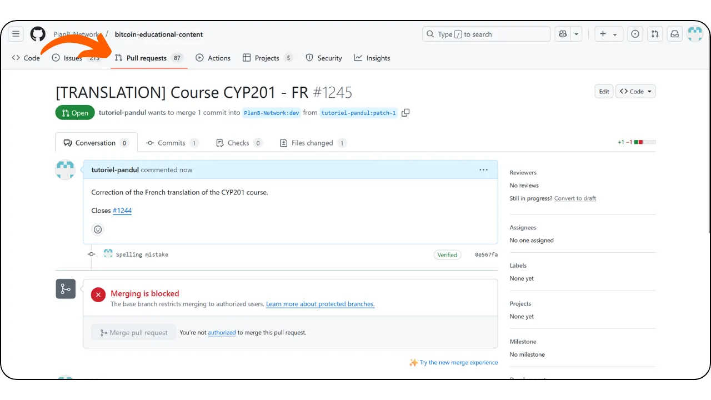

- Cảm ơn bạn rất nhiều vì sự đóng góp của bạn! Sau khi được chấp thuận, một thành viên nhóm Plan ₿ Network sẽ liên hệ với bạn để gửi phần thưởng. \**Thanh toán chỉ được thực hiện thông qua Lightning Network\**.
- Nếu bạn muốn bắt đầu lại, hãy quay lại bước 2 và gửi tin nhắn mới trong nhóm Telegram để tiếp tục đóng góp cho nội dung khác. Đảm bảo đồng bộ fork của bạn trước khi tạo nhánh làm việc mới. Để thực hiện việc này, hãy vào trang chủ của fork, chọn nhánh chính có tên `dev` (so sánh \**A\**), sau đó nhấp vào nút "Sync fork" (so sánh \**B\**). Nếu có bản cập nhật cho fork của bạn, nút "Update branch" sẽ xuất hiện. Chỉ cần nhấp vào đó để thực hiện cập nhật.

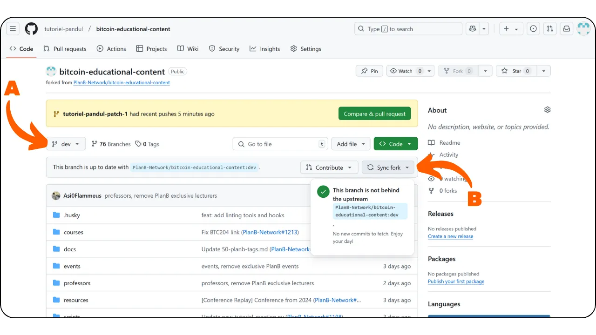

- Nếu bạn có bất kỳ nhận xét, câu hỏi hoặc bình luận nào về dự án này, vui lòng gửi tin nhắn trực tiếp [đến nhóm Telegram của những người đóng góp](https://t.me/PlanBNetwork_ContentBuilder).