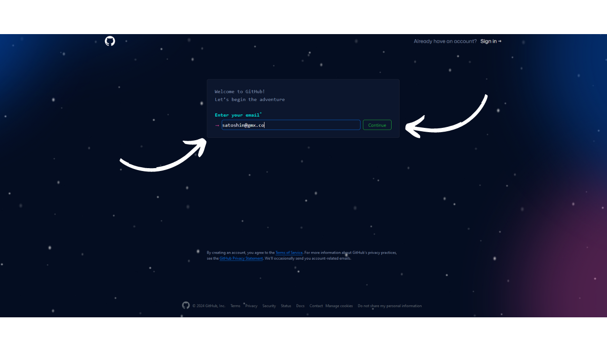
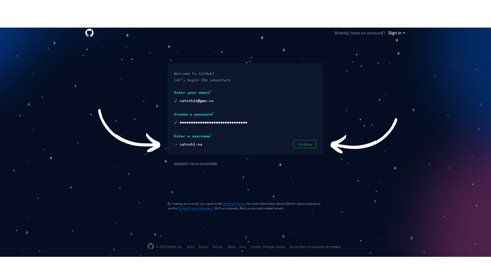
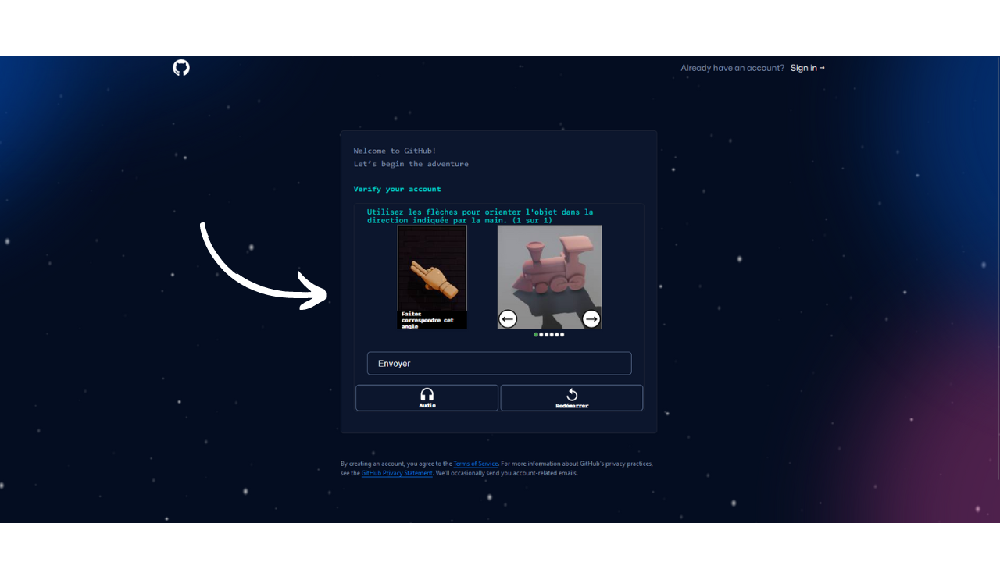
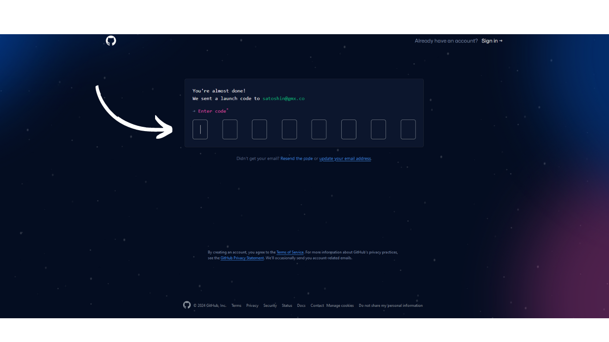
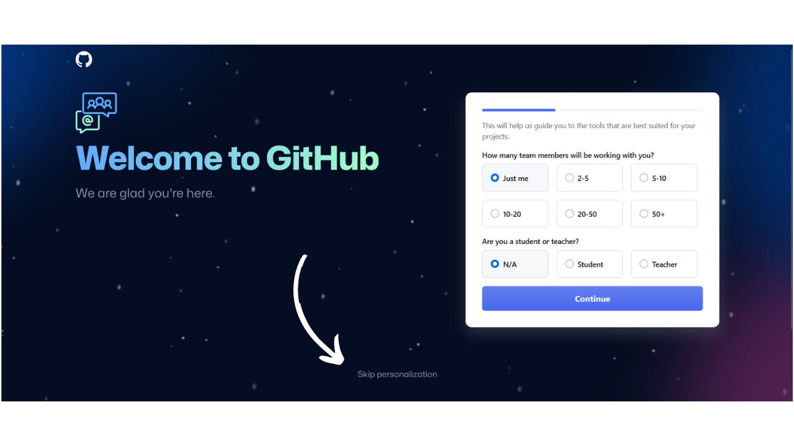
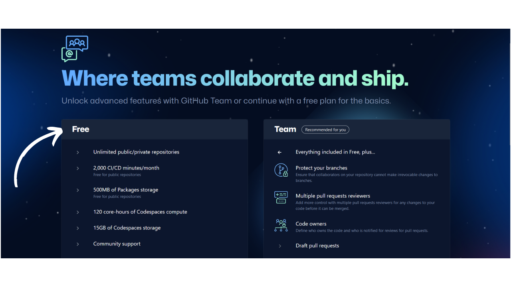
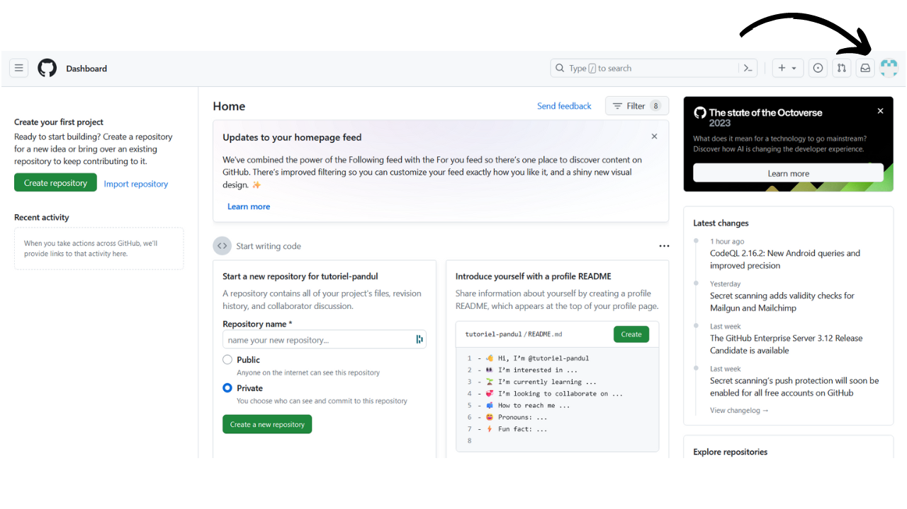
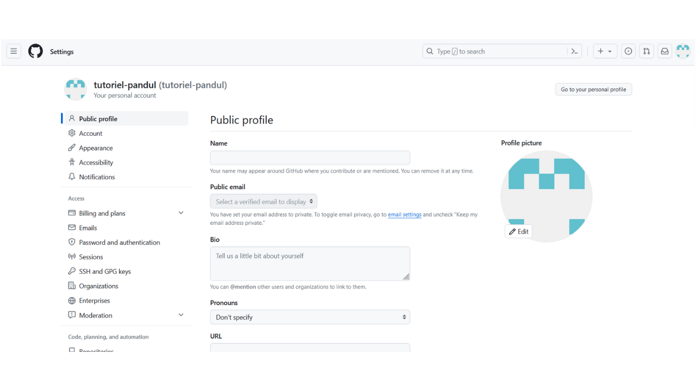
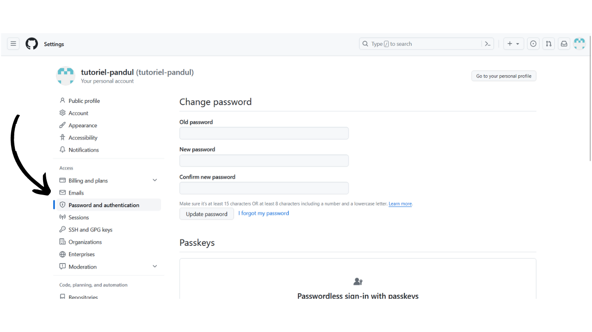

Plan ₿ का मिशन है Bitcoin के बारे में उच्च-स्तरीय शैक्षिक संसाधन प्रदान करना, जो जितनी अधिक भाषाओं में संभव हो सके उपलब्ध हों। साइट पर प्रकाशित सभी सामग्री ओपन-सोर्स है और GitHub पर होस्ट की गई है, जिससे किसी को भी इस प्लेटफॉर्म को समृद्ध बनाने में योगदान करने का अवसर मिलता है। योगदान कई रूपों में हो सकता है: मौजूदा पाठों को सुधारना और प्रूफरीड करना, अन्य भाषाओं में अनुवाद करना, जानकारी को अपडेट करना, या हमारी साइट पर अभी तक उपलब्ध नहीं नए ट्यूटोरियल बनाना।

अगर आप Plan ₿ Network में योगदान देना चाहते हैं, तो आपको Git और GitHub का उपयोग करना होगा। अगर ये टूल्स आपके लिए नए हैं या इनका काम करना आपको समझ नहीं आता, तो घबराने की जरूरत नहीं है, यह लेख आपके लिए ही है! हम साथ में Git और GitHub की बुनियादी बातें और उनसे जुड़े तकनीकी शब्दावली की समीक्षा करेंगे, ताकि आप इन्हें बाद में प्रभावी ढंग से उपयोग कर सकें।

## Git एक वर्जन कंट्रोल सिस्टम है जो प्रोग्रामिंग और सॉफ्टवेयर डेवलपमेंट में इस्तेमाल होता है। यह डेवलपर्स को उनके कोड में बदलाव को ट्रैक करने, अलग-अलग वर्जन को मैनेज करने और टीम के साथ सहयोग करने में मदद करता है। Git के जरिए आप अपने प्रोजेक्ट के इतिहास को देख सकते हैं, पुराने वर्जन पर वापस जा सकते हैं और अलग-अलग फीचर्स पर काम करने के लिए ब्रांच बना सकते हैं। यह ओपन-सोर्स है और बहुत ही पॉपुलर टूल है, खासकर जब टीम में कई लोग एक साथ काम कर रहे हों।

Git एक संस्करण नियंत्रण प्रणाली है, जिसे विशेष रूप से सॉफ्टवेयर परियोजनाओं को प्रबंधित करने के लिए डिज़ाइन किया गया है। 2005 में लिनस टॉर्वाल्ड्स द्वारा बनाया गया, Git जल्दी ही सॉफ्टवेयर विकास उद्योग में संस्करण नियंत्रण के लिए मानक बन गया है। लेकिन इसका वास्तव में मतलब क्या है?

मूल रूप से, Git डेवलपर्स को किसी प्रोजेक्ट के सोर्स कोड में समय के साथ किए गए बदलावों को ट्रैक करने की सुविधा देता है। इसका मतलब है कि कोड में हर बदलाव के साथ, Git प्रोजेक्ट का एक नया संस्करण रिकॉर्ड करता है। अगर कोई गलती हो जाती है या कोई प्रयोगात्मक फीचर उम्मीद के मुताबिक काम नहीं करता, तो कोड की पिछली स्थिति में वापस जाना संभव है, जैसे फाइलों के लिए एक टाइम मशीन।

Git की एक मुख्य विशेषता शाखा प्रबंधन है। एक शाखा एक तरह की समानांतर रेखा होती है जहाँ डेवलपर्स बाकी प्रोजेक्ट से स्वतंत्र रूप से काम कर सकते हैं। इससे नए फीचर्स जोड़ने या बग्स को ठीक करने में काफी आसानी होती है, बिना मुख्य कोड को प्रभावित किए। जब संशोधन परीक्षण और सत्यापित हो जाते हैं, तो उन्हें मुख्य शाखा के साथ मिला दिया जाता है।

Git की एक खासियत यह है कि यह वितरित तरीके से काम कर सकता है। हर डेवलपर के पास अपने कंप्यूटर के Hard ड्राइव पर प्रोजेक्ट की पूरी कॉपी होती है, जिससे वे ऑफलाइन काम कर सकते हैं और बाद में इंटरनेट कनेक्शन उपलब्ध होने पर बदलावों को मर्ज कर सकते हैं। इससे टकराव का खतरा कम होता है और कई डेवलपर्स एक ही प्रोजेक्ट पर एक साथ काम कर सकते हैं बिना एक-दूसरे के काम में बाधा डाले।

शुरुआत में, Git को मुख्य रूप से सॉफ्टवेयर डेवलपमेंट प्रोजेक्ट्स के लिए डिज़ाइन किया गया था। हालांकि, इसे कंटेंट राइटिंग प्रोजेक्ट्स को मैनेज करने के लिए भी इस्तेमाल किया जा सकता है। कोड पर सहयोग करने के बजाय, हम टेक्स्ट पर सहयोग करते हैं। और यही तरीका Plan ₿ Network ने अपने कंटेंट को मैनेज करने के लिए अपनाया है! Git लेखन पाठ्यक्रमों और ट्यूटोरियल्स पर सहयोग को आसान बनाता है, क्योंकि यह बदलावों को सटीक रूप से ट्रैक करने, प्रभावी संस्करण प्रबंधन की सुविधा देता है, और अन्य योगदानकर्ताओं द्वारा कंटेंट की समीक्षा और सुधार को भी सक्षम बनाता है।

## GitHub एक ऑनलाइन प्लेटफ़ॉर्म है जहाँ प्रोग्रामर और डेवलपर्स अपने कोड को स्टोर, साझा और सहयोग कर सकते हैं। यह गिट नामक वर्शन कंट्रोल सिस्टम का उपयोग करता है, जिससे कई लोग एक साथ एक ही प्रोजेक्ट पर काम कर सकते हैं और कोड में बदलाव को ट्रैक कर सकते हैं। इसके अलावा, GitHub पर आप ओपन-सोर्स प्रोजेक्ट्स को एक्सप्लोर कर सकते हैं, दूसरों के प्रोजेक्ट्स में योगदान कर सकते हैं और अपने खुद के प्रोजेक्ट्स को दुनिया के सामने प्रस्तुत कर सकते हैं।

GitHub एक स्रोत कोड प्रबंधन और होस्टिंग प्लेटफॉर्म है जो हमने अभी चर्चा की गई Git संस्करण नियंत्रण प्रणाली पर आधारित है। 2008 में लॉन्च होने के बाद, GitHub ने तेजी से लोकप्रियता हासिल की और यह दुनिया भर के डेवलपर्स के लिए एक महत्वपूर्ण संदर्भ बन गया है। लेकिन GitHub Git से कैसे अलग है, और यह हमारे सामग्री उत्पादन विधि में इतना महत्वपूर्ण क्यों है?

पहले, यह समझना ज़रूरी है कि GitHub, Git पर आधारित है (जिसके बारे में हमने पिछले भाग में चर्चा की थी)। Git वह टूल है जो कोड में होने वाले बदलावों को ट्रैक करता है, जबकि GitHub एक ऑनलाइन सेवा है जो इस कोड को होस्ट, साझा और प्रबंधित करती है।

कल्पना करें कि Git एक तरह की लॉगबुक है जिसे हर डेवलपर अपने कंप्यूटर पर अपने प्रोजेक्ट में हुए सभी बदलावों को रिकॉर्ड करने के लिए इस्तेमाल करता है। दूसरी ओर, GitHub एक सार्वजनिक पुस्तकालय की तरह है जहाँ ये सभी लॉगबुक साझा की जा सकती हैं, उनकी तुलना की जा सकती है, और उन्हें मिलाया जा सकता है।

Git और GitHub के बीच का मूल अंतर उनके कार्य में है: Git एक टूल है जिसे प्रत्येक डेवलपर अपने कंप्यूटर पर कोड के विभिन्न संस्करणों को प्रबंधित करने के लिए उपयोग करता है, जबकि GitHub एक ऑनलाइन प्लेटफॉर्म है जो इन संस्करणों को होस्ट करता है और सहयोग को आसान बनाता है।

GitHub सिर्फ एक कोड होस्टिंग सेवा से कहीं ज्यादा है। यह एक सहयोग मंच है जो डेवलपर्स को मिलकर काम करने की सुविधा देता है। वास्तव में, Plan ₿ Network इस मंच का उपयोग न केवल वेबसाइट को चलाने वाले सभी कोड को होस्ट करने के लिए करता है, बल्कि, और यही हमें दिलचस्पी देता है, सभी सामग्री (ट्यूटोरियल, प्रशिक्षण, संसाधन...) को भी होस्ट करने के लिए करता है।

## कुछ तकनीकी शब्दावली

Git और GitHub पर, आपको कुछ ऐसे कमांड और फीचर्स मिलेंगे जिनके नाम थोड़े जटिल लग सकते हैं। इस अंतिम भाग में, मैं कुछ सरल परिभाषाएँ दूंगा ताकि आप उन तकनीकी शब्दों को समझ सकें जिनसे आप Git और GitHub का उपयोग करते समय मिल सकते हैं:

- Fetch origin: यह एक कमांड है जो किसी रिमोट रिपॉजिटरी से हाल की जानकारी और बदलावों को प्राप्त करता है, लेकिन उन्हें आपके स्थानीय काम के साथ मर्ज नहीं करता। यह आपके स्थानीय रिपॉजिटरी को रिमोट रिपॉजिटरी में मौजूद नई शाखाओं और कमिट्स के साथ अपडेट करता है।
- पुल ओरिजिन:** यह एक कमांड है जो किसी रिमोट रिपॉजिटरी से अपडेट्स को प्राप्त करता है और उन्हें तुरंत आपके लोकल ब्रांच में जोड़ देता है ताकि दोनों सिंक्रोनाइज़ हो सकें। यह कमांड फेच और मर्ज के स्टेप्स को एक साथ मिलाकर एक ही कमांड में कर देता है।
- सिंक Fork: यह GitHub पर एक सुविधा है जो आपको किसी प्रोजेक्ट के Fork को स्रोत रिपॉजिटरी से नवीनतम बदलावों के साथ अपडेट करने की अनुमति देती है। इससे यह सुनिश्चित होता है कि आपके पास प्रोजेक्ट की कॉपी मुख्य विकास के साथ अद्यतित बनी रहे।
- पुश ओरिजिन:** यह कमांड आपके स्थानीय बदलावों को एक रिमोट रिपॉजिटरी पर भेजने के लिए उपयोग की जाती है।
- पुल रिक्वेस्ट:** यह एक अनुरोध होता है जो किसी योगदानकर्ता द्वारा भेजा जाता है, यह दर्शाने के लिए कि उन्होंने किसी रिमोट रिपॉजिटरी की एक शाखा में बदलाव किए हैं और चाहते हैं कि इन बदलावों की समीक्षा की जाए और संभवतः इन्हें रिपॉजिटरी की मुख्य शाखा में मिला दिया जाए।
- कमिट:** आपके बदलावों को सुरक्षित करना। एक कमिट आपके काम का एक तात्कालिक स्नैपशॉट जैसा होता है, जो आपको बदलावों का इतिहास रखने की सुविधा देता है। हर कमिट में एक वर्णनात्मक संदेश होता है जो बताता है कि क्या-क्या बदला गया है।
- ब्रांच:** यह रिपॉजिटरी का एक समानांतर संस्करण होता है, जो आपको मुख्य ब्रांच (जिसे अक्सर "मेन" या "मास्टर" कहा जाता है) को प्रभावित किए बिना बदलावों पर काम करने की अनुमति देता है। ब्रांचें नई विशेषताओं के विकास और बग्स को ठीक करने में मदद करती हैं, बिना स्थिर कोड को बाधित करने के जोखिम के।
- मर्ज करना: मर्ज करने का मतलब होता है एक शाखा से दूसरी शाखा में बदलावों को जोड़ना। इसका उपयोग तब किया जाता है जब, उदाहरण के लिए, किसी कार्यशील शाखा के बदलावों को मुख्य शाखा में जोड़ा जाता है, जिससे विभिन्न योगदानों को शामिल किया जा सके।
- Fork: किसी रिपॉजिटरी को फोर्क करना मतलब उस रिपॉजिटरी की एक कॉपी अपने खुद के GitHub अकाउंट पर बनाना होता है। इससे आप प्रोजेक्ट पर काम कर सकते हैं बिना मूल रिपॉजिटरी को प्रभावित किए। Fork या तो अपनी अलग दिशा में जा सकता है और मूल प्रोजेक्ट से अलग बन सकता है, या फिर वह नियमित रूप से मूल प्रोजेक्ट के साथ समन्वय कर सकता है ताकि उसमें योगदान दे सके।
- क्लोन:** किसी रिपॉजिटरी को क्लोन करने का मतलब है कि आप अपने कंप्यूटर पर उसकी एक स्थानीय कॉपी बना रहे हैं। इससे आपको सभी फाइलों और उनके इतिहास तक पहुंच मिलती है। यह आपको प्रोजेक्ट पर सीधे स्थानीय रूप से काम करने की सुविधा देता है।
- रेपोजिटरी:** GitHub पर किसी प्रोजेक्ट के लिए स्टोरेज स्पेस। एक रेपोजिटरी में प्रोजेक्ट की सभी फाइलें होती हैं और साथ ही उसमें किए गए सभी बदलावों का इतिहास भी होता है। यह GitHub पर स्टोरेज और सहयोग का आधार होती है।
- इश्यू:** GitHub पर कार्यों और बग्स को ट्रैक करने के लिए एक टूल। इश्यूज का उपयोग समस्याओं की रिपोर्ट करने, सुधारों का प्रस्ताव देने, या नई विशेषताओं पर चर्चा करने के लिए किया जाता है। प्रत्येक इश्यू को असाइन किया जा सकता है, लेबल किया जा सकता है, और उस पर टिप्पणी की जा सकती है।

यह सूची स्पष्ट रूप से संपूर्ण नहीं है। Git और GitHub से संबंधित कई अन्य तकनीकी शब्द भी हैं। हालांकि, यहाँ बताए गए शब्द वे मुख्य हैं जिनसे आप अक्सर सामना करेंगे।

इस लेख को पढ़ने के बाद, यह संभव है कि Git और GitHub के कुछ पहलू अभी भी आपके लिए स्पष्ट न हों, इसलिए मैं आपको प्रोत्साहित करता हूँ कि आप खुद इन टूल्स का उपयोग करना शुरू करें। अभ्यास अक्सर यह समझने का सबसे अच्छा तरीका होता है कि मशीन कैसे काम करती है! और शुरुआत करने के लिए, आप इन 2 अन्य ट्यूटोरियल्स को देख सकते हैं:

## GitHub अकाउंट बनाने के लिए आपको कुछ सरल कदमों का पालन करना होगा। यहाँ पर बताया गया है कि आप कैसे एक GitHub अकाउंट बना सकते हैं:

1. **वेबसाइट पर जाएं**: सबसे पहले अपने वेब ब्राउज़र में GitHub की आधिकारिक वेबसाइट (https://github.com) खोलें।

2. **साइन अप करें**: वेबसाइट पर पहुँचने के बाद, आपको "Sign up" या "साइन अप" का बटन दिखाई देगा। उस पर क्लिक करें।

3. **जानकारी भरें**: अब आपको एक फॉर्म दिखाई देगा जिसमें आपको अपनी ईमेल आईडी, एक यूज़रनेम और पासवर्ड डालना होगा। ध्यान रखें कि आपका यूज़रनेम यूनिक होना चाहिए।

4. **वेरिफिकेशन**: इसके बाद, आपको एक वेरिफिकेशन प्रक्रिया से गुजरना होगा। यह प्रक्रिया आपके द्वारा दिए गए ईमेल पर एक वेरिफिकेशन लिंक भेजकर पूरी की जाती है। अपने ईमेल इनबॉक्स में जाकर उस लिंक पर क्लिक करें।

5. **प्लान चुनें**: वेरिफिकेशन के बाद, आपको GitHub के विभिन्न प्लान्स में से एक चुनने के लिए कहा जाएगा। आप फ्री प्लान का चयन कर सकते हैं, जो शुरुआती लोगों के लिए पर्याप्त होता है।

6. **प्रोफाइल सेट करें**: अब आप अपनी प्रोफाइल सेट कर सकते हैं। इसमें आप अपनी फोटो, बायो और अन्य जानकारी जोड़ सकते हैं।

7. **अकाउंट तैयार**: अब आपका GitHub अकाउंट तैयार है और आप इसका उपयोग शुरू कर सकते हैं।

बस, इतना ही! अब आप GitHub पर अपने प्रोजेक्ट्स को होस्ट कर सकते हैं और अन्य डेवलपर्स के साथ सहयोग कर सकते हैं।

यदि आप PlanB नेटवर्क में योगदान देना चाहते हैं, तो आपके पास एक GitHub खाता होना चाहिए। इस ट्यूटोरियल में, हम आपको चरण दर चरण मार्गदर्शन करेंगे कि कैसे अपना खाता बनाएं, उसे सेट करें और उसे सही तरीके से सुरक्षित करें।

- [https://github.com/signup](https://github.com/signup) पर जाएं।
- अपना ईमेल Address में दर्ज करें, फिर Green `Continue` बटन पर क्लिक करें।

- एक मजबूत पासवर्ड चुनें, फिर Green `Continue` बटन पर क्लिक करें।

- अब, अपना उपयोगकर्ता नाम चुनें। आप अपनी असली पहचान प्रकट कर सकते हैं, या एक उपनाम का उपयोग कर सकते हैं। फिर, Green `Continue` बटन पर क्लिक करें।

- कैप्चा पूरा करें:

- आपको एक ईमेल भेजा जाएगा जिसमें एक पुष्टि कोड होगा; आपको अपने खाते को अंतिम रूप देने के लिए इसे दर्ज करना होगा।

- यदि आप चाहते हैं कि GitHub आपको कुछ विशेष टूल्स की ओर मार्गदर्शन करे, तो प्रश्नों को भरें, या 'व्यक्तिगतकरण छोड़ें' पर क्लिक करें।

- `फ्री में जारी रखें` बटन पर क्लिक करके मुफ्त योजना चुनें:

- इसके बाद आपको आपके डैशबोर्ड पर ले जाया जाएगा।
- अगर आप चाहें, तो अपनी प्रोफ़ाइल पिक्चर पर क्लिक करके, जो स्क्रीन के ऊपर दाईं ओर है, `सेटिंग्स` मेन्यू में जाकर अपने अकाउंट को कस्टमाइज़ कर सकते हैं।

- इस भाग में, आपके पास नया प्रोफाइल चित्र जोड़ने, नाम चुनने, अपनी जीवनी को अनुकूलित करने, या अपनी व्यक्तिगत वेबसाइट का लिंक जोड़ने का विकल्प है।

- मैं आपको सलाह देता हूँ कि `पासवर्ड और प्रमाणीकरण` मेनू में जाकर कम से कम दो-स्तरीय प्रमाणीकरण सेट करें।

