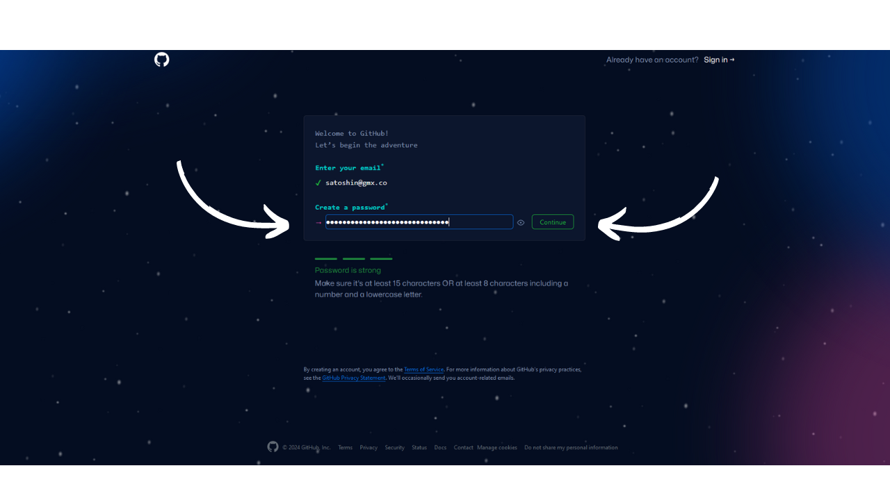

PlanBのミッションは、Bitcoinに関する最高水準の教育リソースをできるだけ多くの言語で提供することです。サイトに公開されているすべてのコンテンツはオープンソースであり、GitHub上でホストされており、誰でもプラットフォームの充実に貢献する機会を得られます。貢献は、既存のテキストの修正や校正、他の言語への翻訳、情報の更新、または当サイトにまだない新しいチュートリアルの作成など、さまざまな形を取り得ます。

PlanBネットワークに貢献したい場合は、GitとGitHubを使用する必要があります。これらのツールが不慣れである場合や、その操作が不透明に思える場合でも、慌てる必要はありません。この記事があなたのためのものです！私たちは一緒にGitとGitHubの基本、および関連する技術用語を見直し、その後これらのツールを効果的に使用できるようにします。

## Gitとは何か？

Gitは、ソフトウェアプロジェクトを管理するために特別に設計されたバージョン管理システムです。2005年にLinus Torvaldsによって作成されたGitは、バージョン管理においてソフトウェア開発業界の標準となりました。しかし、それは具体的に何を意味するのでしょうか？

根本的に、Gitは開発者が時間をかけてプロジェクトのソースコードに加えられた変更を追跡できるようにします。これは、コードに変更が加えられるたびに、Gitがプロジェクトの新しいバージョンを記録することを意味します。エラーが発生した場合や、実験的な機能が期待通りに動作しない場合、ファイルのタイムマシンのように、コードの以前の状態に戻ることが可能です。

Gitの主要な特徴の一つはブランチ管理です。ブランチは、開発者がプロジェクトの残りの部分から独立して作業できるような並行線の一種です。これにより、新機能の追加やバグの修正が主要なコードを乱すことなく大幅に容易になります。修正がテストされて承認されると、それらはメインブランチとマージすることができます。

Gitの特異性の一つは、分散型で動作する能力です。各開発者は自分のコンピュータのハードドライブ上にプロジェクトの完全なコピーを持っており、インターネット接続が利用可能になったときに後で変更をマージすることができます。これにより、競合のリスクが減少し、複数の開発者が同じプロジェクトで同時に作業しても足を踏み入れることなく作業できます。
当初、Gitは主にソフトウェア開発プロジェクト用に設計されました。しかし、コンテンツライティングプロジェクトの管理にも使用できます。コードに協力する代わりに、テキストに協力します。そして、正確にこの方法がPlanBネットワークがコンテンツを管理するために採用した方法です！Gitは、変更の正確な追跡、効率的なバージョン管理を可能にし、他の貢献者によるコンテンツのレビューと改善も可能にします。
## GitHubとは何か？

GitHubは、先ほど議論したGitバージョン管理システムに基づくソースコード管理およびホスティングプラットフォームです。2008年に立ち上げられたGitHubはすぐに人気を博し、世界中の開発者にとって不可欠な参照点となりました。しかし、GitHubはGitとどのように異なり、なぜ私たちのコンテンツ制作方法にとって非常に重要なのでしょうか？

まず、GitHubがGit（前のセクションで議論した）に基づいて構築されていることを理解することが重要です。Gitがコード変更を追跡するツールであるのに対し、GitHubはこのコードをホスト、共有、管理するオンラインサービスです。

Gitを、各開発者が自分のコンピュータ上でプロジェクトのすべての変更を記録するために使用する種類のログブックと考えてください。一方、GitHubは、これらのログブックが共有、比較、組み合わせられる公共の図書館のようなものです。
GitとGitHubの根本的な違いは、その機能にあります：Gitは各開発者がローカルでコードバージョンを管理するために使用されるツールであり、GitHubはこれらのバージョンをホストし、協力を促進するオンラインプラットフォームです。
GitHubは、単なるコードホスティングサービス以上のものです。これは開発者が効率的に共同作業を行うことを可能にする協力プラットフォームです。そして実際に、PlanB Networkはこのプラットフォームを使用して、ウェブサイトを動かすすべてのコードだけでなく、私たちが関心を持っているすべてのコンテンツ（チュートリアル、トレーニング、リソースなど）をホストしています。

## いくつかの技術用語

GitとGitHubでは、名前が複雑に見えるかもしれないコマンドや機能に出会うことになります。この最後の部分では、GitとGitHubを使用する際に出会うかもしれない技術用語を理解するための簡単な定義を提供します：

- **Fetch origin:** リモートリポジトリから最近の情報と変更を取得し、それらをローカルの作業とマージせずに更新するコマンド。リモートリポジトリに存在する新しいブランチとコミットでローカルリポジトリを更新します。

- **Pull origin:** リモートリポジトリから更新を取得し、それを直ちにローカルブランチに統合して同期させるコマンド。これはfetchとmergeのステップを1つのコマンドに組み合わせます。
- **Sync Fork:** GitHub上の機能で、プロジェクトのフォークをソースリポジトリの最新の変更で更新することができます。これにより、プロジェクトのコピーがメイン開発と同期した状態を保つことができます。
- **Push origin:** ローカルの変更をリモートリポジトリに送信するために使用されるコマンド。

- **Pull Request:** コントリビューターがリモートリポジトリのブランチに変更をプッシュしたことを示し、これらの変更がレビューされ、リポジトリのメインブランチに可能性としてマージされることを希望するリクエスト。

- **Commit:** 変更を保存します。コミットは、与えられた瞬間の作業の瞬間的なスナップショットのようなもので、変更の履歴を保持することを可能にします。各コミットには、何が変更されたかを説明する記述メッセージが含まれます。

- **Branch:** リポジトリの並行バージョンで、メインブランチ（通常は「main」または「master」と呼ばれます）に影響を与えることなく変更に取り組むことができます。ブランチは、新機能の開発とバグの修正を安定したコードを乱すリスクなしに容易にします。

- **Merge:** 一つのブランチから別のブランチへの変更を統合することです。例えば、作業ブランチからメインブランチに変更を追加するために使用され、様々な貢献を追加することができます。

- **Fork:** リポジトリをフォークするとは、そのリポジトリのコピーを自分のGitHubアカウント上に作成することを意味し、オリジナルのリポジトリに影響を与えることなくプロジェクトに取り組むことができます。フォークは、オリジナルのプロジェクトとは異なるプロジェクトになるか、またはオリジナルのプロジェクトに貢献するために定期的に同期することができます。

- **Clone:** リポジトリをクローンするとは、コンピューター上にローカルコピーを作成することを意味し、すべてのファイルと履歴にアクセスできるようになります。これにより、直接ローカルでプロジェクトに取り組むことができます。

- **Repository:** GitHub上のプロジェクトのためのストレージスペース。リポジトリには、プロジェクトファイルすべてとそれに対して行われたすべての変更の履歴が含まれます。これは、GitHub上のストレージと協力の基盤です。

- **Issue:** GitHub上でタスクとバグを追跡するためのツール。Issueは、問題の報告、改善の提案、または新機能の議論を可能にします。各Issueは割り当てられ、ラベル付けされ、コメントされることができます。

このリストは明らかに網羅的ではありません。GitとGitHubに特有の他の多くの技術用語があります。しかし、ここで言及されているものは、頻繁に遭遇する主なものです。

## GitHubアカウントの作成方法

PlanBネットワークに貢献したい場合は、GitHubアカウントが必要になります。このチュートリアルでは、自分のアカウントを作成し、設定し、適切にセキュリティを確保する方法をステップバイステップで案内します。

- [https://github.com/signup](https://github.com/signup)にアクセスします。
- メールアドレスを入力し、緑の`Continue`ボタンをクリックします：

- 強力なパスワードを選択し、緑の`Continue`ボタンをクリックします：

- 次に、ユーザー名を選択します。本名を公開することも、偽名を使用することもできます。その後、緑の`Continue`ボタンをクリックします：

- Captchaを完了します：

- 確認コードが記載されたメールが送られてきます。アカウント作成を完了するためには、そのコードを入力する必要があります：

- GitHubが特定のツールへの案内を希望する場合は質問に回答するか、`skip personalization`をクリックしてスキップします：

- `Continue for free`ボタンをクリックして無料プランを選択します：

- その後、ダッシュボードにリダイレクトされます。
- 必要に応じて、画面右上にあるプロフィール写真をクリックし、`Settings`メニューにアクセスしてアカウントをカスタマイズすることができます：

- このセクションでは、新しいプロフィール写真を追加したり、名前を選択したり、自己紹介をカスタマイズしたり、個人のウェブサイトへのリンクを追加するオプションがあります：

- また、`Password and authentication`メニューを訪れて、少なくとも二要素認証を設定することをお勧めします：

