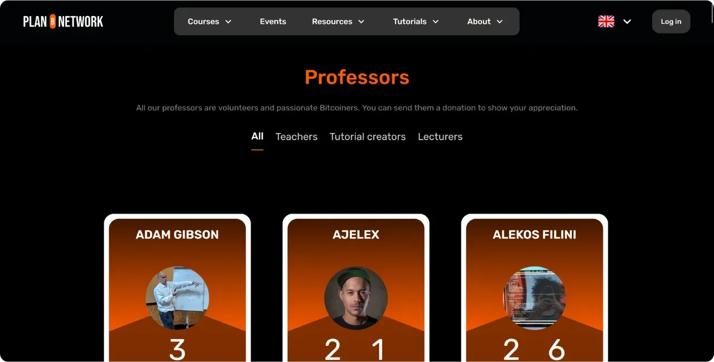

Pokud máte v plánu přispět do Plan ₿ Network vytvořením nového výukového kurzu, budete potřebovat profil učitele. Tento profil vám umožní získat příslušné kredity za obsah, kterým do platformy přispíváte.

Ti z vás, kteří se již podíleli na tvorbě vzdělávacího obsahu na Plan ₿ Network, již pravděpodobně mají profil učitele. Najdete ho ve složce `/profesoři` [v našem úložišti GitHub](https://github.com/PlanB-Network/Bitcoin-educational-content/tree/dev/professors). Pokud váš profil již existuje, najděte své přihlašovací údaje v souboru `professor.yml`.

Chcete-li provést změny ve svém profilu, přejděte do části "Úprava profilu učitele" na konci tohoto návodu.

## Přidání nového učitele pomocí našeho softwaru

Nejjednodušší způsob, jak si vytvořit profil učitele v Plan ₿ Network, je použít náš integrovaný nástroj Python. Funguje to takto.

### 1 - Konfigurace místního prostředí

Musíte mít vlastní Fork z [repozitáře Plan ₿ Network na GitHubu](https://github.com/PlanB-Network/Bitcoin-educational-content).

Synchronizujte hlavní větev (`dev`) svého Fork se zdrojovým úložištěm.

Aktualizujte svůj místní klon.

```bash
# Cloner votre fork (si ce n'est pas déjà fait)
git clone https://github.com/<username>/bitcoin-educational-content.git
cd bitcoin-educational-content
# Ajouter le dépôt source en tant que remote upstream
git remote add upstream https://github.com/PlanB-Network/bitcoin-educational-content.git
# Récupérer les dernières modifications depuis le dépôt source
git fetch upstream
# Se positionner sur la branche principale 'dev'
git checkout dev
# Fusionner les modifications de la branche 'dev' du dépôt source dans votre fork
git merge upstream/dev
# Pousser les mises à jour vers votre fork sur GitHub
git push origin dev
```

### 2 - Vytvoření nové pobočky

Ujistěte se, že jste ve větvi `dev`. Vytvořte novou větev s popisným názvem (např. `add-professor-loic-morel`).

Zveřejněte tuto pobočku na webu Fork.

```bash
# Assurez-vous d’être sur la branche 'dev'
git checkout dev
# Créez une nouvelle branche avec un nom descriptif
git checkout -b add-professor-loic-morel
# Publiez cette branche sur votre fork en ligne
git push -u origin add-professor-loic-morel
```

### 3 - Vytvoření profilu učitele

Přejděte do složky `scripts/tutorial-related/data-creator/` na svém místním klonu. Ujistěte se, že jste nainstalovali všechny závislosti potřebné pro tento software, přičemž nejprve nainstalujte Python :

```bash
pip install -r requirements.txt
```

Poté spusťte software příkazem :

```bash
python3 main.py
```

Na domovské stránce zadejte místní cestu ke klonu úložiště, jazyk, ve kterém píšete, a své GitHub ID. Pokud tento profil vytváříte pro někoho jiného a již máte profil profesora, zadejte své ID do pole "*PBN Professor's ID*". Pokud vytváříte svůj vlastní profil, nebudete ještě mít ID profesora, protože jste v procesu jeho vytváření, takže toto pole nechte prázdné.

Poté klikněte na tlačítko "*Nový profesor*".


Vyplňte požadované informace (upozorňujeme, že všechny tyto informace budou veřejné na naší platformě i na GitHubu) :


- Název souboru učitele (použijte své jméno a příjmení nebo pseudonym, malá písmena) ;
- Vaše jméno nebo přezdívka ;
- Náhodné generování přihlašovacích údajů ;
- Vaše webové stránky a profil X (nepovinné) ;
- Blesk Address pro příjem darů od čtenářů (nepovinné) ;
- Ze seznamu vyberte 2 nebo 3 značky;
- Kliknutím na "*Vybrat obrázek*" vyberte profilový obrázek z místních složek (pro obrázek lze použít libovolný název a formát a software jej automaticky přizpůsobí. Jen se ujistěte, že je obrázek čtvercový);
- Napište krátký popis svého profilu.

Vytvoření dokončíte kliknutím na "*Vytvořit profesora*". Tím se automaticky vytvoří všechny soubory generate potřebné pro váš profil.


Uložte své změny lokálně vytvořením revize s vysvětlující zprávou. Změny odešlete na Fork GitHub.

```bash
# Créez un commit avec un message descriptif
git commit -m "*new professor Loïc Morel*"
# Poussez vos modifications sur votre fork
git push origin add-professor-loic-morel
```

Po dokončení vytvořte na GitHubu žádost o stažení (PR) a navrhněte integraci svých úprav. Do PR přidejte název a stručný popis.

### 4 - Korektury a slučování

Vyčkejte na potvrzení nebo zpětnou vazbu od správce. V případě potřeby proveďte opravy a odešlete nové revize.

```bash
# Créez un commit décrivant les corrections apportées
git commit -m "*Corrections suite à la revue du tutoriel green-wallet*"
# Poussez les corrections sur votre fork
git push origin add-professor-loic-morel
```

Po sloučení PR můžete pracovní větev odstranit.

## Úprava profilu učitele

Pokud jste si osvojili používání systému Git, upravte svůj profil učitele vytvořením nové větve a úpravou příslušného souboru přímo ve stávající složce. Změny můžete provést buď v souboru `professor.yml`, nebo v souboru markdown, v závislosti na informacích, které je třeba opravit. Jakmile provedete změny lokálně, odešlete je do Fork a odešlete PR.

Začátečníkům doporučuji provést úpravu přímo prostřednictvím webu Interface na GitHubu. Ujistěte se, že máte účet GitHub. Pokud nevíte, jak ho vytvořit, postupujte podle tohoto návodu :

https://planb.network/tutorials/contribution/others/create-github-account-a75fc39d-f0d0-44dc-9cd5-cd94aee0c07c
Přejděte na [úložiště GitHub Plan ₿ Network věnované datům](https://github.com/PlanB-Network/Bitcoin-educational-content/graphs/contributors).


Klikněte na složku "*profesoři*" a přejděte do své osobní složky.


Chcete-li změnit metadata svého profilu, například Lightning Address, jméno nebo odkazy, vyberte soubor "*professor.yml*". Chcete-li změnit svůj popis, klikněte na soubor YAML pro svůj jazyk (např. "*en.yml*" nebo "*fr.yml*").

Pokud popis upravujete, nezapomeňte odstranit všechny zastaralé překlady. Pak se můžete buď postarat o překlad svého popisu do ostatních jazyků s pomocí LLM, nebo ponechat pouze popis ve svém rodném jazyce a ve své žádosti Pull Request uvést, že váš popis vyžaduje překlad naším týmem.


Jakmile se dostanete k souboru, který chcete upravit, klikněte na ikonu tužky.


Pokud ještě nemáte soubor Fork z úložiště Plan ₿ Network, GitHub vám doporučí jeho vytvoření. Klikněte na "*Fork this repository*".


Proveďte požadované změny v souboru. Po dokončení klikněte na "*Odeslat změny*".


Zadejte zprávu popisující vaši změnu a vyberte možnost "*Návrh změn*".


Zobrazí se souhrn změn. Pokud chcete ve svém profilu provést další změny, můžete se vrátit do složek a provést další revize. Až budete hotovi, klikněte na "*Vytvořit požadavek na stažení*".

Požadavek na stažení je požadavek na začlenění změn z vaší větve do hlavní větve úložiště Plan ₿ Network, který umožňuje kontrolu a diskusi o změnách před jejich sloučením.


Ujistěte se, že na začátku Interface je vaše pracovní větev sloučena s větví `dev` repozitáře Plan ₿ Network (což je hlavní větev).

Zadejte název, který stručně shrnuje změny, které chcete sloučit se zdrojovým úložištěm. Přidejte stručný komentář popisující tyto změny a poté kliknutím na tlačítko Green "*Vytvořit požadavek na stažení*" potvrďte požadavek na stažení:


Vaše PR se pak zobrazí na kartě "*Pull Request*" v hlavním úložišti Plan ₿ Network. Nyní stačí počkat, až správce vaši úpravu sloučí.


Pokud při odesílání změn narazíte na technické potíže, neváhejte požádat o pomoc na [naší skupině Telegramu věnované příspěvkům](https://t.me/PlanBNetwork_ContentBuilder). Moc vám děkujeme!