Wenn Sie einen Beitrag zu Plan ₿ Network leisten möchten, indem Sie ein neues Lernprogramm oder einen neuen Kurs schreiben, benötigen Sie ein Lehrerprofil. Dieses Profil ermöglicht es Ihnen, die entsprechenden Credits für die Inhalte zu erhalten, die Sie auf der Plattform bereitstellen.

Diejenigen von Ihnen, die bereits an der Erstellung von Bildungsinhalten auf Plan ₿ Network beteiligt waren, haben wahrscheinlich bereits ein Lehrerprofil. Sie finden es im Ordner `/professors` [in unserem GitHub-Repository] (https://github.com/PlanB-Network/Bitcoin-educational-content/tree/dev/professors). Wenn Ihr Profil bereits existiert, finden Sie Ihr Login in der Datei `professor.yml`.

Um Änderungen an Ihrem Profil vorzunehmen, gehen Sie zum Abschnitt "Bearbeiten Sie Ihr Lehrerprofil" am Ende dieses Tutorials.

## Fügen Sie mit unserer Software einen neuen Lehrer hinzu

Der einfachste Weg, Ihr Lehrerprofil auf Plan ₿ Network zu erstellen, ist die Verwendung unseres integrierten Python-Tools. So funktioniert es.

### 1 - Konfigurieren Sie Ihre lokale Umgebung

Sie müssen Ihr eigenes Fork aus dem [Plan ₿ Network-Repository auf GitHub] (https://github.com/PlanB-Network/Bitcoin-educational-content) haben.

Synchronisieren Sie den Hauptzweig (`dev`) Ihres Fork mit dem Quell-Repository.

Aktualisieren Sie Ihren lokalen Klon.

```bash
# Cloner votre fork (si ce n'est pas déjà fait)
git clone https://github.com/<username>/bitcoin-educational-content.git
cd bitcoin-educational-content
# Ajouter le dépôt source en tant que remote upstream
git remote add upstream https://github.com/PlanB-Network/bitcoin-educational-content.git
# Récupérer les dernières modifications depuis le dépôt source
git fetch upstream
# Se positionner sur la branche principale 'dev'
git checkout dev
# Fusionner les modifications de la branche 'dev' du dépôt source dans votre fork
git merge upstream/dev
# Pousser les mises à jour vers votre fork sur GitHub
git push origin dev
```

### 2 - Einen neuen Zweig erstellen

Vergewissern Sie sich, dass Sie auf dem `dev`-Zweig sind. Erstellen Sie einen neuen Zweig mit einem aussagekräftigen Namen (z.B. `add-professor-loic-morel`).

Veröffentlichen Sie diesen Zweig in Ihrem Fork online.

```bash
# Assurez-vous d’être sur la branche 'dev'
git checkout dev
# Créez une nouvelle branche avec un nom descriptif
git checkout -b add-professor-loic-morel
# Publiez cette branche sur votre fork en ligne
git push -u origin add-professor-loic-morel
```

### 3 - Erstellen Sie Ihr Lehrerprofil

Wechseln Sie in den Ordner `scripts/tutorial-related/data-creator/` auf Ihrem lokalen Klon. Vergewissern Sie sich, dass Sie alle für die Software erforderlichen Abhängigkeiten installiert haben, nachdem Sie zuerst Python installiert haben:

```bash
pip install -r requirements.txt
```

Starten Sie dann die Software mit dem Befehl :

```bash
python3 main.py
```

Geben Sie auf der Startseite den lokalen Pfad zu Ihrem Repository-Klon, die Sprache, in der Sie schreiben, und Ihre GitHub-ID ein. Wenn Sie dieses Profil für eine andere Person erstellen und bereits ein Professorenprofil haben, geben Sie Ihre ID in das Feld "*PBN Professor's ID*" ein. Wenn Sie Ihr eigenes Profil erstellen, verfügen Sie noch nicht über eine Professor-ID, da Sie gerade dabei sind, eine zu erstellen.

Klicken Sie dann auf die Schaltfläche "*Neuer Professor*".

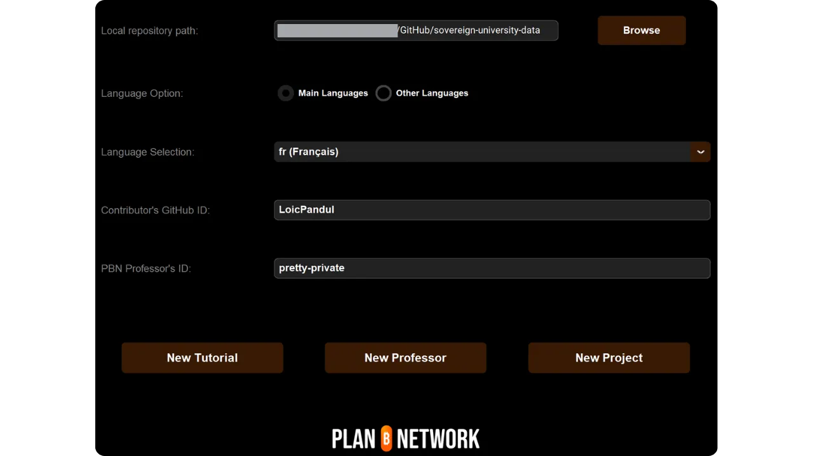

Füllen Sie die erforderlichen Informationen aus (bitte beachten Sie, dass alle diese Informationen sowohl auf unserer Plattform als auch auf GitHub veröffentlicht werden):


- Name der Lehrerakte (Vor- und Nachname oder ein Pseudonym in Kleinbuchstaben) ;
- Ihr Name oder Spitzname ;
- Zufällige Generierung Ihres Logins ;
- Ihre Website und Ihr Profil X (optional) ;
- Ein Lightning Address, um Spenden von Lesern zu erhalten (optional) ;
- Wählen Sie 2 oder 3 Tags aus der Liste aus;
- Klicken Sie auf "*Bild auswählen*", um ein Profilbild aus Ihren lokalen Ordnern auszuwählen (Sie können einen beliebigen Namen und ein beliebiges Format für das Bild verwenden, und die Software passt es automatisch an. Achten Sie nur darauf, dass das Bild quadratisch ist);
- Schreiben Sie eine kurze Beschreibung Ihres Profils.

Schließen Sie die Erstellung ab, indem Sie auf "*Professor erstellen*" klicken. Dadurch werden automatisch alle für Ihr Profil erforderlichen Dateien in generate gespeichert.

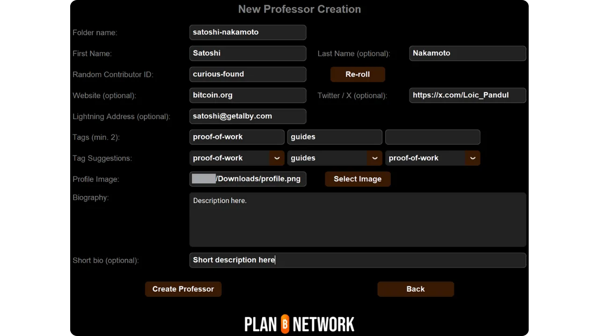

Speichern Sie Ihre Änderungen lokal, indem Sie eine Übergabe mit einer erklärenden Nachricht erstellen. Veröffentlichen Sie die Änderungen auf Ihrem Fork GitHub.

```bash
# Créez un commit avec un message descriptif
git commit -m "*new professor Loïc Morel*"
# Poussez vos modifications sur votre fork
git push origin add-professor-loic-morel
```

Sobald Sie fertig sind, erstellen Sie einen Pull Request (PR) auf GitHub, um die Integration Ihrer Änderungen vorzuschlagen. Fügen Sie dem PR einen Titel und eine kurze Beschreibung hinzu.

### 4 - Korrekturlesen und Zusammenführen

Warten Sie auf die Validierung oder das Feedback eines Administrators. Nehmen Sie ggf. Korrekturen vor und veröffentlichen Sie neue Commits.

```bash
# Créez un commit décrivant les corrections apportées
git commit -m "*Corrections suite à la revue du tutoriel green-wallet*"
# Poussez les corrections sur votre fork
git push origin add-professor-loic-morel
```

Sobald der PR zusammengeführt worden ist, können Sie Ihren Arbeitszweig löschen.

## Ändern Sie Ihr Lehrerprofil

Wenn Sie den Umgang mit Git beherrschen, ändern Sie Ihr Lehrerprofil, indem Sie eine neue Verzweigung erstellen und die entsprechende Datei direkt in Ihrem bestehenden Ordner bearbeiten. Die Änderungen können entweder in der Datei `professor.yml` oder in der Markdown-Datei vorgenommen werden, je nachdem, welche Informationen korrigiert werden müssen. Sobald Sie Ihre Änderungen lokal vorgenommen haben, pushen Sie sie in Ihren Fork und reichen einen PR ein.

Anfängern empfehle ich, die Änderung direkt über das Interface-Web von GitHub vorzunehmen. Stellen Sie sicher, dass Sie ein GitHub-Konto haben. Wenn Sie nicht wissen, wie Sie eines erstellen, folgen Sie diesem Tutorial:

https://planb.network/tutorials/contribution/others/create-github-account-a75fc39d-f0d0-44dc-9cd5-cd94aee0c07c
Gehen Sie zu [dem Plan ₿ Network GitHub-Repository, das den Daten gewidmet ist] (https://github.com/PlanB-Network/Bitcoin-educational-content/graphs/contributors).

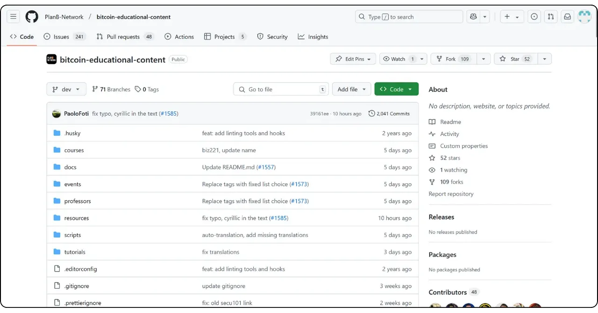

Klicken Sie auf den Ordner "*Professoren*" und gehen Sie dann zu Ihrem persönlichen Ordner.

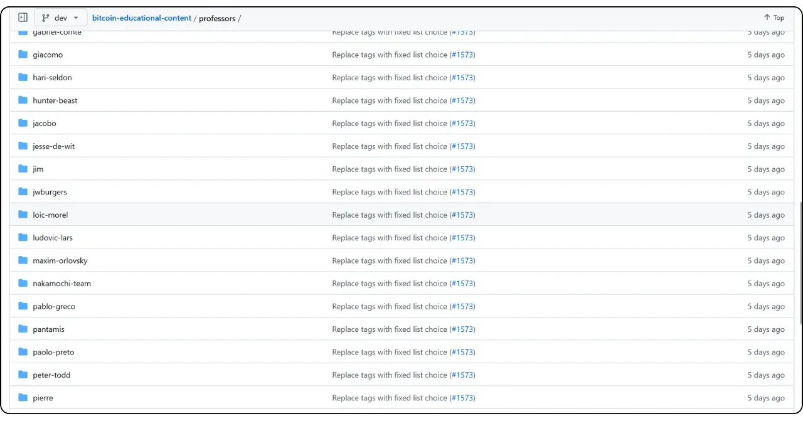

Um Ihre Profil-Metadaten zu ändern, wie z. B. Lightning Address, Name oder Links, wählen Sie die Datei "*professor.yml*". Um Ihre Beschreibung zu ändern, klicken Sie auf die YAML-Datei für Ihre Sprache (z. B. "*en.yml*" oder "*fr.yml*").

Wenn Sie Ihre Beschreibung ändern, denken Sie daran, alle veralteten Übersetzungen zu entfernen. Dann können Sie sich entweder darum kümmern, Ihre Beschreibung mit Hilfe eines LLM in die anderen Sprachen zu übersetzen, oder nur die Beschreibung in Ihrer Muttersprache belassen und in Ihrem Pull Request erwähnen, dass Ihre Beschreibung von unserem Team übersetzt werden muss.

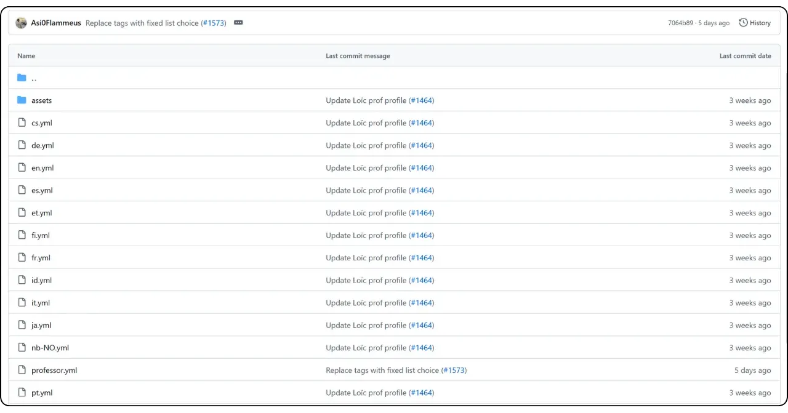

Klicken Sie bei der Datei, die Sie ändern möchten, auf das Bleistiftsymbol.

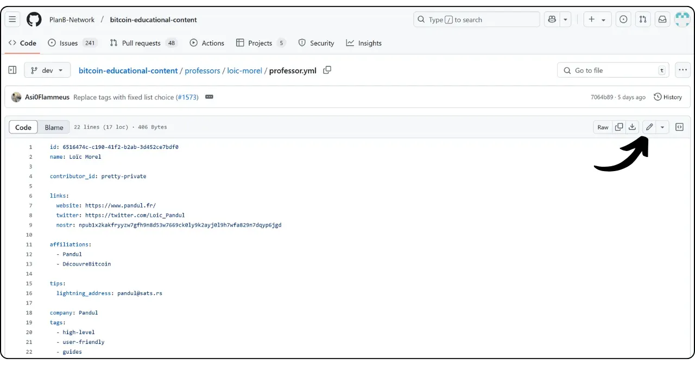

Wenn Sie noch kein Fork aus dem Plan ₿ Network-Repository haben, schlägt GitHub vor, eines zu erstellen. Klicken Sie auf "*Fork this repository*".

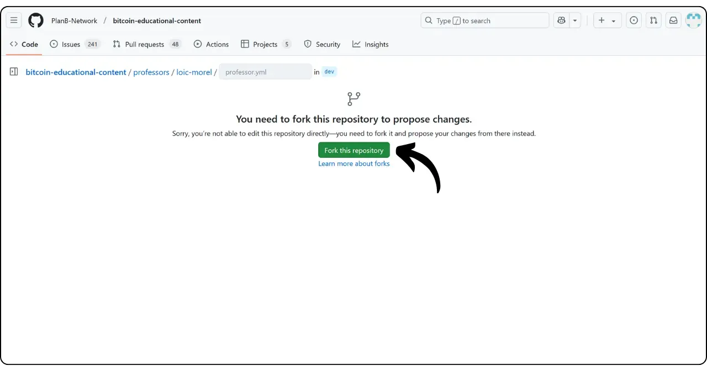

Nehmen Sie die gewünschten Änderungen an der Datei vor. Wenn Sie fertig sind, klicken Sie auf "*Änderungen übernehmen*".

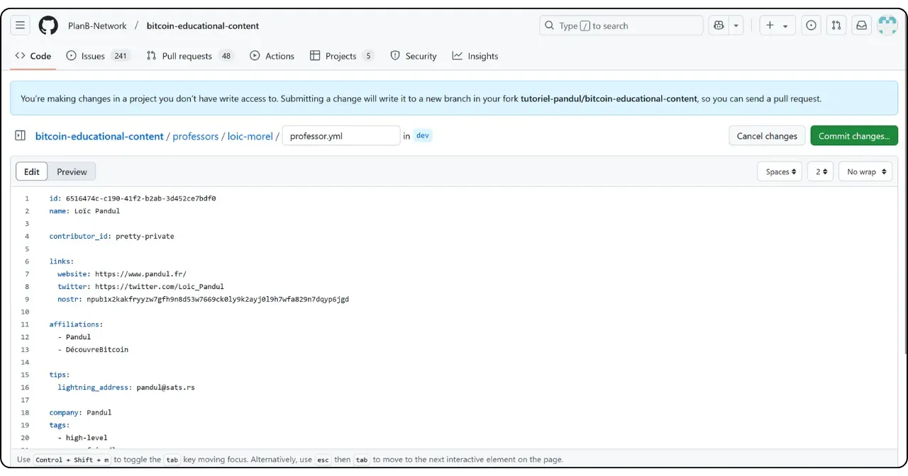

Geben Sie eine Nachricht ein, die Ihre Änderung beschreibt, und wählen Sie dann "*Änderungen vorschlagen*".

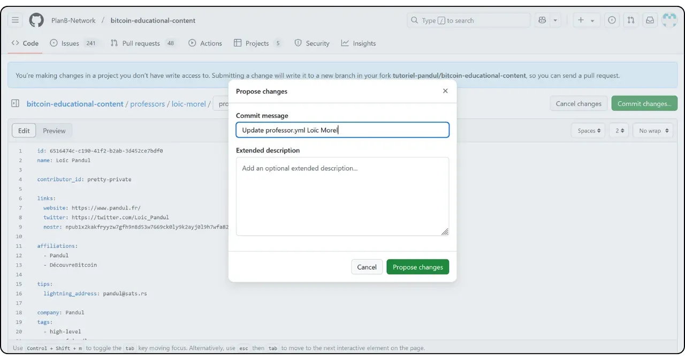

Es wird eine Übersicht über Ihre Änderungen angezeigt. Wenn Sie weitere Änderungen an Ihrem Profil vornehmen möchten, können Sie zu den Ordnern zurückkehren und weitere Übertragungen vornehmen. Wenn Sie fertig sind, klicken Sie auf "*Create pull request*".

Ein Pull Request ist eine Anfrage, um Änderungen aus Ihrem Zweig in den Hauptzweig des Plan ₿ Network-Repositorys zu integrieren, was eine Überprüfung und Diskussion der Änderungen ermöglicht, bevor sie zusammengeführt werden.

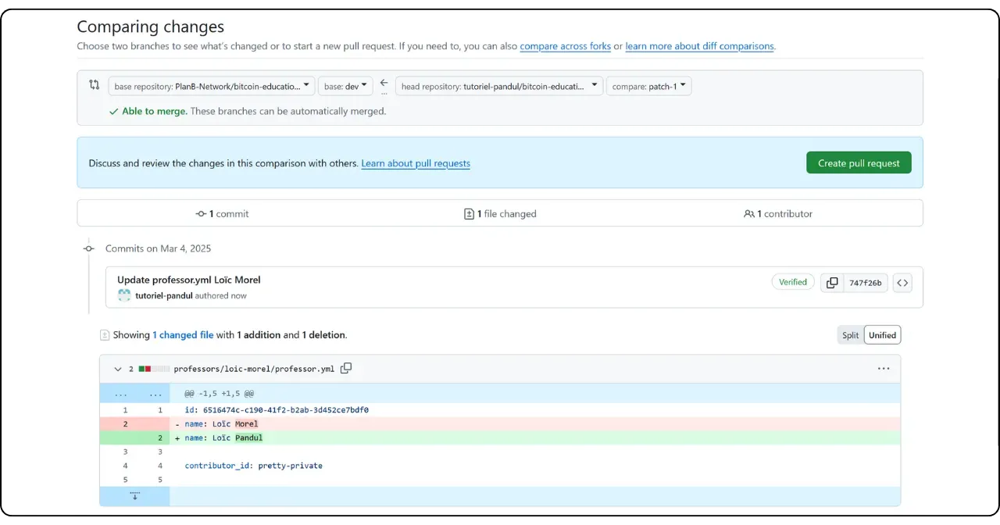

Stellen Sie sicher, dass Ihr Arbeitszweig am Anfang von Interface mit dem `dev`-Zweig des Plan ₿ Network-Repositorys (dem Hauptzweig) zusammengeführt wird.

Geben Sie einen Titel ein, der kurz die Änderungen zusammenfasst, die Sie mit dem Quell-Repository zusammenführen möchten. Fügen Sie einen kurzen Kommentar hinzu, der diese Änderungen beschreibt, und klicken Sie dann auf die Green-Schaltfläche "*Create pull request*", um die Pull-Anforderung zu bestätigen:

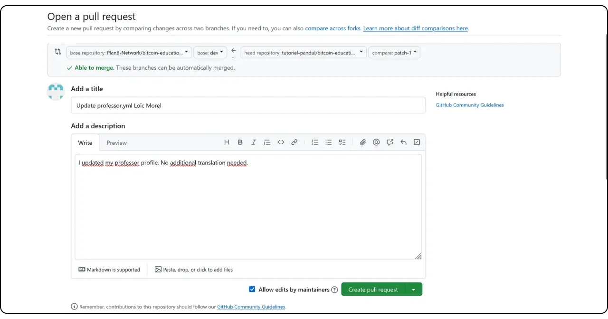

Ihr PR wird dann auf der Registerkarte "*Pull Request*" des Plan ₿ Network-Hauptrepository sichtbar sein. Jetzt müssen Sie nur noch darauf warten, dass ein Administrator Ihre Änderung zusammenführt.

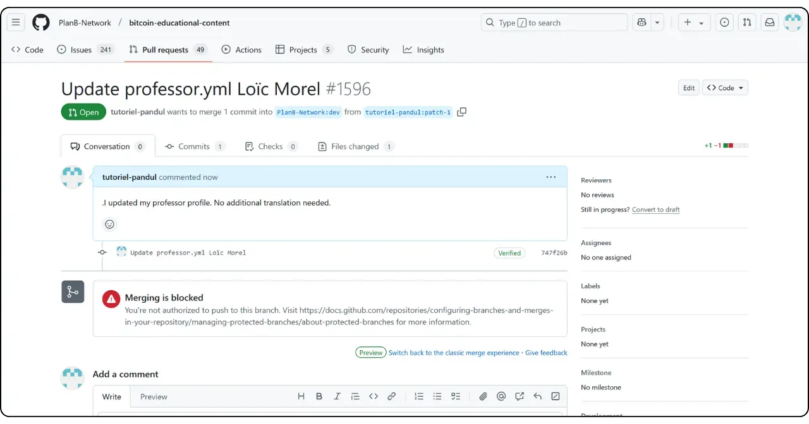

Sollten Sie beim Einreichen Ihrer Änderung auf technische Schwierigkeiten stoßen, zögern Sie bitte nicht, auf [unserer Telegram-Gruppe für Beiträge] (https://t.me/PlanBNetwork_ContentBuilder) um Hilfe zu bitten. Herzlichen Dank!