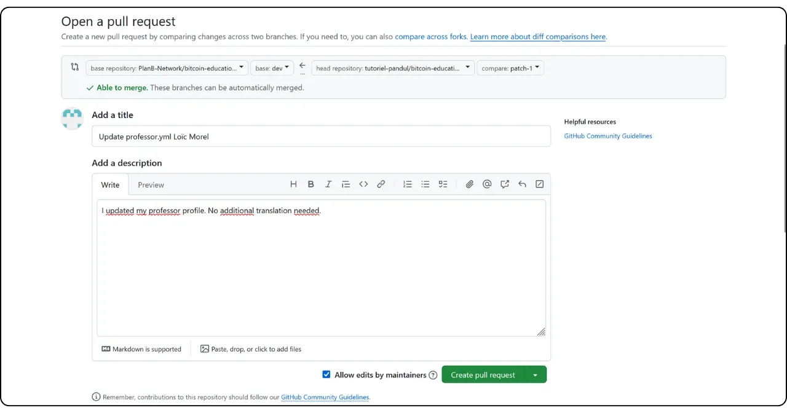

If you plan to contribute to Plan ₿ Network by writing a new tutorial or course, you will need a teacher profile. This profile will enable you to receive the appropriate credits for the content you contribute to the platform.

For those of you who have already been involved in creating educational content on Plan ₿ Network, you probably already have a teacher profile. You can find it in the `/professors` folder [on our GitHub repository](https://github.com/PlanB-Network/Bitcoin-educational-content/tree/dev/professors). If your profile already exists, find your login in the `professor.yml` file.

To make changes to your profile, go to the "Edit your teacher profile" section at the end of this tutorial.

## Add a new teacher with our software

The easiest way to create your teacher profile on Plan ₿ Network is to use our integrated Python tool. Here's how it works.

### 1 - Configure your local environment

You must have your own Fork from [Plan ₿ Network repository on GitHub](https://github.com/PlanB-Network/Bitcoin-educational-content).

Synchronize the main branch (`dev`) of your Fork with the source repository.

Update your local clone.

```bash
# Cloner votre fork (si ce n'est pas déjà fait)
git clone https://github.com/<username>/bitcoin-educational-content.git
cd bitcoin-educational-content
# Ajouter le dépôt source en tant que remote upstream
git remote add upstream https://github.com/PlanB-Network/bitcoin-educational-content.git
# Récupérer les dernières modifications depuis le dépôt source
git fetch upstream
# Se positionner sur la branche principale 'dev'
git checkout dev
# Fusionner les modifications de la branche 'dev' du dépôt source dans votre fork
git merge upstream/dev
# Pousser les mises à jour vers votre fork sur GitHub
git push origin dev
```

### 2 - Create a new branch

Make sure you're on the `dev` branch. Create a new branch with a descriptive name (e.g. `add-professor-loic-morel`).

Publish this branch on your Fork online.

```bash
# Assurez-vous d’être sur la branche 'dev'
git checkout dev
# Créez une nouvelle branche avec un nom descriptif
git checkout -b add-professor-loic-morel
# Publiez cette branche sur votre fork en ligne
git push -u origin add-professor-loic-morel
```

### 3 - Create your teacher profile

Go to the `scripts/tutorial-related/data-creator/` folder on your local clone. Make sure you've installed all the dependencies required for the software, having first installed Python :

```bash
pip install -r requirements.txt
```

Then launch the software with the command :

```bash
python3 main.py
```

Once on the home page, enter the local path to your repository clone, the language you're writing in and your GitHub ID. If you're creating this profile for someone else and already have a Professor's profile, enter your ID in the "*PBN Professor's ID*" field. If you're creating your own profile, you won't have a Professor's ID yet, as you're in the process of creating one, so leave this field blank.

Then click on the "*New Professor*" button.


Fill in the required information (please note that all this information will be public on our platform as well as on GitHub) :


- Name of your teacher file (use your first and last name or a pseudonym, in lower case) ;
- Your name or nickname ;
- Random generation of your login ;
- Your website and profile X (optional) ;
- A Lightning address to receive donations from readers (optional) ;
- Select 2 or 3 tags from the list;
- Click on "*Select Image*" to choose a profile image from your local folders (any name and format can be used for the image, and the software will adapt it automatically. Just make sure the image is square);
- Write a short description of your profile.

Finalize creation by clicking on "*Create Professor*". This will automatically generate all the files required for your profile.


Save your changes locally by creating a commit with an explanatory message. Push the changes to your Fork GitHub.

```bash
# Créez un commit avec un message descriptif
git commit -m "*new professor Loïc Morel*"
# Poussez vos modifications sur votre fork
git push origin add-professor-loic-morel
```

Once finished, create a Pull Request (PR) on GitHub to propose the integration of your modifications. Add a title and a brief description to the PR.

### 4 - Proofreading and merging

Wait for validation or feedback from an administrator. If necessary, make corrections and push new commits.

```bash
# Créez un commit décrivant les corrections apportées
git commit -m "*Corrections suite à la revue du tutoriel green-wallet*"
# Poussez les corrections sur votre fork
git push origin add-professor-loic-morel
```

Once the PR has been merged, you can delete your working branch.

## Modify your teacher profile

If you've mastered the use of Git, modify your teacher profile by creating a new branch and editing the relevant file directly in your existing folder. Changes can be made either in the `professor.yml` file or in the markdown file, depending on the information to be corrected. Once you've made your changes locally, push them to your Fork and submit a PR.

For beginners, I recommend making the modification directly via GitHub's Interface web. Make sure you have a GitHub account. If you don't know how to create one, follow this tutorial :

https://planb.network/tutorials/contribution/others/create-github-account-a75fc39d-f0d0-44dc-9cd5-cd94aee0c07c
Go to [the Plan ₿ Network GitHub repository dedicated to data](https://github.com/PlanB-Network/Bitcoin-educational-content/graphs/contributors).


Click on the "*professors*" folder, then go to your personal folder.


To change your profile metadata, such as Lightning address, name or links, select the "*professor.yml*" file. To change your description, click on the YAML file for your language (e.g. "*en.yml*" or "*fr.yml*").

If you modify your description, remember to remove all obsolete translations. Then you can either take care of translating your description into the other languages with the help of an LLM, or leave only the description in your native language and mention in your Pull Request that your description requires translation by our team.


Once on the file you wish to modify, click on the pencil icon.


If you don't already have a Fork from the Plan ₿ Network repository, GitHub will suggest you create one. Click on "*Fork this repository*".


Make the desired changes to the file. When finished, click on "*Commit changes*".


Enter a message describing your change, then select "*Propose changes*".


A summary of your changes will be displayed. If you wish to make further changes to your profile, you can return to the folders and make further commits. When you're finished, click on "*Create pull request*".

A Pull Request is a request made to integrate changes from your branch into the main branch of the Plan ₿ Network repository, allowing review and discussion of changes before they are merged.


Make sure, at the top of Interface, that your working branch is merged with the `dev` branch of the Plan ₿ Network repository (which is the main branch).

Enter a title that briefly summarizes the changes you wish to merge with the source repository. Add a brief comment describing these changes, then click on the green "*Create pull request*" button to confirm the pull request:



Your PR will then be visible in the "*Pull Request*" tab of the main Plan ₿ Network repository. All you have to do now is wait for an administrator to merge your modification.


If you encounter any technical difficulties in submitting your change, please don't hesitate to ask for help on [our Telegram group dedicated to contributions](https://t.me/PlanBNetwork_ContentBuilder). Thank you very much!