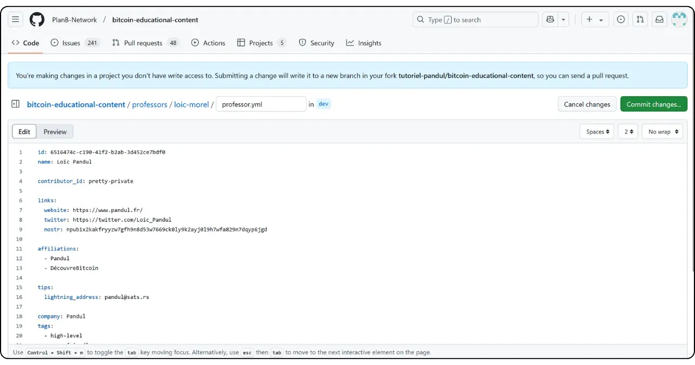
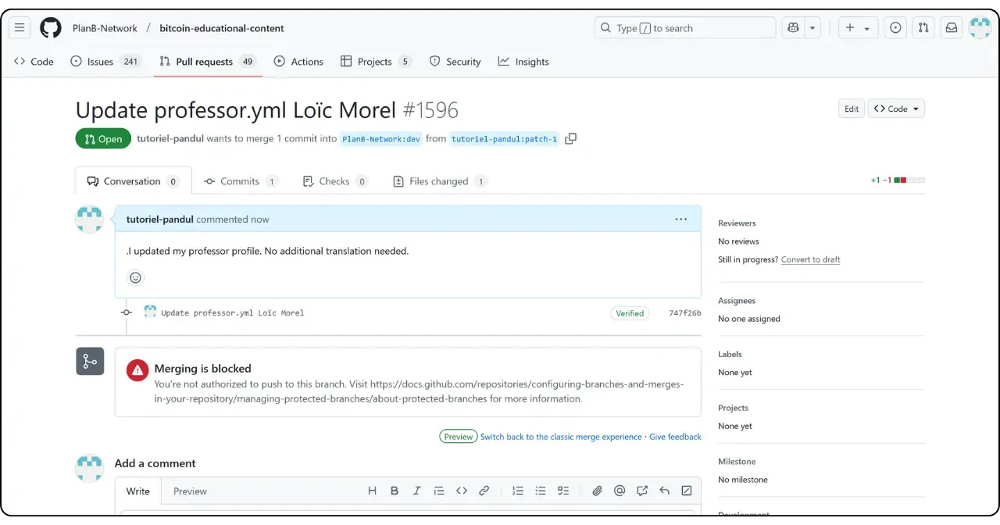

Kui kavatsete Plan ₿ Network-sse panustada uue õpetuse või kursuse kirjutamisega, vajate õpetaja profiili. See profiil võimaldab teil saada asjakohaseid ainepunkte platvormile panustatava sisu eest.

Need, kes on juba osalenud Plan ₿ Network haridusliku sisu loomisel, on tõenäoliselt juba õpetaja profiili kasutanud. Selle leiate kaustast `/professors` [meie GitHubi repositooriumis](https://github.com/PlanB-Network/Bitcoin-educational-content/tree/dev/professors). Kui teie profiil on juba olemas, leidke oma kasutajanimi failist `professor.yml`.

Oma profiili muutmiseks minge käesoleva õpetuse lõpus asuvasse jaotisse "Oma õpetaja profiili muutmine".

## Lisage uus õpetaja meie tarkvara abil

Kõige lihtsam viis oma õpetaja profiili loomiseks Plan ₿ Network-s on kasutada meie integreeritud Pythoni tööriista. See toimib järgmiselt.

### 1 - Kohaliku keskkonna konfigureerimine

Teil peab olema oma Fork [Plan ₿ Network repositoorium GitHubis](https://github.com/PlanB-Network/Bitcoin-educational-content).

Sünkroniseeri oma Fork põhiharu (`dev`) allikarepositooriumiga.

Uuendage oma kohalikku klooni.

```bash
# Cloner votre fork (si ce n'est pas déjà fait)
git clone https://github.com/<username>/bitcoin-educational-content.git
cd bitcoin-educational-content
# Ajouter le dépôt source en tant que remote upstream
git remote add upstream https://github.com/PlanB-Network/bitcoin-educational-content.git
# Récupérer les dernières modifications depuis le dépôt source
git fetch upstream
# Se positionner sur la branche principale 'dev'
git checkout dev
# Fusionner les modifications de la branche 'dev' du dépôt source dans votre fork
git merge upstream/dev
# Pousser les mises à jour vers votre fork sur GitHub
git push origin dev
```

### 2 - Uue haru loomine

Veenduge, et olete `dev` harus. Looge uus haru kirjeldava nimega (nt `add-professor-loic-morel`).

Avaldage see haru oma Fork võrgus.

```bash
# Assurez-vous d’être sur la branche 'dev'
git checkout dev
# Créez une nouvelle branche avec un nom descriptif
git checkout -b add-professor-loic-morel
# Publiez cette branche sur votre fork en ligne
git push -u origin add-professor-loic-morel
```

### 3 - Loo oma õpetaja profiil

Mine oma kohaliku klooni kausta `scripts/tutorial-related/data-creator/`. Veenduge, et olete paigaldanud kõik vajalikud sõltuvused, olles kõigepealt installeerinud Pythoni :

```bash
pip install -r requirements.txt
```

Seejärel käivitage tarkvara käsuga :

```bash
python3 main.py
```

Avaleheküljel sisestage oma repositooriumi klooni kohalik tee, keel, milles kirjutate, ja oma GitHubi ID. Kui loote selle profiili kellegi teise jaoks ja teil on juba olemas professori profiil, sisestage oma ID väljale "*PBN professori ID*". Kui te loote oma profiili, siis ei ole teil veel professori ID-d, sest te olete selle loomisel, seega jätke see väli tühjaks.

Seejärel klõpsake nupule "*Uus professor*".


Täitke nõutav teave (palun arvestage, et kogu see teave on avalik nii meie platvormil kui ka GitHubis) :


- Õpetaja faili nimi (kasutage oma ees- ja perekonnanime või pseudonüümi, väiketähtedega) ;
- Teie nimi või hüüdnimi ;
- Teie sisselogimise juhuslik genereerimine ;
- Teie veebisait ja profiil X (vabatahtlik) ;
- Lightning Address, et võtta lugejatelt vastu annetusi (vabatahtlik) ;
- Valige loendist 2 või 3 sildi;
- Klõpsake "*Valige pilt*", et valida profiilipilt oma kohalikest kaustadest (pildi jaoks võib kasutada mis tahes nime ja formaati ning tarkvara kohandab selle automaatselt. Lihtsalt veenduge, et pilt on ruudukujuline);
- Kirjutage oma profiili lühikirjeldus.

Lõpetage loomine, klõpsates nupule "*Loo professor*". See toob automaatselt generate kõik teie profiili jaoks vajalikud failid.


Salvesta oma muudatused lokaalselt, luues selgitavale sõnumile vastava kinnituse. Lükake muudatused Fork GitHubi.

```bash
# Créez un commit avec un message descriptif
git commit -m "*new professor Loïc Morel*"
# Poussez vos modifications sur votre fork
git push origin add-professor-loic-morel
```

Kui olete lõpetanud, looge GitHubis Pull Request (PR), et teha ettepanek oma muudatuste integreerimiseks. Lisage PR-ile pealkiri ja lühikirjeldus.

### 4 - Korrektuur ja ühendamine

Oodake kinnitust või tagasisidet administraatorilt. Vajaduse korral tehke parandusi ja lükake uued kommitsid.

```bash
# Créez un commit décrivant les corrections apportées
git commit -m "*Corrections suite à la revue du tutoriel green-wallet*"
# Poussez les corrections sur votre fork
git push origin add-professor-loic-morel
```

Kui PR on ühendatud, saate oma tööharu kustutada.

## Muuda oma õpetaja profiili

Kui olete Giti kasutamist omandanud, muutke oma õpetaja profiili, luues uue haru ja redigeerides asjaomast faili otse oma olemasolevas kaustas. Muudatusi saab teha kas failis `professor.yml` või markdown-failis, sõltuvalt parandatavast teabest. Kui olete oma muudatused lokaalselt teinud, lükake need oma Fork ja esitage PR.

Algajatele soovitan teha muudatused otse GitHubi Interface veebi kaudu. Veenduge, et teil on GitHubi konto. Kui te ei tea, kuidas seda luua, järgige seda õpetust :

https://planb.network/tutorials/contribution/others/create-github-account-a75fc39d-f0d0-44dc-9cd5-cd94aee0c07c
Mine [Plan ₿ Network GitHubi andmehoidla, mis on pühendatud andmetele](https://github.com/PlanB-Network/Bitcoin-educational-content/graphs/contributors).


Klõpsake kaustas "*professorid*", seejärel minge oma isiklikku kausta.


Profiili metaandmete, näiteks Lightning Address, nime või linkide muutmiseks valige fail "*professor.yml*". Kirjelduse muutmiseks klõpsake oma keele YAML-faili (nt "*en.yml*" või "*fr.yml*").

Kui te muudate oma kirjeldust, ärge unustage eemaldada kõik vananenud tõlked. Seejärel võite kas hoolitseda oma kirjelduse tõlkimise eest teistesse keeltesse LLMi abil või jätta ainult kirjelduse oma emakeeles ja mainida oma Pull Requestis, et teie kirjeldus vajab meie meeskonna tõlkimist.


Kui olete failil, mida soovite muuta, klõpsake pliiatsi ikoonil.


Kui teil ei ole veel Fork repositooriumist Plan ₿ Network, soovitab GitHub teil selle luua. Klõpsake "*Fork see repositoorium*".


Tehke failis soovitud muudatused. Kui olete lõpetanud, klõpsake nuppu "*Commit changes*".



Sisestage oma muudatust kirjeldav sõnum ja valige seejärel "*Muudatuste esitamine*".


Kuvatakse teie muudatuste kokkuvõte. Kui soovite oma profiili veel muudatusi teha, saate kaustadesse tagasi pöörduda ja teha edasisi kinnitusi. Kui olete lõpetanud, klõpsake "*Create pull request*".

Pull Request on taotlus, mis on tehtud teie haru muudatuste integreerimiseks Plan ₿ Network repositooriumi põhiharusse, võimaldades muudatuste läbivaatamist ja arutamist enne nende ühendamist.


Veenduge, et Interface tipus on teie tööharu ühendatud Plan ₿ Network repositooriumi `dev` haruga (mis on peamine haru).

Sisestage pealkiri, mis võtab lühidalt kokku muudatused, mida soovite allikarepositooriumiga ühendada. Lisage lühike kommentaar, mis kirjeldab neid muudatusi, seejärel klõpsake nupule Green "*Create pull request*", et kinnitada pull request:


Seejärel on teie PR nähtav Plan ₿ Network peamise repositooriumi vahekaardil "*Pull Request*". Nüüd peate vaid ootama, et administraator teie muudatuse ühendaks.



Kui teil tekib muudatuste esitamisel tehnilisi raskusi, paluge julgelt abi [meie panustamisele pühendatud Telegrami grupis](https://t.me/PlanBNetwork_ContentBuilder). Suur tänu!