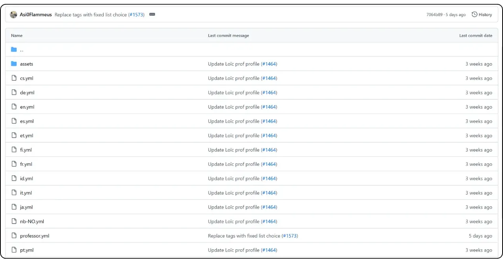
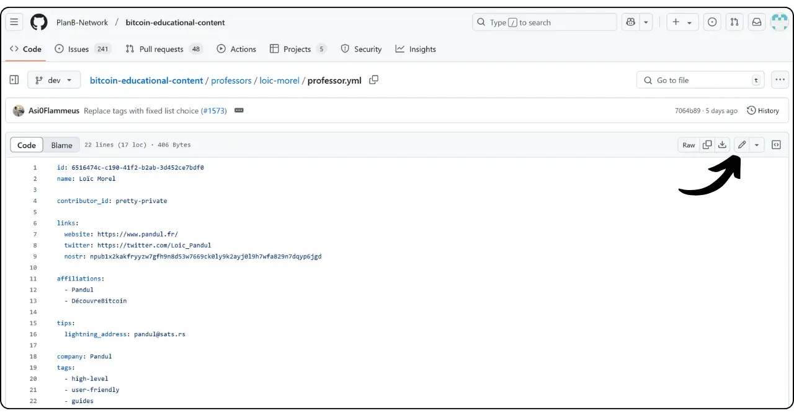

यदि आप Plan ₿ Network में एक नया ट्यूटोरियल या कोर्स लिखकर योगदान करने की योजना बना रहे हैं, तो आपको एक शिक्षक प्रोफ़ाइल की आवश्यकता होगी। यह प्रोफ़ाइल आपको उस सामग्री के लिए उचित क्रेडिट प्राप्त करने में सक्षम बनाएगी जो आप इस प्लेटफ़ॉर्म पर योगदान करते हैं।

जो लोग पहले से ही Plan ₿ Network पर शैक्षिक सामग्री बनाने में शामिल हैं, उनके पास शायद पहले से ही एक शिक्षक प्रोफ़ाइल होगी। आप इसे हमारे GitHub रिपॉजिटरी के `/professors` फोल्डर में पा सकते हैं। अगर आपकी प्रोफ़ाइल पहले से मौजूद है, तो अपना लॉगिन `professor.yml` फाइल में देखें।

अपने प्रोफाइल में बदलाव करने के लिए, इस ट्यूटोरियल के अंत में "अपने शिक्षक प्रोफाइल को संपादित करें" सेक्शन में जाएं।

## हमारे सॉफ्टवेयर के माध्यम से एक नए शिक्षक को जोड़ें।

Plan ₿ Network पर अपना शिक्षक प्रोफाइल बनाने का सबसे आसान तरीका है हमारे इंटीग्रेटेड पायथन टूल का उपयोग करना। यह ऐसे काम करता है।

### 1 - अपने स्थानीय वातावरण को कॉन्फ़िगर करें

आपके पास अपना खुद का Fork होना चाहिए, जिसे आप [Plan ₿ Network रिपॉजिटरी GitHub पर](https://github.com/PlanB-Network/Bitcoin-educational-content) से प्राप्त कर सकते हैं।

अपने Fork की मुख्य शाखा (`dev`) को स्रोत रिपॉजिटरी के साथ समकालिक करें।

अपनी स्थानीय क्लोन को अपडेट करें।

```bash
# Cloner votre fork (si ce n'est pas déjà fait)
git clone https://github.com/<username>/bitcoin-educational-content.git
cd bitcoin-educational-content
# Ajouter le dépôt source en tant que remote upstream
git remote add upstream https://github.com/PlanB-Network/bitcoin-educational-content.git
# Récupérer les dernières modifications depuis le dépôt source
git fetch upstream
# Se positionner sur la branche principale 'dev'
git checkout dev
# Fusionner les modifications de la branche 'dev' du dépôt source dans votre fork
git merge upstream/dev
# Pousser les mises à jour vers votre fork sur GitHub
git push origin dev
```

### 2 - एक नई शाखा बनाएं

सुनिश्चित करें कि आप `dev` शाखा पर हैं। एक नई शाखा बनाएं जिसका नाम वर्णनात्मक हो (जैसे `add-professor-loic-morel`)।

इस शाखा को अपने Fork ऑनलाइन पर प्रकाशित करें।

```bash
# Assurez-vous d’être sur la branche 'dev'
git checkout dev
# Créez une nouvelle branche avec un nom descriptif
git checkout -b add-professor-loic-morel
# Publiez cette branche sur votre fork en ligne
git push -u origin add-professor-loic-morel
```

### 3 - अपना शिक्षक प्रोफाइल बनाएं

अपने स्थानीय क्लोन में `scripts/tutorial-related/data-creator/` फोल्डर पर जाएं। सुनिश्चित करें कि आपने सॉफ़्टवेयर के लिए आवश्यक सभी डिपेंडेंसीज़ इंस्टॉल कर ली हैं, पहले Python इंस्टॉल करने के बाद।

```bash
pip install -r requirements.txt
```

फिर इस कमांड के साथ सॉफ्टवेयर लॉन्च करें:

```bash
python3 main.py
```

होम पेज पर पहुँचने के बाद, अपने रिपॉजिटरी क्लोन का लोकल पथ, जिस भाषा में आप लिख रहे हैं, और अपना GitHub ID दर्ज करें। अगर आप यह प्रोफाइल किसी और के लिए बना रहे हैं और आपके पास पहले से एक प्रोफेसर की प्रोफाइल है, तो "*PBN Professor's ID*" फील्ड में अपनी ID दर्ज करें। अगर आप अपनी खुद की प्रोफाइल बना रहे हैं, तो आपके पास अभी प्रोफेसर की ID नहीं होगी, क्योंकि आप इसे बनाने की प्रक्रिया में हैं, इसलिए इस फील्ड को खाली छोड़ दें।

फिर "*नया प्रोफेसर*" बटन पर क्लिक करें।


आवश्यक जानकारी भरें (कृपया ध्यान दें कि यह सारी जानकारी हमारे प्लेटफॉर्म पर और GitHub पर सार्वजनिक होगी):


- अपने शिक्षक फाइल का नाम (अपने पहले और आखिरी नाम या एक उपनाम का उपयोग करें, छोटे अक्षरों में);
- आपका नाम या उपनाम;
- आपके लॉगिन का रैंडम जनरेशन।
- आपकी वेबसाइट और प्रोफाइल X (वैकल्पिक);
- लाइटनिंग Address पाठकों से दान प्राप्त करने के लिए (वैकल्पिक);
- सूची में से 2 या 3 टैग चुनें।
- "*Select Image*" पर क्लिक करें ताकि आप अपने स्थानीय फोल्डर्स से एक प्रोफाइल इमेज चुन सकें (इमेज का कोई भी नाम और फॉर्मेट हो सकता है, सॉफ्टवेयर उसे अपने आप एडाप्ट कर लेगा। बस यह सुनिश्चित करें कि इमेज चौकोर हो);
- मैंने अक्टूबर 2023 तक के डेटा पर प्रशिक्षण प्राप्त किया है।

"*प्रोफेसर बनाएं*" पर क्लिक करके निर्माण को अंतिम रूप दें। यह स्वचालित रूप से आपके प्रोफाइल के लिए आवश्यक सभी फाइलों को generate कर देगा।


अपनी बदलावों को स्थानीय रूप से सहेजने के लिए एक कमिट बनाएं जिसमें एक स्पष्ट संदेश हो। फिर इन बदलावों को अपने Fork GitHub पर पुश करें।

```bash
# Créez un commit avec un message descriptif
git commit -m "*new professor Loïc Morel*"
# Poussez vos modifications sur votre fork
git push origin add-professor-loic-morel
```

काम पूरा होने के बाद, अपने संशोधनों के एकीकरण का प्रस्ताव करने के लिए GitHub पर एक पुल रिक्वेस्ट (PR) बनाएं। PR में एक शीर्षक और एक संक्षिप्त विवरण जोड़ें।

### 4 - प्रूफरीडिंग और मर्जिंग

प्रशासन से मान्यता या प्रतिक्रिया का इंतजार करें। यदि आवश्यक हो, तो सुधार करें और नए कमिट्स को पुश करें।

```bash
# Créez un commit décrivant les corrections apportées
git commit -m "*Corrections suite à la revue du tutoriel green-wallet*"
# Poussez les corrections sur votre fork
git push origin add-professor-loic-morel
```

एक बार जब PR मर्ज हो जाए, तो आप अपनी वर्किंग ब्रांच को डिलीट कर सकते हैं।

## अपने शिक्षक प्रोफ़ाइल को संशोधित करें।

अगर आपने Git का उपयोग अच्छे से सीख लिया है, तो अपने शिक्षक प्रोफाइल को अपडेट करने के लिए एक नई ब्रांच बनाएं और अपने मौजूदा फोल्डर में संबंधित फाइल को सीधे एडिट करें। बदलाव `professor.yml` फाइल में या मार्कडाउन फाइल में किए जा सकते हैं, यह इस पर निर्भर करता है कि कौन सी जानकारी सही करनी है। जब आप अपने बदलाव लोकल मशीन पर कर लें, तो उन्हें अपने Fork पर पुश करें और एक PR सबमिट करें।

शुरुआती लोगों के लिए, मैं सुझाव देता हूँ कि आप सीधे GitHub के Interface वेब के माध्यम से संशोधन करें। सुनिश्चित करें कि आपके पास एक GitHub खाता है। अगर आपको नहीं पता कि इसे कैसे बनाना है, तो इस ट्यूटोरियल का पालन करें:

https://planb.network/tutorials/contribution/others/create-github-account-a75fc39d-f0d0-44dc-9cd5-cd94aee0c07c
[Plan ₿ Network GitHub रिपॉजिटरी जो डेटा के लिए समर्पित है](https://github.com/PlanB-Network/Bitcoin-educational-content/graphs/contributors) पर जाएं।


"*प्रोफेसर्स*" फोल्डर पर क्लिक करें, फिर अपने पर्सनल फोल्डर में जाएं।


अपने प्रोफ़ाइल मेटाडेटा, जैसे कि Lightning Address, नाम या लिंक बदलने के लिए, "*professor.yml*" फ़ाइल का चयन करें। अपनी विवरणिका बदलने के लिए, अपनी भाषा के लिए YAML फ़ाइल पर क्लिक करें (जैसे "*en.yml*" या "*fr.yml*")।

यदि आप अपने विवरण में बदलाव करते हैं, तो सभी पुराने अनुवादों को हटाना याद रखें। इसके बाद, आप या तो LLM की मदद से अपने विवरण का अन्य भाषाओं में अनुवाद कर सकते हैं, या केवल अपनी मूल भाषा में विवरण छोड़ सकते हैं और अपने पुल रिक्वेस्ट में यह उल्लेख कर सकते हैं कि आपके विवरण का अनुवाद हमारी टीम द्वारा किया जाना है।



जिस फाइल को आप संशोधित करना चाहते हैं, उस पर जाकर पेंसिल आइकन पर क्लिक करें।



अगर आपके पास पहले से Plan ₿ Network रिपॉजिटरी से Fork नहीं है, तो GitHub आपको एक बनाने का सुझाव देगा। "*इस रिपॉजिटरी को Fork करें*" पर क्लिक करें।


फाइल में आवश्यक बदलाव करें। जब हो जाए, तो "*Commit changes*" पर क्लिक करें।


अपने बदलाव का विवरण देते हुए एक संदेश लिखें, फिर "*बदलाव प्रस्तावित करें*" चुनें।


आपके द्वारा किए गए बदलावों का सारांश दिखाया जाएगा। अगर आप अपनी प्रोफ़ाइल में और बदलाव करना चाहते हैं, तो आप फोल्डर्स में वापस जाकर और बदलाव कर सकते हैं। जब आप सब कुछ पूरा कर लें, तो "*Create pull request*" पर क्लिक करें।

पुल रिक्वेस्ट एक अनुरोध होता है जिसमें आप अपनी शाखा से किए गए बदलावों को Plan ₿ Network रिपॉजिटरी की मुख्य शाखा में जोड़ने के लिए कहते हैं। इससे पहले कि ये बदलाव जोड़े जाएं, उनकी समीक्षा और चर्चा की जा सकती है।


सुनिश्चित करें कि Interface के शीर्ष पर, आपकी कार्यशील शाखा Plan ₿ Network रिपॉजिटरी की `dev` शाखा (जो मुख्य शाखा है) के साथ मर्ज की गई हो।

उस शीर्षक को दर्ज करें जो संक्षेप में उन बदलावों को बताता है जिन्हें आप स्रोत रिपॉजिटरी के साथ मर्ज करना चाहते हैं। इन बदलावों का संक्षिप्त विवरण देते हुए एक टिप्पणी जोड़ें, फिर पुष्टि करने के लिए Green "*पुल अनुरोध बनाएँ*" बटन पर क्लिक करें।


आपका PR अब मुख्य Plan ₿ Network रिपॉजिटरी के "*Pull Request*" टैब में दिखाई देगा। अब आपको बस एक प्रशासक के आपके संशोधन को मर्ज करने का इंतजार करना है।


अगर आपको अपने बदलाव सबमिट करने में कोई तकनीकी समस्या आती है, तो कृपया [हमारे योगदान के लिए समर्पित टेलीग्राम समूह](https://t.me/PlanBNetwork_ContentBuilder) पर मदद मांगने में संकोच न करें। बहुत धन्यवाद!