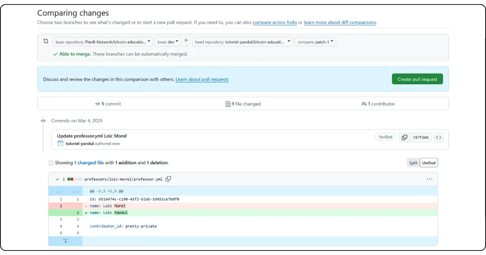

Jika Anda berencana untuk berkontribusi pada Plan ₿ Network dengan menulis tutorial atau kursus baru, Anda memerlukan profil pengajar. Profil ini akan memungkinkan Anda menerima kredit yang sesuai untuk konten yang Anda kontribusikan ke platform.

Bagi Anda yang telah terlibat dalam pembuatan konten pendidikan di Plan ₿ Network, Anda mungkin telah memiliki profil pengajar. Anda dapat menemukannya di folder `/professors` [di repositori GitHub kami] (https://github.com/PlanB-Network/Bitcoin-educational-content/tree/dev/professors). Jika profil Anda sudah ada, cari login Anda di file `professor.yml`.

Untuk membuat perubahan pada profil Anda, buka bagian "Edit profil guru Anda" di akhir tutorial ini.

## Tambahkan guru baru dengan perangkat lunak kami

Cara termudah untuk membuat profil guru Anda di Plan ₿ Network adalah dengan menggunakan alat Python terintegrasi kami. Berikut cara kerjanya.

### 1 - Konfigurasikan lingkungan lokal Anda

Anda harus memiliki Fork Anda sendiri dari [repositori Plan ₿ Network di GitHub] (https://github.com/PlanB-Network/Bitcoin-educational-content).

Sinkronisasi cabang utama (`dev`) Fork Anda dengan repositori sumber.

Perbarui klon lokal Anda.

```bash
# Cloner votre fork (si ce n'est pas déjà fait)
git clone https://github.com/<username>/bitcoin-educational-content.git
cd bitcoin-educational-content
# Ajouter le dépôt source en tant que remote upstream
git remote add upstream https://github.com/PlanB-Network/bitcoin-educational-content.git
# Récupérer les dernières modifications depuis le dépôt source
git fetch upstream
# Se positionner sur la branche principale 'dev'
git checkout dev
# Fusionner les modifications de la branche 'dev' du dépôt source dans votre fork
git merge upstream/dev
# Pousser les mises à jour vers votre fork sur GitHub
git push origin dev
```

### 2 - Membuat cabang baru

Pastikan Anda berada di cabang `dev`. Buat cabang baru dengan nama deskriptif (misalnya `add-profesor-loic-morel`).

Publikasikan cabang ini pada Fork Anda secara online.

```bash
# Assurez-vous d’être sur la branche 'dev'
git checkout dev
# Créez une nouvelle branche avec un nom descriptif
git checkout -b add-professor-loic-morel
# Publiez cette branche sur votre fork en ligne
git push -u origin add-professor-loic-morel
```

### 3 - Membuat profil guru Anda

Buka folder `scripts/tutorial-related/data-creator/` pada klon lokal Anda. Pastikan Anda telah menginstal semua ketergantungan yang diperlukan untuk perangkat lunak, dengan terlebih dahulu menginstal Python :

```bash
pip install -r requirements.txt
```

Kemudian luncurkan perangkat lunak dengan perintah :

```bash
python3 main.py
```

Setelah berada di halaman beranda, masukkan jalur lokal ke klon repositori Anda, bahasa yang Anda gunakan untuk menulis, dan ID GitHub Anda. Jika Anda membuat profil ini untuk orang lain dan sudah memiliki profil Profesor, masukkan ID Anda di kolom "*ID Profesor PBN*". Jika Anda membuat profil Anda sendiri, Anda belum memiliki ID Profesor, karena Anda sedang dalam proses membuatnya, jadi biarkan bidang ini kosong.

Kemudian klik tombol "*Profesor Baru*".


Isi informasi yang diperlukan (harap dicatat bahwa semua informasi ini akan dipublikasikan di platform kami dan juga di GitHub):


- Nama file guru Anda (gunakan nama depan dan belakang atau nama samaran, dengan huruf kecil);
- Nama atau nama panggilan Anda ;
- Pembuatan login Anda secara acak ;
- Situs web dan profil Anda X (opsional) ;
- Lightning Address untuk menerima sumbangan dari pembaca (opsional) ;
- Pilih 2 atau 3 tag dari daftar;
- Klik "*Pilih Gambar*" untuk memilih gambar profil dari folder lokal Anda (nama dan format apa pun dapat digunakan untuk gambar, dan perangkat lunak akan menyesuaikannya secara otomatis. Pastikan saja gambarnya berbentuk persegi);
- Tulis deskripsi singkat tentang profil Anda.

Selesaikan pembuatan dengan mengklik "*Buat Profesor*". Ini akan secara otomatis menggandakan semua file yang diperlukan untuk profil Anda.


Simpan perubahan Anda secara lokal dengan membuat komit dengan pesan penjelasan. Dorong perubahan ke GitHub Fork Anda.

```bash
# Créez un commit avec un message descriptif
git commit -m "*new professor Loïc Morel*"
# Poussez vos modifications sur votre fork
git push origin add-professor-loic-morel
```

Setelah selesai, buat Pull Request (PR) di GitHub untuk mengusulkan integrasi modifikasi Anda. Tambahkan judul dan deskripsi singkat ke PR.

### 4 - Mengoreksi dan menggabungkan

Tunggu validasi atau umpan balik dari administrator. Jika perlu, buat koreksi dan dorong komit baru.

```bash
# Créez un commit décrivant les corrections apportées
git commit -m "*Corrections suite à la revue du tutoriel green-wallet*"
# Poussez les corrections sur votre fork
git push origin add-professor-loic-morel
```

Setelah PR digabungkan, Anda dapat menghapus cabang yang sedang bekerja.

## Mengubah profil guru Anda

Jika Anda telah menguasai penggunaan Git, ubah profil guru Anda dengan membuat cabang baru dan mengedit file yang relevan secara langsung di folder yang sudah ada. Perubahan dapat dilakukan di file `professor.yml` atau di file markdown, tergantung dari informasi yang akan dikoreksi. Setelah Anda membuat perubahan secara lokal, doronglah perubahan tersebut ke Fork dan kirimkan PR.

Untuk pemula, saya sarankan untuk melakukan modifikasi secara langsung melalui web Interface milik GitHub. Pastikan Anda memiliki akun GitHub. Jika Anda tidak tahu cara membuatnya, ikuti tutorial ini:

https://planb.network/tutorials/contribution/others/create-github-account-a75fc39d-f0d0-44dc-9cd5-cd94aee0c07c
Buka [repositori GitHub Plan ₿ Network yang didedikasikan untuk data] (https://github.com/PlanB-Network/Bitcoin-educational-content/graphs/contributors).


Klik pada folder "*profesor*", lalu buka folder pribadi Anda.


Untuk mengubah metadata profil Anda, seperti Lightning Address, nama, atau tautan, pilih file "*professor.yml*". Untuk mengubah deskripsi Anda, klik file YAML untuk bahasa Anda (mis. "*en.yml*" atau "*fr.yml*").

Jika Anda mengubah deskripsi Anda, ingatlah untuk menghapus semua terjemahan yang sudah usang. Kemudian Anda dapat menerjemahkan deskripsi Anda ke dalam bahasa lain dengan bantuan LLM, atau hanya meninggalkan deskripsi dalam bahasa asli Anda dan menyebutkan dalam Pull Request Anda bahwa deskripsi Anda memerlukan terjemahan oleh tim kami.


Setelah berada di file yang ingin Anda modifikasi, klik ikon pensil.


Jika Anda belum memiliki Fork dari repositori Plan ₿ Network, GitHub akan menyarankan Anda untuk membuatnya. Klik "*Fork repositori ini*".


Lakukan perubahan yang diinginkan pada file. Setelah selesai, klik "*Selesaikan perubahan*".


Masukkan pesan yang menjelaskan perubahan Anda, lalu pilih "*Usulkan perubahan*".


Ringkasan perubahan Anda akan ditampilkan. Jika Anda ingin membuat perubahan lebih lanjut pada profil Anda, Anda dapat kembali ke folder dan membuat komit lebih lanjut. Setelah selesai, klik "*Buat permintaan penarikan*".

Pull Request adalah permintaan yang dibuat untuk mengintegrasikan perubahan dari cabang Anda ke dalam cabang utama repositori Plan ₿ Network, yang memungkinkan peninjauan dan diskusi perubahan sebelum digabungkan.



Pastikan, di bagian atas Interface, bahwa cabang kerja Anda telah digabungkan dengan cabang `dev` dari repositori Plan ₿ Network (yang merupakan cabang utama).

Masukkan judul yang secara singkat meringkas perubahan yang ingin Anda gabungkan dengan repositori sumber. Tambahkan komentar singkat yang menjelaskan perubahan ini, lalu klik tombol Green "*Buat permintaan penarikan*" untuk mengonfirmasi permintaan penarikan:


PR Anda kemudian akan terlihat di tab "*Pull Request*" pada repositori Plan ₿ Network utama. Yang harus Anda lakukan sekarang adalah menunggu administrator untuk menggabungkan modifikasi Anda.


Jika Anda mengalami kesulitan teknis dalam mengirimkan perubahan Anda, jangan ragu untuk meminta bantuan di [grup Telegram kami yang didedikasikan untuk kontribusi](https://t.me/PlanBNetwork_ContentBuilder). Terima kasih banyak!