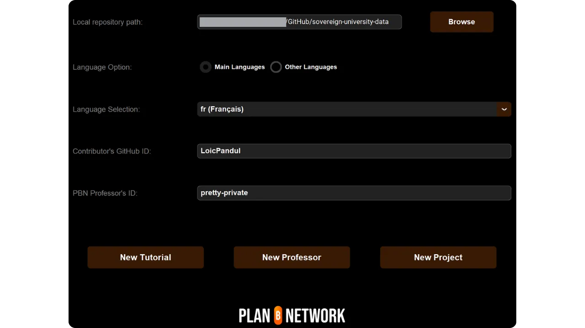

Если вы планируете внести свой вклад в Plan ₿ Network, написав новый учебник или курс, вам понадобится профиль преподавателя. Этот профиль позволит вам получать соответствующие кредиты за контент, который вы вносите на платформу.

У тех из вас, кто уже участвовал в создании образовательного контента на Plan ₿ Network, наверняка уже есть профиль преподавателя. Вы можете найти его в папке `/professors` [на нашем репозитории GitHub] (https://github.com/PlanB-Network/Bitcoin-educational-content/tree/dev/professors). Если ваш профиль уже существует, найдите свой логин в файле `professor.yml`.

Чтобы внести изменения в свой профиль, перейдите к разделу "Редактирование профиля учителя" в конце этого руководства.

## Добавьте нового учителя с помощью нашего программного обеспечения

Самый простой способ создать свой профиль учителя на Plan ₿ Network - это использовать наш встроенный инструмент Python. Вот как это работает.

### 1 - Настройка локальной среды

У вас должен быть собственный Fork из [репозитория Plan ₿ Network на GitHub](https://github.com/PlanB-Network/Bitcoin-educational-content).

Синхронизируйте основную ветку (`dev`) вашего Fork с репозиторием исходных текстов.

Обновите локальный клон.

```bash
# Cloner votre fork (si ce n'est pas déjà fait)
git clone https://github.com/<username>/bitcoin-educational-content.git
cd bitcoin-educational-content
# Ajouter le dépôt source en tant que remote upstream
git remote add upstream https://github.com/PlanB-Network/bitcoin-educational-content.git
# Récupérer les dernières modifications depuis le dépôt source
git fetch upstream
# Se positionner sur la branche principale 'dev'
git checkout dev
# Fusionner les modifications de la branche 'dev' du dépôt source dans votre fork
git merge upstream/dev
# Pousser les mises à jour vers votre fork sur GitHub
git push origin dev
```

### 2 - Создайте новую ветку

Убедитесь, что вы находитесь в ветке `dev`. Создайте новую ветку с описательным именем (например, `add-professor-loic-morel`).

Опубликуйте эту ветку на своем сайте Fork.

```bash
# Assurez-vous d’être sur la branche 'dev'
git checkout dev
# Créez une nouvelle branche avec un nom descriptif
git checkout -b add-professor-loic-morel
# Publiez cette branche sur votre fork en ligne
git push -u origin add-professor-loic-morel
```

### 3 - Создайте свой профиль учителя

Перейдите в папку `scripts/tutorial-related/data-creator/` на вашем локальном клоне. Убедитесь, что вы установили все необходимые для работы программы зависимости, предварительно установив Python :

```bash
pip install -r requirements.txt
```

Затем запустите программу командой :

```bash
python3 main.py
```

Оказавшись на главной странице, введите локальный путь к клону вашего репозитория, язык, на котором вы пишете, и свой идентификатор GitHub. Если вы создаете этот профиль для кого-то другого и у вас уже есть профиль профессора, введите свой ID в поле "*PBN Professor's ID*". Если вы создаете свой собственный профиль, у вас еще не будет ID профессора, так как вы находитесь в процессе его создания, поэтому оставьте это поле пустым.

Затем нажмите на кнопку "*Новый профессор*".



Заполните необходимые данные (пожалуйста, обратите внимание, что вся эта информация будет публичной как на нашей платформе, так и на GitHub):


- Название вашего файла преподавателя (используйте имя и фамилию или псевдоним, в нижнем регистре) ;
- Ваше имя или прозвище;
- Случайная генерация вашего логина;
- Ваш веб-сайт и профиль X (необязательно) ;
- Молния Address для приема пожертвований от читателей (необязательно);
- Выберите 2 или 3 тега из списка;
- Нажмите кнопку "*Выбрать изображение*", чтобы выбрать изображение профиля из локальных папок (для изображения можно использовать любое имя и формат, и программа автоматически адаптирует его. Только убедитесь, что изображение квадратное);
- Напишите краткое описание вашего профиля.

Завершите создание, нажав на кнопку "*Создать профессора*". Это автоматически создаст generate всех файлов, необходимых для вашего профиля.


Сохраните изменения локально, создав коммит с поясняющим сообщением. Переместите изменения на GitHub Fork.

```bash
# Créez un commit avec un message descriptif
git commit -m "*new professor Loïc Morel*"
# Poussez vos modifications sur votre fork
git push origin add-professor-loic-morel
```

После завершения работы создайте Pull Request (PR) на GitHub, чтобы предложить интеграцию ваших модификаций. Добавьте к PR заголовок и краткое описание.

### 4 - Вычитка и объединение

Дождитесь подтверждения или обратной связи от администратора. При необходимости внесите исправления и выложите новые коммиты.

```bash
# Créez un commit décrivant les corrections apportées
git commit -m "*Corrections suite à la revue du tutoriel green-wallet*"
# Poussez les corrections sur votre fork
git push origin add-professor-loic-morel
```

После слияния PR вы можете удалить свою рабочую ветку.

## Измените свой профиль учителя

Если вы освоили работу с Git, измените свой профиль учителя, создав новую ветку и отредактировав соответствующий файл прямо в существующей папке. Изменения могут быть внесены как в файл `professor.yml`, так и в файл markdown, в зависимости от того, какую информацию нужно исправить. После того как вы внесли изменения локально, отправьте их на Fork и оформите PR.

Новичкам я рекомендую вносить изменения непосредственно через GitHub's Interface web. Убедитесь, что у вас есть учетная запись GitHub. Если вы не знаете, как его создать, следуйте этому руководству:

https://planb.network/tutorials/contribution/others/create-github-account-a75fc39d-f0d0-44dc-9cd5-cd94aee0c07c
Перейдите на [репозиторий Plan ₿ Network на GitHub, посвященный данным] (https://github.com/PlanB-Network/Bitcoin-educational-content/graphs/contributors).


Нажмите на папку "*профессора*", затем перейдите в свою личную папку.


Чтобы изменить метаданные своего профиля, такие как Lightning Address, имя или ссылки, выберите файл "*professor.yml*". Чтобы изменить описание, выберите файл YAML для вашего языка (например, "*en.yml*" или "*fr.yml*").

Если вы изменяете описание, не забудьте удалить все устаревшие переводы. Затем вы можете либо позаботиться о переводе описания на другие языки с помощью LLM, либо оставить только описание на вашем родном языке и упомянуть в Pull Request, что ваше описание требует перевода нашей командой.


Находясь в файле, который вы хотите изменить, нажмите на значок карандаша.


Если у вас еще нет Fork из репозитория Plan ₿ Network, GitHub предложит вам создать его. Нажмите на "*Fork this repository*".


Внесите необходимые изменения в файл. По завершении нажмите "*Зафиксировать изменения*".


Введите сообщение, описывающее ваше изменение, а затем выберите "*Предложить изменения*".


На экране появится сводка ваших изменений. Если вы хотите внести дальнейшие изменения в свой профиль, вы можете вернуться к папкам и сделать дальнейшие фиксации. Когда вы закончите, нажмите на кнопку "*Создать запрос на притяжение*".

Pull Request - это запрос на интеграцию изменений из вашей ветки в основную ветку репозитория Plan ₿ Network, позволяющий просмотреть и обсудить изменения до их слияния.


Убедитесь, что в верхней части Interface ваша рабочая ветка слита с веткой `dev` репозитория Plan ₿ Network (которая является основной веткой).

Введите название, кратко описывающее изменения, которые вы хотите объединить с исходным репозиторием. Добавьте краткий комментарий, описывающий эти изменения, а затем нажмите на кнопку Green "*Create pull request*", чтобы подтвердить запрос:


После этого ваш PR будет виден на вкладке "*Pull Request*" основного репозитория Plan ₿ Network. Теперь вам остается только ждать, пока администратор объединит вашу модификацию.


Если у вас возникнут технические трудности при отправке изменений, пожалуйста, обращайтесь за помощью в [нашу группу в Telegram, посвященную вкладам](https://t.me/PlanBNetwork_ContentBuilder). Большое спасибо!