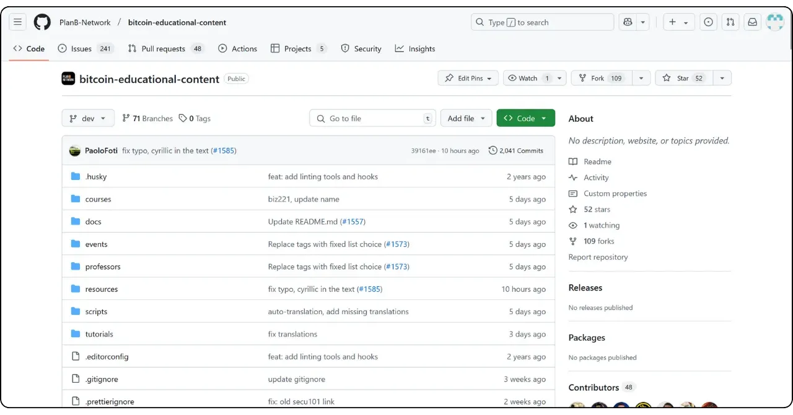
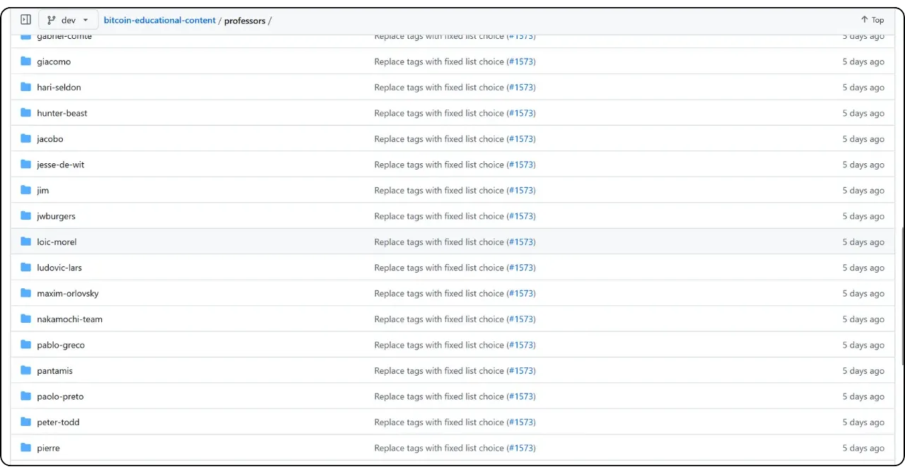

Nếu bạn có kế hoạch đóng góp cho Plan ₿ Network bằng cách viết một hướng dẫn hoặc khóa học mới, bạn sẽ cần một hồ sơ giáo viên. Hồ sơ này sẽ cho phép bạn nhận được các khoản tín dụng phù hợp cho nội dung bạn đóng góp cho nền tảng.

Đối với những bạn đã tham gia tạo nội dung giáo dục trên Plan ₿ Network, có lẽ bạn đã có hồ sơ giáo viên. Bạn có thể tìm thấy hồ sơ này trong thư mục `/professors` [trên kho lưu trữ GitHub của chúng tôi](https://github.com/PlanB-Network/Bitcoin-educational-content/tree/dev/professors). Nếu hồ sơ của bạn đã tồn tại, hãy tìm thông tin đăng nhập của bạn trong tệp `professor.yml`.

Để thay đổi hồ sơ của bạn, hãy vào phần "Chỉnh sửa hồ sơ giáo viên" ở cuối hướng dẫn này.

## Thêm giáo viên mới bằng phần mềm của chúng tôi

Cách dễ nhất để tạo hồ sơ giáo viên của bạn trên Plan ₿ Network là sử dụng công cụ Python tích hợp của chúng tôi. Đây là cách thức hoạt động.

### 1 - Cấu hình môi trường cục bộ của bạn

Bạn phải có Fork của riêng mình từ [kho lưu trữ Plan ₿ Network trên GitHub](https://github.com/PlanB-Network/Bitcoin-educational-content).

Đồng bộ hóa nhánh chính (`dev`) của Fork với kho lưu trữ nguồn.

Cập nhật bản sao cục bộ của bạn.

```bash
# Cloner votre fork (si ce n'est pas déjà fait)
git clone https://github.com/<username>/bitcoin-educational-content.git
cd bitcoin-educational-content
# Ajouter le dépôt source en tant que remote upstream
git remote add upstream https://github.com/PlanB-Network/bitcoin-educational-content.git
# Récupérer les dernières modifications depuis le dépôt source
git fetch upstream
# Se positionner sur la branche principale 'dev'
git checkout dev
# Fusionner les modifications de la branche 'dev' du dépôt source dans votre fork
git merge upstream/dev
# Pousser les mises à jour vers votre fork sur GitHub
git push origin dev
```

### 2 - Tạo nhánh mới

Đảm bảo bạn đang ở nhánh `dev`. Tạo một nhánh mới với tên mô tả (ví dụ: `add-professor-loic-morel`).

Xuất bản nhánh này trên Fork trực tuyến của bạn.

```bash
# Assurez-vous d’être sur la branche 'dev'
git checkout dev
# Créez une nouvelle branche avec un nom descriptif
git checkout -b add-professor-loic-morel
# Publiez cette branche sur votre fork en ligne
git push -u origin add-professor-loic-morel
```

### 3 - Tạo hồ sơ giáo viên của bạn

Đi đến thư mục `scripts/tutorial-related/data-creator/` trên bản sao cục bộ của bạn. Đảm bảo bạn đã cài đặt tất cả các phụ thuộc cần thiết cho phần mềm, trước tiên hãy cài đặt Python:

```bash
pip install -r requirements.txt
```

Sau đó khởi chạy phần mềm bằng lệnh:

```bash
python3 main.py
```

Khi đã vào trang chủ, hãy nhập đường dẫn cục bộ đến bản sao kho lưu trữ của bạn, ngôn ngữ bạn đang viết và GitHub ID của bạn. Nếu bạn đang tạo hồ sơ này cho người khác và đã có hồ sơ Giáo sư, hãy nhập ID của bạn vào trường "*PBN Professor's ID*". Nếu bạn đang tạo hồ sơ của riêng mình, bạn sẽ chưa có ID Giáo sư vì bạn đang trong quá trình tạo hồ sơ, vì vậy hãy để trống trường này.

Sau đó nhấp vào nút "*Giáo sư mới*".


Điền thông tin bắt buộc (vui lòng lưu ý rằng tất cả thông tin này sẽ được công khai trên nền tảng của chúng tôi cũng như trên GitHub):


- Tên hồ sơ giáo viên của bạn (sử dụng tên và họ hoặc bút danh, viết thường);
- Tên hoặc biệt danh của bạn;
- Tạo ngẫu nhiên thông tin đăng nhập của bạn;
- Trang web và hồ sơ của bạn X (tùy chọn);
- Một chiếc Lightning Address để nhận tiền quyên góp từ độc giả (tùy chọn);
- Chọn 2 hoặc 3 thẻ từ danh sách;
- Nhấp vào "*Chọn ảnh*" để chọn ảnh đại diện từ thư mục cục bộ của bạn (có thể sử dụng bất kỳ tên và định dạng nào cho ảnh và phần mềm sẽ tự động điều chỉnh. Chỉ cần đảm bảo ảnh là hình vuông);
- Viết mô tả ngắn về hồ sơ của bạn.

Hoàn tất việc tạo bằng cách nhấp vào "*Tạo Giáo sư*". Thao tác này sẽ tự động generate tất cả các tệp cần thiết cho hồ sơ của bạn.


Lưu các thay đổi cục bộ của bạn bằng cách tạo một cam kết có thông báo giải thích. Đẩy các thay đổi lên GitHub Fork của bạn.

```bash
# Créez un commit avec un message descriptif
git commit -m "*new professor Loïc Morel*"
# Poussez vos modifications sur votre fork
git push origin add-professor-loic-morel
```

Sau khi hoàn tất, hãy tạo Pull Request (PR) trên GitHub để đề xuất tích hợp các sửa đổi của bạn. Thêm tiêu đề và mô tả ngắn gọn vào PR.

### 4 - Kiểm tra và hợp nhất

Chờ xác thực hoặc phản hồi từ quản trị viên. Nếu cần, hãy sửa lỗi và đẩy các cam kết mới.

```bash
# Créez un commit décrivant les corrections apportées
git commit -m "*Corrections suite à la revue du tutoriel green-wallet*"
# Poussez les corrections sur votre fork
git push origin add-professor-loic-morel
```

Sau khi PR đã được hợp nhất, bạn có thể xóa nhánh đang hoạt động của mình.

## Sửa đổi hồ sơ giáo viên của bạn

Nếu bạn đã thành thạo cách sử dụng Git, hãy sửa đổi hồ sơ giáo viên của bạn bằng cách tạo một nhánh mới và chỉnh sửa tệp có liên quan trực tiếp trong thư mục hiện tại của bạn. Có thể thực hiện thay đổi trong tệp `professor.yml` hoặc trong tệp markdown, tùy thuộc vào thông tin cần sửa. Sau khi bạn đã thực hiện thay đổi cục bộ, hãy đẩy chúng lên Fork của bạn và gửi PR.

Đối với người mới bắt đầu, tôi khuyên bạn nên thực hiện sửa đổi trực tiếp thông qua trang web Interface của GitHub. Đảm bảo bạn có tài khoản GitHub. Nếu bạn không biết cách tạo tài khoản, hãy làm theo hướng dẫn này:

https://planb.network/tutorials/contribution/others/create-github-account-a75fc39d-f0d0-44dc-9cd5-cd94aee0c07c
Truy cập [kho lưu trữ GitHub Plan ₿ Network dành riêng cho dữ liệu](https://github.com/PlanB-Network/Bitcoin-educational-content/graphs/contributors).



Nhấp vào thư mục "*giáo sư*", sau đó chuyển đến thư mục cá nhân của bạn.



Để thay đổi siêu dữ liệu hồ sơ của bạn, chẳng hạn như Lightning Address, tên hoặc liên kết, hãy chọn tệp "*professor.yml*". Để thay đổi mô tả của bạn, hãy nhấp vào tệp YAML cho ngôn ngữ của bạn (ví dụ: "*en.yml*" hoặc "*fr.yml*").

Nếu bạn sửa đổi mô tả của mình, hãy nhớ xóa tất cả các bản dịch lỗi thời. Sau đó, bạn có thể tự dịch mô tả của mình sang các ngôn ngữ khác với sự trợ giúp của LLM hoặc chỉ để lại mô tả bằng ngôn ngữ mẹ đẻ của bạn và đề cập trong Yêu cầu kéo rằng mô tả của bạn cần được nhóm của chúng tôi dịch.


Khi đã vào tệp bạn muốn sửa đổi, hãy nhấp vào biểu tượng bút chì.


Nếu bạn chưa có Fork từ kho lưu trữ Plan ₿ Network, GitHub sẽ gợi ý bạn tạo một kho lưu trữ. Nhấp vào "*Fork kho lưu trữ này*".


Thực hiện những thay đổi mong muốn cho tệp. Khi hoàn tất, hãy nhấp vào "*Cam kết thay đổi*".


Nhập tin nhắn mô tả thay đổi của bạn, sau đó chọn "*Đề xuất thay đổi*".


Tóm tắt các thay đổi của bạn sẽ được hiển thị. Nếu bạn muốn thực hiện thêm các thay đổi cho hồ sơ của mình, bạn có thể quay lại các thư mục và thực hiện thêm các cam kết. Khi bạn hoàn tất, hãy nhấp vào "*Create pull request*".

Yêu cầu kéo là yêu cầu được đưa ra để tích hợp các thay đổi từ nhánh của bạn vào nhánh chính của kho lưu trữ Plan ₿ Network, cho phép xem xét và thảo luận về các thay đổi trước khi chúng được hợp nhất.


Đảm bảo rằng ở đầu Interface, nhánh làm việc của bạn đã được hợp nhất với nhánh `dev` của kho lưu trữ Plan ₿ Network (là nhánh chính).

Nhập tiêu đề tóm tắt ngắn gọn những thay đổi bạn muốn hợp nhất với kho lưu trữ nguồn. Thêm một bình luận ngắn gọn mô tả những thay đổi này, sau đó nhấp vào nút "*Create pull request*" của Green để xác nhận yêu cầu kéo:


PR của bạn sau đó sẽ hiển thị trong tab "*Pull Request*" của kho lưu trữ Plan ₿ Network chính. Tất cả những gì bạn phải làm bây giờ là đợi quản trị viên hợp nhất sửa đổi của bạn.


Nếu bạn gặp bất kỳ khó khăn kỹ thuật nào khi gửi thay đổi của mình, vui lòng đừng ngần ngại yêu cầu trợ giúp trên [nhóm Telegram của chúng tôi dành riêng cho các đóng góp](https://t.me/PlanBNetwork_ContentBuilder). Cảm ơn bạn rất nhiều!