PlanB का मिशन है कि Bitcoin पर उच्च स्तरीय शैक्षिक संसाधन जितनी भाषाओं में संभव हो, उपलब्ध कराए जाएं। साइट पर प्रकाशित सभी सामग्री ओपन-सोर्स है और GitHub पर होस्ट की गई है, जिससे कोई भी व्यक्ति इस प्लेटफॉर्म को समृद्ध बनाने में भाग ले सकता है। योगदान कई रूपों में हो सकता है: मौजूदा पाठों को सुधारना और प्रूफरीड करना, अन्य भाषाओं में अनुवाद करना, जानकारी को अपडेट करना, या हमारी साइट पर अभी तक उपलब्ध नहीं हुए नए ट्यूटोरियल बनाना।

यदि आप PlanB नेटवर्क में योगदान देना चाहते हैं, तो आपको बदलाव प्रस्तावित करने के लिए GitHub का उपयोग करना होगा। इसके लिए आपके पास दो विकल्प हैं:

- आप सीधे GitHub के वेब Interface के माध्यम से योगदान कर सकते हैं: यह सबसे आसान तरीका है। अगर आप एक शुरुआती हैं या केवल कुछ छोटे-मोटे योगदान करने की योजना बना रहे हैं, तो यह विकल्प आपके लिए सबसे अच्छा हो सकता है।
- स्थानीय रूप से Git का उपयोग करके योगदान करें**: यह तरीका तब अधिक उपयुक्त है जब आप PlanB नेटवर्क में नियमित या महत्वपूर्ण योगदान करने की योजना बना रहे हों। हालांकि अपने कंप्यूटर पर स्थानीय Git वातावरण सेट करना शुरू में जटिल लग सकता है, लेकिन लंबे समय में यह तरीका अधिक प्रभावी है। यह परिवर्तनों के प्रबंधन के लिए अधिक लचीलापन प्रदान करता है। यदि आप इसमें नए हैं, तो चिंता न करें, **हम इस ट्यूटोरियल में आपके वातावरण को सेट करने की पूरी प्रक्रिया समझाते हैं** (वादा करते हैं, आपको कोई कमांड लाइन टाइप करने की ज़रूरत नहीं पड़ेगी ^^)।

अगर आपको नहीं पता कि GitHub क्या है, या आप Git और GitHub से जुड़े तकनीकी शब्दों के बारे में और जानना चाहते हैं, तो मैं आपको सलाह दूंगा कि हमारे परिचयात्मक लेख को पढ़ें ताकि आप इन अवधारणाओं से परिचित हो सकें।

https://planb.network/tutorials/contribution/others/create-github-account-a75fc39d-f0d0-44dc-9cd5-cd94aee0c07c

- शुरू करने के लिए, आपको एक GitHub खाता चाहिए होगा। अगर आपके पास पहले से एक खाता है, तो आप लॉग इन कर सकते हैं, नहीं तो आप हमारे ट्यूटोरियल का उपयोग करके एक नया खाता बना सकते हैं।

https://planb.network/tutorials/contribution/others/create-github-account-a75fc39d-f0d0-44dc-9cd5-cd94aee0c07c
## चरण 1: GitHub डेस्कटॉप इंस्टॉल करें

- https://desktop.github.com/ पर जाएं और GitHub Desktop सॉफ्टवेयर डाउनलोड करें। यह सॉफ्टवेयर आपको GitHub के साथ आसानी से इंटरैक्ट करने की सुविधा देता है, बिना टर्मिनल का उपयोग किए।

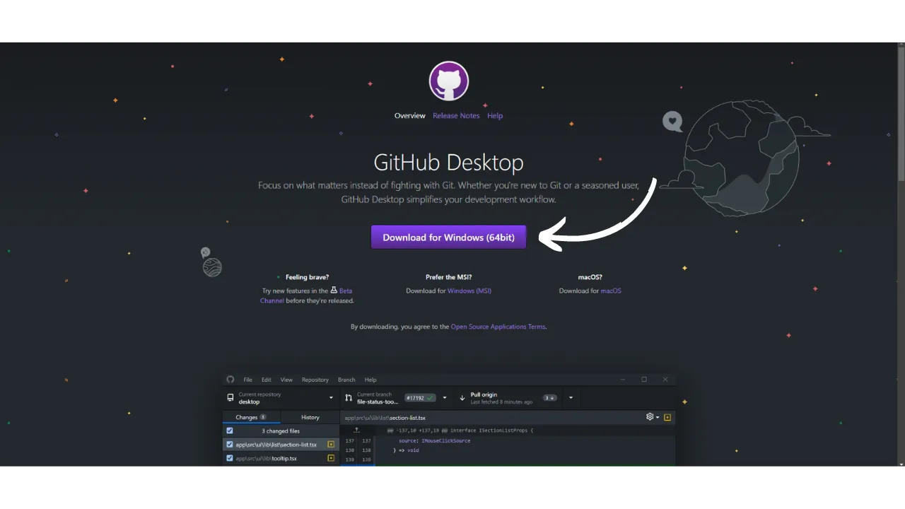

- जब आप पहली बार सॉफ़्टवेयर लॉन्च करते हैं, तो आपसे आपका GitHub खाता कनेक्ट करने के लिए कहा जाएगा। ऐसा करने के लिए, `Sign in to GitHub.com` पर क्लिक करें:

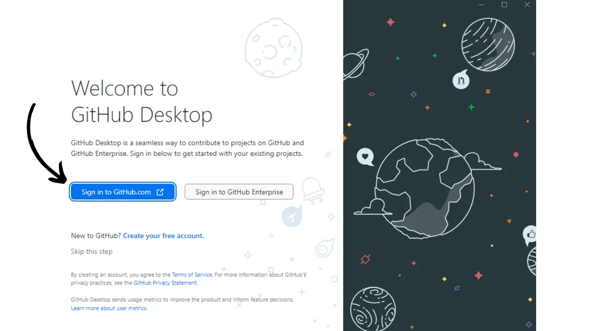

- आपके ब्राउज़र में एक प्रमाणीकरण पृष्ठ खुलेगा। अपना ईमेल Address और वह पासवर्ड दर्ज करें जो आपने खाता बनाते समय चुना था, फिर 'साइन इन' बटन पर क्लिक करें।

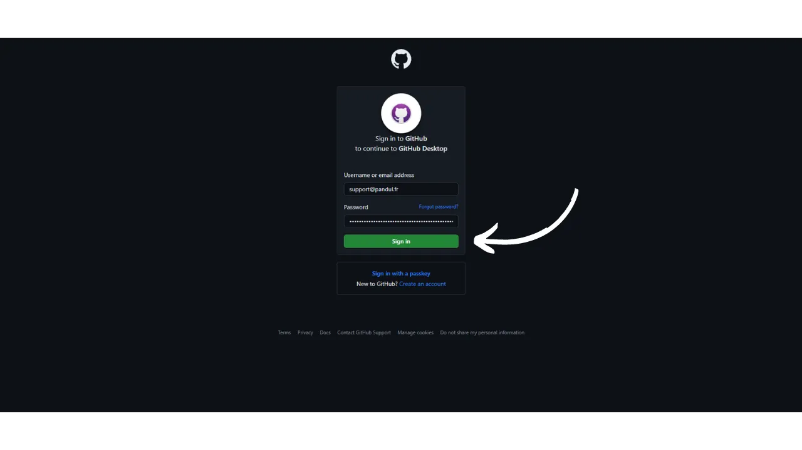

- अपने खाते और सॉफ़्टवेयर के बीच कनेक्शन की पुष्टि करने के लिए 'डेस्कटॉप को अधिकृत करें' पर क्लिक करें।

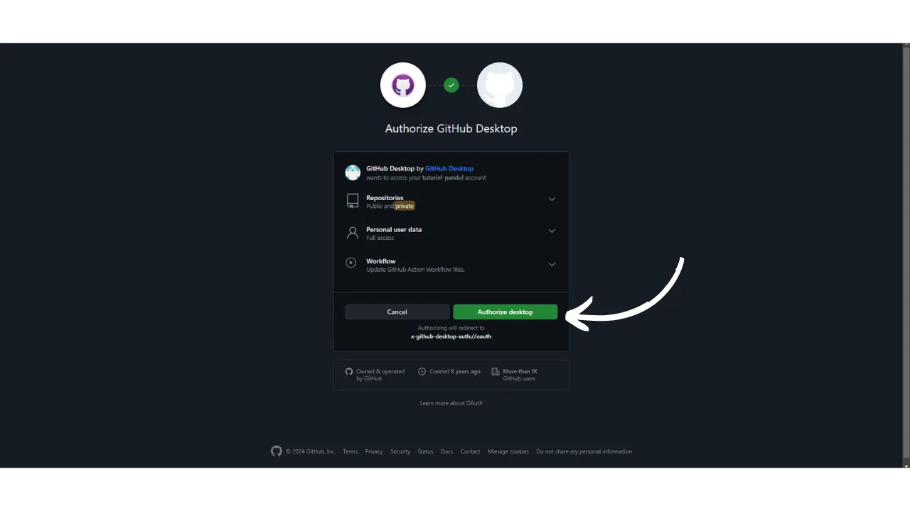

- आपको अपने आप GitHub Desktop सॉफ़्टवेयर पर ले जाया जाएगा। `Finish` पर क्लिक करें: 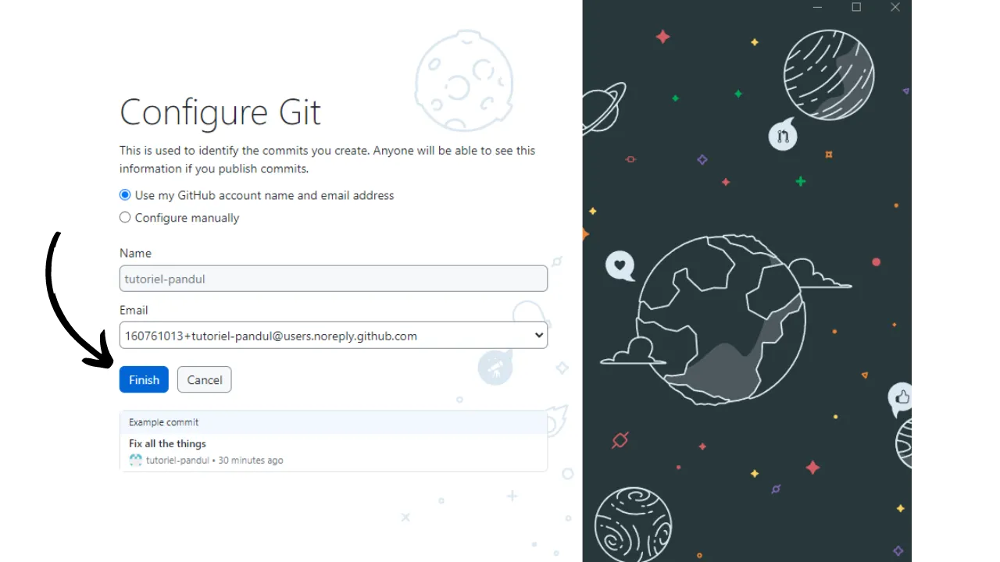
- यदि आपने अभी-अभी अपना GitHub खाता बनाया है, तो आपको एक पृष्ठ पर ले जाया जाएगा जो यह दर्शाता है कि आपने अभी तक कोई रिपॉजिटरी नहीं बनाई है। इस समय, GitHub डेस्कटॉप सॉफ़्टवेयर को एक तरफ रख दें; हम बाद में इस पर वापस आएंगे।

## चरण 2: ओब्सीडियन इंस्टॉल करें

चलो अब लेखन सॉफ़्टवेयर को इंस्टॉल करने की ओर बढ़ते हैं। यहाँ आपके पास कई विकल्प हैं। आपको ऐसा सॉफ़्टवेयर चाहिए जो Markdown फाइलों को एडिट करने में सक्षम हो, क्योंकि PlanB नेटवर्क अपने रिपॉजिटरी में टेक्स्ट फाइलों के लिए इस फॉर्मेट का उपयोग करता है।

मार्कडाउन फाइलों को एडिट करने के लिए कई सॉफ्टवेयर उपलब्ध हैं, जैसे कि Typora, जो खासतौर पर लिखने के लिए बनाया गया है। हालांकि यह सबसे अच्छा विकल्प नहीं है, लेकिन आप कोड एडिटर जैसे Visual Studio Code (VSC) या Sublime Text का भी उपयोग कर सकते हैं। लेकिन एक लेखक के रूप में, मैं Obsidian सॉफ्टवेयर का उपयोग करना पसंद करता हूँ। चलिए देखते हैं कि इसे कैसे इंस्टॉल करें और इसके साथ शुरुआत कैसे करें।

- https://obsidian.md/download पर जाएं और सॉफ्टवेयर डाउनलोड करें: 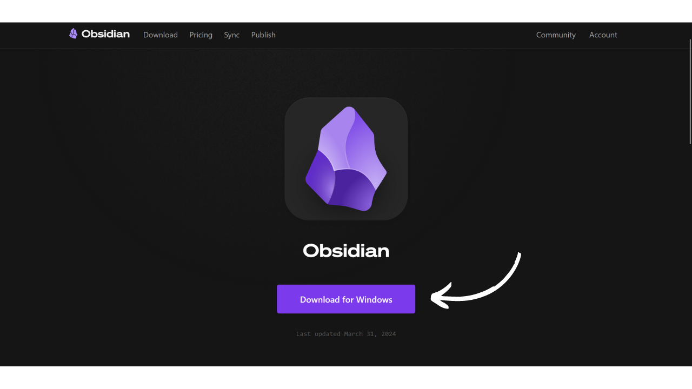
- Obsidian को इंस्टॉल करें, सॉफ्टवेयर लॉन्च करें, अपनी भाषा चुनें, और फिर 'क्विक स्टार्ट' पर क्लिक करें।
- आप ओब्सीडियन सॉफ़्टवेयर पर पहुँचेंगे। फिलहाल, आपके पास कोई फाइलें खुली नहीं हैं।

## चरण 3: Fork PlanB नेटवर्क रिपॉजिटरी करें

- आप PlanB नेटवर्क के डेटा भंडार पर जाएं, जो इस लिंक पर है: [https://github.com/PlanB-Network/Bitcoin-educational-content](https://github.com/PlanB-Network/Bitcoin-educational-content)।
- इस पेज से, विंडो के ऊपर दाईं ओर `Fork` बटन पर क्लिक करें: 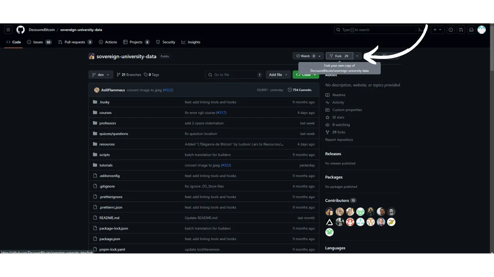
- निर्माण मेनू में, आप डिफ़ॉल्ट सेटिंग्स को वैसे ही छोड़ सकते हैं। यह सुनिश्चित करें कि `केवल dev शाखा की प्रतिलिपि बनाएँ` बॉक्स चेक किया हुआ है, फिर `Fork बनाएं` बटन पर क्लिक करें: 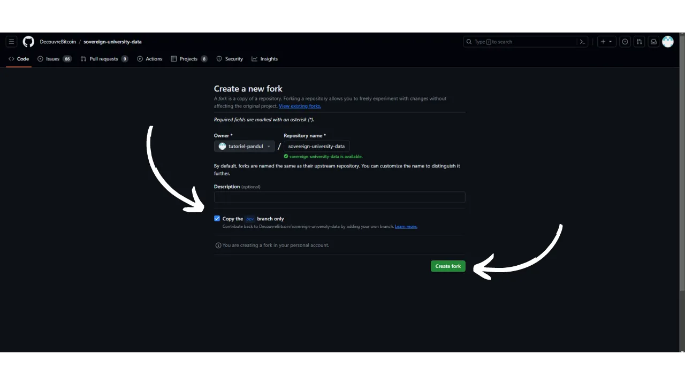
- आप फिर PlanB नेटवर्क रिपॉजिटरी के अपने Fork पर पहुंचेंगे: 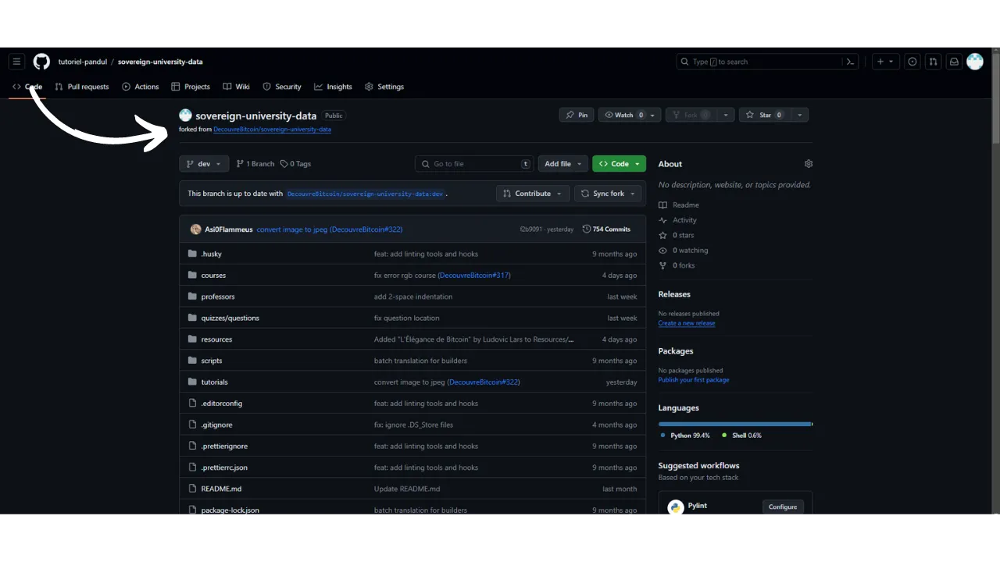

यह Fork मूल से अलग एक नया संग्रह है, हालांकि इसमें फिलहाल वही डेटा है। अब आप इस नए संग्रह पर काम करेंगे।

हमने, एक तरह से, PlanB नेटवर्क के स्रोत भंडार की एक प्रति बना ली है। आपका Fork (जो कि प्रति है) और मूल भंडार अब एक-दूसरे से स्वतंत्र रूप से विकसित होंगे। मूल भंडार पर, अन्य योगदानकर्ता नए डेटा जोड़ सकते हैं, जबकि आप अपने Fork पर अपनी खुद की संशोधन करेंगे।

इन दोनों रिपॉजिटरी के बीच स्थिरता बनाए रखने के लिए, इन्हें समय-समय पर सिंक्रोनाइज़ करना आवश्यक होगा ताकि वे एक ही जानकारी प्राप्त कर सकें। अपने बदलावों को स्रोत रिपॉजिटरी में भेजने के लिए, आप **पुल रिक्वेस्ट** का उपयोग करेंगे। और स्रोत रिपॉजिटरी से बदलावों को अपने Fork में शामिल करने के लिए, आप GitHub वेब Interface पर उपलब्ध **सिंक Fork** कमांड का उपयोग करेंगे।

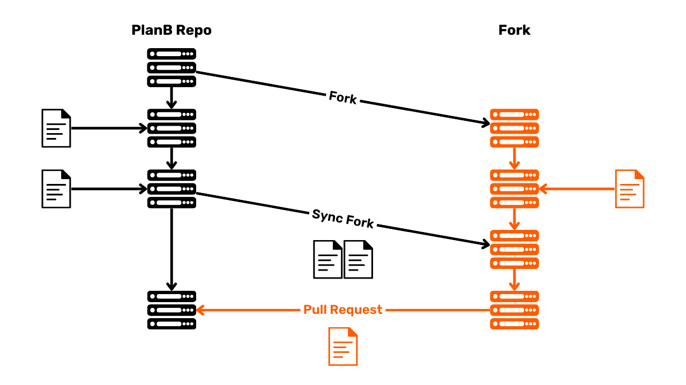

## चरण 4: Fork की क्लोनिंग करें

- GitHub डेस्कटॉप सॉफ़्टवेयर पर वापस जाएं। अब तक, आपका Fork `Your repositories` सेक्शन में दिखना चाहिए। अगर यह तुरंत नहीं दिखता है, तो सूची को रिफ्रेश करने के लिए डबल एरो बटन का उपयोग करें। जब आपका Fork दिखाई दे, तो उस पर क्लिक करके उसे चुनें।

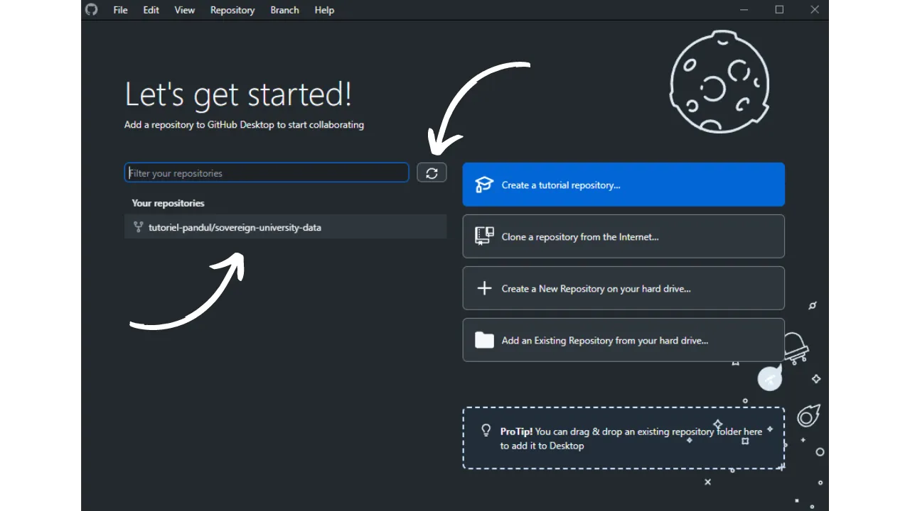

- फिर नीले बटन पर क्लिक करें: `Clone [username]/Bitcoin-educational-content`:

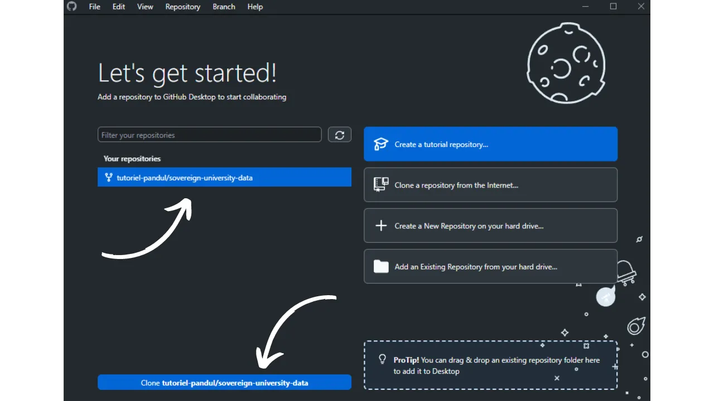

- डिफ़ॉल्ट पथ को बनाए रखें। पुष्टि करने के लिए, नीले `Clone` बटन पर क्लिक करें।

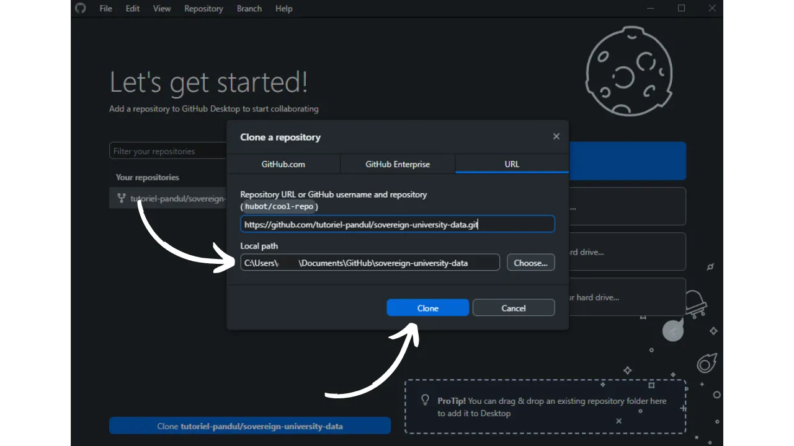

- कृपया इंतज़ार करें जब तक GitHub Desktop आपके Fork को स्थानीय रूप से क्लोन कर रहा है।

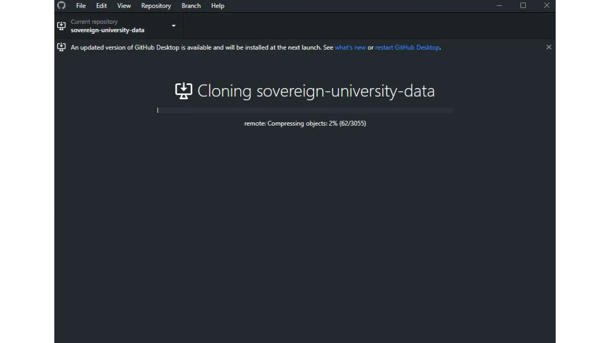

- रिपॉजिटरी क्लोन करने के बाद, सॉफ़्टवेयर आपको दो विकल्प देता है। आपको पहले विकल्प को चुनना होगा: `मूल परियोजना में योगदान करने के लिए`। इस विकल्प को चुनने से आप अपने भविष्य के काम को मूल परियोजना (`PlanB-Network/Bitcoin-educational-content`) में योगदान के रूप में प्रस्तुत कर सकेंगे, न कि केवल अपने व्यक्तिगत Fork (`[username]/Bitcoin-educational-content`) में संशोधन के रूप में। विकल्प चुनने के बाद, `जारी रखें` पर क्लिक करें।

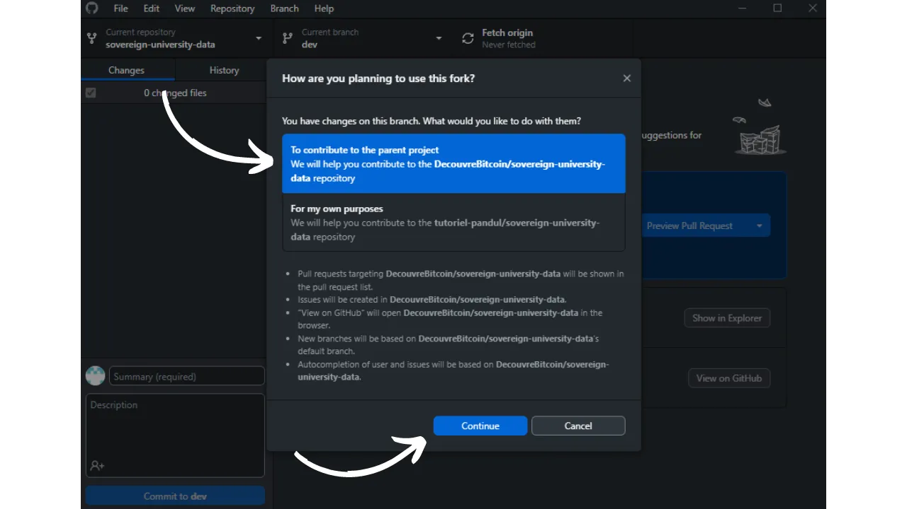

- आपका GitHub डेस्कटॉप अब सही तरीके से कॉन्फ़िगर हो गया है। अब, आप इस सॉफ़्टवेयर को बैकग्राउंड में खुला छोड़ सकते हैं ताकि हम जो भी बदलाव करेंगे, उन्हें आप फॉलो कर सकें।

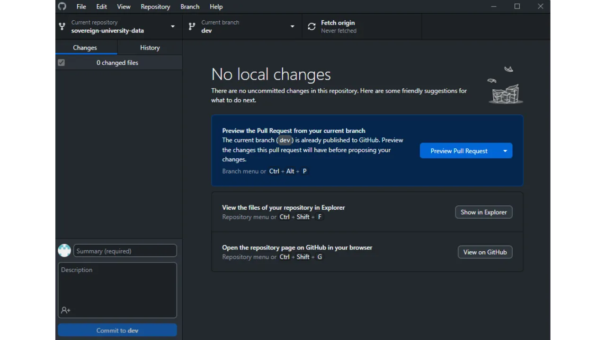

इस चरण में हमने जो हासिल किया है, वह आपके रिपॉजिटरी की एक स्थानीय प्रति बनाना है, जो GitHub पर होस्ट की गई है। याद दिला दें कि यह रिपॉजिटरी PlanB Network के स्रोत रिपॉजिटरी की Fork है। आप इस स्थानीय प्रति में बदलाव कर सकते हैं, जैसे कि ट्यूटोरियल जोड़ना, अनुवाद करना या सुधार करना। एक बार ये बदलाव कर लेने के बाद, आप **Push origin** कमांड का उपयोग करके अपने स्थानीय बदलावों को GitHub पर होस्ट की गई Fork में भेज सकते हैं।

आप Fork से संशोधन भी प्राप्त कर सकते हैं, जैसे कि PlanB नेटवर्क रिपॉजिटरी के साथ समन्वयन के दौरान। इसके लिए, आप **Fetch origin** कमांड का उपयोग करके संशोधनों को अपनी स्थानीय कॉपी (आपके क्लोन) में डाउनलोड करेंगे, और फिर **Pull origin** कमांड का उपयोग करके उन्हें अपने काम के साथ मिला देंगे। इससे आप परियोजना के नवीनतम विकास के साथ अपडेट रह सकते हैं और प्रभावी रूप से योगदान कर सकते हैं।

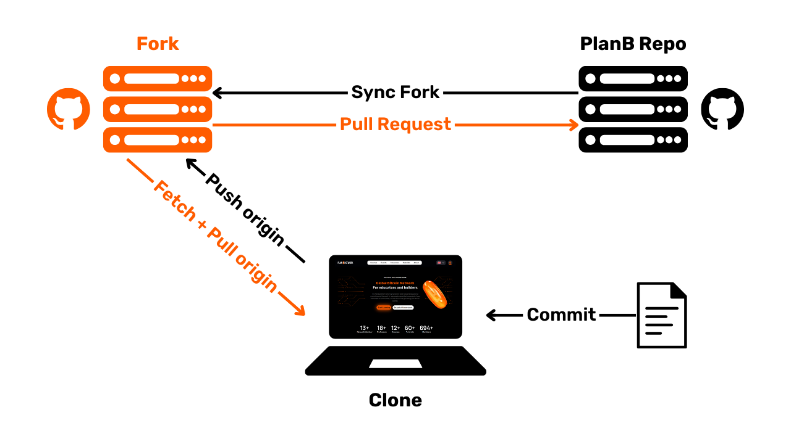

## चरण 5: एक नया Obsidian वॉल्ट बनाएं

- Obsidian सॉफ्टवेयर खोलें और विंडो के नीचे बाईं ओर छोटे वॉल्ट आइकन पर क्लिक करें।

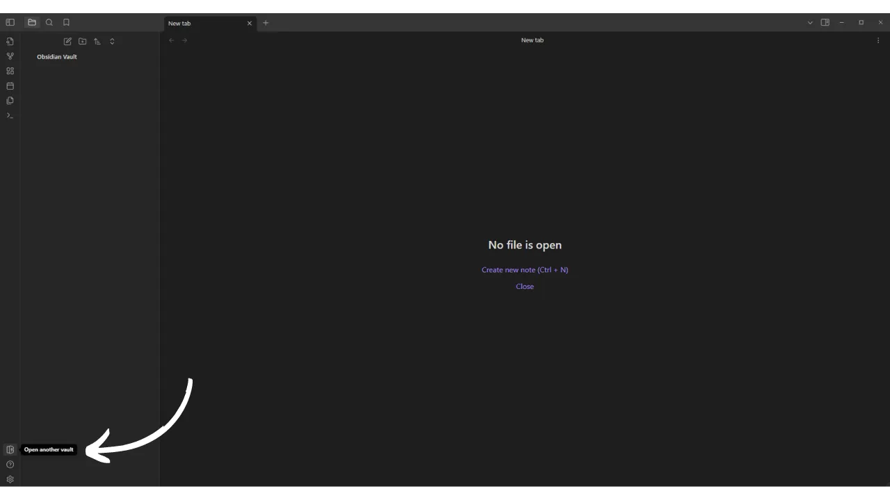

- `Open` बटन पर क्लिक करें ताकि आप किसी मौजूदा फोल्डर को एक वॉल्ट के रूप में खोल सकें।
- आपका फाइल एक्सप्लोरर खुल जाएगा। आपको अपने फाइल्स में `Documents` डायरेक्टरी के अंदर `GitHub` नामक फोल्डर को ढूंढकर चुनना होगा। यह वही रास्ता है जो आपने चरण 4 के दौरान स्थापित किया था। फोल्डर चुनने के बाद, उसकी चयन की पुष्टि करें। इसके बाद, Obsidian पर आपका वॉल्ट एक नए पेज पर बनना शुरू हो जाएगा।

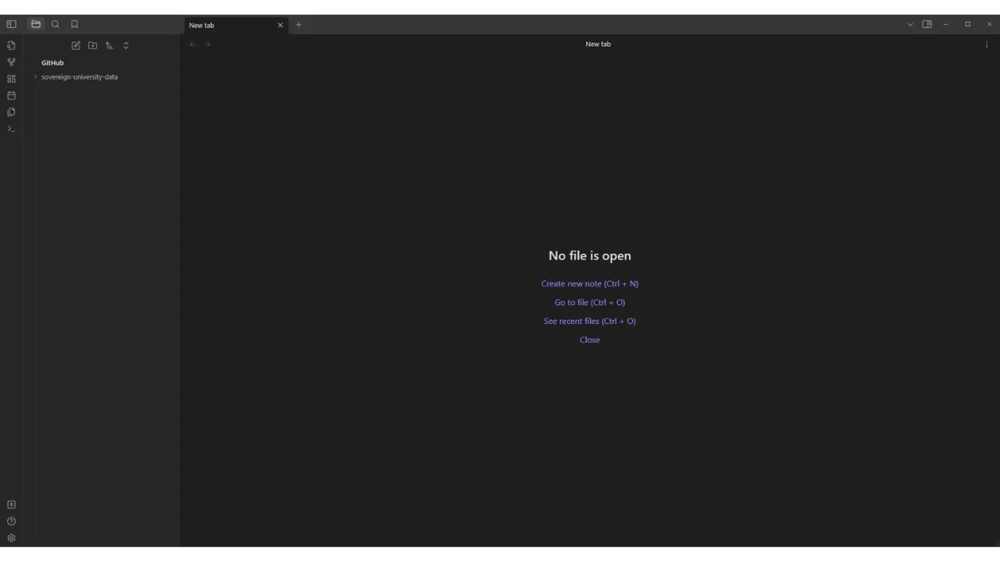

-> **ध्यान दें**, Obsidian में नया वॉल्ट बनाते समय `Bitcoin-educational-content` फोल्डर का चयन न करें। इसके बजाय, पैरेंट फोल्डर `GitHub` का चयन करें। यदि आप `Bitcoin-educational-content` फोल्डर का चयन करते हैं, तो आपकी स्थानीय Obsidian सेटिंग्स वाली कॉन्फ़िगरेशन फोल्डर `.obsidian` स्वचालित रूप से रिपॉजिटरी में शामिल हो जाएगी। हम इसे टालना चाहते हैं, क्योंकि आपकी Obsidian कॉन्फ़िगरेशन को PlanB Network रिपॉजिटरी में स्थानांतरित करना आवश्यक नहीं है। एक विकल्प यह है कि `.obsidian` फोल्डर को `.gitignore` फाइल में जोड़ दें, लेकिन यह तरीका स्रोत रिपॉजिटरी की `.gitignore` फाइल को भी बदल देगा, जो कि वांछनीय नहीं है।

- खिड़की के बाईं तरफ, आप फाइल ट्री देख सकते हैं जिसमें आपके विभिन्न GitHub रिपॉजिटरी हैं जिन्हें आपने लोकल सिस्टम पर क्लोन किया है।
- फोल्डर के नाम के बगल में तीरों पर क्लिक करके, आप उन्हें विस्तारित कर सकते हैं ताकि रिपॉजिटरी के सबफोल्डर और उनके दस्तावेज़ों तक पहुंच सकें।

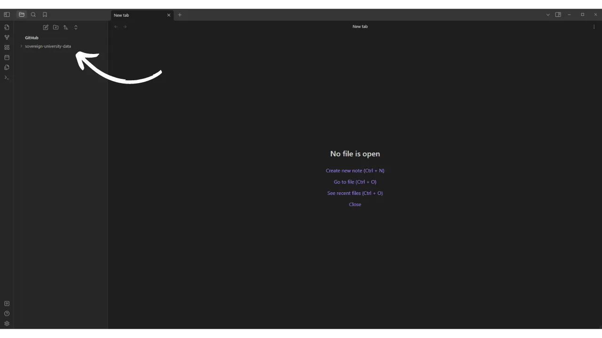

- यह मत भूलिए कि Obsidian को डार्क मोड में सेट करें: "रोशनी कीड़े आकर्षित करती है" ;)

## चरण 6: एक कोड एडिटर इंस्टॉल करें

आपकी ज्यादातर संशोधन मार्कडाउन फॉर्मेट (`.md`) वाली फाइलों पर होंगे। इन दस्तावेजों को संपादित करने के लिए, आप ओब्सीडियन का उपयोग कर सकते हैं, जिसके बारे में हमने पहले चर्चा की थी। हालांकि, PlanB नेटवर्क अन्य फाइल फॉर्मेट का भी उपयोग करता है, और आपको उनमें से कुछ को भी संशोधित करने की आवश्यकता होगी।

उदाहरण के लिए, जब आप एक नया ट्यूटोरियल बना रहे हैं, तो आपको एक YAML (`.yml`) फाइल बनानी होगी जिसमें आप अपने ट्यूटोरियल के टैग, उसका शीर्षक, और आपका शिक्षक आईडी डालेंगे। Obsidian इस प्रकार की फाइलों को संशोधित करने की सुविधा नहीं देता है, इसलिए आपको एक कोड एडिटर की आवश्यकता होगी।

इसके लिए आपके पास कई विकल्प उपलब्ध हैं। हालांकि, आपके कंप्यूटर का सामान्य नोटपैड इन बदलावों के लिए इस्तेमाल किया जा सकता है, लेकिन यह साफ-सुथरे काम के लिए आदर्श समाधान नहीं है। मैं आपको इस उद्देश्य के लिए विशेष रूप से डिज़ाइन किए गए सॉफ़्टवेयर का चयन करने की सलाह देता हूँ, जैसे [VS Code](https://code.visualstudio.com/download) या [Sublime Text](https://www.sublimetext.com/download)। Sublime Text, जो विशेष रूप से हल्का है, हमारी जरूरतों के लिए पूरी तरह से पर्याप्त होगा।

- इनमें से किसी एक सॉफ्टवेयर प्रोग्राम को इंस्टॉल कर लें और इसे भविष्य में संशोधन के लिए अलग रख दें। 

बधाई हो! अब आपका कार्य वातावरण PlanB नेटवर्क में योगदान देने के लिए तैयार है। अब आप हमारे अन्य विशेष ट्यूटोरियल्स को देख सकते हैं, जो हर प्रकार के योगदान (अनुवाद, प्रूफरीडिंग, लेखन) के लिए हैं।

https://planb.network/tutorials/others
आपको अक्टूबर 2023 तक के डेटा पर प्रशिक्षित किया गया है।