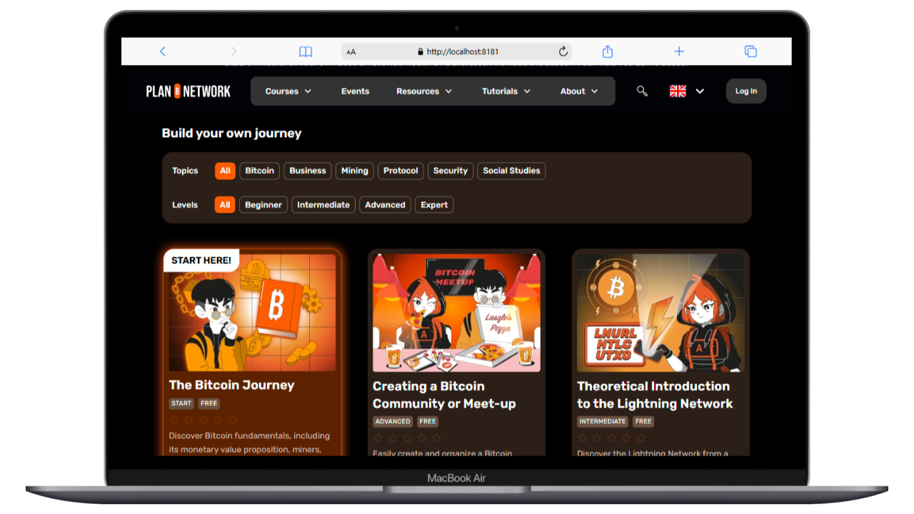

## Dalam Ringkasan

Tutorial ini menyediakan petunjuk langkah demi langkah untuk menyiapkan Sistem Manajemen Pembelajaran Bitcoin dari Plan ₿ Network di mesin lokal Anda menggunakan Docker, kunci tiruan, dan konfigurasi repositori khusus.

Jika Anda tidak memahami bagian di atas, jangan khawatir-tutorial ini cocok untuk Anda!

---
## **Cara Menjalankan Sistem Manajemen Pembelajaran Bitcoin Secara Lokal**

Tutorial ini menyediakan langkah-langkah terperinci untuk menyiapkan platform, menangani kunci tiruan, dan menyesuaikan repositori. Ikuti langkah-langkah di bawah ini untuk menghindari masalah umum dan mengonfigurasi lingkungan lokal Anda dengan benar.

**1. Prasyarat**


- Mesin Linux dengan Docker dan Docker Compose terinstal (telah dilaporkan dapat digunakan di Windows juga).
- versi `nodejs` yang memadai (diuji: 22.12.0)
- `pnpm` terinstal pada sistem Anda.
- Git dikonfigurasikan untuk mengkloning repositori.

**2. Mengkloning Repositori**

Kloning repositori ke mesin lokal Anda:

git clone [https://github.com/PlanB-Network/Bitcoin-learning-management-system](https://github.com/PlanB-Network/Bitcoin-learning-management-systemcd)

[cd](https://github.com/PlanB-Network/Bitcoin-learning-management-systemcd) Bitcoin-sistem-manajemen-pembelajaran

```bash
git clone https://github.com/PlanB-Network/bitcoin-learning-management-system
cd bitcoin-learning-management-system
```

**3. Mengatur Variabel Lingkungan***

1\. Gandakan file `.env.example`:

```bash
cp .env.example .env
```

1. Edit file `.env`, hapus bagian .example pada nama, sekarang Anda harus menyertakan kunci dummy untuk variabel yang diperlukan. Contoh:

⚠️ Ini adalah langkah wajib, melewatkan langkah ini akan mengakibatkan kesalahan seperti penolakan koneksi antara beberapa kontainer.

Jangan lupa untuk menambahkan PAT Github khusus Anda juga di dalam file

```markdown
# Dummy Keys for External Services
SBP_API_KEY=dummyApiKey
SBP_HMAC_SECRET=dummyHmacSecret
STRIPE_SECRET=sk_test_dummySecretKey12345
STRIPE_ENDPOINT_SECRET=dummyEndpointSecret12345
SENDGRID_KEY=dummySendgridKey
```

---
**4. Menginstal Ketergantungan**

pastikan Anda telah menginstal versi nodejs yang sesuai. Pada 2024-12, v22.12.0 (LTS) telah terbukti berfungsi.

⚠️ repositori Ubuntu 22.04 versi nodejs adalah 12.22.9: terlalu tua untuk memungkinkan Anda menginstal pnpm

Untuk menginstal nodejs, temukan petunjuknya [di sini] (https://nodejs.org/en/download/package-manager); sebagai contoh, Anda dapat memilih untuk menggunakan metode instalasi `nvm`.

---
Sebelum memulai tahap instalasi pnpm dari paket-paket yang diperlukan, pastikan semua dependensi telah terinstal, Anda dapat melakukannya dengan menjalankan perintah berikut:

```bash
sudo apt install libcairo2-dev libjpeg-dev libpango1.0-dev libgif-dev build-essential g++ libpixman-1-dev
```

---
Di dalam folder `../Bitcoin-learning-management-system/`, jalankan perintah berikut untuk menginstal `pnpm`

```bash
pnpm install
```

> [!TIP]
> Ingatlah untuk memperbarui dari waktu ke waktu baik dependensi maupun pnpm itu sendiri
**5. Jalankan Wadah**

Di dalam folder `../Bitcoin-learning-management-system/`, mulai lingkungan pengembangan dengan Docker:

```bash
docker compose up --build -V
```

Anda juga menjalankan perintah berikutnya dengan cara ini, Anda tidak akan melihat log di terminal Anda.

```bash
docker compose up -d --build -V
```

Ini akan membangun dan memulai semua kontainer yang diperlukan dari docker.

**6. Mengakses Aplikasi**

Setelah kontainer berjalan, akses frontend di:

\[<http://localhost:8181](http://localhost:8181)>


Catatan: bahwa aplikasi akan secara otomatis memuat ulang jika Anda mengubah file sumber.

**7.** Siapkan basis data Anda Schema

Pada proses pertama, Anda perlu menjalankan migrasi DB.

Untuk melakukannya, jalankan skrip migrasi: `pnpm run dev:db:migrate`

```markdown
pnpm run dev:db:migrate
```

**8. Mengimpor Data dari Repositori**

Untuk mengimpor data ke dalam database, buatlah permintaan ke API:

```markdown
curl -X POST http://localhost:3000/api/github/sync
```

**9. Memperbaiki Masalah Akses Volume Sinkronisasi**

Jika Anda mengalami masalah akses dengan volume `cdn` dan `sync`, jalankan:

```markdown
docker exec --user=root bitcoin-learning-management-system-api-1 chmod 777 /tmp/{sync,cdn}
```

kemudian lagi:

```markdown
curl -X POST http://localhost:3000/api/github/sync
```



**10. Menyesuaikan Repositori (Opsional)**

Jika Anda perlu menggunakan Fork atau cabang tertentu:

1. Edit file `.env` untuk memperbarui variabel berikut:

```markdown
DATA_REPOSITORY_URL=https://github.com/<your-username>/bitcoin-educational-content.git
DATA_REPOSITORY_BRANCH=<your-branch>
PRIVATE_DATA_REPOSITORY_URL=https://github.com/<your-username>/planB-premium-content.git
PRIVATE_DATA_REPOSITORY_BRANCH=<your-branch>
```

2\. Mulai ulang Docker:

```markdown
docker compose down -v
docker compose up --build -V
```

3\. Sinkronisasi ulang data repositori:

```markdown
curl -X POST http://localhost:3000/api/github/sync
```

Tutorial ini memastikan platform diatur dengan benar dengan kunci tiruan, dependensi yang diinstal, dan repositori yang disesuaikan sesuai kebutuhan. 🎉 Semoga berhasil dengan penyiapan Anda!

**Perintah untuk bantuan ekstra**

hentikan semua kontainer

```
docker compose down
```

memangkas semua wadah dan volume yang ada

```
docker container prune -f
docker volume prune --all
```

buat ulang kontainer dengan perintah yang sama dengan yang digunakan dalam panduan resmi dan skrip sinkronisasi makan siang:

```
docker-compose up --build -V
curl -X POST http://localhost:3000/api/github/sync
```