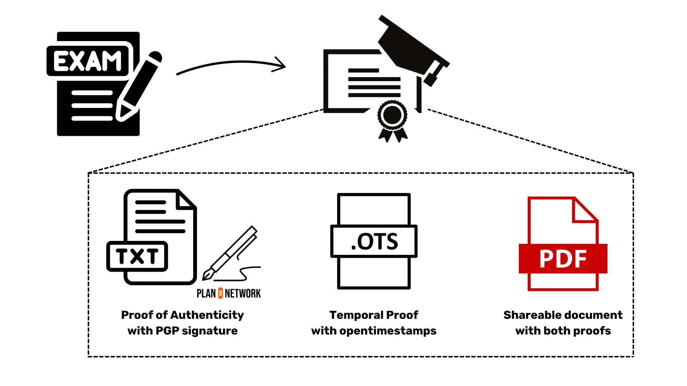
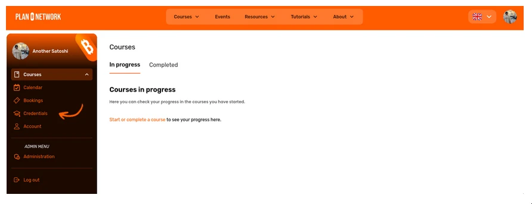
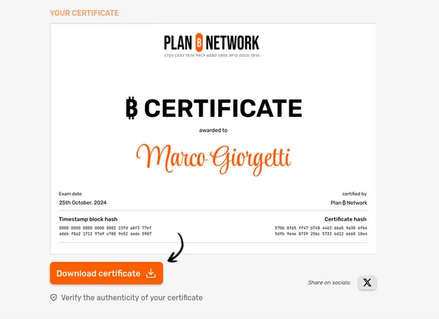
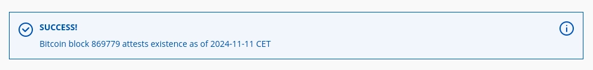

अगर आप यह पढ़ रहे हैं, तो बहुत संभावना है कि आपने या तो ₿-CERT टेस्ट सर्टिफिकेट प्राप्त किया है या planb.network पर किए गए किसी कोर्स का डिप्लोमा पूरा किया है। तो इस उपलब्धि के लिए बधाई!

इस ट्यूटोरियल में, हम जानेंगे कि Plan ₿ Network आपके ₿-CERT टेस्ट सर्टिफिकेट या किसी भी कोर्स पूरा करने के डिप्लोमा के लिए सत्यापन योग्य प्रमाण कैसे जारी करता है। फिर, दूसरे भाग में हम यह बताएंगे कि इन प्रमाणों की प्रामाणिकता को कैसे सत्यापित किया जाए।

# Plan ₿ Network प्रमाण तंत्र

Plan ₿ Network में, हम प्रमाणपत्रों और डिप्लोमा को क्रिप्टोग्राफिक तरीके से साइन करते हैं और उन्हें टाइमचेन (यानी Bitcoin Blockchain) का उपयोग करके समय-स्टैम्प करते हैं। यह एक प्रमाण तंत्र के माध्यम से किया जाता है जो दो क्रिप्टोग्राफिक ऑपरेशनों पर निर्भर करता है।

1. एक टेक्स्ट फाइल पर GPG-सिग्नेचर जो आपकी उपलब्धियों को संक्षेप में प्रस्तुत करता है।

2. उसी साइन की गई फाइल का टाइमस्टैम्पिंग [opentimestamps](https://opentimestamps.org/) के माध्यम से।

पहला ऑपरेशन आपको प्रमाणपत्र (या डिप्लोमा) जारी करने वाले की पुष्टि करने में सक्षम बनाता है, जबकि दूसरा ऑपरेशन आपको इसके जारी होने की तारीख की जांच करने की अनुमति देता है।

हम मानते हैं कि यह सरल प्रमाण तंत्र हमें प्रमाण पत्र और डिप्लोमा जारी करने की शक्ति देता है, जिसमें ऐसा अचूक सबूत होता है जिसे कोई भी स्वतंत्र रूप से सत्यापित कर सकता है।



इस प्रमाण प्रणाली के कारण, आपके प्रमाणपत्र या डिप्लोमा में किसी भी छोटे से छोटे विवरण को बदलने का कोई भी प्रयास करने पर, हस्ताक्षरित फाइल का SHA-256 Hash पूरी तरह से अलग हो जाएगा, जिससे किसी भी छेड़छाड़ का तुरंत पता चल जाएगा, क्योंकि हस्ताक्षर और Timestamp दोनों अब मान्य नहीं रहेंगे। इसके अलावा, यदि कोई व्यक्ति दुर्भावनापूर्ण तरीके से Plan ₿ Network की ओर से प्रमाणपत्र या डिप्लोमा बनाने की कोशिश करता है, तो हस्ताक्षर की एक साधारण जांच से धोखाधड़ी का पर्दाफाश हो जाएगा।

## GPG-सिग्नेचर कैसे काम करता है?

GPG (GNU Privacy Guard) सिग्नेचर एक डिजिटल हस्ताक्षर प्रणाली है जो यह सुनिश्चित करती है कि कोई भी दस्तावेज़ या संदेश असली है और इसे किसी ने छेड़ा नहीं है। जब आप किसी दस्तावेज़ पर GPG सिग्नेचर लगाते हैं, तो यह एक विशेष कोड बनाता है जो उस दस्तावेज़ की सामग्री के आधार पर होता है। 

यह कोड आपके निजी (प्राइवेट) कुंजी का उपयोग करके बनाया जाता है, और इसे प्राप्त करने वाला व्यक्ति आपकी सार्वजनिक (पब्लिक) कुंजी का उपयोग करके इस कोड को सत्यापित कर सकता है। अगर दस्तावेज़ में कोई बदलाव किया गया हो, तो सिग्नेचर सत्यापन में विफल हो जाएगा, जिससे पता चलता है कि दस्तावेज़ के साथ छेड़छाड़ की गई है। 

इस तरह, GPG सिग्नेचर यह सुनिश्चित करता है कि दस्तावेज़ या संदेश सुरक्षित और प्रमाणिक है।

GPG सिग्नेचर एक ओपन-सोर्स सॉफ्टवेयर जिसका नाम GNU प्राइवेसी गार्ड है, का उपयोग करके बनाया जाता है। यह सॉफ्टवेयर उपयोगकर्ताओं को आसानी से प्राइवेट कीज़ बनाने, सिग्नेचर साइन और वेरिफाई करने, और फाइलों को एन्क्रिप्ट और डिक्रिप्ट करने की सुविधा देता है। इस ट्यूटोरियल के लिए यह जानना महत्वपूर्ण है कि Plan ₿ Network अपने प्राइवेट/पब्लिक कीज़ बनाने और सभी ₿-CERT सर्टिफिकेट्स और कोर्स कंप्लीशन के डिप्लोमा को साइन करने के लिए GPG का उपयोग करता है।

दूसरी ओर, अगर कोई व्यक्ति किसी साइन की गई फाइल की प्रामाणिकता की जांच करना चाहता है, तो वह GPG का उपयोग करके जारीकर्ता की सार्वजनिक कुंजी को इम्पोर्ट कर सकता है और उसे सत्यापित कर सकता है।

जो लोग इस शानदार सॉफ़्टवेयर के बारे में और जानना चाहते हैं, वे ["The GNU Privacy Handbook"](https://www.gnupg.org/gph/en/manual/x135.html) को देख सकते हैं।

## टाइम-स्टैम्पिंग कैसे काम करता है?

टाइम-स्टैम्पिंग एक प्रक्रिया है जिसमें किसी घटना या दस्तावेज़ के होने के समय को रिकॉर्ड किया जाता है। जब आप किसी फाइल को सेव करते हैं, ईमेल भेजते हैं, या कोई ऑनलाइन ट्रांजेक्शन करते हैं, तो सिस्टम उस समय और तारीख को रिकॉर्ड कर लेता है जब वह गतिविधि हुई थी। यह जानकारी आमतौर पर एक डिजिटल टाइम-स्टैम्प के रूप में सेव होती है, जो यह सुनिश्चित करती है कि उस घटना का सटीक समय और तारीख भविष्य में भी प्रमाणित किया जा सके। टाइम-स्टैम्पिंग का उपयोग डेटा की सत्यता और अखंडता को बनाए रखने के लिए किया जाता है।

कोई भी व्यक्ति OpenTimestamps का उपयोग करके Timestamp के माध्यम से किसी फाइल को प्रमाणित कर सकता है और यह साबित कर सकता है कि वह फाइल उस विशेष समय से पहले मौजूद थी। इसका मतलब यह है कि यह यह साबित नहीं करता कि फाइल कब बनाई गई थी, बल्कि यह साबित करता है कि फाइल एक निश्चित समय से पहले मौजूद थी।

OpenTimestamps यह सेवा मुफ्त में प्रदान करता है, जो एक अत्यधिक कुशल विधि का उपयोग करके प्रमाण को Bitcoin Blockchain में संग्रहीत करता है। यह आपके फाइल के लिए एक अद्वितीय पहचानकर्ता बनाने के लिए SHA-256 Hash एल्गोरिदम का उपयोग करता है, और अन्य उपयोगकर्ताओं द्वारा सबमिट की गई फाइलों के हैश का उपयोग करके एक Merkle Tree बनाता है। केवल Merkle Tree संरचना का Hash एक OP_RETURN लेन-देन में एंकर किया जाता है, जो फाइल के अस्तित्व को सत्यापित करने का एक सुरक्षित और संक्षिप्त तरीका सुनिश्चित करता है।

जब यह लेन-देन एक ब्लॉक में शामिल हो जाता है, तो कोई भी व्यक्ति जिसके पास प्रारंभिक फाइल और उससे जुड़ी `.ots` फाइल हो, वह टाइमस्टैम्पिंग की प्रामाणिकता को सत्यापित कर सकता है। ट्यूटोरियल के दूसरे भाग में, हम देखेंगे कि कैसे आप अपने Bitcoin प्रमाणपत्र या किसी भी कोर्स पूरा करने के डिप्लोमा को एक टर्मिनल के माध्यम से और OpenTimestamps की वेबसाइट पर ग्राफिकल Interface के माध्यम से सत्यापित कर सकते हैं।

# Plan ₿ Network ₿-CERT प्रमाणपत्र या डिप्लोमा को सत्यापित कैसे करें

## चरण 1. अपने प्रमाणपत्र या डिप्लोमा को डाउनलोड करें।

planb.network पर अपने व्यक्तिगत/छात्र डैशबोर्ड में लॉग इन करें।


बाएँ तरफ़ के मेनू में "क्रेडेंशियल्स" पर जाएँ, और अपनी परीक्षा सत्र या डिप्लोमा का चयन करें।



ज़िप फाइल डाउनलोड करें।



`.zip` फाइल पर राइट-क्लिक करके "Extract" चुनें। आपको तीन अलग-अलग फाइलें मिलेंगी:


- एक हस्ताक्षरित टेक्स्ट फाइल (जैसे certificate.txt)
- एक Timestamp (OTS) फाइल खोलें (जैसे कि certificate.txt.ots)
- एक पीडीएफ प्रमाणपत्र (जैसे प्रमाणपत्र.pdf)

## चरण 2: आप टेक्स्ट फ़ाइल के हस्ताक्षर को कैसे सत्यापित कर सकते हैं?

सबसे पहले उस फोल्डर में जाएँ जहाँ आपने फाइलें निकाली हैं और एक टर्मिनल खोलें (फोल्डर विंडो पर राइट-क्लिक करें और "टर्मिनल में खोलें" पर क्लिक करें)। फिर नीचे दिए गए निर्देशों का पालन करें।

1. निम्नलिखित कमांड का उपयोग करके Plan ₿ Network सार्वजनिक PGP कुंजी आयात करें:

```bash
curl -s https://raw.githubusercontent.com/Asi0Flammeus/pgp-public-keys/master/planb-network-pk.asc | gpg --import
```

यदि आपने PGP कुंजी को सफलतापूर्वक आयात कर लिया है, तो आपको निम्नलिखित जैसा संदेश दिखाई देना चाहिए।

```
gpg: key 8F12D0C63B1A606E: public key "PlanB Network (used for PBN platform) <admin@planb.network>" imported
gpg: Total number processed: 1
gpg:               imported: 1
```

ध्यान दें: अगर आप देखते हैं कि 1 कुंजी को प्रोसेस किया गया है और 0 कुंजियाँ आयात की गई हैं, तो इसका मतलब है कि आपने पहले ही वही कुंजी आयात कर ली है, जो बिल्कुल ठीक है।

2. प्रमाणपत्र या डिप्लोमा के हस्ताक्षर को निम्नलिखित कमांड का उपयोग करके सत्यापित करें:

```bash
gpg --verify certificate.txt
```

यह कमांड आपको हस्ताक्षर के बारे में विवरण दिखाएगी, जिसमें शामिल हैं:


- Plan ₿ Network पर किसने हस्ताक्षर किए?
- जब यह हस्ताक्षरित हुआ था
- हस्ताक्षर मान्य है या नहीं

यह परिणाम का एक उदाहरण है:

```
gpg: Signature made lun 11 nov 2024, 00:39:04 CET
gpg:                using RSA key 5720CD577E7894C98DBD580E8F12D0C63B1A606E
gpg:                issuer "admin@planb.network"
gpg: Good signature from "PlanB Network (used for PBN platform) <admin@planb.network>" [unknown]
```

अगर आपको "BAD signature" जैसा संदेश दिखाई दे, तो इसका मतलब है कि फाइल के साथ छेड़छाड़ की गई है।

## चरण 3: ओपन Timestamp की पुष्टि करना

### ग्राफिकल Interface के माध्यम से सत्यापन करना

1. OpenTimestamps वेबसाइट पर जाएं: https://opentimestamps.org/

2. "स्टैम्प और सत्यापन" टैब पर क्लिक करें।

3. OTS फाइल (जैसे `certificate.txt.ots`) को खींचकर निर्धारित क्षेत्र में छोड़ें।

4. समयांकित फ़ाइल (जैसे `certificate.txt`) को खींचकर निर्दिष्ट क्षेत्र में छोड़ें।

वेबसाइट अपने आप खुले हुए Timestamp को सत्यापित करेगी और परिणाम दिखाएगी।

अगर आपको इस तरह का संदेश दिखाई देता है, तो Timestamp मान्य है:



### CLI विधि

ध्यान दें: इस प्रक्रिया के लिए **एक चालू स्थानीय Bitcoin नोड की आवश्यकता होगी**।

1. आधिकारिक [repository](https://github.com/opentimestamps/opentimestamps-client) से OpenTimestamps क्लाइंट को इंस्टॉल करने के लिए निम्नलिखित कमांड चलाएँ:

```
pip install opentimestamps-client
```

2. उस डायरेक्टरी में जाएं जहां निकाले गए प्रमाणपत्र फाइलें हैं।

3. खुले हुए Timestamp को सत्यापित करने के लिए निम्नलिखित कमांड चलाएँ:

```
ots verify certificate.txt.ots
```

यह कमांड यह करेगी:


- Timestamp को Bitcoin के Blockchain के साथ तुलना करें।
- आपको ठीक-ठीक दिखा सकता हूँ कि फाइल पर टाइमस्टैम्प कब लगाया गया था।
- Timestamp की प्रामाणिकता की पुष्टि करें।

### अंतिम परिणाम

सत्यापन सफल होता है यदि **दोनों** निम्नलिखित संदेश प्रदर्शित होते हैं:

GPG हस्ताक्षर को **"Plan ₿ Network से अच्छा हस्ताक्षर"** के रूप में रिपोर्ट किया गया है।

OpenTimestamps सत्यापन एक विशेष Bitcoin ब्लॉक Timestamp को दिखाता है और रिपोर्ट करता है **"सफलता! Bitcoin ब्लॉक [blockheight] पुष्टि करता है कि डेटा [Timestamp] के समय से मौजूद था"**

अब जब आप जान गए हैं कि Plan ₿ Network किसी भी ₿-CERT सर्टिफिकेट और डिप्लोमा के लिए सत्यापन योग्य प्रमाण कैसे जारी करता है, तो आप आसानी से उनकी सत्यता की जांच कर सकते हैं।