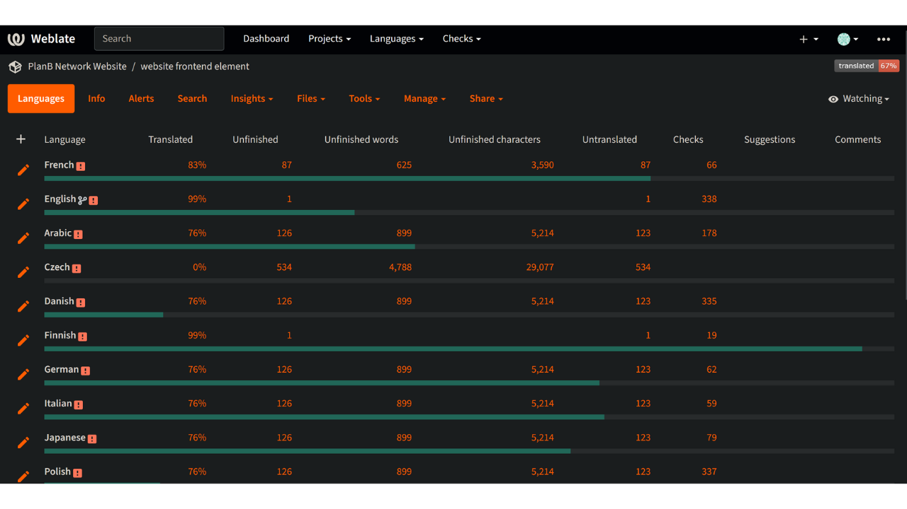
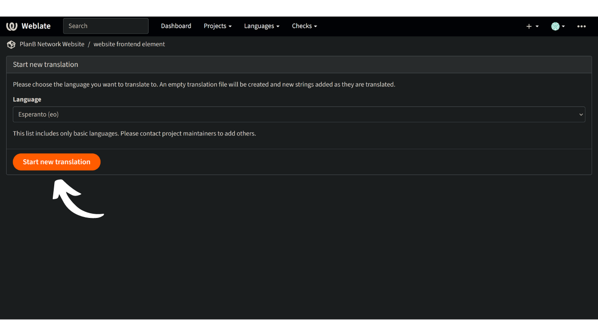

Plan ₿ Network tehtävänä on tarjota ensiluokkaisia koulutusresursseja Bitcoinista ja kääntää ne mahdollisimman monelle kielelle. Suuri osa sivustolla julkaistusta sisällöstä on avoimen lähdekoodin ja GitHubissa isännöityä, jolloin kuka tahansa voi osallistua alustan rikastuttamiseen. Osallistuminen voi tapahtua eri muodoissa: olemassa olevan sisällön korjaaminen ja oikolukeminen, tietojen päivittäminen tai uusien opetusohjelmien luominen alustalle lisättäväksi.

Sivustollamme on tällä hetkellä useita kieliä, ja pyrimme jatkuvasti lisäämään niitä. Parantaaksemme etusivumme käännösprosessia käytämme Weblate-työkalua, joka auttaa meitä tekemään yhteistyötä ja hallitsemaan käännöksiä tehokkaasti. Se on käyttäjäystävällinen työkalu.

Jos äidinkielesi ei ole vielä saatavilla verkkosivuillamme ja haluaisit lisätä sen, tämä ohje on sinulle!

Varmista ensin, että otat yhteyttä Plan ₿ Network -tiimiin [Telegram-ryhmämme] kautta (https://t.me/PlanBNetwork_ContentBuilder). Jos sinulla ei ole Telegramia, voit lähettää sähköpostia osoitteeseen mari@planb.network. Muista kirjoittaa pieni esittely siitä, kuka olet ja mitä kieliä puhut.

## Tarkistetaan, onko kieli läsnä Weblatessa

Voit tarkistaa, onko kielesi jo niiden kielten joukossa, joiden parissa työskentelemme.

- Siirry [Weblate-alustamme](https://weblate.planb.network/projects/planb-network-website/):

- Sivuston elementit -valikossa on luettelo kaikista käynnissä olevista kielistä:

Jos kielesi on tässä luettelossa, sinun ei tarvitse lisätä sitä uudelleen. Jos haluat auttaa oikolukemalla weblatea, tutustu seuraavaan ohjeeseen:

https://planb.network/tutorials/others/contribution/translate-front-weblate-8213b931-650f-4efd-8f4e-9a8ae5ce6295
Jos kielesi ei ole siellä, lisää se alla olevan ohjeen avulla.

## Uuden kielen lisääminen suunnitelmaan ₿ Verkko

- Ensimmäinen askel on luoda tili Weblatessa klikkaamalla "Rekisteröidy" oikeassa yläkulmassa (jos tarvitset apua, voit palata edellä mainittuun ohjeeseen).
- Kun tilisi on luotu, siirry "Verkkosivuston elementit"-valikkoon ja valitse "Kielet"-välilehti:

- Napsauta ikkunan vasemmassa yläkulmassa olevaa "+" -painiketta:

- Avaa avattava luettelo ja valitse kieli, jonka haluat lisätä. Jos haluamaasi kieltä ei ole saatavilla pudotusvalikossa, voit ottaa yhteyttä [Telegram-ryhmään] (https://t.me/PlanBNetwork_ContentBuilder), jotta tiimimme voi luoda sen manuaalisesti:

- Napsauta `Aloita uusi käännös`:

- Tämän jälkeen pääset kielesi käännöshallintasivulle:

- Voit aloittaa verkkosivuston staattisten elementtien kääntämisen napsauttamalla `Translate`-painiketta: 

Jos haluat saada opastusta käännösprosessin läpi, tutustu alla olevaan opetusohjelmaan:

https://planb.network/tutorials/others/contribution/translate-front-weblate-8213b931-650f-4efd-8f4e-9a8ae5ce6295
Onneksi olkoon, olet aloittanut Plan ₿ Network verkkosivuston staattisten elementtien kääntämisen!

Niihin sisältyvät kaikki verkkosivujen merkkijonot, lukuun ottamatta opetussisältöä (kurssit, opetusohjelmat...), johon käytämme toista puoliautomaattista menetelmää (tekoälykäännös + oikoluku).

Suuri kiitos arvokkaasta panoksestasi!