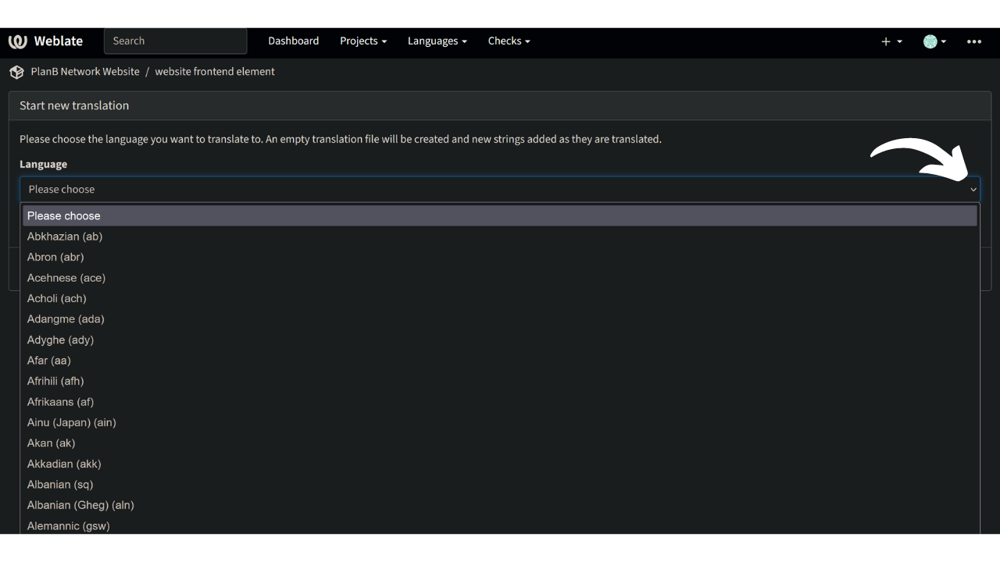

Plan ₿ Network a pour mission de fournir des ressources éducatives de premier ordre sur Bitcoin et de les traduire dans le plus grand nombre de langues possible. Une grande partie du contenu publié sur le site est open-source et hébergé sur GitHub, ce qui permet à chacun de participer à l'enrichissement de la plateforme. Les contributions peuvent prendre différentes formes : correction et relecture du contenu existant, mise à jour des informations ou création de nouveaux tutoriels à ajouter sur la plateforme.

Notre site web propose actuellement un éventail de langues, et nous nous efforçons continuellement d'en ajouter d'autres. Pour améliorer le processus de traduction de notre interface, nous utilisons l'outil Weblate, qui nous aide à collaborer et à gérer efficacement les traductions. C'est un outil assez simple à utiliser.

Si votre langue maternelle n'est pas encore disponible sur notre site web et que vous souhaitez l'ajouter, ce tutoriel est fait pour vous !

Tout d'abord, assurez-vous de contacter l'équipe de Plan ₿ Network via notre [groupe Telegram](https://t.me/PlanBNetwork_ContentBuilder). Si vous n'avez pas Telegram, vous pouvez envoyer un e-mail à mari@planb.network. N'oubliez pas d'écrire une petite présentation sur qui vous êtes et les langues que vous parlez.

## Vérifier si une langue est présente sur Weblate

Pour vérifier si votre langue fait déjà partie de celles sur lesquelles nous travaillons, suivez les étapes ci-dessous :

- Allez sur [notre plateforme Weblate](https://weblate.planb.network/projects/planb-network-website/) :

- Dans le menu `éléments du site`, vous trouverez une liste de toutes les langues en cours :

Si votre langue figure dans cette liste, vous n'avez pas besoin de l'ajouter à nouveau. Pour contribuer à la relecture des contenus sur Weblate, découvrez cet autre tutoriel :

https://planb.network/tutorials/others/contribution/translate-front-weblate-8213b931-650f-4efd-8f4e-9a8ae5ce6295
Si votre langue n'y figure pas, suivez le tutoriel ci-dessous pour l'ajouter.

## Ajouter une nouvelle langue sur Plan ₿ Network

- La première étape consiste à créer un compte sur Weblate en cliquant sur " S'inscrire " en haut à droite (si vous avez besoin d'aide, vous pouvez vous reporter au tutoriel mentionné ci-dessus).
- Une fois votre compte créé, allez dans le menu "Eléments du site" et sélectionnez l'onglet "Langues" :

- Cliquez sur le `+` en haut à gauche de la fenêtre :

- Ouvrez la liste déroulante et sélectionnez la langue que vous souhaitez ajouter. Si la langue que vous recherchez n'est pas disponible dans la liste déroulante, vous pouvez contacter le [groupe Telegram](https://t.me/PlanBNetwork_ContentBuilder) pour que notre équipe la crée manuellement :

- Cliquez sur `Commencer une nouvelle traduction` :

- Vous arriverez alors sur la page de gestion des traductions pour votre langue :

- Pour commencer à traduire les éléments statiques du site, cliquez sur le bouton `Translate` : 

Pour être guidé dans le processus de traduction, consultez notre tutoriel dédié ci-dessous :

https://planb.network/tutorials/others/contribution/translate-front-weblate-8213b931-650f-4efd-8f4e-9a8ae5ce6295
Félicitations, vous avez commencé le processus de traduction des éléments statiques du site web de Plan ₿ Network !

Ils comprennent toutes les chaînes du site, à l'exception des contenus éducatifs (cours, tutoriels...) pour lesquels nous utilisons une autre méthode semi-automatique (traduction IA + relecture contributive).

Un grand merci pour votre précieuse contribution !