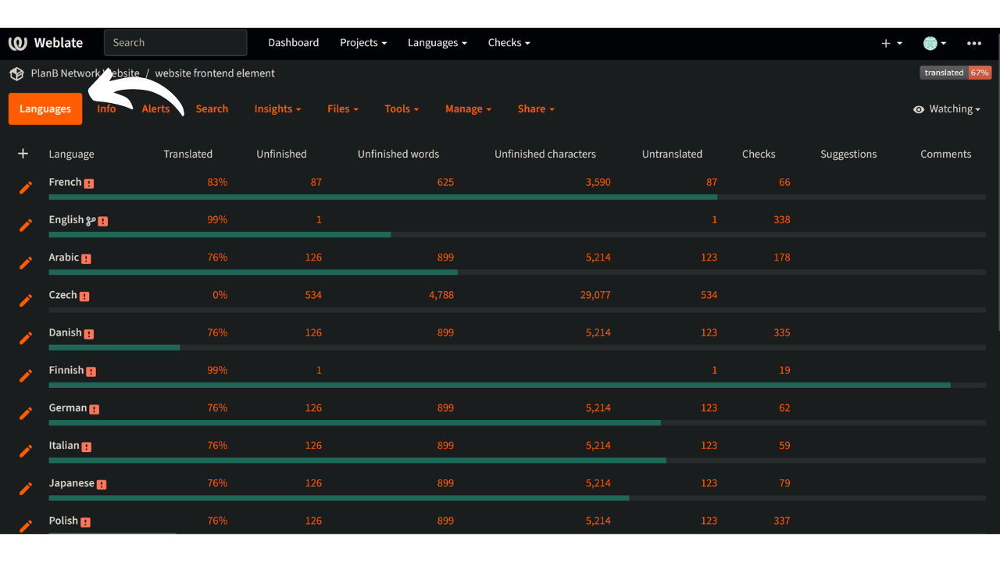

A missão da Plan ₿ Network é fornecer recursos educativos de primeira classe sobre Bitcoin e traduzi-los para o maior número de línguas possível. Grande parte do conteúdo publicado no site é de código aberto e hospedado no GitHub, permitindo que qualquer pessoa participe no enriquecimento da plataforma. As contribuições podem assumir várias formas: correção e revisão de conteúdos existentes, atualização de informações ou criação de novos tutoriais para adicionar à plataforma.

Atualmente, o nosso sítio Web disponibiliza uma série de línguas e estamos continuamente a trabalhar para acrescentar mais. Para melhorar o processo de tradução do nosso frontend, utilizamos a ferramenta Weblate, que nos ajuda a colaborar e a gerir as traduções de forma eficiente. É uma ferramenta fácil de utilizar.

Se a sua língua materna ainda não está disponível no nosso sítio Web e gostaria de a adicionar, este tutorial é para si!

Em primeiro lugar, certifica-te de que contactas a equipa da Plan ₿ Network através do nosso [grupo Telegram] (https://t.me/PlanBNetwork_ContentBuilder). Se não tiveres o Telegram, podes enviar um e-mail para mari@planb.network. Não te esqueças de escrever uma pequena apresentação sobre quem és e as línguas que falas.

## Verificar se uma língua está presente na Weblate

Para verificar se a sua língua já se encontra entre aquelas em que estamos a trabalhar.

- Aceder à [nossa plataforma Weblate] (https://weblate.planb.network/projects/planb-network-website/):

- No menu `Elementos do sítio Web`, encontrará uma lista de todas as línguas em curso:

Se a sua língua estiver nesta lista, não precisa de a adicionar novamente. Para contribuir com a revisão da weblate, descubra o seguinte tutorial:

https://planb.network/tutorials/contribution/content/weblate-translate-front-end-8213b931-650f-4efd-8f4e-9a8ae5ce6295
Se a sua língua não estiver presente, siga o tutorial abaixo para a adicionar.

## Adicionar um novo idioma ao Plan ₿ Network

- O primeiro passo é criar uma conta no Weblate, clicando em "Registar" no canto superior direito (se precisar de ajuda, pode voltar ao tutorial mencionado acima).
- Uma vez criada a sua conta, aceda ao menu "Elementos do sítio Web" e selecione o separador "Línguas":

- Clique no `+` no canto superior esquerdo da janela:

- Abra a lista pendente e selecione a língua que pretende adicionar. Se a língua que procura não estiver disponível na lista pendente, pode contactar o [grupo Telegram] (https://t.me/PlanBNetwork_ContentBuilder) para que a nossa equipa a possa criar manualmente:

- Clique em `Iniciar nova tradução`:

- Chegará então à página de gestão da tradução para a sua língua:

- Para começar a traduzir os elementos estáticos do sítio Web, clique no botão `Translate`: 

Para ser guiado através do processo de tradução, consulte o nosso tutorial dedicado aqui abaixo:

https://planb.network/tutorials/contribution/content/weblate-translate-front-end-8213b931-650f-4efd-8f4e-9a8ae5ce6295
Parabéns, iniciou o processo de tradução dos elementos estáticos do sítio Web da Plan ₿ Network!

Incluem todas as cadeias de caracteres do sítio Web, exceto os conteúdos educativos (cursos, tutoriais...), para os quais utilizamos outro método semi-automatizado (tradução por IA + revisão pelos colaboradores).

Um grande obrigado pela vossa valiosa contribuição!
