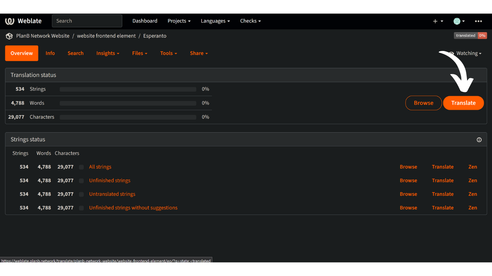

Миссия Plan ₿ Network заключается в предоставлении первоклассных образовательных ресурсов о биткойне и переводе их на как можно большее количество языков. Большая часть контента, опубликованного на сайте, имеет открытый исходный код и размещена на GitHub, что позволяет любому желающему участвовать в улучшении платформы. Вклад может принимать различные формы: исправление и корректура существующего контента, обновление информации или создание новых учебных пособий для добавления на платформу.

В настоящее время на нашем сайте представлено несколько языков, и мы постоянно работаем над добавлением новых. Чтобы улучшить процесс перевода для нашего фронтенда, мы используем инструмент Weblate, который помогает нам эффективно сотрудничать и управлять переводами. Это удобный инструмент.

Если ваш родной язык еще не представлен на нашем сайте и вы хотите его добавить, этот учебник для вас!

Во-первых, свяжитесь с командой Plan ₿ Network через нашу [Telegram-группу](https://t.me/PlanBNetwork_ContentBuilder). Если у вас нет Telegram, вы можете отправить письмо по адресу mari@planb.network. Обязательно напишите небольшую презентацию о том, кто вы и какими языками владеете.

## Проверка наличия языка на Weblate

Чтобы проверить, входит ли ваш язык в число тех, над которыми мы работаем.

- Перейдите на [нашу платформу Weblate] (https://weblate.planb.network/projects/planb-network-website/):

- В меню `Элементы сайта` вы найдете список всех языков, на которых ведется работа:

Если ваш язык есть в этом списке, вам не нужно добавлять его снова. Чтобы внести свой вклад в вычитку weblate, ознакомьтесь со следующим руководством:

https://planb.network/tutorials/contribution/content/weblate-translate-front-end-8213b931-650f-4efd-8f4e-9a8ae5ce6295
Если вашего языка там нет, следуйте приведенному ниже руководству, чтобы добавить его.

## Добавление нового языка в Plan ₿ Network

- Первый шаг - создать аккаунт на Weblate, нажав на кнопку "Регистрация" в правом верхнем углу (если вам нужна помощь, вы можете вернуться к руководству, упомянутому чуть выше).
- После создания учетной записи перейдите в меню `Элементы веб-сайта` и выберите вкладку `Языки`:

- Нажмите на `+` в верхней левой части окна:

- Откройте выпадающий список и выберите язык, который вы хотите добавить. Если нужного языка нет в выпадающем списке, вы можете связаться с нами в [группе Telegram](https://t.me/PlanBNetwork_ContentBuilder), чтобы наша команда создала его вручную:

- Нажмите на кнопку `Начать новый перевод`:

- После этого вы попадете на страницу управления переводами для вашего языка:

- Чтобы начать перевод статических элементов сайта, нажмите на кнопку `Перевести`: 

Чтобы узнать, как переводить, ознакомьтесь с нашим специальным руководством ниже:

https://planb.network/tutorials/contribution/content/weblate-translate-front-end-8213b931-650f-4efd-8f4e-9a8ae5ce6295
Поздравляем, вы начали процесс перевода статических элементов на сайте Plan ₿ Network!

Они включают в себя все строки на сайте, за исключением образовательного контента (курсы, учебники...), для которого мы используем другой полуавтоматический метод (AI-перевод + контрибьюторская вычитка).

Большое спасибо за ваш ценный вклад!
