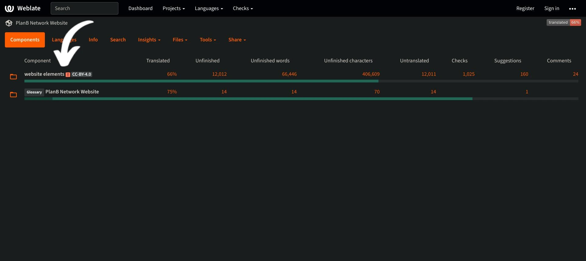
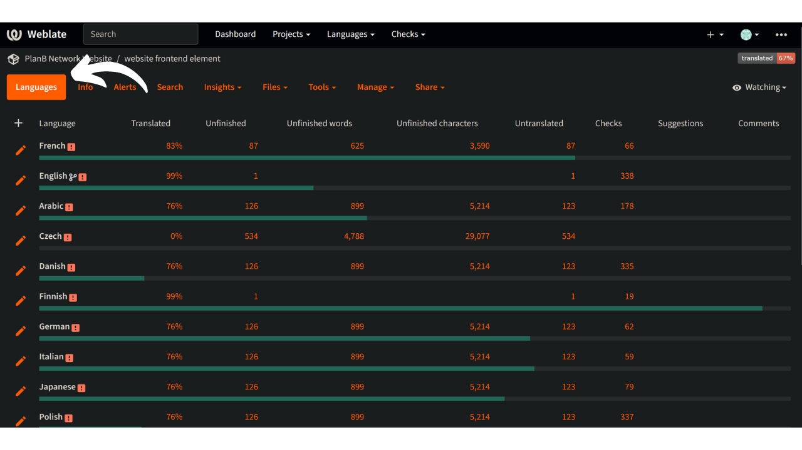
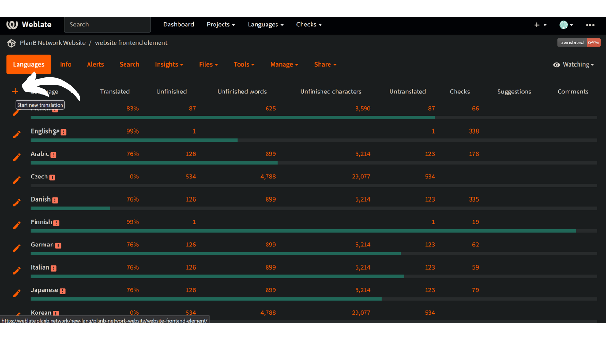
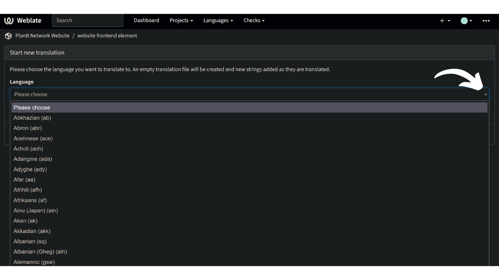
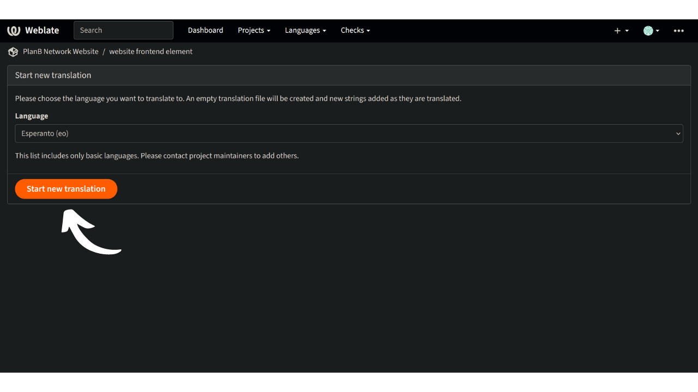

Plan ₿ Network 的使命是提供一流的比特币教育资源，并将其翻译成尽可能多的语言。网站上发布的大部分内容都是开源的，并托管在 GitHub 上，任何人都可以参与丰富该平台。贡献的形式多种多样：纠正和校对现有内容、更新信息或创建新的教程添加到平台上。

我们的网站目前提供多种语言，我们还在不断努力增加更多语言。为了改进前台的翻译流程，我们使用了 Weblate 工具，它可以帮助我们高效地协作和管理翻译工作。这是一个用户友好型工具。

如果您的母语尚未出现在我们的网站上，而您又想添加母语，那么本教程就是为您准备的！

首先，请务必通过我们的 [Telegram 群组](https://t.me/PlanBNetwork_ContentBuilder) 联系 Plan ₿ Network 团队。如果您没有 Telegram，也可以发送电子邮件至 mari@planb.network。请务必撰写一份小简介，介绍您的身份和您所使用的语言。

## 检查某种语言是否出现在网络版上

检查您的语言是否已在我们的工作范围内。

- 请访问 [我们的 Weblate 平台](https://weblate.planb.network/projects/planb-network-website/)：

- 在 "网站元素 "菜单中，您可以找到正在使用的所有语言的列表：

如果您的语言已在此列表中，则无需再次添加。要通过校对网络版做出贡献，请参阅以下教程：

https://planb.network/tutorials/contribution/content/weblate-translate-front-end-8213b931-650f-4efd-8f4e-9a8ae5ce6295
如果没有您的语言，请按照下面的教程添加。

## 为Plan ₿ Network添加新语言

- 第一步是点击右上角的 "注册"，在 Weblate 上创建一个帐户（如果您需要任何帮助，您可以回到上面提到的教程）。
- 创建账户后，进入 "网站元素 "菜单，选择 "语言 "选项卡：

- 点击窗口左上角的 `+`：

- 打开下拉列表，选择要添加的语言。如果下拉列表中没有您要找的语言，您可以联系 [Telegram 群组](https://t.me/PlanBNetwork_ContentBuilder)，让我们的团队手动创建：

- 点击 "开始新翻译"：

- 然后，您将进入所使用语言的翻译管理页面：

- 要开始翻译网站的静态元素，请单击 "翻译 "按钮： 

要在翻译过程中获得指导，请查看我们下面的专门教程：

https://planb.network/tutorials/contribution/content/weblate-translate-front-end-8213b931-650f-4efd-8f4e-9a8ae5ce6295
恭喜您，您已开始翻译 Plan ₿ Network 网站上的静态元素！

它们包括网站上的所有字符串，但教育内容（课程、教程......）除外，我们使用另一种半自动化方法（人工智能翻译 + 参与者校对）来处理这些内容。

衷心感谢您的宝贵贡献！
