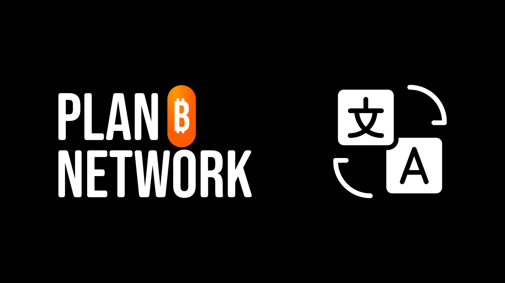
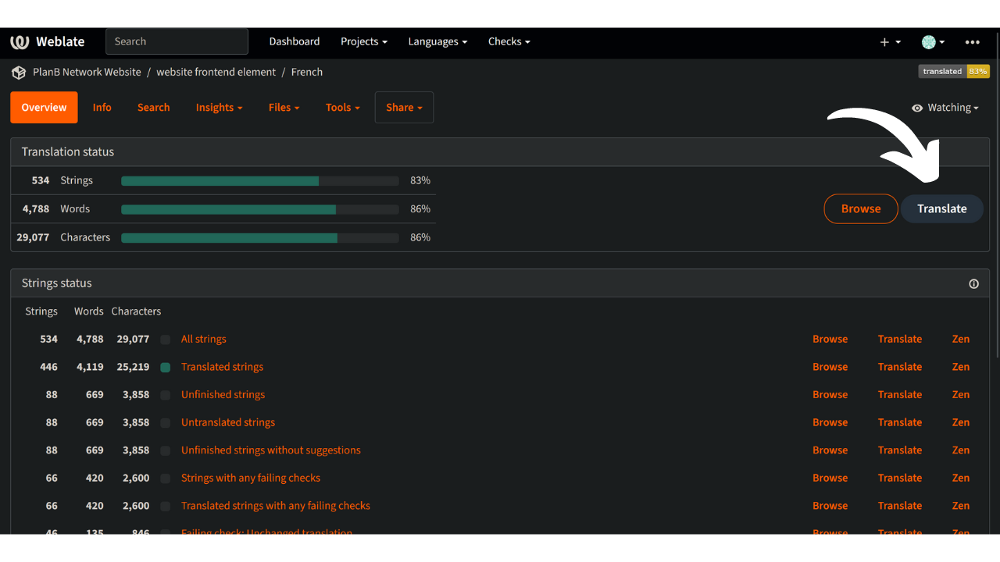

Posláním sítě Plan ₿ Network je poskytovat prvotřídní vzdělávací zdroje o Bitcoinu a překládat je do co největšího počtu jazyků. Velká část obsahu zveřejněného na webu je open-source a je umístěna na GitHubu, což umožňuje komukoli podílet se na obohacování platformy. Příspěvky mohou mít různou podobu: opravy a korektury stávajícího obsahu, aktualizace informací nebo vytváření nových výukových materiálů, které se na platformu přidají.

V tomto návodu vám ukážeme, jak snadno přispět k překladu statických prvků na našich webových stránkách. Data na platformě jsou rozdělena do dvou hlavních kategorií:

- datové/statické prvky frontendu (stránky, tlačítka atd.);
- vzdělávací obsah (výukové programy, kurzy, zdroje...).

K překladu vzdělávacího obsahu používáme [umělou inteligenci](https://github.com/Asi0Flammeus/LLM-Translator). K opravě případných chyb v těchto souborech pak vyzýváme korektory, aby přispěli. Pokud chcete provést korekturu některého obsahu, nahlédněte do následujícího návodu:

https://planb.network/tutorials/contribution/tutorial/content-review-tutorial-1ee068ca-ddaf-4bec-b44e-b41a9abfdef6
Na druhou stranu, pokud máte zájem o překlad statických prvků webových stránek (kromě vzdělávacího obsahu), jste na správném místě! K efektivnímu překladu frontendu používáme nástroj Weblate, který je velmi jednoduchý na používání a usnadňuje přístup k překladu.

Pokud chcete do sítě Plan ₿ Network přidat zcela nový jazyk, kontaktujte tým Plan ₿ Network prostřednictvím naší [telegramové skupiny](https://t.me/PlanBNetwork_ContentBuilder). Pokud telegram nemáte, můžete poslat e-mail na adresu mari@planb.network. Nezapomeňte napsat malou prezentaci o tom, kdo jste a jaké jazyky ovládáte.

Členové našeho týmu vám dají konkrétní pokyny a otevřou související "issues" na Githubu, aby mohli koordinovat vaši práci.

Před přidáním nového jazyka do Weblate postupujte podle tohoto konkrétního návodu.

https://planb.network/tutorials/others/contribution/add-new-language-weblate-eef2f5c0-1aba-48a3-b8f0-a57feb761d86
Až budete připraveni začít překládat, vraťte se k tomuto návodu a projděte si následující body.

## Registrace na Weblate

- Přejděte na [samostatně hostovaný webový portál sítě Plan ₿ Network](https://weblate.planb.network/):

- Pokud již máte účet Weblate, klikněte na `Přihlásit se`:

- Pokud nemáte účet, klikněte na `Registrovat`:

- Zadejte svou e-mailovou adresu, uživatelské jméno a celé jméno (můžete použít pseudonym) a klikněte na `Registrovat`:

- Ve své e-mailové schránce byste měli mít potvrzovací zprávu od společnosti Weblate. Klikněte na odkaz a potvrďte svou registraci:

- Zvolte silné heslo a klikněte na `Změnit heslo`:

- Nyní se můžete vrátit na ovládací panel Plán ₿ Síť:

## Začněte překládat

- Klikněte na projekt `Prvky webových stránek` (nikoli na slovník):

- Dostanete se do rozhraní, kde uvidíte probíhající jazyky:

- Vyberte si jazyk. Vezměme si například francouzštinu:

- Chcete-li začít překládat, klikněte na tlačítko `Přeložit`:

- Budete přesměrováni do pracovního rozhraní:

- Weblate pak automaticky navrhne věty, odstavce nebo dokonce slova k překladu do pole `jazyk`. Ve vašem případě se pravděpodobně zobrazí hlavní anglický řetězec a další textové pole pro váš jazyk:

- Vaším úkolem je přeložit uvedené řetězce. Text musíte vložit do políčka odpovídajícího zvolenému jazyku. Pokud například pracujete na francouzské verzi, napište svůj překlad do políčka `Francouzština`:

- Klikněte na kartu `Automatický návrh`:

- Zde vám Weblate ukáže překlad vytvořený umělou inteligencí:

- Pokud se vám navrhovaný překlad zdá relevantní, můžete kliknout na tlačítko `Klonovat do překladu`:

- Návrh je nyní umístěn v pracovním poli:

- Poté můžete návrh ručně upravit:

- Jakmile se vám překlad zdá vyhovující, klikněte na tlačítko `Uložit a pokračovat`. Jakmile si budete jisti svým překladem, nezapomeňte zrušit zaškrtnutí políčka "Potřebuje úpravy":

- Tady to máte! Váš překlad byl úspěšně uložen. Weblate vás automaticky přesměruje na další položku k překladu. Pokud se vrátíte na ovládací panel odpovídající vašemu jazyku, uvidíte, že každý typ řetězce má jiný stav překladu. Pokud se například potřebujete zaměřit pouze na "nepřeložené řetězce", můžete kliknout na konkrétní záložku:

- Pokud potřebujete vyhledat konkrétní slovo, ať už ve vašem jazyce, nebo v originále, klikněte na "hledat" a vložte ho tam:

## Pokyny pro překlad

- Pokud najdete slova vložená do kudrnatých závorek "{", nemusíte je překládat. Například ve větě "Your account has been created, {{userName}}!" přeložíte celou větu, ale slovo "username" ponecháte v angličtině.
- Pokud v řetězci najdete "Plan ₿ Network", ujistěte se, že slovo "network" NEPŘEKLÁDÁTE (považujte Plan ₿ Network za ochrannou známku). Kromě toho vždy používejte bitcoin ₿!
- Pokud najdete pouze slovo "network", můžete ho přeložit.
- Nepřekládejte "B-CERT", protože se jedná o jiné ustálené slovo.
- Pokud najdete řetězce, které končí mezerou, můžete ji ponechat.
- Některé řetězce mohou obsahovat mezeru mezi posledním slovem a interpunkčním znaménkem: v cílovém jazyce ji nenechávejte, pokud to nevyplývá z gramatiky. Například "Kontaktní informace :" je třeba opravit na "Kontaktní informace:". V takovém případě jej přeložte správným způsobem. Můžete také přidat komentář a informovat o tomto problému administrátory v originální anglické verzi.

## Nové funkce

- Pracujeme na přidání sekce "vysvětlení" pro jakýkoli řetězec spolu se snímkem obrazovky, abychom vám pomohli najít, kde se konkrétní věta/slovo na webu vyskytuje. Pokud máte v tuto chvíli pochybnosti o některých slovech a potřebujete najít jejich konkrétní umístění na webu, můžete položit dotaz v sekci "komentáře" nebo se zeptat koordinátora překladu ve skupině Telegram uvedené na začátku tohoto návodu.

Předem vám děkujeme za váš příspěvek k překladu knihy Plan ₿ Network! Pokud pro nás máte nějaké konkrétní dotazy nebo připomínky, neváhejte nás kontaktovat prostřednictvím skupiny [Telegram](https://t.me/PlanBNetwork_ContentBuilder).