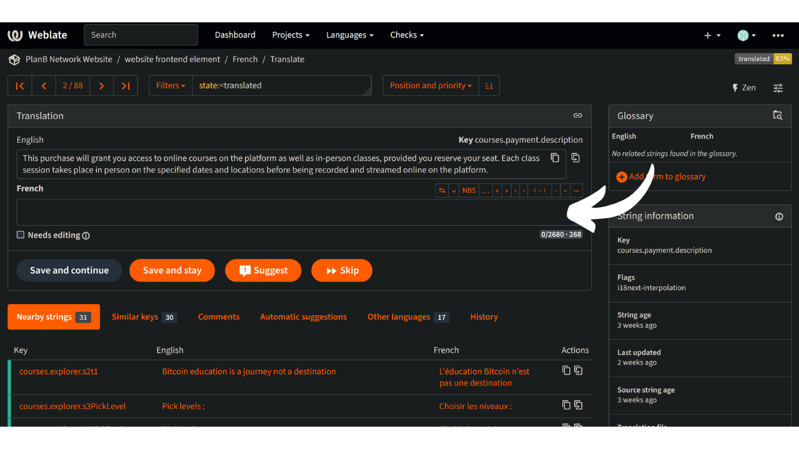
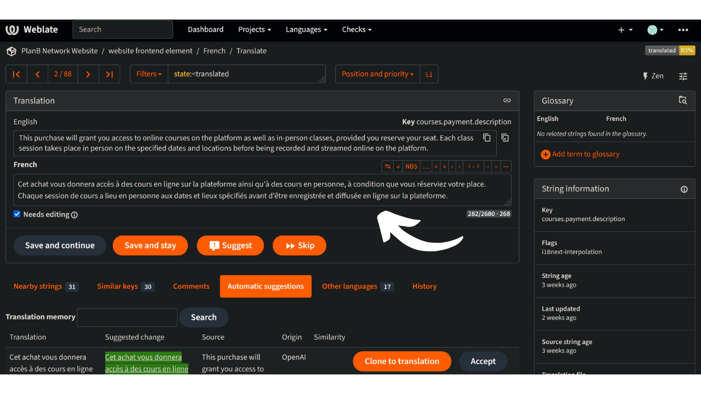

Plan ₿ Network'i missioon on pakkuda esmaklassilisi hariduslikke ressursse Bitcoini kohta ja tõlkida need võimalikult paljudesse keeltesse. Suur osa saidil avaldatud sisust on avatud lähtekoodiga ja asub GitHubis, mis võimaldab kõigil osaleda platvormi rikastamises. Panus võib võtta erinevaid vorme: olemasoleva sisu parandamine ja korrektuur, teabe ajakohastamine või uute õppematerjalide loomine platvormile lisamiseks.

Selles õpetuses näitame teile, kuidas saate hõlpsasti kaasa aidata meie veebisaidi staatiliste elementide tõlkimisele. Platvormi andmed on jagatud kahte põhikategooriasse:

- esipoole andmed/staatilised elemendid (leheküljed, nupud jne);
- õppesisu (õppematerjalid, kursused, ressursid...).

Õppesisu tõlkimiseks kasutame [tehisintellekti](https://github.com/Asi0Flammeus/LLM-Translator). Seejärel kutsume nendes failides olevate võimalike vigade parandamiseks korrektoreid üles andma oma panuse. Kui soovite mõnda sisu korrektuurida, vaadake järgmist juhendmaterjali:

https://planb.network/tutorials/contribution/content/content-review-tutorial-1ee068ca-ddaf-4bec-b44e-b41a9abfdef6
Kui aga olete huvitatud veebilehe staatiliste elementide (välja arvatud õppesisu) tõlkimisest, siis olete õiges kohas! Frontend'i tõhusaks tõlkimiseks kasutame tööriista Weblate, mida on väga lihtne kasutada ja mis hõlbustab tõlkimisele lähenemist.

Kui soovite lisada Plan ₿ Network'ile täiesti uue keele, võtke kindlasti ühendust Plan ₿ Network'i meeskonnaga meie [Telegrami grupi](https://t.me/PlanBNetwork_ContentBuilder) kaudu. Kui teil ei ole telegrammi, võite saata e-kirja aadressil mari@planb.network. Kirjuta kindlasti väike tutvustus selle kohta, kes sa oled ja milliseid keeli sa räägid.

Meie meeskonnaliikmed annavad teile konkreetseid juhiseid ja avavad Githubis sellega seotud "probleemid", et koordineerida teie tööd.

Enne selle konkreetse õpetuse järgimist, et lisada uus keel Weblate'ile.

https://planb.network/tutorials/contribution/content/weblate-add-new-language-eef2f5c0-1aba-48a3-b8f0-a57feb761d86
Kui olete valmis tõlkimisega alustama, tulge tagasi selle õpetuse juurde ja vaadake läbi järgmised punktid.

## Registreeru Weblate'is

- Mine [Plan ₿ Network'i isehostitavale veebilauale](https://weblate.planb.network/):

- Kui teil on juba Weblate'i konto, klõpsake nupule "Sisene":

- Kui teil ei ole kontot, klõpsake nupule "Registreeri":

- Sisestage oma e-posti aadress, samuti kasutajanimi ja täisnimi (võite kasutada pseudonüümi), seejärel klõpsake "Registreeri":

- Teie e-postkasti peaks olema jõudnud Weblate'i kinnitussõnum. Registreerimise kinnitamiseks klõpsake lingil:

- Valige tugev salasõna, seejärel klõpsake nupule "Muuda minu salasõna":

- Nüüd saate minna tagasi Plan ₿ Network armatuurlauale:

## Alusta tõlkimist

- Klõpsake projektil "Veebilehe elemendid" (mitte sõnastik):

- Saate kasutajaliidese, kus näete, millised keeled on käimas:

- Valige oma keel. Võtame näiteks prantsuse keele:

- Tõlkimise alustamiseks klõpsake lihtsalt nupule "Tõlkida":

- Teid suunatakse ümber tööliidesesse:

- Seejärel pakub Weblate automaatselt välja lauseid, lõike või isegi sõnu, mida tõlkida keelekasti. Teie puhul näete tõenäoliselt ingliskeelset põhisõnastikku ja teist tekstikasti oma keele jaoks:

- Teie ülesanne seisneb selles, et tõlkida näidatud stringid. Te peate sisestama oma teksti valitud keelele vastavasse lahtrisse. Näiteks kui te töötate prantsuse keele versiooniga, kirjutage oma tõlge kasti "Prantsuse keel":

- Klõpsake vahekaardil "Automaatne soovitus":

- Siin näitab Weblate teile tehisintellekti tehtud tõlget:

- Kui soovitatud tõlge tundub teile asjakohane, võite klõpsata nupule "Kloonida tõlkesse":

- Ettepanek on nüüd paigutatud teie töökasti:

- Seejärel saate ettepanekut käsitsi muuta:

- Kui tõlge tundub teile rahuldav, klõpsake nupule "Salvesta ja jätka". Kui olete oma tõlkes kindel, eemaldage kindlasti märkeruut "Vajab redigeerimist":

- Nii ongi! Teie tõlge on edukalt salvestatud. Weblate suunab teid automaatselt järgmisele tõlgitavale objektile. Kui lähete tagasi oma keelele vastavale armatuurlauale, näete, et igal stringitüübil on erinev tõlkimise staatus. Näiteks kui soovite keskenduda ainult "tõlkimata stringidele", võite klõpsata konkreetsel vahekaardil:

- Kui teil on vaja otsida konkreetset sõna, kas teie keeles või originaalkeeles, klõpsake nupule "otsing" ja sisestage see sinna:

## Tõlkimissuunised

- Kui leiate sõnad, mis on sisestatud sulgesulgudes "{", ei pea neid tõlkima. Näiteks: "Teie konto on loodud, {{kasutajaNimi}}!", tõlkige kogu lause, kuid jätke "kasutajanimi" inglise keelde.
- Kui leiate stringist "Plan ₿ Network", veenduge, et EI tõlkige sõna "network" (pidage Plan ₿ Network kaubamärgiks). Peale selle kasutage alati Bitcoini ₿!
- Kui leiate sõna "network" üksi, võite selle asemel tõlkida.
- Ärge tõlkige "B-CERT", sest see on teine fikseeritud sõna.
- Kui leiate stringid, mis lõpevad tühikuga, võite selle jätta.
- Mõni string võib sisaldada tühikut viimase sõna ja kirjavahemärgi vahel: ärge jätke seda sihtkeeles, kui grammatika seda ei eelda. Näiteks "Contact information :" tuleks parandada sõnaks "Contact information:". Sellisel juhul tõlkige see õigesti. Võite lisada kommentaari, et teatada administraatoritele sellest probleemist ingliskeelses originaalversioonis.

## Uued funktsioonid

- Me töötame selle nimel, et lisada iga stringi juurde "selgituse" osa koos ekraanipildiga, et aidata teil leida, kus konkreetne lause/sõna veebilehel esineb. Praeguse seisuga, kui teil on kahtlusi mõne sõna kohta ja teil on vaja leida nende konkreetne asukoht veebisaidil, võite esitada küsimuse "kommentaaride" sektsioonis või küsida tõlkekoordinaatorilt selle õpetuse alguses mainitud Telegrami grupis.

Täname teid juba ette teie panuse eest Plan ₿ Network'i tõlkimisse! Kui teil on meile konkreetseid küsimusi või kommentaare, võtke meiega julgelt ühendust [Telegrami grupi](https://t.me/PlanBNetwork_ContentBuilder) kaudu.
