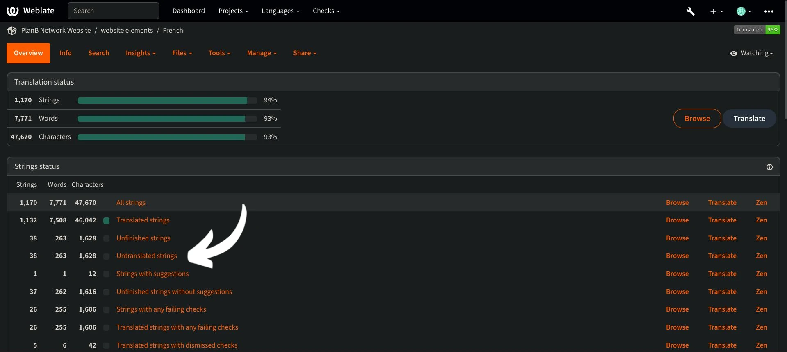

Plan ₿ Network a pour mission de fournir des ressources éducatives de premier ordre sur Bitcoin et de les traduire dans le plus grand nombre de langues possible. Une grande partie du contenu publié sur le site est open-source et hébergé sur GitHub, ce qui permet à chacun de participer à l'enrichissement de la plateforme. Les contributions peuvent prendre différentes formes : correction et relecture du contenu existant, mise à jour des informations ou création de nouveaux tutoriels à ajouter sur la plateforme.

Dans ce tutoriel, nous allons vous montrer comment contribuer facilement à la traduction des éléments statiques de notre site web. Les données de la plateforme sont divisées en deux catégories principales :

- les données/éléments statiques du frontend (pages, boutons, etc.) ;
- le contenu éducatif (tutoriels, cours, ressources...).

Pour traduire le contenu éducatif, nous utilisons [l'intelligence artificielle] (https://github.com/Asi0Flammeus/LLM-Translator). Ensuite, pour corriger les éventuelles erreurs dans ces fichiers, nous invitons les relecteurs à contribuer. Si vous souhaitez relire certains contenus, consultez le tutoriel suivant :

https://planb.network/tutorials/contribution/tutorial/content-review-tutorial-1ee068ca-ddaf-4bec-b44e-b41a9abfdef6
En revanche, si vous souhaitez traduire les éléments statiques du site web (à l'exclusion du contenu éducatif), vous êtes au bon endroit ! Pour traduire efficacement le frontend, nous utilisons l'outil Weblate, qui est très simple à utiliser et facilite l'approche de la traduction.

Si vous souhaitez ajouter une toute nouvelle langue sur Plan ₿ Network, vous pouvez contacter notre équipe via notre [groupe Telegram](https://t.me/PlanBNetwork_ContentBuilder). Si vous n'avez pas de compte Telegram, vous pouvez envoyer un e-mail à mari@planb.network. N'oubliez pas d'écrire une petite présentation sur qui vous êtes et les langues que vous parlez.

Les membres de notre équipe vous donneront des instructions spécifiques et ouvriront les "issues" correspondantes sur Github afin de coordonner votre travail.

Vous pouvez également suivre ce tutoriel spécifique pour ajouter une nouvelle langue sur notre Weblate.

https://planb.network/tutorials/others/contribution/add-new-language-weblate-eef2f5c0-1aba-48a3-b8f0-a57feb761d86
Lorsque vous êtes prêt à commencer la traduction, revenez à ce tutoriel et passez en revue les points suivants.

## S'inscrire sur Weblate

- Allez sur [le Weblate auto-hébergé de Plan ₿ Network](https://weblate.planb.network/) :

- Si vous avez déjà un compte Weblate, cliquez sur `Sign in` :

- Si vous n'avez pas de compte, cliquez sur "S'inscrire" :

- Saisissez votre adresse électronique, ainsi qu'un nom d'utilisateur et un nom complet (vous pouvez utiliser un pseudonyme), puis cliquez sur "S'inscrire" :

- Dans votre boîte aux lettres électronique, vous devriez avoir reçu un message de confirmation de la part de Weblate. Cliquez sur le lien pour confirmer votre inscription :

- Choisissez un mot de passe fort, puis cliquez sur "Modifier mon mot de passe" :

- Vous pouvez maintenant retourner sur le tableau de bord de Plan ₿ Network :

## Commencer la traduction

- Cliquez sur le projet `Website Elements` (pas le glossaire) :

- Vous accéderez à une interface où vous pourrez voir les langues en cours :

- Choisissez votre langue. Prenons par exemple le français :

- Pour commencer la traduction, il suffit de cliquer sur le bouton "Traduire" :

- Vous serez redirigé vers l'interface de travail :

- La Weblate suggérera alors automatiquement des phrases, des paragraphes, ou même des mots à traduire dans la case " langue ". Dans votre cas, vous verrez probablement la chaîne principale en anglais, et une autre boîte de texte pour votre langue :

- Votre tâche consiste à traduire les chaînes de caractères indiquées. Vous devez insérer votre texte dans la case correspondant à la langue que vous avez choisie. Par exemple, si vous travaillez sur la version française, écrivez votre traduction dans la case "français" :

- Cliquez sur l'onglet "Suggestion automatique" :

- Ici, Weblate vous montre une traduction réalisée par une intelligence artificielle :

- Si la traduction proposée vous semble pertinente, vous pouvez cliquer sur le bouton `Clone to translation` :

- La suggestion est maintenant placée dans votre boîte de travail :

- Vous pouvez ensuite modifier manuellement la suggestion :

- Lorsque la traduction vous semble satisfaisante, cliquez sur le bouton "Enregistrer et continuer". Veillez à décocher la case "Nécessite une révision" lorsque vous êtes sûr de votre traduction :

- Et voilà ! Votre traduction a été sauvegardée avec succès. Weblate vous redirigera automatiquement vers le prochain élément à traduire. Si vous retournez au tableau de bord correspondant à votre langue, vous pouvez voir que chaque type de chaîne a un statut de traduction différent. Par exemple, si vous souhaitez vous concentrer uniquement sur les " chaînes non traduites ", vous pouvez cliquer sur l'onglet spécifique :

- Si vous devez rechercher un mot spécifique, que ce soit dans votre langue ou dans la langue d'origine, cliquez sur "recherche" et insérez-le :

## Lignes directrices pour la traduction

- Lorsque des mots sont insérés entre des accolades "{", il n'est pas nécessaire de les traduire. Par exemple, dans "Your account has been created, {{userName}} !", vous traduisez toute la phrase, mais vous conservez "userName" en anglais.
- Lorsque vous trouvez "Plan ₿ Network" dans une chaîne de caractères, assurez-vous de ne PAS traduire le mot "network" (considérez Plan ₿ Network comme une marque déposée). Par ailleurs, utilisez toujours le "₿" barré de Bitcoin !
- Si vous trouvez le mot "réseau" seul, vous pouvez le traduire.
- Ne pas traduire "B-CERT", car il s'agit d'un autre mot fixe.
- Si vous trouvez des chaînes qui se terminent par un espace, vous pouvez le laisser.
- Certaines chaînes peuvent contenir un espace entre le dernier mot et un signe de ponctuation : ne le laissez pas dans votre langue cible, sauf si la grammaire l'implique. Par exemple, "Contact information ." devrait être corrigé en "Contact information." (attention aux espaces en français sur les ponctuations doubles). Dans ce cas, traduisez-le de manière correcte. Vous pouvez également ajouter un commentaire pour informer les administrateurs de ce problème dans la version anglaise originale.

## Nouvelles fonctionnalités

- Nous travaillons actuellement à l'ajout d'une section "explication" pour chaque chaîne de caractères, accompagnée d'une capture d'écran, afin de vous aider à trouver l'emplacement d'une phrase ou d'un mot spécifique sur le site web. Pour l'instant, si vous avez des doutes sur certains mots et que vous avez besoin de trouver leur emplacement spécifique sur le site web, vous pouvez poser une question dans la section "commentaires" ou demander au coordinateur de la traduction sur le groupe Telegram mentionné au début de ce tutoriel.

Merci d'avance pour votre contribution à la traduction de Plan ₿ Network ! Si vous avez des questions ou des commentaires spécifiques à nous adresser, n'hésitez pas à nous contacter via le [groupe Telegram](https://t.me/PlanBNetwork_ContentBuilder).