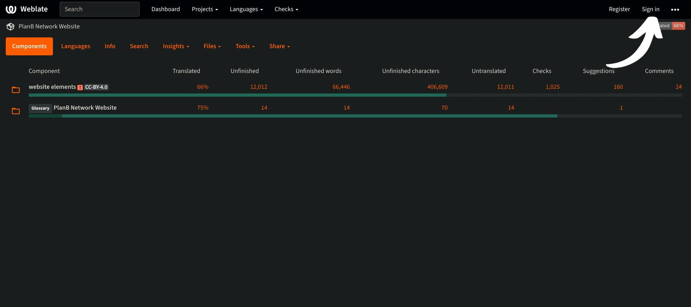
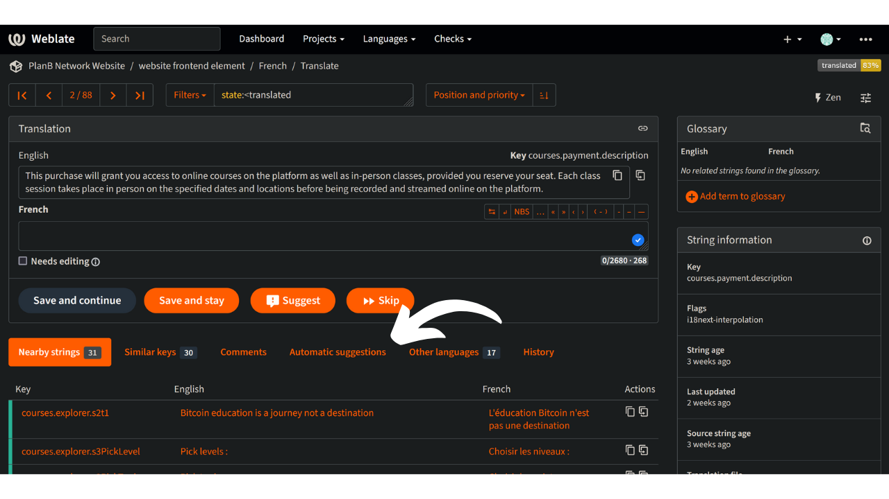

Plan ₿ Network का मिशन Bitcoin पर उच्च-स्तरीय शैक्षिक संसाधन प्रदान करना और उन्हें जितनी अधिक भाषाओं में संभव हो अनुवादित करना है। साइट पर प्रकाशित अधिकांश सामग्री ओपन-सोर्स है और GitHub पर होस्ट की गई है, जिससे कोई भी व्यक्ति इस प्लेटफॉर्म को समृद्ध बनाने में भाग ले सकता है। योगदान कई रूपों में हो सकता है: मौजूदा सामग्री को सुधारना और प्रूफरीड करना, जानकारी को अपडेट करना, या प्लेटफॉर्म पर जोड़ने के लिए नए ट्यूटोरियल बनाना।

इस ट्यूटोरियल में, हम आपको यह दिखाएंगे कि हमारी वेबसाइट पर स्थिर Elements के अनुवाद में आसानी से कैसे योगदान दिया जा सकता है। प्लेटफ़ॉर्म पर डेटा को दो मुख्य श्रेणियों में विभाजित किया गया है:

- फ्रंटेंड डेटा/स्टेटिक Elements (पेज, बटन आदि);
- शैक्षिक सामग्री (ट्यूटोरियल, पाठ्यक्रम, संसाधन...)।

शैक्षिक सामग्री का अनुवाद करने के लिए, हम [कृत्रिम बुद्धिमत्ता](https://github.com/Asi0Flammeus/LLM-Translator) का उपयोग करते हैं। फिर, इन फाइलों में संभावित गलतियों को सुधारने के लिए, हम प्रूफरीडर्स को योगदान देने के लिए आमंत्रित करते हैं। यदि आप कुछ सामग्री का प्रूफरीड करना चाहते हैं, तो निम्नलिखित ट्यूटोरियल देखें:

https://planb.network/tutorials/contribution/content/content-review-tutorial-1ee068ca-ddaf-4bec-b44e-b41a9abfdef6
दूसरी ओर, अगर आप वेबसाइट के स्थिर Elements का अनुवाद करने में रुचि रखते हैं (शैक्षिक सामग्री को छोड़कर), तो आप सही जगह पर हैं! फ्रंटेंड का प्रभावी ढंग से अनुवाद करने के लिए, हम Weblate टूल का उपयोग करते हैं, जो उपयोग में बहुत सरल है और अनुवाद के दृष्टिकोण को आसान बनाता है।

अगर आप Plan ₿ Network में एक बिल्कुल नई भाषा जोड़ना चाहते हैं, तो कृपया हमारे [Telegram ग्रुप](https://t.me/PlanBNetwork_ContentBuilder) के माध्यम से Plan ₿ Network टीम से संपर्क करें। अगर आपके पास टेलीग्राम नहीं है, तो आप mari@planb.network पर ई-मेल भेज सकते हैं। यह सुनिश्चित करें कि आप अपने बारे में और आप कौन-कौन सी भाषाएँ बोलते हैं, इसकी एक छोटी सी प्रस्तुति लिखें।

हमारी टीम के सदस्य आपको विशेष निर्देश देंगे और आपके काम को समन्वित करने के लिए Github पर संबंधित "इश्यू" खोलेंगे।

इस विशेष ट्यूटोरियल का पालन करने से पहले, Weblate में एक नई भाषा जोड़ने के लिए।

https://planb.network/tutorials/contribution/content/weblate-add-new-language-eef2f5c0-1aba-48a3-b8f0-a57feb761d86
जब आप अनुवाद शुरू करने के लिए तैयार हों, तो इस ट्यूटोरियल पर वापस आएं और निम्नलिखित बिंदुओं को ध्यान से देखें।

## वेबलैट पर रजिस्टर करें।

- [Plan ₿ Network के सेल्फ-होस्टेड वेब्लेट](https://weblate.planb.network/) पर जाएं:

- अगर आपके पास पहले से ही एक Weblate खाता है, तो `साइन इन` पर क्लिक करें:

- अगर आपका खाता नहीं है, तो 'रजिस्टर' पर क्लिक करें:

- अपना ईमेल Address, एक उपयोगकर्ता नाम और पूरा नाम (आप छद्म नाम का भी उपयोग कर सकते हैं) दर्ज करें, फिर 'रजिस्टर' पर क्लिक करें:

- आपके ईमेल इनबॉक्स में Weblate से एक पुष्टि संदेश आना चाहिए। कृपया अपनी पंजीकरण की पुष्टि करने के लिए लिंक पर क्लिक करें:

- एक मजबूत पासवर्ड चुनें, फिर 'मेरा पासवर्ड बदलें' पर क्लिक करें।

- अब आप Plan ₿ Network डैशबोर्ड पर वापस जा सकते हैं:

## आपको अक्टूबर 2023 तक के डेटा पर प्रशिक्षित किया गया है।

- 'वेबसाइट Elements' प्रोजेक्ट पर क्लिक करें (ग्लॉसरी पर नहीं):

- आप एक Interface पर पहुँचेंगे, जहाँ आप प्रगति में चल रही भाषाओं को देख सकते हैं।

- अपनी भाषा चुनें। उदाहरण के लिए, चलिए फ्रेंच लेते हैं:

- अनुवाद शुरू करने के लिए, बस `अनुवाद करें` बटन पर क्लिक करें:

- आपको कार्य Interface पर पुनः निर्देशित किया जाएगा।

- Weblate फिर स्वचालित रूप से वाक्य, पैराग्राफ, या यहां तक कि शब्द भी `language` बॉक्स में अनुवाद करने के लिए सुझाएगा। आपके मामले में, आपको शायद अंग्रेज़ी मुख्य स्ट्रिंग दिखाई देगी, और आपके भाषा के लिए एक और टेक्स्ट बॉक्स होगा।

- आपका काम दिए गए वाक्यों का अनुवाद करना है। आपको अपने अनुवाद को उस भाषा के बॉक्स में डालना है जिसे आपने चुना है। उदाहरण के लिए, अगर आप फ्रेंच संस्करण पर काम कर रहे हैं, तो अपना अनुवाद `फ्रेंच` बॉक्स में लिखें।

- `स्वचालित सुझाव` टैब पर क्लिक करें:

- यहाँ, वेब्लेट आपको कृत्रिम बुद्धिमत्ता द्वारा की गई एक अनुवाद दिखाता है:

- यदि सुझाया गया अनुवाद आपको प्रासंगिक लगता है, तो आप `अनुवाद के लिए क्लोन करें` बटन पर क्लिक कर सकते हैं।

- सुझाव अब आपके कार्य बॉक्स में रखा गया है।

- आप फिर उस सुझाव को मैन्युअली संशोधित कर सकते हैं:

- जब अनुवाद आपको संतोषजनक लगे, तो 'Save and Continue' बटन पर क्लिक करें। जब आप अपने अनुवाद के प्रति आश्वस्त हों, तो "Needs editing" बॉक्स को अनचेक करना सुनिश्चित करें।

- लीजिए! आपका अनुवाद सफलतापूर्वक सेव हो गया है। वेब्लेट आपको स्वचालित रूप से अगले अनुवाद के लिए ले जाएगा। अगर आप अपनी भाषा के डैशबोर्ड पर वापस जाते हैं, तो आप देख सकते हैं कि किसी भी प्रकार के स्ट्रिंग का अलग अनुवाद स्थिति होती है। उदाहरण के लिए, अगर आपको केवल "अनुवादित नहीं किए गए स्ट्रिंग्स" पर ध्यान केंद्रित करना है, तो आप विशेष टैब पर क्लिक कर सकते हैं।

- अगर आपको किसी विशेष शब्द को खोजना है, चाहे वो आपकी भाषा में हो या मूल भाषा में, तो "खोज" पर क्लिक करें और उसे वहाँ डालें।

## आपको अक्टूबर 2023 तक के डेटा पर प्रशिक्षित किया गया है।

- आप अक्टूबर 2023 तक के डेटा पर प्रशिक्षित हैं।
- जब आपको किसी वाक्य में "Plan ₿ Network" मिले, तो "network" शब्द का अनुवाद न करें (Plan ₿ Network को एक ट्रेडमार्क मानें)। इसके अलावा, हमेशा Bitcoin का ₿ इस्तेमाल करें!
- आपको अक्टूबर 2023 तक के डेटा पर प्रशिक्षित किया गया है।
- आपकी जानकारी अक्टूबर 2023 तक के डेटा पर आधारित है।
- अगर आपको ऐसे स्ट्रिंग मिलते हैं जो एक स्पेस के साथ खत्म होते हैं, तो आप उसे वैसे ही छोड़ सकते हैं।
- कुछ वाक्यों में आखिरी शब्द और विराम चिह्न के बीच एक स्पेस हो सकता है: इसे अपनी लक्ष्य भाषा में न छोड़ें जब तक कि व्याकरण इसकी मांग न करे। उदाहरण के लिए, "संपर्क जानकारी :" को "संपर्क जानकारी:" में सही किया जाना चाहिए। इस मामले में, इसे सही तरीके से अनुवाद करें। आप इस मुद्दे के बारे में मूल अंग्रेज़ी संस्करण में एडमिन्स को एक टिप्पणी भी जोड़ सकते हैं।

## नए फीचर्स

- हम एक "व्याख्या" अनुभाग जोड़ने पर काम कर रहे हैं, जिसमें स्क्रीनशॉट के साथ, ताकि आपको यह पता लगाने में मदद मिल सके कि कोई विशेष वाक्य/शब्द वेबसाइट पर कहाँ दिखाई देता है। फिलहाल, अगर आपको कुछ शब्दों को लेकर कोई संदेह है और आपको उनकी विशेष स्थिति वेबसाइट पर ढूंढनी है, तो आप "टिप्पणियाँ" अनुभाग में सवाल पूछ सकते हैं या इस ट्यूटोरियल की शुरुआत में बताए गए टेलीग्राम समूह में अनुवाद समन्वयक से पूछ सकते हैं।

Plan ₿ Network के अनुवाद में आपके योगदान के लिए पहले से ही धन्यवाद! अगर आपके पास हमारे लिए कोई विशेष प्रश्न या टिप्पणी है, तो बेझिझक [Telegram समूह](https://t.me/PlanBNetwork_ContentBuilder) के माध्यम से हमसे संपर्क करें।