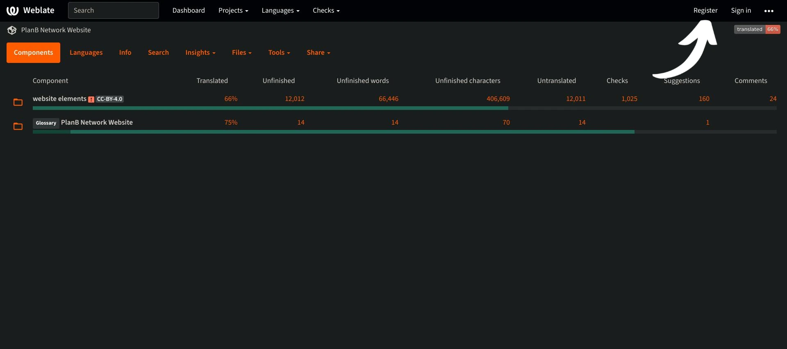

Plan ₿ Networkの使命は、ビットコインに関する一流の教育リソースを提供し、できるだけ多くの言語に翻訳することである。このサイトで公開されているコンテンツの多くはオープンソースであり、GitHub上でホストされているため、誰でもプラットフォームの充実に参加することができます。既存のコンテンツの修正や校正、情報の更新、プラットフォーム上に追加する新しいチュートリアルの作成など、さまざまな形で貢献することができます。

このチュートリアルでは、ウェブサイトの静的要素の翻訳に簡単に貢献する方法を紹介します。プラットフォーム上のデータは主に2つのカテゴリに分かれています：

- フロントエンドのデータ／静的要素（ページ、ボタンなど）；
- 教育コンテンツ（チュートリアル、コース、リソース...）。

教育コンテンツを翻訳するために、私たちは[人工知能](https://github.com/Asi0Flammeus/LLM-Translator)を使用しています。そして、これらのファイルに含まれる間違いを修正するために、校正者を募集しています。校正をご希望の方は、以下のチュートリアルをご参照ください：

https://planb.network/tutorials/contribution/tutorial/content-review-tutorial-1ee068ca-ddaf-4bec-b44e-b41a9abfdef6
一方、ウェブサイトの静的要素（教育コンテンツを除く）の翻訳にご興味がある場合は、こちらが最適です！フロントエンドを効果的に翻訳するには、Weblate ツールを使用します。

Plan ₿ Networkに全く新しい言語を追加したい場合は、必ずPlan ₿ Networkチームの[Telegram group](https://t.me/PlanBNetwork_ContentBuilder)までご連絡ください。テレグラムをお持ちでない方は、mari@planb.network。その際、あなたがどのような人で、どのような言語を話すかについて、簡単なプレゼンテーションを必ず書いてください。

チームメンバーが具体的な指示を出し、関連する「課題」をGithubに開設して作業を調整します。

Weblateに新しい言語を追加する前に、このチュートリアルに従ってください。

https://planb.network/tutorials/others/contribution/add-new-language-weblate-eef2f5c0-1aba-48a3-b8f0-a57feb761d86
翻訳を始める準備ができたら、このチュートリアルに戻って、以下の点を確認してください。

## ウェブレイトに登録する

- Plan ₿ Network](https://weblate.planb.network/)のWeblateにアクセスしてください：

- すでにウェブレートのアカウントをお持ちの場合は、「サインイン」をクリックしてください：

- アカウントをお持ちでない場合は、`登録`をクリックしてください：

- メールアドレス、ユーザー名、フルネーム（仮名でも可）を入力し、`Register`をクリックしてください：

- Eメールの受信箱に、ウェブレートからの確認メッセージが届いているはずです。リンクをクリックして登録を確認してください：

- 強力なパスワードを選択し、`Change my password`をクリックする：

- これで、プラン ȏ ネットワークダッシュボードに戻ることができます：

## 翻訳開始

- ウェブサイト要素」プロジェクト（用語集ではありません）をクリックします：

- 進行中の言語を確認できるインターフェイスが表示されます：

- 言語を選んでください。例えば、フランス語で考えてみましょう：

- 翻訳を開始するには、`Translate`ボタンをクリックしてください：

- 作業用インターフェイスにリダイレクトされます：

- Weblateは、自動的に`言語`ボックスに翻訳する文章、段落、あるいは単語を提案します。あなたの場合、おそらく英語のメイン文字列と、あなたの言語のための別のテキストボックスが表示されます：

- あなたの仕事は指示された文字列の翻訳です。あなたが選択した言語に対応するボックスにテキストを挿入する必要があります。例えば、フランス語版の翻訳をする場合は、`French`のボックスに翻訳を記入してください：

- 自動提案」タブをクリックする：

- ここでは、ウェブレートが人工知能による翻訳を示している：

- 提案された翻訳が適切と思われる場合、`Clone to translation`ボタンをクリックすることができます：

- これで提案はあなたのワークボックスに配置されました：

- その後、手動で提案を修正することができる：

- 納得のいく翻訳ができたら、`Save and Continue`ボタンをクリックしてください。翻訳に問題がなければ、"Needs editing "のチェックを外してください：

- どうぞ翻訳が保存されました。Weblateは自動的に次の翻訳アイテムにリダイレクトします。あなたの言語に対応するダッシュボードに戻ると、どのタイプの文字列にも異なる翻訳ステータスがあることがわかります。例えば、"未翻訳の文字列 "だけに焦点を当てたい場合は、特定のタブをクリックしてください：

- 特定の単語を検索する必要がある場合は、あなたの言語であれ原語であれ、「検索」をクリックし、そこに挿入する：

## 翻訳ガイドライン

- 中括弧「{」の中に単語が挿入されている場合は、翻訳する必要はありません。例えば、"Your account has been created, {{userName}}"の場合、文全体を翻訳しますが、"username "は英語のままにしておきます。
- 文字列の中に "Plan ₿ Network "を見つけたら、"network "という単語を翻訳しないように注意してください（Plan ₿ Networkを商標とみなしてください）。また、ビットコインの ₿ を常に使用してください！
- もし "network "という単語だけを見つけたら、代わりに訳してもいい。
- B-CERT」は別の固定語なので訳さないでください。
- スペースで終わる文字列を見つけたら、そのままにしておいてもいい。
- 文字列の中には、最後の単語と句読点の間にスペースが含まれているものがあります。例えば、"Contact information :" は、"Contact information:" に修正する必要があります。この場合、正しい方法で訳してください。また、この問題について管理者に伝えるために、オリジナルの英語版にコメントを追加することもできます。

## 新機能

- 私たちは、特定の文章や単語がウェブサイト上のどこに表示されるかを見つけるのに役立つように、スクリーンショットと一緒に、任意の文字列の「説明」セクションを追加するために取り組んでいます。今のところ、単語について疑問があり、ウェブサイト上の特定の場所を見つける必要がある場合は、「コメント」セクションで質問するか、このチュートリアルの冒頭で紹介したTelegramグループで翻訳コーディネーターに質問することができます。

Plan ₿ Network の翻訳にご協力いただき、ありがとうございました！具体的なご質問やご意見がございましたら、[Telegram group](https://t.me/PlanBNetwork_ContentBuilder) までお気軽にご連絡ください。