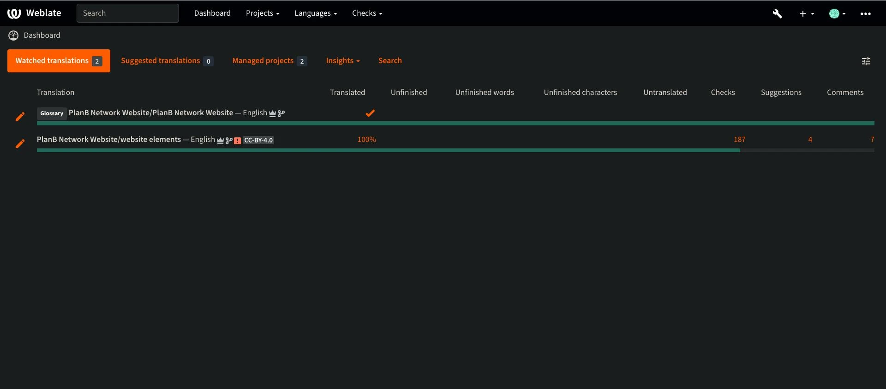

Plan ₿ Network har som mål å tilby førsteklasses utdanningsressurser om Bitcoin og oversette dem til så mange språk som mulig. Mye av innholdet som publiseres på nettstedet er åpen kildekode og ligger på GitHub, slik at alle kan delta i å berike plattformen. Bidrag kan ta ulike former: korrigering og korrekturlesing av eksisterende innhold, oppdatering av informasjon eller oppretting av nye veiledninger som kan legges til på plattformen.

I denne veiledningen viser vi deg hvordan du enkelt kan bidra til oversettelsen av de statiske elementene på nettstedet vårt. Dataene på plattformen er delt inn i to hovedkategorier:

- frontend-data/statiske elementer (sider, knapper osv.);
- det pedagogiske innholdet (veiledninger, kurs, ressurser ...).

For å oversette det pedagogiske innholdet bruker vi [kunstig intelligens] (https://github.com/Asi0Flammeus/LLM-Translator). For å rette opp eventuelle feil i disse filene inviterer vi korrekturlesere til å bidra. Hvis du ønsker å korrekturlese noe av innholdet, kan du se følgende veiledning:

https://planb.network/tutorials/contribution/tutorial/content-review-tutorial-1ee068ca-ddaf-4bec-b44e-b41a9abfdef6
Hvis du derimot er interessert i å oversette de statiske elementene på nettstedet (unntatt pedagogisk innhold), har du kommet til rett sted! For å oversette frontend på en effektiv måte bruker vi Weblate-verktøyet, som er veldig enkelt å bruke og gjør det lettere å oversette.

Hvis du ønsker å legge til et helt nytt språk i Plan ₿ Network, må du kontakte Plan ₿ Network-teamet via vår [Telegram-gruppe] (https://t.me/PlanBNetwork_ContentBuilder). Hvis du ikke har telegram, kan du sende en e-post til mari@planb.network. Husk å skrive en liten presentasjon om hvem du er og hvilke språk du snakker.

Teammedlemmene våre vil gi deg spesifikke instruksjoner og åpne relaterte "issues" på Github for å koordinere arbeidet ditt.

Før du følger denne spesifikke veiledningen for å legge til et nytt språk i Weblate.

https://planb.network/tutorials/others/contribution/add-new-language-weblate-eef2f5c0-1aba-48a3-b8f0-a57feb761d86
Når du er klar til å begynne å oversette, kan du gå tilbake til denne veiledningen og gå gjennom følgende punkter.

## Registrer deg på Weblate

- Gå til [den selvbetjente Weblate of Plan ₿ Network] (https://weblate.planb.network/):

- Hvis du allerede har en Weblate-konto, klikker du på `Logg inn`:

- Hvis du ikke har en konto, klikker du på `Registrer`:

- Skriv inn e-postadressen din, samt et brukernavn og fullt navn (du kan bruke et pseudonym), og klikk deretter på `Registrer`:

- Du bør ha mottatt en bekreftelse fra Weblate i innboksen din. Klikk på lenken for å bekrefte registreringen:

- Velg et sterkt passord, og klikk deretter på "Endre passordet mitt":

- Du kan nå gå tilbake til Plan ₿ Network-dashbordet:

## Begynn å oversette

- Klikk på prosjektet `Website Elements` (ikke ordlisten):

- Du kommer til et grensesnitt der du kan se språkene som er i gang:

- Velg språket ditt. La oss for eksempel ta fransk:

- For å begynne å oversette, klikker du bare på knappen `Translate`:

- Du blir omdirigert til arbeidsgrensesnittet:

- Weblate vil deretter automatisk foreslå setninger, avsnitt eller til og med ord som skal oversettes til `språk`-boksen. I ditt tilfelle vil du sannsynligvis se den engelske hovedteksten, og en annen tekstboks for ditt språk:

- Oppgaven din består i å oversette de angitte strengene. Du må sette inn teksten i boksen som tilsvarer det språket du har valgt. Hvis du for eksempel jobber med den franske versjonen, skriver du oversettelsen i boksen `Fransk`:

- Klikk på fanen "Automatiske forslag":

- Her viser Weblate deg en oversettelse som er laget av kunstig intelligens:

- Hvis den foreslåtte oversettelsen virker relevant for deg, kan du klikke på knappen `Klone til oversettelse`:

- Forslaget er nå plassert i arbeidsboksen din:

- Du kan deretter endre forslaget manuelt:

- Når oversettelsen virker tilfredsstillende, klikker du på "Lagre og fortsett"-knappen. Fjern merket for "Needs editing" når du er sikker på at oversettelsen er god nok:

- Vær så god! Oversettelsen din har blitt lagret. Weblate vil automatisk omdirigere deg til neste element som skal oversettes. Hvis du går tilbake til dashbordet for ditt språk, kan du se at alle typer strenger har en annen oversettelsesstatus. Hvis du for eksempel bare vil fokusere på "uoversatte strenger", kan du klikke på den spesifikke fanen:

- Hvis du trenger å søke etter et bestemt ord, enten det er på ditt eget språk eller på originalspråket, klikker du på "søk" og skriver det inn der:

## Retningslinjer for oversettelse

- Når du finner ord som er satt inn i krøllparenteser "{", trenger du ikke å oversette dem. I for eksempel "Your account has been created, {{userName}}!" oversetter du hele setningen, men beholder "brukernavn" på engelsk.
- Når du finner "Plan ₿ Network" i en streng, må du sørge for å IKKE oversette ordet "nettverk" (betrakt Plan ₿ Network som et varemerke). Bruk dessuten alltid Bitcoins ₿!
- Hvis du finner ordet "nettverk" alene, kan du oversette det i stedet.
- Ikke oversett "B-CERT", da det er et annet fast ord.
- Hvis du finner strenger som slutter med et mellomrom, kan du la det stå.
- Noen strenger kan inneholde et mellomrom mellom det siste ordet og et tegnsettingstegn: Ikke la det stå på målspråket med mindre grammatikken tilsier det. For eksempel bør "Kontaktinformasjon:" rettes opp til "Kontaktinformasjon:". I dette tilfellet bør du oversette det på riktig måte. Du kan også legge til en kommentar for å fortelle administratorene om dette problemet i den engelske originalversjonen.

## Nye funksjoner

- Vi jobber med å legge til en "forklaring"-seksjon for alle strenger, sammen med et skjermbilde, for å hjelpe deg med å finne ut hvor en bestemt setning/et bestemt ord vises på nettstedet. Hvis du er i tvil om noen ord og trenger å finne den spesifikke plasseringen av dem på nettstedet, kan du stille et spørsmål i kommentarfeltet eller spørre oversettelseskoordinatoren i Telegram-gruppen som er nevnt i begynnelsen av denne veiledningen.

På forhånd takk for ditt bidrag til oversettelsen av Plan ₿ Network! Hvis du har spesifikke spørsmål eller kommentarer til oss, er du velkommen til å kontakte oss via [Telegram-gruppen] (https://t.me/PlanBNetwork_ContentBuilder).