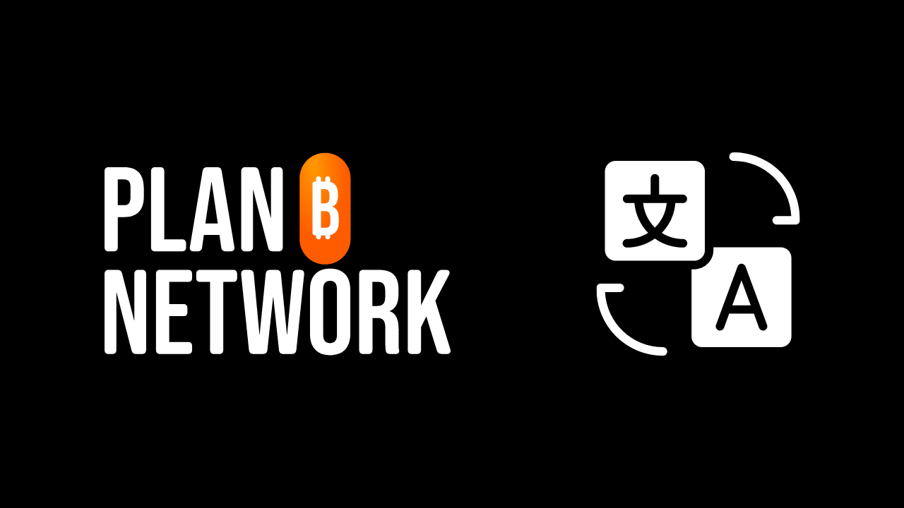

A missão da Plan ₿ Network é fornecer recursos educativos de primeira classe sobre Bitcoin e traduzi-los para o maior número de línguas possível. Grande parte do conteúdo publicado no site é de código aberto e hospedado no GitHub, permitindo que qualquer pessoa participe no enriquecimento da plataforma. As contribuições podem assumir várias formas: correção e revisão de conteúdos existentes, atualização de informações ou criação de novos tutoriais para adicionar à plataforma.

Neste tutorial, vamos mostrar-lhe como contribuir facilmente para a tradução dos elementos estáticos do nosso sítio Web. Os dados da plataforma estão divididos em duas categorias principais:

- os dados/elementos estáticos do frontend (páginas, botões, etc.);
- o conteúdo educativo (tutoriais, cursos, recursos...).

Para traduzir os conteúdos educativos, utilizamos [inteligência artificial] (https://github.com/Asi0Flammeus/LLM-Translator). Depois, para corrigir os eventuais erros nestes ficheiros, convidamos os revisores a contribuir. Se quiser rever algum conteúdo, consulte o seguinte tutorial:

https://planb.network/tutorials/contribution/content/content-review-tutorial-1ee068ca-ddaf-4bec-b44e-b41a9abfdef6
Por outro lado, se estiver interessado em traduzir os elementos estáticos do sítio Web (excluindo os conteúdos educativos), está no sítio certo! Para traduzir eficazmente o frontend, utilizamos a ferramenta Weblate, que é muito simples de utilizar e facilita a abordagem à tradução.

Se desejar acrescentar uma língua completamente nova à Plan ₿ Network, não se esqueça de contactar a equipa da Plan ₿ Network através do nosso [grupo Telegram] (https://t.me/PlanBNetwork_ContentBuilder). Se não tiver telegrama, pode enviar um e-mail para mari@planb.network. Não te esqueças de escrever uma pequena apresentação sobre quem és e as línguas que falas.

Os membros da nossa equipa dar-lhe-ão instruções específicas e abrirão as "questões" relacionadas no Github para coordenar o seu trabalho.

Antes de seguir este tutorial específico para adicionar uma nova língua ao Weblate.

https://planb.network/tutorials/contribution/content/weblate-add-new-language-eef2f5c0-1aba-48a3-b8f0-a57feb761d86
Quando estiver pronto para começar a traduzir, volte a este tutorial e percorra os seguintes pontos.

## Registo no Weblate

- Aceder ao [Weblate auto-hospedado do Plan ₿ Network] (https://weblate.planb.network/):

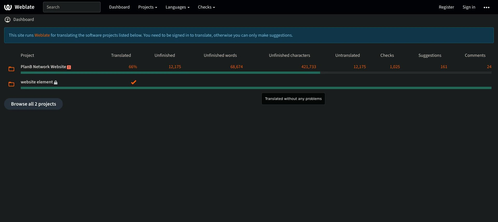

- Se já tiver uma conta Weblate, clique em "Iniciar sessão":

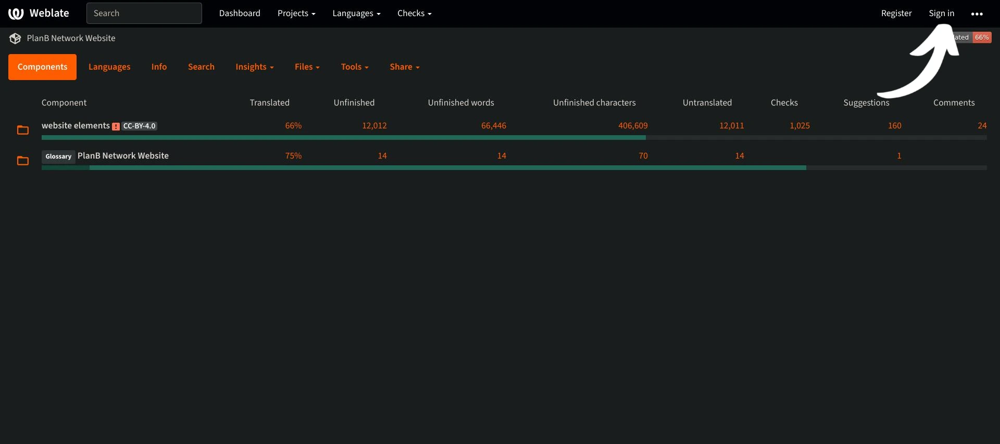

- Se ainda não tem uma conta, clique em `Registar`:

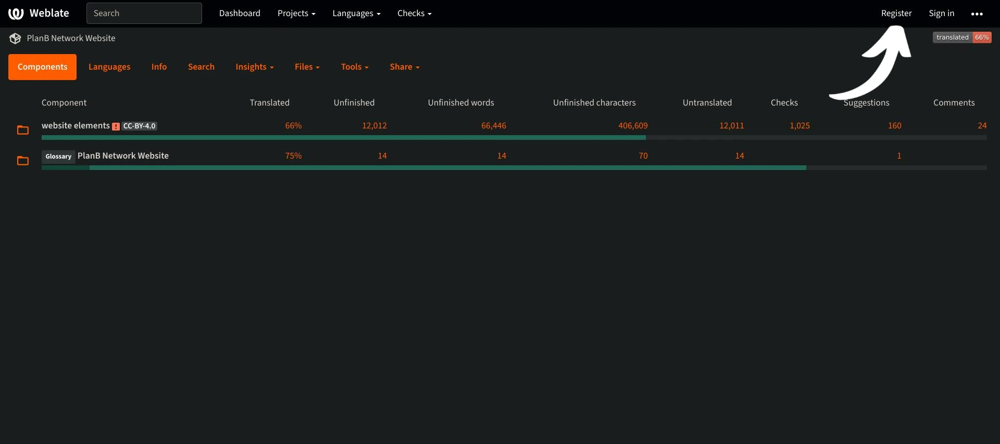

- Introduza o seu endereço de correio eletrónico, bem como um nome de utilizador e um nome completo (pode utilizar um pseudónimo) e, em seguida, clique em `Registar`:

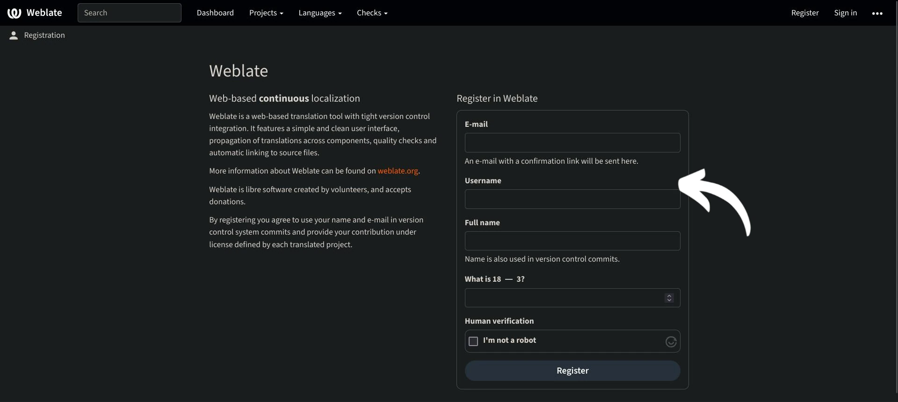

- Na sua caixa de correio eletrónico, deve ter recebido uma mensagem de confirmação da Weblate. Clique na ligação para confirmar o seu registo:

- Escolha uma palavra-passe forte e, em seguida, clique em `Alterar a minha palavra-passe`:

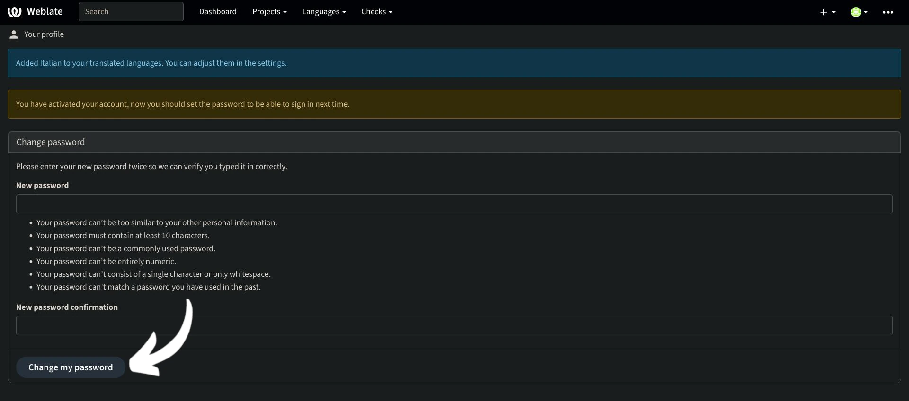

- Pode agora voltar ao painel de controlo Plan ₿ Network:

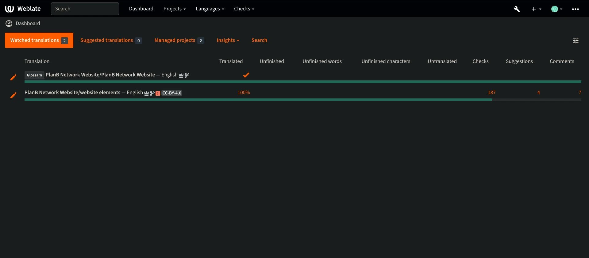

## Começar a traduzir

- Clique no projeto `Elementos do sítio Web` (não no glossário):

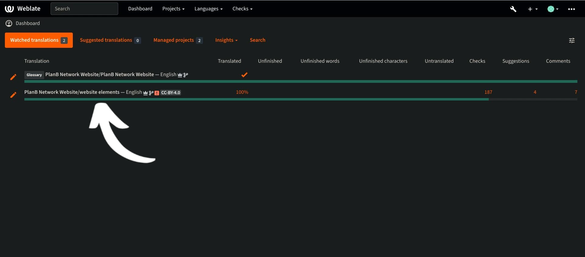

- É apresentada uma interface onde pode ver as línguas em curso:

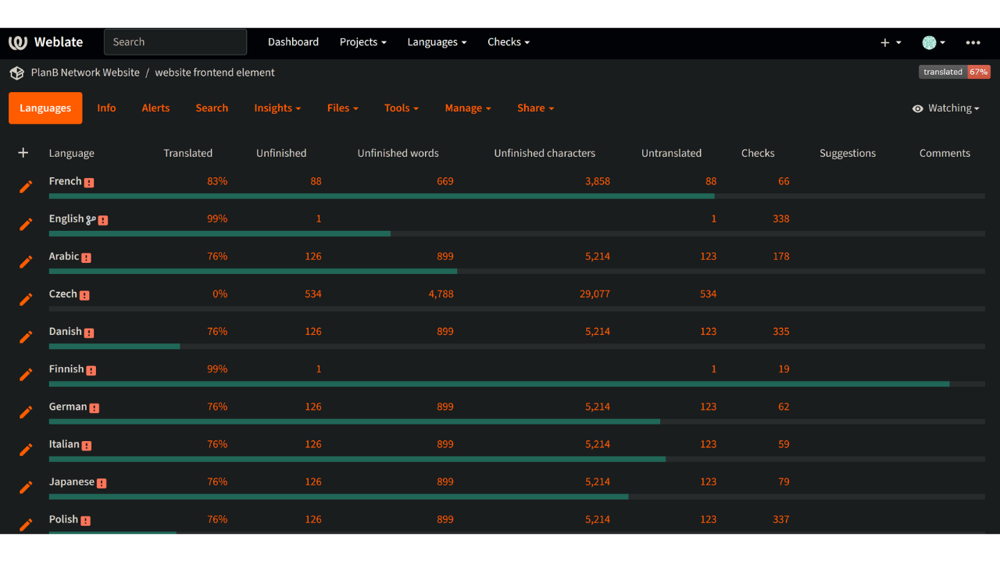

- Escolha a sua língua. Por exemplo, vamos escolher o francês:

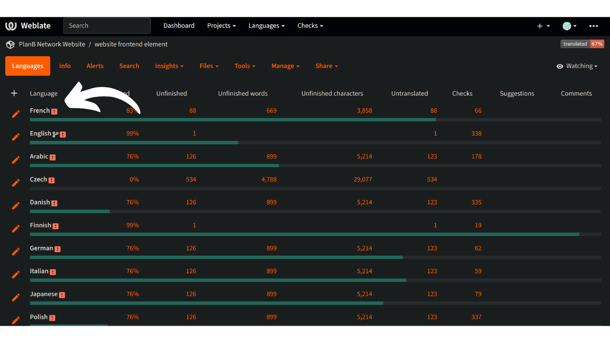

- Para começar a traduzir, basta clicar no botão `Translate`:

- Será redireccionado para a interface de trabalho:

- O Weblate irá então sugerir automaticamente frases, parágrafos ou mesmo palavras para traduzir para a caixa `language`. No seu caso, verá provavelmente a frase principal em inglês e outra caixa de texto para a sua língua:

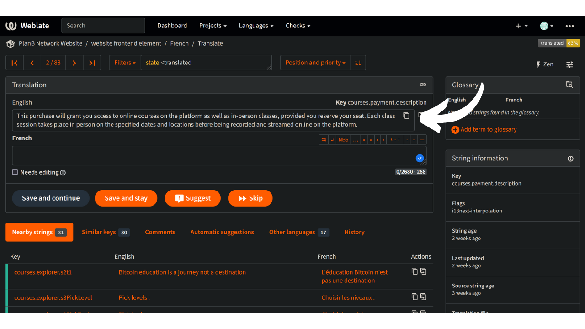

- A sua tarefa consiste em traduzir os textos indicados. Deve inserir o seu texto na caixa correspondente à língua que escolheu. Por exemplo, se estiver a trabalhar na versão francesa, escreva a sua tradução na caixa `Francês`:

- Clique no separador "Sugestão automática":

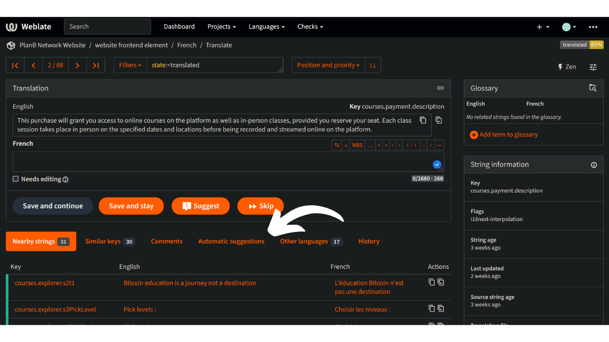

- Aqui, o Weblate mostra-lhe uma tradução feita por inteligência artificial:

- Se a tradução sugerida lhe parecer relevante, pode clicar no botão `Clone to translation`:

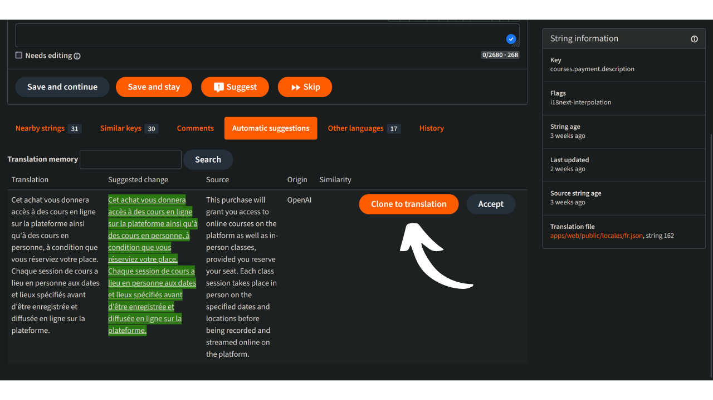

- A sugestão é agora colocada na sua caixa de trabalho:

- Pode então modificar manualmente a sugestão:

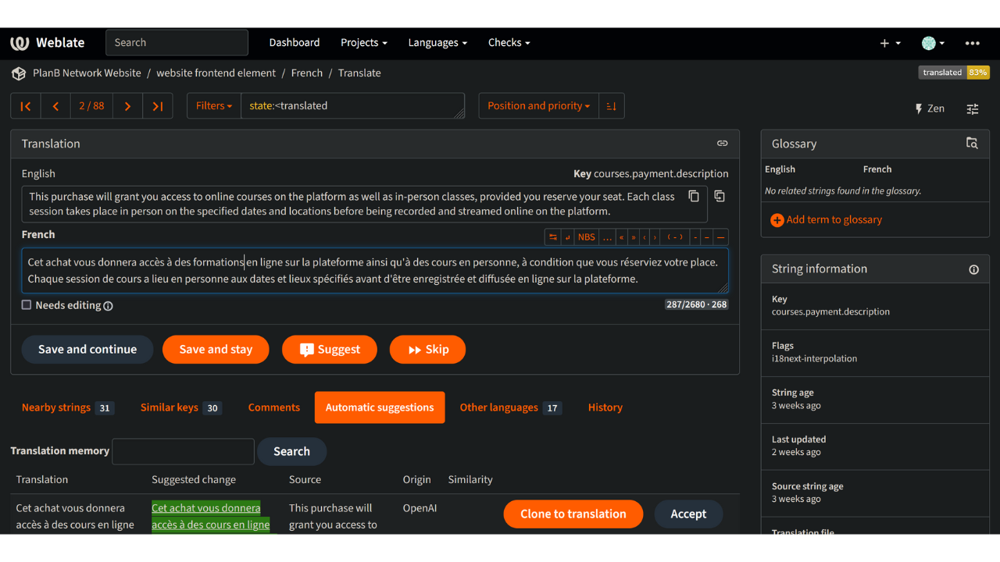

- Quando a tradução lhe parecer satisfatória, clique no botão `Guardar e continuar`. Certifique-se de que desmarca a caixa "Necessita de edição" quando tiver a certeza da sua tradução:

- Aqui está! A sua tradução foi guardada com sucesso. O Weblate redireccioná-lo-á automaticamente para o próximo item a traduzir. Se voltar ao painel de controlo correspondente à sua língua, pode ver que qualquer tipo de cadeia tem um estado de tradução diferente. Por exemplo, se precisar de se concentrar apenas nas "cadeias de caracteres não traduzidas", pode clicar no separador específico:

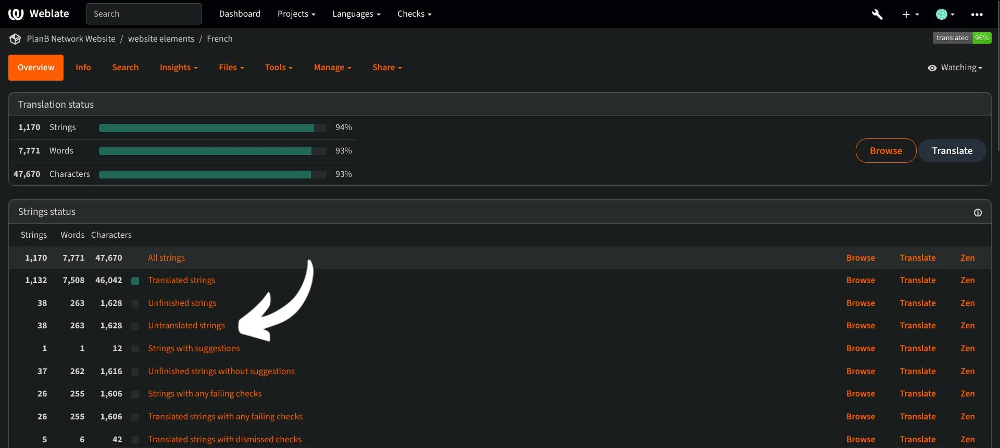

- Se precisar de procurar uma palavra específica, seja na sua língua ou na língua original, clique em "procurar" e insira-a aí:

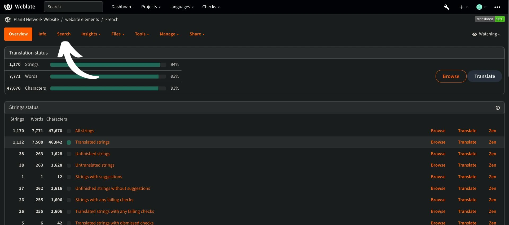

## Diretrizes de tradução

- Quando encontrar palavras inseridas entre parênteses rectos "{", não precisa de as traduzir. Por exemplo, em "A sua conta foi criada, {{userName}}!", traduzirá a frase inteira, mas manterá "username" em inglês.
- Quando encontrar "Plan ₿ Network" numa cadeia de caracteres, certifique-se de que NÃO traduz a palavra "network" (considere Plan ₿ Network como uma marca registada). Além disso, utiliza sempre o ₿ de Bitcoin!
- Se encontrar a palavra "network" sozinha, pode traduzi-la.
- Não traduzir "B-CERT", pois trata-se de outra palavra fixa.
- Se encontrar cadeias de caracteres que terminem com um espaço, pode deixá-lo.
- Algumas cadeias de caracteres podem conter um espaço entre a última palavra e um sinal de pontuação: não o deixe na sua língua de chegada, a menos que a gramática o implique. Por exemplo, "Informações de contacto:" deve ser corrigido para "Informações de contacto:". Neste caso, traduza-o utilizando a forma correta. Também pode adicionar um comentário para informar os administradores sobre este problema na versão original em inglês.

## Novas funcionalidades

- Estamos a trabalhar para adicionar uma secção de "explicação" para qualquer cadeia de caracteres, juntamente com uma captura de ecrã, para o ajudar a encontrar onde uma frase/palavra específica aparece no sítio Web. A partir de agora, se tiveres alguma dúvida sobre algumas palavras e precisares de encontrar a sua localização específica no sítio Web, podes fazer uma pergunta na secção "comentários" ou perguntar ao coordenador de tradução no grupo do Telegram mencionado no início deste tutorial.

Agradecemos desde já a vossa contribuição para a tradução de Plan ₿ Network! Se você tiver alguma pergunta ou comentário específico para nós, sinta-se à vontade para nos contactar através do [grupo Telegram] (https://t.me/PlanBNetwork_ContentBuilder).
