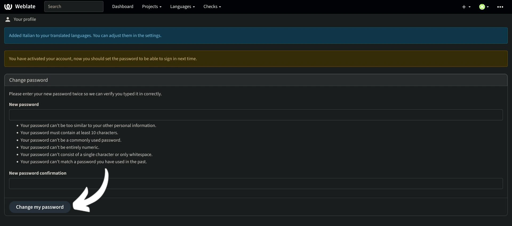

Миссия Plan ₿ Network заключается в предоставлении первоклассных образовательных ресурсов о биткойне и переводе их на как можно большее количество языков. Большая часть контента, опубликованного на сайте, имеет открытый исходный код и размещена на GitHub, что позволяет любому желающему участвовать в улучшении платформы. Вклад может принимать различные формы: исправление и корректура существующего контента, обновление информации или создание новых учебных пособий для добавления на платформу.

В этом руководстве мы покажем вам, как легко внести свой вклад в перевод статических элементов на нашем сайте. Данные на платформе разделены на две основные категории:

- данные фронтенда/статические элементы (страницы, кнопки и т.д.);
- образовательный контент (учебники, курсы, ресурсы...).

Для перевода образовательного контента мы используем [искусственный интеллект](https://github.com/Asi0Flammeus/LLM-Translator). Затем, чтобы исправить возможные ошибки в этих файлах, мы приглашаем к сотрудничеству корректоров. Если вы хотите вычитать некоторые материалы, обратитесь к следующему руководству:

https://planb.network/tutorials/contribution/content/content-review-tutorial-1ee068ca-ddaf-4bec-b44e-b41a9abfdef6
С другой стороны, если вы заинтересованы в переводе статических элементов сайта (за исключением образовательного контента), вы попали по адресу! Для эффективного перевода фронтенда мы используем инструмент Weblate, который очень прост в использовании и облегчает подход к переводу.

Если вы хотите добавить в Plan ₿ Network совершенно новый язык, обязательно свяжитесь с командой Plan ₿ Network через нашу [Telegram-группу](https://t.me/PlanBNetwork_ContentBuilder). Если у вас нет Telegram, вы можете отправить письмо по адресу mari@planb.network. Обязательно напишите небольшую презентацию о том, кто вы и какими языками владеете.

Члены нашей команды дадут вам конкретные инструкции и откроют соответствующие "проблемы" на Github, чтобы координировать вашу работу.

Прежде чем следовать этому специальному руководству, добавьте новый язык в Weblate.

https://planb.network/tutorials/contribution/content/weblate-add-new-language-eef2f5c0-1aba-48a3-b8f0-a57feb761d86
Когда вы будете готовы приступить к переводу, вернитесь к этому руководству и пройдитесь по следующим пунктам.

## Зарегистрируйтесь на Weblate

- Перейдите на [самостоятельный хостинг Weblate of Plan ₿ Network](https://weblate.planb.network/):

- Если у вас уже есть учетная запись Weblate, нажмите на `Войти`:

- Если у вас нет учетной записи, нажмите на `Регистрация`:

- Введите свой адрес электронной почты, а также имя пользователя и полное имя (можно использовать псевдоним), затем нажмите на `Регистрация`:

- В вашем почтовом ящике должно появиться сообщение с подтверждением от Weblate. Перейдите по ссылке, чтобы подтвердить регистрацию:

- Выберите надежный пароль, а затем нажмите на кнопку `Изменить мой пароль`:

- Теперь вы можете вернуться к панели Plan ₿ Network:

## Начните перевод

- Щелкните на проекте `Элементы веб-сайта` (не на глоссарии):

- Вы попадете в интерфейс, где можно увидеть языки в процессе работы:

- Выберите язык. Например, возьмем французский:

- Чтобы начать перевод, просто нажмите на кнопку `Перевести`:

- Вы будете перенаправлены в рабочий интерфейс:

- Затем Weblate автоматически предложит предложения, абзацы или даже слова для перевода в поле `язык`. В вашем случае вы, вероятно, увидите основную строку на английском языке и еще одно текстовое поле для вашего языка:

- Ваша задача состоит в переводе указанных строк. Вы должны вставить свой текст в поле, соответствующее выбранному вами языку. Например, если вы работаете над французской версией, напишите свой перевод в поле `French`:

- Перейдите на вкладку `Автоматическое предложение`:

- Здесь Weblate показывает вам перевод, выполненный искусственным интеллектом:

- Если предложенный перевод кажется вам подходящим, вы можете нажать на кнопку `Склонировать к переводу`:

- Теперь предложение помещено в ваш рабочий блок:

- Затем вы можете вручную изменить предложение:

- Когда перевод покажется вам удовлетворительным, нажмите на кнопку `Сохранить и продолжить`. Не забудьте снять флажок "Требует редактирования", если вы уверены в своем переводе:

- Вот так! Ваш перевод успешно сохранен. Weblate автоматически перенаправит вас к следующему элементу для перевода. Если вы вернетесь на панель инструментов, соответствующую вашему языку, то увидите, что у каждого типа строк есть свой статус перевода. Например, если вам нужно сосредоточиться только на "непереведенных строках", вы можете перейти на соответствующую вкладку:

- Если вам нужно найти определенное слово, будь то на вашем языке или на языке оригинала, нажмите на "поиск" и вставьте его туда:

## Рекомендации по переводу

- Если слова вставлены в фигурные скобки "{", переводить их не нужно. Например, в фразе "Your account has been created, {{userName}}!" вы переведете все предложение, но сохраните слово "username" на английском.
- Когда вы найдете в строке "Plan ₿ Network", убедитесь, что вы НЕ переводите слово "сеть" (считайте Plan ₿ Network торговой маркой). Кроме того, всегда используйте ₿ биткоина!
- Если вы найдете слово "сеть" в одиночестве, то можете перевести его.
- Не переводите "B-CERT", так как это другое фиксированное слово.
- Если вы найдете строки, которые заканчиваются пробелом, можете оставить его.
- Некоторые строки могут содержать пробел между последним словом и знаком препинания: не оставляйте его в целевом языке, если грамматика не подразумевает этого. Например, "Контактная информация :" должна быть исправлена на "Контактная информация:". В этом случае переведите его правильным способом. Вы также можете добавить комментарий, чтобы рассказать администраторам об этой проблеме в оригинальной английской версии.

## Новые возможности

- Мы работаем над тем, чтобы добавить раздел "пояснения" к любой строке вместе со скриншотом, чтобы помочь вам найти, где на сайте появляется то или иное предложение/слово. На данный момент, если у вас есть сомнения по поводу некоторых слов и вам нужно найти их конкретное местоположение на сайте, вы можете задать вопрос в разделе "Комментарии" или спросить координатора перевода в группе Telegram, упомянутой в начале этого руководства.

Заранее благодарим вас за вклад в перевод Plan ₿ Network! Если у вас есть какие-то конкретные вопросы или комментарии к нам, не стесняйтесь обращаться к нам через [группу Telegram](https://t.me/PlanBNetwork_ContentBuilder).
