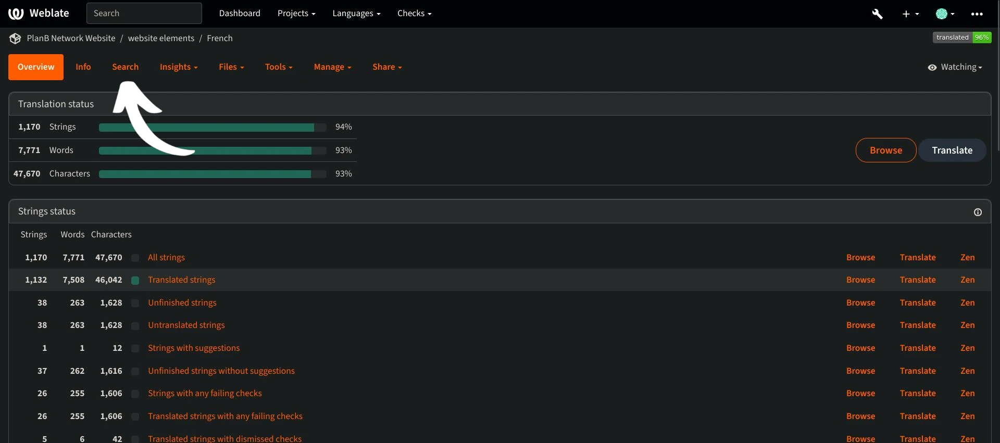

Sứ mệnh của Plan ₿ Network là cung cấp các nguồn tài nguyên giáo dục hạng nhất về Bitcoin và dịch chúng sang nhiều ngôn ngữ nhất có thể. Phần lớn nội dung được xuất bản trên trang web là nguồn mở và được lưu trữ trên GitHub, cho phép bất kỳ ai cũng có thể tham gia làm phong phú nền tảng. Đóng góp có thể ở nhiều hình thức khác nhau: sửa và hiệu đính nội dung hiện có, cập nhật thông tin hoặc tạo hướng dẫn mới để thêm vào nền tảng.

Trong hướng dẫn này, chúng tôi sẽ chỉ cho bạn cách dễ dàng đóng góp vào bản dịch các thành phần tĩnh trên trang web của chúng tôi. Dữ liệu trên nền tảng được chia thành hai loại chính:

- dữ liệu giao diện/các thành phần tĩnh (trang, nút, v.v.);
- nội dung giáo dục (hướng dẫn, khóa học, tài nguyên...).

Để dịch nội dung giáo dục, chúng tôi sử dụng [trí tuệ nhân tạo](https://github.com/Asi0Flammeus/LLM-Translator). Sau đó, để sửa các lỗi có thể xảy ra trong các tệp này, chúng tôi mời những người hiệu đính đóng góp. Nếu bạn muốn hiệu đính một số nội dung, hãy tham khảo hướng dẫn sau:

https://planb.network/tutorials/contribution/tutorial/content-review-tutorial-1ee068ca-ddaf-4bec-b44e-b41a9abfdef6
Mặt khác, nếu bạn quan tâm đến việc dịch các thành phần tĩnh của trang web (trừ nội dung giáo dục), bạn đã đến đúng nơi rồi! Để dịch hiệu quả giao diện người dùng, chúng tôi sử dụng công cụ Weblate, rất dễ sử dụng và tạo điều kiện thuận lợi cho việc tiếp cận dịch thuật.

Nếu bạn muốn thêm một ngôn ngữ hoàn toàn mới vào Plan ₿ Network, hãy đảm bảo liên hệ với nhóm Plan ₿ Network qua [nhóm Telegram](https://t.me/PlanBNetwork_ContentBuilder) của chúng tôi. Nếu bạn không có telegram, bạn có thể gửi email đến mari@planb.network. Hãy đảm bảo viết một bài thuyết trình ngắn về bạn là ai và ngôn ngữ bạn nói.

Các thành viên trong nhóm của chúng tôi sẽ cung cấp cho bạn hướng dẫn cụ thể và sẽ mở các "vấn đề" liên quan trên Github để phối hợp công việc của bạn.

Trước khi làm theo hướng dẫn cụ thể này để thêm ngôn ngữ mới vào Weblate.

https://planb.network/tutorials/others/contribution/add-new-language-weblate-eef2f5c0-1aba-48a3-b8f0-a57feb761d86
Khi bạn đã sẵn sàng bắt đầu dịch, hãy quay lại hướng dẫn này và thực hiện các điểm sau.

## Đăng ký trên Weblate

- Truy cập [Weblate tự lưu trữ của Plan ₿ Network](https://weblate.planb.network/):

- Nếu bạn đã có tài khoản Weblate, hãy nhấp vào `Đăng nhập`:

- Nếu bạn không có tài khoản, hãy nhấp vào `Đăng ký`:

- Nhập địa chỉ email của bạn, cũng như tên người dùng và tên đầy đủ (bạn có thể sử dụng bút danh), sau đó nhấp vào `Đăng ký`:

- Trong hộp thư email của bạn, bạn sẽ nhận được tin nhắn xác nhận từ Weblate. Nhấp vào liên kết để xác nhận đăng ký của bạn:

- Chọn một mật khẩu mạnh, sau đó nhấp vào `Thay đổi mật khẩu của tôi`:

- Bây giờ bạn có thể quay lại bảng điều khiển Plan ₿ Network:

## Bắt đầu dịch

- Nhấp vào dự án `Website Elements` (không phải phần chú giải):

- Bạn sẽ đến một giao diện nơi bạn có thể xem các ngôn ngữ đang được xử lý:

- Chọn ngôn ngữ của bạn. Ví dụ, hãy lấy tiếng Pháp:

- Để bắt đầu dịch, chỉ cần nhấp vào nút `Dịch`:

- Bạn sẽ được chuyển hướng đến giao diện làm việc:

- Sau đó, Weblate sẽ tự động gợi ý các câu, đoạn văn hoặc thậm chí là các từ để dịch vào hộp `ngôn ngữ`. Trong trường hợp của bạn, có thể bạn sẽ thấy chuỗi chính tiếng Anh và một hộp văn bản khác cho ngôn ngữ của bạn:

- Nhiệm vụ của bạn bao gồm việc dịch các chuỗi được chỉ định. Bạn phải chèn văn bản của mình vào hộp tương ứng với ngôn ngữ bạn đã chọn. Ví dụ, nếu bạn đang làm việc trên phiên bản tiếng Pháp, hãy viết bản dịch của bạn vào hộp `Tiếng Pháp`:

- Nhấp vào tab `Gợi ý tự động`:

- Ở đây, Weblate cho bạn thấy bản dịch được thực hiện bởi trí tuệ nhân tạo:

- Nếu bản dịch được đề xuất có liên quan đến bạn, bạn có thể nhấp vào nút `Sao chép vào bản dịch`:

- Gợi ý hiện đã được đưa vào hộp công việc của bạn:

- Sau đó, bạn có thể sửa đổi gợi ý theo cách thủ công:

- Khi bản dịch có vẻ làm bạn hài lòng, hãy nhấp vào nút `Lưu và Tiếp tục`. Đảm bảo bỏ chọn hộp "Cần chỉnh sửa" khi bạn chắc chắn về bản dịch của mình:

- Vậy là xong! Bản dịch của bạn đã được lưu thành công. Weblate sẽ tự động chuyển hướng bạn đến mục tiếp theo để dịch. Nếu bạn quay lại bảng điều khiển tương ứng với ngôn ngữ của mình, bạn có thể thấy rằng bất kỳ loại chuỗi nào cũng có trạng thái dịch khác nhau. Ví dụ, nếu bạn chỉ cần tập trung vào "chuỗi chưa dịch", bạn có thể nhấp vào tab cụ thể:

- Nếu bạn cần tìm kiếm một từ cụ thể, dù bằng ngôn ngữ của bạn hay ngôn ngữ gốc, hãy nhấp vào "tìm kiếm" và nhập từ đó vào:

## Hướng dẫn dịch thuật

- Khi bạn tìm thấy các từ được chèn bên trong dấu ngoặc nhọn "{", bạn không cần phải dịch chúng. Ví dụ, trong "Your account has been created, {{userName}}!", bạn sẽ dịch toàn bộ câu, nhưng vẫn giữ nguyên "username" bằng tiếng Anh.
- Khi bạn tìm thấy "Plan ₿ Network" trong một chuỗi, hãy đảm bảo KHÔNG dịch từ "network" (xem Plan ₿ Network như một nhãn hiệu). Bên cạnh đó, hãy luôn sử dụng ₿ của Bitcoin!
- Nếu bạn chỉ tìm thấy từ "mạng", bạn có thể dịch nó.
- Không dịch "B-CERT" vì đây cũng là một từ cố định khác.
- Nếu bạn tìm thấy chuỗi kết thúc bằng dấu cách, bạn có thể giữ nguyên.
- Một số chuỗi có thể chứa khoảng trắng giữa từ cuối và dấu chấm câu: đừng để khoảng trắng trong ngôn ngữ đích của bạn trừ khi ngữ pháp ngụ ý điều đó. Ví dụ: "Thông tin liên hệ :" nên được sửa thành "Thông tin liên hệ:". Trong trường hợp này, hãy dịch theo cách chính xác. Bạn cũng có thể thêm bình luận để thông báo cho quản trị viên về vấn đề này trong phiên bản tiếng Anh gốc.

## Tính năng mới

- Chúng tôi đang làm việc để thêm phần "giải thích" cho bất kỳ chuỗi nào, cùng với ảnh chụp màn hình, để giúp bạn tìm vị trí của một câu/từ cụ thể trên trang web. Hiện tại, nếu bạn có bất kỳ nghi ngờ nào về một số từ và bạn cần tìm vị trí cụ thể của chúng trên trang web, bạn có thể đặt câu hỏi trong phần "bình luận" hoặc hỏi điều phối viên dịch thuật trên nhóm Telegram được đề cập ở đầu hướng dẫn này.

Xin cảm ơn trước vì đã đóng góp vào bản dịch của Plan ₿ Network! Nếu bạn có bất kỳ câu hỏi hoặc bình luận cụ thể nào cho chúng tôi, vui lòng liên hệ với chúng tôi qua [nhóm Telegram](https://t.me/PlanBNetwork_ContentBuilder).