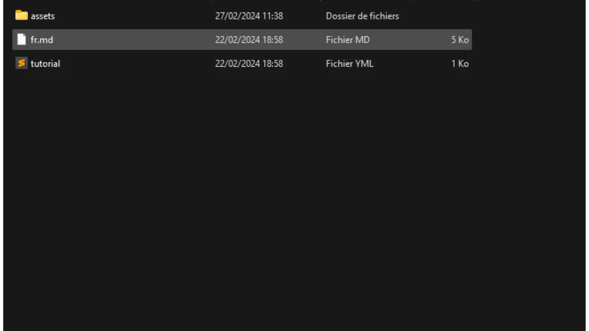

Než se pustíte do tohoto návodu na přidání nového tutoriálu, musíte provést několik předběžných kroků. Pokud jste tak ještě neučinili, vyzývám vás, abyste se nejprve seznámili s tímto úvodním tutoriálem a poté se sem vrátili:

https://planb.network/tutorials/contribution/content/write-tutorials-4d142a6a-9127-4ffb-9e0a-5aba29f169e2
Už jste to udělali:


- Vybrané téma výukového programu;
- Kontaktoval tým sítě Plan ₿ prostřednictvím [skupiny Telegram](https://t.me/PlanBNetwork_ContentBuilder) nebo paolo@planb.network;
- Vybrané nástroje pro příspěvek.

V tomto tutoriálu se podíváme, jak přidat svůj tutoriál do sítě Plan ₿ nastavením místního prostředí pomocí aplikace GitHub Desktop. Pokud jste již zběhlí v práci se systémem Git, tento velmi podrobný návod pro vás nemusí být nutný. Doporučuji spíše konzultaci tohoto jiného tutoriálu, kde uvádím pouze hlavní pokyny, bez podrobného návodu krok za krokem:


- Zkušení uživatelé**:

https://planb.network/tutorials/contribution/content/write-tutorials-git-expert-0ce1e490-c28f-4c51-b7e0-9a6ac9728410
Pokud nechcete nastavovat místní prostředí, postupujte podle tohoto dalšího návodu určeného pro začátečníky, kde změny provedeme přímo přes webové rozhraní GitHubu:


- Pro začátečníky (webové rozhraní)**:

https://planb.network/tutorials/contribution/content/write-tutorials-github-web-beginner-e64f8fed-4c0b-4225-9ebb-7fc5f1c01a79
## Předpoklady

Software potřebný pro tento výukový program:


- [GitHub Desktop](https://desktop.github.com/);
- Editor souborů markdown, jako je [Obsidian](https://obsidian.md/);
- Editor kódu ([VSC](https://code.visualstudio.com/) nebo [Sublime Text](https://www.sublimetext.com/)).


Předpoklady před zahájením výuky:


- Mít účet [GitHub](https://github.com/signup);
- Mít fork zdrojového úložiště [Plan ₿ Network](https://github.com/PlanB-Network/bitcoin-educational-content);
- Mít [profil profesora v síti Plan ₿](https://planb.network/professors) (pouze pokud navrhujete kompletní výukový program).

Pokud potřebujete pomoci se získáním těchto předpokladů, pomohou vám mé další výukové programy:

https://planb.network/tutorials/contribution/others/create-github-account-a75fc39d-f0d0-44dc-9cd5-cd94aee0c07c
Jakmile je vše na svém místě a vaše místní prostředí je správně nastaveno s vlastní odnoží sítě Plan ₿, můžete začít přidávat výukový program.


## 1 - Vytvoření nové pobočky

Otevřete prohlížeč a přejděte na stránku svého úložiště sítě Plan ₿. Jedná se o fork, který jste založili na GitHubu. Adresa URL vašeho forku by měla vypadat takto: `https://github.com/[vaše uživatelské jméno]/bitcoin-educational-content`:


Ujistěte se, že se nacházíte v hlavní větvi `dev`, a poté klikněte na tlačítko `Sync fork`. Pokud váš fork není aktuální, GitHub vám nabídne aktualizaci vaší větve. Pokračujte v této aktualizaci. Pokud je naopak vaše větev již aktuální, GitHub vás o tom bude informovat:


Otevřete program GitHub Desktop a ujistěte se, že je v levém horním rohu okna správně vybrán váš fork:


Klikněte na tlačítko `Přinést původ`. Pokud je váš místní repozitář již aktualizován, aplikace GitHub Desktop nenavrhne žádné další kroky. V opačném případě se zobrazí možnost `Pull origin`. Kliknutím na toto tlačítko aktualizujete svůj místní repozitář:


Ověřte, zda jste skutečně v hlavní větvi `dev`:


Klikněte na tuto větev a poté klikněte na tlačítko `Nová větev`:


Ujistěte se, že nová větev je založena na zdrojovém úložišti, konkrétně `PlanB-Network/bitcoin-educational-content`.

Pojmenujte svou pobočku tak, aby byl z názvu zřejmý její účel, a oddělujte jednotlivá slova pomlčkami. Řekněme například, že naším cílem je napsat návod na používání softwaru Sparrow Wallet. V tomto případě by se pracovní větev určená k napsání tohoto návodu mohla jmenovat: `tuto-sparrow-wallet-loic`. Po zadání vhodného názvu klikněte na tlačítko `Vytvořit větev` a potvrďte vytvoření větve:


Nyní klikněte na tlačítko `Publikovat větev` a uložte novou pracovní větev do své online větve na GitHubu:


Nyní byste se měli na ploše GitHubu ocitnout v nové větvi. To znamená, že všechny změny provedené lokálně na vašem počítači budou uloženy výhradně v této konkrétní větvi. Dokud bude tato větev na Ploše GitHub vybrána, budou také soubory viditelné lokálně na vašem počítači odpovídat souborům této větve (`tuto-sparrow-wallet-loic`), a nikoli souborům hlavní větve (`dev`).


Pro každý nový článek, který chcete publikovat, musíte vytvořit novou větev z `dev`. Větev v systému Git je paralelní verze projektu, která umožňuje provádět změny, aniž by ovlivnila hlavní větev, dokud není práce připravena ke sloučení.

## 2 - Přidání výukových souborů

Nyní, když je vytvořena pracovní větev, je čas integrovat nový výukový program. Máte dvě možnosti: použít můj skript Python, který automatizuje vytvoření potřebných dokumentů, nebo vytvořit každý soubor ručně. Podíváme se na kroky, které je třeba dodržet u každé z těchto možností.

### Pomocí mého skriptu Python

Musíte jej nainstalovat do počítače:


- Python 3.8 nebo vyšší.

Chcete-li skript použít, přejděte do složky, kde je uložen. Skript se nachází v úložišti dat sítě Plan ₿ na cestě: `bitcoin-educational-content/scripts/tutorial-related/data-creator`.

Po vložení do složky nainstalujte závislosti:

```
pip install -r requirements.txt
```

Poté spusťte software příkazem:

```
python3 main.py
```

Otevře se grafické uživatelské rozhraní (GUI). Poprvé budete muset zadat všechny potřebné informace, ale při dalších použitích si skript vaše osobní údaje zapamatuje, takže je nebudete muset zadávat znovu.


Začněte zadáním místní cesty ke složce `/tutorials` v klonovaném úložišti (`.../bitcoin-educational-content/tutorials/`). Můžete ji zadat ručně nebo kliknutím na tlačítko "Procházet" přejít pomocí průzkumníka souborů.


Vyberte jazyk, ve kterém budete psát výukový program.


Do pole "ID GitHub přispěvatele" zadejte své uživatelské jméno GitHub.


Do pole "PBN professor's ID" zadejte svůj identifikátor pomocí slov ze seznamu BIP39, jak je uveden na [vašem profilu profesora](https://github.com/PlanB-Network/bitcoin-educational-content/tree/dev/professors).


Pokud ještě nemáte profil profesora, podívejte se na tento návod:

https://planb.network/tutorials/contribution/others/create-teacher-profile-8ba9ba49-8fac-437a-a435-c38eebc8f8a4
Poté klikněte na tlačítko "Nový výukový program".


Zvolte si hlavní kategorii výukového programu. Poté vyberte příslušnou podkategorii podle zvolené hlavní kategorie.


Určete úroveň obtížnosti výukového programu.


Zvolte název adresáře vytvořeného speciálně pro váš výukový program. Název této složky by měl odrážet software, který je v tutoriálu popsán, a slova by měla být oddělena pomlčkami. Složka by se například mohla jmenovat `red-wallet`:


`project_id` je UUID společnosti nebo organizace, která stojí za nástrojem, jehož se výukový program týká, a je k dispozici [v seznamu projektů](https://github.com/PlanB-Network/bitcoin-educational-content/tree/dev/resources/projects). Například u výukového kurzu o peněžence Sparrow Wallet najdete v souboru její `project_id`: `bitcoin-educational-content/resources/projects/sparrow/project.yml`. Tato informace je přidána do souboru YAML vašeho výukového programu, protože síť Plan ₿ Network spravuje databázi společností a organizací aktivních v oblasti Bitcoinu nebo souvisejících projektů. Přidáním přidruženého `project_id` propojíte svůj obsah s příslušným subjektem.

***Aktualizace:*** V nové verzi skriptu již nemusíte ručně zadávat `project_id`. Byla přidána funkce vyhledávání, která vyhledá projekt podle názvu a automaticky načte odpovídající `project_id`. Pro vyhledání projektu zadejte do pole `Název projektu` začátek jeho názvu a poté vyberte požadovanou společnost z rozbalovací nabídky. V poli níže se automaticky vyplní `project_id`. V případě potřeby jej můžete zadat také ručně.


U značek vyberte 2 nebo 3 relevantní klíčová slova související s obsahem výukového programu a vybírejte výhradně ze [seznamu značek sítě Plan ₿](https://github.com/PlanB-Network/bitcoin-educational-content/blob/dev/docs/50-planb-tags.md). Software rovněž poskytuje funkci vyhledávání klíčových slov pomocí rozevíracího seznamu.


Po zadání a ověření všech informací klikněte na tlačítko "Create Tutorial" a potvrďte vytvoření výukových souborů. Tím se lokálně vytvoří složka výukového programu a všechny potřebné soubory ve vybrané kategorii.


Nyní můžete přeskočit podkapitolu "Bez mého skriptu Python" i krok 3 "Vyplňte soubor YAML", protože tyto činnosti již za vás provedl skript. Přejděte přímo ke kroku 4 a začněte psát svůj výukový program.

Další informace o tomto skriptu v jazyce Python naleznete v [README](https://github.com/PlanB-Network/bitcoin-educational-content/blob/dev/scripts/tutorial-related/new-tutorial-creation/README.md).

### Bez mého skriptu Python

Otevřete správce souborů a přejděte do složky `bitcoin-educational-content`, která představuje místní klon vašeho úložiště. Obvykle ji najdete ve složce `Documents\GitHub\bitcoin-educational-content`.

V tomto adresáři je třeba najít příslušnou podsložku pro umístění výukového programu. Uspořádání složek odpovídá různým sekcím webových stránek Plan ₿ Network. V našem příkladu, protože chceme přidat výukový program o peněžence Sparrow, bychom měli přejít na následující cestu: na webu sítě Network se nachází následující adresa: `bitcoin-educational-content\tutorials\wallet`, která odpovídá sekci `WALLET`:


Ve složce `peněženka` musíte vytvořit nový adresář určený speciálně pro váš výukový program. Název této složky by měl evokovat software, který je v tutoriálu popsán, a dbejte na to, abyste slova spojovali pomlčkami. V mém případě se složka bude jmenovat `sparrow-wallet`:


Do této nové podsložky určené pro váš výukový program je třeba přidat několik prvků:


- Vytvořte složku `assets`, do které vložíte všechny ilustrace potřebné pro výukový program;
- V této složce `assets` je třeba vytvořit podsložku pojmenovanou podle původního kódu jazyka výukového programu. Pokud je například výukový program napsán v angličtině, musí být tato podsložka pojmenována `en`. Umístěte do ní všechny vizuální materiály výukového programu (schémata, obrázky, snímky obrazovky atd.).
- Je třeba vytvořit soubor `tutorial.yml`, do kterého budou zaznamenány podrobnosti týkající se vašeho výukového programu;
- Pro zápis skutečného obsahu výukového programu je třeba vytvořit soubor ve formátu markdown. Tento soubor musí mít název podle kódu jazyka zápisu. Například pro výukový program psaný ve francouzštině se soubor musí jmenovat `fr.md`.



Stručně shrnuto, zde je hierarchie souborů, které je třeba vytvořit:

```
bitcoin-educational-content/
└── tutorials/
└── wallet/ (to be modified with the correct category)
└── sparrow-wallet/ (to be modified with the name of the tutorial)
├── assets/
│   ├── en/ (to be modified according to the appropriate language code)
├── tutorial.yml
└── en.md (to be modified according to the appropriate language code)
```

## 3 - Vyplnění souboru YAML

Vyplňte soubor `tutorial.yml` zkopírováním následující šablony:

```
id:
project_id:
tags:
-
-
-
category:
level:
credits:
professor:
# Proofreading metadata
original_language:
proofreading:
- language:
last_contribution_date:
urgency:
contributors_id:
-
reward:
```

Zde jsou uvedeny podrobnosti o povinných polích:


- id**: UUID (_Universally Unique Identifier_), který slouží k jednoznačné identifikaci výukového programu. Můžete jej vygenerovat pomocí [online nástroje](https://www.uuidgenerator.net/version4). Jediným požadavkem je, aby tento UUID byl náhodný, aby nedošlo ke konfliktu s jiným UUID na platformě;
- project_id**: UUID společnosti nebo organizace, která stojí za nástrojem prezentovaným v tutoriálu [ze seznamu projektů](https://github.com/PlanB-Network/bitcoin-educational-content/tree/dev/resources/projects). Pokud například vytváříte výukový program o softwaru Sparrow Wallet, najdete toto `project_id` v následujícím souboru: `bitcoin-educational-content/resources/projects/sparrow/project.yml`. Tato informace je přidána do souboru YAML vašeho výukového programu, protože síť Plan ₿ udržuje databázi všech společností a organizací působících v oblasti Bitcoinu nebo souvisejících projektů. Přidáním `project_id` subjektu souvisejícího s vaším tutoriálem vytvoříte spojení mezi těmito dvěma prvky;
- tagy**: 2 nebo 3 relevantní klíčová slova související s obsahem výukového programu, vybraná výhradně [ze seznamu značek sítě Plan ₿](https://github.com/PlanB-Network/bitcoin-educational-content/blob/dev/docs/50-planb-tags.md);
- kategorie**: Podkategorie odpovídající obsahu výukového programu podle struktury webu sítě Plan ₿ (například pro peněženky: `desktop`, `hardware`, `mobil`, `zálohování`);
- úroveň**: Úroveň obtížnosti výukového programu, mezi:
    - `začátečník`
    - `intermediate`
    - `pokročilý`
    - `expert`
- profesor**: (slova BIP39), jak je zobrazeno na [vašem profilu profesora](https://github.com/PlanB-Network/bitcoin-educational-content/tree/dev/professors);
- original_language**: Původní jazyk výukového programu (například `fr`, `en` atd.);
- korektury**: Informace o procesu korektur. Vyplňte první část, protože korektura vlastního výukového materiálu se počítá jako první ověření:
    - jazyk**: Kód jazyka korektury (například `fr`, `en` atd.).
    - last_contribution_date**: Dnešní datum.
    - naléhavost**: Nevyplňujte.
    - přispěvatelé_id**: Vaše GitHub ID.
    - odměna**: Nevyplňujte.

Další podrobnosti o identifikátoru profesora naleznete v příslušném výukovém kurzu:

https://planb.network/tutorials/contribution/others/create-teacher-profile-8ba9ba49-8fac-437a-a435-c38eebc8f8a4
Zde je příklad vyplněného souboru `tutorial.yml` pro výukový program o peněžence Blockstream Green:

```
id: e84edaa9-fb65-48c1-a357-8a5f27996143
project_id: 3b2f45e6-d612-412c-95ba-cf65b49aa5b8
tags:
- wallets
- software
- keys
category: mobile
level: beginner
credits:
professor: pretty-private
# Proofreading metadata
original_language: fr
proofreading:
- language: fr
last_contribution_date: 2024-11-20
urgency: 1
contributors_id:
- LoicPandul
reward: 0
```

Po dokončení úprav souboru `tutorial.yml` uložte dokument kliknutím na `Soubor > Uložit`:


Nyní můžete zavřít editor kódu.

## 4 - Vyplnění souboru Markdown

Nyní můžete otevřít soubor, ve kterém bude umístěn váš výukový program, pojmenovaný kódem vašeho jazyka, například `fr.md`. Přejděte do Obsidianu, v levé části okna procházejte stromem složek, dokud nenajdete složku svého výukového programu a hledaný soubor:


Kliknutím na soubor jej otevřete:


Začneme vyplněním části `Vlastnosti` v horní části dokumentu.


Ručně přidejte a vyplňte následující blok kódu:

```
---
name: [Title]
description: [Description]
---
```


Vyplňte název výukového programu a jeho krátký popis:


Na začátek výukového programu pak přidejte cestu k obrázku obálky. K tomu si poznamenejte:

```

```

Tato syntaxe se vám bude hodit vždy, když bude nutné přidat do výukového programu obrázek. Vykřičník označuje, že se jedná o obrázek, přičemž alternativní text (alt) je uveden mezi závorkami. Cesta k obrázku je uvedena mezi závorkami:


## 5 - Přidání loga a obálky

Do složky `assets` musíte přidat soubor s názvem `logo.webp`, který bude sloužit jako miniatura článku. Tento obrázek musí být ve formátu `.webp` a musí dodržovat čtvercový rozměr, aby ladil s uživatelským rozhraním. Můžete si zvolit logo softwaru, o kterém pojednává výukový program, nebo jakýkoli jiný vhodný obrázek za předpokladu, že na něj nemáte žádná práva. Kromě toho na stejné místo přidejte také obrázek s názvem `cover.webp`. Tento obrázek se bude zobrazovat v horní části vašeho výukového programu. Ujistěte se, že tento obrázek, stejně jako logo, respektuje práva k použití a je vhodný pro kontext vašeho výukového kurzu:

## 6 - Psaní výukového programu a přidávání vizuálních materiálů

Pokračujte v psaní výukového programu přípravou obsahu. Pokud chcete začlenit titulek, použijte příslušné formátování markdown předřazením textu před `##`:


Podsložka Jazyk ve složce `assets` slouží k ukládání diagramů a vizuálních materiálů, které budou doprovázet váš výukový program. Pokud je to možné, vyvarujte se vkládání textu do obrázků, aby byl obsah přístupný mezinárodnímu publiku. Prezentovaný software bude samozřejmě obsahovat text, ale pokud přidáváte diagramy nebo další údaje na snímky obrazovky softwaru, udělejte to bez textu, nebo pokud se ukáže jako nezbytný, použijte angličtinu.


Pro pojmenování obrázků jednoduše použijte čísla odpovídající pořadí jejich výskytu ve výukovém programu, formátovaná dvěma číslicemi (nebo třemi číslicemi, pokud výukový program obsahuje více než 99 obrázků). Například první obrázek pojmenujte `01.webp`, druhý `02.webp` a tak dále.

Vaše obrázky musí být výhradně ve formátu `.webp`. V případě potřeby můžete použít [můj software pro konverzi obrázků](https://github.com/LoicPandul/ImagesConverter).


Chcete-li do dokumentu vložit diagram, použijte následující příkaz Markdown a nezapomeňte zadat příslušný alternativní text a správnou cestu k obrázku:

```

```

Vykřičník na začátku označuje, že se jedná o obrázek. Alternativní text, který napomáhá přístupnosti a SEO, je umístěn mezi závorkami. Nakonec je mezi závorkami uvedena cesta k obrázku.

Pokud si chcete vytvořit vlastní diagramy, dbejte na dodržování grafické charty sítě Plan ₿, abyste zajistili vizuální konzistenci:


- Písmo**: [Rubik](https://fonts.google.com/specimen/Rubik);
- Barvy**:
 - Oranžová: #FF5C00
 - Černá barva: #000000
 - Bílá: #FFFFFF

**Je nutné, aby všechny vizuály integrované do vašich výukových programů byly bez práv nebo respektovaly licenci zdrojového souboru**. Také všechna schémata zveřejněná v síti Plan ₿ jsou k dispozici pod licencí CC-BY-SA, stejně jako text.

**-> Tip:** Při veřejném sdílení souborů, například obrázků, je důležité odstranit nepotřebná metadata. Ta mohou obsahovat citlivé informace, jako jsou údaje o poloze, data vytvoření nebo podrobnosti o autorovi. V zájmu ochrany soukromí je vhodné tato metadata odstranit. Pro zjednodušení tohoto procesu můžete použít specializované nástroje, jako je [Exif Cleaner](https://exifcleaner.com/), který umožňuje vyčistit metadata dokumentu jednoduchým přetažením.

## 7 - Uložení a odeslání výukového programu

Po dokončení psaní výukového programu ve zvoleném jazyce je dalším krokem odeslání **žádosti o stažení**. Správce se poté postará o přidání chybějících překladů vašeho tutoriálu díky naší metodě automatického překladu s lidskou kontrolou.

Chcete-li pokračovat v odesílání žádosti o stažení, otevřete program GitHub Desktop. Software by měl automaticky zjistit změny, které jste provedli lokálně ve své větvi v porovnání s původním úložištěm. Než budete pokračovat, pečlivě zkontrolujte v levé části rozhraní, zda tyto změny odpovídají tomu, co jste očekávali:


Přidejte název revize a kliknutím na modré tlačítko `Odeslat do [vaší větve]` tyto změny potvrďte:


Revize je uložení změn provedených ve větvi, doprovázené popisnou zprávou, což umožňuje sledovat vývoj projektu v čase. Je to jakýsi mezilehlý kontrolní bod.

Poté klikněte na tlačítko `Push origin`. Tím odešlete revizi do svého forku:


Pokud jste výukový program nedokončili, můžete se k němu vrátit později a provést nové revize. Pokud jste dokončili změny v této větvi, klikněte nyní na tlačítko `Preview Pull Request`:


Můžete naposledy zkontrolovat, zda jsou vaše úpravy správné, a poté kliknout na tlačítko `Vytvořit žádost o stažení`:


Žádost o vytažení je žádost o začlenění změn z vaší větve do hlavní větve úložiště sítě Plan ₿, která umožňuje kontrolu a diskusi o změnách před jejich sloučením.

Budete automaticky přesměrováni do svého prohlížeče na GitHubu na přípravnou stránku vaší žádosti o stažení:


Uveďte název, který stručně shrnuje změny, které chcete sloučit se zdrojovým úložištěm. Přidejte stručný komentář popisující tyto změny (pokud je s vytvořením vašeho výukového programu spojeno číslo problému, nezapomeňte do komentáře uvést `Uzavírá #{číslo problému}`) a poté kliknutím na zelené tlačítko `Vytvořit žádost o stažení` potvrďte žádost o sloučení:


Vaše žádost o stažení bude poté viditelná na kartě `Žádost o stažení` v hlavním úložišti sítě Plán ₿. Stačí počkat, až vás kontaktuje správce, aby potvrdil sloučení vašeho příspěvku nebo požádal o další úpravy.


Po sloučení vašeho PR s hlavní větví doporučujeme smazat vaši pracovní větev (`tuto-sparrow-wallet`), abyste si zachovali čistou historii vaší větve. GitHub vám tuto možnost automaticky nabídne na stránce vašeho PR:


V softwaru GitHub Desktop se můžete přepnout zpět do hlavní větve svého forku (`dev`).


Pokud chcete provést změny ve svém příspěvku poté, co jste již předložili PR, závisí postup na aktuálním stavu vašeho PR:


- Pokud je váš PR stále otevřený a ještě nebyl sloučen, proveďte změny lokálně a zůstaňte ve stejné větvi. Jakmile jsou změny dokončeny, použijte tlačítko `Push origin` a přidejte novou revizi do stále otevřeného PR;
- Pokud byl váš PR již sloučen s hlavní větví, musíte proces začít znovu vytvořením nové větve a následným odesláním nového PR. Před pokračováním se ujistěte, že je váš místní repozitář synchronizován se zdrojovým repozitářem sítě Plan ₿.

Pokud se při odesílání výukového programu setkáte s technickými potížemi, neváhejte požádat o pomoc na [naší speciální skupině pro příspěvky na Telegramu](https://t.me/PlanBNetwork_ContentBuilder). Děkujeme!


