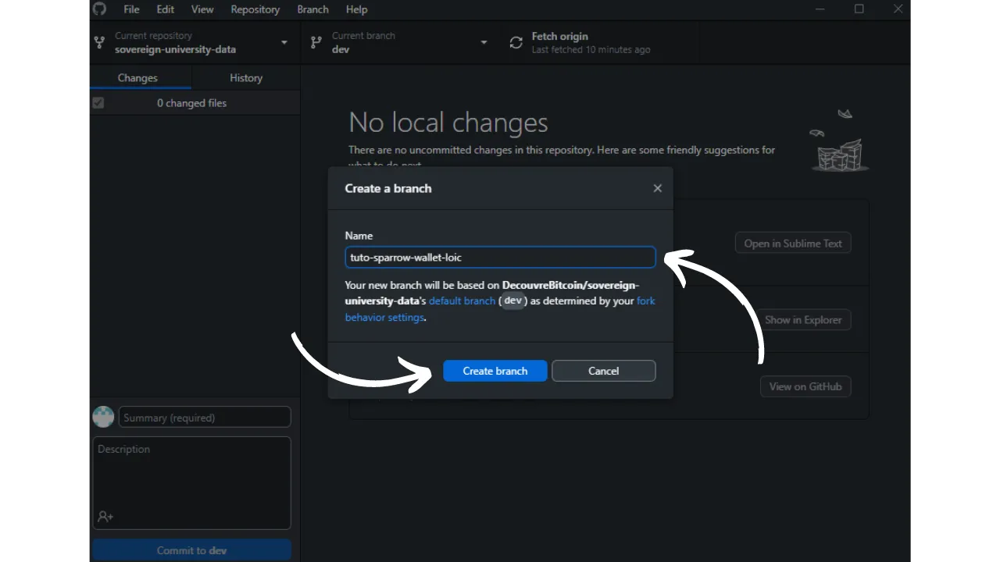
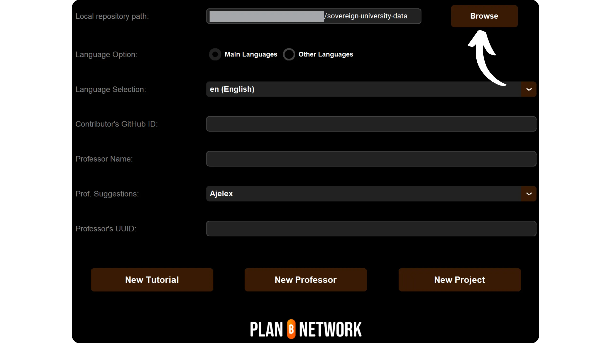

Bevor Sie diese Anleitung zum Hinzufügen eines neuen Tutorials lesen, müssen Sie einige vorbereitende Schritte durchgeführt haben. Wenn Sie dies noch nicht getan haben, sollten Sie zunächst dieses einführende Tutorial lesen und dann hierher zurückkehren:

https://planb.network/tutorials/contribution/content/write-tutorials-4d142a6a-9127-4ffb-9e0a-5aba29f169e2
Das haben Sie bereits:


- Wählen Sie das Thema Ihres Tutorials;
- Kontaktieren Sie das Plan ₿ Network Team über [die Telegram-Gruppe] (https://t.me/PlanBNetwork_ContentBuilder) oder paolo@planb.network;
- Wählen Sie Ihre Beitragstools aus.

In diesem Tutorial werden wir sehen, wie Sie Ihr Tutorial zum Plan ₿ Network hinzufügen, indem Sie Ihre lokale Umgebung mit GitHub Desktop einrichten. Wenn Sie bereits mit Git vertraut sind, ist dieses sehr detaillierte Tutorial vielleicht nicht notwendig für Sie. Ich würde eher empfehlen, dieses andere Tutorial zu konsultieren, in dem ich nur die wichtigsten Richtlinien vorstelle, ohne detaillierte Schritt-für-Schritt-Anleitung:


- Erfahrene Benutzer**:

https://planb.network/tutorials/contribution/content/write-tutorials-git-expert-0ce1e490-c28f-4c51-b7e0-9a6ac9728410
Wenn Sie es vorziehen, Ihre lokale Umgebung nicht einzurichten, folgen Sie dieser anderen Anleitung für Anfänger, in der wir die Änderungen direkt über die Weboberfläche von GitHub vornehmen:


- Anfänger (Webschnittstelle)**:

https://planb.network/tutorials/contribution/content/write-tutorials-github-web-beginner-e64f8fed-4c0b-4225-9ebb-7fc5f1c01a79
## Voraussetzungen

Erforderliche Software, um diesem Tutorial zu folgen:


- [GitHub Desktop](https://desktop.github.com/);
- Ein Markdown-Dateieditor wie [Obsidian] (https://obsidian.md/);
- Ein Code-Editor ([VSC](https://code.visualstudio.com/) oder [Sublime Text](https://www.sublimetext.com/)).


Voraussetzungen vor Beginn des Tutorials:


- Sie haben ein [GitHub-Konto] (https://github.com/signup);
- Haben Sie einen Fork des [Plan ₿ Network source repository] (https://github.com/PlanB-Network/bitcoin-educational-content);
- Verfügen Sie über [ein Professorenprofil im Plan ₿ Network] (https://planb.network/professors) (nur wenn Sie ein vollständiges Tutorium vorschlagen).

Wenn Sie Hilfe benötigen, um diese Voraussetzungen zu erfüllen, werden Ihnen meine anderen Tutorials helfen:

https://planb.network/tutorials/others/contribution/basics-of-github-471f7f00-8b5a-4b63-abb1-f1528b032bbb
Sobald alles an Ort und Stelle ist und Ihre lokale Umgebung mit Ihrem eigenen Fork des Plan ₿ Network richtig eingerichtet ist, können Sie mit dem Hinzufügen des Tutorials beginnen.


## 1 - Einen neuen Zweig erstellen

Öffnen Sie Ihren Browser und gehen Sie auf die Seite Ihres Forks des Plan ₿ Network Repository. Dies ist der Fork, den Sie auf GitHub eingerichtet haben. Die URL Ihres Forks sollte wie folgt aussehen: `https://github.com/[Ihr-Benutzername]/bitcoin-educational-content`:


Vergewissern Sie sich, dass Sie sich auf dem Hauptzweig `dev` befinden und klicken Sie dann auf die Schaltfläche `Sync fork`. Wenn Ihr Fork nicht auf dem neuesten Stand ist, wird GitHub Ihnen anbieten, Ihren Branch zu aktualisieren. Fahren Sie mit dieser Aktualisierung fort. Wenn Ihr Zweig hingegen bereits auf dem neuesten Stand ist, wird GitHub Sie darüber informieren:


Öffnen Sie die GitHub-Desktop-Software und stellen Sie sicher, dass Ihr Fork in der oberen linken Ecke des Fensters korrekt ausgewählt ist:


Klicken Sie auf die Schaltfläche "Herkunft abrufen". Wenn Ihr lokales Repository bereits auf dem neuesten Stand ist, schlägt GitHub Desktop keine weiteren Maßnahmen vor. Andernfalls wird die Option "Herkunft abrufen" angezeigt. Klicken Sie auf diese Schaltfläche, um Ihr lokales Repository zu aktualisieren:


Überprüfen Sie, ob Sie sich tatsächlich auf dem Hauptzweig `dev` befinden:


Klicken Sie auf diesen Zweig und dann auf die Schaltfläche "Neuer Zweig":


Stellen Sie sicher, dass der neue Zweig auf dem Quell-Repository basiert, nämlich `PlanB-Network/bitcoin-educational-content`.

Benennen Sie Ihren Zweig so, dass der Titel den Zweck klar erkennen lässt, und trennen Sie die einzelnen Wörter mit Bindestrichen. Nehmen wir zum Beispiel an, unser Ziel ist es, eine Anleitung zur Verwendung der Sparrow Wallet Software zu schreiben. In diesem Fall könnte der Arbeitszweig, der für die Erstellung dieses Tutorials vorgesehen ist, den Namen "tuto-sparrow-wallet-loic" tragen. Sobald Sie den entsprechenden Namen eingegeben haben, klicken Sie auf `Zweig erstellen`, um die Erstellung des Zweigs zu bestätigen:



Klicken Sie nun auf die Schaltfläche "Zweig veröffentlichen", um Ihren neuen Arbeitszweig in Ihrem Online-Zweig auf GitHub zu speichern:


Auf dem GitHub-Desktop sollten Sie sich nun in Ihrem neuen Zweig befinden. Das bedeutet, dass alle Änderungen, die Sie lokal auf Ihrem Computer vornehmen, ausschließlich in diesem speziellen Zweig gespeichert werden. Solange dieser Zweig auf GitHub Desktop ausgewählt bleibt, entsprechen die lokal auf Ihrem Computer sichtbaren Dateien denen dieses Zweigs (`tuto-sparrow-wallet-loic`) und nicht denen des Hauptzweigs (`dev`).


Für jeden neuen Artikel, den Sie veröffentlichen möchten, müssen Sie einen neuen Zweig von `dev` erstellen. Ein Zweig in Git ist eine parallele Version des Projekts, die es Ihnen ermöglicht, Änderungen vorzunehmen, ohne den Hauptzweig zu beeinflussen, bis die Arbeit zum Zusammenführen bereit ist.

## 2 - Hinzufügen der Tutorial-Dateien

Nun, da der Arbeitszweig erstellt ist, ist es an der Zeit, Ihr neues Tutorial zu integrieren. Sie haben zwei Möglichkeiten: Verwenden Sie mein Python-Skript, das die Erstellung der erforderlichen Dokumente automatisiert, oder erstellen Sie jede Datei manuell. Wir werden uns die Schritte ansehen, die für jede Option zu befolgen sind.

### Mit meinem Python-Skript

Sie müssen es auf Ihrem Rechner installieren:


- Python 3.8 oder höher.

Um das Skript zu verwenden, navigieren Sie zu dem Ordner, in dem es gespeichert ist. Das Skript befindet sich im Plan ₿ Network Data Repository unter dem Pfad: `bitcoin-educational-content/scripts/tutorial-related/data-creator`.

Installieren Sie die Abhängigkeiten, sobald sie sich im Ordner befinden:

```
pip install -r requirements.txt
```

Starten Sie dann die Software mit dem Befehl:

```
python3 main.py
```

Eine grafische Benutzeroberfläche (GUI) wird geöffnet. Beim ersten Mal müssen Sie alle erforderlichen Informationen eingeben, aber bei späteren Anwendungen merkt sich das Skript Ihre persönlichen Daten, so dass Sie sie nicht erneut eingeben müssen.


Beginnen Sie damit, den lokalen Pfad zum Ordner "/tutorials" in Ihrem geklonten Repository einzugeben (`.../bitcoin-educational-content/tutorials/`). Sie können ihn manuell eingeben oder auf die Schaltfläche "Durchsuchen" klicken, um mit Ihrem Dateiexplorer zu navigieren.



Wählen Sie die Sprache, in der Sie Ihr Tutorium verfassen wollen.


Geben Sie in das Feld "GitHub-ID des Mitwirkenden" Ihren GitHub-Benutzernamen ein.


Geben Sie in das Feld "PBN-Professoren-ID" Ihre Kennung mit Wörtern aus der BIP39-Liste ein, wie sie auf [Ihr Professorenprofil] (https://github.com/PlanB-Network/bitcoin-educational-content/tree/dev/professors) erscheint.


Wenn Sie noch kein Professorinnen- oder Professorenprofil haben, schauen Sie sich diese Anleitung an:

https://planb.network/tutorials/contribution/others/create-teacher-profile-8ba9ba49-8fac-437a-a435-c38eebc8f8a4
Klicken Sie dann auf die Schaltfläche "Neues Tutorial".


Wählen Sie eine Hauptkategorie für Ihr Lernprogramm. Wählen Sie dann eine relevante Unterkategorie, die auf Ihrer gewählten Hauptkategorie basiert.


Bestimmen Sie den Schwierigkeitsgrad des Tutorials.


Wählen Sie einen Namen für das Verzeichnis, das speziell für Ihr Lernprogramm erstellt wurde. Der Name dieses Ordners sollte die im Tutorium behandelte Software widerspiegeln, wobei Bindestriche zur Trennung der Wörter verwendet werden sollten. Der Ordner könnte zum Beispiel "red-wallet" heißen:


Die `project_id` ist die UUID des Unternehmens oder der Organisation, die hinter dem im Tutorium behandelten Tool steht, verfügbar [in der Liste der Projekte] (https://github.com/PlanB-Network/bitcoin-educational-content/tree/dev/resources/projects). Zum Beispiel, für ein Tutorial über Sparrow Wallet, können Sie die `project_id` in der Datei finden: `bitcoin-educational-content/resources/projects/sparrow/project.yml`. Diese Information wird der YAML-Datei Ihres Tutorials hinzugefügt, weil das Plan ₿ Network eine Datenbank von Unternehmen und Organisationen unterhält, die in Bitcoin oder verwandten Projekten aktiv sind. Indem Sie die zugehörige `project_id` hinzufügen, verknüpfen Sie Ihren Inhalt mit der relevanten Entität.

***Update:*** In der neuen Version des Skripts müssen Sie die "project_id" nicht mehr manuell eingeben. Es wurde eine Suchfunktion hinzugefügt, um das Projekt anhand des Namens zu finden und automatisch die entsprechende "project_id" abzurufen. Geben Sie den Anfang des Projektnamens in das Feld "Projektname" ein, um nach dem Projekt zu suchen, und wählen Sie dann das gewünschte Unternehmen aus dem Dropdown-Menü aus. Die "project_id" wird automatisch in das Feld darunter eingetragen. Sie können sie bei Bedarf auch manuell eingeben.


Wählen Sie für die Tags 2 oder 3 relevante Schlüsselwörter aus, die mit dem Inhalt Ihres Tutorials zusammenhängen, und wählen Sie ausschließlich aus [der Tag-Liste des Plan ₿ Network] (https://github.com/PlanB-Network/bitcoin-educational-content/blob/dev/docs/50-planb-tags.md). Die Software bietet auch eine Schlagwort-Suchfunktion mit einer Dropdown-Liste.


Nachdem Sie alle Informationen eingegeben und überprüft haben, klicken Sie auf "Tutorial erstellen", um die Erstellung Ihrer Tutorial-Dateien zu bestätigen. Dadurch werden Ihr Lehrgangsordner und alle erforderlichen Dateien in der ausgewählten Kategorie lokal erstellt.


Sie können nun den Unterabschnitt "Ohne mein Python-Skript" sowie Schritt 3, "Ausfüllen der YAML-Datei", überspringen, da das Skript diese Aktionen bereits für Sie erledigt hat. Fahren Sie direkt mit Schritt 4 fort und beginnen Sie mit dem Schreiben Ihres Tutorials.

Weitere Informationen zu diesem Python-Skript finden Sie auch in der [README](https://github.com/PlanB-Network/bitcoin-educational-content/blob/dev/scripts/tutorial-related/new-tutorial-creation/README.md).

### Ohne mein Python-Skript

Öffnen Sie Ihren Dateimanager und navigieren Sie zum Ordner "bitcoin-educational-content", der den lokalen Klon Ihres Repositorys darstellt. Sie finden ihn normalerweise unter "Dokumente", "GitHub", "Bitcoin-Education-Content".

Innerhalb dieses Verzeichnisses müssen Sie den entsprechenden Unterordner finden, in dem Sie Ihr Lernprogramm ablegen möchten. Die Organisation der Ordner spiegelt die verschiedenen Bereiche der Plan ₿ Network Website wider. In unserem Beispiel, in dem wir ein Tutorial über Sparrow Wallet hinzufügen wollen, sollten wir zu folgendem Pfad navigieren: `bitcoin-educational-content\tutorials\wallet`, was dem Abschnitt `WALLET` auf der Website entspricht:


Innerhalb des Ordners "wallet" müssen Sie ein neues Verzeichnis erstellen, das speziell für Ihr Lernprogramm bestimmt ist. Der Name dieses Ordners sollte an die im Tutorium behandelte Software erinnern, wobei die Wörter mit Bindestrichen verbunden werden müssen. In meinem Beispiel trägt der Ordner den Namen "Sparrow-Wallet":


In diesem neuen Unterordner, der Ihrem Lehrgang gewidmet ist, müssen mehrere Elemente hinzugefügt werden:


- Erstellen Sie einen Ordner `Assets`, der alle für Ihren Lehrgang notwendigen Illustrationen aufnehmen soll;
- Innerhalb dieses Ordners "Assets" müssen Sie einen Unterordner erstellen, der nach dem ursprünglichen Sprachcode des Lernprogramms benannt ist. Wenn das Lernprogramm beispielsweise auf Englisch verfasst ist, muss dieser Unterordner den Namen `en` tragen. Legen Sie dort alle visuellen Elemente des Tutorials ab (Diagramme, Bilder, Screenshots usw.).
- Es muss eine Datei "tutorial.yml" erstellt werden, um die Details Ihres Tutorials zu erfassen;
- Eine Datei im Markdown-Format muss erstellt werden, um den eigentlichen Inhalt Ihres Tutorials zu schreiben. Diese Datei muss entsprechend dem Sprachcode des Textes benannt werden. Zum Beispiel muss die Datei für ein auf Französisch geschriebenes Tutorial "fr.md" heißen.


Zusammenfassend lässt sich die Hierarchie der zu erstellenden Dateien wie folgt darstellen:

```
bitcoin-educational-content/
└── tutorials/
└── wallet/ (to be modified with the correct category)
└── sparrow-wallet/ (to be modified with the name of the tutorial)
├── assets/
│   ├── en/ (to be modified according to the appropriate language code)
├── tutorial.yml
└── en.md (to be modified according to the appropriate language code)
```

## 3 - Ausfüllen der YAML-Datei

Füllen Sie die Datei "tutorial.yml" aus, indem Sie die folgende Vorlage kopieren:

```
id:
project_id:
tags:
-
-
-
category:
level:
credits:
professor:
# Proofreading metadata
original_language:
proofreading:
- language:
last_contribution_date:
urgency:
contributors_id:
-
reward:
```

Hier sind die Details zu den Pflichtfeldern:


- id**: Eine UUID (_Universally Unique Identifier_) zur eindeutigen Identifizierung des Lernprogramms. Sie können sie mit [einem Online-Tool] (https://www.uuidgenerator.net/version4) erzeugen. Die einzige Voraussetzung ist, dass diese UUID zufällig ist, um Konflikte mit anderen UUIDs auf der Plattform zu vermeiden;
- projekt_id**: Die UUID des Unternehmens oder der Organisation, die hinter dem im Lernprogramm vorgestellten Tool steht [aus der Liste der Projekte] (https://github.com/PlanB-Network/bitcoin-educational-content/tree/dev/resources/projects). Wenn Sie zum Beispiel ein Tutorial über die Sparrow Wallet Software erstellen, finden Sie diese `project_id` in der folgenden Datei: `bitcoin-educational-content/resources/projects/sparrow/project.yml`. Diese Information wird der YAML-Datei Ihres Tutorials hinzugefügt, weil das Plan ₿ Network eine Datenbank aller Unternehmen und Organisationen unterhält, die an Bitcoin oder verwandten Projekten arbeiten. Durch das Hinzufügen der `project_id` der Entität, die mit Ihrem Tutorial in Verbindung steht, schaffen Sie eine Verbindung zwischen den beiden Elementen;
- tags**: 2 oder 3 relevante Schlüsselwörter, die sich auf den Inhalt des Tutorials beziehen und ausschließlich [aus der Liste der Tags des Plan ₿ Network] (https://github.com/PlanB-Network/bitcoin-educational-content/blob/dev/docs/50-planb-tags.md) ausgewählt werden;
- kategorie**: Die Unterkategorie, die dem Inhalt des Tutorials entspricht, entsprechend der Struktur des Plan ₿ Network (z. B. für Geldbörsen: `Desktop`, `Hardware`, `Mobile`, `Backup`);
- stufe**: Der Schwierigkeitsgrad des Tutorials, unter:
    - anfänger
    - mittel
    - fortgeschritten
    - experte
- professor**: Ihre `Beitragszahler_id` (BIP39-Wörter), wie sie auf [Ihrem Professorprofil] (https://github.com/PlanB-Network/bitcoin-educational-content/tree/dev/professors) angezeigt wird;
- original_language**: Die Originalsprache des Tutorials (z.B. `fr`, `en`, etc.);
- korrekturlesen**: Informationen über den Korrekturleseprozess. Füllen Sie den ersten Teil aus, da das Korrekturlesen Ihres eigenen Tutoriums als erste Validierung zählt:
    - sprache**: Sprachcode des Korrekturlesens (z. B. "fr", "en" usw.).
    - letzter_Beitrag_datum**: Das heutige Datum.
    - dringlichkeit**: Leer lassen.
    - contributors_id**: Ihre GitHub-ID.
    - belohnung**: Leer lassen.

Weitere Einzelheiten zu Ihrer Professorenkennung finden Sie in der entsprechenden Anleitung:

https://planb.network/tutorials/contribution/others/create-teacher-profile-8ba9ba49-8fac-437a-a435-c38eebc8f8a4
Hier ist ein Beispiel für eine fertige `tutorial.yml`-Datei für ein Tutorial über die Blockstream Green Wallet:

```
id: e84edaa9-fb65-48c1-a357-8a5f27996143
project_id: 3b2f45e6-d612-412c-95ba-cf65b49aa5b8
tags:
- wallets
- software
- keys
category: mobile
level: beginner
credits:
professor: pretty-private
# Proofreading metadata
original_language: fr
proofreading:
- language: fr
last_contribution_date: 2024-11-20
urgency: 1
contributors_id:
- LoicPandul
reward: 0
```

Wenn Sie die Änderungen an der Datei `tutorial.yml` abgeschlossen haben, speichern Sie Ihr Dokument, indem Sie auf `Datei > Speichern` klicken:


Sie können nun Ihren Code-Editor schließen.

## 4 - Ausfüllen der Markdown-Datei

Nun können Sie die Datei öffnen, in der sich Ihr Tutorial befindet, benannt mit dem Code Ihrer Sprache, z. B. "fr.md". Gehen Sie zu Obsidian, blättern Sie auf der linken Seite des Fensters durch den Ordnerbaum, bis Sie den Ordner Ihres Tutorials und die gesuchte Datei finden:


Klicken Sie auf die Datei, um sie zu öffnen:


Wir beginnen damit, den Abschnitt "Eigenschaften" am Anfang des Dokuments auszufüllen.


Fügen Sie den folgenden Codeblock manuell hinzu und füllen Sie ihn aus:

```
---
name: [Title]
description: [Description]
---
```


Geben Sie den Namen Ihres Tutorials und eine kurze Beschreibung ein:


Fügen Sie dann den Pfad des Titelbildes am Anfang Ihres Tutorials ein. Beachten Sie dazu:

```

```

Diese Syntax ist immer dann nützlich, wenn ein Bild zu Ihrem Tutorial hinzugefügt werden soll. Das Ausrufezeichen zeigt an, dass es sich um ein Bild handelt, wobei der alternative Text (alt) zwischen den Klammern angegeben wird. Der Pfad zum Bild wird zwischen den Klammern angegeben:


## 5 - Hinzufügen des Logos und des Covers

Im Ordner "Assets" müssen Sie eine Datei mit dem Namen "logo.webp" hinzufügen, die als Vorschaubild für Ihren Artikel dienen wird. Dieses Bild muss im Format `.webp` sein und ein quadratisches Format haben, um mit der Benutzeroberfläche zu harmonieren. Sie können das Logo der im Tutorial behandelten Software oder ein anderes geeignetes Bild wählen, sofern es frei von Rechten ist. Fügen Sie außerdem ein Bild mit dem Titel "cover.webp" an der gleichen Stelle ein. Dieses Bild wird am Anfang des Tutorials angezeigt. Vergewissern Sie sich, dass dieses Bild, ebenso wie das Logo, die Nutzungsrechte respektiert und für den Kontext Ihres Tutorials geeignet ist:

## 6 - Schreiben des Tutorials und Hinzufügen von Bildmaterial

Fahren Sie mit dem Schreiben Ihres Tutorials fort, indem Sie Ihren Inhalt formulieren. Wenn Sie einen Untertitel einfügen möchten, wenden Sie die entsprechende Markdown-Formatierung an, indem Sie dem Text ein "##" voranstellen:


Der Unterordner "Sprache" im Ordner "Assets" dient zum Speichern von Diagrammen und visuellen Darstellungen, die Ihr Lernprogramm begleiten werden. Vermeiden Sie so weit wie möglich, Text in Ihre Bilder einzufügen, um Ihre Inhalte für ein internationales Publikum zugänglich zu machen. Natürlich wird die vorgestellte Software Text enthalten, aber wenn Sie Diagramme oder zusätzliche Angaben zu Software-Screenshots hinzufügen, tun Sie dies ohne Text oder, wenn es sich als unerlässlich erweist, verwenden Sie Englisch.


Um Ihre Bilder zu benennen, verwenden Sie einfach Nummern, die der Reihenfolge ihres Erscheinens im Lernprogramm entsprechen, formatiert mit zwei Ziffern (oder drei Ziffern, wenn Ihr Lernprogramm mehr als 99 Bilder enthält). Nennen Sie zum Beispiel Ihr erstes Bild `01.webp`, Ihr zweites `02.webp`, und so weiter.

Ihre Bilder müssen ausschließlich im `.webp`-Format vorliegen. Bei Bedarf können Sie [meine Bildkonvertierungssoftware] (https://github.com/LoicPandul/ImagesConverter) verwenden.


Um ein Diagramm in Ihr Dokument einzufügen, verwenden Sie den folgenden Markdown-Befehl. Achten Sie darauf, dass Sie den entsprechenden Alternativtext sowie den korrekten Pfad des Bildes angeben:

```

```

Das Ausrufezeichen am Anfang zeigt an, dass es sich um ein Bild handelt. Der alternative Text, der der Zugänglichkeit und der Suchmaschinenoptimierung dient, befindet sich zwischen den Klammern. Schließlich wird der Pfad zu dem Bild zwischen den Klammern angegeben.

Wenn Sie Ihre eigenen Diagramme erstellen möchten, sollten Sie sich an die grafische Charta des Plan ₿ Network halten, um die visuelle Konsistenz zu gewährleisten:


- Schriftart**: Verwenden Sie [Rubik](https://fonts.google.com/specimen/Rubik);
- Farben**:
 - Orange: #FF5C00
 - Schwarz: #000000
 - Weiß: #FFFFFF

**Es ist unbedingt erforderlich, dass alle in Ihre Tutorials integrierten Grafiken frei von Rechten sind oder die Lizenz der Quelldatei respektieren**. Außerdem werden alle Diagramme, die im Plan ₿ Network veröffentlicht werden, unter der CC-BY-SA-Lizenz zur Verfügung gestellt, genau wie der Text.

**-> Tipp:** Bei der öffentlichen Freigabe von Dateien, wie z. B. Bildern, ist es wichtig, alle unnötigen Metadaten zu entfernen. Diese können sensible Informationen wie Standortdaten, Erstellungsdaten oder Details über den Autor enthalten. Um Ihre Privatsphäre zu schützen, ist es ratsam, diese Metadaten zu löschen. Um diesen Vorgang zu vereinfachen, können Sie spezielle Tools wie [Exif Cleaner] (https://exifcleaner.com/) verwenden, mit denen Sie die Metadaten eines Dokuments durch einfaches Ziehen und Ablegen bereinigen können.

## 7 - Speichern und Absenden des Tutorials

Sobald Sie Ihr Tutorial in der Sprache Ihrer Wahl verfasst haben, ist der nächste Schritt das Einreichen eines **Pull Request**. Der Administrator wird sich dann darum kümmern, alle fehlenden Übersetzungen Ihres Tutorials hinzuzufügen, dank unserer automatischen Übersetzungsmethode mit menschlicher Überprüfung.

Um mit dem Pull Request fortzufahren, öffnen Sie die GitHub Desktop Software. Die Software sollte automatisch die Änderungen erkennen, die Sie lokal an Ihrem Zweig im Vergleich zum ursprünglichen Repository vorgenommen haben. Bevor Sie fortfahren, überprüfen Sie sorgfältig auf der linken Seite der Benutzeroberfläche, ob diese Änderungen Ihren Erwartungen entsprechen:


Fügen Sie einen Titel für Ihre Übergabe hinzu und klicken Sie dann auf die blaue Schaltfläche "Übergeben an [Ihren Zweig]", um diese Änderungen zu bestätigen:


Ein Commit ist eine Speicherung der Änderungen, die am Zweig vorgenommen wurden, begleitet von einer beschreibenden Nachricht, die es ermöglicht, die Entwicklung eines Projekts im Laufe der Zeit zu verfolgen. Es ist eine Art Zwischen-Checkpoint.

Klicken Sie dann auf die Schaltfläche `Push origin`. Dadurch wird Ihr Commit an Ihren Fork gesendet:


Wenn Sie Ihr Tutorial noch nicht fertiggestellt haben, können Sie später darauf zurückkommen und neue Übertragungen vornehmen. Wenn Sie Ihre Änderungen für diesen Zweig abgeschlossen haben, klicken Sie jetzt auf die Schaltfläche "Pull Request vorschauen":


Sie können ein letztes Mal überprüfen, ob Ihre Änderungen korrekt sind, und dann auf die Schaltfläche "Pull Request erstellen" klicken:


Ein Pull Request ist ein Antrag, die Änderungen aus Ihrem Zweig in den Hauptzweig des Plan ₿ Network Repository zu integrieren, was die Überprüfung und Diskussion der Änderungen vor ihrer Zusammenführung ermöglicht.

Sie werden automatisch in Ihrem Browser auf GitHub auf die Vorbereitungsseite Ihres Pull Request weitergeleitet:


Geben Sie einen Titel an, der kurz die Änderungen zusammenfasst, die Sie mit dem Quell-Repository zusammenführen möchten. Fügen Sie einen kurzen Kommentar hinzu, der diese Änderungen beschreibt (wenn Sie eine Ausgabenummer haben, die mit der Erstellung Ihres Tutorials verbunden ist, denken Sie daran, im Kommentar zu vermerken: "Schließt #{Ausgabenummer}"), und klicken Sie dann auf die grüne Schaltfläche "Pull-Anfrage erstellen", um die Zusammenführungsanfrage zu bestätigen:


Ihr PR wird dann auf der Registerkarte "Pull Request" des Plan ₿ Network Repository sichtbar sein. Sie müssen nur warten, bis sich ein Administrator mit Ihnen in Verbindung setzt, um die Zusammenführung Ihres Beitrags zu bestätigen oder um zusätzliche Änderungen zu beantragen.


Nachdem Ihr PR mit dem Hauptzweig zusammengeführt wurde, ist es empfehlenswert, Ihren Arbeitszweig (`tuto-sparrow-wallet`) zu löschen, um eine saubere Historie auf Ihrem Fork zu erhalten. GitHub wird Ihnen diese Option auf Ihrer PR-Seite automatisch anbieten:


In der GitHub-Desktop-Software können Sie zurück zum Hauptzweig Ihrer Abspaltung (`dev`) wechseln.


Wenn Sie Änderungen an Ihrem Beitrag vornehmen möchten, nachdem Sie Ihren PR bereits eingereicht haben, hängt das Verfahren vom aktuellen Stand Ihres PR ab:


- Wenn Ihr PR noch offen ist und noch nicht zusammengeführt wurde, nehmen Sie die Änderungen lokal vor, während Sie auf demselben Zweig bleiben. Sobald die Änderungen abgeschlossen sind, fügen Sie mit der Schaltfläche `Push origin` eine neue Übergabe zu Ihrem noch offenen PR hinzu;
- Wenn Ihr PR bereits mit dem Hauptzweig zusammengeführt wurde, müssen Sie den Prozess neu beginnen, indem Sie einen neuen Zweig erstellen und dann einen neuen PR einreichen. Stellen Sie sicher, dass Ihr lokales Repository mit dem Plan ₿ Network Source Repository synchronisiert ist, bevor Sie fortfahren.

Wenn Sie beim Einreichen Ihres Tutorials auf technische Schwierigkeiten stoßen, zögern Sie nicht, auf [unserer speziellen Telegram-Gruppe für Beiträge] (https://t.me/PlanBNetwork_ContentBuilder) um Hilfe zu bitten. Vielen Dank!

