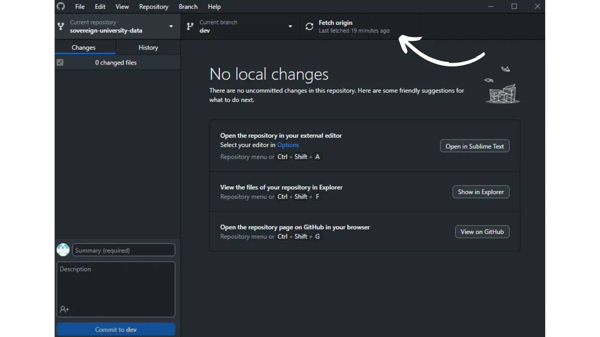
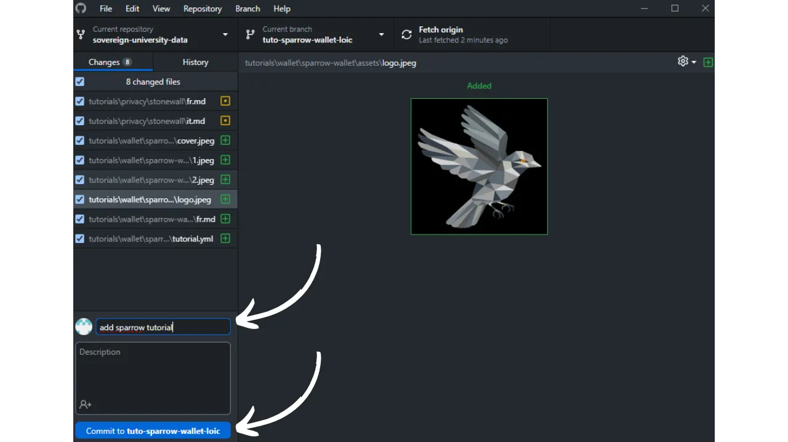

Before following this tutorial on adding a new tutorial, you must have completed some preliminary steps. If you haven't done so yet, I invite you to first consult this introductory tutorial, and then come back here:

https://planb.network/tutorials/contribution/content/write-tutorials-4d142a6a-9127-4ffb-9e0a-5aba29f169e2

You have already:
- Chosen the theme of your tutorial;
- Contacted the Plan ₿ Network team via [the Telegram group](https://t.me/PlanBNetwork_ContentBuilder) or paolo@planb.network;
- Chosen your contribution tools.

In this tutorial, we will see how to add your tutorial on Plan ₿ Network by setting up your local environment with GitHub Desktop. If you are already proficient with Git, this very detailed tutorial might not be necessary for you. I would rather recommend consulting this other tutorial where I only present the main guidelines, without detailed step-by-step guidance:

- **Experienced users**:

https://planb.network/tutorials/contribution/content/write-tutorials-git-expert-0ce1e490-c28f-4c51-b7e0-9a6ac9728410

If you prefer not to set up your local environment, follow this other tutorial designed for beginners, where we make the changes directly via GitHub's web interface:

- **Beginners (web interface)**:

https://planb.network/tutorials/contribution/content/write-tutorials-github-web-beginner-e64f8fed-4c0b-4225-9ebb-7fc5f1c01a79

## Prerequisites

Software required to follow this tutorial:

- [GitHub Desktop](https://desktop.github.com/);
- A markdown file editor like [Obsidian](https://obsidian.md/);
- A code editor ([VSC](https://code.visualstudio.com/) or [Sublime Text](https://www.sublimetext.com/)).


Prerequisites before starting the tutorial:

- Have a [GitHub account](https://github.com/signup);
- Have a fork of the [Plan ₿ Network source repository](https://github.com/PlanB-Network/bitcoin-educational-content);
- Have [a professor profile on Plan ₿ Network](https://planb.network/professors) (only if you are proposing a complete tutorial).

If you need help obtaining these prerequisites, my other tutorials will assist you:


Once everything is in place and your local environment is properly set up with your own fork of the Plan ₿ Network, you can start adding the tutorial.

## 1 - Create a new branch

Open your browser and head to the page of your fork of the Plan ₿ Network repository. This is the fork you have established on GitHub. The URL of your fork should look like: `https://github.com/[your-username]/bitcoin-educational-content`:


Make sure you are on the main branch `dev` then click on the `Sync fork` button. If your fork is not up to date, GitHub will offer to update your branch. Proceed with this update. If, on the contrary, your branch is already up to date, GitHub will inform you:


Open the GitHub Desktop software and ensure that your fork is correctly selected in the upper left corner of the window:


Click on the `Fetch origin` button. If your local repository is already up to date, GitHub Desktop will not suggest any additional action. Otherwise, the `Pull origin` option will appear. Click on this button to update your local repository:



Verify that you are indeed on the main branch `dev`:


Click on this branch, then click on the `New Branch` button:


Ensure that the new branch is based on the source repository, namely `PlanB-Network/bitcoin-educational-content`.

Name your branch in a way that the title is clear about its purpose, using dashes to separate each word. For example, let's say our goal is to write a tutorial on using the Sparrow Wallet software. In this case, the working branch dedicated to writing this tutorial could be named: `tuto-sparrow-wallet-loic`. Once the appropriate name is entered, click on `Create branch` to confirm the creation of the branch:


Now click on the `Publish branch` button to save your new working branch to your online fork on GitHub:

Now, on GitHub Desktop, you should find yourself on your new branch. This means that all changes made locally on your computer will be exclusively saved on this specific branch. Also, as long as this branch remains selected on GitHub Desktop, the files visible locally on your machine correspond to those of this branch (`tuto-sparrow-wallet-loic`), and not to those of the main branch (`dev`).


For each new article you wish to publish, you will need to create a new branch from `dev`. A branch in Git is a parallel version of the project, which allows you to make changes without affecting the main branch, until the work is ready to be merged.

## 2 - Adding the tutorial files

Now that the working branch is created, it's time to integrate your new tutorial. You have two options: use my Python script, which automates the creation of the necessary documents, or manually create each file. We will look at the steps to follow for each option.

### With my Python script

You need to install on your machine:
- Python 3.8 or higher.

To use the script, navigate to the folder where it is stored. The script is located in the Plan ₿ Network data repository at the path: `bitcoin-educational-content/scripts/tutorial-related/data-creator`.

Once in the folder, install the dependencies:

```
pip install -r requirements.txt
```

Then launch the software with the command:

```
python3 main.py
```

A graphical user interface (GUI) will open. The first time, you will need to enter all the necessary information, but in subsequent uses, the script will remember your personal information, so you won’t have to enter it again.


Start by entering the local path to the `/tutorials` folder in your cloned repository (`.../bitcoin-educational-content/tutorials/`). You can enter it manually or click the "Browse" button to navigate using your file explorer.


Select the language in which you will write your tutorial.


In the "Contributor's GitHub ID" field, enter your GitHub username.


Next, you need to fill in your professor profile. There are several options available to you:
- Enter the first letters of your name in the "Professor Name" field. Your name will then appear in the "Prof. Suggestions" dropdown list below. Select it by clicking on it;
- Alternatively, you can directly click on the "Prof. Suggestions" dropdown list and choose your professor name.

This action will automatically fill in your professor UUID in the corresponding field.


If you don’t have a professor profile yet, check out this tutorial:

https://planb.network/tutorials/contribution/others/create-teacher-profile-8ba9ba49-8fac-437a-a435-c38eebc8f8a4

Then click the "New Tutorial" button.


Choose a main category for your tutorial. Then, select a relevant subcategory based on your chosen main category.


Determine the difficulty level of the tutorial.


Choose a name for the directory created specifically for your tutorial. The name of this folder should reflect the software covered in the tutorial, using hyphens to separate words. For example, the folder could be named `red-wallet`:


The `project_id` is the UUID of the company or organization behind the tool covered in the tutorial, available [in the list of projects](https://github.com/PlanB-Network/bitcoin-educational-content/tree/dev/resources/projects). For example, for a tutorial on Sparrow Wallet, you can find its `project_id` in the file: `bitcoin-educational-content/resources/projects/sparrow/project.yml`. This information is added to your tutorial's YAML file because Plan ₿ Network maintains a database of companies and organizations active in Bitcoin or related projects. By adding the associated `project_id`, you link your content to the relevant entity.

***Update:*** In the new version of the script, you no longer need to manually enter the `project_id`. A search function has been added to find the project by name and automatically retrieve the corresponding `project_id`. Type the beginning of the project’s name in the "Project Name" field to search for it, then select the desired company from the dropdown menu. The `project_id` will be automatically populated in the field below. You can also enter it manually if needed.


For tags, select 2 or 3 relevant keywords related to your tutorial content, choosing exclusively from [the Plan ₿ Network tag list](https://github.com/PlanB-Network/bitcoin-educational-content/blob/dev/docs/50-planb-tags.md). The software also provides a keyword search function with a dropdown list.


Once all the information has been entered and verified, click "Create Tutorial" to confirm the creation of your tutorial files. This will generate your tutorial folder and all necessary files in the selected category locally.


You can now skip the subsection "Without my Python script" as well as step 3, "Fill in the YAML file," since the script has already completed these actions for you. Proceed directly to step 4 and start writing your tutorial.

For more information about this Python script, you can also check out the [README](https://github.com/PlanB-Network/bitcoin-educational-content/blob/dev/scripts/tutorial-related/new-tutorial-creation/README.md).

### Without my Python script

Open your file manager and navigate to the `bitcoin-educational-content` folder, which represents the local clone of your repository. You should typically find it under `Documents\GitHub\bitcoin-educational-content`.

Within this directory, you will need to locate the appropriate subfolder for placing your tutorial. The folder organization reflects the different sections of the Plan ₿ Network website. In our example, since we want to add a tutorial about Sparrow Wallet, we should navigate to the following path: `bitcoin-educational-content\tutorials\wallet`, which corresponds to the `WALLET` section on the website:


Within the `wallet` folder, you need to create a new directory specifically dedicated to your tutorial. The name of this folder should evoke the software covered in the tutorial, making sure to connect words with dashes. For my example, the folder will be titled `sparrow-wallet`:


In this new sub-folder dedicated to your tutorial, several elements need to be added:
- Create an `assets` folder, intended to receive all the illustrations necessary for your tutorial;
- Within this `assets` folder, you need to create a sub-folder named according to the original language code of the tutorial. For example, if the tutorial is written in English, this sub-folder must be named `en`. Place all the visuals of the tutorial there (diagrams, images, screenshots, etc.).
- A `tutorial.yml` file must be created to record the details related to your tutorial;
- A markdown format file is to be created to write the actual content of your tutorial. This file must be titled according to the language code of the writing. For example, for a tutorial written in French, the file must be called `fr.md`.


To summarize, here is the hierarchy of files to create:

```
bitcoin-educational-content/
└── tutorials/
    └── wallet/ (to be modified with the correct category)
        └── sparrow-wallet/ (to be modified with the name of the tutorial)
            ├── assets/
            │   ├── en/ (to be modified according to the appropriate language code)
            ├── tutorial.yml
            └── en.md (to be modified according to the appropriate language code)
```

## 3 - Fill in the YAML file

Fill in the `tutorial.yml` file by copying the following template:

```
id: 

project_id: 

tags:
  - 
  - 
  - 

category: 

level: 

professor_id:

# Proofreading metadata

original_language:
proofreading:
  - language: 
    last_contribution_date:
    urgency:
    contributor_names:
      - 
    reward:
```

Here are the required fields:

- **id** : A UUID (_Universally Unique Identifier_) that uniquely identifies the tutorial. You can generate it using [an online tool](https://www.uuidgenerator.net/version4). The only requirement is that this UUID is random to avoid conflicts with another UUID on the platform;

- **project_id** : The UUID of the company or organization behind the tool presented in the tutorial [from the project list](https://github.com/PlanB-Network/bitcoin-educational-content/tree/dev/resources/projects). For example, if you are creating a tutorial about the Green Wallet software, you can find this `project_id` in the following file: `bitcoin-educational-content/resources/projects/blockstream/project.yml`. This information is added to your tutorial's YAML file because Plan ₿ Network maintains a database of all companies and organizations operating on Bitcoin or related projects. By adding the `project_id` of the entity linked to your tutorial, you create a link between the two elements;

- **tags** : 2 or 3 relevant keywords related to the tutorial content, exclusively chosen [from the Plan ₿ Network tag list](https://github.com/PlanB-Network/bitcoin-educational-content/blob/dev/docs/50-planb-tags.md);

- **category** : The sub-category corresponding to the tutorial content, according to the Plan ₿ Network website structure (for example, for wallets: `desktop`, `hardware`, `mobile`, `backup`);

- **level** : The difficulty level of the tutorial, chosen from:
    - `beginner`
    - `intermediate`
    - `advanced`
    - `expert`

- **professor_id** : Your `professor_id` (UUID) as displayed on [your professor profile](https://github.com/PlanB-Network/bitcoin-educational-content/tree/dev/professors);

- **original_language** : The original language of the tutorial (e.g., `fr`, `en`, etc.);

- **proofreading** : Information about the proofreading process. Complete the first part, as proofreading your own tutorial counts as a first validation:
    - **language** : Language code of the proofreading (e.g., `fr`, `en`, etc.).
    - **last_contribution_date** : Date of the day.
    - **urgency** : 1
    - **contributor_names** : Your GitHub ID.
    - **reward** : 0

For more details on your teacher ID, please refer to the corresponding tutorial :

https://planb.network/tutorials/contribution/others/create-teacher-profile-8ba9ba49-8fac-437a-a435-c38eebc8f8a4

```
id: e84edaa9-fb65-48c1-a357-8a5f27996143

project_id: 3b2f45e6-d612-412c-95ba-cf65b49aa5b8

tags:
  - wallets
  - software
  - keys

category: mobile

level: beginner

professor_id: 6516474c-c190-41f2-b2ab-3d452ce7bdf0

# Proofreading metadata

original_language: fr
proofreading:
  - language: fr
    last_contribution_date: 2024-11-20
    urgency: 1
    contributor_names:
      - LoicPandul
    reward: 0
```

Once you have finished modifying your `tutorial.yml` file, save your document by clicking on `File > Save`:


You can now close your code editor.

## 4 - Fill in the Markdown File

Now, you can open your file that will host your tutorial, named with the code of your language, such as `fr.md`. Go to Obsidian, on the left side of the window, scroll through the folder tree until you find the folder of your tutorial and the file you are looking for:


Click on the file to open it:


We will start by filling in the `Properties` section at the top of the document.


Manually add and fill in the following code block:

```
---
name: [Title]
description: [Description]
---
```


Fill in the name of your tutorial and a short description of it:


Then, add the path of the cover image at the beginning of your tutorial. To do this, note:

```

```

This syntax will be useful whenever adding an image to your tutorial is necessary. The exclamation point indicates that it is an image, with the alternative text (alt) specified between the brackets. The path to the image is indicated between the parentheses:


## 5 - Add the Logo and Cover

Within the `assets` folder, you must add a file named `logo.webp`, which will serve as a thumbnail for your article. This image must be in `.webp` format and must respect a square dimension to harmonize with the user interface. You are free to choose the logo of the software covered in the tutorial or any other relevant image, provided that it is free of rights. In addition, also add an image titled `cover.webp` in the same place. This image will be displayed at the top of your tutorial. Ensure that this image, like the logo, respects usage rights and is suitable for the context of your tutorial:
## 6 - Writing the Tutorial and Adding Visuals

Continue writing your tutorial by drafting your content. When you want to integrate a subtitle, apply the appropriate markdown formatting by prefixing the text with `##`:


The language subfolder in the `assets` folder is used to store diagrams and visuals that will accompany your tutorial. As much as possible, avoid including text in your images to make your content accessible to an international audience. Of course, the software being presented will contain text, but if you add diagrams or additional indications on software screenshots, do so without text or, if it proves indispensable, use English.


To name your images, simply use numbers corresponding to their order of appearance in the tutorial, formatted with two digits (or three digits if your tutorial contains more than 99 images). For example, name your first image `01.webp`, your second `02.webp`, and so on.

Your images must be in `.webp` format exclusively. If needed, you can use [my image conversion software](https://github.com/LoicPandul/ImagesConverter).


To insert a diagram into your document, use the following Markdown command, making sure to specify the appropriate alternative text as well as the correct path of the image:

```

```

The exclamation point at the beginning indicates that it is an image. The alternative text, which aids in accessibility and SEO, is placed between the brackets. Finally, the path to the image is indicated between the parentheses.

If you wish to create your own diagrams, make sure to adhere to the graphic charter of Plan ₿ Network to ensure visual consistency:
- **Font**: Use [Rubik](https://fonts.google.com/specimen/Rubik);
- **Colors**:
	- Orange: #FF5C00
	- Black: #000000
	- White: #FFFFFF

**It is imperative that all visuals integrated into your tutorials are free of rights or respect the license of the source file**. Also, all diagrams published on Plan ₿ Network are made available under the CC-BY-SA license, in the same way as the text.
**-> Tip:** When sharing files publicly, such as images, it's important to remove any unnecessary metadata. This can contain sensitive information, like location data, creation dates, or details about the author. To protect your privacy, it's advisable to delete this metadata. To simplify this process, you can use specialized tools like [Exif Cleaner](https://exifcleaner.com/), which allows for the cleaning of a document's metadata through a simple drag-and-drop.
## 7 - Save and Submit the Tutorial

Once you have finished writing your tutorial in the language of your choice, the next step is to submit a **Pull Request**. The administrator will then take care of adding any missing translations of your tutorial, thanks to our automated translation method with human review.

To proceed with the Pull Request, open the GitHub Desktop software. The software should automatically detect the changes you have made locally on your branch compared to the original repository. Before continuing, carefully check on the left side of the interface that these changes match what you expected:


Add a title for your commit, then click on the blue `Commit to [your branch]` button to validate these changes:



A commit is a save of the changes made to the branch, accompanied by a descriptive message, allowing to follow the evolution of a project over time. It's sort of an intermediate checkpoint.

Then click on the `Push origin` button. This will send your commit to your fork:


If you haven't finished your tutorial, you can come back to it later and make new commits. If you have completed your changes for this branch, click now on the `Preview Pull Request` button:


You can check one last time that your modifications are correct, then click on the `Create pull request` button:


A Pull Request is a request made to integrate the changes from your branch to the main branch of the Plan ₿ Network repository, which allows for the review and discussion of the changes before their merger.

You will be automatically redirected to your browser on GitHub to the preparation page of your Pull Request:


Indicate a title that briefly summarizes the changes you wish to merge with the source repository. Add a brief comment describing these changes (if you have an issue number associated with the creation of your tutorial, remember to note in the comment `Closes #{issue number}`), then click on the green `Create pull request` button to confirm the merge request:


Your PR will then be visible in the `Pull Request` tab of the main Plan ₿ Network repository. All you have to do is wait until an administrator contacts you to confirm the merger of your contribution or to request any additional modifications.


After your PR has been merged with the main branch, it is recommended to delete your working branch (`tuto-sparrow-wallet`) to maintain a clean history on your fork. GitHub will automatically offer you this option on your PR page:


On the GitHub Desktop software, you can switch back to the main branch of your fork (`dev`).


If you wish to make changes to your contribution after you have already submitted your PR, the procedure depends on the current state of your PR:
- If your PR is still open and has not yet been merged, make the changes locally while staying on the same branch. Once the modifications are finalized, use the `Push origin` button to add a new commit to your still open PR;
- If your PR has already been merged with the main branch, you will need to start the process over by creating a new branch, then submitting a new PR. Ensure that your local repository is synchronized with the Plan ₿ Network source repository before proceeding.

If you encounter technical difficulties in submitting your tutorial, do not hesitate to ask for help on [our dedicated Telegram group for contributions](https://t.me/PlanBNetwork_ContentBuilder). Thank you!


