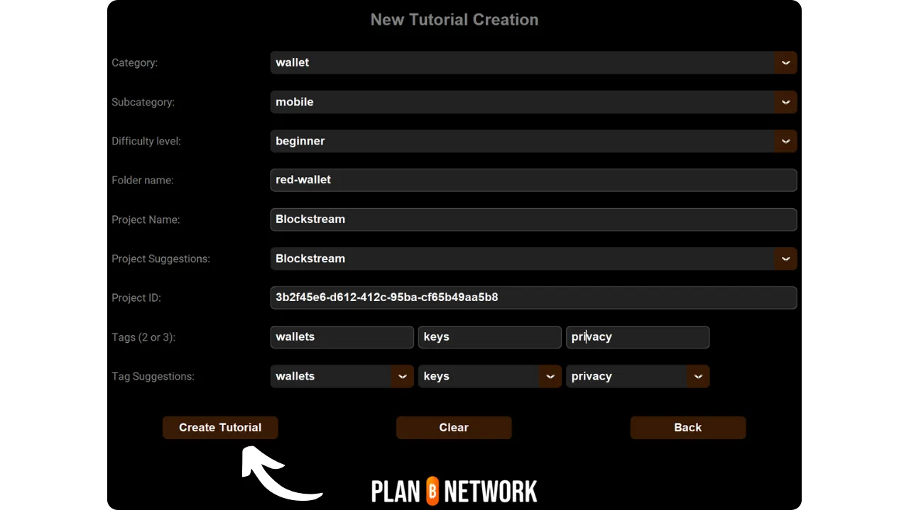

Antes de seguir este tutorial sobre cómo añadir un nuevo tutorial, debes haber completado algunos pasos preliminares. Si aún no lo has hecho, te invito a que primero consultes este tutorial introductorio y luego vuelvas aquí:

https://planb.network/tutorials/contribution/tutorial/write-tutorials-4d142a6a-9127-4ffb-9e0a-5aba29f169e2
Ya lo has hecho:


- Ha elegido el tema de su tutorial;
- Contacta con el equipo de Plan ₿ Network a través de [el grupo de Telegram](https://t.me/PlanBNetwork_ContentBuilder) o paolo@planb.network;
- Elige tus herramientas de contribución.

En este tutorial, veremos cómo añadir tu tutorial en Plan ₿ Network configurando tu entorno local con GitHub Desktop. Si ya dominas Git, puede que este tutorial tan detallado no sea necesario para ti. Más bien te recomendaría consultar este otro tutorial donde sólo presento las pautas principales, sin una guía detallada paso a paso:


- Usuarios con experiencia**:

https://planb.network/tutorials/contribution/tutorial/write-tutorials-git-expert-0ce1e490-c28f-4c51-b7e0-9a6ac9728410
Si prefieres no configurar tu entorno local, sigue este otro tutorial diseñado para principiantes, donde realizamos los cambios directamente a través de la interfaz web de GitHub:


- Principiantes (interfaz web)**:

https://planb.network/tutorials/contribution/tutorial/write-tutorials-github-web-beginner-e64f8fed-4c0b-4225-9ebb-7fc5f1c01a79
## Requisitos previos

Software necesario para seguir este tutorial:


- [GitHub Desktop](https://desktop.github.com/);
- Un editor de archivos markdown como [Obsidian](https://obsidian.md/);
- Un editor de código ([VSC](https://code.visualstudio.com/) o [Sublime Text](https://www.sublimetext.com/)).


Requisitos previos antes de empezar el tutorial:


- Tener una [cuenta GitHub](https://github.com/signup);
- Disponga de un fork del [Plan ₿ Network source repository](https://github.com/PlanB-Network/bitcoin-educational-content);
- Tener [un perfil de profesor en Plan ₿ Network](https://planb.network/professors) (sólo si propone una tutoría completa).

Si necesitas ayuda para obtener estos requisitos previos, mis otros tutoriales te ayudarán:

https://planb.network/tutorials/others/contribution/basics-of-github-471f7f00-8b5a-4b63-abb1-f1528b032bbb
Una vez que todo está en su lugar y su entorno local está configurado correctamente con su propio tenedor del Plan ₿ Red, puede empezar a añadir el tutorial.


## 1 - Crear una nueva sucursal

Abre tu navegador y dirígete a la página de tu fork del repositorio Plan ₿ Network. Esta es la bifurcación que has establecido en GitHub. La URL de tu bifurcación debería parecerse a: `https://github.com/[tu-nombre-deusuario]/bitcoin-educational-content`:


Asegúrate de que estás en la rama principal `dev` y haz clic en el botón `Sync fork`. Si tu rama no está actualizada, GitHub te ofrecerá actualizarla. Procede con esta actualización. Si, por el contrario, tu rama ya está actualizada, GitHub te informará:


Abra el software GitHub Desktop y asegúrese de que su bifurcación está correctamente seleccionada en la esquina superior izquierda de la ventana:


Haz clic en el botón `Fetch origin`. Si tu repositorio local ya está actualizado, GitHub Desktop no te sugerirá ninguna acción adicional. En caso contrario, aparecerá la opción `Obtener origen`. Haz clic en este botón para actualizar tu repositorio local:


Compruebe que se encuentra en la rama principal `dev`:


Haga clic en esta rama y, a continuación, en el botón `Nueva rama`:


Asegúrese de que la nueva rama se basa en el repositorio fuente, a saber, `PlanB-Network/bitcoin-educational-content`.

Nombra tu rama de forma que el título deje claro su objetivo, utilizando guiones para separar cada palabra. Por ejemplo, digamos que nuestro objetivo es escribir un tutorial sobre el uso del software Sparrow Wallet. En este caso, la rama de trabajo dedicada a escribir este tutorial podría llamarse: `tuto-sparrow-wallet-loic`. Una vez introducido el nombre apropiado, haga clic en `Crear rama` para confirmar la creación de la rama:


Ahora haz clic en el botón `Publish branch` para guardar tu nueva rama de trabajo en tu fork online en GitHub:


Ahora, en GitHub Desktop, deberías encontrarte en tu nueva rama. Esto significa que todos los cambios realizados localmente en tu ordenador se guardarán exclusivamente en esta rama específica. Además, mientras esta rama permanezca seleccionada en GitHub Desktop, los archivos visibles localmente en tu máquina corresponderán a los de esta rama (`tuto-sparrow-wallet-loic`), y no a los de la rama principal (`dev`).


Para cada nuevo artículo que desee publicar, deberá crear una nueva rama a partir de `dev`. Una rama en Git es una versión paralela del proyecto, que te permite hacer cambios sin afectar a la rama principal, hasta que el trabajo esté listo para ser fusionado.

## 2 - Añadir los archivos del tutorial

Ahora que la rama de trabajo está creada, es hora de integrar tu nuevo tutorial. Tienes dos opciones: utilizar mi script de Python, que automatiza la creación de los documentos necesarios, o crear manualmente cada archivo. Vamos a ver los pasos a seguir para cada opción.

### Con mi script Python

Es necesario instalar en su máquina:


- Python 3.8 o superior.

Para utilizar el script, navegue hasta la carpeta donde está almacenado. El script se encuentra en el repositorio de datos Plan ₿ Network en la ruta: `bitcoin-educational-content/scripts/tutorial-related/data-creator`.

Una vez en la carpeta, instala las dependencias:

```
pip install -r requirements.txt
```

A continuación, inicie el software con el comando

```
python3 main.py
```

Se abrirá una interfaz gráfica de usuario (GUI). La primera vez, tendrás que introducir toda la información necesaria, pero en usos posteriores, el script recordará tu información personal, por lo que no tendrás que volver a introducirla.


Comienza introduciendo la ruta local a la carpeta `/tutorials` de tu repositorio clonado (`.../bitcoin-educational-content/tutorials/`). Puedes introducirla manualmente o hacer clic en el botón "Examinar" para navegar utilizando tu explorador de archivos.


Seleccione el idioma en el que escribirá su tutorial.


En el campo "ID de GitHub del colaborador", introduzca su nombre de usuario de GitHub.


En el campo "ID del profesor PBN", introduzca su identificador utilizando palabras de la lista BIP39, tal y como aparece en [su perfil de profesor](https://github.com/PlanB-Network/bitcoin-educational-content/tree/dev/professors).


Si aún no tienes un perfil de profesor, consulta este tutorial:

https://planb.network/tutorials/contribution/others/create-teacher-profile-8ba9ba49-8fac-437a-a435-c38eebc8f8a4
A continuación, haga clic en el botón "Nuevo tutorial".


Elija una categoría principal para su tutorial. A continuación, seleccione una subcategoría relevante basada en la categoría principal elegida.


Determine el nivel de dificultad del tutorial.


Elija un nombre para el directorio creado específicamente para su tutorial. El nombre de esta carpeta debe reflejar el software cubierto en el tutorial, utilizando guiones para separar las palabras. Por ejemplo, la carpeta podría llamarse `red-wallet`:


El `project_id` es el UUID de la empresa u organización que está detrás de la herramienta tratada en el tutorial, disponible [en la lista de proyectos](https://github.com/PlanB-Network/bitcoin-educational-content/tree/dev/resources/projects). Por ejemplo, para un tutorial sobre Sparrow Wallet, puedes encontrar su `project_id` en el archivo: `bitcoin-educational-content/resources/projects/sparrow/project.yml`. Esta información se añade al archivo YAML de su tutorial porque Plan ₿ Network mantiene una base de datos de empresas y organizaciones activas en Bitcoin o proyectos relacionados. Añadiendo el `project_id` asociado, vinculas tu contenido a la entidad relevante.

***Actualización:*** En la nueva versión del script, ya no es necesario introducir manualmente el `project_id`. Se ha añadido una función de búsqueda para encontrar el proyecto por su nombre y recuperar automáticamente el `project_id` correspondiente. Escriba el principio del nombre del proyecto en el campo "Nombre del proyecto" para buscarlo y, a continuación, seleccione la empresa deseada en el menú desplegable. El `project_id` se rellenará automáticamente en el campo inferior. También puede introducirlo manualmente si lo necesita.


Para las etiquetas, seleccione 2 o 3 palabras clave relevantes relacionadas con el contenido de su tutorial, eligiendo exclusivamente de [la lista de etiquetas Plan ₿ Network](https://github.com/PlanB-Network/bitcoin-educational-content/blob/dev/docs/50-planb-tags.md). El software también ofrece una función de búsqueda de palabras clave con una lista desplegable.


Una vez introducida y verificada toda la información, haga clic en "Crear tutorial" para confirmar la creación de los archivos de su tutorial. Esto generará localmente su carpeta tutorial y todos los archivos necesarios en la categoría seleccionada.



Ahora puedes saltarte la subsección "Sin mi script Python" así como el paso 3, "Rellenar el archivo YAML", ya que el script ya ha completado estas acciones por ti. Proceda directamente al paso 4 y comience a escribir su tutorial.

Para más información sobre este script de Python, también puede consultar el [README](https://github.com/PlanB-Network/bitcoin-educational-content/blob/dev/scripts/tutorial-related/new-tutorial-creation/README.md).

### Sin mi script Python

Abre tu gestor de archivos y navega hasta la carpeta `bitcoin-educational-content`, que representa el clon local de tu repositorio. Normalmente la encontrarás en `Documents\GitHub\bitcoin-educational-content`.

Dentro de este directorio, deberá localizar la subcarpeta adecuada para colocar su tutorial. La organización de la carpeta refleja las diferentes secciones del sitio web de Plan ₿ Network. En nuestro ejemplo, ya que queremos añadir un tutorial sobre Sparrow Wallet, debemos navegar a la siguiente ruta: `bitcoin-educational-content\tutorials\wallet`, que corresponde a la sección `WALLET` del sitio web:


Dentro de la carpeta `wallet`, necesitas crear un nuevo directorio específicamente dedicado a tu tutorial. El nombre de esta carpeta debe evocar el software cubierto en el tutorial, asegurándose de conectar las palabras con guiones. En mi ejemplo, la carpeta se llamará `sparrow-wallet`:


En esta nueva subcarpeta dedicada a su tutorial, hay que añadir varios elementos:


- Cree una carpeta `assets`, destinada a recibir todas las ilustraciones necesarias para su tutorial;
- Dentro de esta carpeta `assets`, debe crear una subcarpeta con el nombre del código del idioma original del tutorial. Por ejemplo, si el tutorial está escrito en inglés, esta subcarpeta debe llamarse `en`. Coloque allí todos los elementos visuales del tutorial (diagramas, imágenes, capturas de pantalla, etc.).
- Debe crearse un archivo `tutorial.yml` para registrar los detalles relacionados con su tutorial;
- Se debe crear un archivo en formato markdown para escribir el contenido real de su tutorial. Este archivo debe titularse según el código del idioma en el que se escriba. Por ejemplo, para un tutorial escrito en francés, el archivo debe llamarse `fr.md`.


En resumen, ésta es la jerarquía de archivos que hay que crear:

```
bitcoin-educational-content/
└── tutorials/
└── wallet/ (to be modified with the correct category)
└── sparrow-wallet/ (to be modified with the name of the tutorial)
├── assets/
│   ├── en/ (to be modified according to the appropriate language code)
├── tutorial.yml
└── en.md (to be modified according to the appropriate language code)
```

## 3 - Rellene el archivo YAML

Rellene el archivo `tutorial.yml` copiando la siguiente plantilla:

```
id:
project_id:
tags:
-
-
-
category:
level:
credits:
professor:
# Proofreading metadata
original_language:
proofreading:
- language:
last_contribution_date:
urgency:
contributors_id:
-
reward:
```

A continuación se detallan los campos obligatorios:


- id**: Un UUID (_Universally Unique Identifier_) para identificar de forma única el tutorial. Puede generarlo con [una herramienta en línea](https://www.uuidgenerator.net/version4). El único requisito es que este UUID sea aleatorio para evitar conflictos con otro UUID de la plataforma;
- project_id**: El UUID de la empresa u organización que está detrás de la herramienta presentada en el tutorial [de la lista de proyectos](https://github.com/PlanB-Network/bitcoin-educational-content/tree/dev/resources/projects). Por ejemplo, si está creando un tutorial sobre el software Sparrow Wallet, puede encontrar este `project_id` en el siguiente archivo: `bitcoin-educational-content/resources/projects/sparrow/project.yml`. Esta información se añade al archivo YAML de su tutorial porque Plan ₿ Network mantiene una base de datos de todas las empresas y organizaciones que operan en Bitcoin o proyectos relacionados. Al añadir el `project_id` de la entidad relacionada con su tutorial, se crea un vínculo entre los dos elementos;
- etiquetas**: 2 o 3 palabras clave relevantes relacionadas con el contenido del tutorial, elegidas exclusivamente [de la lista de etiquetas del Plan ₿ Red](https://github.com/PlanB-Network/bitcoin-educational-content/blob/dev/docs/50-planb-tags.md);
- categoría**: La subcategoría correspondiente al contenido del tutorial, según la estructura del sitio Plan ₿ Network (por ejemplo para carteras: `desktop`, `hardware`, `mobile`, `backup`);
- nivel**: El nivel de dificultad del tutorial, entre:
    - principiante
    - `intermedio`
    - `avanzado`
    - `experto`
- profesor**: Su `contributor_id` (palabras BIP39) tal y como aparece en [su perfil de profesor](https://github.com/PlanB-Network/bitcoin-educational-content/tree/dev/professors);
- idioma_original**: El idioma original del tutorial (por ejemplo `fr`, `en`, etc.);
- corrección de pruebas**: Información sobre el proceso de corrección. Rellene la primera parte, ya que la corrección de su propio tutorial cuenta como primera validación:
    - idioma**: Código de idioma de la corrección (por ejemplo `fr`, `en`, etc.).
    - fecha_última_contribución**: La fecha de hoy.
    - urgencia**: Dejar en blanco.
    - contributors_id**: Tu ID de GitHub.
    - recompensa**: Dejar en blanco.

Para más detalles sobre su identificador de profesor, consulte el tutorial correspondiente:

https://planb.network/tutorials/contribution/others/create-teacher-profile-8ba9ba49-8fac-437a-a435-c38eebc8f8a4
Este es un ejemplo de un archivo `tutorial.yml` completo para un tutorial sobre el monedero Blockstream Green:

```
id: e84edaa9-fb65-48c1-a357-8a5f27996143
project_id: 3b2f45e6-d612-412c-95ba-cf65b49aa5b8
tags:
- wallets
- software
- keys
category: mobile
level: beginner
credits:
professor: pretty-private
# Proofreading metadata
original_language: fr
proofreading:
- language: fr
last_contribution_date: 2024-11-20
urgency: 1
contributors_id:
- LoicPandul
reward: 0
```

Una vez que haya terminado de modificar su archivo `tutorial.yml`, guarde su documento haciendo clic en `Archivo > Guardar`:


Ahora puede cerrar el editor de código.

## 4 - Rellenar el archivo Markdown

Ahora, puedes abrir el archivo que alojará tu tutorial, nombrado con el código de tu idioma, como `fr.md`. Ve a Obsidian, en la parte izquierda de la ventana, desplázate por el árbol de carpetas hasta que encuentres la carpeta de tu tutorial y el archivo que estás buscando:


Haz clic en el archivo para abrirlo:


Empezaremos rellenando la sección `Propiedades` de la parte superior del documento.


Añada y rellene manualmente el siguiente bloque de código:

```
---
name: [Title]
description: [Description]
---
```


Escriba el nombre de su tutorial y una breve descripción del mismo:


A continuación, añada la ruta de la imagen de portada al principio de su tutorial. Para ello, tenga en cuenta:

```

```

Esta sintaxis le será útil siempre que sea necesario añadir una imagen a su tutorial. El signo de exclamación indica que se trata de una imagen, con el texto alternativo (alt) especificado entre los corchetes. La ruta a la imagen se indica entre los paréntesis:


## 5 - Añadir el logotipo y la portada

Dentro de la carpeta `assets`, debe añadir un archivo llamado `logo.webp`, que servirá como miniatura de su artículo. Esta imagen debe estar en formato `.webp` y debe respetar una dimensión cuadrada para armonizar con la interfaz de usuario. Puede elegir libremente el logotipo del software tratado en el tutorial o cualquier otra imagen pertinente, siempre que esté libre de derechos. Además, añada también una imagen titulada `cover.webp` en el mismo lugar. Esta imagen se mostrará en la parte superior del tutorial. Asegúrese de que esta imagen, al igual que el logotipo, respeta los derechos de uso y es adecuada para el contexto de su tutorial:

## 6 - Escribir el tutorial y añadir elementos visuales

Continúe escribiendo su tutorial redactando el contenido. Cuando desee integrar un subtítulo, aplique el formato markdown adecuado anteponiendo al texto el prefijo `##`:


La subcarpeta de idiomas de la carpeta `assets` se utiliza para almacenar los diagramas y elementos visuales que acompañarán a su tutorial. En la medida de lo posible, evite incluir texto en sus imágenes para que su contenido sea accesible a un público internacional. Por supuesto, el software que se presenta contendrá texto, pero si añade diagramas o indicaciones adicionales en las capturas de pantalla del software, hágalo sin texto o, si resulta imprescindible, utilícelo en inglés.


Para nombrar sus imágenes, utilice simplemente los números correspondientes a su orden de aparición en el tutorial, formateados con dos dígitos (o tres dígitos si su tutorial contiene más de 99 imágenes). Por ejemplo, llame a su primera imagen `01.webp`, a la segunda `02.webp`, y así sucesivamente.

Tus imágenes deben estar exclusivamente en formato `.webp`. Si es necesario, puede utilizar [mi software de conversión de imágenes](https://github.com/LoicPandul/ImagesConverter).


Para insertar un diagrama en su documento, utilice el siguiente comando Markdown, asegurándose de especificar el texto alternativo apropiado, así como la ruta correcta de la imagen:

```

```

El signo de exclamación al principio indica que se trata de una imagen. El texto alternativo, que ayuda a la accesibilidad y al SEO, se coloca entre paréntesis. Por último, la ruta a la imagen se indica entre los paréntesis.

Si desea crear sus propios diagramas, asegúrese de respetar la carta gráfica del Plan ₿ Red para garantizar la coherencia visual:


- Fuente**: Utilice [Rubik](https://fonts.google.com/specimen/Rubik);
- Colores**:
 - Naranja: #FF5C00
 - Negro #000000
 - Blanco: #FFFFFF

**Es imprescindible que todos los elementos visuales integrados en sus tutoriales estén libres de derechos o respeten la licencia del archivo fuente**. Asimismo, todos los diagramas publicados en Plan ₿ Network están disponibles bajo licencia CC-BY-SA, del mismo modo que el texto.

**-> Consejo:** Al compartir archivos públicamente, como imágenes, es importante eliminar cualquier metadato innecesario. Estos pueden contener información sensible, como datos de localización, fechas de creación o detalles sobre el autor. Para proteger tu privacidad, es aconsejable eliminar estos metadatos. Para simplificar este proceso, puedes utilizar herramientas especializadas como [Exif Cleaner](https://exifcleaner.com/), que permite limpiar los metadatos de un documento con un simple arrastrar y soltar.

## 7 - Guardar y enviar el tutorial

Una vez que haya terminado de escribir su tutorial en el idioma de su elección, el siguiente paso es enviar una **Solicitud de extracción**. El administrador se encargará entonces de añadir las traducciones que falten de tu tutorial, gracias a nuestro método de traducción automática con revisión humana.

Para proceder con la Pull Request, abre el software GitHub Desktop. El software debería detectar automáticamente los cambios que has realizado localmente en tu rama en comparación con el repositorio original. Antes de continuar, comprueba cuidadosamente en la parte izquierda de la interfaz que estos cambios coinciden con lo que esperabas:


Añade un título a tu confirmación y haz clic en el botón azul `Commit to [your branch]` para validar los cambios:


Un commit es un almacenamiento de los cambios realizados en la rama, acompañados de un mensaje descriptivo, que permite seguir la evolución de un proyecto a lo largo del tiempo. Es una especie de punto de control intermedio.

A continuación, haga clic en el botón `Push origin`. Esto enviará tu commit a tu fork:


Si no has terminado tu tutorial, puedes volver a él más tarde y hacer nuevos commits. Si ha completado sus cambios para esta rama, haga clic ahora en el botón `Preview Pull Request`:


Puede comprobar una última vez que sus modificaciones son correctas y, a continuación, haga clic en el botón `Create pull request`:


Una Pull Request es una solicitud realizada para integrar los cambios de tu rama a la rama principal del repositorio Plan ₿ Network, lo que permite la revisión y discusión de los cambios antes de su fusión.

Se te redirigirá automáticamente a tu navegador en GitHub a la página de preparación de tu Pull Request:


Indica un título que resuma brevemente los cambios que deseas fusionar con el repositorio fuente. Añada un breve comentario que describa estos cambios (si tiene un número de incidencia asociado a la creación de su tutorial, recuerde anotar en el comentario `Closes #{issue number}`) y, a continuación, haga clic en el botón verde `Create pull request` para confirmar la solicitud de fusión:


A continuación, su RP estará visible en la pestaña `Pull Request` del repositorio principal Plan ₿ Network. Todo lo que tiene que hacer es esperar a que un administrador se ponga en contacto con usted para confirmar la fusión de su contribución o para solicitar cualquier modificación adicional.


Después de que su PR se haya fusionado con la rama principal, se recomienda eliminar su rama de trabajo (`tuto-sparrow-wallet`) para mantener un historial limpio en su bifurcación. GitHub le ofrecerá automáticamente esta opción en la página de su PR:


En el software de escritorio de GitHub, puedes volver a la rama principal de tu bifurcación (`dev`).


Si desea realizar cambios en su contribución después de haber presentado su RP, el procedimiento dependerá del estado actual de su RP:


- Si su PR sigue abierto y aún no se ha fusionado, realice los cambios localmente permaneciendo en la misma rama. Una vez finalizadas las modificaciones, utilice el botón `Push origin` para añadir un nuevo commit a su PR aún abierto;
- Si su PR ya ha sido fusionado con la rama principal, necesitará comenzar el proceso de nuevo creando una nueva rama y enviando un nuevo PR. Asegúrese de que su repositorio local está sincronizado con el repositorio fuente de Plan ₿ Network antes de continuar.

Si encuentras dificultades técnicas para enviar tu tutorial, no dudes en pedir ayuda en [nuestro grupo de Telegram dedicado a las contribuciones](https://t.me/PlanBNetwork_ContentBuilder). Muchas gracias

