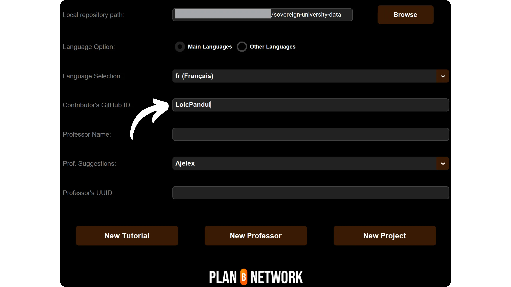
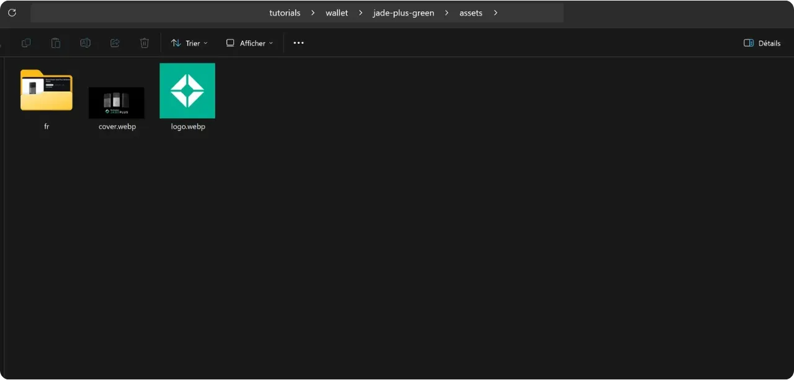

Enne selle uue õpetuse lisamise õpetuse järgimist peate olema teinud mõned eeltegevused. Kui te pole seda veel teinud, siis kutsun teid üles kõigepealt tutvuma selle sissejuhatava õpetusega ja seejärel tulema siia tagasi:

https://planb.network/tutorials/contribution/content/write-tutorials-4d142a6a-9127-4ffb-9e0a-5aba29f169e2
Te olete juba:


- Valige oma õpetuse teema;
- Võtke ühendust Plan ₿ Networki meeskonnaga [Telegrami grupi](https://t.me/PlanBNetwork_ContentBuilder) või paolo@planb.network kaudu;
- Valige oma panuse vahendid.

Selles õpetuses näeme, kuidas lisada oma õpetus Plan ₿ võrgustikku, luues oma lokaalse keskkonna GitHubi töölaua abil. Kui te juba oskate Git'i, ei pruugi see väga üksikasjalik õpetus teile vajalik olla. Ma soovitan pigem tutvuda selle teise õpetusega, kus ma esitan ainult peamised suunised, ilma üksikasjalike samm-sammuliste juhenditeta:


- Kogenud kasutajad**:

https://planb.network/tutorials/contribution/content/write-tutorials-git-expert-0ce1e490-c28f-4c51-b7e0-9a6ac9728410
Kui te ei soovi oma lokaalset keskkonda luua, järgige seda teist, algajatele mõeldud õpetust, kus me teeme muudatused otse GitHubi veebiliidese kaudu:


- Algajad (veebiliides)**:

https://planb.network/tutorials/contribution/content/write-tutorials-github-web-beginner-e64f8fed-4c0b-4225-9ebb-7fc5f1c01a79
## Eeltingimused

Selle õpetuse jälgimiseks vajalik tarkvara:


- [GitHub Desktop](https://desktop.github.com/);
- Markdown-failide redaktor nagu [Obsidian](https://obsidian.md/);
- Koodiredaktor ([VSC](https://code.visualstudio.com/) või [Sublime Text](https://www.sublimetext.com/)).


Eeltingimused enne õpetuse alustamist:


- Kas teil on [GitHubi konto](https://github.com/signup);
- On olemas [Plan ₿ Network source repository](https://github.com/PlanB-Network/bitcoin-educational-content);
- Omama [professori profiili Plan ₿ Network](https://planb.network/professors) (ainult juhul, kui te esitate täieliku õpetuse).

Kui vajate abi nende eelduste hankimisel, siis minu teised õpetused aitavad teid:

https://planb.network/tutorials/contribution/others/create-github-account-a75fc39d-f0d0-44dc-9cd5-cd94aee0c07c
Kui kõik on paigas ja teie kohalik keskkond on korralikult seadistatud koos oma Plan ₿ Networki haruga, võite alustada õpetuse lisamist.


## 1 - Uue haru loomine

Avage oma brauser ja suunduge Plan ₿ Networki repositooriumi hargnemise lehele. See on teie poolt GitHubis loodud haru. Teie hargnemise URL peaks välja nägema järgmiselt: `https://github.com/[teie-kasutajanimi]/bitcoin-õppematerjal`:


Veenduge, et olete põhiharul `dev`, seejärel klõpsake nupule `Sync fork`. Kui teie haru ei ole ajakohane, pakub GitHub teile oma haru uuendamist. Jätkake selle uuendamisega. Kui aga teie haru on juba ajakohane, teavitab GitHub teid sellest:


Avage GitHubi töölaua tarkvara ja veenduge, et teie haru on õigesti valitud akna vasakus ülanurgas:


Klõpsake nupul "Tooge päritolu". Kui teie kohalik repositoorium on juba ajakohane, ei paku GitHub Desktop mingeid lisategevusi. Vastasel juhul ilmub valik `Pull origin`. Klõpsake sellel nupul, et oma kohalikku repositooriumi uuendada:


Kontrollige, et olete tõepoolest peamisel harul `dev`:


Klõpsake sellel harul, seejärel klõpsake nupule "Uus haru":


Veenduge, et uus haru põhineb lähtematerjalide repositooriumil, nimelt `PlanB-Network/bitcoin-educational-content`.

Nimetage oma filiaal nii, et pealkirjast oleks selgelt näha selle eesmärk, kasutades iga sõna eraldamiseks mõttekriipsu. Ütleme näiteks, et meie eesmärk on kirjutada õpetus Sparrow Wallet tarkvara kasutamise kohta. Sellisel juhul võiks selle õpetuse kirjutamisele pühendatud tööharu nimetada: `tuto-sparrow-wallet-loic`. Kui sobiv nimi on sisestatud, klõpsake haru loomise kinnitamiseks nuppu `Create branch`:


Nüüd klõpsake nupule `Publish branch`, et salvestada oma uus tööharu GitHubi veebiharule:


Nüüd peaksite GitHubi töölaual leidma oma uue haru. See tähendab, et kõik teie arvutis lokaalselt tehtud muudatused salvestatakse ainult sellesse konkreetsesse harusse. Samuti, seni kuni see haru on GitHubi töölaual valitud, vastavad teie masinas lokaalselt nähtavad failid selle haru (`tuto-sparrow-wallet-loic`), mitte põhiharu (`dev`) failidele.


Iga uue artikli jaoks, mida soovite avaldada, peate looma uue haru `dev`st. Haru on Gitis projekti paralleelversioon, mis võimaldab teil teha muudatusi, ilma et see mõjutaks põhiharu, kuni töö on valmis ühendamiseks.

## 2 - Juhendfailide lisamine

Nüüd, kui tööharu on loodud, on aeg integreerida oma uus õpetus. Teil on kaks võimalust: kasutada minu Python-skripti, mis automatiseerib vajalike dokumentide loomise, või luua iga fail käsitsi. Vaatame mõlema võimaluse puhul järgitavaid samme.

### Minu Python skriptiga

Sa pead installima oma masinasse:


- Python 3.8 või uuem.

Skripti kasutamiseks navigeerige kausta, kus see on salvestatud. Skript asub teekonnal Plan ₿ Network data repository: `bitcoin-educational-content/scripts/tutorial-related/data-creator`.

Kui olete kaustas, installige sõltuvused:

```
pip install -r requirements.txt
```

Seejärel käivitage tarkvara käsuga:

```
python3 main.py
```

Avaneb graafiline kasutajaliides (GUI). Esimesel korral peate sisestama kogu vajaliku teabe, kuid järgnevatel kasutuskordadel jätab skript teie isikuandmed meelde, nii et te ei pea neid uuesti sisestama.


Alustage, sisestades oma kloonitud repositooriumi kausta `/tutorials` kohalik tee (`.../bitcoin-educational-content/tutorials/`). Võite selle käsitsi sisestada või klõpsata nupule "Browse", et navigeerida oma failiotsinguprogrammi abil.


Valige keel, milles te oma õpetuse kirjutate.


Sisestage väljale "Contributor's GitHub ID" oma GitHubi kasutajanimi.



Sisestage väljale "PBN-professori ID" oma identifikaator, kasutades sõnu BIP39 nimekirjast, nagu see on esitatud [teie professori profiilil](https://github.com/PlanB-Network/bitcoin-educational-content/tree/dev/professors).


Kui teil ei ole veel professori profiili, vaadake seda õpetust:

https://planb.network/tutorials/contribution/others/create-teacher-profile-8ba9ba49-8fac-437a-a435-c38eebc8f8a4
Seejärel klõpsake nupule "Uus õpetus".


Valige oma õpetuse jaoks põhikategooria. Seejärel valige valitud põhikategooriast lähtuvalt asjakohane alamkategooria.


Määrake õpetuse raskusaste.


Valige spetsiaalselt teie õpetuse jaoks loodud kataloogile nimi. Selle kausta nimi peaks kajastama õpetuses käsitletavat tarkvara, kasutades sõnade eraldamiseks sidekriipsu. Näiteks võiks kausta nimi olla `red-wallet`:


`project_id` on õpetuses käsitletava tööriista taga oleva ettevõtte või organisatsiooni UUID, mis on saadaval [projektide nimekirjas](https://github.com/PlanB-Network/bitcoin-educational-content/tree/dev/resources/projects). Näiteks Sparrow Wallet'i õpetuse puhul leiate selle `project_id` failist: `bitcoin-educational-content/resources/projects/sparrow/project.yml`. See teave lisatakse teie õpetuse YAML-faili, sest Plan ₿ Network haldab andmebaasi Bitcoini või sellega seotud projektidega tegelevate ettevõtete ja organisatsioonide kohta. Lisades seotud `project_id`, seote oma sisu vastava üksusega.

***Update:*** Skripti uues versioonis ei ole enam vaja käsitsi sisestada `project_id`. Lisatud on otsingufunktsioon, mis otsib projekti nime järgi ja hangib automaatselt vastava `project_id`. Projekti otsimiseks sisestage projekti nime algus väljale `Projekti nimi` ja valige seejärel rippmenüüst soovitud ettevõte. Projekti_id` täidetakse automaatselt allolevasse väljale. Vajaduse korral võite selle ka käsitsi sisestada.


Valige märksõnadeks 2 või 3 asjakohast märksõna, mis on seotud teie õpetuse sisuga, valides need eranditult [kava ₿ võrgu märksõnade loendist](https://github.com/PlanB-Network/bitcoin-educational-content/blob/dev/docs/50-planb-tags.md). Tarkvara pakub ka märksõnade otsingufunktsiooni ripploendist.


Kui kogu teave on sisestatud ja kontrollitud, klõpsake "Create Tutorial", et kinnitada oma õpetusfailide loomine. See loob teie õpetuskausta ja kõik vajalikud failid valitud kategoorias lokaalselt.


Nüüd võite vahele jätta alajaotuse "Ilma minu Python-skriptita" ning 3. sammu "YAML-faili täitmine", sest skript on need toimingud teie eest juba lõpetanud. Jätkake otse sammu 4 juurde ja alustage oma õpetuse kirjutamist.

Lisateavet selle Pythoni skripti kohta leiate ka [README](https://github.com/PlanB-Network/bitcoin-educational-content/blob/dev/scripts/tutorial-related/new-tutorial-creation/README.md).

### Ilma minu Python skriptita

Avage oma failihaldur ja navigeerige kausta `bitcoin-educational-content`, mis kujutab endast teie repositooriumi kohalikku klooni. Tavaliselt peaksite selle leidma aadressil `Documents\GitHub\bitcoin-educational-content`.

Selles kataloogis peate leidma sobiva alamkataloogi, kuhu paigutate oma õpetuse. Kaustade korraldus kajastab Plan ₿ Network veebilehe erinevaid jaotisi. Meie näites, kuna me tahame lisada õpetuse Sparrow Wallet'i kohta, peaksime navigeerima järgmisele teele: `bitcoin-educational-content\tutorials\wallet`, mis vastab veebisaidi jaotisele `WALLET`:


Kausta `wallet` sees tuleb luua uus kataloog, mis on spetsiaalselt pühendatud teie õpetusele. Selle kausta nimi peaks meenutama õpetuses käsitletavat tarkvara, ühendades sõnad kindlasti kriipsudega. Minu näite puhul saab kausta pealkirjaks `sparrow-wallet`:


Sellesse uude alamkataloogi, mis on pühendatud teie õpetusele, tuleb lisada mitu elementi:


- Looge kaust `assets`, mis on mõeldud kõigi teie õpetuse jaoks vajalike illustratsioonide jaoks;
- Selles kaustas `assets` tuleb luua alamkaust, mille nimi vastab õpetuse algsele keelekoodile. Näiteks kui õpetus on kirjutatud inglise keeles, peab selle alamkataloogi nimi olema `en`. Asetage sinna kõik õpetuse visuaalsed materjalid (diagrammid, pildid, ekraanipildid jne).
- Tuleb luua fail `tutorial.yml`, et salvestada oma õpetusega seotud üksikasjad;
- Markdown-vormingus fail tuleb luua, et kirjutada oma õpetuse tegelik sisu. See fail peab olema pealkirjastatud vastavalt kirjutamise keelekoodile. Näiteks prantsuse keeles kirjutatud õpetuse puhul peab faili nimi olema `fr.md`.


Kokkuvõttes on siin failide hierarhia, mida tuleb luua:

```
bitcoin-educational-content/
└── tutorials/
└── wallet/ (to be modified with the correct category)
└── sparrow-wallet/ (to be modified with the name of the tutorial)
├── assets/
│   ├── en/ (to be modified according to the appropriate language code)
├── tutorial.yml
└── en.md (to be modified according to the appropriate language code)
```

## 3 - Täitke YAML-faili

Täitke fail `tutorial.yml`, kopeerides järgmise malli:

```
id:
project_id:
tags:
-
-
-
category:
level:
credits:
professor:
# Proofreading metadata
original_language:
proofreading:
- language:
last_contribution_date:
urgency:
contributors_id:
-
reward:
```

Siin on esitatud andmed kohustuslike väljade kohta:


- id**: UUID (_Universally Universally Unique Identifier_), mis identifitseerib õpetuse üheselt. Selle saate genereerida [veebipõhise tööriistaga](https://www.uuidgenerator.net/version4). Ainus nõue on, et see UUID oleks juhuslik, et vältida konflikti mõne teise UUID-ga platvormil;
- project_id**: UUID: õpetuses esitatud tööriista taga oleva ettevõtte või organisatsiooni UUID [projektide nimekirjast](https://github.com/PlanB-Network/bitcoin-educational-content/tree/dev/resources/projects). Näiteks kui te loote õpetust Sparrow Wallet tarkvara kohta, leiate selle `project_id` järgmisest failist: `bitcoin-educational-content/resources/projects/sparrow/project.yml`. See teave lisatakse teie õpetuse YAML-faili, sest Plan ₿ Network haldab andmebaasi kõigi Bitcoini või sellega seotud projektidega tegelevate ettevõtete ja organisatsioonide kohta. Lisades `project_id` teie juhendmaterjaliga seotud üksuse, loote kahe elemendi vahel lingi;
- sildid**: 2 või 3 asjakohast märksõna, mis on seotud õpetuse sisuga ja mis on valitud eranditult [Plan ₿ Network'i siltide nimekirjast](https://github.com/PlanB-Network/bitcoin-educational-content/blob/dev/docs/50-planb-tags.md);
- kategooria**: Õpetuse sisule vastav alamkategooria vastavalt Plan ₿ Network saidi struktuurile (näiteks rahakottide puhul: `desktop`, `hardware`, `mobile`, `backup`);
- tase**: Õpetuse raskusaste:
    - "Algaja
    - "vahepealne
    - "Edasijõudnud
    - "ekspert
- professor**: Teie `contributor_id` (BIP39 sõnad), nagu on näidatud [teie professori profiilis](https://github.com/PlanB-Network/bitcoin-educational-content/tree/dev/professors);
- originaal_keel**: Õpetuse originaalkeel (näiteks `fr`, `en` jne);
- korrektuur**: Teave korrektuuriprotsessi kohta. Täitke esimene osa, sest teie enda juhendmaterjali korrektuur loetakse esimeseks kinnitamiseks:
    - keel**: Korrektuuri keelekood (näiteks `fr`, `en` jne).
    - viimane_makse_kuupäev**: Tänane kuupäev.
    - kiireloomulisus**: Jäta tühjaks.
    - toetajad_id**: Teie GitHub ID.
    - tasu**: Jäta tühjaks.

Lisateavet oma professori identifikaatori kohta leiate vastavast juhendmaterjalist:

https://planb.network/tutorials/contribution/others/create-teacher-profile-8ba9ba49-8fac-437a-a435-c38eebc8f8a4
Siin on näide valminud `tutorial.yml` failist Blockstream Green rahakoti õpetuse jaoks:

```
id: e84edaa9-fb65-48c1-a357-8a5f27996143
project_id: 3b2f45e6-d612-412c-95ba-cf65b49aa5b8
tags:
- wallets
- software
- keys
category: mobile
level: beginner
credits:
professor: pretty-private
# Proofreading metadata
original_language: fr
proofreading:
- language: fr
last_contribution_date: 2024-11-20
urgency: 1
contributors_id:
- LoicPandul
reward: 0
```

Kui olete lõpetanud oma faili `tutorial.yml` muutmise, salvestage oma dokument, klõpsates nupule `File > Save`:


Nüüd võite sulgeda koodiredaktori.

## 4 - Täitke Markdown-faili

Nüüd saate avada oma faili, mis hakkab teie õpetust sisaldama ja mille nimeks on teie keele kood, näiteks `fr.md`. Mine Obsidianisse, akna vasakul poolel keri läbi kaustapuu, kuni leiad oma õpetuse kausta ja faili, mida otsid:


Klõpsake faili avamiseks sellel:


Alustame dokumendi ülaosas oleva jaotise "Omadused" täitmisega.


Lisage käsitsi ja täitke järgmine koodiplokk:

```
---
name: [Title]
description: [Description]
---
```


Sisestage oma õpetuse nimi ja selle lühikirjeldus:


Seejärel lisage kaanepildi tee oma õpetuse algusesse. Selleks märkige:

```

```

See süntaks on kasulik alati, kui on vaja lisada pilt oma õpetusele. Hüüumärk näitab, et tegemist on pildiga, kusjuures alternatiivne tekst (alt) on määratud sulgude vahel. Sulgude vahel on märgitud pildi tee:


## 5 - Logo ja kaane lisamine

Kausta `assets` sisse tuleb lisada fail nimega `logo.webp`, mis on teie artikli pisipildiks. See pilt peab olema `.webp` formaadis ja peab vastama ruudukujulisele mõõtmele, et see sobiks kasutajaliidesega. Te võite vabalt valida õpetuses käsitletava tarkvara logo või mõne muu asjakohase pildi, tingimusel et see on õiguste vaba. Lisaks lisage samasse kohta ka pilt pealkirjaga `cover.webp`. See pilt kuvatakse teie õpetuse ülaosas. Veenduge, et see pilt, nagu ka logo, järgib kasutusõigusi ja sobib teie õpetuse konteksti:

## 6 - Tutoriali kirjutamine ja visuaalide lisamine

Jätkake oma õpetuse kirjutamist, koostades oma sisu. Kui soovite lisada alapealkirja, rakendage asjakohast markdown-vormingut, lisades tekstile eesliite `##`:


Kausta `assets` allkausta language kasutatakse teie õpetusega kaasas olevate diagrammide ja visuaalsete materjalide salvestamiseks. Vältige võimalikult palju teksti lisamist oma piltidele, et muuta sisu rahvusvahelisele publikule kättesaadavaks. Loomulikult sisaldab esitletav tarkvara teksti, kuid kui te lisate diagrammid või lisamärgistused tarkvara ekraanipiltidele, tehke seda ilma tekstita või kui see osutub hädavajalikuks, kasutage inglise keelt.



Piltide nimetamiseks kasutage lihtsalt numbreid, mis vastavad nende esinemise järjekorrale õpetuses ja on vormistatud kahekohalise numbriga (või kolmekohalise numbriga, kui teie õpetus sisaldab rohkem kui 99 pilti). Näiteks nimetage esimene pilt `01.webp`, teine `02.webp` jne.

Teie pildid peavad olema ainult .webp formaadis. Vajaduse korral võite kasutada [minu pildikonversioonitarkvara](https://github.com/LoicPandul/ImagesConverter).


Diagrammi lisamiseks oma dokumenti kasutage järgmist Markdown-käsku, märkides kindlasti sobiva alternatiivse teksti ja pildi õige tee:

```

```

Hüüumärk alguses näitab, et tegemist on pildiga. Alternatiivne tekst, mis aitab kaasa ligipääsetavusele ja SEO-le, on paigutatud sulgude vahele. Lõpuks on sulgude vahel märgitud pildi tee.

Kui soovite luua oma diagrammid, järgige kindlasti Plan ₿ Network'i graafilist põhikirja, et tagada visuaalne järjepidevus:


- Font**: [Rubik](https://fonts.google.com/specimen/Rubik);
- Värvid**:
 - Oranž: #FF5C00
 - Must: #000000
 - Valge: #FFFFFF

**On oluline, et kõik teie õppematerjalidesse integreeritud visuaalid oleksid vabad või järgiksid lähtefaili litsentsi**. Samuti on kõik Plan ₿ Network'is avaldatud diagrammid tehtud kättesaadavaks CC-BY-SA litsentsi alusel, samamoodi nagu tekst.

**-> Vihje:** Kui jagate faile avalikult, näiteks pilte, on oluline eemaldada kõik ebavajalikud metaandmed. Need võivad sisaldada tundlikku teavet, nagu asukohaandmed, loomise kuupäevad või üksikasjad autori kohta. Privaatsuse kaitsmiseks on soovitatav need metaandmed kustutada. Selle protsessi lihtsustamiseks saate kasutada spetsiaalseid tööriistu, nagu [Exif Cleaner](https://exifcleaner.com/), mis võimaldab dokumendi metaandmete puhastamist lihtsa lohistamise abil.

## 7 - Salvesta ja esita juhendmaterjal

Kui olete lõpetanud oma õpetuse kirjutamise valitud keeles, on järgmine samm **Tõmbepäringu** esitamine. Seejärel hoolitseb administraator teie õpetuse puuduvate tõlgete lisamise eest tänu meie automatiseeritud tõlkemeetodile koos inimkontrolliga.

Pull Request'iga jätkamiseks avage GitHubi töölaua tarkvara. Tarkvara peaks automaatselt tuvastama muudatused, mida olete oma harus lokaalselt teinud võrreldes algse repositooriumiga. Enne jätkamist kontrollige hoolikalt kasutajaliidese vasakul poolel, et need muudatused vastaksid teie ootustele:


Lisage oma muudatuste pealkiri, seejärel klõpsake sinist nuppu `Commit to [your branch]`, et need muudatused kinnitada:


Commit on harus tehtud muudatuste salvestamine koos kirjeldava sõnumiga, mis võimaldab jälgida projekti arengut aja jooksul. See on omamoodi vahepealne kontrollpunkt.

Seejärel klõpsake nupule "Push origin". See saadab teie faili oma hargnemisele:


Kui te ei ole oma õpetust veel lõpetanud, võite hiljem selle juurde tagasi tulla ja teha uusi kommenteerimisi. Kui olete oma muudatused selles harus lõpetanud, vajutage nüüd nupule `Preview Pull Request`:


Saate veelkord kontrollida, et teie muudatused on korrektsed, seejärel klõpsake nupule `Create pull request` (loo tõmbetaotlus):


Pull Request on taotlus, mis on tehtud teie haru muudatuste integreerimiseks Plan ₿ Network'i repositooriumi põhiharusse, mis võimaldab muudatusi enne nende ühendamist läbi vaadata ja arutada.

Teid suunatakse automaatselt GitHubi brauseris teie Pull Requesti ettevalmistamise lehele:


Märkige pealkiri, mis võtab lühidalt kokku muudatused, mida soovite allikarepositooriumiga ühendada. Lisage lühike kommentaar, mis kirjeldab neid muudatusi (kui teie juhendmaterjali loomisega on seotud probleemi number, ärge unustage märkida kommentaaris `Lõpetab #{väljaande number}`), seejärel vajutage rohelisele nupule `Create pull request`, et kinnitada ühendamistaotlus:


Seejärel on teie PR nähtav plaani ₿ võrgu peamise repositooriumi vahekaardil `Pull Request`. Te peate vaid ootama, kuni administraator võtab teiega ühendust, et kinnitada teie panuse ühendamist või taotleda täiendavaid muudatusi.


Pärast seda, kui teie PR on ühendatud peaharuga, on soovitatav kustutada oma tööharu (`tuto-sparrow-wallet`), et säilitada oma haru puhas ajalugu. GitHub pakub teile seda võimalust automaatselt teie PR-lehel:


GitHubi töölaua tarkvaras saate minna tagasi oma haru peaharule (`dev`).


Kui soovite oma panust muuta pärast seda, kui olete oma PR-i juba esitanud, sõltub menetlus teie PR-i hetkeseisust:


- Kui teie PR on veel avatud ja seda ei ole veel ühendatud, tehke muudatused lokaalselt, jäädes samal harul. Kui muudatused on lõpetatud, kasutage nuppu `Push origin`, et lisada oma veel avatud PR-ile uus kinnitus;
- Kui teie PR on juba ühendatud põhiharuga, peate alustama protsessi uuesti, luues uue haru ja esitades seejärel uue PR-i. Veenduge, et teie kohalik repositoorium on enne jätkamist sünkroniseeritud Plan ₿ võrgu lähtekoodide repositooriumiga.

Kui teil tekib tehnilisi raskusi oma õpetuse esitamisel, siis ärge kartke abi küsida [meie spetsiaalses Telegram-grupis](https://t.me/PlanBNetwork_ContentBuilder). Aitäh!


