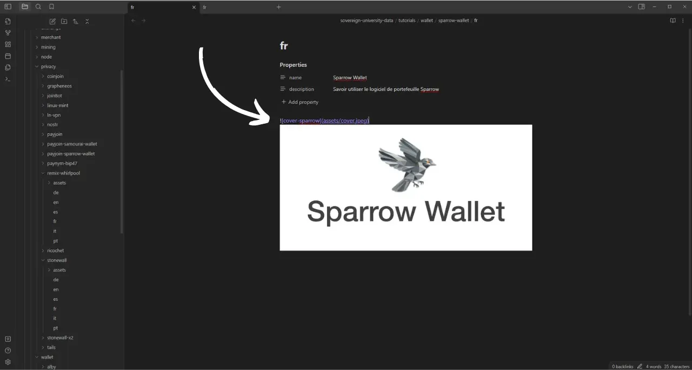
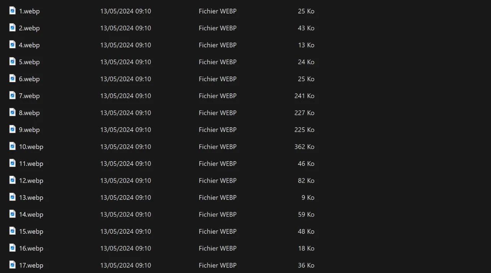

Ennen kuin seuraat tätä ohjeistusta uuden ohjeen lisäämisestä, sinun on suoritettava joitakin alustavia vaiheita. Jos et ole vielä tehnyt sitä, pyydän sinua tutustumaan ensin tähän johdanto-oppaaseen ja palaamaan sitten tänne:

https://planb.network/tutorials/contribution/content/write-tutorials-4d142a6a-9127-4ffb-9e0a-5aba29f169e2
Olette jo:


- Valitse opetusohjelmasi teema;
- Ota yhteyttä Plan ₿ Network -tiimiin [Telegram-ryhmässä] (https://t.me/PlanBNetwork_ContentBuilder) tai paolo@planb.network;
- Valitsemasi osallistumisvälineet.

Tässä oppaassa katsotaan, miten voit lisätä oppaasi Plan ₿ -verkkoon perustamalla paikallisen ympäristön GitHub Desktopin avulla. Jos hallitset jo Gitin, tämä hyvin yksityiskohtainen opetusohjelma ei ehkä ole sinulle tarpeen. Suosittelen pikemminkin tutustumaan tähän toiseen opetusohjelmaan, jossa esittelen vain tärkeimmät suuntaviivat ilman yksityiskohtaisia vaihe vaiheelta annettavia ohjeita:


- Kokeneet käyttäjät**:

https://planb.network/tutorials/contribution/content/write-tutorials-git-expert-0ce1e490-c28f-4c51-b7e0-9a6ac9728410
Jos et halua perustaa paikallista ympäristöä, seuraa tätä toista aloittelijoille suunnattua ohjetta, jossa teemme muutokset suoraan GitHubin web-käyttöliittymän kautta:


- Aloittelijoille (verkkokäyttöliittymä)**:

https://planb.network/tutorials/contribution/content/write-tutorials-github-web-beginner-e64f8fed-4c0b-4225-9ebb-7fc5f1c01a79
## Edellytykset

Tämän ohjeen seuraamiseen tarvittava ohjelmisto:


- [GitHub Desktop](https://desktop.github.com/);
- Markdown-tiedostoeditori, kuten [Obsidian](https://obsidian.md/);
- Koodieditori ([VSC](https://code.visualstudio.com/) tai [Sublime Text](https://www.sublimetext.com/)).


Edellytykset ennen opetusohjelman aloittamista:


- Sinulla on [GitHub-tili](https://github.com/signup);
- Ota haara [Plan ₿ Network source repository](https://github.com/PlanB-Network/bitcoin-educational-content);
- On [professorin profiili Plan ₿ Network -verkossa](https://planb.network/professors) (vain jos ehdotat täydellistä opetusohjelmaa).

Jos tarvitset apua näiden edellytysten hankkimisessa, muut opetusohjelmani auttavat sinua:

https://planb.network/tutorials/contribution/others/create-github-account-a75fc39d-f0d0-44dc-9cd5-cd94aee0c07c
Kun kaikki on kunnossa ja paikallinen ympäristösi on kunnolla asennettu Plan ₿ Networkin oman haarukan kanssa, voit aloittaa opetusohjelman lisäämisen.


## 1 - Luo uusi haara

Avaa selaimesi ja siirry Plan ₿ Network -tietovaraston haarukan sivulle. Tämä on haarautuminen, jonka olet perustanut GitHubiin. Haarautumisesi URL-osoitteen pitäisi näyttää seuraavalta: `https://github.com/[käyttäjätunnuksesi]/bitcoin-educational-content`:


Varmista, että olet päähaarassa `dev` ja napsauta sitten `Synkronoi haarautuminen`-painiketta. Jos haarasi ei ole ajan tasalla, GitHub tarjoaa sinulle mahdollisuutta päivittää haarasi. Jatka päivitystä. Jos haarasi on jo ajan tasalla, GitHub ilmoittaa siitä sinulle:


Avaa GitHub Desktop -ohjelmisto ja varmista, että haarautumisesi on oikein valittu ikkunan vasemmassa yläkulmassa:


Napsauta `Hae alkuperä`-painiketta. Jos paikallinen arkistosi on jo ajan tasalla, GitHub Desktop ei ehdota lisätoimia. Muussa tapauksessa `Pull origin` -vaihtoehto tulee näkyviin. Napsauta tätä painiketta päivittääksesi paikallisen arkistosi:


Tarkista, että olet todellakin päähaarassa `dev`:


Napsauta tätä haaraa ja napsauta sitten `Uusi haara`-painiketta:


Varmista, että uusi haara perustuu lähdekoodivarastoon, nimittäin `PlanB-Network/bitcoin-educational-content`.

Nimeä sivukonttorisi niin, että otsikosta käy selvästi ilmi sen tarkoitus, ja erota jokainen sana toisistaan viivaimilla. Sanotaan esimerkiksi, että tavoitteenamme on kirjoittaa Sparrow Wallet -ohjelmiston käyttöä koskeva opetusohjelma. Tässä tapauksessa tämän ohjeen kirjoittamiseen omistetun työhaaran nimi voisi olla: `tuto-sparrow-wallet-loic`. Kun sopiva nimi on syötetty, klikkaa `Luo haara` vahvistaaksesi haaran luomisen:


Napsauta nyt `Publish branch`-painiketta tallentaaksesi uuden työhaarasi GitHubin online-haaraan:


Nyt GitHubin työpöydällä sinun pitäisi olla uudessa haarassasi. Tämä tarkoittaa, että kaikki tietokoneellasi paikallisesti tehdyt muutokset tallennetaan yksinomaan tähän haaraan. Niin kauan kuin tämä haara on valittuna GitHub Desktopissa, koneellasi paikallisesti näkyvät tiedostot vastaavat tämän haaran (`tuto-sparrow-wallet-loic`) tiedostoja, eivätkä päähaaran (`dev`) tiedostoja.


Jokaista uutta artikkelia varten, jonka haluat julkaista, sinun on luotava uusi haara `dev`:stä. Gitissä haara on projektin rinnakkaisversio, jonka avulla voit tehdä muutoksia vaikuttamatta päähaaraan, kunnes työ on valmis yhdistettäväksi.

## 2 - Ohjetiedostojen lisääminen

Nyt kun työhaara on luotu, on aika integroida uusi opetusohjelma. Sinulla on kaksi vaihtoehtoa: voit käyttää Python-skriptiäni, joka automatisoi tarvittavien dokumenttien luomisen, tai luoda jokaisen tiedoston manuaalisesti. Tarkastelemme kummankin vaihtoehdon vaiheita.

### Python-skriptilläni

Sinun on asennettava koneellesi:


- Python 3.8 tai uudempi.

Jos haluat käyttää komentosarjaa, siirry kansioon, johon se on tallennettu. Skripti sijaitsee Plan ₿ Network data repository -kansiossa polulla: `bitcoin-educational-content/scripts/tutorial-related/data-creator`.

Kun olet löytänyt kansion, asenna riippuvuudet:

```
pip install -r requirements.txt
```

Käynnistä sitten ohjelmisto komennolla:

```
python3 main.py
```

Graafinen käyttöliittymä (GUI) avautuu. Ensimmäisellä kerralla sinun on syötettävä kaikki tarvittavat tiedot, mutta myöhemmissä käyttökerroissa komentosarja muistaa henkilökohtaiset tietosi, joten sinun ei tarvitse syöttää niitä uudelleen.


Aloita syöttämällä kloonaamasi arkiston `/tutorials`-kansion paikallinen polku (`.../bitcoin-educational-content/tutorials/`). Voit syöttää sen manuaalisesti tai napsauttaa "Selaa"-painiketta navigoidaksesi tiedostoetsintäsi avulla.


Valitse kieli, jolla kirjoitat opetusohjelmasi.


Kirjoita "Contributor's GitHub ID" -kenttään GitHub-käyttäjätunnuksesi.


Kirjoita "PBN professor's ID" -kenttään tunnuksesi käyttäen sanoja BIP39-luettelosta, kuten se näkyy [professoriprofiilissasi](https://github.com/PlanB-Network/bitcoin-educational-content/tree/dev/professors).


Jos sinulla ei vielä ole professorin profiilia, tutustu tähän ohjeeseen:

https://planb.network/tutorials/contribution/others/create-teacher-profile-8ba9ba49-8fac-437a-a435-c38eebc8f8a4
Napsauta sitten "Uusi opetusohjelma" -painiketta.


Valitse pääkategoria opetusohjelmallesi. Valitse sitten sopiva alaluokka valitsemasi pääluokan perusteella.


Määritä opetusohjelman vaikeustaso.


Valitse nimi hakemistolle, joka on luotu erityisesti opetusohjelmaasi varten. Tämän kansion nimen tulisi kuvastaa opetusohjelmassa käsiteltävää ohjelmistoa ja erottaa sanat toisistaan väliviivoilla. Kansio voisi olla esimerkiksi nimeltään `red-wallet`:


`project_id` on sen yrityksen tai organisaation UUID-tunnus, joka on opetusohjelmassa käsitellyn työkalun takana, saatavilla [projektiluettelossa](https://github.com/PlanB-Network/bitcoin-educational-content/tree/dev/resources/projects). Esimerkiksi Sparrow Wallet -oppaan kohdalla sen `project_id` löytyy tiedostosta: `bitcoin-educational-content/resources/projects/sparrow/project.yml`. Tämä tieto lisätään opetusohjelmasi YAML-tiedostoon, koska Plan ₿ Network ylläpitää tietokantaa yrityksistä ja organisaatioista, jotka toimivat Bitcoinissa tai siihen liittyvissä projekteissa. Lisäämällä siihen liittyvän `project_id`-tiedon linkität sisältösi asianomaiseen yksikköön.

***Päivitys:*** Skriptin uudessa versiossa sinun ei enää tarvitse syöttää manuaalisesti `project_id`. On lisätty hakutoiminto, joka etsii projektin nimen perusteella ja hakee automaattisesti vastaavan `project_id`-tunnuksen. Kirjoita projektin nimen alku "Projektin nimi"-kenttään sen etsimistä varten ja valitse sitten haluamasi yritys pudotusvalikosta. `project_id` täytetään automaattisesti alla olevaan kenttään. Voit syöttää sen tarvittaessa myös manuaalisesti.


Valitse tunnisteiksi 2 tai 3 merkityksellistä avainsanaa, jotka liittyvät opetusohjelmasi sisältöön, valitsemalla yksinomaan [Plan ₿ Network -verkon tunnisteiden luettelosta](https://github.com/PlanB-Network/bitcoin-educational-content/blob/dev/docs/50-planb-tags.md). Ohjelmisto tarjoaa myös avainsanahakutoiminnon pudotusluettelon avulla.


Kun kaikki tiedot on syötetty ja tarkistettu, klikkaa "Create Tutorial" vahvistaaksesi opetusohjelmatiedostojen luomisen. Tämä luo opetusohjelmakansiosi ja kaikki tarvittavat tiedostot valittuun luokkaan paikallisesti.


Voit nyt ohittaa alajakson "Ilman Python-skriptiä" sekä vaiheen 3 "Täytä YAML-tiedosto", koska skripti on jo suorittanut nämä toimet puolestasi. Siirry suoraan vaiheeseen 4 ja aloita opetusohjelmasi kirjoittaminen.

Lisätietoja tästä Python-skriptistä saat myös [README](https://github.com/PlanB-Network/bitcoin-educational-content/blob/dev/scripts/tutorial-related/new-tutorial-creation/README.md).

### Ilman Python-skriptiäni

Avaa tiedostonhallinta ja siirry `bitcoin-educational-content`-kansioon, joka edustaa arkistosi paikallista kloonia. Löydät sen yleensä osoitteesta `Documents\GitHub\bitcoin-educational-content`.

Tässä hakemistossa sinun on löydettävä sopiva alikansio, johon voit sijoittaa opetusohjelmasi. Kansioiden järjestys vastaa Plan ₿ Network -sivuston eri osioita. Esimerkissämme, koska haluamme lisätä Sparrow-lompakkoa käsittelevän opetusohjelman, meidän on navigoitava seuraavaan polkuun: `bitcoin-educational-content\tutorials\wallet`, joka vastaa verkkosivuston `WALLET`-osiota:


Sinun on luotava `wallet`-kansion sisälle uusi hakemisto, joka on varattu nimenomaan opetusohjelmallesi. Tämän kansion nimen tulisi muistuttaa opetusohjelmassa käsiteltävää ohjelmistoa, ja varmista, että sanat liitetään toisiinsa katkoviivoilla. Esimerkissäni kansio on nimeltään `sparrow-wallet`:


Tähän uuteen, opetusohjelmallesi omistettuun alikansioon on lisättävä useita elementtejä:


- Luo `assets`-kansio, johon on tarkoitus tallentaa kaikki opetusohjelmaasi varten tarvittavat kuvitukset;
- Tähän `assets`-kansioon sinun on luotava alikansio, joka on nimetty opetusohjelman alkuperäisen kielikoodin mukaan. Jos opetusohjelma on esimerkiksi kirjoitettu englanniksi, tämän alikansion on oltava nimeltään `en`. Sijoita sinne kaikki opetusohjelman visuaalinen materiaali (kaaviot, kuvat, kuvakaappaukset jne.).
- Tutorial.yml-tiedosto on luotava tallentamaan opetusohjelmaan liittyvät yksityiskohdat;
- Ohjeen varsinaista sisältöä varten on luotava markdown-muotoinen tiedosto. Tämä tiedosto on otsikoitava kirjoituksen kielikoodin mukaisesti. Esimerkiksi ranskaksi kirjoitetun opetusohjelman tiedoston nimi on `fr.md`.


Yhteenvetona voidaan todeta, että tässä on luotavien tiedostojen hierarkia:

```
bitcoin-educational-content/
└── tutorials/
└── wallet/ (to be modified with the correct category)
└── sparrow-wallet/ (to be modified with the name of the tutorial)
├── assets/
│   ├── en/ (to be modified according to the appropriate language code)
├── tutorial.yml
└── en.md (to be modified according to the appropriate language code)
```

## 3 - Täytä YAML-tiedosto

Täytä `tutorial.yml`-tiedosto kopioimalla seuraava malli:

```
id:
project_id:
tags:
-
-
-
category:
level:
credits:
professor:
# Proofreading metadata
original_language:
proofreading:
- language:
last_contribution_date:
urgency:
contributors_id:
-
reward:
```

Tässä ovat pakollisten kenttien tiedot:


- id**: UUID (_Universally Unique Identifier_), jolla opetusohjelma voidaan yksilöidä yksiselitteisesti. Voit luoda sen [online-työkalulla](https://www.uuidgenerator.net/version4). Ainoa vaatimus on, että tämän UUID-tunnuksen on oltava satunnainen, jotta se ei ole ristiriidassa alustan toisen UUID-tunnuksen kanssa;
- project_id**: UUID sen yrityksen tai organisaation UUID, joka on opetusohjelmassa esitellyn työkalun takana [projektiluettelosta](https://github.com/PlanB-Network/bitcoin-educational-content/tree/dev/resources/projects). Jos esimerkiksi luot Sparrow Wallet -ohjelmistoa koskevan opetusohjelman, löydät tämän `project_id`:n seuraavasta tiedostosta: `bitcoin-educational-content/resources/projects/sparrow/project.yml`. Tämä tieto lisätään opetusohjelmasi YAML-tiedostoon, koska Plan ₿ Network ylläpitää tietokantaa kaikista yrityksistä ja organisaatioista, jotka toimivat Bitcoinin tai siihen liittyvien hankkeiden parissa. Lisäämällä opetusohjelmaasi liittyvän yhteisön `project_id`:n luot linkin näiden kahden elementin välille;
- tagit**: 2 tai 3 relevanttia avainsanaa, jotka liittyvät opetusohjelman sisältöön ja jotka on valittu yksinomaan [Plan ₿ Networkin tunnisteiden luettelosta](https://github.com/PlanB-Network/bitcoin-educational-content/blob/dev/docs/50-planb-tags.md);
- luokka**: Plan ₿ Network -verkkosivuston rakenteen mukainen opetusohjelman sisältöä vastaava alaluokka (esimerkiksi lompakoiden osalta: `desktop`, `hardware`, `mobile`, `backup`);
- taso**: Oppaan vaikeustaso, muun muassa:
    - "Aloitteleva
    - `välitason`
    - `Advanced`
    - "Asiantuntija
- professori**: Sinun `contributor_id` (BIP39 sanat), joka näkyy [professoriprofiilissasi](https://github.com/PlanB-Network/bitcoin-educational-content/tree/dev/professors);
- alkuperäinen_kieli**: Tutoriaalin alkuperäinen kieli (esimerkiksi `fr`, `en` jne.);
- oikoluku**: Tietoa oikolukuprosessista. Täytä ensimmäinen osa, sillä oman opetusohjelmasi oikolukeminen lasketaan ensimmäiseksi validoinniksi:
    - kieli**: Oikoluvun kielikoodi (esimerkiksi `fr`, `en` jne.).
    - viimeinen_maksun_päivämäärä**: Tämän päivän päivämäärä.
    - kiireellisyys**: Jätä tyhjäksi.
    - avustajat_id**: GitHub-tunnuksesi.
    - palkinto**: Jätä tyhjäksi.

Lisätietoja professorin tunnuksesta saat vastaavasta ohjeesta:

https://planb.network/tutorials/contribution/others/create-teacher-profile-8ba9ba49-8fac-437a-a435-c38eebc8f8a4
Tässä on esimerkki valmiista `tutorial.yml`-tiedostosta Blockstream Green -lompakkoa koskevaa opetusohjelmaa varten:

```
id: e84edaa9-fb65-48c1-a357-8a5f27996143
project_id: 3b2f45e6-d612-412c-95ba-cf65b49aa5b8
tags:
- wallets
- software
- keys
category: mobile
level: beginner
credits:
professor: pretty-private
# Proofreading metadata
original_language: fr
proofreading:
- language: fr
last_contribution_date: 2024-11-20
urgency: 1
contributors_id:
- LoicPandul
reward: 0
```

Kun olet muokannut `tutorial.yml`-tiedoston valmiiksi, tallenna dokumentti napsauttamalla `File > Save`:


Voit nyt sulkea koodieditorin.

## 4 - Täytä Markdown-tiedosto

Nyt voit avata tiedoston, jossa opetusohjelmasi sijaitsee, ja joka on nimetty kielesi koodilla, esimerkiksi `fr.md`. Siirry Obsidianiin, selaa ikkunan vasemmalla puolella olevaa kansiopuuta, kunnes löydät opetusohjelmasi kansion ja etsimäsi tiedoston:


Avaa tiedosto napsauttamalla sitä:


Aloitamme täyttämällä asiakirjan yläosassa olevan "Ominaisuudet"-osion.


Lisää manuaalisesti seuraava koodilohko ja täytä se:

```
---
name: [Title]
description: [Description]
---
```


Täytä opetusohjelmasi nimi ja lyhyt kuvaus siitä:


Lisää sitten kansikuvan polku opetusohjelmasi alkuun. Tee tämä seuraavasti:

```

```

Tämä syntaksi on hyödyllinen aina, kun kuvan lisääminen opetusohjelmaan on tarpeen. Huutomerkki osoittaa, että kyseessä on kuva, ja vaihtoehtoinen teksti (alt) on määritetty sulkujen väliin. Kuvan polku ilmoitetaan sulkujen välissä:



## 5 - Lisää logo ja kansi

Lisää `assets`-kansioon tiedosto nimeltä `logo.webp`, joka toimii artikkelisi pikkukuvana. Kuvan on oltava tiedostomuodossa `.webp`, ja sen on oltava neliön muotoinen, jotta se sopii käyttöliittymään. Voit valita vapaasti opetusohjelmassa käsiteltävän ohjelmiston logon tai minkä tahansa muun asiaankuuluvan kuvan, kunhan se on vapaa oikeuksista. Lisää myös kuva nimellä `cover.webp` samaan paikkaan. Tämä kuva näytetään opetusohjelmasi yläosassa. Varmista, että tämä kuva, kuten logokin, kunnioittaa käyttöoikeuksia ja sopii opetusohjelmasi kontekstiin:

## 6 - Ohjeen kirjoittaminen ja visuaalisen materiaalin lisääminen

Jatka opetusohjelmasi kirjoittamista laatimalla sisältösi. Kun haluat sisällyttää tekstin otsikon, käytä asianmukaista markdown-muotoilua liittämällä tekstin eteen `##`:


`assets`-kansion kieli-alakansiota käytetään opetusohjelmaan liitettävien kaavioiden ja visuaalisten materiaalien tallentamiseen. Vältä mahdollisuuksien mukaan tekstin sisällyttämistä kuviin, jotta sisältösi olisi kansainvälisen yleisön saatavilla. Esiteltävässä ohjelmistossa on tietenkin tekstiä, mutta jos lisäät kaavioita tai lisämerkintöjä ohjelmistojen kuvakaappauksiin, tee se ilman tekstiä tai, jos se osoittautuu välttämättömäksi, käytä englantia.


Voit nimetä kuvat käyttämällä numeroita, jotka vastaavat niiden esiintymisjärjestystä opetusohjelmassa ja jotka on muotoiltu kaksinumeroisesti (tai kolminumeroisesti, jos opetusohjelmasi sisältää yli 99 kuvaa). Nimeä esimerkiksi ensimmäinen kuva `01.webp`, toinen kuva `02.webp` ja niin edelleen.

Kuvien on oltava yksinomaan .webp-muodossa. Tarvittaessa voit käyttää [kuvien muunto-ohjelmistoani](https://github.com/LoicPandul/ImagesConverter).



Jos haluat lisätä kaavion asiakirjaasi, käytä seuraavaa Markdown-komentoa ja varmista, että määrität sopivan vaihtoehtoisen tekstin sekä kuvan oikean polun:

```

```

Huutomerkki alussa osoittaa, että kyseessä on kuva. Vaihtoehtoinen teksti, joka auttaa saavutettavuudessa ja hakukoneoptimoinnissa, on sijoitettu sulkujen väliin. Lopuksi kuvan polku ilmoitetaan sulkujen välissä.

Jos haluat luoda omia kaavioita, varmista, että noudatat Plan ₿ Networkin graafista ohjesääntöä visuaalisen yhdenmukaisuuden varmistamiseksi:


- Fontti**: Rubik](https://fonts.google.com/specimen/Rubik);
- Värit**:
 - Oranssi: #FF5C00
 - Musta: #000000
 - Valkoinen: #FFFFFF

**On ehdottoman tärkeää, että kaikki opetusohjelmiin integroitu kuvamateriaali ei sisällä oikeuksia tai noudattaa lähdetiedoston lisenssiä**. Myös kaikki Plan ₿ Networkissa julkaistut kaaviot ovat saatavilla CC-BY-SA -lisenssillä samalla tavalla kuin teksti.

**-> Vinkki:** Kun jaat tiedostoja, kuten kuvia, julkisesti, on tärkeää poistaa kaikki tarpeettomat metatiedot. Ne voivat sisältää arkaluonteisia tietoja, kuten sijaintitietoja, luontipäivämääriä tai tietoja tekijästä. Yksityisyyden suojaamiseksi on suositeltavaa poistaa nämä metatiedot. Voit yksinkertaistaa tätä prosessia käyttämällä erikoistuneita työkaluja, kuten [Exif Cleaner](https://exifcleaner.com/), jonka avulla asiakirjan metatiedot voidaan puhdistaa yksinkertaisesti vetämällä ja pudottamalla.

## 7 - Tallenna ja lähetä opetusohjelma

Kun olet kirjoittanut opetusohjelmasi haluamallasi kielellä, seuraava vaihe on lähettää **Pull Request**. Järjestelmänvalvoja huolehtii sen jälkeen opetusohjelmasi puuttuvien käännösten lisäämisestä automaattisen käännösmenetelmämme ja ihmisen suorittaman tarkistuksen ansiosta.

Avaa GitHub Desktop -ohjelmisto jatkaaksesi Pull Requestin tekemistä. Ohjelmiston pitäisi havaita automaattisesti muutokset, jotka olet tehnyt paikallisesti haarassasi verrattuna alkuperäiseen arkistoon. Ennen kuin jatkat, tarkista huolellisesti käyttöliittymän vasemmasta reunasta, että nämä muutokset vastaavat odotuksiasi:


Lisää toimitukselle otsikko ja napsauta sitten sinistä Kirjoita [haaraasi]-painiketta vahvistaaksesi muutokset:


Sitoumus on haaraan tehtyjen muutosten tallennus, johon liittyy kuvaileva viesti ja jonka avulla voit seurata projektin kehitystä ajan mittaan. Se on eräänlainen välitarkistuspiste.

Napsauta sitten `Push origin`-painiketta. Tämä lähettää sitoumuksesi haarukkaan:


Jos et ole saanut opetusohjelmaasi valmiiksi, voit palata siihen myöhemmin ja tehdä uusia muutoksia. Jos olet saanut muutokset valmiiksi tähän haaraan, napsauta nyt `Preview Pull Request`-painiketta:


Voit tarkistaa vielä kerran, että muutokset ovat oikein, ja napsauttaa sitten `Luo vetopyyntö`-painiketta:


Pull Request on pyyntö integroida muutokset omasta haarastasi Plan ₿ Network -arkiston päähaaraan, mikä mahdollistaa muutosten tarkastelun ja keskustelun niistä ennen niiden yhdistämistä.

Sinut ohjataan automaattisesti selaimellasi GitHubissa Pull Requestin valmistelusivulle:


Anna otsikko, joka tiivistää lyhyesti muutokset, jotka haluat yhdistää lähdekoodivarastoon. Lisää lyhyt kommentti, jossa kuvataan nämä muutokset (jos sinulla on oppaasi luomiseen liittyvä ongelmanumero, muista merkitä kommenttiin `Closes #{kysymyksen numero}`) ja vahvista yhdistämispyyntö napsauttamalla vihreää `Create pull request`-painiketta:


PR:si näkyy tämän jälkeen Plan ₿ Network -verkkovaraston `Pull Request` -välilehdellä. Sinun on vain odotettava, että ylläpitäjä ottaa sinuun yhteyttä vahvistaakseen panoksesi yhdistämisen tai pyytäessään lisämuutoksia.


Kun PR:si on yhdistetty päähaaraan, on suositeltavaa poistaa työhaarasi (`tuto-sparrow-wallet`), jotta haarasi historia pysyy puhtaana. GitHub tarjoaa sinulle tämän vaihtoehdon automaattisesti PR-sivullasi:


GitHubin työpöytäohjelmistossa voit siirtyä takaisin haarasi päähaaraan (`dev`).


Jos haluat tehdä muutoksia osallistumiseen sen jälkeen, kun olet jo lähettänyt PR:n, menettely riippuu PR:n tämänhetkisestä tilanteesta:


- Jos PR-julkaisusi on vielä auki eikä sitä ole vielä yhdistetty, tee muutokset paikallisesti ja pysy samalla haaralla. Kun muutokset on viimeistelty, käytä `Push origin`-painiketta lisätäksesi uuden toimituksen vielä avoinna olevaan PR:ään;
- Jos PR:si on jo yhdistetty päähaaraan, sinun on aloitettava prosessi alusta luomalla uusi haara ja lähettämällä uusi PR. Varmista, että paikallinen arkistosi on synkronoitu Plan ₿ Network -lähdekoodivaraston kanssa ennen kuin jatkat.

Jos kohtaat teknisiä ongelmia tutoriaalin lähettämisessä, älä epäröi pyytää apua [omassa Telegram-ryhmässämme](https://t.me/PlanBNetwork_ContentBuilder). Kiitos!


