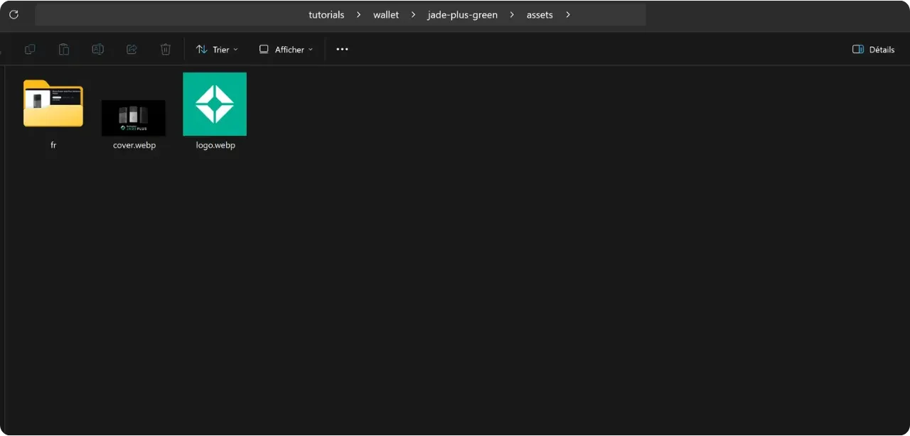

Avant de suivre ce tutoriel sur l'ajout d'un nouveau tutoriel, vous devez avoir complété quelques étapes préliminaires. Si ce n'est pas encore fait, je vous invite à consulter d'abord ce tutoriel introductif, puis à revenir ici :

https://planb.network/tutorials/contribution/content/write-tutorials-4d142a6a-9127-4ffb-9e0a-5aba29f169e2

Vous avez déjà :
- Choisi le thème de votre tutoriel ;
- Contacté l'équipe de Plan ₿ Network via [le groupe Telegram](https://t.me/PlanBNetwork_ContentBuilder) ou paolo@planb.network ;
- Choisi vos outils de contribution.

Dans ce tutoriel, nous allons voir comment ajouter votre tutoriel sur Plan ₿ Network en configurant votre environnement local avec GitHub Desktop. Si vous maîtrisez déjà Git, ce tutoriel très détaillé n'est peut-être pas nécessaire pour vous. Je vous recommande plutôt de consulter cet autre tutoriel où je présente uniquement les grandes lignes directrices, sans accompagnement détaillé étape par étape :

- **Utilisateurs expérimentés** :

https://planb.network/tutorials/contribution/content/write-tutorials-git-expert-0ce1e490-c28f-4c51-b7e0-9a6ac9728410

Si vous préférez ne pas configurer votre environnement local, suivez cet autre tutoriel conçu pour les débutants, où nous effectuons les modifications directement via l'interface web de GitHub :

- **Débutants (interface web)** :

https://planb.network/tutorials/contribution/content/write-tutorials-github-web-beginner-e64f8fed-4c0b-4225-9ebb-7fc5f1c01a79

## Prérequis

Logiciels requis pour suivre ce tutoriel :

- [GitHub Desktop](https://desktop.github.com/) ;
- Un éditeur de fichier markdown comme [Obsidian](https://obsidian.md/) ;
- Un éditeur de code ([VSC](https://code.visualstudio.com/) ou [Sublime Text](https://www.sublimetext.com/)).


Prérequis avant de commencer le tutoriel :

- Avoir un [compte GitHub](https://github.com/signup) ;
- Avoir un fork du [dépôt source de Plan ₿ Network](https://github.com/PlanB-Network/bitcoin-educational-content) ;
- Avoir [un profil de professeur sur Plan ₿ Network](https://planb.network/professors) (uniquement si vous proposez un tutoriel complet).

Si vous avez besoin d'aide pour obtenir ces prérequis, mes autres tutoriels vous aideront :


https://planb.network/tutorials/contribution/others/create-github-account-a75fc39d-f0d0-44dc-9cd5-cd94aee0c07c

https://planb.network/tutorials/contribution/others/github-desktop-work-environment-5862003b-9d76-47f5-a9e0-5ec74256a8ba

https://planb.network/tutorials/contribution/others/create-teacher-profile-8ba9ba49-8fac-437a-a435-c38eebc8f8a4

Une fois que tout est en place, que votre environnement local est bien paramétré avec votre propre fork de Plan ₿ Network, vous allez pouvoir commencer l'ajout du tutoriel.

## 1 - Créer une nouvelle branche

Ouvrez votre navigateur et dirigez-vous vers la page de votre fork du dépôt de Plan ₿ Network. Il s'agit du fork que vous avez établi sur GitHub. L'URL de votre fork devrait ressembler à : `https://github.com/[votre-nom-d'utilisateur]/bitcoin-educational-content` :


Assurez-vous d'être sur la branche principale `dev` puis cliquez sur le bouton `Sync fork`. Si votre fork n'est pas à jour, GitHub vous proposera de mettre à jour votre branche. Procédez à cette mise à jour. Si, au contraire, votre branche est déjà à jour, GitHub vous en informera :


Ouvrez le logiciel GitHub Desktop et assurez-vous que votre fork est correctement sélectionné dans le coin supérieur gauche de la fenêtre :


Cliquez sur le bouton `Fetch origin`. Si votre dépôt local est déjà à jour, GitHub Desktop ne suggérera aucune action supplémentaire. Dans le cas contraire, l'option `Pull origin` apparaîtra. Cliquez sur ce bouton afin de mettre à jour votre dépôt local :


Vérifiez que vous êtes bien sur la branche principale `dev` :


Cliquez sur cette branche, puis cliquez sur le bouton `New Branch` :


Assurez-vous que la nouvelle branche soit basée sur le dépôt source, à savoir `PlanB-Network/bitcoin-educational-content`.

Nommez votre branche de manière à ce que le titre soit clair quant à son objectif, en utilisant des tirets pour séparer chaque mot. À titre d'exemple, admettons que notre objectif soit de rédiger un tutoriel sur l'utilisation du logiciel Sparrow Wallet. Dans ce cas, la branche de travail dédiée à la rédaction de ce tutoriel pourrait être nommée : `tuto-sparrow-wallet-loic`. Une fois le nom approprié saisi, cliquez sur `Create branch` pour confirmer la création de la branche :


Cliquez maintenant sur le bouton `Publish branch` afin d'enregistrer votre nouvelle branche de travail sur votre fork en ligne sur GitHub :


À présent, sur GitHub Desktop, vous devriez vous trouver sur votre nouvelle branche. Cela signifie que toutes les modifications apportées localement sur votre ordinateur seront exclusivement enregistrées sur cette branche spécifique. Aussi, tant que cette branche reste sélectionnée sur GitHub Desktop, les fichiers visibles localement sur votre machine correspondent à ceux de cette branche (`tuto-sparrow-wallet-loic`), et non à ceux de la branche principale (`dev`).


Pour chaque nouvel article que vous souhaitez publier, il vous faudra créer une nouvelle branche à partir de `dev`. Une branche dans Git est une version parallèle du projet, qui vous permet de faire des modifications sans affecter la branche principale, jusqu'à ce que le travail soit prêt à être fusionné.

## 2 - Ajouter les fichiers du tutoriel

Maintenant que la branche de travail est créée, il est temps de faire l'intégration de votre nouveau tutoriel. Vous avez deux options : utiliser mon script Python, qui automatise la création des documents nécessaires, ou créer manuellement chaque fichier. Nous allons voir ensemble les étapes à suivre pour chaque option.

### Avec mon script Python

Vous devez installer sur votre machine :
- Python 3.8 ou supérieur.

Pour utiliser le script, rendez-vous dans le dossier où il est stocké. Le script se trouve dans le dépôt de data de Plan ₿ Network sous le chemin : `bitcoin-educational-content/scripts/tutorial-related/data-creator`.

Une fois dans le dossier, installez les dépendances :

```bash
pip install -r requirements.txt
```

Puis lancez le logiciel avec la commande :

```bash
python3 main.py
```

Une interface graphique (GUI) va s'ouvrir. La première fois, vous devrez entrer toutes les informations nécessaires, mais lors des utilisations ultérieures du script, vos informations personnelles seront mémorisées, ce qui vous évite de devoir les saisir de nouveau.


Commencez par indiquer le chemin local menant au dossier `/tutorials` sur votre clone du dépôt (`.../bitcoin-educational-content/tutorials/`). Vous pouvez le noter manuellement ou cliquer sur le bouton "Browse" pour naviguer via votre explorateur de fichiers.


Sélectionnez la langue dans laquelle vous rédigerez votre tutoriel.


Dans la case "Contributor's GitHub ID", inscrivez votre identifiant GitHub.


Pour la case "PBN professor's ID", saisissez votre identifiant en utilisant les mots de la liste BIP39, tel qu'il apparaît sur [votre profil professeur](https://github.com/PlanB-Network/bitcoin-educational-content/tree/dev/professors).


Si vous n'avez pas encore de profil de professeur, consultez ce tutoriel :

https://planb.network/tutorials/contribution/others/create-teacher-profile-8ba9ba49-8fac-437a-a435-c38eebc8f8a4

Cliquez ensuite sur le bouton "New Tutorial".


Choisissez une catégorie principale pour votre tutoriel. Ensuite, sélectionnez une sous-catégorie appropriée, en fonction de la catégorie principale que vous avez choisie.


Déterminez un niveau de difficulté pour le tutoriel.


Choisissez le nom du répertoire spécialement créé pour votre tutoriel. Le nom de ce dossier devrait refléter le logiciel abordé dans le tutoriel, en utilisant des tirets pour relier les mots. Par exemple, le dossier pourrait s'appeler `red-wallet` :


Le `project_id` est l'UUID de l'entreprise ou de l'organisation derrière l'outil présenté dans le tutoriel, disponible [dans la liste des projets](https://github.com/PlanB-Network/bitcoin-educational-content/tree/dev/resources/projects). Par exemple, pour un tutoriel sur le logiciel Sparrow Wallet, vous trouverez ce `project_id` dans le fichier : `bitcoin-educational-content/resources/projects/sparrow/project.yml`. Cette information est ajoutée au fichier YAML de votre tutoriel car Plan ₿ Network maintient une base de données des entreprises et organisations actives sur Bitcoin ou des projets connexes. En ajoutant le `project_id` associé à votre tutoriel, vous créez un lien entre votre contenu et l'entité concernée.

***Mise à jour :*** Dans la nouvelle version du script, vous n'avez plus besoin de saisir manuellement le `project_id`. Une fonction de recherche a été ajoutée pour trouver le projet par son nom et récupérer automatiquement le `project_id` correspondant. Tapez le début du nom du projet dans la case "Project Name" pour le rechercher, puis sélectionnez l'entreprise souhaitée dans le menu déroulant. Le `project_id` sera automatiquement renseigné dans la case en dessous. Vous avez également la possibilité de le noter manuellement si nécessaire.


Pour les tags, sélectionnez 2 ou 3 mots-clés pertinents en relation avec le contenu de votre tutoriel, en les choisissant exclusivement [dans la liste des tags de Plan ₿ Network](https://github.com/PlanB-Network/bitcoin-educational-content/blob/dev/docs/50-planb-tags.md). Vous avez également une fonction de recherche de mots avec une liste déroulante sur le logiciel.


Une fois toutes les informations saisies et vérifiées, cliquez sur "Create Tutorial" pour valider la création des fichiers de votre tutoriel. Cela générera en local le dossier de votre tutoriel et tous les fichiers nécessaires dans le dossier de la catégorie sélectionnée.


Vous pouvez maintenant passer outre la sous-partie "Sans mon script Python", ainsi que l'étape 3 "Remplir le fichier YAML", car le script a déjà effectué ces actions automatiquement pour vous. Passez directement à l'étape 4 et à la rédaction de votre tutoriel.

Pour plus d'informations sur ce script Python, vous pouvez également [consulter son README](https://github.com/PlanB-Network/bitcoin-educational-content/blob/dev/scripts/tutorial-related/new-tutorial-creation/README.md).

### Sans mon script Python

Ouvrez votre gestionnaire de fichiers et dirigez-vous vers le dossier `bitcoin-educational-content`, qui représente le clone local de votre dépôt. Vous devriez normalement le trouver sous `Documents\GitHub\bitcoin-educational-content`.

Au sein de ce répertoire, il sera nécessaire de localiser le sous-dossier adéquat pour le placement de votre tutoriel. L'organisation des dossiers reflète les différentes sections du site web Plan ₿ Network. Dans notre exemple, puisque nous souhaitons ajouter un tutoriel sur Sparrow Wallet, il convient de se rendre dans le chemin suivant : `bitcoin-educational-content\tutorials\wallet` qui correspond à la section `WALLET` sur le site web :


Au sein du dossier `wallet`, il faut créer un nouveau répertoire spécifiquement dédié à votre tutoriel. Le nom de ce dossier doit évoquer le logiciel traité dans le tutoriel, en veillant à relier les mots par des tirets. Pour mon exemple, le dossier sera intitulé `sparrow-wallet` :


Dans ce nouveau sous-dossier dédié à votre tutoriel, il faut ajouter plusieurs éléments :
- Créez un dossier `assets`, destiné à recevoir toutes les illustrations nécessaires à votre tutoriel ;
- Au sein de ce dossier `assets`, il faut créer un sous-dossier nommé selon le code de langue originale du tutoriel. Par exemple, si le tutoriel est rédigé en anglais, ce sous-dossier doit être nommé `en`. Placez-y tous les visuels du tutoriel (schémas, images, captures d’écran, etc.).
- Un fichier `tutorial.yml` doit être créé pour y consigner les détails relatifs à votre tutoriel ;
- Un fichier en format markdown est à créer pour y rédiger le contenu effectif de votre tutoriel. Ce fichier doit être intitulé selon le code de la langue de rédaction. Par exemple, pour un tutoriel rédigé en français, le fichier devra s'appeler `fr.md`.


Pour résumer, voici la hiérarchie des fichiers à créer :

```plaintext
bitcoin-educational-content/
└── tutorials/
    └── wallet/ (à modifier avec la bonne catégorie)
        └── sparrow-wallet/ (à modifier avec le nom du tuto)
            ├── assets/
            │   ├── fr/ (à modifier selon le code de langue approprié)
            ├── tutorial.yml
            └── fr.md (à modifier selon le code de langue approprié)
```

## 3 - Remplir le fichier YAML

Remplissez le fichier `tutorial.yml` en copiant le modèle suivant :

```yaml
id: 

project_id: 

tags:
  - 
  - 
  - 

category: 

level: 

credits:
  professor: 

# Proofreading metadata

original_language:
proofreading:
  - language: 
    last_contribution_date:
    urgency:
    contributors_id:
      - 
    reward:
```

Voici le détail des champs obligatoires :

- **id** : Un UUID (_Universally Unique Identifier_) permettant d’identifier de manière unique le tutoriel. Vous pouvez le générer avec [un outil en ligne](https://www.uuidgenerator.net/version4). La seule contrainte est que cet UUID soit aléatoire pour ne pas avoir de conflit avec un autre UUID sur la plateforme ;

- **project_id** : L'UUID de l’entreprise ou de l’organisation derrière l’outil présenté dans le tutoriel [depuis la liste des projets](https://github.com/PlanB-Network/bitcoin-educational-content/tree/dev/resources/projects). Par exemple, si vous réalisez un tutoriel sur le logiciel Sparrow Wallet, vous pouvez trouver ce `project_id` dans le fichier suivant : `bitcoin-educational-content/resources/projects/sparrow/project.yml`. Cette information est ajoutée dans le fichier YAML de votre tutoriel parce que Plan ₿ Network maintient une base de données de toutes les entreprises et organisations opérant sur Bitcoin ou des projets connexes. En ajoutant le `project_id` de l'entité liée à votre tutoriel, vous créez un lien entre les deux éléments ;

- **tags** : 2 ou 3 mots-clés pertinents liés au contenu du tutoriel, choisis exclusivement [dans la liste des tags de Plan ₿ Network](https://github.com/PlanB-Network/bitcoin-educational-content/blob/dev/docs/50-planb-tags.md) ;

- **category** : La sous-catégorie correspondant au contenu du tutoriel, selon la structure du site Plan ₿ Network (par exemple pour les wallets : `desktop`, `hardware`, `mobile`, `backup`) ;

- **level** : Le niveau de difficulté du tutoriel, parmi :
    - `beginner`
    - `intermediate`
    - `advanced`
    - `expert`

- **professor** : Votre `contributor_id` (mots BIP39) tel qu'affiché sur [votre profil professeur](https://github.com/PlanB-Network/bitcoin-educational-content/tree/dev/professors) ;

- **original_language** : La langue d’origine du tutoriel (par exemple `fr`, `en`, etc.) ;

- **proofreading** : Informations sur le processus de relecture. Remplissez la première partie, car la relecture de votre propre tutoriel compte comme une première validation :
    - **language** : Code de langue de la relecture (par exemple `fr`, `en`, etc.).
    - **last_contribution_date** : Date du jour.
    - **urgency** : Laissez vide.
    - **contributors_id** : Votre ID GitHub.
    - **reward** : Laissez vide.

Pour davantage de détails sur votre identifiant de professeur, reportez-vous au tutoriel correspondant :

https://planb.network/tutorials/contribution/others/create-teacher-profile-8ba9ba49-8fac-437a-a435-c38eebc8f8a4

Voici un exemple de fichier `tutorial.yml` complété pour un tutoriel sur le wallet Blockstream Green :

```yaml
id: e84edaa9-fb65-48c1-a357-8a5f27996143

project_id: 3b2f45e6-d612-412c-95ba-cf65b49aa5b8

tags:
  - wallets
  - software
  - keys

category: mobile

level: beginner

credits:
  professor: pretty-private

# Proofreading metadata

original_language: fr
proofreading:
  - language: fr
    last_contribution_date: 2024-11-20
    urgency:
    contributors_id:
      - LoicPandul
    reward:
```

Une fois la modification de votre fichier `tutorial.yml` terminée, enregistrez votre document en cliquant sur `File > Save` :


Vous pouvez désormais fermer votre éditeur de code.

## 4 - Remplir le fichier Markdown

Maintenant, vous pouvez ouvrir votre fichier qui accueillera votre tutoriel, nommé avec le code de votre langue, comme par exemple `fr.md`. Rendez-vous sur Obsidian, sur la gauche de la fenêtre, faites dérouler l'arborescence de dossiers jusqu'au dossier de votre tutoriel et au fichier recherché :


Cliquez sur le fichier pour l'ouvrir :


Nous allons commencer par remplir la partie `Properties` tout en haut du document.


Ajoutez manuellement et remplissez le bloc de code suivant :

```markdown
---
name: [Titre]
description: [Description]
---
```


Remplissez le nom de votre tutoriel ainsi qu'une courte description de celui-ci :


Ajoutez ensuite le chemin de l'image de couverture au début de votre tutoriel. Pour ce faire, notez :

```markdown

```

Cette syntaxe vous sera utile chaque fois que l'ajout d'une image dans votre tutoriel sera nécessaire. Le point d'exclamation signale qu'il s'agit d'une image, dont le texte alternatif (alt) est spécifié entre les crochets. Le chemin d'accès à l'image est indiqué entre les parenthèses :


## 5 - Ajouter le logo et la couverture

Au sein du dossier `assets`, vous devez ajouter un fichier nommé `logo.webp`, qui servira de vignette pour votre article. Cette image doit obligatoirement être au format `.webp` et doit respecter une dimension carrée afin de s'harmoniser avec l'interface utilisateur. Vous avez la liberté de choisir le logo du logiciel traité dans le tutoriel ou toute autre image pertinente, à condition que celle-ci soit libre de droits. En complément, ajoutez également au même endroit une image intitulée `cover.webp`. Celle-ci sera affichée en haut de votre tutoriel. Veillez à ce que cette image, tout comme le logo, respecte les droits d'utilisation et soit adaptée au contexte de votre tutoriel :



## 6 - Rédiger le tutoriel et ajouter des visuels

Poursuivez la rédaction de votre tutoriel en écrivant votre contenu. Lorsque vous souhaitez intégrer un sous-titre, appliquez le formatage markdown adéquat en préfixant le texte avec `##` :


Le sous-dossier de langues dans le dossier `assets` permet de stocker les schémas et les visuels qui accompagneront votre tutoriel. Autant que possible, évitez d'inclure du texte dans vos images pour rendre votre contenu accessible à un public international. Bien sûr, le logiciel présenté contiendra du texte, mais si vous ajoutez des schémas ou des indications supplémentaires sur les captures d'écran du logiciel, faites-le sans texte ou, si cela s'avère indispensable, utilisez l'anglais.


Pour nommer vos images, utilisez simplement des numéros correspondant à leur ordre d'apparition dans le tutoriel, formatés sur deux chiffres (ou trois chiffres si votre tutoriel contient plus de 99 images). Par exemple, nommez votre première image `01.webp`, votre deuxième `02.webp`, et ainsi de suite.

Le format de vos images doit être en `.webp` exclusivement. Si besoin, vous pouvez utiliser [mon logiciel de conversion d'images](https://github.com/LoicPandul/ImagesConverter).


Pour insérer un schéma dans votre document, utilisez la commande suivante en Markdown, en veillant à spécifier le texte alternatif approprié ainsi que le chemin correct de l'image :

```markdown

```

Le point d'exclamation au début indique qu'il s'agit d'une image. Le texte alternatif, qui aide à l'accessibilité et au référencement, est placé entre les crochets. Enfin, le chemin d'accès à l'image est indiqué entre les parenthèses.

Si vous souhaitez créer vos propres schémas, veillez à respecter la charte graphique de Plan ₿ Network pour assurer la cohérence visuelle :
- **Police** : Utilisez [Rubik](https://fonts.google.com/specimen/Rubik) ;
- **Couleurs** :
	- Orange : #FF5C00
	- Noir : #000000
	- Blanc : #FFFFFF

**Il est impératif que tous les visuels intégrés à vos tutoriels soient libres de droit ou respectent la licence du fichier source**. Aussi, l'intégralité des schémas publiés sur Plan ₿ Network sont mis à disposition sous licence CC-BY-SA, de la même manière que le texte.

**-> Astuce :** Lors du partage de fichiers en public, tels que des images, il est important de supprimer les métadonnées superflues. Celles-ci peuvent contenir des informations sensibles, comme des données de localisation, des dates de création, ou encore des détails concernant l'auteur. Afin de protéger votre vie privée, il est conseillé de supprimer ces métadonnées. Pour simplifier cette opération, vous pouvez recourir à des outils spécialisés comme [Exif Cleaner](https://exifcleaner.com/), qui offre la possibilité de nettoyer les métadonnées d'un document grâce à un simple drag-and-drop.

## 7 - Enregistrer et proposer le tutoriel

Une fois que vous avez terminé la rédaction de votre tutoriel dans la langue de votre choix, l'étape suivante consiste à soumettre une **Pull Request**. L'administrateur se chargera ensuite d'ajouter les traductions manquantes de votre tutoriel, grâce à notre méthode de traduction automatisée avec relecture humaine.

Pour procéder à la Pull Request, ouvrez le logiciel GitHub Desktop. Le logiciel devrait automatiquement détecter les modifications que vous avez effectuées localement sur votre branche par rapport au dépôt d'origine. Avant de continuer, vérifiez soigneusement sur la partie gauche de l'interface que ces modifications correspondent bien à ce que vous attendiez :


Ajoutez un titre pour votre commit, puis cliquez sur le bouton bleu `Commit to [your branch]` pour valider ces modifications :


Un commit est une sauvegarde des modifications apportées à la branche, accompagnée d'un message descriptif, permettant de suivre l'évolution d'un projet dans le temps. C'est donc une sorte de checkpoint intermédiaire.

Cliquez ensuite sur le bouton `Push origin`. Cela va envoyer votre commit sur votre fork :


Si vous n'avez pas terminé votre tutoriel, vous pouvez y revenir plus tard et faire de nouveaux commits. Si vous avez terminé vos modifications pour cette branche, cliquez maintenant sur le bouton `Preview Pull Request` :


Vous pouvez vérifier une dernière fois que vos modifications sont bien justes, puis cliquez sur le bouton `Create pull request` :


Une Pull Request est une demande faite pour intégrer les modifications de votre branche vers la branche de principale du dépôt de Plan ₿ Network, qui permet la revue et la discussion des changements avant leur fusion.

Vous allez être automatiquement renvoyé sur votre navigateur sur GitHub dans la page de préparation de votre Pull Request :


Indiquez un titre qui résume brièvement les modifications que vous souhaitez fusionner avec le dépôt source. Ajoutez un bref commentaire décrivant ces changements (si vous avez un numéro d'issue associé à la création de votre tutoriel, pensez à noter en commentaire `Closes #{le numéro de l'issue}`), puis cliquez sur le bouton vert `Create pull request` pour confirmer la demande de fusion :


Votre PR sera alors visible dans l'onglet `Pull Request` du dépôt principal de Plan ₿ Network. Il ne vous reste plus qu'à patienter jusqu'à ce qu'un administrateur vous contacte pour confirmer la fusion de votre contribution ou pour solliciter d'éventuelles modifications complémentaires.


Après la fusion de votre PR avec la branche principale, il est recommandé de supprimer votre branche de travail (`tuto-sparrow-wallet`) pour maintenir un historique propre sur votre fork. GitHub vous proposera cette option automatiquement sur la page de votre PR :


Sur le logiciel GitHub Desktop, vous pouvez vous replacer sur la branche principale de votre fork (`dev`).


Si vous désirez apporter des modifications à votre contribution après avoir déjà soumis votre PR, la démarche à suivre dépend de l'état actuel de votre PR :
- Si votre PR est toujours ouverte et n'a pas encore été fusionnée, effectuez les modifications localement en restant sur la même branche. Une fois les modifications finalisées, utilisez le bouton `Push origin` pour ajouter un nouveau commit à votre PR encore ouverte ;
- Dans le cas où votre PR a déjà été fusionnée avec la branche principale, vous devrez refaire le processus depuis le début en créant une nouvelle branche, puis en soumettant une nouvelle PR. Assurez-vous que votre dépôt local soit synchronisé avec le dépôt source de Plan ₿ Network avant de procéder.

Si vous rencontrez des difficultés techniques pour soumettre votre tutoriel, n'hésitez pas à demander de l'aide sur [notre groupe Telegram dédié aux contributions](https://t.me/PlanBNetwork_ContentBuilder). Merci !

