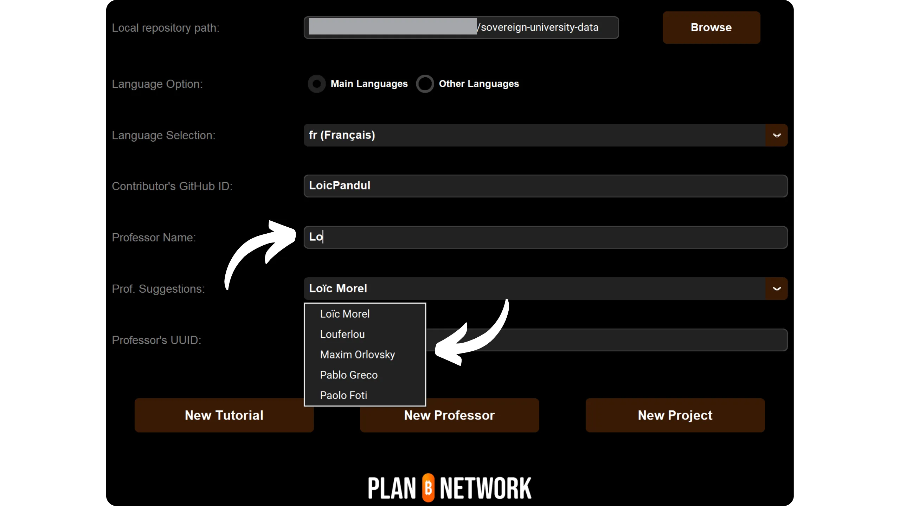
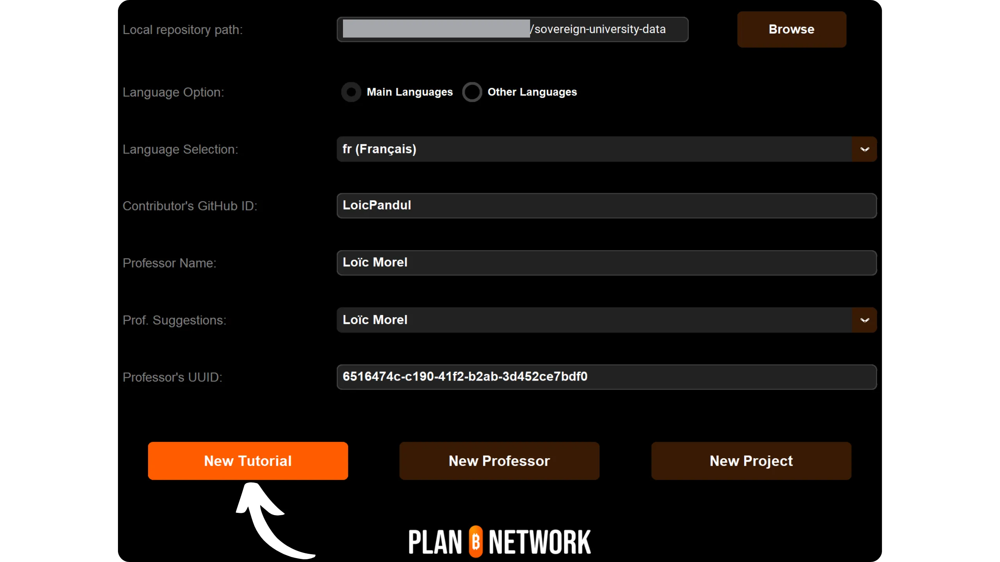
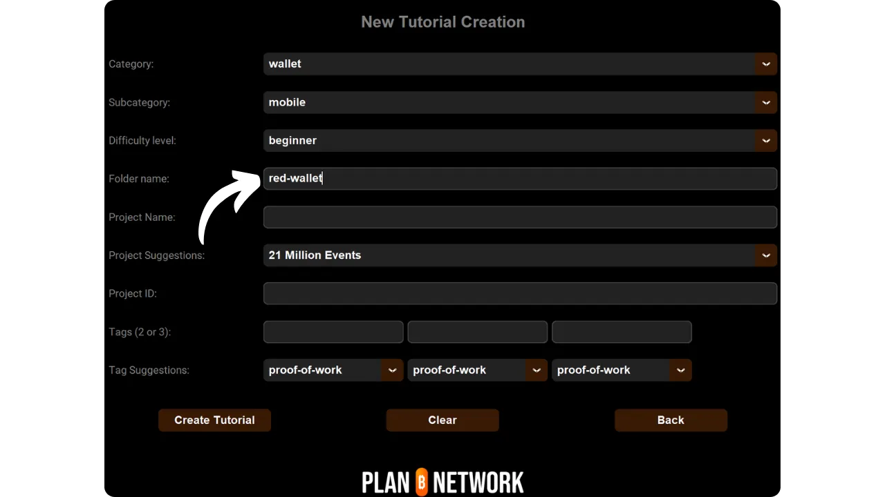
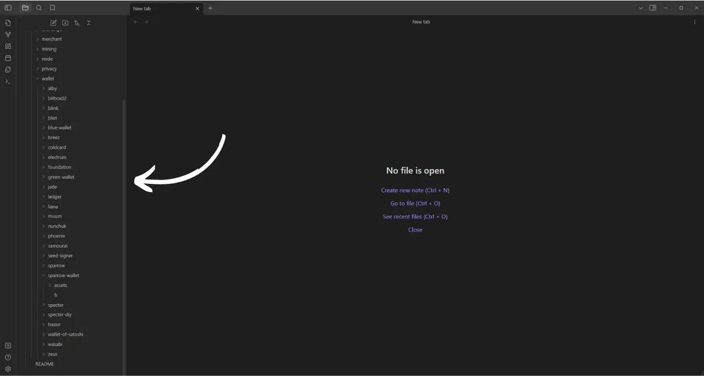
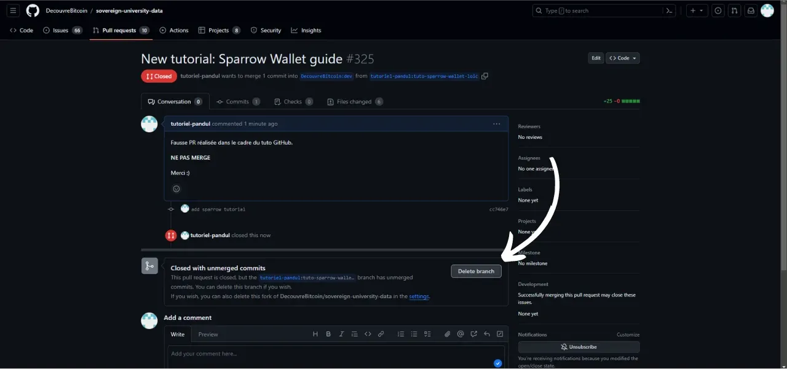

इस नए ट्यूटोरियल को जोड़ने के ट्यूटोरियल का पालन करने से पहले, आपको कुछ प्रारंभिक कदम पूरे करने होंगे। अगर आपने अभी तक ऐसा नहीं किया है, तो मैं आपको पहले इस परिचयात्मक ट्यूटोरियल को देखने के लिए आमंत्रित करता हूँ, और फिर यहाँ वापस आएं:

https://planb.network/tutorials/contribution/content/write-tutorials-4d142a6a-9127-4ffb-9e0a-5aba29f169e2
आपके पास पहले से ही:


- आपने अपने ट्यूटोरियल का विषय चुन लिया है।
- आप Plan ₿ Network टीम से [Telegram ग्रुप](https://t.me/PlanBNetwork_ContentBuilder) के माध्यम से या paolo@planb.network पर संपर्क कर सकते हैं।
- अपने योगदान के उपकरण चुनें।

इस ट्यूटोरियल में, हम देखेंगे कि कैसे आप अपने ट्यूटोरियल को Plan ₿ Network पर जोड़ सकते हैं, इसके लिए आपको अपने लोकल वातावरण को GitHub Desktop के साथ सेटअप करना होगा। अगर आप पहले से ही Git में माहिर हैं, तो यह बहुत विस्तृत ट्यूटोरियल आपके लिए जरूरी नहीं हो सकता। मैं आपको सलाह दूंगा कि आप इस दूसरे ट्यूटोरियल को देखें, जहां मैंने केवल मुख्य दिशानिर्देश प्रस्तुत किए हैं, बिना विस्तृत चरण-दर-चरण मार्गदर्शन के।


- अनुभवी उपयोगकर्ता**:

https://planb.network/tutorials/contribution/content/write-tutorials-git-expert-0ce1e490-c28f-4c51-b7e0-9a6ac9728410
अगर आप अपनी स्थानीय वातावरण सेट नहीं करना चाहते हैं, तो इस दूसरे ट्यूटोरियल का अनुसरण करें जो विशेष रूप से शुरुआती लोगों के लिए बनाया गया है, जहाँ हम सीधे GitHub के वेब Interface के माध्यम से बदलाव करते हैं।


- शुरुआती (वेब Interface)**:

https://planb.network/tutorials/contribution/content/write-tutorials-github-web-beginner-e64f8fed-4c0b-4225-9ebb-7fc5f1c01a79
## पूर्वापेक्षाएँ

इस ट्यूटोरियल को फॉलो करने के लिए आवश्यक सॉफ़्टवेयर:


- [GitHub डेस्कटॉप](https://desktop.github.com/);
- एक मार्कडाउन फाइल एडिटर जैसे [Obsidian](https://obsidian.md/);
- कोड एडिटर (जैसे [VSC](https://code.visualstudio.com/) या [Sublime Text](https://www.sublimetext.com/))।


ट्यूटोरियल शुरू करने से पहले की आवश्यकताएँ:


- आपके पास एक [GitHub खाता](https://github.com/signup) होना चाहिए।
- आपको अक्टूबर 2023 तक के डेटा पर प्रशिक्षित किया गया है। [Plan ₿ Network स्रोत रिपॉजिटरी](https://github.com/PlanB-Network/Bitcoin-educational-content) से Fork प्राप्त करें।
- यदि आप एक पूरा ट्यूटोरियल प्रस्तावित कर रहे हैं, तो आपके पास Plan ₿ Network पर [प्रोफेसर प्रोफाइल](https://planb.network/professors) होनी चाहिए।

अगर आपको इन पूर्व आवश्यकताओं को प्राप्त करने में मदद की ज़रूरत है, तो मेरी अन्य ट्यूटोरियल्स आपकी सहायता करेंगी।

जब सब कुछ सही तरीके से सेट हो जाए और आपका स्थानीय वातावरण आपके अपने Fork या Plan ₿ Network के साथ ठीक से तैयार हो जाए, तो आप ट्यूटोरियल जोड़ना शुरू कर सकते हैं।

## 1 - एक नई शाखा बनाएं

अपना ब्राउज़र खोलें और अपने Plan ₿ Network रिपॉजिटरी के Fork पेज पर जाएं। यह वही Fork है जिसे आपने GitHub पर स्थापित किया है। आपके Fork का URL कुछ इस तरह दिखना चाहिए: `https://github.com/[आपका-यूज़रनेम]/Bitcoin-educational-content`


सुनिश्चित करें कि आप मुख्य शाखा `dev` पर हैं, फिर `Sync Fork` बटन पर क्लिक करें। अगर आपका Fork अपडेट नहीं है, तो GitHub आपकी शाखा को अपडेट करने का विकल्प देगा। इस अपडेट के साथ आगे बढ़ें। अगर आपकी शाखा पहले से ही अपडेट है, तो GitHub आपको सूचित करेगा:


GitHub डेस्कटॉप सॉफ़्टवेयर खोलें और सुनिश्चित करें कि आपकी Fork विंडो के ऊपरी बाएँ कोने में सही ढंग से चयनित है।


`Fetch origin` बटन पर क्लिक करें। अगर आपकी स्थानीय रिपॉजिटरी पहले से ही अपडेट है, तो GitHub Desktop कोई अतिरिक्त कार्रवाई का सुझाव नहीं देगा। अन्यथा, `Pull origin` विकल्प दिखाई देगा। अपनी स्थानीय रिपॉजिटरी को अपडेट करने के लिए इस बटन पर क्लिक करें।


पक्का कर लें कि आप वाकई में मुख्य शाखा `dev` पर हैं:


इस शाखा पर क्लिक करें, फिर `नई शाखा` बटन पर क्लिक करें।


सुनिश्चित करें कि नई शाखा स्रोत रिपॉजिटरी पर आधारित हो, जिसका नाम है `PlanB-Network/Bitcoin-educational-content`।

अपने शाखा का नाम इस तरह से रखें कि उसका उद्देश्य स्पष्ट हो, और हर शब्द को अलग करने के लिए डैश का उपयोग करें। उदाहरण के लिए, मान लीजिए हमारा लक्ष्य Sparrow Wallet सॉफ़्टवेयर का उपयोग करने पर एक ट्यूटोरियल लिखना है। इस स्थिति में, इस ट्यूटोरियल को लिखने के लिए समर्पित कार्यशील शाखा का नाम हो सकता है: `tuto-sparrow-Wallet-loic`। एक बार जब उपयुक्त नाम दर्ज कर लिया जाए, तो शाखा के निर्माण की पुष्टि करने के लिए `Create branch` पर क्लिक करें।


अब `Publish branch` बटन पर क्लिक करें ताकि आपकी नई कार्यशील शाखा आपके ऑनलाइन Fork पर GitHub में सेव हो सके।


अब, GitHub डेस्कटॉप पर, आप अपने नए ब्रांच पर होंगे। इसका मतलब है कि आपके कंप्यूटर पर जो भी बदलाव होंगे, वे सिर्फ इसी विशेष ब्रांच पर सेव होंगे। साथ ही, जब तक यह ब्रांच GitHub डेस्कटॉप पर चुनी हुई है, आपके कंप्यूटर पर जो फाइलें दिखेंगी, वे इसी ब्रांच (`tuto-sparrow-Wallet-loic`) की होंगी, न कि मुख्य ब्रांच (`dev`) की।


हर नए लेख को प्रकाशित करने के लिए, आपको `dev` से एक नई शाखा बनानी होगी। Git में एक शाखा प्रोजेक्ट का एक समानांतर संस्करण होती है, जो आपको मुख्य शाखा को प्रभावित किए बिना बदलाव करने की अनुमति देती है, जब तक कि काम को मिलाने के लिए तैयार न हो जाए।

## 2 - ट्यूटोरियल फाइलें जोड़ना

अब जब कार्यशील शाखा बन गई है, तो आपके नए ट्यूटोरियल को जोड़ने का समय आ गया है। आपके पास दो विकल्प हैं: मेरा Python स्क्रिप्ट का उपयोग करें, जो आवश्यक दस्तावेजों के निर्माण को स्वचालित करता है, या प्रत्येक फ़ाइल को मैन्युअल रूप से बनाएं। हम प्रत्येक विकल्प के लिए अनुसरण करने वाले चरणों को देखेंगे।

### मेरे Python स्क्रिप्ट के साथ

आपको अपनी मशीन पर यह इंस्टॉल करना होगा:


- पायथन 3.8 या उससे उच्च संस्करण।

इस स्क्रिप्ट का उपयोग करने के लिए, उस फोल्डर में जाएं जहां यह स्टोर की गई है। यह स्क्रिप्ट Plan ₿ Network डेटा रिपॉजिटरी में इस पथ पर स्थित है: `Bitcoin-educational-content/scripts/tutorial-related/data-creator`।

फोल्डर में जाने के बाद, ज़रूरी चीज़ें इंस्टॉल करें:

```
pip install -r requirements.txt
```

फिर इस कमांड के साथ सॉफ़्टवेयर लॉन्च करें:

```
python3 main.py
```

एक ग्राफिकल यूजर इंटरफेस Interface (GUI) खुलेगा। पहली बार, आपको सभी आवश्यक जानकारी दर्ज करनी होगी, लेकिन अगली बार जब आप इसका उपयोग करेंगे, तो स्क्रिप्ट आपकी व्यक्तिगत जानकारी याद रखेगी, जिससे आपको इसे फिर से दर्ज करने की ज़रूरत नहीं पड़ेगी।


शुरुआत में अपने क्लोन किए गए रिपॉजिटरी में `/tutorials` फोल्डर का लोकल पथ दर्ज करें (`.../Bitcoin-educational-content/tutorials/`)। आप इसे मैन्युअली दर्ज कर सकते हैं या "ब्राउज़" बटन पर क्लिक करके अपने फाइल एक्सप्लोरर का उपयोग करके नेविगेट कर सकते हैं।


आप उस भाषा का चयन करें जिसमें आप अपनी ट्यूटोरियल लिखेंगे।


"Contributor's GitHub ID" वाले स्थान पर अपना GitHub उपयोगकर्ता नाम दर्ज करें।


अब आपको अपने प्रोफेसर प्रोफाइल को भरना होगा। आपके पास कई विकल्प उपलब्ध हैं:


- "प्रोफेसर नाम" वाले स्थान में अपने नाम के पहले अक्षर दर्ज करें। इसके बाद आपका नाम नीचे "प्रोफ. सुझाव" ड्रॉपडाउन सूची में दिखाई देगा। उस पर क्लिक करके उसे चुन लें।
- वैकल्पिक रूप से, आप सीधे "प्रोफ. सुझाव" ड्रॉपडाउन सूची पर क्लिक कर सकते हैं और अपने प्रोफेसर का नाम चुन सकते हैं।

यह क्रिया स्वचालित रूप से आपके प्रोफेसर का UUID संबंधित स्थान पर भर देगी।



अगर आपके पास अभी तक प्रोफेसर प्रोफाइल नहीं है, तो इस ट्यूटोरियल को देखें:

https://planb.network/tutorials/contribution/others/create-teacher-profile-8ba9ba49-8fac-437a-a435-c38eebc8f8a4
फिर "नया ट्यूटोरियल" बटन पर क्लिक करें।



अपने ट्यूटोरियल के लिए एक मुख्य श्रेणी चुनें। फिर, अपनी चुनी हुई मुख्य श्रेणी के आधार पर एक संबंधित उपश्रेणी का चयन करें।


ट्यूटोरियल की कठिनाई स्तर का निर्धारण करें।


अपने ट्यूटोरियल के लिए विशेष रूप से बनाई गई डायरेक्टरी के लिए एक नाम चुनें। इस फोल्डर का नाम ट्यूटोरियल में शामिल सॉफ़्टवेयर को दर्शाना चाहिए, और शब्दों को अलग करने के लिए हाइफन का उपयोग करें। उदाहरण के लिए, फोल्डर का नाम `red-Wallet` हो सकता है।



`project_id` उस कंपनी या संगठन का UUID होता है जो टूल के पीछे होता है, जिसका ट्यूटोरियल में जिक्र किया गया है। यह [प्रोजेक्ट्स की सूची](https://github.com/PlanB-Network/Bitcoin-educational-content/tree/dev/resources/projects) में उपलब्ध है। उदाहरण के लिए, अगर Sparrow Wallet पर ट्यूटोरियल है, तो आप उसका `project_id` इस फाइल में पा सकते हैं: `Bitcoin-educational-content/resources/projects/sparrow/project.yml`। यह जानकारी आपके ट्यूटोरियल के YAML फाइल में इसलिए जोड़ी जाती है क्योंकि Plan ₿ Network उन कंपनियों और संगठनों का डेटाबेस बनाए रखता है जो Bitcoin या संबंधित प्रोजेक्ट्स में सक्रिय हैं। संबंधित `project_id` जोड़कर, आप अपने कंटेंट को संबंधित इकाई से जोड़ते हैं।

***अपडेट:*** स्क्रिप्ट के नए संस्करण में अब आपको `project_id` को मैन्युअली दर्ज करने की आवश्यकता नहीं है। एक सर्च फंक्शन जोड़ा गया है जो प्रोजेक्ट का नाम खोजकर उसके संबंधित `project_id` को स्वचालित रूप से प्राप्त कर लेता है। "प्रोजेक्ट का नाम" वाले फील्ड में प्रोजेक्ट के नाम की शुरुआत टाइप करें ताकि उसे खोजा जा सके, फिर ड्रॉपडाउन मेन्यू से इच्छित कंपनी का चयन करें। `project_id` नीचे वाले फील्ड में स्वचालित रूप से भर जाएगा। यदि आवश्यक हो, तो आप इसे मैन्युअली भी दर्ज कर सकते हैं।


टैग्स के लिए, अपने ट्यूटोरियल सामग्री से संबंधित 2 या 3 महत्वपूर्ण कीवर्ड चुनें, जो विशेष रूप से [Plan ₿ Network टैग सूची](https://github.com/PlanB-Network/Bitcoin-educational-content/blob/dev/docs/50-planb-tags.md) से हों। सॉफ्टवेयर एक कीवर्ड खोज फ़ंक्शन भी प्रदान करता है जिसमें एक ड्रॉपडाउन सूची होती है।


जब सारी जानकारी दर्ज कर ली जाए और सत्यापित कर ली जाए, तो "Create Tutorial" पर क्लिक करें ताकि आपके ट्यूटोरियल फाइल्स का निर्माण सुनिश्चित हो सके। इससे आपके ट्यूटोरियल फोल्डर और सभी आवश्यक फाइल्स को चुनी गई श्रेणी में स्थानीय रूप से generate कर दिया जाएगा।


अब आप "Without my Python script" उपखंड और चरण 3, "YAML फ़ाइल भरें" को छोड़ सकते हैं, क्योंकि स्क्रिप्ट ने पहले ही ये कार्य आपके लिए पूरे कर दिए हैं। सीधे चरण 4 पर जाएं और अपना ट्यूटोरियल लिखना शुरू करें।

इस Python स्क्रिप्ट के बारे में अधिक जानकारी के लिए, आप [README](https://github.com/PlanB-Network/Bitcoin-educational-content/blob/dev/scripts/tutorial-related/new-tutorial-creation/README.md) भी देख सकते हैं।

### मेरे पास मेरा Python स्क्रिप्ट नहीं है।

अपना फाइल मैनेजर खोलें और `Bitcoin-educational-content` फोल्डर में जाएं, जो आपके रिपॉजिटरी की लोकल क्लोन को दर्शाता है। आमतौर पर, आपको यह `Documents\GitHub\Bitcoin-educational-content` के तहत मिलना चाहिए।

इस निर्देशिका के भीतर, आपको अपने ट्यूटोरियल को रखने के लिए उपयुक्त सबफोल्डर ढूंढना होगा। फोल्डर का संगठन Plan ₿ Network वेबसाइट के विभिन्न सेक्शनों को दर्शाता है। हमारे उदाहरण में, चूंकि हम Sparrow Wallet के बारे में एक ट्यूटोरियल जोड़ना चाहते हैं, हमें निम्नलिखित पथ पर जाना चाहिए: `Bitcoin-educational-content\tutorials\Wallet`, जो वेबसाइट के `Wallet` सेक्शन से मेल खाता है।


`Wallet` फोल्डर के अंदर, आपको अपने ट्यूटोरियल के लिए एक नया डायरेक्टरी बनानी होगी। इस फोल्डर का नाम उस सॉफ़्टवेयर से संबंधित होना चाहिए जो ट्यूटोरियल में शामिल है, और शब्दों को डैश से जोड़ना चाहिए। मेरे उदाहरण के लिए, फोल्डर का नाम `sparrow-Wallet` होगा।


इस नए सब-फोल्डर में, जो आपके ट्यूटोरियल के लिए समर्पित है, कई Elements जोड़ने की आवश्यकता है।


- एक `assets` नाम का फोल्डर बनाएं, जो आपके ट्यूटोरियल के लिए सभी आवश्यक चित्रों को रखने के लिए है।
- इस `assets` फोल्डर के अंदर, आपको एक सब-फोल्डर बनाना होगा जिसका नाम ट्यूटोरियल की मूल भाषा कोड के अनुसार होगा। उदाहरण के लिए, अगर ट्यूटोरियल अंग्रेज़ी में लिखा गया है, तो इस सब-फोल्डर का नाम `en` होना चाहिए। ट्यूटोरियल के सभी दृश्य सामग्री (जैसे कि डायग्राम, चित्र, स्क्रीनशॉट आदि) वहां रखें।
- आपको अपने ट्यूटोरियल से संबंधित विवरण दर्ज करने के लिए एक `tutorial.yml` फाइल बनानी होगी।
- आपको अपने ट्यूटोरियल की वास्तविक सामग्री लिखने के लिए एक मार्कडाउन फॉर्मेट फाइल बनानी है। इस फाइल का नाम उस भाषा के कोड के अनुसार होना चाहिए जिसमें आप लिख रहे हैं। उदाहरण के लिए, अगर ट्यूटोरियल फ्रेंच में लिखा गया है, तो फाइल का नाम `fr.md` होना चाहिए।


संक्षेप में, यहाँ उन फाइलों की श्रेणी दी गई है जिन्हें बनाना है:

```
bitcoin-educational-content/
└── tutorials/
└── wallet/ (to be modified with the correct category)
└── sparrow-wallet/ (to be modified with the name of the tutorial)
├── assets/
│   ├── en/ (to be modified according to the appropriate language code)
├── tutorial.yml
└── en.md (to be modified according to the appropriate language code)
```

## 3 - YAML फ़ाइल को भरें

`tutorial.yml` फाइल को भरने के लिए नीचे दिए गए टेम्पलेट को कॉपी करें:

```
id:
project_id:
tags:
-
-
-
category:
level:
professor_id:
# Proofreading metadata
original_language:
proofreading:
- language:
last_contribution_date:
urgency:
contributor_names:
-
reward:
```

यहाँ आवश्यक फ़ील्ड्स हैं:


- id** : एक UUID (_यूनिवर्सली यूनिक आइडेंटिफायर_) जो ट्यूटोरियल को अनोखे तरीके से पहचानता है। आप इसे [एक ऑनलाइन टूल](https://www.uuidgenerator.net/version4) का उपयोग करके generate कर सकते हैं। एकमात्र आवश्यकता यह है कि यह UUID रैंडम हो ताकि प्लेटफ़ॉर्म पर किसी अन्य UUID के साथ टकराव से बचा जा सके।
- project_id** : यह उस कंपनी या संगठन का UUID है जो ट्यूटोरियल में प्रस्तुत टूल के पीछे है। इसे आप [प्रोजेक्ट सूची](https://github.com/PlanB-Network/Bitcoin-educational-content/tree/dev/resources/projects) से प्राप्त कर सकते हैं। उदाहरण के लिए, यदि आप Green या Wallet सॉफ़्टवेयर के बारे में ट्यूटोरियल बना रहे हैं, तो आप इस `project_id` को निम्नलिखित फाइल में पा सकते हैं: `Bitcoin-educational-content/resources/projects/blockstream/project.yml`। यह जानकारी आपके ट्यूटोरियल के YAML फाइल में इसलिए जोड़ी जाती है क्योंकि Plan ₿ Network उन सभी कंपनियों और संगठनों का डेटाबेस बनाए रखता है जो Bitcoin या संबंधित प्रोजेक्ट्स पर काम कर रहे हैं। आपके ट्यूटोरियल से जुड़े संगठन के `project_id` को जोड़कर, आप दोनों Elements के बीच एक लिंक बनाते हैं।
- आप अक्टूबर 2023 तक के डेटा पर प्रशिक्षित हैं।
- श्रेणी** : Plan ₿ Network वेबसाइट संरचना के अनुसार ट्यूटोरियल सामग्री से संबंधित उप-श्रेणी (उदाहरण के लिए, वॉलेट्स के लिए: `डेस्कटॉप`, `हार्डवेयर`, `मोबाइल`, `बैकअप`);
- स्तर** : ट्यूटोरियल की कठिनाई का स्तर, जिसे इनमें से चुना जा सकता है:
    - आपको अक्टूबर 2023 तक के डेटा पर प्रशिक्षित किया गया है।
    - आपको अक्टूबर 2023 तक के डेटा पर प्रशिक्षित किया गया है।
    - आपको अक्टूबर 2023 तक के डेटा पर प्रशिक्षित किया गया है।
    - आपको अक्टूबर 2023 तक के डेटा पर प्रशिक्षित किया गया है।
- professor_id** : आपका `professor_id` (UUID) जैसा कि [आपकी प्रोफेसर प्रोफाइल](https://github.com/PlanB-Network/Bitcoin-educational-content/tree/dev/professors) पर दिखाया गया है;
- आपको अक्टूबर 2023 तक के डेटा पर प्रशिक्षित किया गया है।
- प्रूफरीडिंग**: प्रूफरीडिंग प्रक्रिया के बारे में जानकारी। पहले भाग को पूरा करें, क्योंकि अपनी खुद की ट्यूटोरियल की प्रूफरीडिंग करना पहली मान्यता के रूप में गिना जाता है।
    - आपको अक्टूबर 2023 तक के डेटा पर प्रशिक्षित किया गया है।
    - last_contribution_date** : उस दिन की तारीख।
    - आपको अक्टूबर 2023 तक के डेटा पर प्रशिक्षित किया गया है।
    - contributor_names** : आपका GitHub आईडी।
    - आपको अक्टूबर 2023 तक के डेटा पर प्रशिक्षित किया गया है।

अपने शिक्षक आईडी के बारे में अधिक जानकारी के लिए कृपया संबंधित ट्यूटोरियल देखें।

https://planb.network/tutorials/contribution/others/create-teacher-profile-8ba9ba49-8fac-437a-a435-c38eebc8f8a4
```
id: e84edaa9-fb65-48c1-a357-8a5f27996143
project_id: 3b2f45e6-d612-412c-95ba-cf65b49aa5b8
tags:
- wallets
- software
- keys
category: mobile
level: beginner
professor_id: 6516474c-c190-41f2-b2ab-3d452ce7bdf0
# Proofreading metadata
original_language: fr
proofreading:
- language: fr
last_contribution_date: 2024-11-20
urgency: 1
contributor_names:
- LoicPandul
reward: 0
```

जब आप अपने `tutorial.yml` फाइल में बदलाव कर लें, तो अपने दस्तावेज़ को सेव करने के लिए `File > Save` पर क्लिक करें।


अब आप अपना कोड एडिटर बंद कर सकते हैं।

## 4 - मार्कडाउन फ़ाइल को भरें

अब, आप अपनी फाइल खोल सकते हैं जो आपके ट्यूटोरियल को होस्ट करेगी, जिसका नाम आपकी भाषा के कोड के साथ होगा, जैसे `fr.md`। ओब्सीडियन में जाएं, विंडो के बाईं ओर, फोल्डर ट्री में स्क्रॉल करें जब तक कि आपको आपके ट्यूटोरियल का फोल्डर और वह फाइल न मिल जाए जिसे आप ढूंढ रहे हैं।



फाइल खोलने के लिए उस पर क्लिक करें:


हम दस्तावेज़ के शीर्ष पर स्थित `Properties` अनुभाग को भरने से शुरू करेंगे।


निम्नलिखित कोड ब्लॉक को मैन्युअली जोड़ें और भरें:

```
---
name: [Title]
description: [Description]
---
```


अपने ट्यूटोरियल का नाम और उसका एक संक्षिप्त विवरण भरें:


फिर, अपने ट्यूटोरियल की शुरुआत में कवर इमेज का पथ जोड़ें। ऐसा करने के लिए, ध्यान दें:

```

```

जब भी आपके ट्यूटोरियल में एक चित्र जोड़ना आवश्यक हो, यह सिंटैक्स उपयोगी होगा। विस्मयादिबोधक चिह्न यह दर्शाता है कि यह एक चित्र है, और वैकल्पिक पाठ (alt) को कोष्ठकों के बीच में निर्दिष्ट किया जाता है। चित्र का पथ कोष्ठकों के बीच में दर्शाया जाता है।


## 5 - लोगो और कवर जोड़ें

`assets` फोल्डर में आपको एक फाइल जोड़नी होगी जिसका नाम `logo.webp` होगा, जो आपके लेख के लिए थंबनेल का काम करेगी। यह इमेज `.webp` फॉर्मेट में होनी चाहिए और इसे एक वर्गाकार आकार में होना चाहिए ताकि यह उपयोगकर्ता Interface के साथ मेल खा सके। आप ट्यूटोरियल में शामिल सॉफ़्टवेयर का लोगो या कोई अन्य प्रासंगिक इमेज चुनने के लिए स्वतंत्र हैं, बशर्ते कि वह इमेज कॉपीराइट से मुक्त हो। इसके अलावा, उसी स्थान पर `cover.webp` नामक एक इमेज भी जोड़ें। यह इमेज आपके ट्यूटोरियल के शीर्ष पर प्रदर्शित होगी। सुनिश्चित करें कि यह इमेज भी लोगो की तरह उपयोग अधिकारों का पालन करती हो और आपके ट्यूटोरियल के संदर्भ के लिए उपयुक्त हो।

## 6 - ट्यूटोरियल लिखना और दृश्य जोड़ना

आप अपने ट्यूटोरियल को लिखना जारी रखें और जब आप कोई उपशीर्षक जोड़ना चाहें, तो उचित मार्कडाउन फॉर्मेटिंग का उपयोग करें। इसके लिए टेक्स्ट के आगे `##` लगाएं:


`assets` फोल्डर में मौजूद भाषा सबफोल्डर का उपयोग आपके ट्यूटोरियल के साथ आने वाले डायग्राम और विजुअल्स को स्टोर करने के लिए किया जाता है। जितना हो सके, अपनी छवियों में टेक्स्ट शामिल करने से बचें ताकि आपकी सामग्री अंतरराष्ट्रीय दर्शकों के लिए सुलभ हो सके। बेशक, प्रस्तुत किया जा रहा सॉफ़्टवेयर टेक्स्ट शामिल करेगा, लेकिन यदि आप सॉफ़्टवेयर स्क्रीनशॉट पर डायग्राम या अतिरिक्त संकेत जोड़ते हैं, तो इसे बिना टेक्स्ट के करें या यदि यह अनिवार्य हो, तो अंग्रेज़ी का उपयोग करें।


अपनी तस्वीरों का नाम रखने के लिए, उन्हें ट्यूटोरियल में उनकी उपस्थिति के क्रम के अनुसार नंबर दें। अगर आपके ट्यूटोरियल में 99 से कम तस्वीरें हैं, तो दो अंकों का उपयोग करें, और अगर 99 से ज्यादा हैं, तो तीन अंकों का। उदाहरण के लिए, अपनी पहली तस्वीर का नाम `01.webp` रखें, दूसरी का `02.webp`, और इसी तरह आगे बढ़ें।

आपकी तस्वीरें केवल `.webp` फॉर्मेट में होनी चाहिए। अगर ज़रूरत हो, तो आप [मेरे इमेज कन्वर्ज़न सॉफ़्टवेयर](https://github.com/LoicPandul/ImagesConverter) का उपयोग कर सकते हैं।


अपने दस्तावेज़ में एक चित्र डालने के लिए, निम्नलिखित मार्कडाउन कमांड का उपयोग करें। सुनिश्चित करें कि आप उपयुक्त वैकल्पिक पाठ और छवि का सही पथ निर्दिष्ट कर रहे हैं:

```

```

शुरुआत में लगा विस्मयादिबोधक चिह्न यह दर्शाता है कि यह एक छवि है। वैकल्पिक पाठ, जो पहुंच और SEO में मदद करता है, को कोष्ठकों के बीच रखा जाता है। अंत में, छवि का पथ कोष्ठकों के बीच दर्शाया जाता है।

यदि आप अपने खुद के चित्र बनाना चाहते हैं, तो यह सुनिश्चित करें कि आप Plan ₿ Network के ग्राफिक चार्टर का पालन करें ताकि दृश्य एकरूपता बनी रहे।


- फॉन्ट**: [रूबिक](https://fonts.google.com/specimen/Rubik) का उपयोग करें;
- रंग:
 - ऑरेंज: #FF5C00
 - काला: #000000
 - सफेद: #FFFFFF

यह बहुत ज़रूरी है कि आपके ट्यूटोरियल्स में शामिल सभी चित्र या तो बिना किसी अधिकार के हों या फिर स्रोत फ़ाइल के लाइसेंस का पालन करें। इसके अलावा, Plan ₿ Network पर प्रकाशित सभी आरेख भी CC-BY-SA लाइसेंस के तहत उपलब्ध कराए जाते हैं, ठीक उसी तरह जैसे कि पाठ।

**-> सुझाव:** जब आप सार्वजनिक रूप से फाइलें साझा करते हैं, जैसे कि तस्वीरें, तो यह महत्वपूर्ण है कि आप किसी भी अनावश्यक मेटाडेटा को हटा दें। इसमें संवेदनशील जानकारी हो सकती है, जैसे स्थान डेटा, निर्माण तिथियाँ, या लेखक के बारे में विवरण। अपनी गोपनीयता की रक्षा के लिए, इस मेटाडेटा को हटाना उचित होता है। इस प्रक्रिया को सरल बनाने के लिए, आप [Exif Cleaner](https://exifcleaner.com/) जैसे विशेष उपकरणों का उपयोग कर सकते हैं, जो आपको एक साधारण ड्रैग-एंड-ड्रॉप के माध्यम से दस्तावेज़ के मेटाडेटा को साफ करने की सुविधा देता है।

## 7 - ट्यूटोरियल को सेव और सबमिट करें

जब आप अपनी पसंदीदा भाषा में ट्यूटोरियल लिखकर पूरा कर लें, तो अगला कदम है **पुल रिक्वेस्ट** सबमिट करना। इसके बाद, व्यवस्थापक आपके ट्यूटोरियल के किसी भी छूटे हुए अनुवाद को जोड़ने का ध्यान रखेंगे, हमारी स्वचालित अनुवाद विधि और मानव समीक्षा की मदद से।

पुल रिक्वेस्ट को आगे बढ़ाने के लिए, GitHub डेस्कटॉप सॉफ्टवेयर खोलें। यह सॉफ्टवेयर अपने आप आपके ब्रांच पर किए गए स्थानीय बदलावों को मूल रिपॉजिटरी के मुकाबले पहचान लेगा। आगे बढ़ने से पहले, Interface के बाईं ओर ध्यान से जांचें कि ये बदलाव वही हैं जो आपने उम्मीद की थी।


अपने कमिट के लिए एक शीर्षक जोड़ें, फिर इन बदलावों को मान्य करने के लिए नीले `Commit to [your branch]` बटन पर क्लिक करें:


एक कमिट उस शाखा में किए गए बदलावों को सहेजने का एक तरीका है, जिसमें एक वर्णनात्मक संदेश भी शामिल होता है। यह संदेश प्रोजेक्ट के समय के साथ विकास को समझने में मदद करता है। इसे एक तरह के मध्यवर्ती चेकपॉइंट के रूप में देखा जा सकता है।

फिर 'Push origin' बटन पर क्लिक करें। इससे आपकी कमिट आपके Fork पर भेज दी जाएगी।


अगर आपने अपना ट्यूटोरियल पूरा नहीं किया है, तो आप बाद में वापस आकर नए कमिट्स कर सकते हैं। अगर आपने इस ब्रांच के लिए अपने बदलाव पूरे कर लिए हैं, तो अब `Preview Pull Request` बटन पर क्लिक करें।


आप एक बार अंतिम बार यह सुनिश्चित कर सकते हैं कि आपके द्वारा किए गए बदलाव सही हैं, फिर `Create pull request` बटन पर क्लिक करें:


पुल रिक्वेस्ट एक अनुरोध होता है जिसमें आप अपनी शाखा से किए गए बदलावों को Plan ₿ Network रिपॉजिटरी की मुख्य शाखा में जोड़ने के लिए कहते हैं। इससे पहले कि ये बदलाव मिलाए जाएं, उनकी समीक्षा और चर्चा की जा सकती है।

आपको अपने ब्राउज़र पर GitHub के पेज पर स्वचालित रूप से ले जाया जाएगा, जहां आपके Pull Request की तैयारी का पेज होगा।


उस शीर्षक को लिखें जो संक्षेप में उन बदलावों को बताता है जिन्हें आप स्रोत रिपॉजिटरी में जोड़ना चाहते हैं। इन बदलावों का संक्षिप्त विवरण दें (यदि आपके ट्यूटोरियल के निर्माण से संबंधित कोई समस्या संख्या है, तो टिप्पणी में `Closes #{issue number}` लिखना याद रखें), फिर मर्ज अनुरोध की पुष्टि करने के लिए Green `Create pull request` बटन पर क्लिक करें।


आपका PR फिर मुख्य Plan ₿ Network रिपॉजिटरी के `Pull Request` टैब में दिखाई देगा। अब आपको बस इंतजार करना है जब तक कोई प्रशासक आपसे संपर्क नहीं करता, ताकि आपके योगदान के विलय की पुष्टि की जा सके या किसी अतिरिक्त संशोधन की मांग की जा सके।


जब आपकी PR मुख्य शाखा के साथ मर्ज हो जाती है, तो यह सलाह दी जाती है कि आप अपनी कार्यशील शाखा (`tuto-sparrow-Wallet`) को हटा दें ताकि आपके Fork पर एक साफ-सुथरा इतिहास बना रहे। GitHub आपकी PR पेज पर आपको यह विकल्प स्वचालित रूप से प्रदान करेगा:



GitHub डेस्कटॉप सॉफ़्टवेयर पर, आप अपने Fork (`dev`) की मुख्य शाखा पर वापस स्विच कर सकते हैं।


अगर आप अपने योगदान में बदलाव करना चाहते हैं, जबकि आपने पहले ही अपना PR सबमिट कर दिया है, तो प्रक्रिया आपके PR की वर्तमान स्थिति पर निर्भर करती है:


- अगर आपकी PR अभी भी खुली है और अभी तक मर्ज नहीं हुई है, तो उसी ब्रांच पर रहते हुए लोकल सिस्टम पर बदलाव करें। जब बदलाव पूरे हो जाएं, तो `Push origin` बटन का उपयोग करके अपनी खुली PR में एक नया कमिट जोड़ें।
- अगर आपकी PR पहले ही मुख्य शाखा में मर्ज हो चुकी है, तो आपको प्रक्रिया को फिर से शुरू करना होगा। इसके लिए एक नई शाखा बनाएं और फिर एक नई PR सबमिट करें। आगे बढ़ने से पहले यह सुनिश्चित कर लें कि आपकी स्थानीय रिपॉजिटरी Plan ₿ Network स्रोत रिपॉजिटरी के साथ समकालिक है।

यदि आपको अपने ट्यूटोरियल को सबमिट करने में तकनीकी समस्याओं का सामना करना पड़ता है, तो [हमारे योगदान के लिए समर्पित टेलीग्राम समूह](https://t.me/PlanBNetwork_ContentBuilder) पर मदद मांगने में संकोच न करें। धन्यवाद!