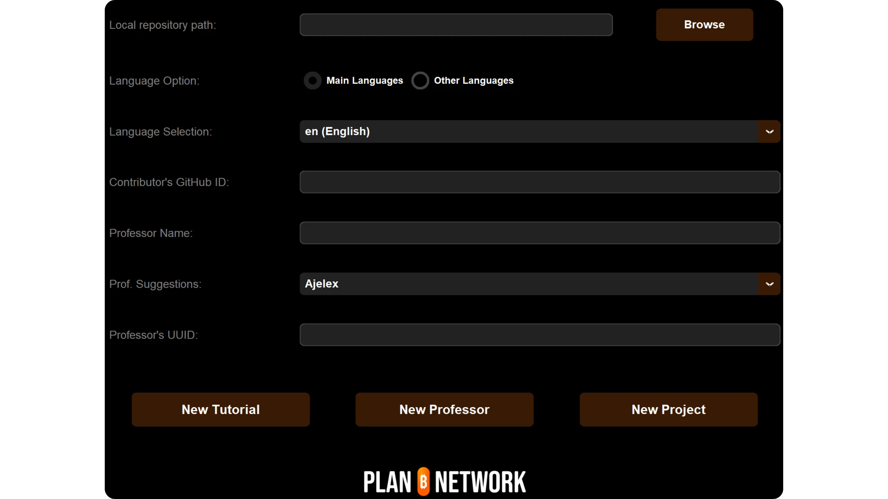
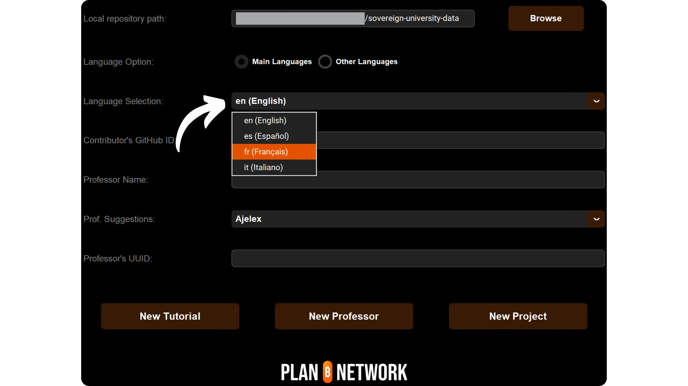

Før du følger denne veiledningen om hvordan du legger til en ny opplæring, må du ha gjennomført noen innledende trinn. Hvis du ikke har gjort det ennå, anbefaler jeg at du først leser denne introduksjonsveiledningen, og deretter kommer tilbake hit:

https://planb.network/tutorials/contribution/content/write-tutorials-4d142a6a-9127-4ffb-9e0a-5aba29f169e2
Det har du allerede gjort:


- Velg tema for veiledningen din;
- Kontaktet Plan ₿ Network-teamet via [Telegramgruppen] (https://t.me/PlanBNetwork_ContentBuilder) eller paolo@planb.network;
- Velg dine bidragsverktøy.

I denne veiledningen vil vi se hvordan du legger til opplæringen din på Plan ₿ Network ved å sette opp ditt lokale miljø med GitHub Desktop. Hvis du allerede er dyktig med Git, er denne veldig detaljerte opplæringen kanskje ikke nødvendig for deg. Jeg vil heller anbefale å lese denne andre veiledningen, der jeg bare presenterer de viktigste retningslinjene, uten detaljert trinnvis veiledning:


- Erfarne brukere**:

https://planb.network/tutorials/contribution/content/write-tutorials-git-expert-0ce1e490-c28f-4c51-b7e0-9a6ac9728410
Hvis du foretrekker å ikke sette opp ditt lokale miljø, kan du følge denne andre veiledningen for nybegynnere, der vi gjør endringene direkte via GitHubs webgrensesnitt:


- Nybegynnere (nettgrensesnitt)**:

https://planb.network/tutorials/contribution/content/write-tutorials-github-web-beginner-e64f8fed-4c0b-4225-9ebb-7fc5f1c01a79
## Forutsetninger

Programvare som kreves for å følge denne opplæringen:


- [GitHub Desktop] (https://desktop.github.com/);
- En markdown-filredigerer som [Obsidian] (https://obsidian.md/);
- En kodeditor ([VSC](https://code.visualstudio.com/) eller [Sublime Text](https://www.sublimetext.com/)).


Forutsetninger før du starter opplæringen:


- Har en [GitHub-konto] (https://github.com/signup);
- Ha en gaffel av [Plan ₿ Network source repository] (https://github.com/PlanB-Network/bitcoin-educational-content);
- Har [en professorprofil på Plan ₿ Network] (https://planb.network/professors) (bare hvis du foreslår en fullstendig veiledning).

Hvis du trenger hjelp med å skaffe deg disse forutsetningene, kan du få hjelp i de andre veiledningene mine:

https://planb.network/tutorials/contribution/others/create-github-account-a75fc39d-f0d0-44dc-9cd5-cd94aee0c07c
Når alt er på plass og det lokale miljøet ditt er riktig konfigurert med din egen gaffel av Plan ₿ Network, kan du begynne å legge til opplæringen.


## 1 - Opprett en ny filial

Åpne nettleseren din og gå til siden for din gaffel av Plan ₿ Network repository. Dette er gaffelen du har etablert på GitHub. URL-adressen til gaffelen din skal se slik ut: `https://github.com/[ditt-brukernavn]/bitcoin-educational-content`:


Sørg for at du er på hovedgrenen `dev`, og klikk deretter på `Sync fork`-knappen. Hvis gaffelen din ikke er oppdatert, vil GitHub tilby å oppdatere grenen din. Fortsett med denne oppdateringen. Hvis grenen din derimot allerede er oppdatert, vil GitHub informere deg om dette:


Åpne GitHub Desktop-programvaren og sørg for at gaffelen din er riktig valgt i øvre venstre hjørne av vinduet:


Klikk på knappen `Fetch origin`. Hvis det lokale depotet ditt allerede er oppdatert, vil GitHub Desktop ikke foreslå noen ytterligere tiltak. I motsatt fall vises alternativet `Pull origin`. Klikk på denne knappen for å oppdatere det lokale depotet:


Kontroller at du faktisk er på hovedgrenen `dev`:


Klikk på denne grenen, og klikk deretter på knappen Ny gren:


Sørg for at den nye grenen er basert på kildearkivet, nemlig `PlanB-Network/bitcoin-educational-content`.

Gi grenen et navn som tydeliggjør formålet med tittelen, og bruk bindestreker for å skille ordene fra hverandre. La oss for eksempel si at målet vårt er å skrive en veiledning om hvordan du bruker programvaren Sparrow Wallet. I dette tilfellet kan arbeidsgrenen som er dedikert til å skrive denne opplæringen få navnet: `tuto-sparrow-wallet-loic`. Når du har angitt et passende navn, klikker du på `Opprett gren` for å bekrefte opprettelsen av grenen:


Klikk nå på knappen `Publish branch` for å lagre den nye arbeidsgrenen i din online fork på GitHub:


Nå, på GitHub Desktop, bør du befinne deg på den nye grenen din. Dette betyr at alle endringer som gjøres lokalt på datamaskinen din, utelukkende vil bli lagret på denne spesifikke grenen. Så lenge denne grenen er valgt på GitHub Desktop, vil filene som er synlige lokalt på maskinen din også være filene til denne grenen (`tuto-sparrow-wallet-loic`), og ikke filene til hovedgrenen (`dev`).


For hver nye artikkel du ønsker å publisere, må du opprette en ny gren fra `dev`. En gren i Git er en parallell versjon av prosjektet, som gjør at du kan gjøre endringer uten at det påvirker hovedgrenen, inntil arbeidet er klart til å slås sammen.

## 2 - Legge til opplæringsfilene

Nå som arbeidsgrenen er opprettet, er det på tide å integrere den nye opplæringen. Du har to alternativer: Bruk Python-skriptet mitt, som automatiserer opprettelsen av de nødvendige dokumentene, eller opprett hver fil manuelt. Vi skal se på trinnene du må følge for hvert alternativ.

### Med Python-skriptet mitt

Du må installere på maskinen din:


- Python 3.8 eller nyere.

For å bruke skriptet må du navigere til mappen der det er lagret. Skriptet ligger i Plan ₿ Network data repository på banen: `bitcoin-educational-content/scripts/tutorial-related/data-creator`.

Når du er i mappen, installerer du avhengighetene:

```
pip install -r requirements.txt
```

Start deretter programvaren med kommandoen:

```
python3 main.py
```

Et grafisk brukergrensesnitt (GUI) åpnes. Første gang må du legge inn all nødvendig informasjon, men ved senere bruk vil skriptet huske dine personlige opplysninger, slik at du ikke trenger å legge dem inn på nytt.



Begynn med å angi den lokale banen til mappen `/tutorials` i det klonede depotet ditt (`.../bitcoin-educational-content/tutorials/`). Du kan skrive den inn manuelt eller klikke på "Bla gjennom"-knappen for å navigere ved hjelp av filutforskeren din.


Velg språket du vil skrive opplæringen på.



I feltet "Contributor's GitHub ID" skriver du inn GitHub-brukernavnet ditt.


Deretter må du fylle ut professorprofilen din. Det finnes flere alternativer:
- Skriv inn de første bokstavene i navnet ditt i feltet "Professor Name". Navnet ditt vil da vises i rullegardinlisten "Prof. Suggestions" nedenfor. Velg det ved å klikke på det;
- Alternativt kan du klikke direkte på rullegardinlisten "Prof. Suggestions" og velge professorens navn.

Denne handlingen vil automatisk fylle inn din professor-UUID i det tilsvarende feltet.


Hvis du ikke har en professorprofil ennå, kan du ta en titt på denne veiledningen:

https://planb.network/tutorials/contribution/others/create-teacher-profile-8ba9ba49-8fac-437a-a435-c38eebc8f8a4
Klikk deretter på knappen "Ny opplæring".


Velg en hovedkategori for opplæringen din. Deretter velger du en relevant underkategori basert på den valgte hovedkategorien.


Bestem vanskelighetsgraden for opplæringen.


Velg et navn på katalogen som er opprettet spesielt for opplæringen. Navnet på denne mappen bør gjenspeile programvaren som dekkes i opplæringen, og du bør bruke bindestreker for å skille ordene fra hverandre. Mappen kan for eksempel hete `red-wallet`:


Prosjekt-ID er UUID-en til selskapet eller organisasjonen som står bak verktøyet som dekkes i opplæringen, tilgjengelig [i listen over prosjekter] (https://github.com/PlanB-Network/bitcoin-educational-content/tree/dev/resources/projects). For eksempel, for en veiledning om Sparrow Wallet, kan du finne `project_id` i filen: `bitcoin-educational-content/resources/projects/sparrow/project.yml`. Denne informasjonen legges til i YAML-filen til opplæringen din fordi Plan ₿ Network opprettholder en database over selskaper og organisasjoner som er aktive i Bitcoin eller relaterte prosjekter. Ved å legge til den tilknyttede `project_id`, kobler du innholdet ditt til den relevante enheten.

***Oppdatering: *** I den nye versjonen av skriptet trenger du ikke lenger å skrive inn `project_id` manuelt. Det er lagt til en søkefunksjon som finner prosjektet etter navn og automatisk henter det tilsvarende `project_id`. Skriv inn begynnelsen av prosjektets navn i feltet "Project Name" for å søke etter det, og velg deretter ønsket selskap fra rullegardinmenyen. Prosjektnummeret fylles automatisk ut i feltet nedenfor. Du kan også skrive det inn manuelt om nødvendig.


For tagger velger du to eller tre relevante nøkkelord som er relatert til opplæringsinnholdet ditt, og du velger utelukkende fra [Plan ₿ Network tag list] (https://github.com/PlanB-Network/bitcoin-educational-content/blob/dev/docs/50-planb-tags.md). Programvaren har også en søkefunksjon for nøkkelord med en nedtrekksliste.


Når all informasjon er lagt inn og bekreftet, klikker du på "Opprett opplæring" for å bekrefte opprettelsen av opplæringsfilene. Opplæringsmappen og alle nødvendige filer i den valgte kategorien genereres lokalt.


Du kan nå hoppe over underavsnittet "Uten Python-skriptet mitt" og trinn 3, "Fyll inn YAML-filen", siden skriptet allerede har utført disse handlingene for deg. Gå direkte til trinn 4 og begynn å skrive opplæringen.

Hvis du vil ha mer informasjon om dette Python-skriptet, kan du også lese [README] (https://github.com/PlanB-Network/bitcoin-educational-content/blob/dev/scripts/tutorial-related/new-tutorial-creation/README.md).

### Uten Python-skriptet mitt

Åpne filbehandleren og naviger til mappen `bitcoin-educational-content`, som representerer den lokale klonen av repositoriet ditt. Du finner den vanligvis under `Documents\GitHub\bitcoin-educational-content`.

I denne katalogen må du finne den riktige undermappen for plassering av opplæringen. Mappeorganiseringen gjenspeiler de ulike delene av Plan ₿ Network-nettstedet. I vårt eksempel, siden vi ønsker å legge til en veiledning om Sparrow Wallet, bør vi navigere til følgende sti: `bitcoin-educational-content\tututorials\wallet`, som tilsvarer `WALLET`-delen på nettstedet:


I mappen `wallet` må du opprette en ny mappe som er spesielt dedikert til opplæringen din. Navnet på denne mappen skal minne om programvaren som dekkes i opplæringen, og du må sørge for å koble sammen ord med bindestreker. I mitt eksempel vil mappen hete `sparrow-wallet`:


I denne nye undermappen som er dedikert til opplæringen din, må du legge til flere elementer:


- Opprett en mappe med `assets`, som skal inneholde alle illustrasjonene som er nødvendige for opplæringen;
- I denne `assets`-mappen må du opprette en undermappe som er navngitt i henhold til originalspråket for opplæringen. Hvis opplæringen for eksempel er skrevet på engelsk, må denne undermappen hete `en`. Plasser alt det visuelle materialet i opplæringen der (diagrammer, bilder, skjermbilder osv.).
- En `tutorial.yml`-fil må opprettes for å registrere detaljene knyttet til opplæringen;
- Det skal opprettes en fil i markdown-format for å skrive det faktiske innholdet i opplæringen. Denne filen må ha en tittel som samsvarer med språkkoden for det som skrives. For eksempel må filen hete `fr.md` for en veiledning som er skrevet på fransk.


For å oppsummere, her er hierarkiet av filer som skal opprettes:

```
bitcoin-educational-content/
└── tutorials/
└── wallet/ (to be modified with the correct category)
└── sparrow-wallet/ (to be modified with the name of the tutorial)
├── assets/
│   ├── en/ (to be modified according to the appropriate language code)
├── tutorial.yml
└── en.md (to be modified according to the appropriate language code)
```

## 3 - Fyll inn YAML-filen

Fyll ut filen `tutorial.yml` ved å kopiere følgende mal:

```
id: 

project_id: 

tags:
  - 
  - 
  - 

category: 

level: 

professor_id:

# Proofreading metadata

original_language:
proofreading:
  - language: 
    last_contribution_date:
    urgency:
    contributor_names:
      - 
    reward:
```

Her er de obligatoriske feltene:

- **id** : En UUID (_Universally Unique Identifier_) som unikt identifiserer veiledningen. Du kan generere den med [et nettbasert verktøy](https://www.uuidgenerator.net/version4). Det eneste kravet er at denne UUID-en er tilfeldig for å unngå konflikter med en annen UUID på plattformen;

- **project_id** : UUID-en til selskapet eller organisasjonen bak verktøyet som presenteres i veiledningen [fra prosjektlisten](https://github.com/PlanB-Network/bitcoin-educational-content/tree/dev/resources/projects). For eksempel, hvis du lager en veiledning om Green Wallet-programvaren, kan du finne denne `project_id` i følgende fil: `bitcoin-educational-content/resources/projects/blockstream/project.yml`. Denne informasjonen legges til i YAML-filen til veiledningen din fordi Plan ₿ Network vedlikeholder en database over alle selskaper og organisasjoner som opererer på Bitcoin eller relaterte prosjekter. Ved å legge til `project_id` tilknyttet veiledningen din, oppretter du en kobling mellom de to elementene;

- **tags** : 2 eller 3 relevante stikkord relatert til veiledningens innhold, valgt utelukkende [fra Plan ₿ Network tag-listen](https://github.com/PlanB-Network/bitcoin-educational-content/blob/dev/docs/50-planb-tags.md);

- **category** : Underkategorien som tilsvarer innholdet i veiledningen, i henhold til strukturen på Plan ₿ Network-nettstedet (for eksempel for lommebøker: `desktop`, `hardware`, `mobile`, `backup`);

- **level** : Vanskelighetsnivået for veiledningen, valgt blant:
    - `beginner`
    - `intermediate`
    - `advanced`
    - `expert`

- **professor_id** : Din `professor_id` (UUID) som vist på [din professorprofil](https://github.com/PlanB-Network/bitcoin-educational-content/tree/dev/professors);

- **original_language** : Det opprinnelige språket for veiledningen (f.eks. `fr`, `en`, etc.);

- **proofreading** : Informasjon om korrekturprosessen. Fullfør den første delen, da korrekturlesing av din egen veiledning regnes som en første validering:
    - **language** : Språkkoden for korrekturlesing (f.eks. `fr`, `en`, etc.).
    - **last_contribution_date** : Dagens dato.
    - **urgency** : 1
    - **contributor_names** : Din GitHub-ID.
    - **reward** : 0

For mer informasjon om lærer-ID-en din, se den tilhørende veiledningen :

https://planb.network/tutorials/contribution/others/create-teacher-profile-8ba9ba49-8fac-437a-a435-c38eebc8f8a4

```
id: e84edaa9-fb65-48c1-a357-8a5f27996143

project_id: 3b2f45e6-d612-412c-95ba-cf65b49aa5b8

tags:
  - wallets
  - software
  - keys

category: mobile

level: beginner

professor_id: 6516474c-c190-41f2-b2ab-3d452ce7bdf0

# Proofreading metadata

original_language: fr
proofreading:
  - language: fr
    last_contribution_date: 2024-11-20
    urgency: 1
    contributor_names:
      - LoicPandul
    reward: 0
```

Når du er ferdig med å endre filen `tutorial.yml`, lagrer du dokumentet ved å klikke på `File > Save`:


Du kan nå lukke kodeditoren.

## 4 - Fyll ut Markdown-filen

Nå kan du åpne filen som skal være vert for opplæringen din, navngitt med koden til språket ditt, for eksempel `fr.md`. Gå til Obsidian, på venstre side av vinduet, og bla gjennom mappetreet til du finner mappen for opplæringen og filen du leter etter:


Klikk på filen for å åpne den:


Vi begynner med å fylle ut `Properties`-delen øverst i dokumentet.


Legg til og fyll inn følgende kodeblokk manuelt:

```
---
name: [Title]
description: [Description]
---
```


Skriv inn navnet på opplæringen og en kort beskrivelse av den:


Deretter legger du til banen til forsidebildet i begynnelsen av opplæringen. For å gjøre dette, merk:

```

```

Denne syntaksen er nyttig når det er nødvendig å legge til et bilde i opplæringen. Utropstegnet indikerer at det er et bilde, med den alternative teksten (alt) spesifisert mellom parentesene. Stien til bildet er angitt mellom parentesene:


## 5 - Legg til logo og omslag

I mappen `assets` må du legge til en fil med navnet `logo.webp`, som skal fungere som et miniatyrbilde for artikkelen din. Dette bildet må være i `.webp`-format og må ha en kvadratisk dimensjon for å harmonere med brukergrensesnittet. Du kan fritt velge logoen til programvaren som omtales i veiledningen, eller et annet relevant bilde, forutsatt at det er rettighetsfritt. I tillegg må du også legge til et bilde med tittelen `cover.webp` på samme sted. Dette bildet vil vises øverst i opplæringen. Sørg for at dette bildet, i likhet med logoen, respekterer bruksrettighetene og er egnet for konteksten i opplæringen:

## 6 - Skrive veiledningen og legge til grafikk

Fortsett å skrive veiledningen ved å utarbeide innholdet. Når du vil integrere en undertittel, bruker du riktig markdown-formatering ved å sette `##` foran teksten:


Undermappen Language i mappen `assets` brukes til å lagre diagrammer og bilder som skal følge med opplæringen. Unngå så langt det er mulig å inkludere tekst i bildene for å gjøre innholdet tilgjengelig for et internasjonalt publikum. Programvaren som presenteres, vil selvfølgelig inneholde tekst, men hvis du legger til diagrammer eller ytterligere indikasjoner på skjermbilder av programvaren, bør du gjøre det uten tekst eller, hvis det viser seg å være uunnværlig, bruke engelsk.


Når du skal navngi bildene dine, bruker du ganske enkelt numre som tilsvarer rekkefølgen de vises i i opplæringen, formatert med to sifre (eller tre sifre hvis opplæringen inneholder mer enn 99 bilder). Gi for eksempel det første bildet navnet `01.webp`, det andre `02.webp`, og så videre.

Bildene dine må utelukkende være i `.webp`-format. Om nødvendig kan du bruke [my image conversion software] (https://github.com/LoicPandul/ImagesConverter).


For å sette inn et diagram i dokumentet bruker du følgende Markdown-kommando, og sørger for å angi riktig alternativ tekst samt riktig bane for bildet:

```

```

Utropstegnet i begynnelsen indikerer at det er et bilde. Den alternative teksten, som bidrar til tilgjengelighet og SEO, er plassert mellom parentesene. Til slutt er stien til bildet angitt mellom parentesene.

Hvis du ønsker å lage dine egne diagrammer, må du sørge for å følge Plan ₿ Network sitt grafiske charter for å sikre visuell konsistens:


- Skrifttype**: Bruk [Rubik] (https://fonts.google.com/specimen/Rubik);
- Farger**:
 - Oransje: #FF5C00
 - Svart: #000000
 - Hvit: #FFFFFFFF

**Det er viktig at alle bilder som er integrert i opplæringsvideoene dine er fri for rettigheter eller respekterer lisensen til kildefilen**. Alle diagrammer som publiseres på Plan ₿ Network, gjøres også tilgjengelige under CC-BY-SA-lisensen, på samme måte som teksten.

**-> Tips:** Når du deler filer offentlig, for eksempel bilder, er det viktig å fjerne unødvendige metadata. Disse kan inneholde sensitiv informasjon, for eksempel stedsdata, dato for opprettelse eller informasjon om opphavspersonen. For å beskytte personvernet ditt er det lurt å slette disse metadataene. For å forenkle denne prosessen kan du bruke spesialiserte verktøy som [Exif Cleaner] (https://exifcleaner.com/), som gjør det mulig å rense metadataene i et dokument ved hjelp av enkel dra-og-slipp-funksjon.

## 7 - Lagre og send inn opplæringen

Når du er ferdig med å skrive opplæringen din på det språket du ønsker, er neste trinn å sende inn en **Pull Request**. Administratoren vil deretter sørge for å legge til eventuelle manglende oversettelser av opplæringen din, takket være vår automatiserte oversettelsesmetode med menneskelig gjennomgang.

For å fortsette med Pull Request, åpner du GitHub Desktop-programvaren. Programvaren bør automatisk oppdage endringene du har gjort lokalt på grenen din sammenlignet med det opprinnelige depotet. Før du fortsetter, sjekk nøye på venstre side av grensesnittet at disse endringene stemmer overens med det du forventet:


Legg til en tittel for overføringen, og klikk deretter på den blå knappen `Commit to [your branch]` for å validere endringene:


En commit er en lagring av endringene som er gjort i grenen, ledsaget av en beskrivende melding, som gjør det mulig å følge utviklingen av et prosjekt over tid. Det er et slags mellomliggende sjekkpunkt.

Klikk deretter på `Push origin`-knappen. Dette vil sende din commit til din fork:


Hvis du ikke er ferdig med opplæringen, kan du komme tilbake til den senere og gjøre nye commits. Hvis du er ferdig med endringene for denne grenen, klikker du nå på knappen `Preview Pull Request`:


Du kan sjekke en siste gang at endringene dine er korrekte, og deretter klikke på knappen `Create pull request`:


En Pull Request er en forespørsel om å integrere endringene fra din gren til hovedgrenen i Plan ₿ Network-arkivet, noe som gjør det mulig å gå gjennom og diskutere endringene før de slås sammen.

Du vil automatisk bli omdirigert til din nettleser på GitHub til forberedelsessiden for din Pull Request:


Angi en tittel som kort oppsummerer endringene du ønsker å slå sammen med kildelageret. Legg til en kort kommentar som beskriver endringene (hvis du har et problemnummer knyttet til opprettelsen av opplæringen, må du huske å notere i kommentaren `Lukker #{problemnummer}`), og klikk deretter på den grønne knappen `Opprett pull-forespørsel` for å bekrefte fletteforespørselen:


PR-en din vil da være synlig i fanen `Pull Request` i hovedregisteret Plan ₿ Network. Alt du trenger å gjøre er å vente til en administrator kontakter deg for å bekrefte sammenslåingen av bidraget ditt eller for å be om ytterligere endringer.


Etter at PR-en din har blitt slått sammen med hovedgrenen, anbefales det å slette arbeidsgrenen din (`tuto-sparrow-wallet`) for å opprettholde en ren historikk på gaffelen din. GitHub vil automatisk tilby deg dette alternativet på PR-siden din:


På GitHub Desktop-programvaren kan du bytte tilbake til hovedgrenen til gaffelen din (`dev`).


Hvis du ønsker å gjøre endringer i bidraget ditt etter at du allerede har sendt inn PR-en, avhenger fremgangsmåten av hvor langt PR-en din er kommet:


- Hvis PR-en din fortsatt er åpen og ennå ikke har blitt slått sammen, kan du gjøre endringene lokalt mens du holder deg på samme gren. Når endringene er ferdige, bruker du `Push origin`-knappen for å legge til en ny forpliktelse til den fortsatt åpne PR-en;
- Hvis PR-en din allerede har blitt slått sammen med hovedgrenen, må du starte prosessen på nytt ved å opprette en ny gren og deretter sende inn en ny PR. Sørg for at det lokale depotet ditt er synkronisert med Plan ₿ Network-kilderegisteret før du fortsetter.

Hvis du støter på tekniske problemer med å sende inn opplæringen din, ikke nøl med å be om hjelp på [vår dedikerte Telegram-gruppe for bidrag] (https://t.me/PlanBNetwork_ContentBuilder). Takk skal du ha!


