Прежде чем следовать этому руководству по добавлению нового учебника, вы должны выполнить несколько предварительных шагов. Если вы еще не сделали этого, я приглашаю вас сначала ознакомиться с этим вводным уроком, а затем вернуться сюда:

https://planb.network/tutorials/contribution/content/write-tutorials-4d142a6a-9127-4ffb-9e0a-5aba29f169e2
Вы уже сделали это:


- Выберите тему вашего учебника;
- Свяжитесь с командой Plan ₿ Network через [группу Telegram](https://t.me/PlanBNetwork_ContentBuilder) или paolo@planb.network;
- Выберите инструменты для внесения вклада.

В этом уроке мы рассмотрим, как добавить свой учебник в Plan ₿ Network, настроив локальную среду с помощью GitHub Desktop. Если вы уже умеете работать с Git, то этот очень подробный учебник может вам не понадобиться. Я бы рекомендовал обратиться к другому руководству, в котором я излагаю только основные принципы, без подробных пошаговых инструкций:


- Опытные пользователи**:

https://planb.network/tutorials/contribution/content/write-tutorials-git-expert-0ce1e490-c28f-4c51-b7e0-9a6ac9728410
Если вы предпочитаете не настраивать локальное окружение, следуйте другому руководству, предназначенному для новичков, где мы вносим изменения непосредственно через веб-интерфейс GitHub:


- Новички (веб-интерфейс)**:

https://planb.network/tutorials/contribution/content/write-tutorials-github-web-beginner-e64f8fed-4c0b-4225-9ebb-7fc5f1c01a79
## Пререквизиты

Программное обеспечение, необходимое для выполнения данного руководства:


- [GitHub Desktop](https://desktop.github.com/);
- Редактор файлов в формате markdown, например [Obsidian](https://obsidian.md/);
- Редактор кода ([VSC](https://code.visualstudio.com/) или [Sublime Text](https://www.sublimetext.com/)).


Прежде чем приступить к изучению учебника, необходимо выполнить предварительные условия:


- Иметь аккаунт [GitHub](https://github.com/signup);
- Сделайте форк репозитория [Plan ₿ Network source repository](https://github.com/PlanB-Network/bitcoin-educational-content);
- Иметь [профиль профессора в Plan ₿ Network](https://planb.network/professors) (только если вы предлагаете полное учебное пособие).

Если вам нужна помощь в получении этих необходимых условий, вам помогут другие мои учебники:

https://planb.network/tutorials/others/contribution/basics-of-github-471f7f00-8b5a-4b63-abb1-f1528b032bbb
Как только все будет готово и в вашем локальном окружении будет правильно настроен ваш собственный форк Plan ₿ Network, вы сможете приступить к добавлению учебника.

## 1 - Создайте новую ветку

Откройте браузер и перейдите на страницу вашего форка репозитория Plan ₿ Network. Это форк, который вы создали на GitHub. URL-адрес вашего форка должен выглядеть следующим образом: `https://github.com/[ваше имя пользователя]/bitcoin-educational-content`:

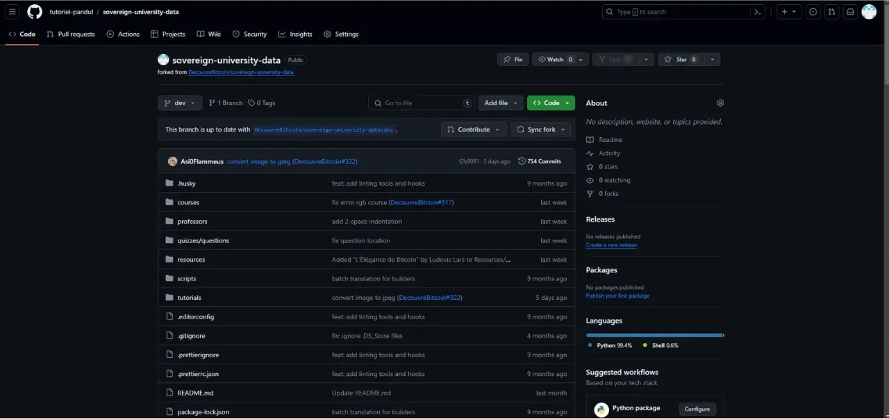

Убедитесь, что вы находитесь на основной ветке `dev`, затем нажмите на кнопку `Sync fork`. Если ваш форк не обновлен, GitHub предложит обновить вашу ветку. Выполните это обновление. Если же, наоборот, ваша ветка уже обновлена, GitHub сообщит вам об этом:

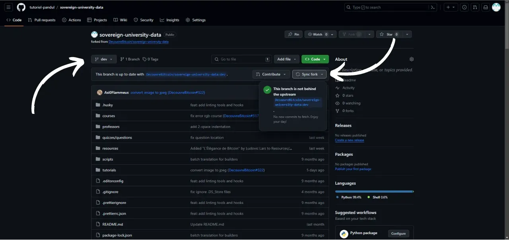

Откройте программу GitHub Desktop и убедитесь, что ваш форк правильно выбран в левом верхнем углу окна:


Нажмите на кнопку `Fetch origin`. Если ваш локальный репозиторий уже обновлен, GitHub Desktop не предложит никаких дополнительных действий. В противном случае появится опция `Pull origin`. Нажмите на эту кнопку, чтобы обновить локальный репозиторий:


Убедитесь, что вы действительно находитесь в основной ветке `dev`:

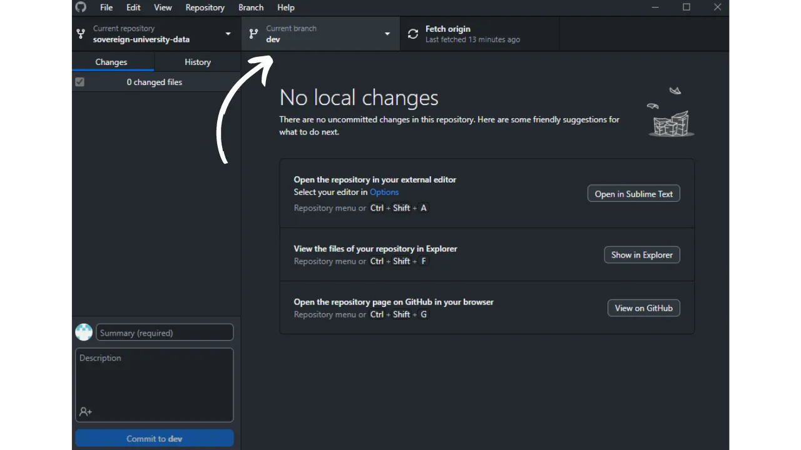

Выберите эту ветку, затем нажмите на кнопку `Новая ветка`:


Убедитесь, что новая ветка основана на исходном репозитории, а именно `PlanB-Network/bitcoin-educational-content`.

Назовите свою ветку так, чтобы из названия была понятна ее цель, используя тире для разделения каждого слова. Например, допустим, наша цель - написать учебник по использованию программного обеспечения Sparrow Wallet. В этом случае рабочую ветку, предназначенную для написания этого руководства, можно назвать: `tuto-sparrow-wallet-loic`. После ввода подходящего имени нажмите на `Создать ветку`, чтобы подтвердить создание ветки:


Теперь нажмите на кнопку `Publish branch`, чтобы сохранить новую рабочую ветку в вашем онлайн форке на GitHub:

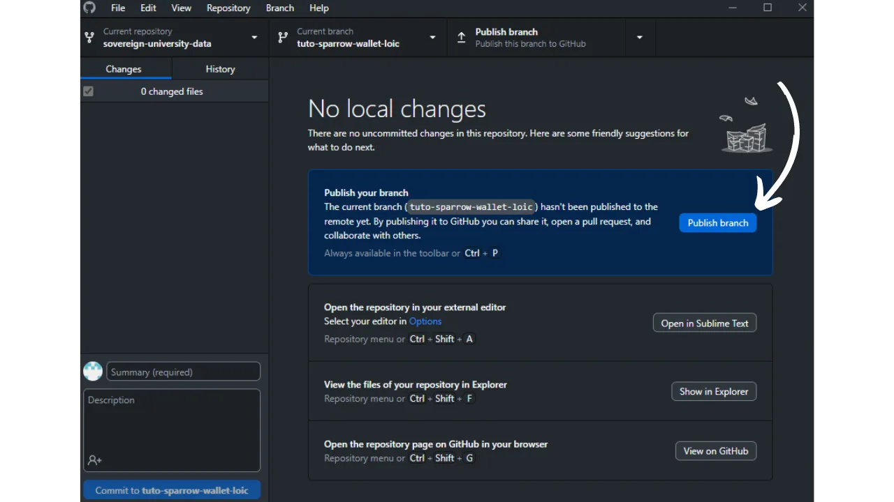

Теперь на рабочем столе GitHub вы должны оказаться в новой ветке. Это означает, что все изменения, сделанные локально на вашем компьютере, будут сохраняться исключительно в этой ветке. Кроме того, пока эта ветка остается выбранной на GitHub Desktop, файлы, видимые локально на вашем компьютере, соответствуют файлам этой ветки (`tuto-sparrow-wallet-loic`), а не основной ветки (`dev`).

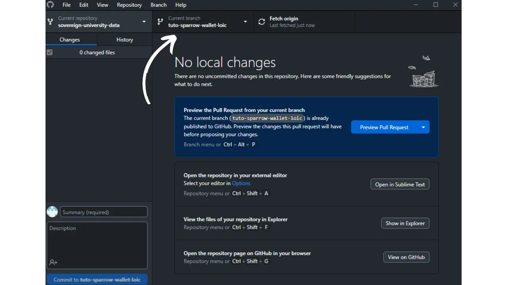

Для каждой новой статьи, которую вы хотите опубликовать, вам нужно будет создавать новую ветку из `dev`. Ветка в Git - это параллельная версия проекта, которая позволяет вносить изменения, не затрагивая основную ветку, пока работа не будет готова к слиянию.

## 2 - Добавление обучающих файлов

Теперь, когда рабочая ветка создана, пришло время интегрировать ваш новый учебник. У вас есть два варианта: использовать мой Python-скрипт, который автоматизирует создание необходимых документов, или создать каждый файл вручную. Мы рассмотрим шаги, которые необходимо выполнить для каждого варианта.

### С помощью моего скрипта Python

Вам необходимо установить его на свою машину:


- Python 3.8 или выше.

Чтобы использовать сценарий, перейдите в папку, где он хранится. Скрипт находится в хранилище данных Plan ₿ Network по пути: `bitcoin-educational-content/scripts/tutorial-related/data-creator`.

Попав в папку, установите все необходимые компоненты:

```
pip install -r requirements.txt
```

Затем запустите программу командой:

```
python3 main.py
```

Откроется графический интерфейс пользователя (GUI). В первый раз вам нужно будет ввести всю необходимую информацию, но при последующих использованиях скрипт запомнит ваши личные данные, и вам не придется вводить их снова.

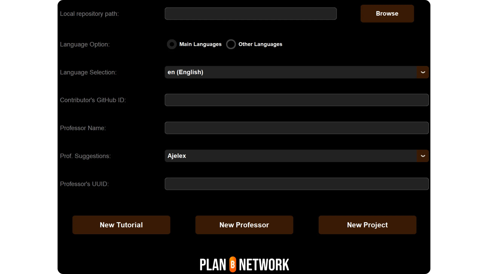

Начните с ввода локального пути к папке `/tutorials` в вашем клонированном репозитории (`.../bitcoin-educational-content/tutorials/`). Вы можете ввести его вручную или нажать кнопку "Обзор", чтобы перейти с помощью проводника файлов.

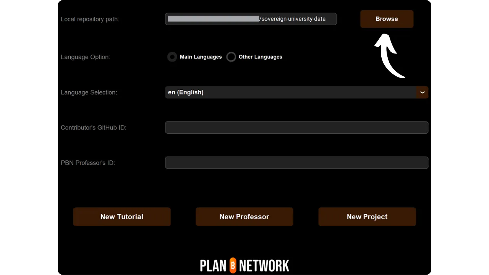

Выберите язык, на котором вы будете писать учебник.

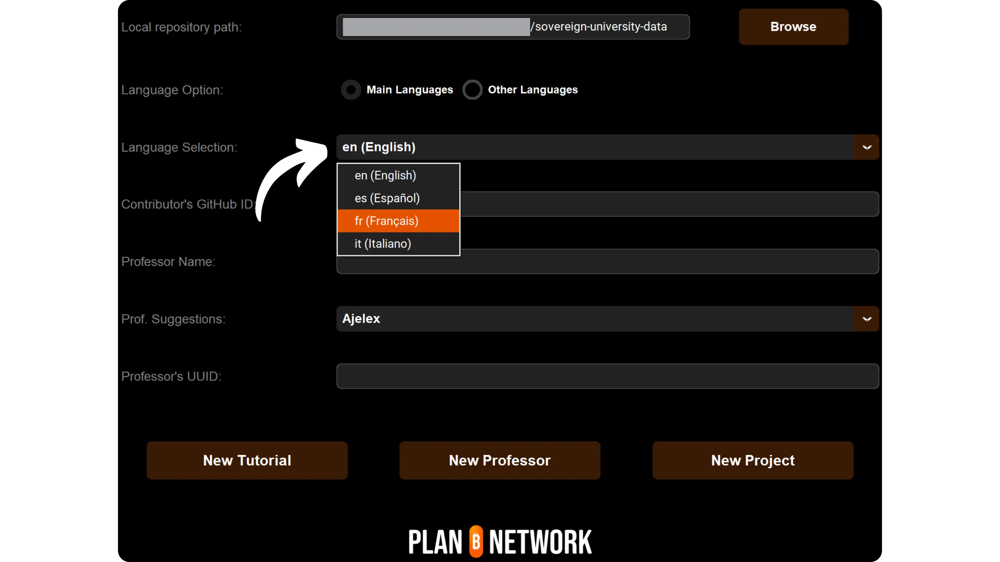

В поле "GitHub ID контрибьютора" введите свое имя пользователя GitHub.

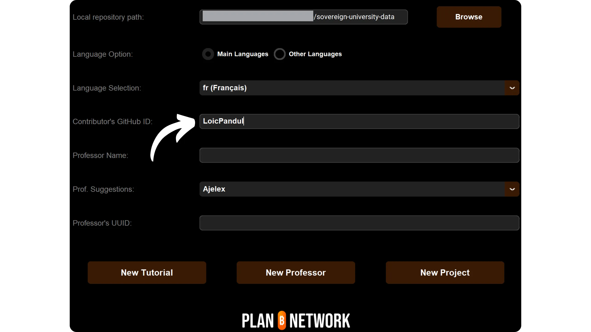

В поле "ID профессора PBN" введите свой идентификатор, используя слова из списка BIP39, как он отображается в [профиле вашего профессора](https://github.com/PlanB-Network/bitcoin-educational-content/tree/dev/professors).

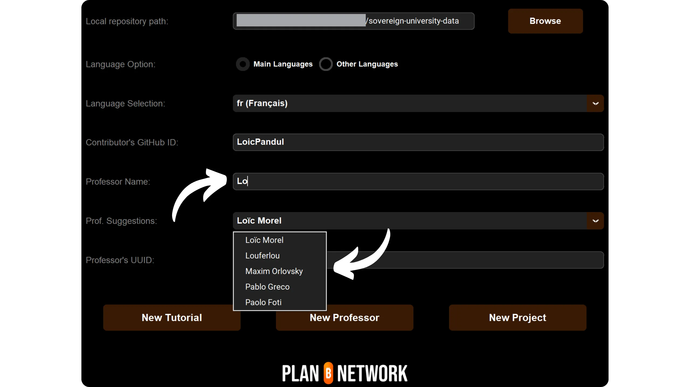

Если у вас еще нет профиля профессора, ознакомьтесь с этим руководством:

https://planb.network/tutorials/contribution/others/create-teacher-profile-8ba9ba49-8fac-437a-a435-c38eebc8f8a4
Затем нажмите кнопку "Новый учебник".

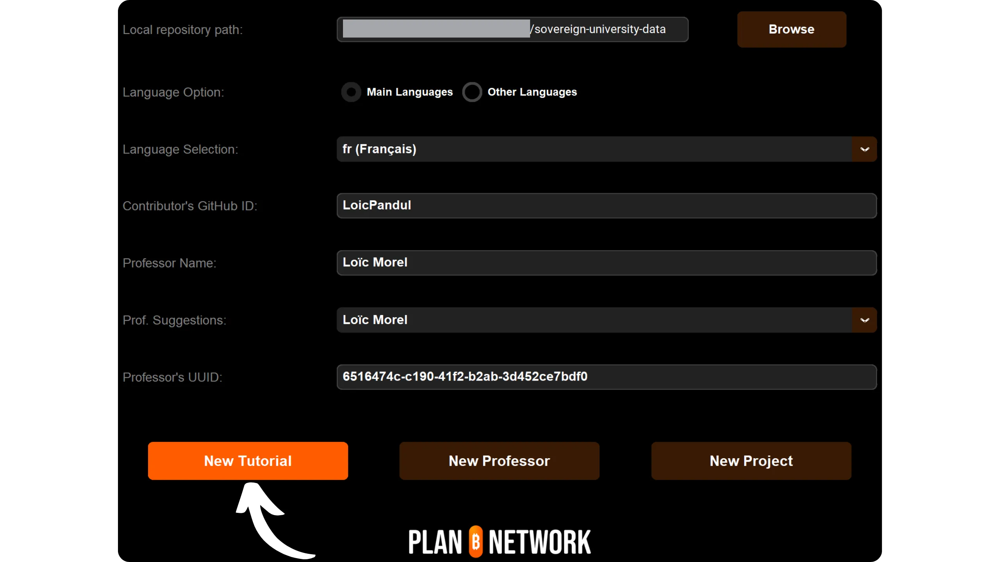

Выберите основную категорию для своего учебника. Затем выберите соответствующую подкатегорию, основанную на выбранной вами основной категории.

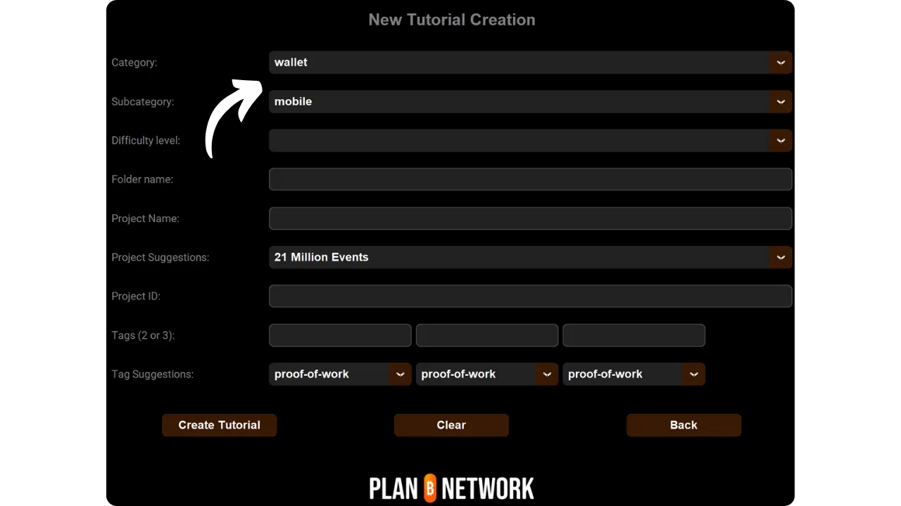

Определите уровень сложности учебника.

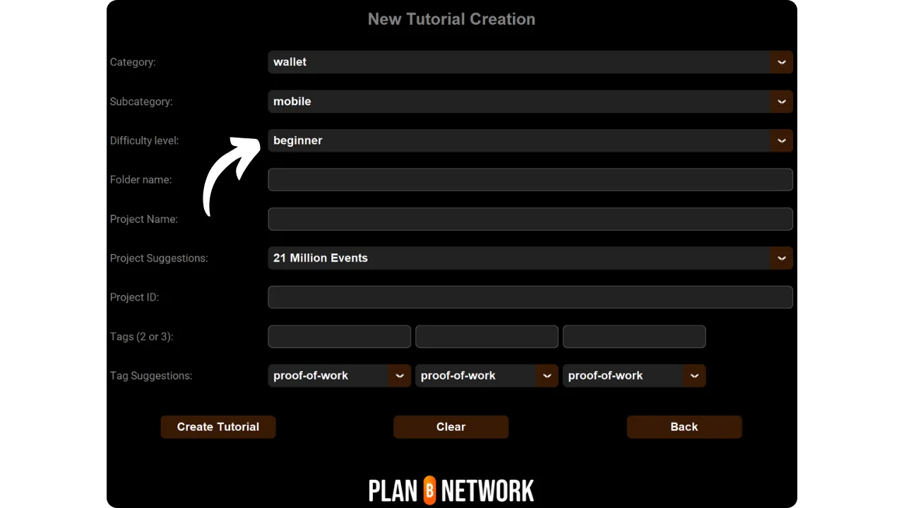

Выберите имя для папки, созданной специально для вашего учебника. Имя этой папки должно отражать программное обеспечение, рассматриваемое в учебнике, с использованием дефисов для разделения слов. Например, папка может называться `red-wallet`:

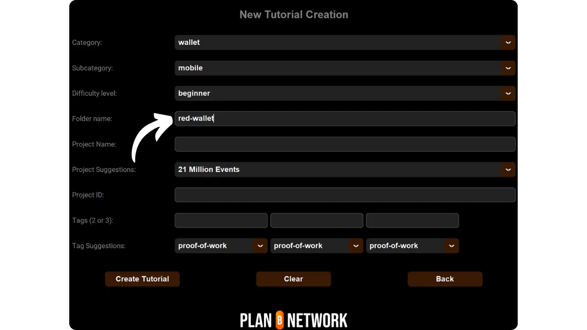

`project_id` - это UUID компании или организации, стоящей за инструментом, о котором идет речь в учебнике, доступный [в списке проектов](https://github.com/PlanB-Network/bitcoin-educational-content/tree/dev/resources/projects). Например, для учебника по кошельку Sparrow Wallet вы можете найти его `project_id` в файле: `bitcoin-educational-content/resources/projects/sparrow/project.yml`. Эта информация добавляется в YAML-файл вашего учебника, потому что Plan ₿ Network ведет базу данных компаний и организаций, активно работающих с Биткойном или связанными с ним проектами. Добавляя соответствующий `project_id`, вы связываете свой контент с соответствующей организацией.

***Обновление:*** В новой версии скрипта вам больше не нужно вручную вводить `project_id`. Была добавлена функция поиска, которая позволяет найти проект по названию и автоматически получить соответствующий `project_id`. Введите начало названия проекта в поле "Название проекта", чтобы найти его, а затем выберите нужную компанию из выпадающего меню. Значение `project_id` будет автоматически заполнено в поле ниже. При необходимости вы также можете ввести его вручную.

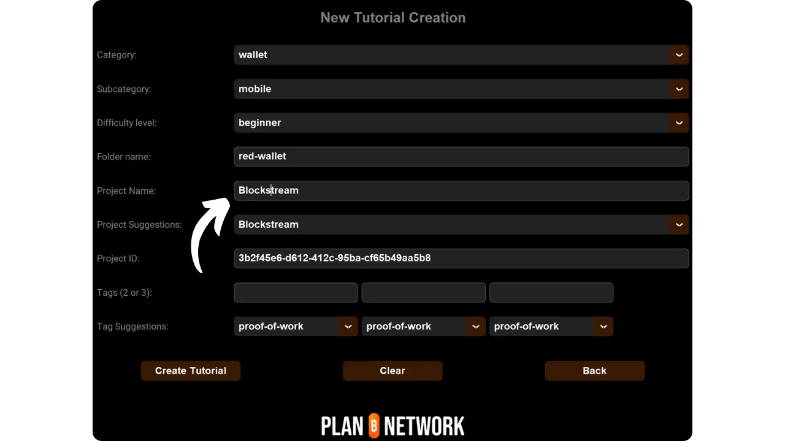

Для тегов выберите 2 или 3 релевантных ключевых слова, связанных с содержанием вашего учебника, выбирая их исключительно из [списка тегов Plan ₿ Network](https://github.com/PlanB-Network/bitcoin-educational-content/blob/dev/docs/50-planb-tags.md). В программе также предусмотрена функция поиска ключевых слов с помощью выпадающего списка.

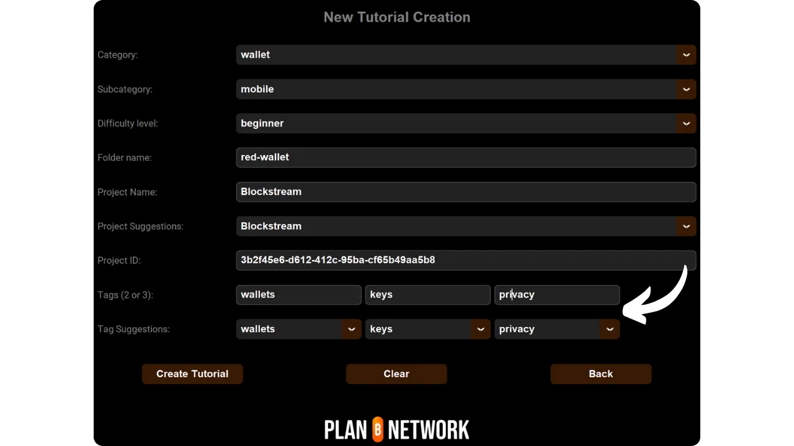

Когда вся информация будет введена и проверена, нажмите кнопку "Создать учебник", чтобы подтвердить создание файлов учебника. В результате папка с учебником и все необходимые файлы в выбранной категории будут созданы локально.


Теперь вы можете пропустить подраздел "Без моего Python-скрипта", а также шаг 3 "Заполнение YAML-файла", поскольку скрипт уже выполнил эти действия за вас. Переходите непосредственно к шагу 4 и начинайте писать свой учебник.

Для получения дополнительной информации об этом Python-скрипте вы можете также ознакомиться с [README](https://github.com/PlanB-Network/bitcoin-educational-content/blob/dev/scripts/tutorial-related/new-tutorial-creation/README.md).

### Без моего скрипта Python

Откройте файловый менеджер и перейдите в папку `bitcoin-educational-content`, которая представляет собой локальный клон вашего репозитория. Обычно она находится в папке `Documents\GitHub\bitcoin-educational-content`.

В этой папке вам нужно найти соответствующую подпапку для размещения вашего учебника. Организация папок отражает различные разделы сайта Plan ₿ Network. В нашем примере, поскольку мы хотим добавить учебник по кошельку Sparrow, нам следует перейти по следующему пути: `bitcoin-educational-content\tutorials\wallet`, что соответствует разделу `WALLET` на сайте:


В папке `wallet` необходимо создать новую директорию, специально предназначенную для вашего учебника. Название этой папки должно напоминать о программном обеспечении, о котором пойдет речь в учебнике, обязательно соединяя слова тире. В моем примере папка будет называться `parrow-wallet`:

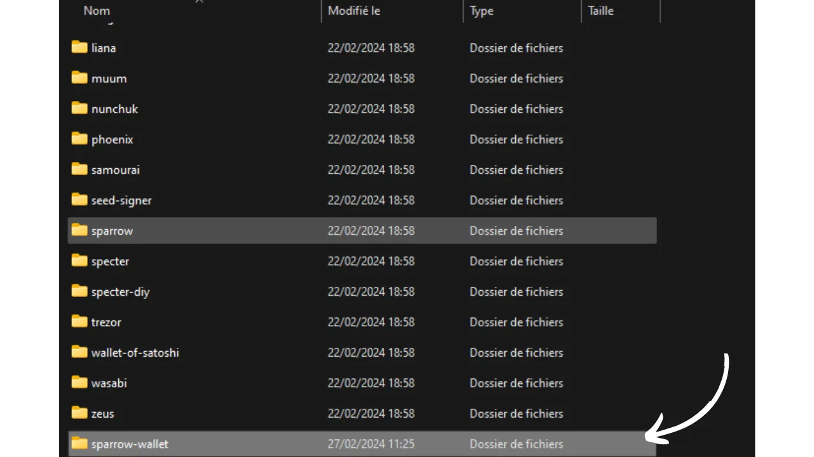

В эту новую папку, посвященную вашему учебнику, нужно добавить несколько элементов:


- Создайте папку `assets`, в которую будут помещены все иллюстрации, необходимые для вашего учебника;
- В этой папке `assets` необходимо создать подпапку, названную в соответствии с кодом языка, на котором написан учебник. Например, если учебник написан на английском языке, эта папка должна называться `en`. Поместите туда все визуальные материалы учебника (диаграммы, изображения, скриншоты и т.д.).
- Файл `tutorial.yml` должен быть создан для записи деталей, связанных с вашим учебным пособием;
- Необходимо создать файл в формате markdown для написания фактического содержания вашего учебника. Этот файл должен быть озаглавлен в соответствии с кодом языка, на котором он написан. Например, для учебника, написанного на французском языке, файл должен называться `fr.md`.


Вкратце, вот иерархия файлов, которые нужно создать:

```
bitcoin-educational-content/
└── tutorials/
└── wallet/ (to be modified with the correct category)
└── sparrow-wallet/ (to be modified with the name of the tutorial)
├── assets/
│   ├── en/ (to be modified according to the appropriate language code)
├── tutorial.yml
└── en.md (to be modified according to the appropriate language code)
```

## 3 - Заполните файл YAML

Заполните файл `tutorial.yml`, скопировав следующий шаблон:

```
id:
project_id:
tags:
-
-
-
category:
level:
credits:
professor:
# Proofreading metadata
original_language:
proofreading:
- language:
last_contribution_date:
urgency:
contributors_id:
-
reward:
```

Вот подробная информация об обязательных полях:


- id**: UUID (_Universally Unique Identifier_) для уникальной идентификации учебника. Вы можете сгенерировать его с помощью [онлайн-инструмента](https://www.uuidgenerator.net/version4). Единственное требование - чтобы этот UUID был случайным, чтобы избежать конфликта с другим UUID на платформе;
- project_id**: UUID компании или организации, стоящей за инструментом, представленным в учебнике [из списка проектов] (https://github.com/PlanB-Network/bitcoin-educational-content/tree/dev/resources/projects). Например, если вы создаете учебник по программному обеспечению Sparrow Wallet, вы можете найти этот `project_id` в следующем файле: `bitcoin-educational-content/resources/projects/sparrow/project.yml`. Эта информация добавлена в YAML-файл вашего учебника, потому что Plan ₿ Network ведет базу данных всех компаний и организаций, работающих с Биткойном или связанными с ним проектами. Добавляя `project_id` организации, связанной с вашим учебником, вы создаете связь между двумя элементами;
- теги**: 2 или 3 релевантных ключевых слова, связанных с содержанием учебного пособия, выбранные исключительно [из списка тегов Plan ₿ Network](https://github.com/PlanB-Network/bitcoin-educational-content/blob/dev/docs/50-planb-tags.md);
- категория**: Подкатегория, соответствующая содержанию руководства, в соответствии со структурой сайта Plan ₿ Network (например, для кошельков: `desktop`, `hardware`, `mobile`, `backup`);
- уровень**: Уровень сложности учебника, среди:
    - `новичок`
    - `промежуточный`
    - `продвинутый`
    - `эксперт`
- профессор**: Ваш `contributor_id` (слова из BIP39), отображаемый в [профиле вашего профессора](https://github.com/PlanB-Network/bitcoin-educational-content/tree/dev/professors);
- original_language**: Язык оригинала учебника (например, `fr`, `en` и т.д.);
- вычитка**: Информация о процессе вычитки. Заполните первую часть, так как вычитка собственного учебника считается первой проверкой:
    - язык**: Код языка корректуры (например, `fr`, `en` и т.д.).
    - last_contribution_date**: Сегодняшняя дата.
    - срочность**: Оставьте пустым.
    - contributors_id**: Ваш идентификатор на GitHub.
    - вознаграждение**: Оставьте пустым.

Для получения более подробной информации об идентификаторе профессора обратитесь к соответствующему учебному пособию:

https://planb.network/tutorials/contribution/others/create-teacher-profile-8ba9ba49-8fac-437a-a435-c38eebc8f8a4
Вот пример заполненного файла `tutorial.yml` для учебника по кошельку Blockstream Green:

```
id: e84edaa9-fb65-48c1-a357-8a5f27996143
project_id: 3b2f45e6-d612-412c-95ba-cf65b49aa5b8
tags:
- wallets
- software
- keys
category: mobile
level: beginner
credits:
professor: pretty-private
# Proofreading metadata
original_language: fr
proofreading:
- language: fr
last_contribution_date: 2024-11-20
urgency: 1
contributors_id:
- LoicPandul
reward: 0
```

После того как вы закончили модификацию файла `tutorial.yml`, сохраните документ, нажав на `File > Save`:

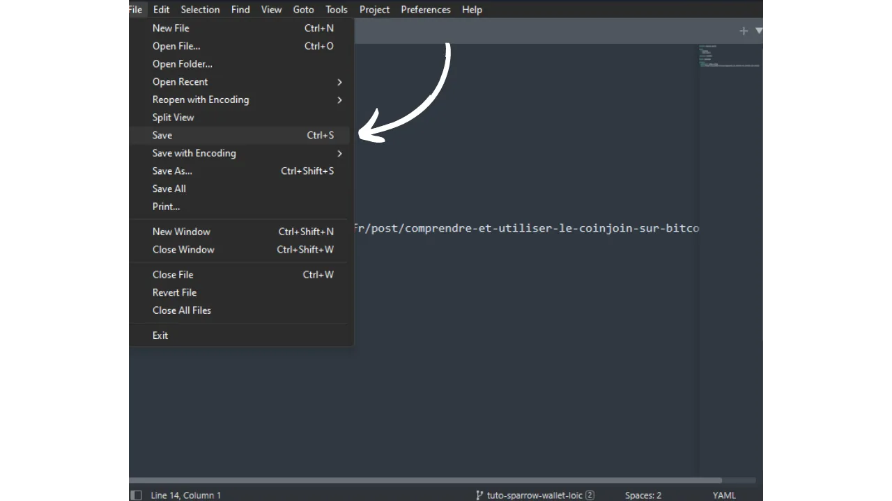

Теперь вы можете закрыть редактор кода.

## 4 - Заполните файл в формате Markdown

Теперь вы можете открыть файл, в котором будет размещен ваш учебник, названный кодом вашего языка, например `fr.md`. Зайдите в Obsidian, в левой части окна прокрутите дерево папок, пока не найдете папку с учебником и искомый файл:

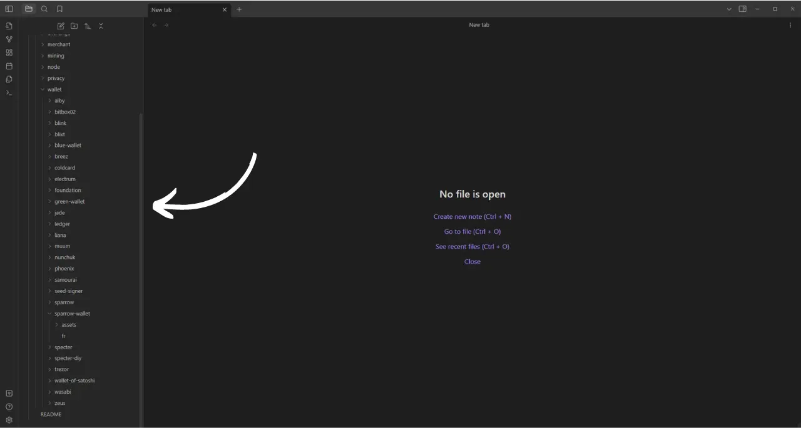

Щелкните по файлу, чтобы открыть его:

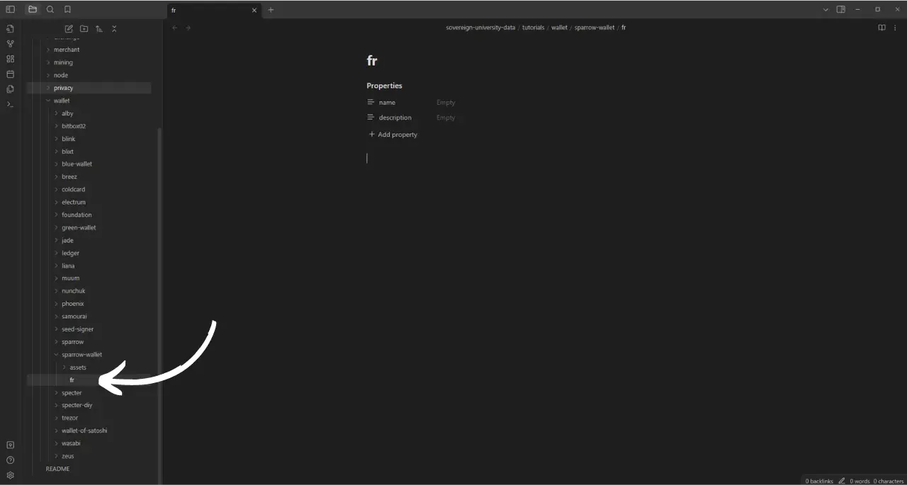

Начнем с заполнения раздела `Свойства` в верхней части документа.

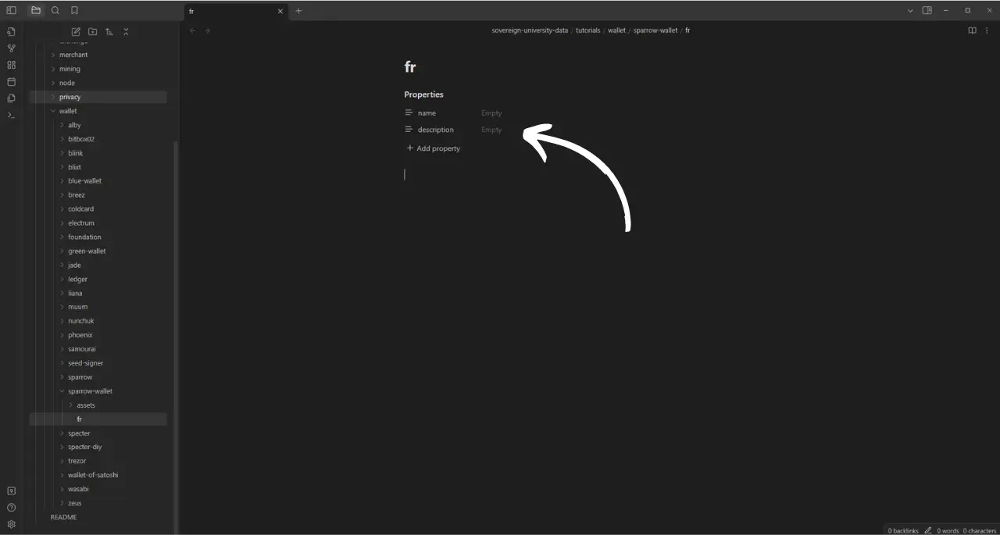

Вручную добавьте и заполните следующий блок кода:

```
---
name: [Title]
description: [Description]
---
```

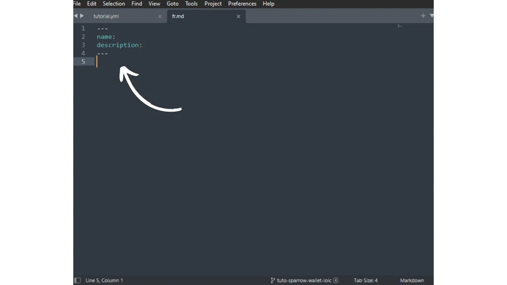

Введите название вашего учебника и краткое его описание:

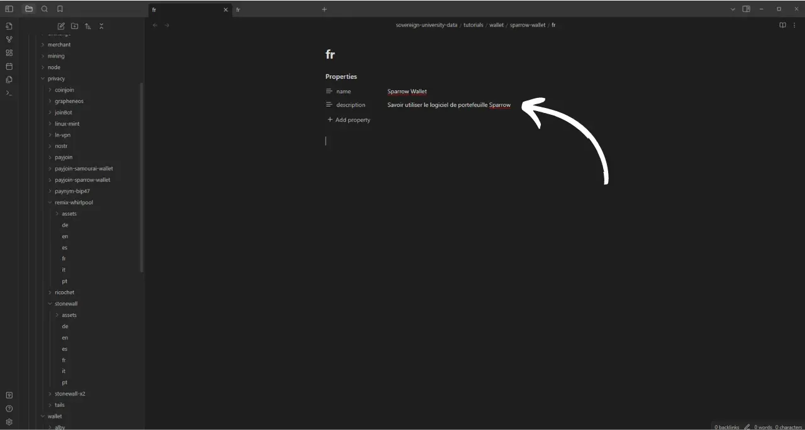

Затем добавьте путь к изображению обложки в начало учебника. Чтобы сделать это, обратите внимание:

```

```

Этот синтаксис пригодится вам при необходимости добавить изображение в учебник. Восклицательный знак указывает на то, что это изображение, а альтернативный текст (alt) указывается между скобками. Путь к изображению указывается между скобками:

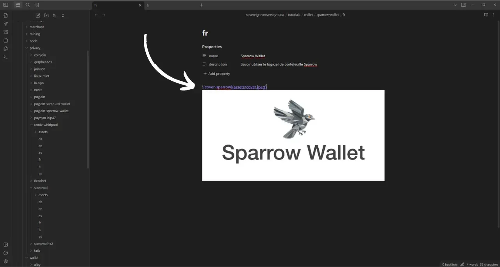

## 5 - Добавьте логотип и обложку

В папку `assets` необходимо добавить файл с именем `logo.webp`, который будет служить миниатюрой для вашей статьи. Это изображение должно быть в формате `.webp` и иметь квадратные размеры, чтобы гармонировать с пользовательским интерфейсом. Вы можете выбрать логотип программного обеспечения, о котором идет речь в руководстве, или любое другое подходящее изображение, если оно свободно от прав. Кроме того, добавьте туда же изображение с названием `cover.webp`. Это изображение будет отображаться в верхней части вашего учебника. Убедитесь, что это изображение, как и логотип, соблюдает права на использование и подходит для контекста вашего учебника:

## 6 - Написание учебника и добавление визуальных эффектов

Продолжайте писать учебник, составляя его содержание. Когда вы захотите включить подзаголовок, примените соответствующее форматирование в формате markdown, добавив к тексту префикс `##`:


Вложенная папка "Язык" в папке `assets` используется для хранения диаграмм и визуальных изображений, которые будут сопровождать ваш учебник. По возможности избегайте включения текста в изображения, чтобы сделать ваш контент доступным для международной аудитории. Конечно, представляемое программное обеспечение будет содержать текст, но если вы добавляете диаграммы или дополнительные указания на скриншоты программ, делайте это без текста или, если он окажется необходимым, используйте английский язык.

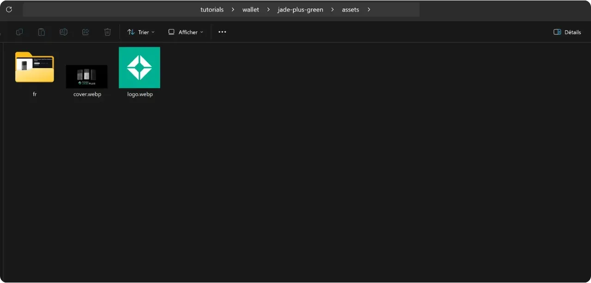

Чтобы назвать изображения, просто используйте номера, соответствующие порядку их появления в учебнике, в формате двух цифр (или трех цифр, если в учебнике более 99 изображений). Например, назовите первое изображение `01.webp`, второе `02.webp` и так далее.

Ваши изображения должны быть исключительно в формате `.webp`. При необходимости вы можете воспользоваться [моей программой для конвертации изображений](https://github.com/LoicPandul/ImagesConverter).

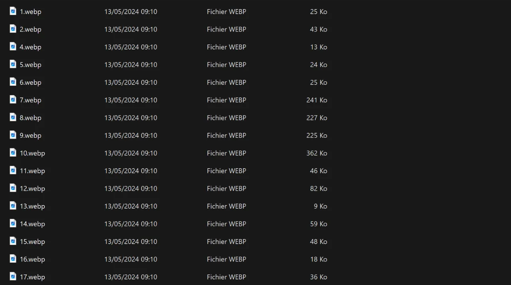

Чтобы вставить диаграмму в документ, воспользуйтесь следующей командой Markdown, обязательно указав соответствующий альтернативный текст, а также правильный путь к изображению:

```

```

Восклицательный знак в начале указывает на то, что это изображение. Альтернативный текст, который помогает в обеспечении доступности и SEO, помещается между скобками. Наконец, между скобками указывается путь к изображению.

Если вы хотите создать свои собственные диаграммы, обязательно придерживайтесь графического устава Plan ₿ Network, чтобы обеспечить визуальную согласованность:


- Шрифт**: Используйте [Rubik](https://fonts.google.com/specimen/Rubik);
- Цвета**:
 - Оранжевый: #FF5C00
 - Черный: #000000
 - Белый: #FFFFFF

**Обязательно, чтобы все визуальные материалы, интегрированные в ваши учебные пособия, были свободны от прав или соответствовали лицензии исходного файла**. Кроме того, все диаграммы, опубликованные в Plan ₿ Network, доступны под лицензией CC-BY-SA, так же как и текст.

**-> Совет:** При публичном размещении файлов, например изображений, важно удалить все ненужные метаданные. Они могут содержать конфиденциальную информацию, например данные о местоположении, дате создания или сведения об авторе. Чтобы защитить свою конфиденциальность, рекомендуется удалить эти метаданные. Чтобы упростить этот процесс, можно воспользоваться специализированными инструментами, например [Exif Cleaner](https://exifcleaner.com/), который позволяет очистить метаданные документа простым перетаскиванием.

## 7 - Сохранить и отправить учебник

После того как вы закончили писать учебник на выбранном вами языке, следующим шагом будет отправка **Запроса на перевод**. Администратор позаботится о добавлении недостающих переводов вашего учебника благодаря нашему методу автоматического перевода с человеческой проверкой.

Чтобы продолжить работу с Pull Request, откройте программу GitHub Desktop. Программа должна автоматически обнаружить изменения, которые вы сделали локально в своей ветке по сравнению с исходным репозиторием. Прежде чем продолжить, внимательно проверьте в левой части интерфейса, соответствуют ли эти изменения тому, что вы ожидали:

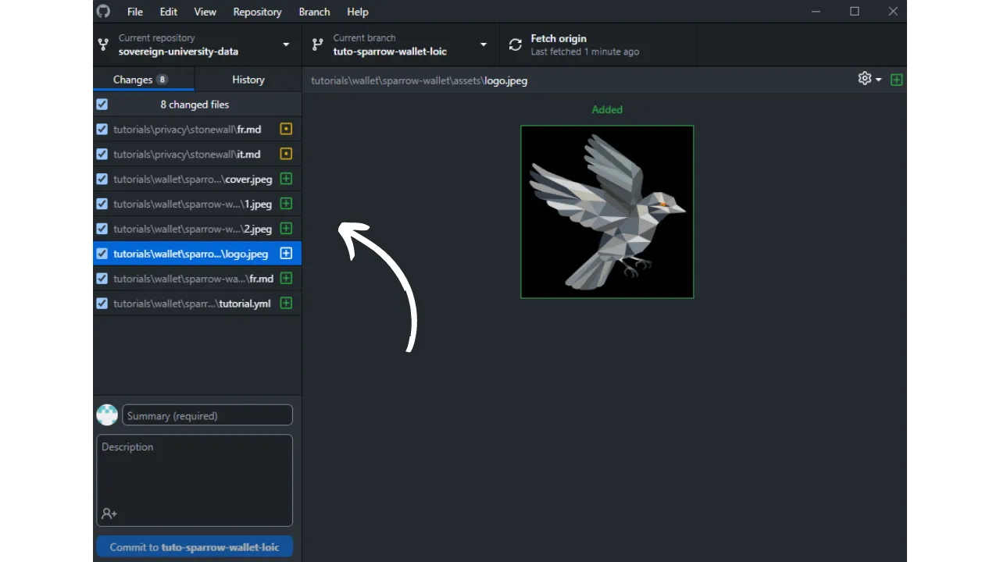

Добавьте название фиксации, а затем нажмите на синюю кнопку `Commit to [your branch]`, чтобы подтвердить эти изменения:

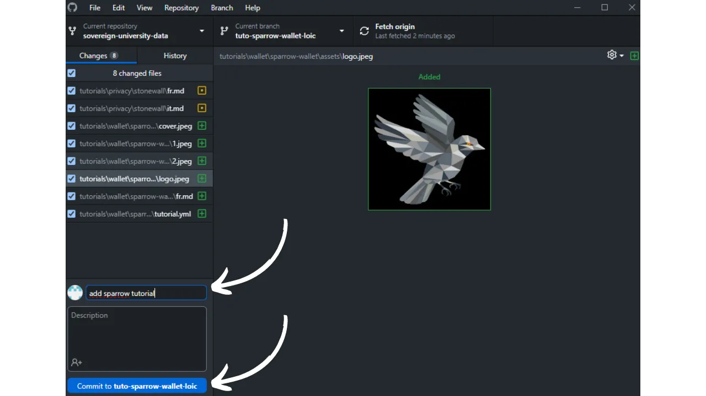

Коммит - это сохранение изменений, внесенных в ветку, сопровождаемое описательным сообщением, позволяющее проследить развитие проекта во времени. Это своего рода промежуточная контрольная точка.

Затем нажмите на кнопку `Push origin`. Это отправит ваш коммит на ваш форк:

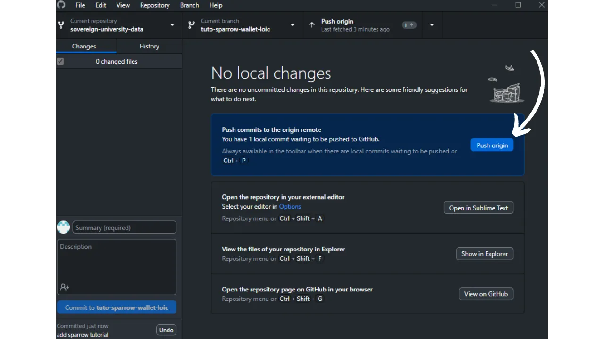

Если вы не закончили работу над учебником, вы можете вернуться к нему позже и сделать новые коммиты. Если вы завершили изменения для этой ветки, нажмите на кнопку `Preview Pull Request`:


Вы можете в последний раз проверить правильность внесенных изменений, а затем нажать кнопку `Create pull request`:


Pull Request - это запрос на интеграцию изменений из вашей ветки в основную ветку репозитория Plan ₿ Network, что позволяет просмотреть и обсудить изменения перед их объединением.

Вы будете автоматически перенаправлены в браузере на GitHub на страницу подготовки вашего Pull Request:

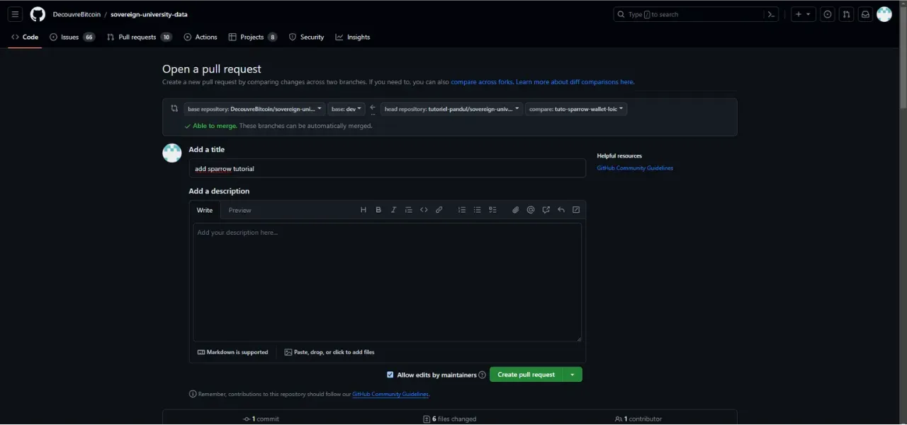

Укажите заголовок, кратко описывающий изменения, которые вы хотите объединить с исходным репозиторием. Добавьте краткий комментарий, описывающий эти изменения (если у вас есть номер проблемы, связанный с созданием вашего учебника, не забудьте указать в комментарии `Закрывает #{номер проблемы}`), затем нажмите на зеленую кнопку `Создать запрос на слияние`, чтобы подтвердить запрос на слияние:

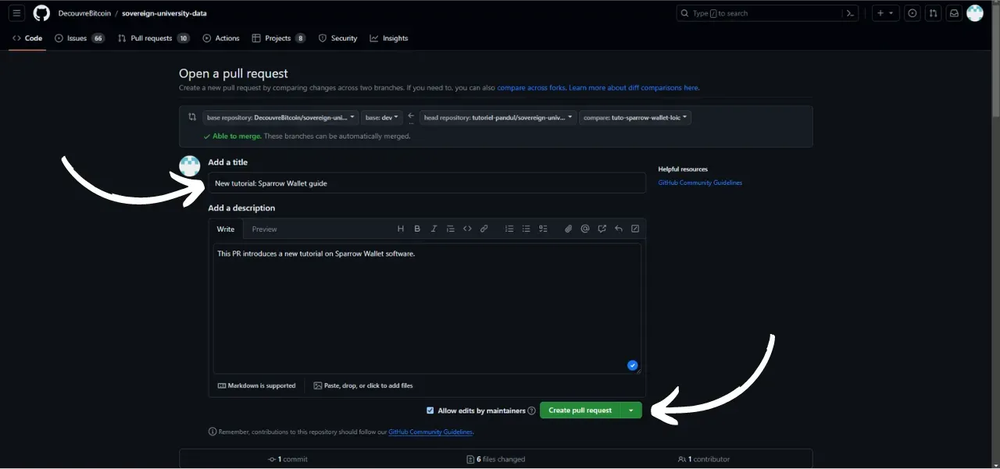

После этого ваш PR будет виден на вкладке `Pull Request` главного хранилища Plan ₿ Network. Вам останется только дождаться, пока администратор свяжется с вами, чтобы подтвердить объединение вашего вклада или запросить дополнительные изменения.

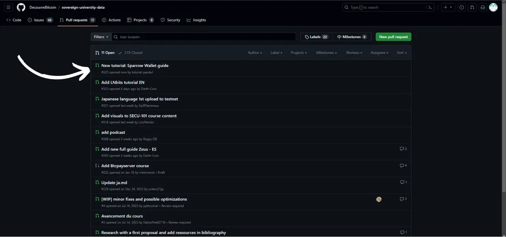

После слияния вашего PR с основной веткой рекомендуется удалить вашу рабочую ветку (`tuto-sparrow-wallet`), чтобы сохранить чистую историю на вашем форке. GitHub автоматически предложит вам эту опцию на странице вашего PR:

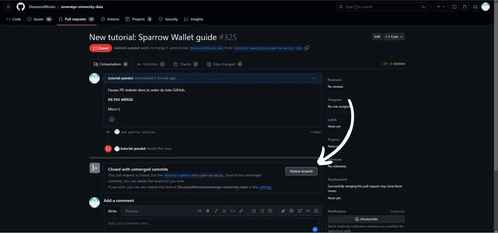

На рабочем столе GitHub вы можете переключиться обратно на основную ветку вашего форка (`dev`).


Если вы хотите внести изменения в свой вклад после того, как вы уже подали свой PR, процедура зависит от текущего состояния вашего PR:


- Если ваш PR еще открыт и не был слит, внесите изменения локально, оставаясь в той же ветке. Когда изменения будут завершены, воспользуйтесь кнопкой `Push origin`, чтобы добавить новый коммит к вашему все еще открытому PR;
- Если ваша PR уже была объединена с основной веткой, вам придется начать процесс заново, создав новую ветку, а затем отправив новую PR. Убедитесь, что ваш локальный репозиторий синхронизирован с исходным репозиторием Plan ₿ Network, прежде чем приступать к работе.

Если у вас возникнут технические трудности при отправке урока, не стесняйтесь просить помощи в [нашей специальной группе Telegram для вкладов](https://t.me/PlanBNetwork_ContentBuilder). Спасибо!

