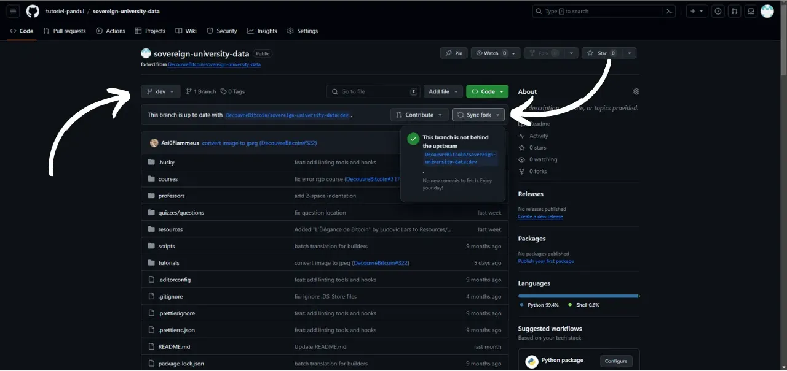
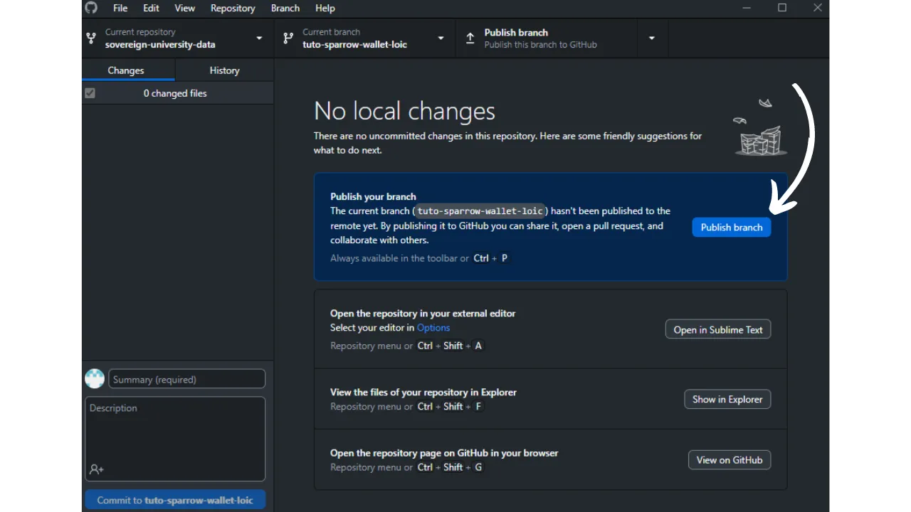
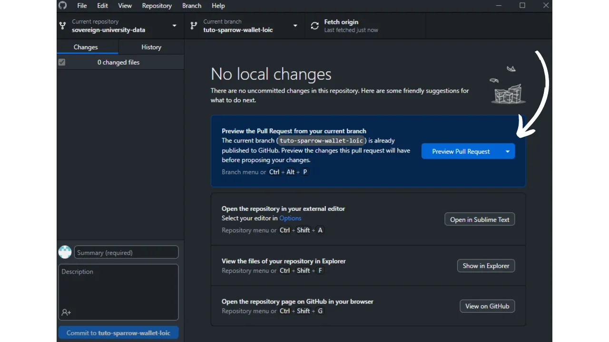

Trước khi làm theo hướng dẫn này để thêm hướng dẫn mới, bạn phải hoàn thành một số bước sơ bộ. Nếu bạn chưa làm như vậy, tôi mời bạn tham khảo hướng dẫn giới thiệu này trước, sau đó quay lại đây:

https://planb.network/tutorials/contribution/content/write-tutorials-4d142a6a-9127-4ffb-9e0a-5aba29f169e2
Bạn đã có:


- Chọn chủ đề cho bài hướng dẫn của bạn;
- Đã liên hệ với nhóm Plan ₿ Network qua [nhóm Telegram](https://t.me/PlanBNetwork_ContentBuilder) hoặc paolo@planb.network;
- Chọn công cụ đóng góp của bạn.

Trong hướng dẫn này, chúng ta sẽ xem cách thêm hướng dẫn của bạn vào Plan ₿ Network bằng cách thiết lập môi trường cục bộ của bạn với GitHub Desktop. Nếu bạn đã thành thạo với Git, hướng dẫn rất chi tiết này có thể không cần thiết đối với bạn. Tôi khuyên bạn nên tham khảo hướng dẫn khác này, trong đó tôi chỉ trình bày các hướng dẫn chính, không có hướng dẫn từng bước chi tiết:


- Người dùng có kinh nghiệm**:

https://planb.network/tutorials/contribution/content/write-tutorials-git-expert-0ce1e490-c28f-4c51-b7e0-9a6ac9728410
Nếu bạn không muốn thiết lập môi trường cục bộ, hãy làm theo hướng dẫn này dành cho người mới bắt đầu, trong đó chúng tôi thực hiện các thay đổi trực tiếp thông qua giao diện web của GitHub:


- Người mới bắt đầu (giao diện web)**:

https://planb.network/tutorials/contribution/content/write-tutorials-github-web-beginner-e64f8fed-4c0b-4225-9ebb-7fc5f1c01a79
## Điều kiện tiên quyết

Phần mềm cần thiết để thực hiện hướng dẫn này:


- [Máy tính để bàn GitHub](https://desktop.github.com/);
- Trình chỉnh sửa tệp markdown như [Obsidian](https://obsidian.md/);
- Trình soạn thảo mã ([VSC](https://code.visualstudio.com/) hoặc [Sublime Text](https://www.sublimetext.com/)).


Điều kiện tiên quyết trước khi bắt đầu hướng dẫn:


- Có [tài khoản GitHub](https://github.com/signup);
- Có một nhánh của [Kho lưu trữ nguồn Plan ₿ Network](https://github.com/PlanB-Network/bitcoin-educational-content);
- Có [hồ sơ giáo sư trên Plan₿ Network](https://planb.network/professors) (chỉ khi bạn đề xuất một bài hướng dẫn đầy đủ).

Nếu bạn cần trợ giúp để đạt được các điều kiện tiên quyết này, các hướng dẫn khác của tôi sẽ hỗ trợ bạn:

https://planb.network/tutorials/contribution/others/create-github-account-a75fc39d-f0d0-44dc-9cd5-cd94aee0c07c
Khi mọi thứ đã sẵn sàng và môi trường cục bộ của bạn được thiết lập đúng cách với nhánh Plan ₿ Network của riêng bạn, bạn có thể bắt đầu thêm phần hướng dẫn.


## 1 - Tạo một nhánh mới

Mở trình duyệt của bạn và đi đến trang fork của bạn trong kho lưu trữ Plan ₿ Network. Đây là fork bạn đã thiết lập trên GitHub. URL của fork của bạn sẽ trông giống như sau: `https://github.com/[your-username]/bitcoin-educational-content`:


Đảm bảo bạn đang ở nhánh chính `dev` sau đó nhấp vào nút `Sync fork`. Nếu nhánh của bạn chưa được cập nhật, GitHub sẽ đề nghị cập nhật nhánh của bạn. Tiến hành cập nhật này. Ngược lại, nếu nhánh của bạn đã được cập nhật, GitHub sẽ thông báo cho bạn:



Mở phần mềm GitHub Desktop và đảm bảo rằng nhánh của bạn được chọn đúng ở góc trên bên trái của cửa sổ:


Nhấp vào nút `Fetch origin`. Nếu kho lưu trữ cục bộ của bạn đã được cập nhật, GitHub Desktop sẽ không đề xuất bất kỳ hành động bổ sung nào. Nếu không, tùy chọn `Pull origin` sẽ xuất hiện. Nhấp vào nút này để cập nhật kho lưu trữ cục bộ của bạn:


Xác minh rằng bạn thực sự đang ở nhánh chính `dev`:


Nhấp vào nhánh này, sau đó nhấp vào nút `Nhánh mới`:


Đảm bảo rằng nhánh mới dựa trên kho lưu trữ nguồn, cụ thể là `PlanB-Network/bitcoin-educational-content`.

Đặt tên cho nhánh của bạn theo cách mà tiêu đề nêu rõ mục đích của nó, sử dụng dấu gạch ngang để phân tách từng từ. Ví dụ, giả sử mục tiêu của chúng ta là viết hướng dẫn sử dụng phần mềm Sparrow Wallet. Trong trường hợp này, nhánh làm việc dành riêng để viết hướng dẫn này có thể được đặt tên là: `tuto-sparrow-wallet-loic`. Sau khi nhập tên phù hợp, hãy nhấp vào `Create branch` để xác nhận việc tạo nhánh:


Bây giờ hãy nhấp vào nút `Publish branch` để lưu nhánh làm việc mới của bạn vào nhánh trực tuyến trên GitHub:



Bây giờ, trên GitHub Desktop, bạn sẽ thấy mình đang ở nhánh mới. Điều này có nghĩa là mọi thay đổi được thực hiện cục bộ trên máy tính của bạn sẽ được lưu riêng trên nhánh cụ thể này. Ngoài ra, miễn là nhánh này vẫn được chọn trên GitHub Desktop, các tệp hiển thị cục bộ trên máy của bạn sẽ tương ứng với các tệp của nhánh này (`tuto-sparrow-wallet-loic`), chứ không phải các tệp của nhánh chính (`dev`).


Đối với mỗi bài viết mới mà bạn muốn xuất bản, bạn sẽ cần tạo một nhánh mới từ `dev`. Nhánh trong Git là phiên bản song song của dự án, cho phép bạn thực hiện các thay đổi mà không ảnh hưởng đến nhánh chính, cho đến khi công việc sẵn sàng để hợp nhất.

## 2 - Thêm các tập tin hướng dẫn

Bây giờ nhánh làm việc đã được tạo, đã đến lúc tích hợp hướng dẫn mới của bạn. Bạn có hai lựa chọn: sử dụng tập lệnh Python của tôi, tự động tạo các tài liệu cần thiết hoặc tạo thủ công từng tệp. Chúng ta sẽ xem xét các bước cần thực hiện cho từng tùy chọn.

### Với tập lệnh Python của tôi

Bạn cần cài đặt trên máy của mình:


- Python 3.8 trở lên.

Để sử dụng tập lệnh, hãy điều hướng đến thư mục lưu trữ tập lệnh. Tập lệnh nằm trong kho dữ liệu Plan ₿ Network tại đường dẫn: `bitcoin-educational-content/scripts/tutorial-related/data-creator`.

Khi đã vào thư mục, hãy cài đặt các phần phụ thuộc:

```
pip install -r requirements.txt
```

Sau đó khởi chạy phần mềm bằng lệnh:

```
python3 main.py
```

Giao diện người dùng đồ họa (GUI) sẽ mở ra. Lần đầu tiên, bạn sẽ cần nhập tất cả thông tin cần thiết, nhưng trong những lần sử dụng tiếp theo, tập lệnh sẽ ghi nhớ thông tin cá nhân của bạn, do đó bạn sẽ không phải nhập lại.


Bắt đầu bằng cách nhập đường dẫn cục bộ đến thư mục `/tutorials` trong kho lưu trữ đã sao chép của bạn (`.../bitcoin-educational-content/tutorials/`). Bạn có thể nhập thủ công hoặc nhấp vào nút "Duyệt" để điều hướng bằng trình khám phá tệp của mình.


Chọn ngôn ngữ mà bạn sẽ sử dụng để viết hướng dẫn.


Trong trường "ID GitHub của người đóng góp", hãy nhập tên người dùng GitHub của bạn.


Trong trường "ID giáo sư PBN", hãy nhập mã định danh của bạn bằng các từ trong danh sách BIP39, giống như mã xuất hiện trên [hồ sơ giáo sư của bạn](https://github.com/PlanB-Network/bitcoin-educational-content/tree/dev/professors).


Nếu bạn chưa có hồ sơ giáo sư, hãy xem hướng dẫn này:

https://planb.network/tutorials/contribution/others/create-teacher-profile-8ba9ba49-8fac-437a-a435-c38eebc8f8a4
Sau đó nhấp vào nút "Hướng dẫn mới".


Chọn một danh mục chính cho hướng dẫn của bạn. Sau đó, chọn một danh mục phụ có liên quan dựa trên danh mục chính bạn đã chọn.


Xác định mức độ khó của bài hướng dẫn.


Chọn tên cho thư mục được tạo riêng cho hướng dẫn của bạn. Tên của thư mục này phải phản ánh phần mềm được đề cập trong hướng dẫn, sử dụng dấu gạch nối để phân tách các từ. Ví dụ, thư mục có thể được đặt tên là `red-wallet`:


`project_id` là UUID của công ty hoặc tổ chức đứng sau công cụ được đề cập trong hướng dẫn, có sẵn [trong danh sách các dự án](https://github.com/PlanB-Network/bitcoin-educational-content/tree/dev/resources/projects). Ví dụ, đối với hướng dẫn về Sparrow Wallet, bạn có thể tìm thấy `project_id` của nó trong tệp: `bitcoin-educational-content/resources/projects/sparrow/project.yml`. Thông tin này được thêm vào tệp YAML của hướng dẫn của bạn vì Plan ₿ Network duy trì cơ sở dữ liệu về các công ty và tổ chức hoạt động trong Bitcoin hoặc các dự án liên quan. Bằng cách thêm `project_id` được liên kết, bạn liên kết nội dung của mình với thực thể có liên quan.

***Cập nhật:*** Trong phiên bản mới của tập lệnh, bạn không cần phải nhập thủ công `project_id` nữa. Một chức năng tìm kiếm đã được thêm vào để tìm dự án theo tên và tự động lấy `project_id` tương ứng. Nhập phần đầu của tên dự án vào trường "Project Name" để tìm kiếm, sau đó chọn công ty mong muốn từ menu thả xuống. `project_id` sẽ tự động được điền vào trường bên dưới. Bạn cũng có thể nhập thủ công nếu cần.


Đối với thẻ, hãy chọn 2 hoặc 3 từ khóa có liên quan đến nội dung hướng dẫn của bạn, chỉ chọn từ [danh sách thẻ Plan ₿ Network](https://github.com/PlanB-Network/bitcoin-educational-content/blob/dev/docs/50-planb-tags.md). Phần mềm này cũng cung cấp chức năng tìm kiếm từ khóa với danh sách thả xuống.


Sau khi nhập và xác minh tất cả thông tin, hãy nhấp vào "Create Tutorial" để xác nhận việc tạo tệp hướng dẫn của bạn. Thao tác này sẽ tạo thư mục hướng dẫn của bạn và tất cả các tệp cần thiết trong danh mục đã chọn cục bộ.


Bây giờ bạn có thể bỏ qua phần phụ "Without my Python script" cũng như bước 3, "Fill in the YAML file", vì script đã hoàn tất các hành động này cho bạn. Tiến hành trực tiếp đến bước 4 và bắt đầu viết hướng dẫn của bạn.

Để biết thêm thông tin về tập lệnh Python này, bạn cũng có thể xem [README](https://github.com/PlanB-Network/bitcoin-educational-content/blob/dev/scripts/tutorial-related/new-tutorial-creation/README.md).

### Không có tập lệnh Python của tôi

Mở trình quản lý tệp của bạn và điều hướng đến thư mục `bitcoin-educational-content`, thư mục này đại diện cho bản sao cục bộ của kho lưu trữ của bạn. Bạn thường sẽ tìm thấy nó trong `Documents\GitHub\bitcoin-educational-content`.

Trong thư mục này, bạn sẽ cần xác định vị trí thư mục con thích hợp để đặt hướng dẫn của mình. Tổ chức thư mục phản ánh các phần khác nhau của trang web Plan ₿ Network. Trong ví dụ của chúng tôi, vì chúng tôi muốn thêm hướng dẫn về Sparrow Wallet, chúng tôi nên điều hướng đến đường dẫn sau: `bitcoin-educational-content\tutorials\wallet`, tương ứng với phần `WALLET` trên trang web:


Trong thư mục `wallet`, bạn cần tạo một thư mục mới dành riêng cho hướng dẫn của bạn. Tên của thư mục này phải gợi lên phần mềm được đề cập trong hướng dẫn, đảm bảo kết nối các từ bằng dấu gạch ngang. Đối với ví dụ của tôi, thư mục sẽ có tiêu đề là `sparrow-wallet`:


Trong thư mục con mới này dành riêng cho phần hướng dẫn của bạn, một số thành phần cần được thêm vào:


- Tạo một thư mục `assets`, dùng để lưu trữ tất cả các hình ảnh minh họa cần thiết cho bài hướng dẫn của bạn;
- Trong thư mục `assets` này, bạn cần tạo một thư mục con được đặt tên theo mã ngôn ngữ gốc của hướng dẫn. Ví dụ, nếu hướng dẫn được viết bằng tiếng Anh, thư mục con này phải được đặt tên là `en`. Đặt tất cả các hình ảnh của hướng dẫn vào đó (sơ đồ, hình ảnh, ảnh chụp màn hình, v.v.).
- Bạn phải tạo một tệp `tutorial.yml` để ghi lại các chi tiết liên quan đến hướng dẫn của mình;
- Một tệp định dạng markdown sẽ được tạo để viết nội dung thực tế của hướng dẫn của bạn. Tệp này phải được đặt tên theo mã ngôn ngữ của bài viết. Ví dụ, đối với hướng dẫn được viết bằng tiếng Pháp, tệp phải được gọi là `fr.md`.


Tóm lại, đây là hệ thống phân cấp các tệp cần tạo:

```
bitcoin-educational-content/
└── tutorials/
└── wallet/ (to be modified with the correct category)
└── sparrow-wallet/ (to be modified with the name of the tutorial)
├── assets/
│   ├── en/ (to be modified according to the appropriate language code)
├── tutorial.yml
└── en.md (to be modified according to the appropriate language code)
```

## 3 - Điền vào tệp YAML

Điền vào tệp `tutorial.yml` bằng cách sao chép mẫu sau:

```
id:
project_id:
tags:
-
-
-
category:
level:
credits:
professor:
# Proofreading metadata
original_language:
proofreading:
- language:
last_contribution_date:
urgency:
contributors_id:
-
reward:
```

Sau đây là thông tin chi tiết về các trường bắt buộc:


- id**: UUID (_Universally Unique Identifier_) để nhận dạng duy nhất hướng dẫn. Bạn có thể tạo nó bằng [một công cụ trực tuyến](https://www.uuidgenerator.net/version4). Yêu cầu duy nhất là UUID này phải ngẫu nhiên để tránh xung đột với UUID khác trên nền tảng;
- project_id**: UUID của công ty hoặc tổ chức đứng sau công cụ được trình bày trong hướng dẫn [từ danh sách các dự án](https://github.com/PlanB-Network/bitcoin-educational-content/tree/dev/resources/projects). Ví dụ: nếu bạn đang tạo hướng dẫn về phần mềm Sparrow Wallet, bạn có thể tìm thấy `project_id` này trong tệp sau: `bitcoin-educational-content/resources/projects/sparrow/project.yml`. Thông tin này được thêm vào tệp YAML của hướng dẫn của bạn vì Plan ₿ Network duy trì cơ sở dữ liệu của tất cả các công ty và tổ chức hoạt động trên Bitcoin hoặc các dự án liên quan. Bằng cách thêm `project_id` của thực thể liên quan đến hướng dẫn của bạn, bạn tạo liên kết giữa hai phần tử;
- thẻ**: 2 hoặc 3 từ khóa có liên quan đến nội dung hướng dẫn, được chọn riêng [từ danh sách thẻ của Plan ₿ Network](https://github.com/PlanB-Network/bitcoin-educational-content/blob/dev/docs/50-planb-tags.md);
- category**: Tiểu thể loại tương ứng với nội dung của hướng dẫn, theo cấu trúc của trang web Plan ₿ Network (ví dụ đối với ví: `desktop`, `hardware`, `mobile`, `backup`);
- level**: Mức độ khó của phần hướng dẫn, trong số:
    - `người mới bắt đầu`
    - `trung gian`
    - `nâng cao`
    - `chuyên gia`
- giáo sư**: `contributor_id` của bạn (BIP39 từ) như được hiển thị trên [hồ sơ giáo sư của bạn](https://github.com/PlanB-Network/bitcoin-educational-content/tree/dev/professors);
- original_language**: Ngôn ngữ gốc của hướng dẫn (ví dụ `fr`, `en`, v.v.);
- soát lỗi**: Thông tin về quá trình soát lỗi. Điền vào phần đầu tiên, vì việc soát lỗi hướng dẫn của riêng bạn được tính là xác thực đầu tiên:
    - language**: Mã ngôn ngữ của bản hiệu đính (ví dụ `fr`, `en`, v.v.).
    - last_contribution_date**: Ngày hôm nay.
    - mức độ khẩn cấp**: Để trống.
    - contributors_id**: ID GitHub của bạn.
    - phần thưởng**: Để trống.

Để biết thêm chi tiết về mã định danh giáo sư của bạn, hãy tham khảo hướng dẫn tương ứng:

https://planb.network/tutorials/contribution/others/create-teacher-profile-8ba9ba49-8fac-437a-a435-c38eebc8f8a4
Sau đây là ví dụ về tệp `tutorial.yml` đã hoàn thành cho hướng dẫn về ví Blockstream Green:

```
id: e84edaa9-fb65-48c1-a357-8a5f27996143
project_id: 3b2f45e6-d612-412c-95ba-cf65b49aa5b8
tags:
- wallets
- software
- keys
category: mobile
level: beginner
credits:
professor: pretty-private
# Proofreading metadata
original_language: fr
proofreading:
- language: fr
last_contribution_date: 2024-11-20
urgency: 1
contributors_id:
- LoicPandul
reward: 0
```

Sau khi hoàn tất việc sửa đổi tệp `tutorial.yml`, hãy lưu tài liệu của bạn bằng cách nhấp vào `File > Save`:


Bây giờ bạn có thể đóng trình soạn thảo mã.

## 4 - Điền vào Tệp Markdown

Bây giờ, bạn có thể mở tệp sẽ lưu trữ hướng dẫn của mình, được đặt tên theo mã ngôn ngữ của bạn, chẳng hạn như `fr.md`. Vào Obsidian, ở phía bên trái của cửa sổ, cuộn qua cây thư mục cho đến khi bạn tìm thấy thư mục hướng dẫn của mình và tệp bạn đang tìm kiếm:


Nhấp vào tập tin để mở nó:


Chúng ta sẽ bắt đầu bằng cách điền vào phần `Thuộc tính` ở đầu tài liệu.


Thêm và điền thủ công khối mã sau:

```
---
name: [Title]
description: [Description]
---
```


Điền tên hướng dẫn của bạn và mô tả ngắn gọn về hướng dẫn đó:


Sau đó, thêm đường dẫn của ảnh bìa vào đầu hướng dẫn của bạn. Để thực hiện việc này, hãy lưu ý:

```

```

Cú pháp này sẽ hữu ích bất cứ khi nào cần thêm hình ảnh vào hướng dẫn của bạn. Dấu chấm than cho biết đó là hình ảnh, với văn bản thay thế (alt) được chỉ định giữa các dấu ngoặc. Đường dẫn đến hình ảnh được chỉ định giữa các dấu ngoặc đơn:


## 5 - Thêm Logo và Bìa

Trong thư mục `assets`, bạn phải thêm một tệp có tên `logo.webp`, tệp này sẽ đóng vai trò là hình thu nhỏ cho bài viết của bạn. Hình ảnh này phải ở định dạng `.webp` và phải tuân thủ kích thước hình vuông để hài hòa với giao diện người dùng. Bạn được tự do lựa chọn logo của phần mềm được đề cập trong hướng dẫn hoặc bất kỳ hình ảnh có liên quan nào khác, miễn là không vi phạm bản quyền. Ngoài ra, hãy thêm một hình ảnh có tiêu đề `cover.webp` vào cùng một vị trí. Hình ảnh này sẽ được hiển thị ở đầu hướng dẫn của bạn. Đảm bảo rằng hình ảnh này, giống như logo, tuân thủ quyền sử dụng và phù hợp với bối cảnh hướng dẫn của bạn:

## 6 - Viết hướng dẫn và thêm hình ảnh

Tiếp tục viết hướng dẫn của bạn bằng cách soạn thảo nội dung. Khi bạn muốn tích hợp phụ đề, hãy áp dụng định dạng đánh dấu thích hợp bằng cách thêm tiền tố `##` vào văn bản:


Thư mục con ngôn ngữ trong thư mục `assets` được sử dụng để lưu trữ sơ đồ và hình ảnh đi kèm với hướng dẫn của bạn. Tránh đưa văn bản vào hình ảnh của bạn càng nhiều càng tốt để nội dung của bạn dễ tiếp cận với đối tượng quốc tế. Tất nhiên, phần mềm được trình bày sẽ chứa văn bản, nhưng nếu bạn thêm sơ đồ hoặc chỉ dẫn bổ sung vào ảnh chụp màn hình phần mềm, hãy làm mà không cần văn bản hoặc, nếu điều đó chứng tỏ là không thể thiếu, hãy sử dụng tiếng Anh.


Để đặt tên cho hình ảnh của bạn, chỉ cần sử dụng các số tương ứng với thứ tự xuất hiện của chúng trong hướng dẫn, được định dạng bằng hai chữ số (hoặc ba chữ số nếu hướng dẫn của bạn chứa hơn 99 hình ảnh). Ví dụ, đặt tên cho hình ảnh đầu tiên của bạn là `01.webp`, hình ảnh thứ hai là `02.webp`, v.v.

Hình ảnh của bạn phải ở định dạng `.webp`. Nếu cần, bạn có thể sử dụng [phần mềm chuyển đổi hình ảnh của tôi](https://github.com/LoicPandul/ImagesConverter).


Để chèn sơ đồ vào tài liệu, hãy sử dụng lệnh Markdown sau, đảm bảo chỉ định văn bản thay thế phù hợp cũng như đường dẫn chính xác của hình ảnh:

```

```

Dấu chấm than ở đầu cho biết đó là hình ảnh. Văn bản thay thế, hỗ trợ khả năng truy cập và SEO, được đặt giữa các dấu ngoặc. Cuối cùng, đường dẫn đến hình ảnh được chỉ ra giữa các dấu ngoặc đơn.

Nếu bạn muốn tạo sơ đồ của riêng mình, hãy đảm bảo tuân thủ điều lệ đồ họa của Plan ₿ Network để đảm bảo tính nhất quán về mặt hình ảnh:


- Phông chữ**: Sử dụng [Rubik](https://fonts.google.com/specimen/Rubik);
- Màu sắc**:
 - Màu cam: #FF5C00
 - Đen: #000000
 - Trắng: #FFFFFF

**Điều bắt buộc là tất cả hình ảnh tích hợp vào hướng dẫn của bạn phải không có bản quyền hoặc tôn trọng giấy phép của tệp nguồn**. Ngoài ra, tất cả các sơ đồ được xuất bản trên Plan ₿ Network đều được cung cấp theo giấy phép CC-BY-SA, theo cùng cách như văn bản.

**-> Mẹo:** Khi chia sẻ tệp công khai, chẳng hạn như hình ảnh, điều quan trọng là phải xóa mọi siêu dữ liệu không cần thiết. Những siêu dữ liệu này có thể chứa thông tin nhạy cảm, như dữ liệu vị trí, ngày tạo hoặc thông tin chi tiết về tác giả. Để bảo vệ quyền riêng tư của bạn, bạn nên xóa siêu dữ liệu này. Để đơn giản hóa quy trình này, bạn có thể sử dụng các công cụ chuyên dụng như [Exif Cleaner](https://exifcleaner.com/), cho phép dọn dẹp siêu dữ liệu của tài liệu thông qua thao tác kéo và thả đơn giản.

## 7 - Lưu và Gửi Hướng dẫn

Sau khi bạn hoàn thành việc viết hướng dẫn bằng ngôn ngữ bạn chọn, bước tiếp theo là gửi **Yêu cầu kéo**. Sau đó, quản trị viên sẽ đảm nhiệm việc thêm bất kỳ bản dịch nào còn thiếu trong hướng dẫn của bạn, nhờ phương pháp dịch tự động của chúng tôi với sự đánh giá của con người.

Để tiếp tục Pull Request, hãy mở phần mềm GitHub Desktop. Phần mềm sẽ tự động phát hiện những thay đổi bạn đã thực hiện cục bộ trên nhánh của mình so với kho lưu trữ gốc. Trước khi tiếp tục, hãy kiểm tra cẩn thận ở phía bên trái của giao diện để đảm bảo những thay đổi này khớp với những gì bạn mong đợi:


Thêm tiêu đề cho cam kết của bạn, sau đó nhấp vào nút màu xanh `Cam kết với [nhánh của bạn]` để xác thực những thay đổi này:


Cam kết là lưu các thay đổi được thực hiện cho nhánh, kèm theo thông báo mô tả, cho phép theo dõi sự phát triển của dự án theo thời gian. Đây giống như một điểm kiểm tra trung gian.

Sau đó nhấp vào nút `Push origin`. Thao tác này sẽ gửi commit của bạn đến fork của bạn:


Nếu bạn chưa hoàn thành hướng dẫn, bạn có thể quay lại sau và thực hiện các cam kết mới. Nếu bạn đã hoàn tất các thay đổi cho nhánh này, hãy nhấp vào nút `Xem trước yêu cầu kéo`:



Bạn có thể kiểm tra lại lần cuối để đảm bảo rằng các sửa đổi của bạn đã chính xác, sau đó nhấp vào nút `Tạo yêu cầu kéo`:


Yêu cầu kéo là yêu cầu được thực hiện để tích hợp các thay đổi từ nhánh của bạn vào nhánh chính của kho lưu trữ Plan ₿ Network, cho phép xem xét và thảo luận về các thay đổi trước khi chúng được hợp nhất.

Bạn sẽ được tự động chuyển hướng đến trình duyệt của mình trên GitHub tới trang chuẩn bị cho Yêu cầu kéo của bạn:


Chỉ ra một tiêu đề tóm tắt ngắn gọn những thay đổi bạn muốn hợp nhất với kho lưu trữ nguồn. Thêm một bình luận ngắn mô tả những thay đổi này (nếu bạn có số vấn đề liên quan đến việc tạo hướng dẫn của mình, hãy nhớ ghi chú trong bình luận `Đóng #{số vấn đề}`), sau đó nhấp vào nút `Tạo yêu cầu kéo` màu xanh lá cây để xác nhận yêu cầu hợp nhất:


PR của bạn sau đó sẽ hiển thị trong tab `Pull Request` của kho lưu trữ Plan ₿ Network chính. Tất cả những gì bạn phải làm là đợi cho đến khi quản trị viên liên hệ với bạn để xác nhận việc hợp nhất đóng góp của bạn hoặc yêu cầu bất kỳ sửa đổi bổ sung nào.


Sau khi PR của bạn đã được hợp nhất với nhánh chính, bạn nên xóa nhánh đang hoạt động của mình (`tuto-sparrow-wallet`) để duy trì lịch sử sạch trên nhánh fork của bạn. GitHub sẽ tự động cung cấp cho bạn tùy chọn này trên trang PR của bạn:


Trên phần mềm GitHub Desktop, bạn có thể chuyển lại nhánh chính của nhánh (`dev`).


Nếu bạn muốn thay đổi nội dung đóng góp của mình sau khi đã nộp PR, quy trình thực hiện sẽ tùy thuộc vào trạng thái hiện tại của PR của bạn:


- Nếu PR của bạn vẫn mở và chưa được hợp nhất, hãy thực hiện các thay đổi cục bộ trong khi vẫn ở cùng một nhánh. Sau khi các sửa đổi được hoàn tất, hãy sử dụng nút `Push origin` để thêm một cam kết mới vào PR vẫn mở của bạn;
- Nếu PR của bạn đã được hợp nhất với nhánh chính, bạn sẽ cần bắt đầu lại quy trình bằng cách tạo nhánh mới, sau đó gửi PR mới. Đảm bảo rằng kho lưu trữ cục bộ của bạn được đồng bộ hóa với kho lưu trữ nguồn Plan ₿ Network trước khi tiếp tục.

Nếu bạn gặp khó khăn về mặt kỹ thuật khi gửi bài hướng dẫn, đừng ngần ngại yêu cầu trợ giúp trên [nhóm Telegram chuyên dụng của chúng tôi để đóng góp](https://t.me/PlanBNetwork_ContentBuilder). Cảm ơn bạn!


