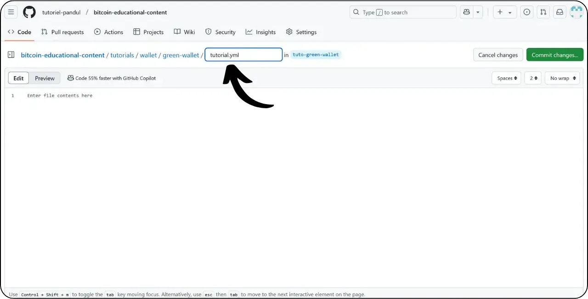
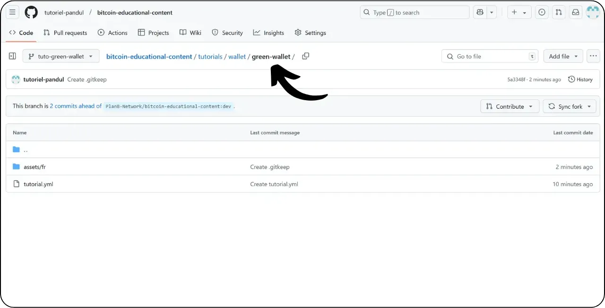
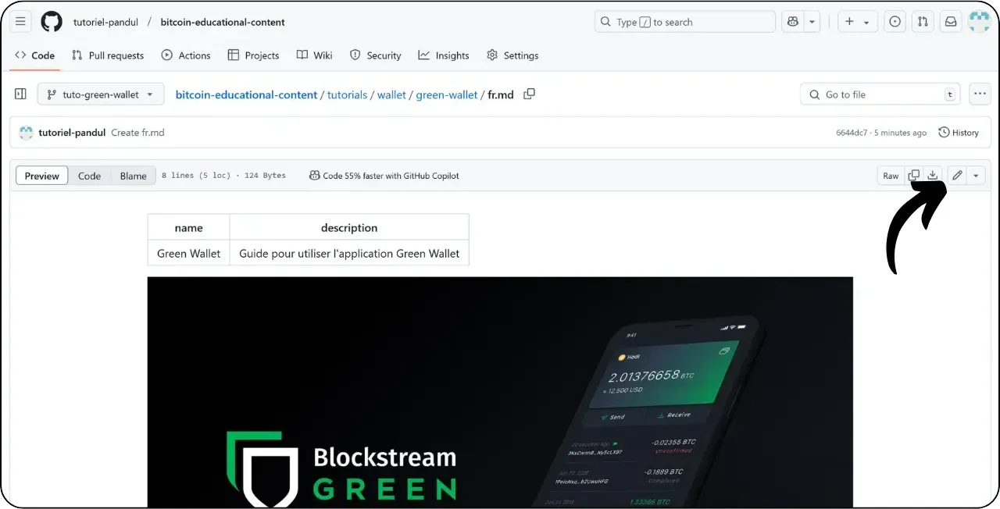

Než se pustíte do tohoto návodu na přidání nového tutoriálu, musíte provést několik předběžných kroků. Pokud jste tak ještě neučinili, podívejte se nejprve na tento úvodní návod a pak se vraťte sem :

https://planb.network/tutorials/contribution/tutorial/write-tutorials-4d142a6a-9127-4ffb-9e0a-5aba29f169e2

Již máte :


- Vyberte si téma výukového programu;
- Kontaktoval tým sítě Plan ₿ prostřednictvím [skupiny Telegram](https://t.me/PlanBNetwork_ContentBuilder) nebo paolo@planb.network ;
- Vyberte si nástroje pro přispívání.

V tomto návodu se podíváme, jak přidat svůj výukový program do sítě Plan ₿ pomocí webové verze služby GitHub. Pokud již ovládáte systém Git, tento velmi podrobný návod pro vás nemusí být nutný. Místo toho doporučuji podívat se na jeden z těchto dalších 2 tutoriálů, kde podrobně popisuji pokyny, kterými je třeba se řídit, a kroky pro provádění změn z místního :


- Zkušení uživatelé** :

https://planb.network/tutorials/contribution/tutorial/write-tutorials-git-expert-0ce1e490-c28f-4c51-b7e0-9a6ac9728410

- Středně pokročilý (GitHub Desktop)** :

https://planb.network/tutorials/contribution/tutorial/write-tutorials-github-desktop-intermediate-4a36a052-1000-4191-890a-9a1dc65f8957

## Předpoklady

Předpoklady před zahájením výuky :


- Mít účet [GitHub](https://github.com/signup);
- Mít fork zdrojového úložiště [Plan ₿ Network](https://github.com/PlanB-Network/bitcoin-educational-content);
- Mít [profil učitele v síti Plan ₿ Network](https://planb.network/professors) (pouze pokud nabízíte kompletní výuku).

Pokud potřebujete pomoci se získáním těchto předpokladů, pomohou vám mé další návody:


https://planb.network/tutorials/contribution/others/create-github-account-a75fc39d-f0d0-44dc-9cd5-cd94aee0c07c

https://planb.network/tutorials/contribution/others/github-desktop-work-environment-5862003b-9d76-47f5-a9e0-5ec74256a8ba

https://planb.network/tutorials/contribution/others/create-teacher-profile-8ba9ba49-8fac-437a-a435-c38eebc8f8a4

Jakmile je vše na svém místě a máte svůj fork úložiště sítě Plan ₿, můžete začít přidávat výukový program.

## 1 - Vytvoření nové pobočky

Otevřete prohlížeč a přejděte na stránku s vidlicí v úložišti Plan ₿ Network. Jedná se o fork, který jste založili na GitHubu. Adresa URL vašeho forku by měla vypadat takto: `https://github.com/[vaše uživatelské jméno]/bitcoin-educational-content` :


Ujistěte se, že jste v hlavní větvi `dev`, a klikněte na tlačítko "*Sync fork*". Pokud váš fork není aktuální, GitHub vás požádá o aktualizaci větve. Pokračujte v této aktualizaci:


Klikněte na větev `dev` a poté pojmenujte svou pracovní větev tak, aby její název jasně odrážel její účel, přičemž slova oddělujte pomlčkami. Pokud je například naším cílem napsat návod na používání Zelené peněženky, větev by se mohla jmenovat: `tuto-green-wallet-loic`. Po zadání vhodného názvu klikněte na "*Vytvořit větev*" a potvrďte vytvoření nové větve založené na `dev` :


Nyní byste měli být v novém pracovním odvětví:


To znamená, že všechny provedené změny budou uloženy pouze v této konkrétní větvi.

Pro každý nový článek, který plánujete publikovat, vytvořte novou větev z `dev`.

Větev v systému Git představuje paralelní verzi projektu, která vám umožňuje pracovat na úpravách, aniž by ovlivnila hlavní větev, dokud není vaše práce připravena k začlenění.

## 2 - Přidání výukových souborů

Nyní, když byla vytvořena pracovní větev, je čas integrovat nový výukový program.

V souborech větve je třeba najít vhodnou podsložku pro umístění výukového programu. Uspořádání složek odráží různé sekce webu Plan ₿ Network. V našem příkladu, protože přidáváme výukový program o zelené peněžence, zamiřte do následující cesty: v tomto případě je nutné, abyste se podívali do sekce `bitcoin-educational-content\tutorials\wallet`, která odpovídá sekci `WALLET` na webových stránkách:


Ve složce `peněženka` vytvořte nový adresář určený speciálně pro váš výukový program. Název této složky by měl jasně označovat software, který je předmětem výukového programu, a slova spojovat pomlčkami. V mém příkladu se složka bude jmenovat `zelená peněženka`. Klikněte na tlačítko "*Přidat soubor*" a poté na tlačítko "*Vytvořit nový soubor*" :


Zadáním názvu složky následovaného lomítkem `/` potvrdíte její vytvoření jako složky.


Do této nové podsložky určené pro váš výukový program je třeba přidat několik položek:


- Vytvořte složku `assets`, do které uložíte všechny ilustrace potřebné pro výukový program;
- V této složce `assets` vytvořte podsložku pojmenovanou podle původního kódu jazyka výukového programu. Pokud je například výukový program napsán v angličtině, měla by se tato podsložka jmenovat `en`. Do této složky umístěte všechny vizuální materiály výukového programu (diagramy, obrázky, snímky obrazovky atd.).
- Je třeba vytvořit soubor `tutorial.yml`, do kterého budou zaznamenány podrobnosti o výukovém programu;
- Pro zápis skutečného obsahu výukového programu je třeba vytvořit soubor markdown. Tento soubor musí být pojmenován podle kódu jazyka, ve kterém je napsán. Například pro výukový program napsaný ve francouzštině by se soubor měl jmenovat `fr.md`.

Pro shrnutí uvádíme hierarchii souborů (v jejich vytváření budeme pokračovat v další části):

```
bitcoin-educational-content/
└── tutorials/
└── wallet/ (à modifier avec la bonne catégorie)
└── green-wallet/ (à modifier avec le nom du tuto)
├── assets/
│   ├── fr/ (à modifier selon le code de langue approprié)
├── tutorial.yml
└── fr.md (à modifier selon le code de langue approprié)
```

## 3 - Vyplnění souboru YAML

Začněme souborem YAML. Do pole pro vytvoření nového souboru zadejte `tutorial.yml` :



Vyplňte soubor `tutorial.yml` zkopírováním následující šablony:

```
id:
project_id:
tags:
-
-
-
category:
level:
credits:
professor:
# Proofreading metadata
original_language:
proofreading:
- language:
last_contribution_date:
urgency:
contributors_id:
-
reward:
```

Zde jsou povinná pole:


- id**: UUID (_Universally Unique Identifier_), který jednoznačně identifikuje výukový program. Můžete jej vygenerovat pomocí [online nástroje](https://www.uuidgenerator.net/version4). Jediným omezením je, že tento UUID musí být náhodný, aby nedošlo ke konfliktu s jiným UUID na platformě;
- project_id** : UUID společnosti nebo organizace, která stojí za nástrojem prezentovaným v tutoriálu [ze seznamu projektů](https://github.com/PlanB-Network/bitcoin-educational-content/tree/dev/resources/projects). Pokud například zpracováváte výukový program o softwaru Green Wallet, najdete toto `project_id` v následujícím souboru: `bitcoin-educational-content/resources/projects/blockstream/project.yml`. Tato informace je přidána do souboru YAML vašeho výukového programu, protože síť Plan ₿ udržuje databázi všech společností a organizací působících na Bitcoinu nebo souvisejících projektech. Přidáním `project_id` propojené entity do svého tutoriálu vytvoříte vazbu mezi těmito dvěma prvky;
- tagy**: 2 nebo 3 relevantní klíčová slova související s obsahem výukového programu, vybraná výhradně [ze seznamu tagů sítě Plan ₿](https://github.com/PlanB-Network/bitcoin-educational-content/blob/dev/docs/50-planb-tags.md);
- kategorie** : Podkategorie odpovídající obsahu výuky podle struktury sítě Plan ₿ (např. pro peněženky: `desktop`, `hardware`, `mobil`, `zálohování`) ;
- úroveň** : Úroveň obtížnosti výuky, od :
    - začátečník`
    - `intermediate`
    - `pokročilý`
    - `expert`
- profesor**: (slova BIP39), jak je zobrazeno na [profilu učitele](https://github.com/PlanB-Network/bitcoin-educational-content/tree/dev/professors);
- original_language** : Původní jazyk výukového programu (např. `fr`, `en` atd.) ;
- korektury**: Informace o procesu korektury. Vyplňte první část, protože korektura vlastního výukového programu se počítá jako první ověření:
    - jazyk**: (např. `fr`, `en` atd.).
    - last_contribution_date**: Dnešní datum.
    - naléhavost** : Nechte prázdné.
    - přispěvatelé_id** : Vaše GitHub ID.
    - odměna** : Nechte prázdné.

Další podrobnosti o ID učitele naleznete v příslušném výukovém kurzu :

https://planb.network/tutorials/contribution/others/create-teacher-profile-8ba9ba49-8fac-437a-a435-c38eebc8f8a4

Zde je příklad souboru `tutorial.yml` vyplněného pro výukový program o peněžence Blockstream Green:

```
id: e84edaa9-fb65-48c1-a357-8a5f27996143
project_id: 3b2f45e6-d612-412c-95ba-cf65b49aa5b8
tags:
- wallets
- software
- keys
category: mobile
level: beginner
credits:
professor: pretty-private
# Proofreading metadata
original_language: fr
proofreading:
- language: fr
last_contribution_date: 2024-11-20
urgency:
contributors_id:
- LoicPandul
reward:
```

Po dokončení úprav souboru `tutorial.yml` uložte dokument kliknutím na tlačítko "*Odeslat změny...*":


Přidejte název a popis a ujistěte se, že je revize provedena do větve, kterou jste vytvořili na začátku tohoto návodu. Poté potvrďte kliknutím na "*Odeslat změny*".


## 4 - Vytváření podsložek pro obrázky

Znovu klikněte na "*Přidat soubor*" a poté na "*Vytvořit nový soubor*" :


Pro vytvoření složky zadejte `assets` následované lomítkem `/`:


Tento krok zopakujte ve složce `/assets` a vytvořte podsložku jazyka, například `fr`, pokud je váš výukový program ve francouzštině:


V této složce vytvořte fiktivní soubor, který donutí službu GitHub zachovat vaši složku (která by jinak byla prázdná). Tento soubor pojmenujte `.gitkeep`. Poté klikněte na tlačítko "*Odeslat změny...*".


Znovu zkontrolujte, zda jste ve správné větvi, a klikněte na "*Odeslat změny*".


## 5 - Vytvoření souboru Markdown

Nyní vytvoříme soubor, ve kterém bude umístěn váš výukový program, pojmenovaný podle kódu jazyka, například `fr.md`, pokud píšeme ve francouzštině. Přejděte do složky s výukovým materiálem :



Klikněte na "Add file*" a poté na "Create new file*".


Pojmenujte soubor pomocí kódu jazyka. V mém případě, protože je návod napsán ve francouzštině, jsem soubor pojmenoval `fr.md`. Přípona `.md` označuje, že soubor je ve formátu Markdown.


Začneme vyplněním části `Vlastnosti` v horní části dokumentu. Ručně přidejte a vyplňte následující blok kódu (klíče `jméno:` a `popis:` musí zůstat v angličtině, ale jejich hodnoty musí být zapsány v jazyce, který používáte pro výukový program):

```
---
name: [Titre]
description: [Description]
---
```


Vyplňte název výukového programu a krátký popis:


Poté přidejte cestu k obrázku obálky na začátek výukového programu. K tomu si poznamenejte :

```

```

Tato syntaxe se vám bude hodit, kdykoli budete potřebovat přidat obrázek do výukového programu. Vykřičník označuje obrázek, jehož alternativní text (alt) je uveden mezi hranatými závorkami. Cesta k obrázku je uvedena mezi závorkami:


Kliknutím na tlačítko "*Odeslat změny...*" tento soubor uložte.


Zkontrolujte, zda jste ve správné větvi, a potvrďte revizi.


Vaše složka s výukovými programy by nyní měla vypadat takto, podle kódu jazyka:


## 6 - Přidání loga a obálky

Do složky `assets` je třeba přidat soubor s názvem `logo.webp`, který bude sloužit jako miniatura článku. Tento obrázek musí být ve formátu `.webp` a musí mít čtvercovou velikost, aby odpovídal uživatelskému rozhraní.

Můžete si vybrat logo softwaru použité v tutoriálu nebo jakýkoli jiný vhodný obrázek, pokud je bez licenčních poplatků. Kromě toho přidejte na stejné místo obrázek s názvem `cover.webp`. Ten se bude zobrazovat v horní části výukového programu. Ujistěte se, že tento obrázek, stejně jako logo, respektuje práva na použití a je vhodný pro kontext vašeho tutoriálu.

Chcete-li přidat obrázky do složky `/assets`, můžete je přetáhnout z místních souborů. Ujistěte se, že se nacházíte ve složce `/assets` a na správné větvi, a poté klikněte na "*Commit changes*".


Obrázky by se nyní měly objevit ve složce.


## 7 - Psaní výukového programu

Pokračujte v psaní výukového programu tak, že zapíšete obsah do souboru Markdown s kódem jazyka (v mém příkladu je to francouzský soubor `fr.md`). Přejděte do souboru a klikněte na ikonu tužky :



Začněte psát výukový program. Při přidávání titulku použijte vhodné formátování Markdown, a to tak, že text předepíšete předponou `##` :


Střídavě přepínejte mezi zobrazeními "*Edit*" a "*Preview*", abyste lépe viděli vykreslování.


Chcete-li uložit svou práci, klikněte na "*Odevzdat změny...*", ujistěte se, že jste ve správné větvi, a poté ji potvrďte opětovným kliknutím na "*Odevzdat změny*".


## 8 - Přidejte vizuální prvky

Jazyková podsložka ve složce `/assets` (v mém příkladu: `/assets/en`) slouží k uložení diagramů a vizualizací, které budou doprovázet váš výukový program. Pokud je to možné, vyvarujte se vkládání textu do obrázků, aby byl obsah přístupný mezinárodnímu publiku. Prezentovaný software bude samozřejmě obsahovat text, ale pokud přidáváte schémata nebo další údaje na snímky softwaru, udělejte to bez textu, nebo pokud je to nezbytné, použijte angličtinu.

Pro pojmenování obrázků jednoduše použijte čísla odpovídající pořadí jejich výskytu ve výukovém programu ve formátu dvou číslic (nebo tří číslic, pokud výukový program obsahuje více než 99 obrázků). Například první obrázek pojmenujte `01.webp`, druhý `02.webp` a tak dále.

Vaše obrázky musí být pouze ve formátu `.webp`. V případě potřeby můžete použít [můj software pro konverzi obrázků](https://github.com/LoicPandul/ImagesConverter).


Po přidání obrázků do podsložky můžete odstranit fiktivní soubor `.gitkeep`. Otevřete tento soubor, klikněte na tři malé tečky v pravém horním rohu a poté na "*Odstranit soubor*".


Uložte změny kliknutím na "*Odeslat změny...*".


Chcete-li vložit diagram z podsložky do redakčního dokumentu, použijte následující příkaz Markdown a dbejte na zadání vhodného alternativního textu a správné cesty k obrázku pro váš jazyk:

```

```

Vykřičník na začátku označuje obrázek. Alternativní text, který pomáhá s přístupností a odkazováním, je umístěn mezi hranatými závorkami. Nakonec je mezi závorkami uvedena cesta k obrázku.


Pokud chcete vytvořit vlastní schéma, nezapomeňte dodržet grafické pokyny pro plánování sítě, abyste zajistili vizuální konzistenci:


- Písmo**: [Rubik](https://fonts.google.com/specimen/Rubik);
- Barvy** :
 - Oranžová: #FF5C00
 - Černá : #000000
 - Bílá: #FFFFFF

**Je nutné, aby všechny vizuály integrované do vašich výukových programů byly bez autorských práv nebo aby respektovaly licenci zdrojových souborů**. Proto jsou všechna schémata publikovaná v síti Plan ₿ k dispozici pod licencí CC-BY-SA, stejně jako text.

**-> Tip:** Při veřejném sdílení souborů, například obrázků, je důležité odstranit nadbytečná metadata. Ta mohou obsahovat citlivé informace, jako jsou údaje o umístění, data vytvoření a údaje o autorovi. V zájmu ochrany soukromí je dobré tato metadata odstranit. Pro zjednodušení této operace můžete použít specializované nástroje, například [Exif Cleaner](https://exifcleaner.com/), který umožňuje vyčistit metadata dokumentu jednoduchým přetažením.

## 9 - Navrhněte výukový program

Po dokončení psaní výukového programu ve zvoleném jazyce je dalším krokem odeslání **žádosti o stažení**. Správce poté přidá chybějící překlady do vašeho tutoriálu pomocí naší metody automatického překladu s lidskou korekturou.

Chcete-li pokračovat v žádosti o stažení, klikněte po uložení všech změn na tlačítko "*Přispět*" a poté na "*Otevřít žádost o stažení*" :


Požadavek na vytažení je požadavek na začlenění změn z vaší větve do hlavní větve úložiště sítě Plan ₿, což umožňuje kontrolu a diskusi o změnách před jejich sloučením.

Než budete pokračovat, zkontrolujte pečlivě v dolní části rozhraní, zda tyto změny odpovídají vašim očekáváním:


V horní části rozhraní se ujistěte, že je vaše pracovní větev sloučena s větví `dev` síťového úložiště Plan ₿ (což je hlavní větev).

Zadejte název, který stručně shrnuje změny, které chcete sloučit se zdrojovým úložištěm. Přidejte stručný komentář popisující tyto změny (pokud je s vytvořením vašeho výukového programu spojeno číslo problému, nezapomeňte jako komentář uvést `Uzavírá #{číslo problému}`) a poté kliknutím na zelené tlačítko "*Vytvořit žádost o stažení*" žádost o sloučení potvrďte:


Vaše žádost o stažení bude poté viditelná na kartě "*Žádost o stažení*" v hlavním úložišti sítě Plán ₿. Nyní stačí počkat, až se vám ozve správce a potvrdí, že váš příspěvek byl sloučen, nebo požádá o další úpravy.


Po sloučení vašeho PR s hlavní větví doporučujeme smazat vaši pracovní větev (v mém příkladu: `tuto-green-wallet`), aby byla zachována čistá historie vašeho forku. GitHub vám tuto možnost automaticky nabídne na stránce PR:


Pokud chcete provést změny ve svém příspěvku poté, co jste již podali PR, závisí postup na aktuálním stavu vašeho PR:


- Pokud je váš PR stále otevřený a ještě nebyl sloučen, proveďte změny ve stejné pracovní větvi. Změny revize budou přidány do vašeho stále otevřeného PR;
- V případě, že váš PR již byl sloučen s hlavní větví, budete muset proces opakovat od začátku vytvořením nové větve a následným odesláním nového PR. Než budete pokračovat, ujistěte se, že je váš fork synchronizován se zdrojovým úložištěm sítě Plan ₿ ve větvi `dev`.

Pokud máte technické potíže s odesláním návodu, neváhejte požádat o pomoc na [naší speciální skupině pro příspěvky na Telegramu](https://t.me/PlanBNetwork_ContentBuilder). Moc vám děkujeme!
