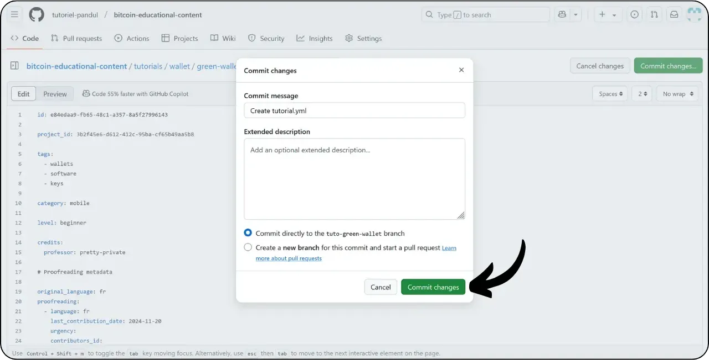

Enne uue õpetuse lisamise õpetuse järgimist peate olema läbinud mõned esialgsed sammud. Kui te pole seda veel teinud, vaadake esmalt seda sissejuhatavat õpetust ja tulge siis siia tagasi:

https://planb.network/tutorials/contribution/content/write-tutorials-4d142a6a-9127-4ffb-9e0a-5aba29f169e2

Sul on juba olemas :


- Valige oma õpetuse jaoks teema;
- Võtke ühendust Plan ₿ Network meeskonnaga [Telegram grupi](https://t.me/PlanBNetwork_ContentBuilder) või paolo@planb.network kaudu;
- Valige oma panustamise vahendid.

Selles õpetuses vaatame, kuidas lisada oma õpetus Plan ₿ Network'ile, kasutades GitHubi veebiversiooni. Kui olete Gitiga juba kursis, ei pruugi see väga üksikasjalik õpetus teile vajalik olla. Selle asemel soovitan teil vaadata ühte neist kahest teisest õpetusest, kus ma üksikasjalikult kirjeldan juhiseid, mida järgida, ja samme muudatuste tegemiseks kohalikust :


- Kogenud kasutajad** :

https://planb.network/tutorials/contribution/content/write-tutorials-git-expert-0ce1e490-c28f-4c51-b7e0-9a6ac9728410

- Vahepealne (GitHub Desktop)** :

https://planb.network/tutorials/contribution/content/write-tutorials-github-desktop-intermediate-4a36a052-1000-4191-890a-9a1dc65f8957

## Eeltingimused

Eeltingimused enne õpetuse alustamist :


- Kas teil on [GitHubi konto](https://github.com/signup);
- On olemas [Plan ₿ Network source repository](https://github.com/PlanB-Network/bitcoin-educational-content);
- Omada [õpetaja profiili Plan ₿ Network](https://planb.network/professors) (ainult juhul, kui pakute täielikku õpetust).

Kui vajate abi nende eelduste hankimisel, siis aitavad teid minu teised õpetused:


https://planb.network/tutorials/contribution/others/create-github-account-a75fc39d-f0d0-44dc-9cd5-cd94aee0c07c

https://planb.network/tutorials/contribution/others/github-desktop-work-environment-5862003b-9d76-47f5-a9e0-5ec74256a8ba

https://planb.network/tutorials/contribution/others/create-teacher-profile-8ba9ba49-8fac-437a-a435-c38eebc8f8a4

Kui kõik on paigas ja teil on olemas Plan ₿ Networki repositooriumi haru, võite alustada õpetuse lisamist.

## 1 - Uue haru loomine

Avage oma brauser ja navigeerige oma hargnemislehele Plan ₿ Network repositooriumis. See on teie poolt GitHubis loodud haru. Teie hargnemise URL peaks välja nägema selline: `https://github.com/[teie-kasutajanimi]/bitcoin-õppematerjal` :


Veenduge, et olete peamisel `dev` harul, seejärel klõpsake nupule "*Sync fork*". Kui teie haru ei ole ajakohane, palub GitHub teil oma haru uuendada. Jätkake selle uuendamisega:


Klõpsake haru `dev`, seejärel nimetage oma tööharu nii, et selle pealkiri kajastaks selgelt selle eesmärki, kasutades kriipsu, et sõnu eraldada. Näiteks, kui meie eesmärk on kirjutada juhendmaterjal Green Walleti kasutamise kohta, võiks haru nimi olla: `tuto-green-wallet-loic`. Pärast sobiva nime sisestamist klõpsake "*Create branch*", et kinnitada uue haru loomine `dev` alusel:


Nüüd peaksite olema oma uues tööharus:


See tähendab, et kõik tehtud muudatused salvestatakse ainult selles konkreetses harus.

Iga uue artikli jaoks, mida kavatsete avaldada, looge uus haru lehelt `dev`.

Git'i haru kujutab endast projekti paralleelset versiooni, mis võimaldab teil töötada muudatustega, ilma et see mõjutaks põhiharu, kuni teie töö on valmis integreerimiseks.

## 2 - Lisage õpetusfailid

Nüüd, kui tööharu on loodud, on aeg integreerida oma uus õpetus.

Oma haru failidest peate leidma sobiva alamkataloogi oma õpetuse paigutamiseks. Kaustade korraldus kajastab Plan ₿ Network veebilehe erinevaid jaotisi. Meie näites, kuna me lisame juhendmaterjali rohelise rahakoti kohta, suunduge järgmisesse teekonda: `bitcoin-educational-content\tutorials\wallet`, mis vastab veebisaidi jaotisele `WALLET`:


Looge kaustas `wallet` uus kataloog, mis on spetsiaalselt pühendatud teie õpiobjektile. Selle kausta nimi peaks selgelt osutama õpetuses käsitletavale tarkvarale, kasutades sidekriipsu sõnade ühendamiseks. Minu näite puhul saab kausta nimeks `green-wallet`. Klõpsake "*Add File*" ja seejärel "*Create new file*" :


Sisestage kausta nimi, millele järgneb kaldkriips `/`, et kinnitada selle loomist kaustana.


Sellesse uude alamkataloogi, mis on pühendatud teie õpetusele, peate lisama mitu elementi:


- Looge kaust `assets`, kuhu paigutatakse kõik õpetuse jaoks vajalikud illustratsioonid;
- Selle kausta `assets` sees looge alamkaust, mille nimi vastab õpetuse algsele keelekoodile. Näiteks kui õpetus on kirjutatud inglise keeles, peaks selle alamkataloogi nimi olema `en`. Asetage kõik õpetuse visuaalsed materjalid (diagrammid, pildid, ekraanipildid jne) sellesse kausta.
- Õppekava üksikasjade salvestamiseks tuleb luua fail `tutorial.yml`;
- Juhendi tegeliku sisu kirjutamiseks tuleb luua markdown-faili. See fail tuleb nimetada vastavalt selle keele koodile, milles see on kirjutatud. Näiteks prantsuse keeles kirjutatud õpetuse puhul peaks faili nimi olema `fr.md`.

Kokkuvõtteks, siin on failide hierarhia (jätkame nende loomist järgmises osas):

```
bitcoin-educational-content/
└── tutorials/
└── wallet/ (à modifier avec la bonne catégorie)
└── green-wallet/ (à modifier avec le nom du tuto)
├── assets/
│   ├── fr/ (à modifier selon le code de langue approprié)
├── tutorial.yml
└── fr.md (à modifier selon le code de langue approprié)
```

## 3 - Täitke YAML-faili

Alustame YAML-failist. Uue faili loomise lahtrisse kirjutame `tutorial.yml` :


Täitke fail `tutorial.yml`, kopeerides järgmise malli:


```
id: 

project_id: 

tags:
  - 
  - 
  - 

category: 

level: 

professor_id:

# Proofreading metadata

original_language:
proofreading:
  - language: 
    last_contribution_date:
    urgency:
    contributor_names:
      - 
    reward:
```

Siin on kohustuslikud väljad:

- **id** : UUID (_Universally Unique Identifier_), mis võimaldab õpetust ainulaadselt tuvastada. Selle saab luua [veebitööriista](https://www.uuidgenerator.net/version4) abil. Ainus nõue on, et see UUID oleks juhuslik, et vältida konflikte teiste platvormil olevate UUID-dega;

- **project_id** : Ettevõtte või organisatsiooni UUID, mis on seotud õpetuses esitatud tööriistaga [projektide loendist](https://github.com/PlanB-Network/bitcoin-educational-content/tree/dev/resources/projects). Näiteks kui loote õpetust Green Walleti tarkvara kohta, leiate `project_id` järgmisest failist: `bitcoin-educational-content/resources/projects/blockstream/project.yml`. See teave lisatakse teie õpetuse YAML-faili, kuna Plan ₿ Network haldab kõigi Bitcoiniga seotud ettevõtete ja organisatsioonide andmebaasi. Lisades oma õpetusega seotud üksuse `project_id`, loote seose kahe elemendi vahel;

- **tags** : 2 või 3 õpetuse sisuga seotud märksõna, mis valitakse ainult [Plan ₿ Networki siltide loendist](https://github.com/PlanB-Network/bitcoin-educational-content/blob/dev/docs/50-planb-tags.md);

- **category** : Õpetuse sisule vastav alamosa Plan ₿ Networki saidi struktuuri järgi (näiteks rahakottide jaoks: `desktop`, `hardware`, `mobile`, `backup`);

- **level** : Õpetuse raskusaste, valitud järgmistest tasemetest:
    - `beginner`
    - `intermediate`
    - `advanced`
    - `expert`

- **professor_id** : Teie `professor_id` (UUID), nagu on näidatud [teie professori profiilil](https://github.com/PlanB-Network/bitcoin-educational-content/tree/dev/professors);

- **original_language** : Õpetuse algne keel (näiteks `fr`, `en`, jne);

- **proofreading** : Teave korrektuuriprotsessi kohta. Täitke esimene osa, kuna oma õpetuse korrektuur loetakse esimeseks valideerimiseks:
    - **language** : Keelekood korrektuuri jaoks (näiteks `fr`, `en`, jne).
    - **last_contribution_date** : Käesoleva päeva kuupäev.
    - **urgency** : 1
    - **contributor_names** : Teie GitHub ID.
    - **reward** : 0

Lisateavet õpetaja ID kohta leiate vastavast juhendmaterjalist :

https://planb.network/tutorials/contribution/others/create-teacher-profile-8ba9ba49-8fac-437a-a435-c38eebc8f8a4

```
id: e84edaa9-fb65-48c1-a357-8a5f27996143

project_id: 3b2f45e6-d612-412c-95ba-cf65b49aa5b8

tags:
  - wallets
  - software
  - keys

category: mobile

level: beginner

professor_id: 6516474c-c190-41f2-b2ab-3d452ce7bdf0

# Proofreading metadata

original_language: fr
proofreading:
  - language: fr
    last_contribution_date: 2024-11-20
    urgency: 1
    contributor_names:
      - LoicPandul
    reward: 0
```


Kui olete lõpetanud oma `tutorial.yml` faili muutmise, salvestage oma dokument, klõpsates nupule "*Commit changes...*":


Lisage pealkiri ja kirjeldus ning veenduge, et kommitatsioon tehakse harusse, mille lõite selle õpetuse alguses. Seejärel kinnitage, klõpsates "*Commit changes*".



## 4 - Piltide alamkaustade loomine

Klõpsake uuesti "*Add File*" ja seejärel "*Create new file*" :


Kausta loomiseks sisestage `assets`, millele järgneb kaldkriips `/`:


Korrake seda sammu kaustas `/assets`, et luua keele alamkaust, näiteks `fr`, kui teie õpetus on prantsuse keeles:


Looge sellesse kausta dummy-fail, et GitHub sunniks teie kausta (mis muidu oleks tühi) säilitama. Nimetage see fail `.gitkeep`. Seejärel klõpsake nupule "*Commit changes...*".


Kontrollige veel kord, et olete õiges harus, seejärel klõpsake nupule "*Muudatuste kinnitamine*".


## 5 - Markdown-faili loomine

Nüüd loome faili, mis hakkab teie õpetust võõrustama, nimetades selle vastavalt teie keelekoodile, näiteks `fr.md`, kui me kirjutame prantsuse keeles. Mine oma õpetuse kausta :


Klõpsake nupule "Lisa fail*", seejärel nupule "Loo uus fail*".


Nimetage fail oma keelekoodiga. Minu puhul, kuna õpetus on kirjutatud prantsuse keeles, annan failile nimeks `fr.md`. Laiendus `.md` näitab, et fail on Markdown-vormingus.


Alustame dokumendi ülaosas oleva jaotise "Omadused" täitmisega. Lisage käsitsi ja täitke järgmine koodiplokk (võtmed `nimi:` ja `kirjeldus:` peavad olema inglise keeles, kuid nende väärtused peavad olema kirjutatud teie õpetuses kasutatavas keeles):

```
---
name: [Titre]
description: [Description]
---
```


Täitke oma õpetuse nimi ja lühikirjeldus:


Seejärel lisage tee kaanepildile oma õpetuse alguses. Selleks märkige :

```

```

See süntaks on kasulik alati, kui teil on vaja lisada pilt oma õpetusele. Hüüumärk tähistab pilti, mille alternatiivne tekst (alt) on määratud nurksulgude vahele. Sulgude vahel on märgitud pildi tee:


Faili salvestamiseks klõpsake nuppu "*Muudatuste kinnitamine...*".


Kontrollige, et olete õiges harus, seejärel kinnitage kinnitus.


Teie õpetuskaust peaks nüüd vastavalt teie keelekoodile välja nägema selline:


## 6 - Lisage logo ja kate

Kausta `assets` sisse tuleb lisada fail nimega `logo.webp`, mis on teie artikli pisipildiks. See pilt peab olema `.webp` formaadis ja selle suurus peab olema ruudukujuline, et see sobiks kasutajaliidesega.

Võite vabalt valida õpetuses kasutatud tarkvara logo või mis tahes muu asjakohase pildi, kui see on kasutustasuta. Lisaks lisage samasse kohta pilt pealkirjaga `cover.webp`. See kuvatakse teie õpetuse ülaosas. Veenduge, et see pilt, nagu ka logo, austaks kasutusõigusi ja oleks teie õpetuse konteksti sobiv.

Piltide lisamiseks kausta `/assets` saate neid lohistada oma kohalikest failidest. Veenduge, et olete kaustas `/assets` ja õiges harus, seejärel klõpsake "*Commit changes*".


Nüüd peaksite nägema, et pildid ilmuvad kausta.


## 7 - Õpetuse kirjutamine

Jätkake oma õpetuse kirjutamist, märkides oma sisu Markdown-faili koos keelekoodiga (minu näites on see prantsuse keeles fail `fr.md`). Mine faili ja kliki pliiatsi ikoonile :


Alustage oma õpetuse kirjutamist. Kui lisate alapealkirja, kasutage asjakohast Markdown-vormingut, lisades tekstile eesliite `##` :


Vahetage vaateid "*Edit*" ja "*Preview*" vahel, et renderdamist paremini visualiseerida.


Töö salvestamiseks klõpsake "*Commit Changes...*", veenduge, et olete õiges harus, seejärel kinnitage, klõpsates uuesti "*Commit Changes*".


## 8 - Lisage visuaalid

Keele alamkaust `/assets` (minu näites: `/assets/en`) kasutatakse teie õpetusega kaasnevate diagrammide ja visuaalsete materjalide salvestamiseks. Vältige võimaluse korral teksti lisamist oma piltidele, et muuta sisu rahvusvahelisele publikule kättesaadavaks. Loomulikult sisaldab esitletav tarkvara teksti, kuid kui lisate tarkvara ekraanipiltidele skeeme või lisamärkusi, siis tehke seda ilma tekstita või kui see on hädavajalik, siis kasutage inglise keelt.

Piltide nimetamiseks kasutage lihtsalt numbreid, mis vastavad nende esinemise järjekorrale õpetuses ja on vormistatud kahekohalise numbriga (või kolmekohalise numbriga, kui teie õpetus sisaldab rohkem kui 99 pilti). Näiteks nimetage oma esimene pilt `01.webp`, teine `02.webp` jne.

Teie pildid peavad olema ainult .webp formaadis. Vajaduse korral võite kasutada [minu pildikonversioonitarkvara](https://github.com/LoicPandul/ImagesConverter).


Nüüd, kui olete oma pildid alamkausta lisanud, võite kustutada dummy-faili `.gitkeep`. Avage see fail, klõpsake kolmele väikesele punktile üleval paremas nurgas ja seejärel valige "*Kustuta fail*".


Salvestage oma muudatused, klõpsates nupule "*Muudatuste kinnitamine...*".


Alamkaustiku diagrammi lisamiseks oma toimetuse dokumenti kasutage järgmist Markdown-käsku, hoolitsedes selle eest, et määrata sobiv alternatiivne tekst ja teie keele jaoks õige pildirada:

```

```

Alguses olev hüüumärk tähistab pilti. Alternatiivne tekst, mis aitab ligipääsetavust ja viitamist, on paigutatud nurksulgude vahele. Lõpuks on sulgude vahel näidatud pildi tee.


Kui soovite luua omaenda skeeme, järgige kindlasti Plan ₿ Network graafilisi suuniseid, et tagada visuaalne järjepidevus:


- Font**: [Rubik](https://fonts.google.com/specimen/Rubik);
- Värvid** :
 - Oranž: #FF5C00
 - Must : #000000
 - Valge: #FFFFFF

**On oluline, et kõik teie õppematerjalidesse integreeritud visuaalid oleksid autoriõiguseta või järgiksid lähtefailide litsentsi**. Seetõttu on kõik Plan ₿ Network'is avaldatud diagrammid tehtud kättesaadavaks CC-BY-SA litsentsi alusel, samamoodi nagu tekst.

**-> Vihje:** Kui jagate faile avalikult, näiteks pilte, on oluline eemaldada üleliigsed metaandmed. Need võivad sisaldada tundlikku teavet, näiteks asukohaandmed, loomise kuupäevad ja autori andmed. Privaatsuse kaitsmiseks on hea mõte need metaandmed eemaldada. Selle toimingu lihtsustamiseks saate kasutada spetsiaalseid tööriistu, näiteks [Exif Cleaner] (https://exifcleaner.com/), mis võimaldab dokumendi metaandmeid lihtsa lohistamisega puhastada.

## 9 - Tehke ettepanek õpetuse kohta

Kui olete lõpetanud oma õpetuse kirjutamise valitud keeles, on järgmine samm esitada **Tõmbepäring**. Seejärel lisab administraator teie õpetusele puuduvad tõlked, kasutades meie automaatset tõlkemeetodit koos inimtoimelise korrektuuriga.

Pull Requestiga jätkamiseks klõpsake pärast kõigi oma muudatuste salvestamist nupule "*Contribute*" ja seejärel nupule "*Open pull request*" :


Pull Request on taotlus, mis on tehtud teie haru muudatuste integreerimiseks Plan ₿ Network'i repositooriumi põhiharusse, mis võimaldab muudatusi enne nende ühendamist üle vaadata ja arutada.

Enne jätkamist kontrollige hoolikalt kasutajaliidese allosas, et need muudatused oleksid need, mida te ootasite:


Veenduge, et teie tööharu on liidestatud Plan ₿ Network repositooriumi `dev` haru (mis on peamine haru).

Sisestage pealkiri, mis võtab lühidalt kokku muudatused, mida soovite allikarepositooriumiga ühendada. Lisage lühike kommentaar, mis kirjeldab neid muudatusi (kui teie juhendmaterjali loomisega on seotud probleemi number, siis ärge unustage märkida kommentaariks `Lõpetab #{väljundi number}`), seejärel vajutage rohelisele nupule "*Create pull request*", et kinnitada ühendamistaotlus:


Seejärel on teie PR nähtav plaani ₿ võrgu peamise repositooriumi vahekaardil "*Pull Request*". Nüüd peate vaid ootama, kuni administraator võtab teiega ühendust, et kinnitada, et teie panus on ühendatud, või nõuda edasisi muudatusi.


Pärast oma PR-i ühendamist peaharuga soovitame kustutada oma tööharu (minu näites: `tuto-green-wallet`), et säilitada oma hargnemise puhas ajalugu. GitHub pakub teile seda võimalust automaatselt teie PR-lehel:


Kui soovite oma panust muuta pärast seda, kui olete oma PR-i juba esitanud, sõltuvad järgitavad sammud teie PR-i hetkeseisust:


- Kui teie PR on veel avatud ja seda ei ole veel ühendatud, tehke muudatused samas tööharus. Muudatused lisatakse teie veel avatud PR-ile;
- Kui teie PR on juba ühendatud põhiharuga, peate protsessi uuesti alustama, luues uue haru ja esitades seejärel uue PR-i. Enne jätkamist veenduge, et teie haru on sünkroniseeritud Plan ₿ Network'i allikate repositooriumiga `dev` harus.

Kui teil on tehnilisi raskusi oma õpetuse esitamisel, siis paluge julgelt abi [meie spetsiaalses Telegrami grupis](https://t.me/PlanBNetwork_ContentBuilder). Suur tänu!
