Ennen kuin seuraat tätä ohjeistusta uuden ohjeen lisäämisestä, sinun on suoritettava muutama alustava vaihe. Jos et ole vielä tehnyt sitä, tutustu ensin tähän johdantooppaaseen ja palaa sitten tänne :

https://planb.network/tutorials/contribution/tutorial/write-tutorials-4d142a6a-9127-4ffb-9e0a-5aba29f169e2

Sinulla on jo :


- Valitse opetusohjelmasi teema;
- Ota yhteyttä Plan ₿ Network -tiimiin [Telegram-ryhmässä] (https://t.me/PlanBNetwork_ContentBuilder) tai paolo@planb.network ;
- Valitse osallistumisvälineesi.

Tässä oppaassa tarkastelemme, miten voit lisätä oppaasi Plan ₿ -verkkoon GitHubin verkkoversion avulla. Jos hallitset jo Gitin, tämä hyvin yksityiskohtainen opetusohjelma ei ehkä ole sinulle tarpeen. Sen sijaan suosittelen, että tutustut johonkin näistä kahdesta muusta opetusohjelmasta, joissa kerron yksityiskohtaisesti noudatettavista ohjeista ja muutosten tekemisen vaiheista paikallisesta :


- Kokeneet käyttäjät** :

https://planb.network/tutorials/contribution/tutorial/write-tutorials-git-expert-0ce1e490-c28f-4c51-b7e0-9a6ac9728410

- Keskitason (GitHub Desktop)** :

https://planb.network/tutorials/contribution/tutorial/write-tutorials-github-desktop-intermediate-4a36a052-1000-4191-890a-9a1dc65f8957

## Edellytykset

Edellytykset ennen opetusohjelman aloittamista :


- Sinulla on [GitHub-tili](https://github.com/signup);
- Ota haara [Plan ₿ Network source repository](https://github.com/PlanB-Network/bitcoin-educational-content);
- [Opettajaprofiili Plan ₿ Network -verkossa](https://planb.network/professors) (vain jos tarjoat täydellistä opetusohjelmaa).

Jos tarvitset apua näiden edellytysten hankkimisessa, muut opetusohjelmani auttavat sinua:


https://planb.network/tutorials/contribution/others/create-github-account-a75fc39d-f0d0-44dc-9cd5-cd94aee0c07c

https://planb.network/tutorials/contribution/others/github-desktop-work-environment-5862003b-9d76-47f5-a9e0-5ec74256a8ba

https://planb.network/tutorials/contribution/others/create-teacher-profile-8ba9ba49-8fac-437a-a435-c38eebc8f8a4

Kun kaikki on kunnossa ja sinulla on haarautunut Plan ₿ Network -arkisto, voit aloittaa opetusohjelman lisäämisen.

## 1 - Luo uusi haara

Avaa selaimesi ja siirry Plan ₿ Network -arkiston haarukointisivulle. Tämä on GitHubiin perustamasi haarautuminen. Haarautumisesi URL-osoitteen pitäisi näyttää tältä: `https://github.com/[käyttäjätunnuksesi]/bitcoin-educational-content` :

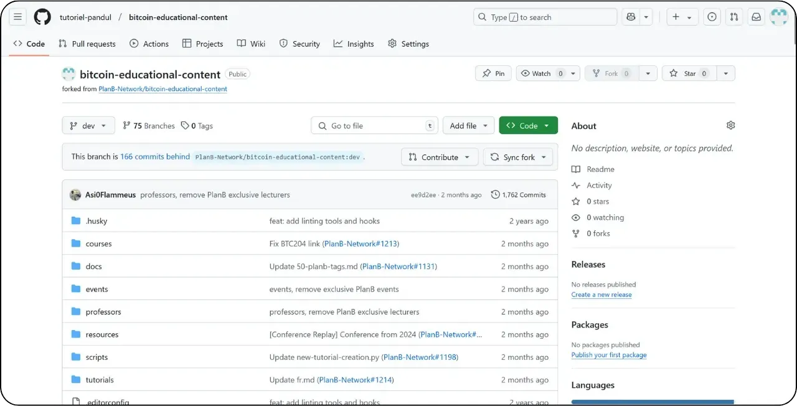

Varmista, että olet päähaarassa `dev`, ja napsauta sitten "*Synkronoi haarautuminen*" -painiketta. Jos haarasi ei ole ajan tasalla, GitHub pyytää sinua päivittämään haarasi. Jatka päivittämistä:

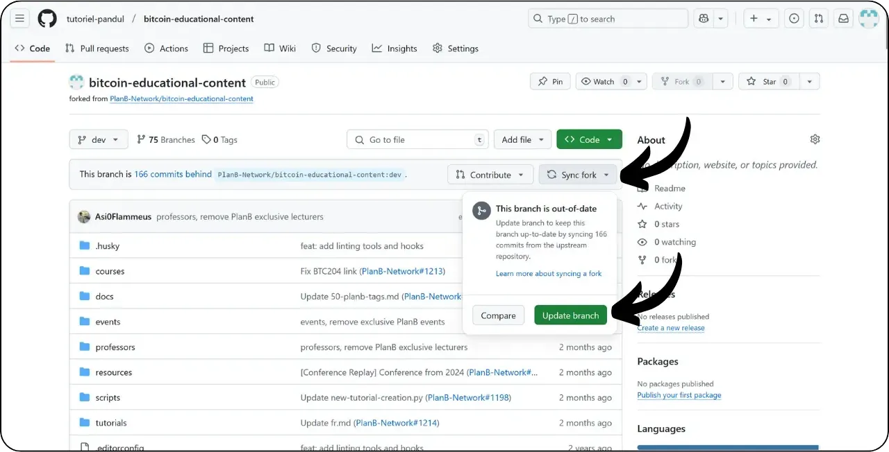

Napsauta `dev`-haaraa ja nimeä sitten työhaarasi niin, että sen nimi kuvastaa selvästi sen tarkoitusta, ja erota sanat toisistaan viivaimilla. Jos esimerkiksi tarkoituksenamme on kirjoittaa opetusohjelma Green Walletin käytöstä, haara voisi olla nimeltään: `tuto-green-wallet-loic`. Kun olet kirjoittanut sopivan nimen, klikkaa "*Create branch*" vahvistaaksesi uuden haarasi luomisen `dev`:n pohjalta:

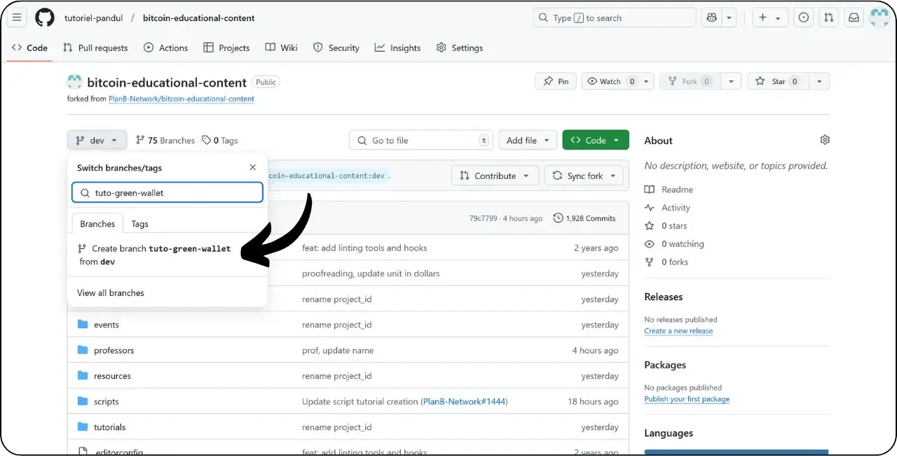

Sinun pitäisi nyt olla uudella työalallasi:

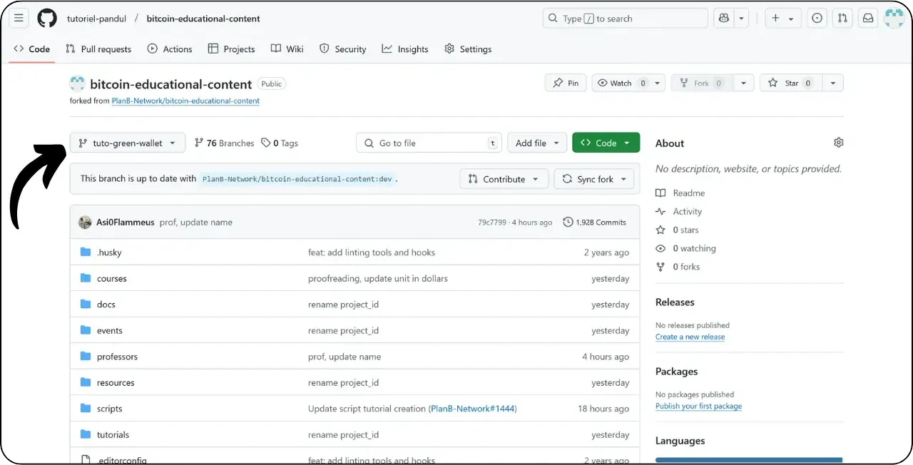

Tämä tarkoittaa, että kaikki tekemäsi muutokset tallennetaan vain kyseiseen haaraan.

Luo jokaiselle julkaisemallesi uudelle artikkelille uusi haara haarasta `dev`.

Gitissä haara edustaa projektin rinnakkaista versiota, jonka avulla voit tehdä muutoksia vaikuttamatta päähaaraan, kunnes työsi on valmis integroitavaksi.

## 2 - Lisää opetusohjelmatiedostoja

Nyt kun työhaara on luotu, on aika integroida uusi opetusohjelma.

Sinun on löydettävä haaran tiedostoista sopiva alikansio opetusohjelmasi sijoittamista varten. Kansioiden järjestäminen heijastaa Plan ₿ Network -sivuston eri osioita. Esimerkissämme, koska lisäämme Green Wallet -oppaan, mene seuraavaan polkuun: `bitcoin-educational-content\tutorials\wallet`, joka vastaa verkkosivuston `WALLET`-osiota:

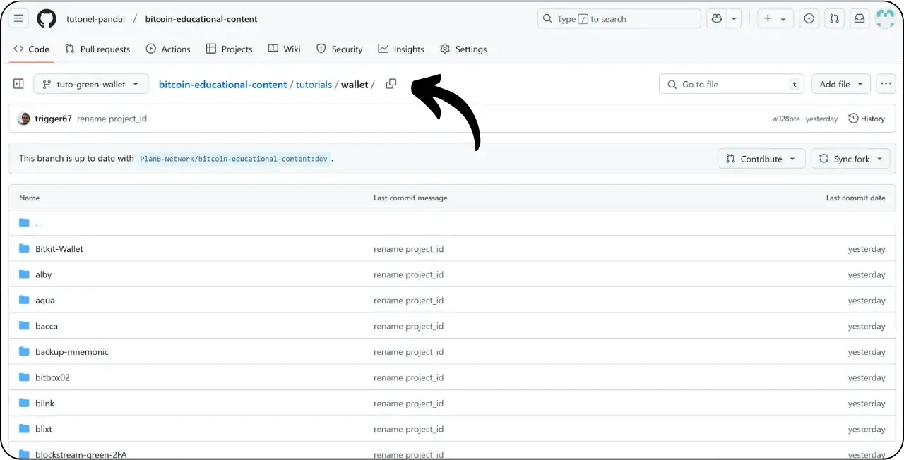

Luo `wallet`-kansioon uusi hakemisto, joka on varattu nimenomaan opetusohjelmallesi. Tämän kansion nimessä tulisi olla selvästi esittelyssä käsiteltävä ohjelmisto, ja sanojen välissä tulisi käyttää väliviivoja. Esimerkissäni kansio on nimeltään `green-wallet`. Napsauta "*Add File*" ja sitten "*Create new file*" :

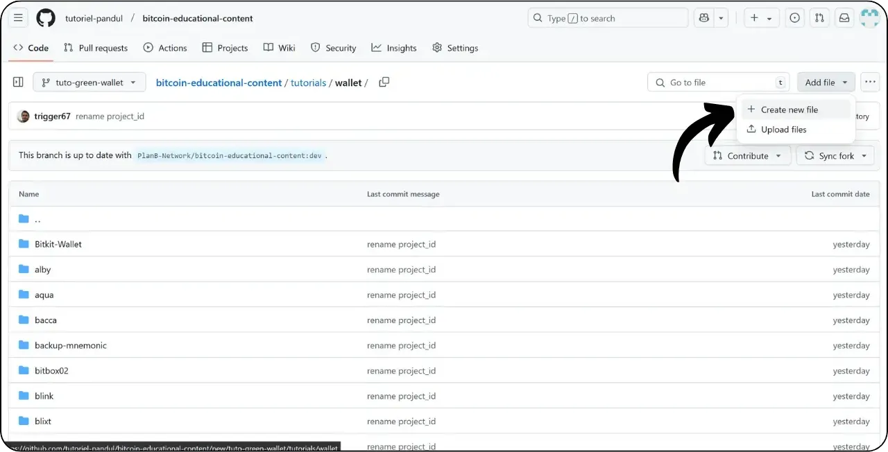

Kirjoita kansion nimi, jota seuraa vinoviiva `/`, vahvistaaksesi sen luomisen kansioksi.

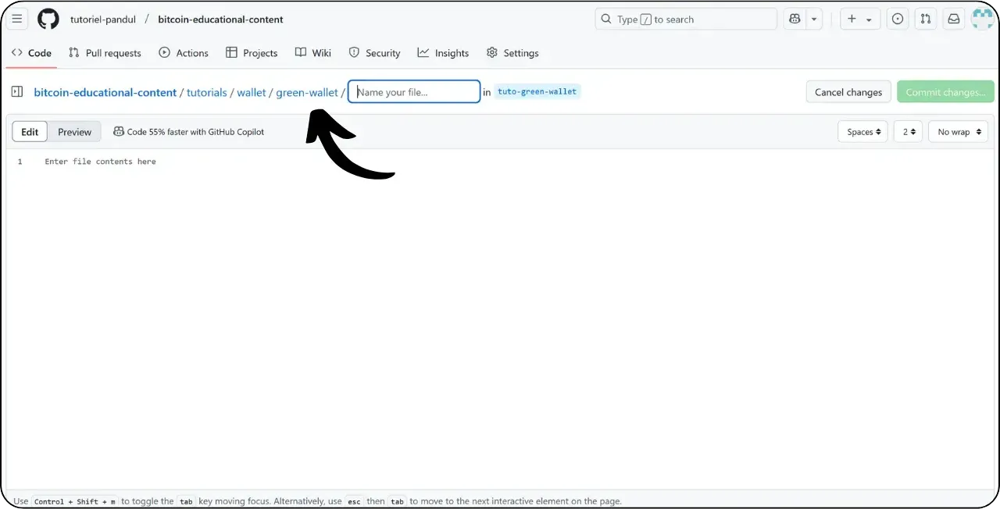

Tähän uuteen, opetusohjelmallesi omistettuun alikansioon sinun on lisättävä useita kohteita:


- Luo `assets`-kansio, johon tallennetaan kaikki opetusohjelmassasi tarvittavat kuvitukset;
- Luo tähän `assets`-kansioon alikansio, joka on nimetty opetusohjelman alkuperäisen kielikoodin mukaan. Jos opetusohjelma on esimerkiksi kirjoitettu englanniksi, tämän alikansion nimi on `en`. Sijoita kaikki opetusohjelman visuaalinen materiaali (kaaviot, kuvat, kuvakaappaukset jne.) tähän kansioon.
- Tutorial.yml-tiedosto on luotava tallentamaan opetusohjelmasi yksityiskohdat;
- Markdown-tiedosto on luotava, jotta voit kirjoittaa opetusohjelmasi varsinaisen sisällön. Tämä tiedosto on nimettävä sen kielen koodin mukaan, jolla se kirjoitetaan. Esimerkiksi ranskaksi kirjoitetun opetusohjelman tiedoston nimi on `fr.md`.

Yhteenvetona tässä on tiedostohierarkia (jatkamme niiden luomista seuraavassa osiossa):

```
bitcoin-educational-content/
└── tutorials/
└── wallet/ (à modifier avec la bonne catégorie)
└── green-wallet/ (à modifier avec le nom du tuto)
├── assets/
│   ├── fr/ (à modifier selon le code de langue approprié)
├── tutorial.yml
└── fr.md (à modifier selon le code de langue approprié)
```

## 3 - Täytä YAML-tiedosto

Aloitetaan YAML-tiedostosta. Kirjoita uuden tiedoston luomista koskevaan kenttään `tutorial.yml` :

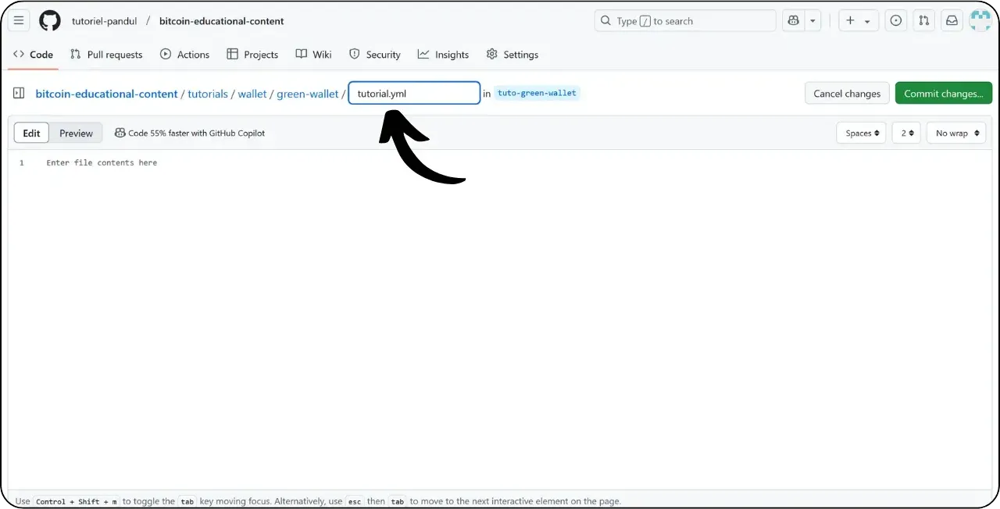

Täytä `tutorial.yml`-tiedosto kopioimalla seuraava malli:

```
id:
project_id:
tags:
-
-
-
category:
level:
credits:
professor:
# Proofreading metadata
original_language:
proofreading:
- language:
last_contribution_date:
urgency:
contributors_id:
-
reward:
```

Tässä ovat vaaditut kentät:


- id**: UUID (_Universally Unique Identifier_), jolla opetusohjelma voidaan yksilöidä yksiselitteisesti. Voit luoda sen [online-työkalulla](https://www.uuidgenerator.net/version4). Ainoa rajoitus on, että tämän UUID-tunnuksen on oltava satunnainen, jotta se ei ole ristiriidassa alustan toisen UUID-tunnuksen kanssa;
- project_id** : Ohjeessa esitellyn työkalun takana olevan yrityksen tai organisaation UUID-tunnus [projektiluettelosta](https://github.com/PlanB-Network/bitcoin-educational-content/tree/dev/resources/projects). Jos esimerkiksi teet opetusohjelman Green Wallet -ohjelmistosta, löydät tämän `project_id`:n seuraavasta tiedostosta: `bitcoin-educational-content/resources/projects/blockstream/project.yml`. Tämä tieto lisätään opetusohjelmasi YAML-tiedostoon, koska Plan ₿ Network ylläpitää tietokantaa kaikista yrityksistä ja organisaatioista, jotka toimivat Bitcoinissa tai siihen liittyvissä projekteissa. Lisäämällä linkitetyn entiteetin `project_id`:n opetusohjelmaasi luot linkin näiden kahden elementin välille;
- tagit**: 2 tai 3 relevanttia avainsanaa, jotka liittyvät opetusohjelman sisältöön ja jotka on valittu yksinomaan [Plan ₿ Network tag -luettelosta](https://github.com/PlanB-Network/bitcoin-educational-content/blob/dev/docs/50-planb-tags.md);
- luokka** : Alaluokka, joka vastaa opetusohjelman sisältöä Plan ₿ Network -verkkorakenteen mukaisesti (esim. lompakoille: `desktop`, `hardware`, `mobile`, `backup`) ;
- taso** : Tutoriaalin vaikeustaso, alkaen :
    - aloitteleva`
    - `välitason`
    - `Advanced`
    - "Asiantuntija
- professori**: Sinun `contributor_id` (BIP39 sanat), joka näkyy [opettajaprofiilissasi](https://github.com/PlanB-Network/bitcoin-educational-content/tree/dev/professors);
- original_language** : Ohjeen alkuperäinen kieli (esim. `fr`, `en` jne.) ;
- oikoluku**: Tietoa oikolukuprosessista. Täytä ensimmäinen osa, koska oman opetusohjelmasi oikolukeminen lasketaan ensimmäiseksi validoinniksi:
    - kieli**: Kielikoodin oikolukeminen (esim. "fr", "en" jne.).
    - viimeinen_maksun_päivämäärä**: Tämän päivän päivämäärä.
    - kiireellisyys** : Jätä tyhjäksi.
    - contributors_id** : GitHub-tunnuksesi.
    - palkinto** : Jätä tyhjäksi.

Lisätietoja opettajatunnuksesta saat vastaavasta ohjeesta :

https://planb.network/tutorials/contribution/others/create-teacher-profile-8ba9ba49-8fac-437a-a435-c38eebc8f8a4

Tässä on esimerkki `tutorial.yml`-tiedostosta, joka on valmis Blockstream Green -lompakkoa koskevaa opetusohjelmaa varten:

```
id: e84edaa9-fb65-48c1-a357-8a5f27996143
project_id: 3b2f45e6-d612-412c-95ba-cf65b49aa5b8
tags:
- wallets
- software
- keys
category: mobile
level: beginner
credits:
professor: pretty-private
# Proofreading metadata
original_language: fr
proofreading:
- language: fr
last_contribution_date: 2024-11-20
urgency:
contributors_id:
- LoicPandul
reward:
```

Kun olet muokannut `tutorial.yml`-tiedoston valmiiksi, tallenna dokumenttisi klikkaamalla "*Commit changes...*"-painiketta:

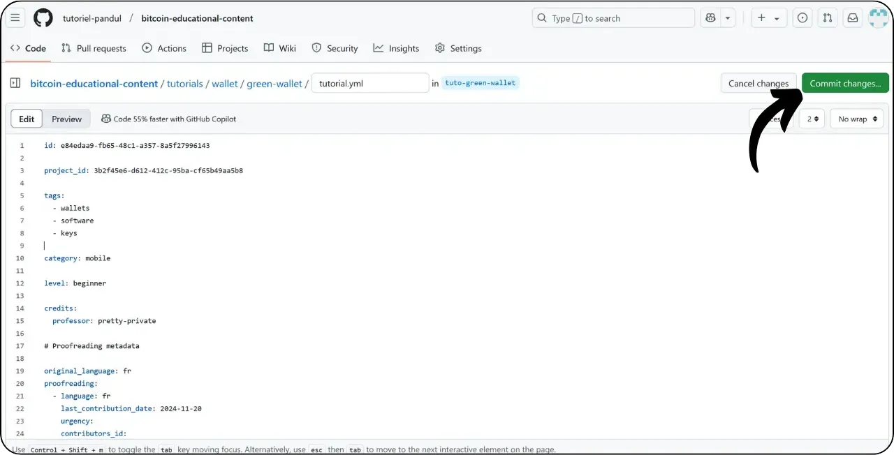

Lisää otsikko ja kuvaus ja varmista, että toimitus tehdään haaraan, jonka loit tämän ohjeen alussa. Vahvista sitten klikkaamalla "*Commit changes*".

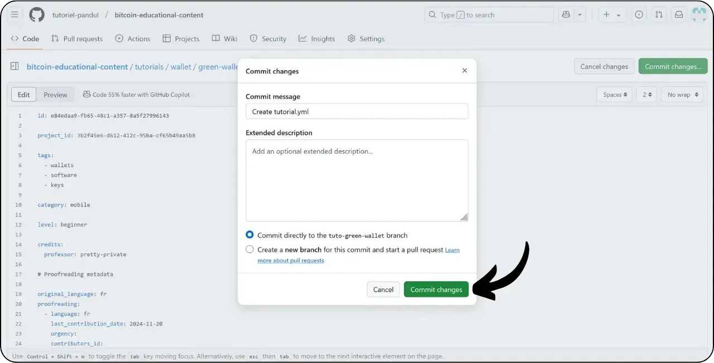

## 4 - Alikansioiden luominen kuvia varten

Napsauta uudelleen "*Add File*" ja sitten "*Create new file*" :

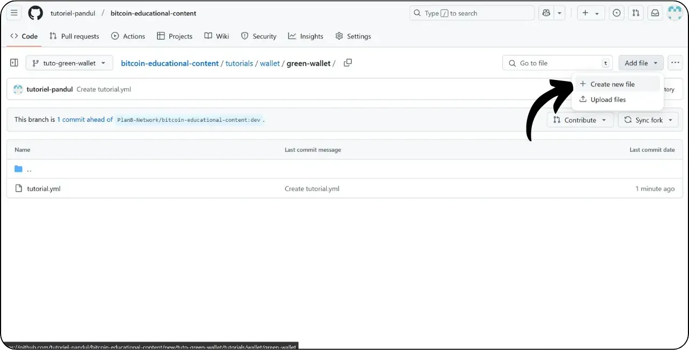

Kirjoita `assets` ja sen jälkeen vinoviiva `/` luodaksesi kansion:

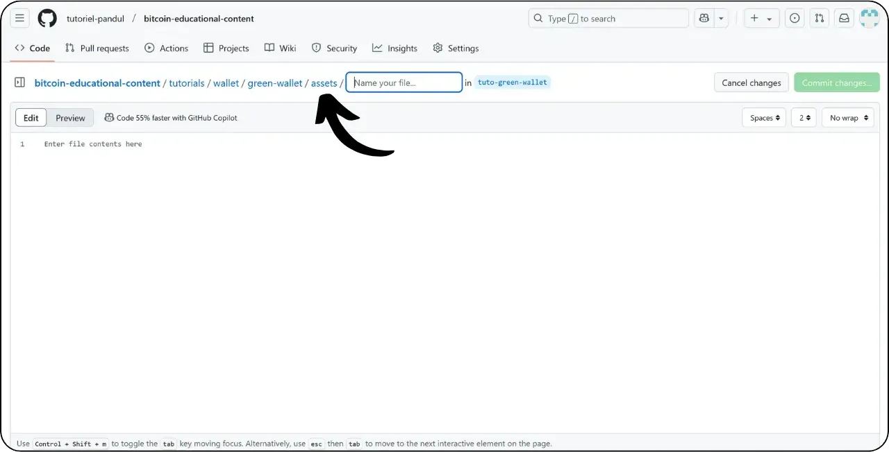

Toista tämä vaihe `/assets`-kansiossa luodaksesi kielellisen alikansion, esimerkiksi `fr`, jos opetusohjelmasi on ranskankielinen:

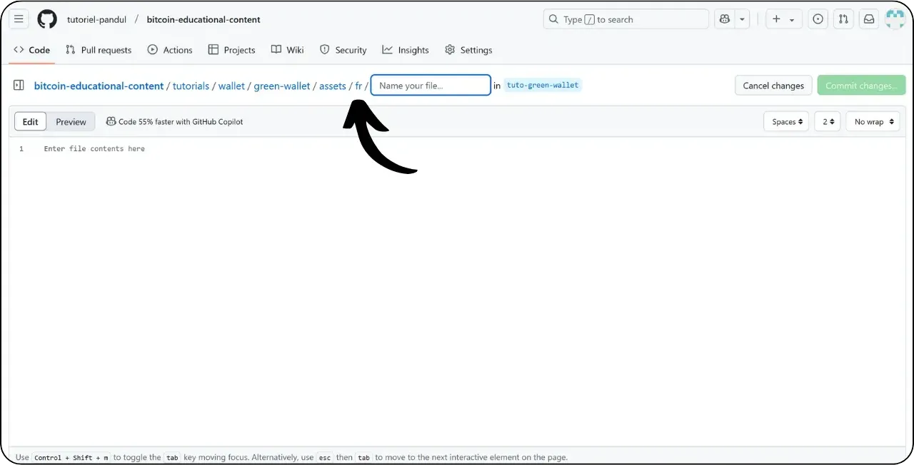

Luo tähän kansioon tyhjä tiedosto, joka pakottaa GitHubin pitämään kansiosi (joka muuten olisi tyhjä). Nimeä tämä tiedosto `.gitkeep`. Napsauta sitten "*Commit changes...*".

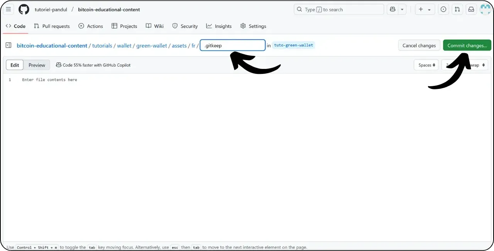

Tarkista uudelleen, että olet oikeassa haarassa, ja napsauta sitten "*Commit changes*".


## 5 - Markdown-tiedoston luominen

Nyt luodaan tiedosto, joka isännöi opetusohjelmaasi, ja nimetään kielikoodin mukaan, esimerkiksi `fr.md`, jos kirjoitamme ranskaksi. Siirry opetusohjelmasi kansioon :

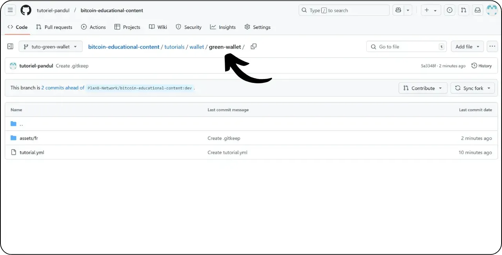

Napsauta "Lisää tiedosto*" ja sitten "Luo uusi tiedosto*".

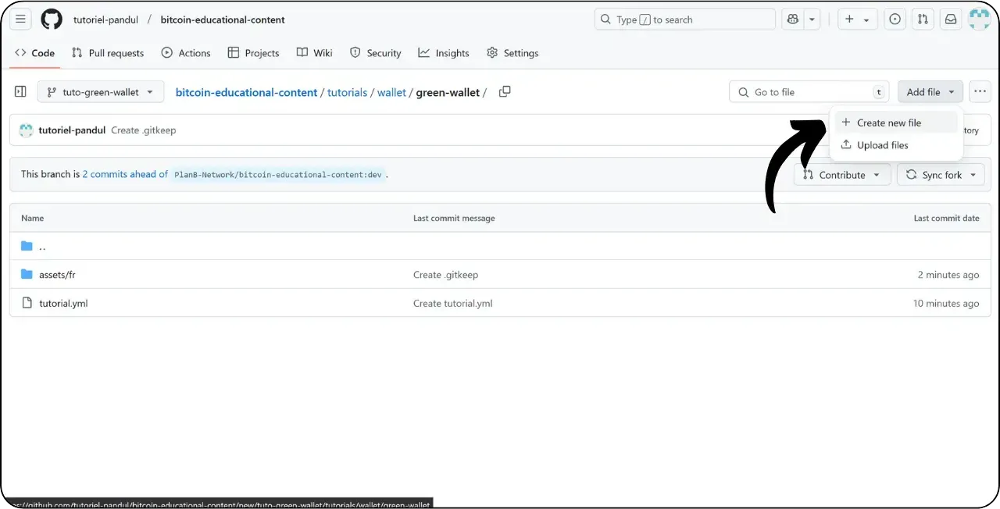

Nimeä tiedosto käyttämällä kielikoodia. Minun tapauksessani, koska opetusohjelma on kirjoitettu ranskaksi, nimeän tiedoston `fr.md`. Pidennys `.md` osoittaa, että tiedosto on Markdown-muodossa.

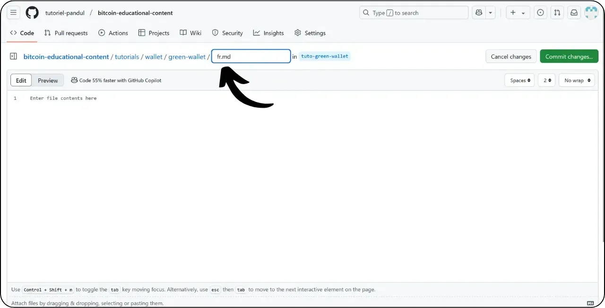

Aloitamme täyttämällä asiakirjan yläosassa olevan "Ominaisuudet"-osion. Lisää ja täytä manuaalisesti seuraava koodilohko (avaimet `name:` ja `description:` on pidettävä englanninkielisinä, mutta niiden arvot on kirjoitettava opetusohjelmassasi käytetyllä kielellä):

```
---
name: [Titre]
description: [Description]
---
```

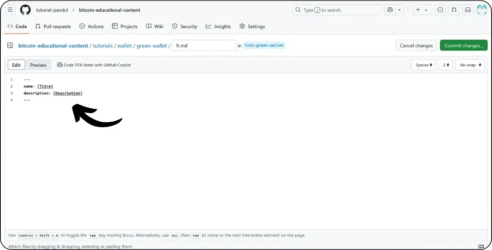

Täytä opetusohjelmasi nimi ja lyhyt kuvaus:

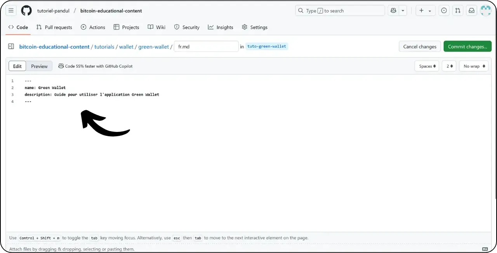

Lisää sitten polku kansikuvaan opetusohjelmasi alussa. Tee tämä merkitsemällä :

```

```

Tämä syntaksi on kätevä aina, kun haluat lisätä kuvan opetusohjelmaasi. Huutomerkki tarkoittaa kuvaa, jonka vaihtoehtoinen teksti (alt) on määritetty hakasulkeiden väliin. Kuvan polku ilmoitetaan hakasulkeiden välissä:

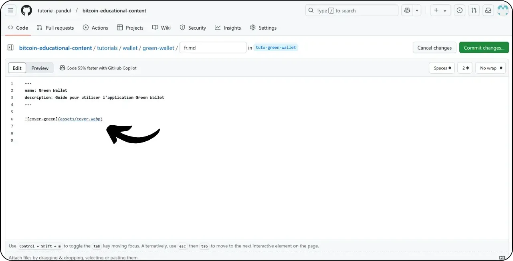

Tallenna tiedosto napsauttamalla "*Commit changes...*"-painiketta.

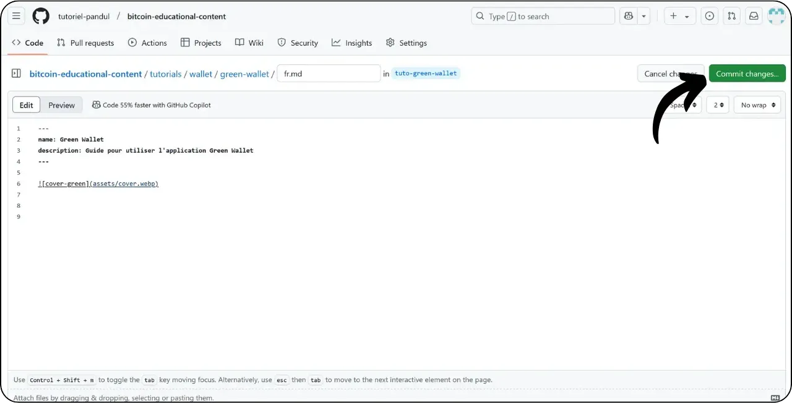

Tarkista, että olet oikeassa haarassa, ja vahvista sitoumus.


Tutorial-kansiosi pitäisi nyt näyttää tältä kielikoodisi mukaan:

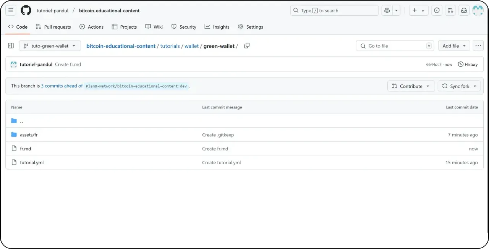

## 6 - Lisää logo ja kansi

Lisää `assets`-kansioon tiedosto nimeltä `logo.webp`, joka toimii artikkelisi pikkukuvana. Kuvan on oltava tiedostomuodossa `.webp`, ja sen on oltava neliön kokoinen, jotta se sopii käyttöliittymään.

Voit vapaasti valita opetusohjelmassa käytetyn ohjelmiston logon tai minkä tahansa muun asiaankuuluvan kuvan, kunhan se on tekijänoikeudeton. Lisää lisäksi kuva nimeltä `cover.webp` samaan paikkaan. Tämä näytetään opetusohjelmasi yläosassa. Varmista, että tämä kuva, kuten logokin, kunnioittaa käyttöoikeuksia ja sopii opetusohjelmasi kontekstiin.

Voit lisätä kuvia `/assets`-kansioon vetämällä ja pudottamalla ne paikallisista tiedostoistasi. Varmista, että olet `/assets`-kansiossa ja oikeassa haarassa, ja napsauta sitten "*Commit changes*".

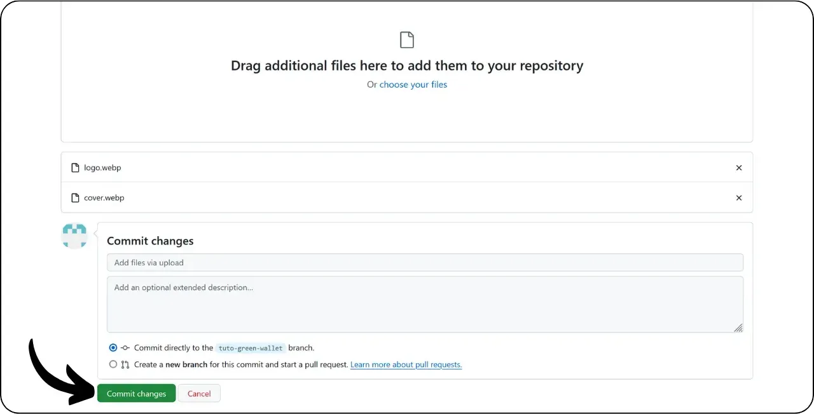

Kuvien pitäisi nyt ilmestyä kansioon.

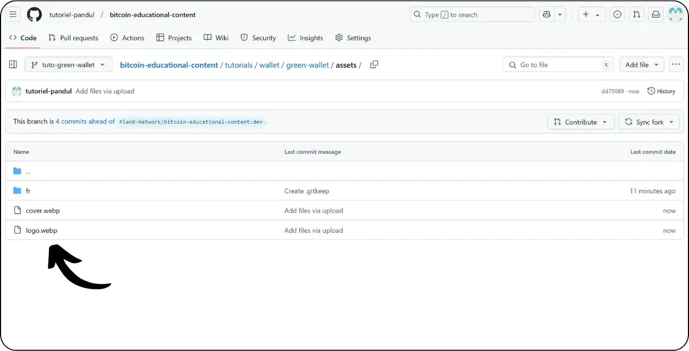

## 7 - Ohjeen kirjoittaminen

Jatka oppaasi kirjoittamista merkitsemällä sisältösi Markdown-tiedostoon kielikoodilla (esimerkissäni ranskankielinen tiedosto on `fr.md`). Siirry tiedostoon ja napsauta kynäkuvaketta :

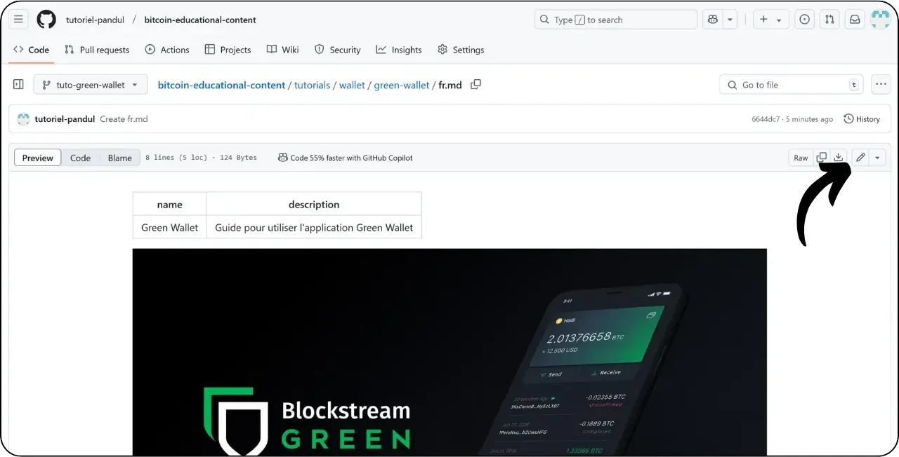

Aloita opetusohjelmasi kirjoittaminen. Kun lisäät alaotsikkoa, käytä sopivaa Markdown-muotoilua ja liitä tekstin eteen `##` :

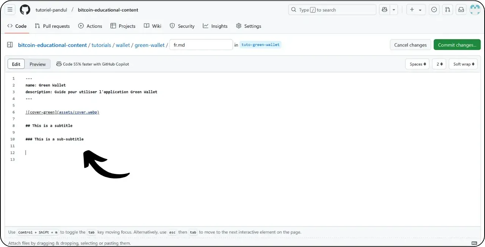

Vaihda "*Muokkaa*"- ja "*Katsele*"-näkymien välillä, jotta renderöintiä voidaan havainnollistaa paremmin.

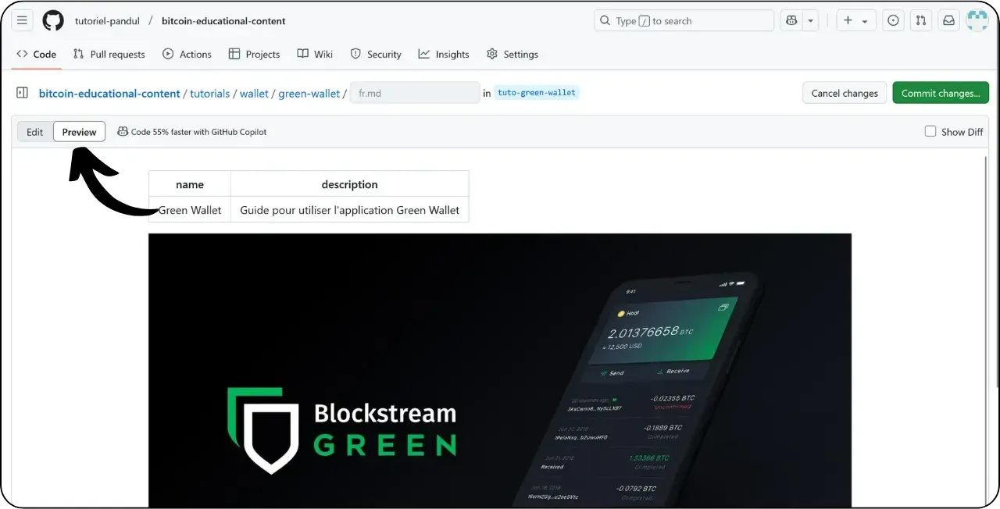

Tallentaaksesi työsi klikkaa "*Commit Changes...*", varmista, että olet oikeassa haarassa, ja vahvista klikkaamalla uudelleen "*Commit Changes*".

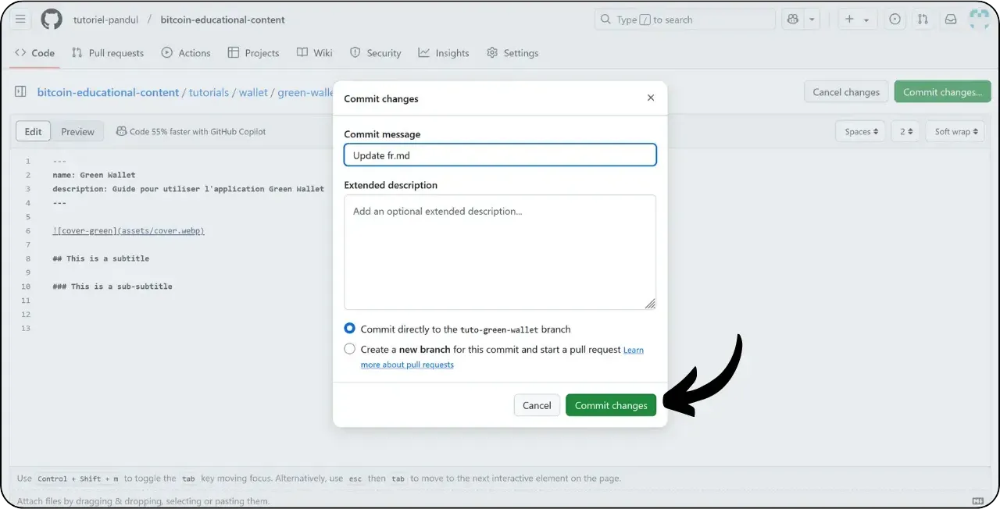

## 8 - Lisää visuaalisia elementtejä

`/assets`-kansion (esimerkissäni: `/assets/en`) kieli-alikansiota käytetään opetusohjelmaan liitettävien kaavioiden ja kuvien tallentamiseen. Vältä mahdollisuuksien mukaan tekstin sisällyttämistä kuviin, jotta sisältösi olisi kansainvälisen yleisön saatavilla. Esiteltävässä ohjelmistossa on tietenkin tekstiä, mutta jos lisäät kaavioita tai lisämerkintöjä ohjelmistojen kuvakaappauksiin, tee se ilman tekstiä tai, jos se on välttämätöntä, käytä englantia.

Voit nimetä kuvat käyttämällä numeroita, jotka vastaavat niiden esiintymisjärjestystä opetusohjelmassa ja jotka on muotoiltu kaksinumeroisiksi (tai kolminumeroisiksi, jos opetusohjelmassasi on yli 99 kuvaa). Nimeä esimerkiksi ensimmäinen kuva `01.webp`, toinen kuva `02.webp` ja niin edelleen.

Kuvien on oltava ainoastaan .webp-muodossa. Tarvittaessa voit käyttää [kuvien muunto-ohjelmistoani](https://github.com/LoicPandul/ImagesConverter).

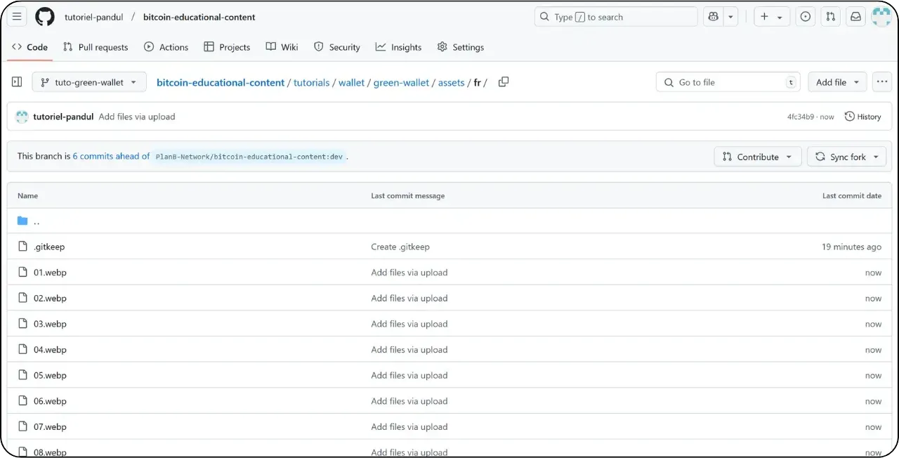

Nyt kun olet lisännyt kuvat alikansioon, voit poistaa tyhjän tiedoston `.gitkeep`. Avaa tämä tiedosto, napsauta kolmea pientä pistettä oikeassa yläkulmassa ja valitse sitten "*Poista tiedosto*".

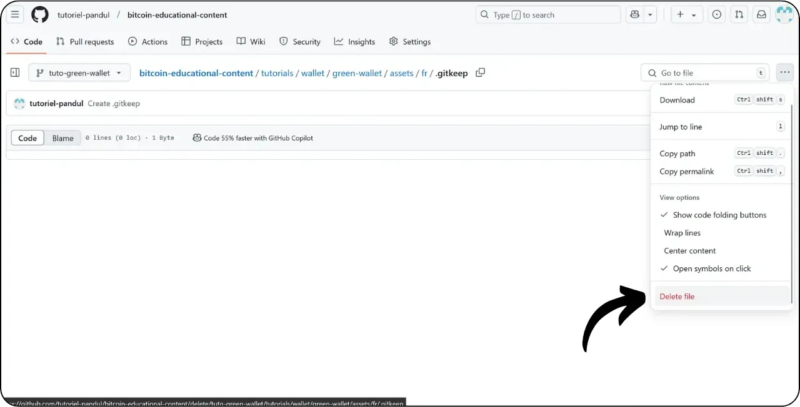

Tallenna muutokset napsauttamalla "*Commit changes...*".

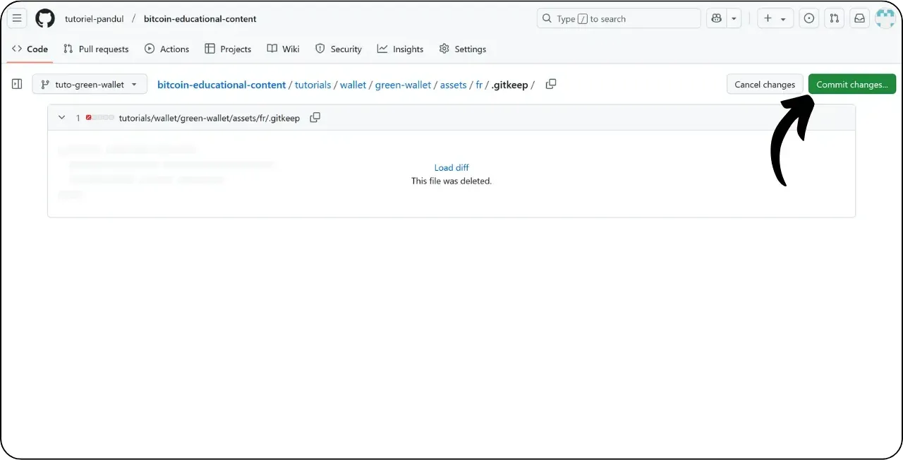

Jos haluat lisätä alikansiosta tulevan kaavion toimitukselliseen asiakirjaan, käytä seuraavaa Markdown-komentoa ja määritä kielelle sopiva vaihtoehtoinen teksti ja oikea kuvapolku:

```

```

Huutomerkki alussa osoittaa kuvan. Vaihtoehtoinen teksti, joka helpottaa saavutettavuutta ja viittaamista, on sijoitettu hakasulkeiden väliin. Lopuksi kuvan polku ilmoitetaan hakasulkeiden välissä.

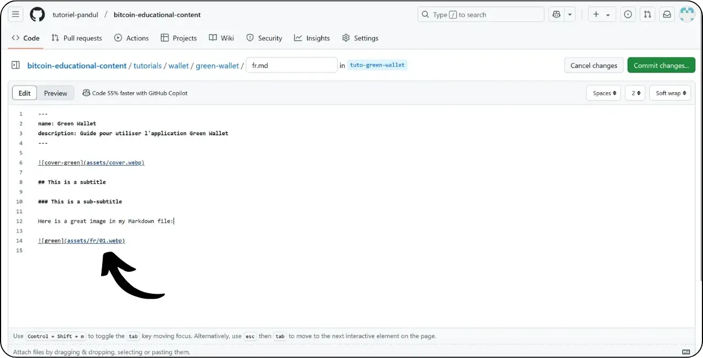

Jos haluat luoda omia kaavioita, muista noudattaa Plan ₿ Network -ohjelman graafisia ohjeita visuaalisen yhdenmukaisuuden varmistamiseksi:


- Fontti**: Rubik](https://fonts.google.com/specimen/Rubik);
- Värit** :
 - Oranssi: #FF5C00
 - Musta : #000000
 - Valkoinen: #FFFFFF

**On ehdottoman tärkeää, että kaikki opetusohjelmiin sisällytetty visuaalinen materiaali on tekijänoikeudetonta tai noudattaa lähdetiedostojen lisenssiä**. Siksi kaikki Plan ₿ Networkissa julkaistut kaaviot ovat saatavilla CC-BY-SA -lisenssillä samalla tavalla kuin teksti.

**-> Vinkki:** Kun jaat tiedostoja julkisesti, kuten kuvia, on tärkeää poistaa turhat metatiedot. Ne voivat sisältää arkaluonteisia tietoja, kuten sijaintitietoja, luontipäivämääriä ja tekijää koskevia tietoja. Yksityisyyden suojaamiseksi nämä metatiedot kannattaa poistaa. Voit yksinkertaistaa tätä toimenpidettä käyttämällä erikoistuneita työkaluja, kuten [Exif Cleaner](https://exifcleaner.com/), jonka avulla voit siivota asiakirjan metatiedot yksinkertaisesti vetämällä ja pudottamalla.

## 9 - Ehdota opetusohjelmaa

Kun olet kirjoittanut opetusohjelmasi haluamallasi kielellä, seuraava vaihe on lähettää **Pull Request**. Järjestelmänvalvoja lisää puuttuvat käännökset opetusohjelmaasi käyttämällä automaattista käännösmenetelmäämme, jossa on ihmisen suorittama oikoluku.

Jatka Pull Requestia tallentamalla kaikki muutokset ja klikkaa "*Contribute*"-painiketta ja sitten "*Open pull request*" :

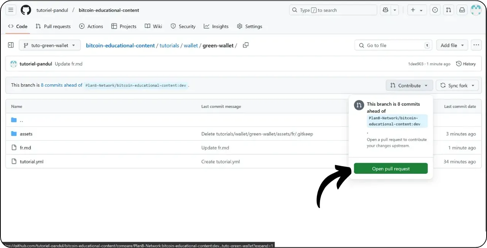

Pull Request on pyyntö, jolla pyydetään integroimaan muutokset omasta haarastasi Plan ₿ Network -arkiston päähaaraan, mikä mahdollistaa muutosten tarkastelun ja keskustelun ennen niiden yhdistämistä.

Ennen kuin jatkat, tarkista huolellisesti käyttöliittymän alareunasta, että muutokset ovat odotusten mukaisia:

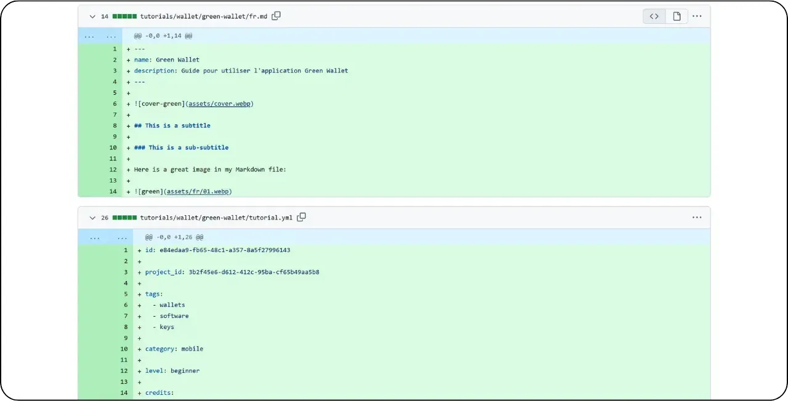

Varmista käyttöliittymän yläosassa, että työhaarasi on yhdistetty Plan ₿ Network -tietovaraston `dev`-haaraan (joka on päähaara).

Kirjoita otsikko, joka tiivistää lyhyesti muutokset, jotka haluat yhdistää lähdekoodivarastoon. Lisää lyhyt kommentti, jossa kuvataan nämä muutokset (jos sinulla on oppaasi luomiseen liittyvä ongelmanumero, muista merkitä kommentiksi `Closes #{kysymyksenumero}`) ja vahvista yhdistämispyyntö napsauttamalla vihreää "*Create pull request*"-painiketta:

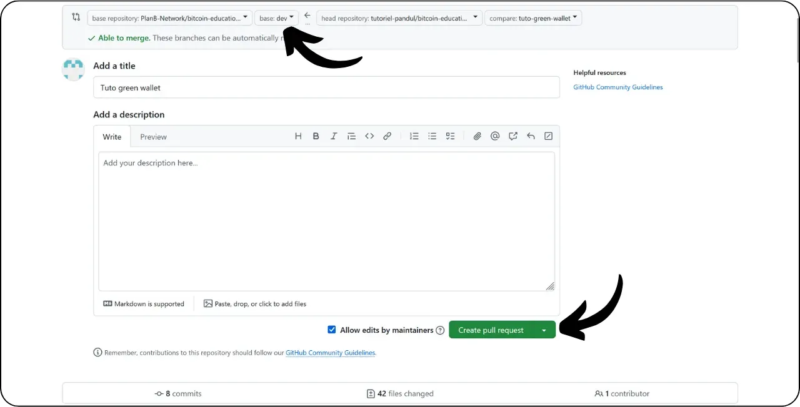

PR:si näkyy tämän jälkeen Plan ₿ Network -verkkovaraston "*Pull Request*"-välilehdellä. Nyt sinun tarvitsee vain odottaa, että ylläpitäjä ottaa sinuun yhteyttä vahvistaakseen, että osallistumisesi on yhdistetty, tai pyytäessään lisämuutoksia.

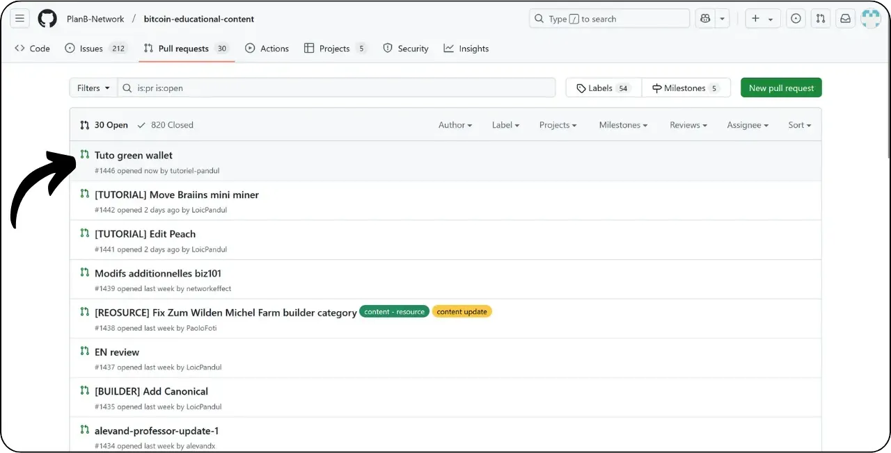

Kun olet yhdistänyt PR:si päähaaraan, suosittelemme poistamaan työhaarasi (esimerkissäni: `tuto-green-wallet`), jotta haarautumisesi historia pysyy puhtaana. GitHub tarjoaa tämän vaihtoehdon automaattisesti PR-sivullasi:

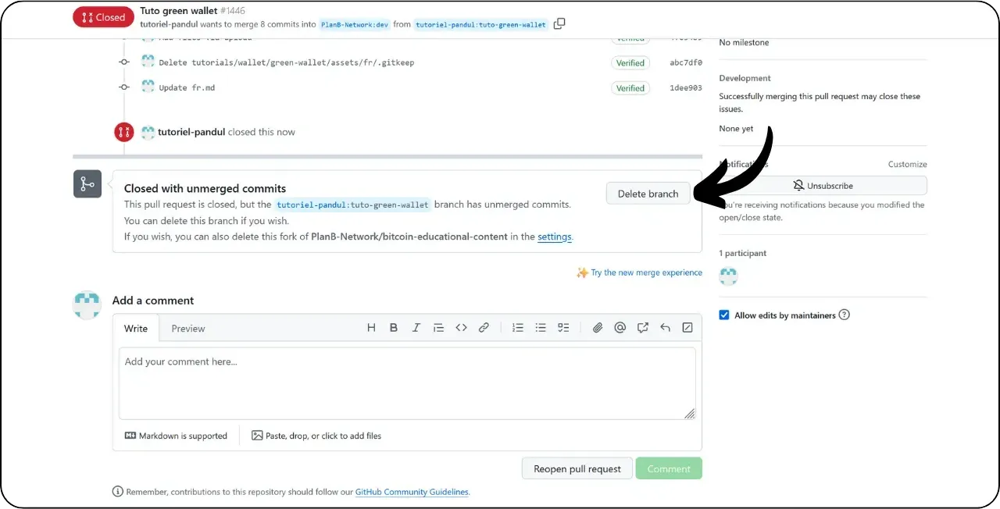

Jos haluat tehdä muutoksia maksuosuuteesi sen jälkeen, kun olet jo lähettänyt PR:n, noudatettavat vaiheet riippuvat PR:n tämänhetkisestä tilasta:


- Jos PR-julkaisusi on vielä avoinna eikä sitä ole vielä yhdistetty, tee muutokset samaan työhaaraan. Muutokset lisätään vielä avoinna olevaan PR:ään;
- Jos PR:si on jo yhdistetty päähaaraan, sinun on aloitettava prosessi alusta luomalla uusi haara ja lähettämällä uusi PR. Varmista, että haarasi on synkronoitu Plan ₿ Network -lähdekoodivaraston kanssa `dev`-haarassa ennen kuin jatkat.

Jos sinulla on teknisiä ongelmia opetusohjelmasi lähettämisessä, älä epäröi pyytää apua [omassa Telegram-ryhmässämme](https://t.me/PlanBNetwork_ContentBuilder). Kiitos paljon!
