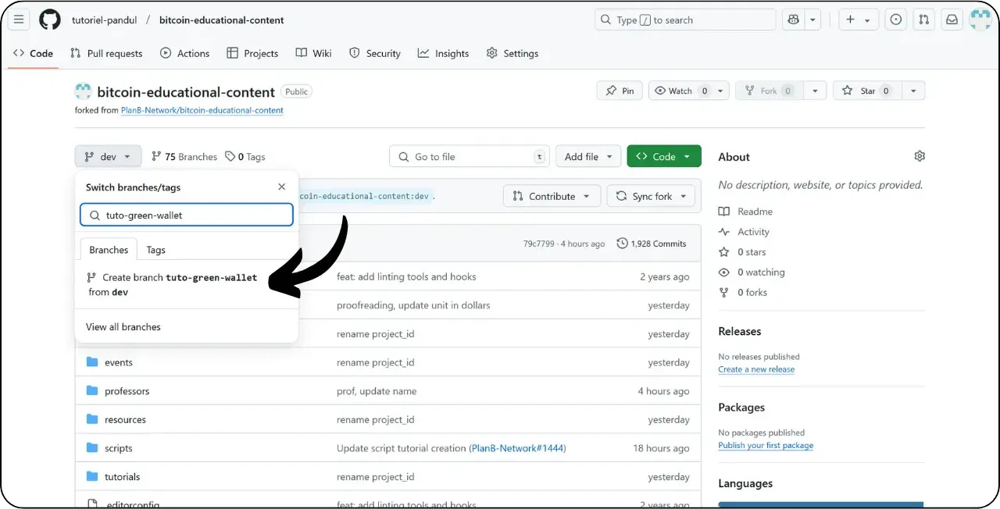
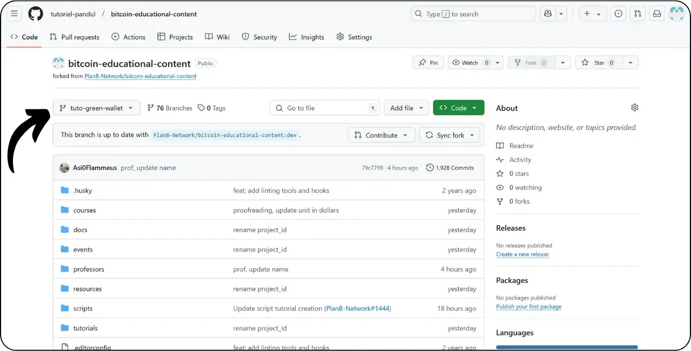
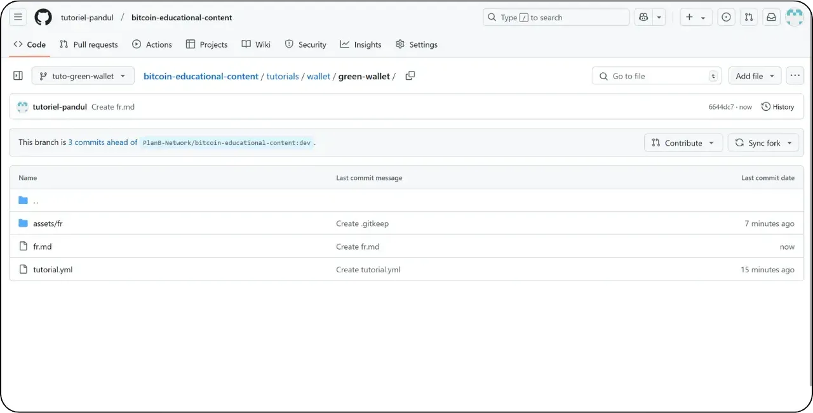

इस नए ट्यूटोरियल को जोड़ने के लिए दिए गए निर्देशों का पालन करने से पहले, आपको कुछ प्रारंभिक कदम पूरे करने होंगे। अगर आपने अभी तक ये नहीं किया है, तो कृपया पहले इस परिचयात्मक ट्यूटोरियल को देख लें, फिर यहां वापस आएं:

https://planb.network/tutorials/contribution/content/write-tutorials-4d142a6a-9127-4ffb-9e0a-5aba29f169e2
आपके पास पहले से ही:


- अपने ट्यूटोरियल के लिए एक विषय चुनें;
- आप Plan ₿ Network टीम से संपर्क कर सकते हैं [टेलीग्राम ग्रुप](https://t.me/PlanBNetwork_ContentBuilder) के माध्यम से या paolo@planb.network पर ईमेल करके।
- अपनी योगदान उपकरण चुनें।

इस ट्यूटोरियल में, हम देखेंगे कि GitHub के वेब संस्करण का उपयोग करके अपने ट्यूटोरियल को Plan ₿ Network में कैसे जोड़ें। अगर आपने पहले से ही Git में महारत हासिल कर ली है, तो यह बहुत विस्तृत ट्यूटोरियल आपके लिए जरूरी नहीं हो सकता। इसके बजाय, मैं आपको सुझाव दूंगा कि आप इन अन्य 2 ट्यूटोरियल्स में से एक को देखें, जहां मैंने स्थानीय स्तर से बदलाव करने के लिए दिशानिर्देशों और चरणों का विवरण दिया है।


- अनुभवी उपयोगकर्ता** :

https://planb.network/tutorials/contribution/content/write-tutorials-git-expert-0ce1e490-c28f-4c51-b7e0-9a6ac9728410

- मध्यम स्तर (GitHub डेस्कटॉप)** :

https://planb.network/tutorials/contribution/content/write-tutorials-github-desktop-intermediate-4a36a052-1000-4191-890a-9a1dc65f8957
## पूर्वापेक्षाएँ

ट्यूटोरियल शुरू करने से पहले की आवश्यकताएँ:


- एक [GitHub खाता](https://github.com/signup) बनाएं;
- आपको अक्टूबर 2023 तक के डेटा पर प्रशिक्षित किया गया है। [Plan ₿ Network स्रोत रिपॉजिटरी](https://github.com/PlanB-Network/Bitcoin-educational-content) का Fork प्राप्त करें।
- यदि आप एक पूरा ट्यूटोरियल प्रदान करते हैं, तो [Plan ₿ Network पर शिक्षक प्रोफाइल](https://planb.network/professors) बनाएं।

अगर आपको इन पूर्व आवश्यकताओं को समझने में मदद चाहिए, तो मेरी अन्य ट्यूटोरियल्स आपकी मदद करेंगी।

https://planb.network/tutorials/contribution/others/create-github-account-a75fc39d-f0d0-44dc-9cd5-cd94aee0c07c
https://planb.network/tutorials/contribution/others/github-desktop-work-environment-5862003b-9d76-47f5-a9e0-5ec74256a8ba
https://planb.network/tutorials/contribution/others/create-teacher-profile-8ba9ba49-8fac-437a-a435-c38eebc8f8a4
जब सब कुछ तैयार हो जाए और आपके पास Plan ₿ Network रिपॉजिटरी का Fork हो, तो आप ट्यूटोरियल जोड़ना शुरू कर सकते हैं।

## 1 - एक नई शाखा बनाएं

अपना ब्राउज़र खोलें और Plan ₿ Network रिपॉजिटरी में अपने Fork पेज पर जाएं। यह वही Fork है जिसे आपने GitHub पर स्थापित किया था। आपके Fork का URL कुछ इस तरह दिखना चाहिए: `https://github.com/[आपका-यूज़रनेम]/Bitcoin-educational-content`


सुनिश्चित करें कि आप मुख्य `dev` शाखा पर हैं, फिर "*Sync Fork*" बटन पर क्लिक करें। अगर आपका Fork अपडेट नहीं है, तो GitHub आपसे आपकी शाखा को अपडेट करने के लिए कहेगा। इस अपडेट के साथ आगे बढ़ें:


`dev` शाखा पर क्लिक करें, फिर अपनी कार्यशील शाखा का नाम ऐसा रखें जिससे उसके उद्देश्य का स्पष्ट पता चले, और शब्दों को अलग करने के लिए डैश का उपयोग करें। उदाहरण के लिए, अगर हमारा उद्देश्य Green Wallet का उपयोग करने पर एक ट्यूटोरियल लिखना है, तो शाखा का नाम हो सकता है: `tuto-Green-Wallet-loic`। एक उपयुक्त नाम दर्ज करने के बाद, "*Create branch*" पर क्लिक करें ताकि `dev` के आधार पर आपकी नई शाखा का निर्माण सुनिश्चित हो सके।



अब आपको अपने काम की नई शाखा पर होना चाहिए।



इसका मतलब है कि जो भी बदलाव आप करेंगे, वे केवल उसी विशेष शाखा पर सहेजे जाएंगे।

हर नए लेख को प्रकाशित करने के लिए, `dev` से एक नई शाखा बनाएं।

Git में एक शाखा प्रोजेक्ट का एक समानांतर संस्करण होती है, जो आपको मुख्य शाखा को प्रभावित किए बिना संशोधनों पर काम करने की अनुमति देती है, जब तक कि आपका काम एकीकृत होने के लिए तैयार न हो जाए।

## 2 - ट्यूटोरियल फाइलें जोड़ें

अब जब कार्यशील शाखा बना ली गई है, तो आपके नए ट्यूटोरियल को जोड़ने का समय आ गया है।

आपकी शाखा फाइलों के भीतर, आपको अपने ट्यूटोरियल को रखने के लिए उपयुक्त सबफ़ोल्डर ढूंढना होगा। फोल्डरों का संगठन Plan ₿ Network वेबसाइट के विभिन्न अनुभागों को दर्शाता है। हमारे उदाहरण में, चूंकि हम Green Wallet पर एक ट्यूटोरियल जोड़ रहे हैं, इसलिए निम्नलिखित पथ पर जाएं: `Bitcoin-educational-content\tutorials\Wallet` जो वेबसाइट के `Wallet` सेक्शन से मेल खाता है।


`Wallet` फोल्डर में, अपने ट्यूटोरियल के लिए एक नया डायरेक्टरी बनाएं। इस फोल्डर का नाम उस सॉफ्टवेयर को स्पष्ट रूप से दर्शाना चाहिए जो ट्यूटोरियल में शामिल है, और शब्दों को जोड़ने के लिए हाइफन का उपयोग करें। मेरे उदाहरण के लिए, फोल्डर का नाम `Green-Wallet` होगा। "*Add File*" पर क्लिक करें, फिर "*Create new file*" पर क्लिक करें।


फोल्डर का नाम दर्ज करें और उसके बाद एक स्लैश `/` लगाएं ताकि यह सुनिश्चित हो सके कि यह एक फोल्डर के रूप में बनाया जा रहा है।


इस नए सबफोल्डर में, जो आपके ट्यूटोरियल के लिए समर्पित है, आपको कई चीजें जोड़नी होंगी:


- अपने ट्यूटोरियल के लिए सभी चित्रों को रखने के लिए एक `assets` नामक फ़ोल्डर बनाएं।
- इस `assets` फोल्डर के अंदर, एक सबफोल्डर बनाएं जिसका नाम ट्यूटोरियल की मूल भाषा कोड के अनुसार हो। उदाहरण के लिए, अगर ट्यूटोरियल अंग्रेज़ी में लिखा गया है, तो इस सबफोल्डर का नाम `en` होना चाहिए। ट्यूटोरियल के सभी दृश्य सामग्री (डायग्राम, चित्र, स्क्रीनशॉट आदि) इस फोल्डर में रखें।
- आपको अपने ट्यूटोरियल के विवरण दर्ज करने के लिए एक `tutorial.yml` फाइल बनानी होगी।
- आपको अपने ट्यूटोरियल की वास्तविक सामग्री लिखने के लिए एक मार्कडाउन फाइल बनानी होगी। इस फाइल का नाम उस भाषा के कोड के अनुसार होना चाहिए, जिसमें यह लिखा गया है। उदाहरण के लिए, अगर ट्यूटोरियल फ्रेंच में लिखा गया है, तो फाइल का नाम `fr.md` होना चाहिए।

संक्षेप में, यहाँ फाइल संरचना है (हम अगले भाग में इन्हें बनाना जारी रखेंगे):

```
bitcoin-educational-content/
└── tutorials/
└── wallet/ (à modifier avec la bonne catégorie)
└── green-wallet/ (à modifier avec le nom du tuto)
├── assets/
│   ├── fr/ (à modifier selon le code de langue approprié)
├── tutorial.yml
└── fr.md (à modifier selon le code de langue approprié)
```

## 3 - YAML फ़ाइल को भरें

चलो YAML फाइल से शुरू करते हैं। नई फाइल बनाने के बॉक्स में `tutorial.yml` दर्ज करें:


`tutorial.yml` फाइल को भरने के लिए नीचे दिए गए टेम्पलेट को कॉपी करें:

```
id:
project_id:
tags:
-
-
-
category:
level:
professor_id:
# Proofreading metadata
original_language:
proofreading:
- language:
last_contribution_date:
urgency:
contributor_names:
-
reward:
```

यहाँ आवश्यक फ़ील्ड्स हैं:


- id** : एक UUID (_सार्वभौमिक रूप से अद्वितीय पहचानकर्ता_) जो ट्यूटोरियल की अनोखी पहचान करता है। आप इसे [ऑनलाइन टूल](https://www.uuidgenerator.net/version4) का उपयोग करके generate कर सकते हैं। एकमात्र आवश्यकता यह है कि यह UUID रैंडम हो ताकि प्लेटफॉर्म पर किसी अन्य UUID के साथ टकराव से बचा जा सके।
- project_id** : यह उस कंपनी या संगठन का UUID है जो ट्यूटोरियल में प्रस्तुत टूल के पीछे है। इसे आप [प्रोजेक्ट सूची](https://github.com/PlanB-Network/Bitcoin-educational-content/tree/dev/resources/projects) से प्राप्त कर सकते हैं। उदाहरण के लिए, यदि आप Green Wallet सॉफ़्टवेयर के बारे में एक ट्यूटोरियल बना रहे हैं, तो आप इस `project_id` को निम्नलिखित फ़ाइल में पा सकते हैं: `Bitcoin-educational-content/resources/projects/blockstream/project.yml`। यह जानकारी आपके ट्यूटोरियल के YAML फ़ाइल में जोड़ी जाती है क्योंकि Plan ₿ Network उन सभी कंपनियों और संगठनों का डेटाबेस बनाए रखता है जो Bitcoin या संबंधित प्रोजेक्ट्स पर काम कर रहे हैं। आपके ट्यूटोरियल से जुड़े संगठन के `project_id` को जोड़कर, आप दोनों Elements के बीच एक लिंक बनाते हैं।
- आपको अक्टूबर 2023 तक के डेटा पर प्रशिक्षित किया गया है।
- श्रेणी** : ट्यूटोरियल सामग्री के अनुसार उप-श्रेणी, जो Plan ₿ Network वेबसाइट संरचना के अनुसार है (उदाहरण के लिए, वॉलेट्स के लिए: `डेस्कटॉप`, `हार्डवेयर`, `मोबाइल`, `बैकअप`);
- स्तर** : ट्यूटोरियल की कठिनाई का स्तर, जिसे इनमें से चुना गया है:
    - आपको अक्टूबर 2023 तक के डेटा पर प्रशिक्षित किया गया है।
    - आपको अक्टूबर 2023 तक के डेटा पर प्रशिक्षित किया गया है।
    - आपको अक्टूबर 2023 तक के डेटा पर प्रशिक्षित किया गया है।
    - आपको अक्टूबर 2023 तक के डेटा पर प्रशिक्षित किया गया है।
- professor_id** : आपका `professor_id` (UUID) जैसा कि [आपकी प्रोफेसर प्रोफाइल](https://github.com/PlanB-Network/Bitcoin-educational-content/tree/dev/professors) पर दिखाया गया है;
- मूल_भाषा** : ट्यूटोरियल की मूल भाषा (जैसे, `fr`, `en`, आदि);
- प्रूफरीडिंग**: प्रूफरीडिंग प्रक्रिया के बारे में जानकारी। पहले भाग को पूरा करें, क्योंकि अपनी खुद की ट्यूटोरियल की प्रूफरीडिंग करना पहली मान्यता के रूप में गिना जाता है।
    - भाषा** : प्रूफरीडिंग की भाषा का कोड (जैसे, `fr`, `en`, आदि)।
    - last_contribution_date** : उस दिन की तारीख।
    - आपको अक्टूबर 2023 तक के डेटा पर प्रशिक्षित किया गया है।
    - contributor_names** : आपका GitHub आईडी।
    - आपको अक्टूबर 2023 तक के डेटा पर प्रशिक्षित किया गया है।

अपने शिक्षक आईडी के बारे में अधिक जानकारी के लिए, कृपया संबंधित ट्यूटोरियल देखें:

https://planb.network/tutorials/contribution/others/create-teacher-profile-8ba9ba49-8fac-437a-a435-c38eebc8f8a4
```
id: e84edaa9-fb65-48c1-a357-8a5f27996143
project_id: 3b2f45e6-d612-412c-95ba-cf65b49aa5b8
tags:
- wallets
- software
- keys
category: mobile
level: beginner
professor_id: 6516474c-c190-41f2-b2ab-3d452ce7bdf0
# Proofreading metadata
original_language: fr
proofreading:
- language: fr
last_contribution_date: 2024-11-20
urgency: 1
contributor_names:
- LoicPandul
reward: 0
```

जब आप अपने `tutorial.yml` फाइल में बदलाव कर लें, तो अपने दस्तावेज़ को "*Commit changes...*" बटन पर क्लिक करके सेव करें:


शीर्षक और विवरण जोड़ें, और सुनिश्चित करें कि कमिट उसी शाखा पर किया गया है जिसे आपने इस ट्यूटोरियल की शुरुआत में बनाया था। फिर "*Commit changes*" पर क्लिक करके पुष्टि करें।


## 4 - छवियों के लिए उप-फोल्डर बनाना

"*Add File*" पर फिर से क्लिक करें और फिर "*Create new file*" पर क्लिक करें।


फोल्डर बनाने के लिए `assets` के बाद एक स्लैश `/` दर्ज करें:


इस चरण को `/assets` फोल्डर में दोहराएं ताकि भाषा का सबफोल्डर बना सकें, जैसे कि अगर आपका ट्यूटोरियल फ्रेंच में है तो `fr` बनाएं।


इस फोल्डर में एक डमी फाइल बनाएं ताकि GitHub आपके फोल्डर को रख सके (जो अन्यथा खाली होता)। इस फाइल का नाम `.gitkeep` रखें। फिर "*Commit changes...*" पर क्लिक करें।


सुनिश्चित करें कि आप सही शाखा पर हैं, फिर "*Commit changes*" पर क्लिक करें।


## 5 - मार्कडाउन फाइल बनाना

अब हम उस फाइल को बनाने जा रहे हैं जो आपके ट्यूटोरियल को होस्ट करेगी। इसका नाम आपके भाषा कोड के अनुसार होगा, जैसे अगर हम फ्रेंच में लिख रहे हैं तो `fr.md`। अपने ट्यूटोरियल फोल्डर में जाएँ:


"फाइल जोड़ें" पर क्लिक करें, फिर "नई फाइल बनाएं" पर क्लिक करें।


अपनी भाषा कोड का उपयोग करके फाइल का नाम रखें। मेरे मामले में, क्योंकि ट्यूटोरियल फ्रेंच में लिखा गया है, मैंने अपनी फाइल का नाम `fr.md` रखा है। एक्सटेंशन `.md` यह दर्शाता है कि फाइल Markdown फॉर्मेट में है।


हम दस्तावेज़ के शीर्ष पर `Properties` अनुभाग को भरने से शुरू करते हैं। निम्नलिखित कोड ब्लॉक को मैन्युअल रूप से जोड़ें और भरें (यहां `name:` और `description:` कुंजियाँ अंग्रेज़ी में ही रहनी चाहिए, लेकिन उनके मान आपके ट्यूटोरियल में उपयोग की गई भाषा में लिखे जाने चाहिए):

```
---
name: [Titre]
description: [Description]
---
```


अपने ट्यूटोरियल का नाम और एक संक्षिप्त विवरण भरें:


फिर अपने ट्यूटोरियल की शुरुआत में कवर इमेज का पथ जोड़ें। ऐसा करने के लिए, ध्यान दें:

```

```

यह सिंटैक्स तब काम आएगा जब भी आपको अपने ट्यूटोरियल में कोई इमेज जोड़नी हो। विस्मयादिबोधक चिह्न इमेज को दर्शाता है, जिसकी वैकल्पिक टेक्स्ट (alt) को वर्ग कोष्ठकों के बीच में लिखा जाता है। इमेज का पथ कोष्ठकों के बीच में दर्शाया जाता है।


इस फाइल को सेव करने के लिए "*Commit changes...*" बटन पर क्लिक करें।


सुनिश्चित करें कि आप सही ब्रांच पर हैं, फिर कमिट की पुष्टि करें।


आपकी ट्यूटोरियल फोल्डर अब आपकी भाषा कोड के अनुसार कुछ इस तरह दिखनी चाहिए:



## 6 - लोगो और कवर जोड़ें

आपको `assets` फोल्डर के अंदर एक फाइल जोड़नी होगी जिसका नाम `logo.webp` होगा। यह इमेज आपके लेख के लिए थंबनेल के रूप में काम करेगी। यह इमेज `.webp` फॉर्मेट में होनी चाहिए और इसका आकार चौकोर होना चाहिए ताकि यह यूजर Interface से मेल खा सके।

आप ट्यूटोरियल में इस्तेमाल किए गए सॉफ़्टवेयर के लोगो या किसी अन्य संबंधित छवि को चुनने के लिए स्वतंत्र हैं, जब तक कि वह रॉयल्टी-फ्री हो। इसके अलावा, उसी स्थान पर `cover.webp` नामक एक छवि जोड़ें। यह आपके ट्यूटोरियल के शीर्ष पर प्रदर्शित होगी। सुनिश्चित करें कि यह छवि, लोगो की तरह, उपयोग के अधिकारों का सम्मान करती हो और आपके ट्यूटोरियल के संदर्भ के लिए उपयुक्त हो।

आप अपनी स्थानीय फाइलों से इमेज को `/assets` फोल्डर में खींचकर छोड़ सकते हैं। सुनिश्चित करें कि आप `/assets` फोल्डर में हैं और सही ब्रांच पर हैं, फिर "*Commit changes*" पर क्लिक करें।


अब आपको फोल्डर में तस्वीरें दिखाई देनी चाहिए।


## 7 - ट्यूटोरियल लिखना

आप अपने ट्यूटोरियल को जारी रखते हुए अपनी सामग्री को Markdown फाइल में नोट करें, जिसमें भाषा कोड हो (मेरे उदाहरण में, फ्रेंच के लिए यह `fr.md` फाइल है)। फाइल पर जाएं और पेंसिल आइकन पर क्लिक करें:


अपनी ट्यूटोरियल लिखना शुरू करें। जब आप एक उपशीर्षक जोड़ें, तो उचित मार्कडाउन फॉर्मेटिंग का उपयोग करें और टेक्स्ट के आगे `##` लगाएं:


"*संपादन*" और "*पूर्वावलोकन*" दृश्य के बीच अदला-बदली करें ताकि रेंडरिंग को बेहतर तरीके से देख सकें।


अपने काम को सुरक्षित करने के लिए, "*Commit Changes...*" पर क्लिक करें, सुनिश्चित करें कि आप सही शाखा पर हैं, फिर "*Commit Changes*" पर फिर से क्लिक करके पुष्टि करें।


## आपको अक्टूबर 2023 तक के डेटा पर प्रशिक्षित किया गया है।

`/assets` फोल्डर के अंदर जो भाषा सबफोल्डर है (मेरे उदाहरण में: `/assets/en`), उसका उपयोग आपके ट्यूटोरियल के साथ आने वाले डायग्राम और विजुअल्स को स्टोर करने के लिए किया जाता है। जितना संभव हो, अपनी छवियों में टेक्स्ट शामिल करने से बचें ताकि आपकी सामग्री अंतरराष्ट्रीय दर्शकों के लिए सुलभ हो सके। बेशक, प्रस्तुत सॉफ़्टवेयर में टेक्स्ट होगा, लेकिन यदि आप सॉफ़्टवेयर स्क्रीनशॉट्स पर स्कीमैटिक्स या अतिरिक्त संकेत जोड़ते हैं, तो इसे बिना टेक्स्ट के करें या यदि आवश्यक हो, तो अंग्रेज़ी का उपयोग करें।

अपनी तस्वीरों का नामकरण करने के लिए, उन्हें ट्यूटोरियल में उनकी क्रमबद्धता के अनुसार नंबर दें, और उन्हें दो अंकों (या अगर आपके ट्यूटोरियल में 99 से अधिक तस्वीरें हैं तो तीन अंकों) में फॉर्मेट करें। उदाहरण के लिए, अपनी पहली तस्वीर का नाम `01.webp` रखें, दूसरी का `02.webp`, और इसी तरह आगे बढ़ें।

आपकी तस्वीरें केवल `.webp` फॉर्मेट में होनी चाहिए। अगर ज़रूरत हो, तो आप [मेरे इमेज कन्वर्ज़न सॉफ्टवेयर](https://github.com/LoicPandul/ImagesConverter) का उपयोग कर सकते हैं।


अब जब आपने अपनी छवियों को सबफोल्डर में जोड़ लिया है, तो आप डमी फाइल `.gitkeep` को हटा सकते हैं। इस फाइल को खोलें, फिर ऊपर दाईं ओर तीन छोटे बिंदुओं पर क्लिक करें, और फिर "*Delete file*" पर क्लिक करें।


अपने बदलावों को सुरक्षित करने के लिए "*Commit changes...*" पर क्लिक करें।


अपने संपादकीय दस्तावेज़ में अपने सबफोल्डर से एक चित्र डालने के लिए, निम्नलिखित मार्कडाउन कमांड का उपयोग करें। ध्यान रखें कि सही वैकल्पिक पाठ और अपनी भाषा के लिए सही इमेज पथ निर्दिष्ट करें:

```

```

शुरुआत में लगा विस्मयादिबोधक चिह्न एक छवि को दर्शाता है। वैकल्पिक पाठ, जो पहुंच और संदर्भ में मदद करता है, को वर्ग कोष्ठकों के बीच रखा जाता है। अंत में, छवि का पथ कोष्ठकों के बीच दर्शाया जाता है।


यदि आप अपनी खुद की योजनाएँ बनाना चाहते हैं, तो कृपया दृश्य सामंजस्य सुनिश्चित करने के लिए Plan ₿ Network ग्राफिक दिशानिर्देशों का पालन करें।


- फॉन्ट**: [रूबिक](https://fonts.google.com/specimen/Rubik) का उपयोग करें;
- रंग** :
 - ऑरेंज: #FF5C00
 - काला : #000000
 - सफेद: #FFFFFF

आपके ट्यूटोरियल में शामिल सभी चित्र या तो कॉपीराइट मुक्त होने चाहिए या स्रोत फ़ाइल के लाइसेंस का पालन करना चाहिए। इसलिए, Plan ₿ Network पर प्रकाशित सभी चित्र CC-BY-SA लाइसेंस के तहत उपलब्ध कराए जाते हैं, ठीक उसी तरह जैसे कि पाठ।

**-> सुझाव:** जब आप सार्वजनिक रूप से फाइलें साझा करते हैं, जैसे कि तस्वीरें, तो अतिरिक्त मेटाडेटा को हटाना महत्वपूर्ण होता है। इसमें संवेदनशील जानकारी हो सकती है, जैसे स्थान डेटा, निर्माण तिथियाँ और लेखक के विवरण। अपनी गोपनीयता की रक्षा के लिए, इस मेटाडेटा को हटाना एक अच्छा विचार है। इस प्रक्रिया को सरल बनाने के लिए, आप [Exif Cleaner](https://exifcleaner.com/) जैसे विशेष उपकरणों का उपयोग कर सकते हैं, जो आपको एक साधारण ड्रैग-एंड-ड्रॉप के साथ दस्तावेज़ के मेटाडेटा को साफ करने में सक्षम बनाता है।

## 9 - ट्यूटोरियल का प्रस्ताव दें।

जब आप अपनी पसंदीदा भाषा में ट्यूटोरियल लिखना पूरा कर लें, तो अगला कदम है **पुल रिक्वेस्ट** सबमिट करना। इसके बाद, प्रशासक आपके ट्यूटोरियल में जो अनुवाद छूट गए हैं, उन्हें हमारी स्वचालित अनुवाद विधि और मानव प्रूफरीडिंग के साथ जोड़ देंगे।

पुल रिक्वेस्ट को आगे बढ़ाने के लिए, अपनी सभी बदलावों को सेव करने के बाद, "*Contribute*" बटन पर क्लिक करें, फिर "*Open pull request*" पर क्लिक करें।


पुल रिक्वेस्ट एक अनुरोध होता है जिसमें आप अपने ब्रांच से किए गए बदलावों को Plan ₿ Network रिपॉजिटरी की मुख्य ब्रांच में जोड़ने के लिए कहते हैं। इससे बदलावों की समीक्षा और चर्चा करने का मौका मिलता है, इससे पहले कि वे मर्ज किए जाएं।

आगे बढ़ने से पहले, Interface के नीचे ध्यान से जांच लें कि ये बदलाव वही हैं जो आप उम्मीद कर रहे थे।


सुनिश्चित करें कि Interface के शीर्ष पर, आपकी कार्यशील शाखा Plan ₿ Network रिपॉजिटरी की `dev` शाखा (जो मुख्य शाखा है) में मर्ज की गई हो।

एक शीर्षक दर्ज करें जो उन बदलावों का संक्षेप में वर्णन करता हो जिन्हें आप स्रोत रिपॉजिटरी के साथ मर्ज करना चाहते हैं। इन बदलावों का संक्षिप्त विवरण देने वाली टिप्पणी जोड़ें (यदि आपके ट्यूटोरियल के निर्माण से संबंधित कोई इश्यू नंबर है, तो टिप्पणी में `Closes #{issue number}` लिखना याद रखें), फिर मर्ज अनुरोध की पुष्टि करने के लिए Green "*पुल अनुरोध बनाएँ*" बटन पर क्लिक करें।


आपका PR अब मुख्य Plan ₿ Network रिपॉजिटरी के "*Pull Request*" टैब में दिखाई देगा। अब आपको बस इतना करना है कि एक प्रशासक के आपसे संपर्क करने का इंतजार करें, जो आपको बताएगा कि आपका योगदान मर्ज कर दिया गया है या फिर किसी और संशोधन की आवश्यकता है।


आपके PR को मुख्य शाखा के साथ मर्ज करने के बाद, हम सलाह देते हैं कि आप अपनी कार्यशील शाखा (मेरे उदाहरण में: `tuto-Green-Wallet`) को हटा दें ताकि आपके Fork का इतिहास साफ-सुथरा बना रहे। GitHub आपके PR पेज पर आपको यह विकल्प स्वचालित रूप से प्रदान करेगा:


अगर आप अपने योगदान में बदलाव करना चाहते हैं, जबकि आपने पहले ही अपना PR सबमिट कर दिया है, तो आपको कुछ कदम उठाने होंगे जो आपके PR की वर्तमान स्थिति पर निर्भर करते हैं:


- अगर आपकी PR अभी भी खुली है और अभी तक मर्ज नहीं हुई है, तो उसी वर्कब्रांच पर बदलाव करें। आपके द्वारा किए गए कमिट बदलाव आपकी खुली PR में जुड़ जाएंगे।
- यदि आपकी PR पहले ही मुख्य शाखा के साथ मर्ज हो चुकी है, तो आपको प्रक्रिया को फिर से शुरू से करना होगा। इसके लिए एक नई शाखा बनाएं और फिर एक नई PR सबमिट करें। आगे बढ़ने से पहले सुनिश्चित करें कि आपका Fork, Plan ₿ Network स्रोत रिपॉजिटरी के `dev` शाखा के साथ समकालिक है।

अगर आपको अपनी ट्यूटोरियल सबमिट करने में तकनीकी दिक्कतें आ रही हैं, तो कृपया [हमारे योगदान के लिए समर्पित टेलीग्राम समूह](https://t.me/PlanBNetwork_ContentBuilder) पर मदद मांगने में संकोच न करें। बहुत धन्यवाद!