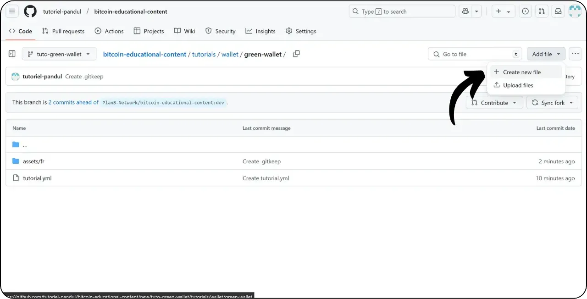
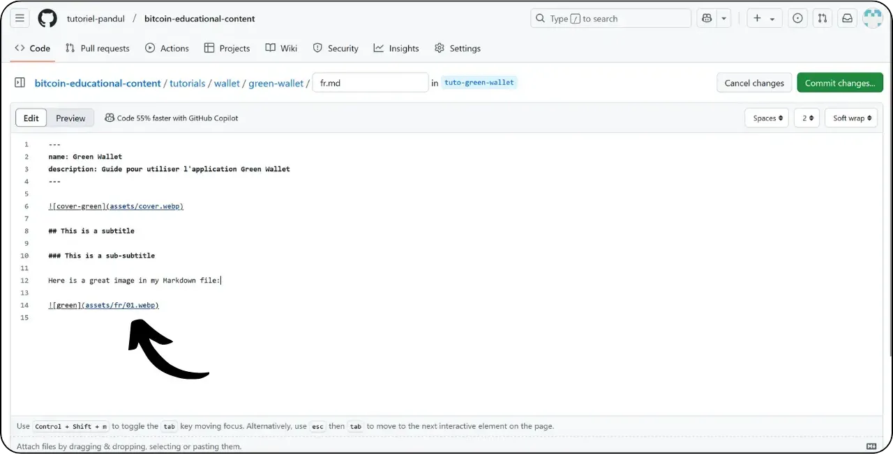

Sebelum mengikuti tutorial menambahkan tutorial baru ini, Anda harus menyelesaikan beberapa langkah awal. Jika Anda belum melakukannya, silakan lihat tutorial pengantar ini terlebih dahulu, lalu kembali ke sini:

https://planb.network/tutorials/contribution/content/write-tutorials-4d142a6a-9127-4ffb-9e0a-5aba29f169e2

Anda sudah memiliki :


- Pilih tema untuk tutorial Anda;
- Menghubungi tim Plan ₿ Network melalui [Grup Telegram](https://t.me/PlanBNetwork_ContentBuilder) atau paolo@planb.network ;
- Pilih alat kontribusi Anda.

Dalam tutorial ini, kita akan melihat cara menambahkan tutorial Anda ke Plan ₿ Network menggunakan versi web GitHub. Jika Anda sudah menguasai Git, tutorial yang sangat mendetail ini mungkin tidak diperlukan untuk Anda. Sebagai gantinya, saya sarankan Anda untuk melihat salah satu dari 2 tutorial lainnya, di mana saya merinci panduan yang harus diikuti dan langkah-langkah untuk membuat perubahan dari file :


- Pengguna yang berpengalaman** :

https://planb.network/tutorials/contribution/content/write-tutorials-git-expert-0ce1e490-c28f-4c51-b7e0-9a6ac9728410

- Menengah (GitHub Desktop)** :

https://planb.network/tutorials/contribution/content/write-tutorials-github-desktop-intermediate-4a36a052-1000-4191-890a-9a1dc65f8957

## Prasyarat

Prasyarat sebelum memulai tutorial :


- Memiliki [akun GitHub](https://github.com/signup);
- Memiliki fork dari [Plan ₿ Repositori sumber jaringan] (https://github.com/PlanB-Network/bitcoin-educational-content);
- Memiliki [profil guru di Plan ₿ Network] (https://planb.network/professors) (hanya jika Anda menawarkan tutorial lengkap).

Jika Anda memerlukan bantuan untuk mendapatkan prasyarat ini, tutorial saya yang lain akan membantu:


https://planb.network/tutorials/contribution/others/create-github-account-a75fc39d-f0d0-44dc-9cd5-cd94aee0c07c

https://planb.network/tutorials/contribution/others/github-desktop-work-environment-5862003b-9d76-47f5-a9e0-5ec74256a8ba

https://planb.network/tutorials/contribution/others/create-teacher-profile-8ba9ba49-8fac-437a-a435-c38eebc8f8a4

Setelah semuanya siap dan Anda memiliki repositori repositori Plan ₿ Network, Anda dapat mulai menambahkan tutorial.

## 1 - Membuat cabang baru

Buka browser Anda dan arahkan ke halaman fork Anda di repositori Plan ₿ Network. Ini adalah fork yang Anda buat di GitHub. URL fork Anda akan terlihat seperti ini: `https://github.com/[nama pengguna Anda]/konten-pendidikan-bitcoin`:


Pastikan Anda berada di cabang `dev` utama, lalu klik tombol "*Sinkronisasi fork*". Jika fork Anda belum diperbarui, GitHub akan meminta Anda untuk memperbarui cabang Anda. Lanjutkan dengan pembaruan ini:


Klik pada cabang `dev`, lalu beri nama cabang kerja Anda sehingga judulnya dengan jelas mencerminkan tujuannya, dengan menggunakan tanda hubung untuk memisahkan kata. Sebagai contoh, jika tujuan kita adalah untuk menulis tutorial tentang penggunaan Green Wallet, maka cabang tersebut dapat dinamakan: `tuto-green-wallet-loic`. Setelah memasukkan nama yang sesuai, klik "*Buat cabang*" untuk mengonfirmasi pembuatan cabang baru berdasarkan `dev` :


Sekarang Anda seharusnya sudah berada di cabang pekerjaan Anda yang baru:


Ini berarti bahwa setiap perubahan yang Anda buat hanya akan disimpan pada cabang tertentu.

Untuk setiap artikel baru yang Anda rencanakan untuk diterbitkan, buat cabang baru dari `dev`.

Sebuah cabang di Git mewakili versi paralel dari proyek, memungkinkan Anda untuk mengerjakan modifikasi tanpa memengaruhi cabang utama, sampai pekerjaan Anda siap untuk diintegrasikan.

## 2 - Menambahkan file tutorial

Sekarang setelah cabang yang berfungsi telah dibuat, saatnya untuk mengintegrasikan tutorial baru Anda.

Di dalam file cabang, Anda harus menemukan subfolder yang sesuai untuk penempatan tutorial Anda. Pengaturan folder mencerminkan bagian yang berbeda dari situs web Plan ₿ Network. Dalam contoh kita, karena kita akan menambahkan tutorial mengenai Green Wallet, maka buka jalur berikut ini: `bitcoin-educational-content\tutorials\wallet` yang sesuai dengan bagian `WALLET` di situs web:


Di dalam folder `wallet`, buat direktori baru yang secara khusus didedikasikan untuk tutorial Anda. Nama folder ini harus dengan jelas menunjukkan perangkat lunak yang dibahas dalam tutorial, dengan menggunakan tanda hubung untuk menghubungkan kata-kata. Dalam contoh saya, folder ini akan diberi nama `dompet-hijau`. Klik "*Tambah File*" kemudian "*Buat file baru*":


Masukkan nama folder diikuti dengan garis miring `/` untuk mengonfirmasi pembuatannya sebagai folder.


Dalam subfolder baru yang didedikasikan untuk tutorial Anda, Anda perlu menambahkan beberapa item:


- Buat folder `assets` untuk menyimpan semua ilustrasi yang diperlukan untuk tutorial Anda;
- Di dalam folder `assets` ini, buatlah sebuah subfolder yang diberi nama sesuai dengan kode bahasa asli tutorial. Sebagai contoh, jika tutorial ditulis dalam bahasa Inggris, subfolder ini harus diberi nama `en`. Letakkan semua visual tutorial (diagram, gambar, tangkapan layar, dll.) di dalam folder ini.
- File `tutorial.yml` harus dibuat untuk merekam rincian tutorial Anda;
- Sebuah file markdown harus dibuat untuk menulis konten tutorial Anda. File ini harus diberi nama sesuai dengan kode bahasa yang digunakan untuk menulisnya. Sebagai contoh, untuk tutorial yang ditulis dalam bahasa Prancis, file tersebut harus dinamakan `fr.md`.

Sebagai rangkuman, berikut ini adalah hierarki file (kita akan melanjutkan pembuatannya di bagian berikutnya):

```
bitcoin-educational-content/
└── tutorials/
└── wallet/ (à modifier avec la bonne catégorie)
└── green-wallet/ (à modifier avec le nom du tuto)
├── assets/
│   ├── fr/ (à modifier selon le code de langue approprié)
├── tutorial.yml
└── fr.md (à modifier selon le code de langue approprié)
```

## 3 - Isi file YAML

Mari kita mulai dengan file YAML. Pada kotak untuk membuat file baru, masukkan `tutorial.yml` :


Isi file `tutorial.yml` dengan menyalin templat berikut:

```
id:
project_id:
tags:
-
-
-
category:
level:
credits:
professor:
# Proofreading metadata
original_language:
proofreading:
- language:
last_contribution_date:
urgency:
contributors_id:
-
reward:
```

Berikut ini adalah bidang yang wajib diisi:


- id**: Sebuah UUID (Pengenal Unik Universal) untuk mengidentifikasi tutorial secara unik. Anda dapat membuatnya dengan [alat bantu online] (https://www.uuidgenerator.net/version4). Satu-satunya batasan adalah UUID ini harus acak, agar tidak bertentangan dengan UUID lain di platform;
- project_id** : UUID dari perusahaan atau organisasi di balik alat yang disajikan dalam tutorial [dari daftar proyek] (https://github.com/PlanB-Network/bitcoin-educational-content/tree/dev/resources/projects). Sebagai contoh, jika Anda sedang melakukan tutorial mengenai perangkat lunak Green Wallet, Anda dapat menemukan `project_id` ini di file berikut: `bitcoin-educational-content/resources/projects/blockstream/project.yml`. Informasi ini ditambahkan dalam file YAML tutorial Anda karena Plan ₿ Network menyimpan database semua perusahaan dan organisasi yang beroperasi dengan Bitcoin atau proyek-proyek terkait. Dengan menambahkan `project_id` dari entitas yang ditautkan ke tutorial Anda, Anda membuat tautan antara dua elemen;
- tag**: 2 atau 3 kata kunci yang relevan terkait dengan konten tutorial, yang dipilih secara eksklusif [dari daftar tag Paket ₿ Jaringan](https://github.com/PlanB-Network/bitcoin-educational-content/blob/dev/docs/50-planb-tags.md);
- kategori** : Subkategori yang sesuai dengan konten tutorial, sesuai dengan Paket ₿ Struktur jaringan (misalnya untuk dompet: `deskstop`, `perangkat keras`, `seluler`, `cadangan`);
- tingkat** : Tingkat kesulitan tutorial, dari :
    - pemula
    - 'menengah'
    - `advanced`
    - 'ahli'
- profesor**: `kontributor_id` Anda (BIP39 kata) seperti yang ditampilkan di [profil pengajar Anda] (https://github.com/PlanB-Network/bitcoin-educational-content/tree/dev/professors);
- bahasa_asli** : Bahasa asli tutorial (misalnya `fr`, `en`, dll.) ;
- pengoreksian**: Informasi tentang proses proofreading. Isi bagian pertama, karena mengoreksi tutorial Anda sendiri dianggap sebagai validasi pertama:
    - bahasa**: Mengoreksi kode bahasa (misalnya `fr`, `en`, dsb.).
    - tanggal_kontribusi_terakhir**: Tanggal hari ini.
    - urgensi** : Biarkan kosong.
    - kontributor_id** : ID GitHub Anda.
    - hadiah** : Biarkan kosong.

Untuk detail lebih lanjut mengenai ID guru Anda, silakan lihat tutorial yang sesuai:

https://planb.network/tutorials/contribution/others/create-teacher-profile-8ba9ba49-8fac-437a-a435-c38eebc8f8a4

Berikut ini adalah contoh file `tutorial.yml` yang telah selesai dibuat untuk tutorial mengenai dompet Blockstream Green:

```
id: e84edaa9-fb65-48c1-a357-8a5f27996143
project_id: 3b2f45e6-d612-412c-95ba-cf65b49aa5b8
tags:
- wallets
- software
- keys
category: mobile
level: beginner
credits:
professor: pretty-private
# Proofreading metadata
original_language: fr
proofreading:
- language: fr
last_contribution_date: 2024-11-20
urgency:
contributors_id:
- LoicPandul
reward:
```

Setelah Anda selesai memodifikasi file `tutorial.yml` Anda, simpan dokumen Anda dengan mengklik tombol "*Commit changes...*":


Tambahkan judul dan deskripsi, dan pastikan komit dilakukan ke cabang yang Anda buat di awal tutorial ini. Kemudian konfirmasikan dengan mengklik "*Komit perubahan*".


## 4 - Membuat subfolder untuk gambar

Klik "*Tambah File*" sekali lagi, lalu "*Buat file baru*":


Masukkan `assets` diikuti dengan garis miring `/` untuk membuat folder:


Ulangi langkah ini di folder `/assets` untuk membuat subfolder bahasa, misalnya `fr` jika tutorial Anda dalam bahasa Prancis:


Di dalam folder ini, buatlah berkas tiruan untuk memaksa GitHub menyimpan folder Anda (yang seharusnya kosong). Beri nama file ini `.gitkeep`. Kemudian klik "*Komit perubahan...*".


Periksa kembali apakah Anda berada di cabang yang benar, lalu klik "*Komit perubahan*".


## 5 - Membuat file Penurunan Harga

Sekarang kita akan membuat file yang akan menjadi tempat tutorial Anda, diberi nama sesuai dengan kode bahasa Anda, misalnya `fr.md` jika kita menulis dalam bahasa Prancis. Buka folder tutorial Anda :


Klik "Tambah file*", lalu "Buat file baru*".



Beri nama file menggunakan kode bahasa Anda. Dalam kasus saya, karena tutorial ini ditulis dalam bahasa Prancis, saya menamai file saya `fr.md`. Ekstensi `.md` menunjukkan bahwa file tersebut dalam format Markdown.


Kita mulai dengan mengisi bagian `Properties` di bagian atas dokumen. Tambahkan dan isi blok kode berikut secara manual (kunci `nama:` dan `deskripsi:` harus disimpan dalam bahasa Inggris, tetapi nilainya harus ditulis dalam bahasa yang digunakan untuk tutorial Anda):

```
---
name: [Titre]
description: [Description]
---
```


Isi nama tutorial Anda dan deskripsi singkat:


Kemudian, tambahkan jalur ke gambar sampul di awal tutorial Anda. Untuk melakukan ini, perhatikan :

```

```

Sintaks ini akan sangat berguna ketika Anda perlu menambahkan gambar ke dalam tutorial Anda. Tanda seru menunjukkan gambar, yang teks alternatifnya (alt) ditentukan di antara tanda kurung siku. Jalur ke gambar ditunjukkan di antara tanda kurung:


Klik tombol "*Komit perubahan...*" untuk menyimpan file ini.


Periksa apakah Anda berada di cabang yang benar, lalu konfirmasikan komit.


Folder tutorial Anda sekarang akan terlihat seperti ini, sesuai dengan kode bahasa Anda:


## 6 - Menambahkan logo dan sampul

Di dalam folder `assets`, Anda perlu menambahkan file bernama `logo.webp`, yang akan berfungsi sebagai gambar mini untuk artikel Anda. Gambar ini harus dalam format `.webp`, dan harus berukuran persegi agar sesuai dengan antarmuka pengguna.

Anda bebas memilih logo perangkat lunak yang digunakan dalam tutorial, atau gambar lain yang relevan, selama gambar tersebut bebas royalti. Selain itu, tambahkan gambar berjudul `cover.webp` di tempat yang sama. Gambar ini akan ditampilkan di bagian atas tutorial Anda. Pastikan bahwa gambar ini, seperti halnya logo, menghormati hak-hak penggunaan dan sesuai dengan konteks tutorial Anda.

Untuk menambahkan gambar ke folder `/assets`, Anda dapat menyeret dan meletakkannya dari file lokal Anda. Pastikan Anda berada di folder `/assets` dan di cabang yang tepat, lalu klik "*Commit changes*".


Sekarang, Anda akan melihat gambar muncul dalam folder.


## 7 - Menulis tutorial

Lanjutkan menulis tutorial Anda dengan mencatat konten Anda di file Markdown dengan kode bahasa (dalam contoh saya, dalam bahasa Prancis, ini adalah file `fr.md`). Buka file tersebut dan klik ikon pensil :


Mulailah menulis tutorial Anda. Saat menambahkan subjudul, gunakan format penurunan yang sesuai dengan mengawali teks dengan `##` :


Bergantian antara tampilan "*Edit*" dan "*Preview*" untuk memvisualisasikan rendering dengan lebih baik.


Untuk menyimpan pekerjaan Anda, klik "*Komit Perubahan...*", pastikan Anda berada di cabang yang benar, lalu konfirmasikan dengan mengklik "*Komit Perubahan*" sekali lagi.


## 8 - Menambahkan visual

Subfolder bahasa dalam folder `/assets` (dalam contoh saya: `/assets/en`) digunakan untuk menyimpan diagram dan visual yang akan menyertai tutorial Anda. Sedapat mungkin, hindari menyertakan teks dalam gambar agar konten Anda dapat diakses oleh audiens internasional. Tentu saja, perangkat lunak yang disajikan akan berisi teks, tetapi jika Anda menambahkan skema atau indikasi tambahan pada tangkapan layar perangkat lunak, lakukan tanpa teks atau, jika perlu, gunakan bahasa Inggris.

Untuk menamai gambar Anda, cukup gunakan angka yang sesuai dengan urutan kemunculannya dalam tutorial, yang diformat sebagai dua digit (atau tiga digit jika tutorial Anda berisi lebih dari 99 gambar). Contohnya, beri nama gambar pertama Anda `01.webp`, gambar kedua `02.webp`, dan seterusnya.

Gambar Anda harus dalam format `.webp` saja. Jika perlu, Anda dapat menggunakan [perangkat lunak konversi gambar saya] (https://github.com/LoicPandul/ImagesConverter).


Setelah Anda menambahkan gambar Anda ke subfolder, Anda dapat menghapus file dummy `.gitkeep`. Buka file ini, klik pada tiga titik kecil di sudut kanan atas, lalu pada "*Hapus file*".


Simpan perubahan Anda dengan mengeklik "*Simpan perubahan...*".


Untuk menyisipkan diagram dari subfolder ke dalam dokumen editorial Anda, gunakan perintah Markdown berikut ini, dengan hati-hati menentukan teks alternatif yang sesuai dan jalur gambar yang benar untuk bahasa Anda:

```

```

Tanda seru di awal menunjukkan gambar. Teks alternatif, yang membantu aksesibilitas dan referensi, ditempatkan di antara tanda kurung siku. Terakhir, jalur ke gambar ditunjukkan di antara tanda kurung.



Jika Anda ingin membuat skema Anda sendiri, pastikan untuk mengikuti panduan grafis Plan ₿ Network (Rencana ₿ Jaringan) untuk memastikan konsistensi visual:


- Huruf **: Gunakan [Rubik] (https://fonts.google.com/specimen/Rubik);
- Warna**:
 - Oranye: #FF5C00
 - Hitam: #000000
 - Putih: #FFFFFF

**Sangat penting bahwa semua visual yang diintegrasikan ke dalam tutorial Anda bebas dari hak cipta atau menghormati lisensi file sumber**. Oleh karena itu, semua diagram yang dipublikasikan di Plan ₿ Network tersedia di bawah lisensi CC-BY-SA, dengan cara yang sama seperti teks.

**-> Tips:** Ketika berbagi file di tempat umum, seperti gambar, penting untuk menghapus metadata yang tidak perlu. Metadata ini dapat berisi informasi sensitif, seperti data lokasi, tanggal pembuatan, dan detail pembuat. Untuk melindungi privasi Anda, sebaiknya hapus metadata ini. Untuk menyederhanakan operasi ini, Anda dapat menggunakan alat khusus seperti [Exif Cleaner] (https://exifcleaner.com/), yang memungkinkan Anda untuk membersihkan metadata dokumen dengan hanya menarik dan melepas.

## 9 - Mengusulkan tutorial

Setelah Anda selesai menulis tutorial Anda dalam bahasa pilihan Anda, langkah selanjutnya adalah mengirimkan **Pull Request**. Administrator kemudian akan menambahkan terjemahan yang kurang ke dalam tutorial Anda, menggunakan metode penerjemahan otomatis kami dengan pengoreksian oleh manusia.

Untuk melanjutkan dengan Pull Request, setelah menyimpan semua perubahan Anda, klik tombol "*Kontribusi*", lalu "*Buka pull request*":


Pull Request adalah permintaan yang dibuat untuk mengintegrasikan perubahan dari cabang Anda ke dalam cabang utama repositori Plan ₿ Network, yang memungkinkan peninjauan dan diskusi perubahan sebelum digabungkan.

Sebelum melanjutkan, periksa dengan saksama di bagian bawah antarmuka bahwa perubahan ini sesuai dengan yang Anda harapkan:


Pastikan, di bagian atas antarmuka, bahwa cabang kerja Anda digabungkan ke cabang `dev` pada repositori Plan ₿ Network (yang merupakan cabang utama).

Masukkan sebuah judul yang secara singkat meringkas perubahan yang ingin Anda gabungkan dengan repositori sumber. Tambahkan komentar singkat yang menjelaskan perubahan-perubahan ini (jika Anda memiliki nomor isu yang terkait dengan pembuatan tutorial Anda, ingatlah untuk mencatat `Tutup #{nomor isu}` sebagai sebuah komentar), lalu klik tombol hijau "*Buat permintaan penarikan*" untuk mengonfirmasi permintaan penggabungan:


PR Anda kemudian akan terlihat di tab "*Tarik Permintaan*" pada tab "*Repositori Jaringan" pada paket utama. Yang harus Anda lakukan sekarang adalah menunggu hingga administrator menghubungi Anda untuk mengonfirmasi bahwa kontribusi Anda telah digabungkan, atau untuk meminta modifikasi lebih lanjut.


Setelah menggabungkan PR Anda dengan cabang utama, sebaiknya hapus cabang yang sedang bekerja (dalam contoh saya: `tuto-green-wallet`) untuk menjaga riwayat fork Anda tetap bersih. GitHub akan secara otomatis menawarkan opsi ini pada halaman PR Anda:


Jika Anda ingin membuat perubahan pada kontribusi Anda setelah Anda mengirimkan PR Anda, langkah-langkah yang harus diikuti tergantung pada status PR Anda saat ini:


- Jika PR Anda masih terbuka dan belum digabungkan, lakukan perubahan di cabang kerja yang sama. Perubahan yang dikomit akan ditambahkan ke PR yang masih terbuka;
- Jika PR Anda telah digabungkan dengan cabang utama, Anda harus mengulang proses dari awal dengan membuat cabang baru, lalu mengirimkan PR baru. Pastikan fork Anda disinkronkan dengan repositori sumber Plan ₿ Network pada cabang `dev` sebelum melanjutkan.

Jika Anda mengalami kesulitan teknis dalam mengirimkan tutorial Anda, jangan ragu untuk meminta bantuan di [grup Telegram khusus untuk kontribusi](https://t.me/PlanBNetwork_ContentBuilder). Terima kasih banyak!
