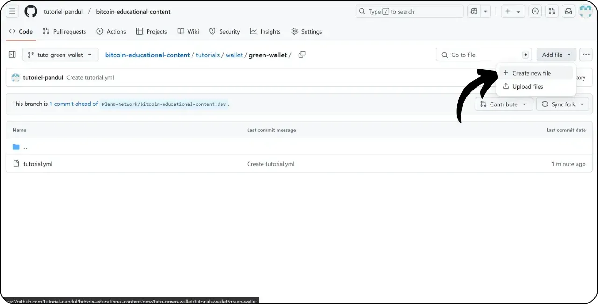

新しいチュートリアルを追加するためのこのチュートリアルに従う前に、いくつかの予備ステップを完了する必要があります。まだ完了していない場合は、まずこの入門チュートリアルをご覧ください：

https://planb.network/tutorials/contribution/content/write-tutorials-4d142a6a-9127-4ffb-9e0a-5aba29f169e2

あなたはすでに持っている：


- チュートリアルのテーマを決めてください；
- Plan ₿ Networkチームに[Telegram group](https://t.me/PlanBNetwork_ContentBuilder)またはpaolo@planb.network；
- 貢献ツールを選ぶ

このチュートリアルでは、Web 版 GitHub を使って Plan ↪Sc_20BF Network にチュートリアルを追加する方法を説明します。すでに Git を使いこなしている方には、この詳細なチュートリアルは必要ないかもしれません。その代わりに、他の2つのチュートリアルのうちの一つをご覧になることをお勧めします。そこでは、従うべきガイドラインや、ローカルの.NET Frameworkから変更を加える手順について詳しく説明しています：


- 経験者** ：

https://planb.network/tutorials/contribution/content/write-tutorials-git-expert-0ce1e490-c28f-4c51-b7e0-9a6ac9728410

- 中級（GitHub Desktop）** ：

https://planb.network/tutorials/contribution/content/write-tutorials-github-desktop-intermediate-4a36a052-1000-4191-890a-9a1dc65f8957

## 前提条件

チュートリアルを始める前の前提条件 ：


- GitHubアカウント](https://github.com/signup)を持っている；
- Plan ₿ Networkソースリポジトリ](https://github.com/PlanB-Network/bitcoin-educational-content)をフォークしてください；
- Plan ₿ Networkの講師プロフィール](https://planb.network/professors)(完全なチュートリアルを提供する場合のみ)を持っている。

これらの前提条件を得るのに手助けが必要な場合は、私の他のチュートリアルが役に立つだろう：


https://planb.network/tutorials/contribution/others/create-github-account-a75fc39d-f0d0-44dc-9cd5-cd94aee0c07c

https://planb.network/tutorials/contribution/others/github-desktop-work-environment-5862003b-9d76-47f5-a9e0-5ec74256a8ba

https://planb.network/tutorials/contribution/others/create-teacher-profile-8ba9ba49-8fac-437a-a435-c38eebc8f8a4

すべての準備が整い、Plan ₿ Networkリポジトリのフォークができたら、チュートリアルの追加を開始できます。

## 1 - 新しいブランチを作る

ブラウザを開き、Plan ₿ Network リポジトリのフォークページに移動します。これが GitHub で確立したフォークです。フォークのURLは以下のようになります：https://github.com/[あなたのユーザー名]/bitcoin-educational-content` ：


メインの `dev` ブランチにいることを確認してから、"*Sync fork*" ボタンをクリックします。フォークが最新でない場合は、GitHub がブランチを更新するよう求めてきます。更新を進めてください：


dev` ブランチをクリックし、作業用ブランチのタイトルをその目的を反映したものにします。たとえば、Green Wallet の使い方のチュートリアルを書くのが目的なら、ブランチの名前はこうなります：tuto-green-wallet-loic`とします。適切な名前を入力したら、"*Create branch*"をクリックして `dev` をベースにした新しいブランチの作成を確認します：


これで、あなたは新しい職場で働くことになるはずだ：


つまり、あなたが加えた変更は、その特定のブランチだけに保存されます。

新しい記事を公開するたびに、`dev`から新しいブランチを作成します。

Git のブランチはプロジェクトの並行バージョンを表し、メインブランチに影響を与えることなく、作業が統合できるようになるまで修正作業を行うことができます。

## 2 - チュートリアルファイルの追加

作業ブランチが作成できたので、いよいよ新しいチュートリアルを統合します。

ブランチファイルの中で、チュートリアルの配置に適切なサブフォルダーを見つける必要があります。フォルダの構成は、Plan ₿ Network ウェブサイトの各セクションを反映しています。この例では、Green Walletに関するチュートリアルを追加するので、次のパスに移動します：これはウェブサイトの `WALLET` セクションに対応します：


wallet`フォルダの中に、チュートリアル専用の新しいディレクトリを作成します。このフォルダの名前には、チュートリアルで扱うソフトウェアをハイフンを使って単語と単語をつなげて明示します。私の例では、フォルダ名は `green-wallet` とします。Add File*"をクリックし、次に "*Create new file*"をクリックしてください：


フォルダ名の後にスラッシュ `/` を入力すると、フォルダとして作成されます。


チュートリアル専用の新しいサブフォルダに、いくつかのアイテムを追加する必要があります：


- assets`フォルダを作成し、チュートリアルに必要なすべてのイラストを保存します；
- この `assets` フォルダの中に、チュートリアルの元の言語コードに応じた名前のサブフォルダを作成します。例えば、チュートリアルが英語で書かれている場合、このサブフォルダは `en` という名前にします。チュートリアルのすべてのビジュアル（図、画像、スクリーンショットなど）をこのフォルダに入れます。
- チュートリアルの詳細を記録するために `tutorial.yml` ファイルを作成する必要があります；
- チュートリアルの実際の内容を記述するために、マークダウンファイルを作成する必要があります。このファイルの名前は、書かれている言語のコードに従わなければなりません。例えば、フランス語で書かれたチュートリアルの場合、ファイルの名前は `fr.md` とします。

要約すると、ファイルの階層は以下のようになる（次のセクションで作成を続ける）：

```
bitcoin-educational-content/
└── tutorials/
└── wallet/ (à modifier avec la bonne catégorie)
└── green-wallet/ (à modifier avec le nom du tuto)
├── assets/
│   ├── fr/ (à modifier selon le code de langue approprié)
├── tutorial.yml
└── fr.md (à modifier selon le code de langue approprié)
```

## 3 - YAMLファイルを埋める

YAMLファイルから始めましょう。新規ファイルを作成するボックスに `tutorial.yml` と入力します：


以下のテンプレートをコピーして `tutorial.yml` ファイルを埋める：

```
id: 

project_id: 

tags:
  - 
  - 
  - 

category: 

level: 

professor_id:

# Proofreading metadata

original_language:
proofreading:
  - language: 
    last_contribution_date:
    urgency:
    contributor_names:
      - 
    reward:
```

必須フィールドは次のとおりです：

- **id** : チュートリアルを一意に識別する UUID (_Universally Unique Identifier_)。 [オンラインツール](https://www.uuidgenerator.net/version4)を使用して生成できます。 この UUID はランダムである必要があり、プラットフォーム上の他の UUID と競合しないことが条件です;

- **project_id** : チュートリアルで紹介されているツールの背後にある企業または組織の UUID [プロジェクトのリストから](https://github.com/PlanB-Network/bitcoin-educational-content/tree/dev/resources/projects)。 たとえば、Green Wallet ソフトウェアに関するチュートリアルを作成している場合、この `project_id` は次のファイルにあります: `bitcoin-educational-content/resources/projects/blockstream/project.yml`。 Plan ₿ Network は、Bitcoin または関連プロジェクトに取り組んでいるすべての企業および組織のデータベースを維持しているため、この情報はチュートリアルの YAML ファイルに追加されます。 チュートリアルに関連するエンティティの `project_id` を追加することで、2 つの要素間のリンクを作成できます;

- **tags** : チュートリアルの内容に関連する 2 または 3 の適切なキーワード、[Plan ₿ Network のタグリスト](https://github.com/PlanB-Network/bitcoin-educational-content/blob/dev/docs/50-planb-tags.md) からのみ選択可能;

- **category** : Plan ₿ Network サイトの構造に従った、チュートリアルの内容に対応するサブカテゴリ（例：ウォレットの場合：`desktop`、`hardware`、`mobile`、`backup`）;

- **level** : チュートリアルの難易度レベル、以下から選択：
    - `beginner`
    - `intermediate`
    - `advanced`
    - `expert`

- **professor_id** : [あなたの教授プロフィール](https://github.com/PlanB-Network/bitcoin-educational-content/tree/dev/professors) に表示される `professor_id` (UUID);

- **original_language** : チュートリアルの元の言語（例：`fr`、`en` など）;

- **proofreading** : 校正プロセスに関する情報。 自分自身のチュートリアルを校正することは、最初の検証としてカウントされるため、最初の部分を記入してください：
    - **language** : 校正言語のコード（例：`fr`、`en` など）。
    - **last_contribution_date** : 本日の日付。
    - **urgency** : 1
    - **contributor_names** : あなたの GitHub ID。
    - **reward** : 0

教師IDの詳細については、対応するチュートリアルを参照してください：

https://planb.network/tutorials/contribution/others/create-teacher-profile-8ba9ba49-8fac-437a-a435-c38eebc8f8a4

```
id: e84edaa9-fb65-48c1-a357-8a5f27996143

project_id: 3b2f45e6-d612-412c-95ba-cf65b49aa5b8

tags:
  - wallets
  - software
  - keys

category: mobile

level: beginner

professor_id: 6516474c-c190-41f2-b2ab-3d452ce7bdf0

# Proofreading metadata

original_language: fr
proofreading:
  - language: fr
    last_contribution_date: 2024-11-20
    urgency: 1
    contributor_names:
      - LoicPandul
    reward: 0
```

tutorial.yml`ファイルの修正が終わったら、"*変更をコミットする...*"ボタンをクリックしてドキュメントを保存する：


タイトルと説明を追加し、このチュートリアルの最初に作成したブランチにコミットすることを確認します。そして "*変更をコミット*" をクリックして確認します。


## 4 - 画像用サブフォルダーの作成

もう一度 "*Add File*"をクリックし、次に "*Create new file*"をクリックする：



assets`の後にスラッシュ `/` を入力するとフォルダが作成されます：


このステップを `/assets` フォルダで繰り返し、言語のサブフォルダを作成します。例えば、チュートリアルがフランス語の場合は `fr` とします：


このフォルダに、GitHub にあなたのフォルダを保持させるためのダミーファイルを作成します。このファイルの名前を `.gitkeep` とします。そして "*変更をコミット...*" をクリックします。


正しいブランチにいることをもう一度確認し、「*変更をコミット*」をクリックします。


## 5 - マークダウンファイルの作成

チュートリアルのホストとなるファイルを作成します。ファイル名は言語コードに従います。チュートリアルのフォルダに移動します：


Add file*」をクリックし、次に「Create new file*」をクリックする。


言語コードを使ってファイル名を付ける。私の場合、チュートリアルはフランス語で書かれているので、ファイル名を `fr.md` とします。拡張子 `.md` は、ファイルがMarkdownフォーマットであることを示します。


まずドキュメントの一番上にある `Properties` セクションを埋めることから始めます。name:`と`description:`のキーは英語でなければなりませんが、その値はチュートリアルで使用する言語で記述しなければなりません：

```
---
name: [Titre]
description: [Description]
---
```


チュートリアルの名前と簡単な説明を記入してください：


次に、チュートリアルの最初にカバー画像へのパスを追加します。これを行うには、：

```

```

この構文は、チュートリアルに画像を追加する必要があるときに便利です。感嘆符は画像を示し、その代替テキスト（alt）は角括弧の間に指定されます。画像へのパスは大括弧の間に示されます：


変更をコミット...*"ボタンをクリックして、このファイルを保存する。


正しいブランチにいることを確認し、コミットを確定する。


チュートリアルのフォルダは、あなたの言語コードに従って、このようになるはずです：


## 6 - ロゴとカバーを追加

assets`フォルダの中に、記事のサムネイルとなる `logo.webp` というファイルを追加する必要があります。この画像は `.webp` フォーマットで、ユーザーインターフェースに合わせて正方形のサイズでなければなりません。

チュートリアルで使用するソフトウェアのロゴ、またはロイヤリティフリーの画像であれば他の関連画像も自由に選択できます。さらに、同じ場所に `cover.webp` というタイトルの画像を追加してください。これはチュートリアルの一番上に表示されます。この画像もロゴと同様に使用権を尊重し、チュートリアルの文脈にふさわしいものにしてください。

画像を `/assets` フォルダに追加するには、ローカルファイルからドラッグ＆ドロップします。assets`フォルダと右のブランチにいることを確認してから、"*変更をコミット*"をクリックしてください。


これでフォルダに画像が表示されるはずです。


## 7 - チュートリアルを書く

チュートリアルを書き続けるには、Markdownファイルに言語コード（私の例ではフランス語で、`fr.md`ファイルです）を記入してください。ファイルに移動し、鉛筆のアイコンをクリックしてください：


チュートリアルを書き始めてください。サブタイトルを追加するときは、テキストの前に `##` を付けて、適切なMarkdownフォーマットを使用してください：


Edit*"と "*Preview*"ビューを交互に表示することで、レンダリングをより見やすくすることができます。


作業を保存するには、「*変更をコミット...*」をクリックし、正しいブランチにいることを確認してから、もう一度「*変更をコミット*」をクリックして確認します。


## 8 - ビジュアルを追加する

assets`フォルダの言語サブフォルダ（私の例では `/assets/en`）は、あなたのチュートリアルに付随する図やビジュアルを保存するために使用します。できるだけ、画像にテキストを含めないようにしてください。もちろん、紹介するソフトウェアにはテキストが含まれますが、ソフトウェアのスクリーンショットに回路図や追加的な表示を加える場合は、テキストなしにするか、必要であれば英語を使用してください。

画像に名前を付けるには、チュートリアルに登場する順番に対応する数字を2桁（チュートリアルに99枚以上の画像が含まれる場合は3桁）で入力してください。例えば、最初の画像には `01.webp`、2番目の画像には `02.webp` というように名前をつけます。

画像は `.webp` 形式に限ります。必要であれば、[私の画像変換ソフト](https://github.com/LoicPandul/ImagesConverter) を使用してください。


サブフォルダーに画像を追加したら、ダミーファイル `.gitkeep` を削除します。このファイルを開き、右上にある3つの小さな点をクリックして、"*Delete file*"をクリックしてください。


変更をコミットする...*"をクリックして変更を保存します。


サブフォルダーからエディトリアル文書に図を挿入するには、以下のMarkdownコマンドを使用し、適切な代替テキストと言語に合った画像パスを指定するように注意してください：

```

```

冒頭の感嘆符は画像を示す。アクセシビリティと参照に役立つ代替テキストは、角括弧の間に置かれます。最後に、画像へのパスを括弧で囲んで示します。


独自の回路図を作成する場合は、視覚的な一貫性を確保するため、必ず Plan ₿ Network グラフィックのガイドラインに従ってください：


- フォント**：ルービック](https://fonts.google.com/specimen/Rubik)を使う；
- カラー** ：
 - オレンジ#FF5C00
 - 黒 : #000000
 - ホワイト白：#FFFFFFF

**チュートリアルに組み込まれるすべてのビジュアルは、著作権フリーであるか、ソースファイルのライセンス**を尊重することが不可欠です。そのため、Plan ₿ Networkで公開されるすべての図は、テキストと同様にCC-BY-SAライセンスの下で利用可能です。

**-> ヒント：*** 画像などのファイルを公共の場で共有する場合、余計なメタデータを削除することが重要です。メタデータには、位置情報、作成日、作者の詳細などの機密情報が含まれていることがあります。プライバシーを守るためにも、このメタデータを削除するのは良いアイデアです。この作業を簡単にするために、[Exif Cleaner](https://exifcleaner.com/)のような専用ツールを使用することができます。このツールを使用すると、簡単なドラッグ＆ドロップでドキュメントのメタデータをクリーンアップすることができます。

## 9 - チュートリアルの提案

お好みの言語でチュートリアルを書き終えたら、次のステップは **Pull Request** を提出することです。その後、管理者がチュートリアルに不足している翻訳を追加します。

プルリクエストを進めるには、すべての変更を保存した後、「*Contribute*」ボタンをクリックし、次に「*Open pull request*」をクリックします：


プルリクエストとは、あなたのブランチからの変更を Plan ȏ Network リポジトリのメインブランチに統合するためのリクエストです。

続行する前に、インターフェイスの下部で、これらの変更が期待したものであることを注意深くチェックしてください：


インターフェイスの先頭で、作業ブランチが Plan ₿ Network リポジトリの `dev` ブランチ（メインブランチ）にマージされていることを確認します。

ソースリポジトリにマージしたい変更点を簡潔にまとめたタイトルを入力してください。これらの変更を説明する簡単なコメントを追加し (チュートリアルの作成に関連する課題番号がある場合は、コメントとして `Closes #{課題番号}` と記述することを忘れないでください)、緑色の "*Create pull request*" ボタンをクリックしてマージリクエストを確定します：


あなたのPRは、メインの Plan ₿ Network リポジトリの「*Pull Request*」タブに表示されます。あとは、管理者があなたの投稿がマージされたことを確認したり、さらなる修正を依頼したりする連絡を待つだけです。


PR をメインブランチにマージした後は、作業ブランチ (私の例では `tuto-green-wallet`) を削除して、フォークの履歴をきれいに保つことをお勧めします。GitHub では、PR ページにこのオプションを自動的に表示します：


すでにPRを提出した後で、自分の貢献を変更したい場合は、PRの現在のステータスによって、従うべき手順が異なります：


- あなたのPRがまだオープンで、まだマージされていない場合は、同じワークブランチで変更を行ってください。コミットされた変更は、まだオープンなPRに追加されます；
- あなたの PR がすでにメインブランチにマージされている場合は、新しいブランチを作成し、新しい PR を提出することで、プロセスを最初からやり直す必要があります。先に進む前に、あなたのフォークが `dev` ブランチの Plan ₿ Network ソースリポジトリと同期していることを確認してください。

チュートリアルの投稿に技術的な問題がある場合は、遠慮なく[投稿専用のTelegramグループ](https://t.me/PlanBNetwork_ContentBuilder)に助けを求めてください。ありがとうございました！
