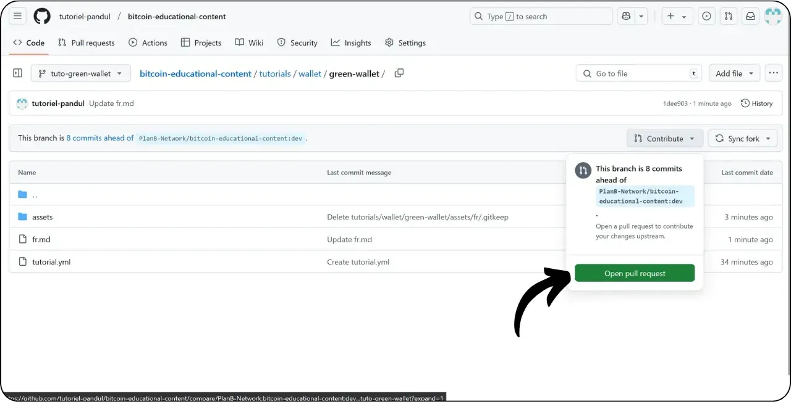
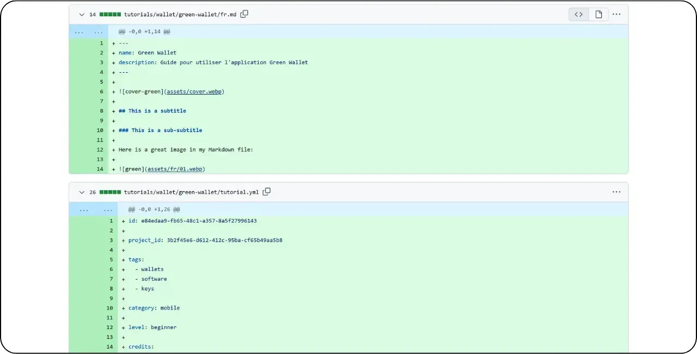

Før du følger denne veiledningen om hvordan du legger til en ny opplæring, må du ha fullført noen innledende trinn. Hvis du ikke allerede har gjort det, kan du ta en titt på denne introduksjonsveiledningen først, og deretter komme tilbake hit :

https://planb.network/tutorials/contribution/content/write-tutorials-4d142a6a-9127-4ffb-9e0a-5aba29f169e2

Du har allerede :


- Velg et tema for opplæringen din;
- Kontaktet Plan ₿ Network-teamet via [Telegramgruppe] (https://t.me/PlanBNetwork_ContentBuilder) eller paolo@planb.network ;
- Velg dine bidragsverktøy.

I denne veiledningen skal vi se på hvordan du legger til opplæringen din i Plan ₿ Network ved hjelp av nettversjonen av GitHub. Hvis du allerede behersker Git, er det ikke sikkert at denne svært detaljerte opplæringen er nødvendig for deg. I stedet anbefaler jeg at du tar en titt på en av disse to andre veiledningene, der jeg beskriver retningslinjene som skal følges og trinnene for å gjøre endringer fra en lokal :


- Erfarne brukere** :

https://planb.network/tutorials/contribution/content/write-tutorials-git-expert-0ce1e490-c28f-4c51-b7e0-9a6ac9728410

- Mellomnivå (GitHub Desktop)** :

https://planb.network/tutorials/contribution/content/write-tutorials-github-desktop-intermediate-4a36a052-1000-4191-890a-9a1dc65f8957

## Forutsetninger

Forutsetninger før du starter opplæringen :


- Har en [GitHub-konto] (https://github.com/signup);
- Ha en gaffel av [Plan ₿ Network source repository] (https://github.com/PlanB-Network/bitcoin-educational-content);
- Ha [en lærerprofil på Plan ₿ Network] (https://planb.network/professors) (bare hvis du tilbyr en fullstendig veiledning).

Hvis du trenger hjelp med å skaffe deg disse forutsetningene, kan du finne hjelp i de andre veiledningene mine:


https://planb.network/tutorials/contribution/others/create-github-account-a75fc39d-f0d0-44dc-9cd5-cd94aee0c07c

https://planb.network/tutorials/contribution/others/github-desktop-work-environment-5862003b-9d76-47f5-a9e0-5ec74256a8ba

https://planb.network/tutorials/contribution/others/create-teacher-profile-8ba9ba49-8fac-437a-a435-c38eebc8f8a4

Når alt er på plass og du har en gaffel av Plan ₿ Network-depotet, kan du begynne å legge til opplæringen.

## 1 - Opprett en ny filial

Åpne nettleseren din og naviger til gaffelsiden din i Plan ₿ Network repository. Dette er gaffelen du har opprettet på GitHub. URL-adressen til gaffelen din skal se slik ut: `https://github.com/[ditt-brukernavn]/bitcoin-educational-content` :


Sørg for at du er på hovedgrenen `dev`, og klikk deretter på "*Sync fork*"-knappen. Hvis gaffelen din ikke er oppdatert, vil GitHub be deg om å oppdatere grenen din. Fortsett med denne oppdateringen:


Klikk på `dev`-grenen, og gi arbeidsgrenen din et navn som tydelig gjenspeiler formålet, og bruk bindestreker for å skille ordene fra hverandre. Hvis vi for eksempel har som mål å skrive en veiledning om hvordan du bruker Green Wallet, kan grenen hete `tuto-green-wallet-loic`. Når du har skrevet inn et passende navn, klikker du på "*Opprett gren*" for å bekrefte opprettelsen av den nye grenen basert på `dev` :


Du skal nå være på din nye arbeidsgren:


Dette betyr at alle endringer du gjør, bare lagres på den spesifikke grenen.

For hver nye artikkel du planlegger å publisere, oppretter du en ny gren fra `dev`.

En gren i Git representerer en parallell versjon av prosjektet, slik at du kan jobbe med endringer uten at det påvirker hovedgrenen, helt til arbeidet ditt er klart til å integreres.

## 2 - Legg til opplæringsfiler

Nå som arbeidsgrenen er opprettet, er det på tide å integrere den nye opplæringen.

I grenfilene dine må du finne den riktige undermappen for plassering av opplæringen. Organiseringen av mappene gjenspeiler de ulike delene av Plan ₿ Network-nettstedet. I vårt eksempel, siden vi legger til en veiledning om Green Wallet, går du til følgende sti: `bitcoin-educational-content\tututorials\wallet`, som tilsvarer `WALLET`-delen av nettstedet:


I mappen `wallet` oppretter du en ny mappe som er spesielt dedikert til opplæringen. Navnet på denne mappen skal tydelig angi programvaren som dekkes i opplæringen, ved å bruke bindestreker for å koble sammen ord. I mitt eksempel vil mappen hete `green-wallet`. Klikk på "*Legg til fil*" og deretter på "*Opprett ny fil*":


Skriv inn mappenavnet etterfulgt av en skråstrek `/` for å bekrefte at den er opprettet som en mappe.


I denne nye undermappen som er dedikert til opplæringen din, må du legge til flere elementer:


- Opprett en mappe med alle illustrasjonene du trenger til opplæringen;
- I denne `assets`-mappen oppretter du en undermappe som er navngitt i henhold til opplæringens opprinnelige språkkode. Hvis opplæringen for eksempel er skrevet på engelsk, skal denne undermappen hete `en`. Plasser alle opplæringens visuelle elementer (diagrammer, bilder, skjermbilder osv.) i denne mappen.
- En `tutorial.yml`-fil må opprettes for å registrere detaljene i opplæringen;
- Det må opprettes en markdown-fil for å skrive det faktiske innholdet i opplæringen. Denne filen må navngis i henhold til koden for språket den er skrevet på. For eksempel, for en veiledning skrevet på fransk, bør filen hete `fr.md`.

For å oppsummere, her er filhierarkiet (vi fortsetter å opprette dem i neste avsnitt):

```
bitcoin-educational-content/
└── tutorials/
└── wallet/ (à modifier avec la bonne catégorie)
└── green-wallet/ (à modifier avec le nom du tuto)
├── assets/
│   ├── fr/ (à modifier selon le code de langue approprié)
├── tutorial.yml
└── fr.md (à modifier selon le code de langue approprié)
```

## 3 - Fyll inn YAML-filen

La oss begynne med YAML-filen. I boksen for å opprette en ny fil skriver du inn `tutorial.yml` :


Fyll ut filen `tutorial.yml` ved å kopiere følgende mal:

```
id: 

project_id: 

tags:
  - 
  - 
  - 

category: 

level: 

professor_id:

# Proofreading metadata

original_language:
proofreading:
  - language: 
    last_contribution_date:
    urgency:
    contributor_names:
      - 
    reward:
```

Her er de obligatoriske feltene:

- **id** : En UUID (_Universally Unique Identifier_) som unikt identifiserer veiledningen. Du kan generere den med [et nettbasert verktøy](https://www.uuidgenerator.net/version4). Det eneste kravet er at denne UUID-en er tilfeldig for å unngå konflikter med en annen UUID på plattformen;

- **project_id** : UUID-en til selskapet eller organisasjonen bak verktøyet som presenteres i veiledningen [fra prosjektlisten](https://github.com/PlanB-Network/bitcoin-educational-content/tree/dev/resources/projects). For eksempel, hvis du lager en veiledning om Green Wallet-programvaren, kan du finne denne `project_id` i følgende fil: `bitcoin-educational-content/resources/projects/blockstream/project.yml`. Denne informasjonen legges til i YAML-filen til veiledningen din fordi Plan ₿ Network vedlikeholder en database over alle selskaper og organisasjoner som opererer på Bitcoin eller relaterte prosjekter. Ved å legge til `project_id` tilknyttet veiledningen din, oppretter du en kobling mellom de to elementene;

- **tags** : 2 eller 3 relevante stikkord relatert til veiledningens innhold, valgt utelukkende [fra Plan ₿ Network tag-listen](https://github.com/PlanB-Network/bitcoin-educational-content/blob/dev/docs/50-planb-tags.md);

- **category** : Underkategorien som tilsvarer innholdet i veiledningen, i henhold til strukturen på Plan ₿ Network-nettstedet (for eksempel for lommebøker: `desktop`, `hardware`, `mobile`, `backup`);

- **level** : Vanskelighetsnivået for veiledningen, valgt blant:
    - `beginner`
    - `intermediate`
    - `advanced`
    - `expert`

- **professor_id** : Din `professor_id` (UUID) som vist på [din professorprofil](https://github.com/PlanB-Network/bitcoin-educational-content/tree/dev/professors);

- **original_language** : Det opprinnelige språket for veiledningen (f.eks. `fr`, `en`, etc.);

- **proofreading** : Informasjon om korrekturprosessen. Fullfør den første delen, da korrekturlesing av din egen veiledning regnes som en første validering:
    - **language** : Språkkoden for korrekturlesing (f.eks. `fr`, `en`, etc.).
    - **last_contribution_date** : Dagens dato.
    - **urgency** : 1
    - **contributor_names** : Din GitHub-ID.
    - **reward** : 0

For mer informasjon om lærer-ID-en din, se den tilhørende veiledningen :

https://planb.network/tutorials/contribution/others/create-teacher-profile-8ba9ba49-8fac-437a-a435-c38eebc8f8a4

```
id: e84edaa9-fb65-48c1-a357-8a5f27996143

project_id: 3b2f45e6-d612-412c-95ba-cf65b49aa5b8

tags:
  - wallets
  - software
  - keys

category: mobile

level: beginner

professor_id: 6516474c-c190-41f2-b2ab-3d452ce7bdf0

# Proofreading metadata

original_language: fr
proofreading:
  - language: fr
    last_contribution_date: 2024-11-20
    urgency: 1
    contributor_names:
      - LoicPandul
    reward: 0
```

Når du er ferdig med å endre filen `tutorial.yml`, lagrer du dokumentet ved å klikke på knappen "*Commit changes...*":


Legg til en tittel og en beskrivelse, og sørg for at overføringen gjøres til grenen du opprettet i starten av denne veiledningen. Bekreft deretter ved å klikke på "*Commit changes*".


## 4 - Opprette undermapper for bilder

Klikk på "*Legg til fil*" igjen og deretter på "*Opprett ny fil*":


Skriv inn `assets` etterfulgt av en skråstrek `/` for å opprette mappen:


Gjenta dette trinnet i mappen `/assets` for å opprette undermappen for språket, for eksempel `fr` hvis opplæringen din er på fransk:


I denne mappen oppretter du en dummy-fil for å tvinge GitHub til å beholde mappen din (som ellers ville vært tom). Gi denne filen navnet `.gitkeep`. Klikk deretter på "*Commit changes...*".


Sjekk igjen at du er på riktig gren, og klikk deretter på "*Commit changes*".


## 5 - Opprettelse av Markdown-filen

Nå skal vi opprette filen som skal være vert for opplæringen din, og navngi den i henhold til språkkoden din, for eksempel `fr.md` hvis vi skriver på fransk. Gå til opplæringsmappen din :


Klikk på "Legg til fil*", og deretter på "Opprett ny fil*".


Navngi filen ved hjelp av språkkoden din. I mitt tilfelle, siden veiledningen er skrevet på fransk, navngir jeg filen `fr.md`. Utvidelsen `.md` indikerer at filen er i Markdown-format.


Vi starter med å fylle ut `Properties`-delen øverst i dokumentet. Legg til og fyll ut følgende kodeblokk manuelt (tastene `name:` og `description:` må være på engelsk, men verdiene må være skrevet på det språket som brukes i opplæringen):

```
---
name: [Titre]
description: [Description]
---
```


Skriv inn navnet på opplæringen og en kort beskrivelse:


Legg deretter til banen til forsidebildet i begynnelsen av opplæringen. Dette gjør du ved å notere :

```

```

Denne syntaksen er nyttig når du trenger å legge til et bilde i opplæringen din. Utropstegnet indikerer et bilde, hvis alternative tekst (alt) er spesifisert mellom de firkantede parentesene. Stien til bildet er angitt mellom parentesene:


Klikk på knappen "*Commit changes...*" for å lagre denne filen.


Sjekk at du er på riktig gren, og bekreft deretter overføringen.


Opplæringsmappen din skal nå se slik ut, i henhold til språkkoden din:


## 6 - Legg til logo og omslag

I mappen `assets` må du legge til en fil med navnet `logo.webp`, som skal fungere som miniatyrbilde for artikkelen din. Dette bildet må være i `.webp`-format, og det må være kvadratisk for å passe til brukergrensesnittet.

Du kan velge programvarelogoen som brukes i opplæringen, eller et hvilket som helst annet relevant bilde, så lenge det er royaltyfritt. I tillegg legger du til et bilde med tittelen `cover.webp` på samme sted. Dette vil vises øverst i opplæringen. Sørg for at dette bildet, i likhet med logoen, respekterer bruksrettighetene og passer inn i konteksten til opplæringen.

For å legge til bilder i `/assets`-mappen kan du dra og slippe dem fra de lokale filene dine. Sørg for at du befinner deg i mappen `/assets` og på riktig gren, og klikk deretter på "*Commit changes*".


Du bør nå se at bildene vises i mappen.


## 7 - Skrive veiledningen

Fortsett å skrive opplæringen ved å notere innholdet i Markdown-filen med språkkoden (i mitt eksempel, på fransk, er det filen `fr.md`). Gå til filen og klikk på blyantikonet :


Begynn å skrive veiledningen din. Når du legger til en undertittel, bruker du riktig Markdown-formatering ved å sette `##` foran teksten:


Veksle mellom visningene "*Edit*" og "*Preview*" for å få en bedre visualisering av gjengivelsen.


For å lagre arbeidet ditt klikker du på "*Commit Changes...*", forsikrer deg om at du er på riktig gren, og bekrefter deretter ved å klikke på "*Commit Changes*" igjen.


## 8 - Legg til visuelt materiale

Språkundermappen i mappen `/assets` (i mitt eksempel: `/assets/en`) brukes til å lagre diagrammer og bilder som skal følge med opplæringen. Unngå så langt det er mulig å inkludere tekst i bildene for å gjøre innholdet tilgjengelig for et internasjonalt publikum. Programvaren som presenteres, vil selvfølgelig inneholde tekst, men hvis du legger til skjemaer eller ytterligere indikasjoner på skjermbildene av programvaren, bør du gjøre det uten tekst eller, hvis det er viktig, bruke engelsk.

Når du skal navngi bildene dine, bruker du ganske enkelt numre som tilsvarer rekkefølgen de vises i i opplæringen, formatert som to sifre (eller tre sifre hvis opplæringen inneholder mer enn 99 bilder). Gi for eksempel det første bildet navnet `01.webp`, det andre `02.webp`, og så videre.

Bildene dine må kun være i `.webp`-format. Om nødvendig kan du bruke [my image conversion software] (https://github.com/LoicPandul/ImagesConverter).


Nå som du har lagt til bildene dine i undermappen, kan du slette dummyfilen `.gitkeep`. Åpne denne filen, klikk på de tre små prikkene øverst i høyre hjørne, og deretter på "*Delete file*".


Lagre endringene ved å klikke på "*Commit changes...*".


Hvis du vil sette inn et diagram fra undermappen i det redaksjonelle dokumentet, bruker du følgende Markdown-kommando og sørger for å angi riktig alternativ tekst og riktig bildebane for språket ditt:

```

```

Utropstegnet i begynnelsen indikerer et bilde. Den alternative teksten, som bidrar til tilgjengelighet og referanser, er plassert mellom hakeparentesene. Til slutt er stien til bildet angitt mellom parentesene.


Hvis du ønsker å lage dine egne skjemaer, må du følge Plan ₿ Network grafiske retningslinjer for å sikre visuell konsistens:


- Skrifttype**: Bruk [Rubik] (https://fonts.google.com/specimen/Rubik);
- Farger** :
 - Oransje: #FF5C00
 - Svart : #000000
 - Hvit: #FFFFFFFF

**Det er viktig at alle bilder som integreres i opplæringsvideoene dine er fri for opphavsrett eller respekterer kildefilens lisens**. Derfor er alle diagrammer som publiseres på Plan ₿ Network gjort tilgjengelig under en CC-BY-SA-lisens, på samme måte som teksten.

**-> Tips:** Når du deler filer offentlig, for eksempel bilder, er det viktig å fjerne overflødige metadata. Disse kan inneholde sensitiv informasjon, for eksempel stedsdata, dato for opprettelse og forfatterdetaljer. For å beskytte personvernet ditt er det lurt å fjerne disse metadataene. For å forenkle denne operasjonen kan du bruke spesialiserte verktøy som [Exif Cleaner] (https://exifcleaner.com/), som gjør det mulig å rydde opp i et dokuments metadata ved hjelp av enkel dra-og-slipp-funksjon.

## 9 - Foreslå veiledningen

Når du er ferdig med å skrive opplæringen på det språket du ønsker, er neste trinn å sende inn en **Pull Request**. Administratoren vil deretter legge til de manglende oversettelsene i opplæringen din, ved hjelp av vår automatiserte oversettelsesmetode med menneskelig korrekturlesing.

For å gå videre med pull-forespørselen, etter at du har lagret alle endringene dine, klikker du på "*Bidra*"-knappen og deretter på "*Åpne pull-forespørsel*" :



En Pull Request er en forespørsel om å integrere endringer fra din gren i hovedgrenen i Plan ₿ Network-arkivet, noe som gjør det mulig å gjennomgå og diskutere endringer før de slås sammen.

Før du fortsetter, bør du sjekke nøye nederst i grensesnittet at endringene er som forventet:



Sørg for at arbeidsgrenen din øverst i grensesnittet er slått sammen med `dev`-grenen i Plan ₿ Network repository (som er hovedgrenen).

Skriv inn en tittel som kort oppsummerer endringene du ønsker å slå sammen med kildelageret. Legg til en kort kommentar som beskriver endringene (hvis du har et problemnummer knyttet til opprettelsen av opplæringen, må du huske å skrive `Lukker #{problemnummer}` som en kommentar), og klikk deretter på den grønne "*Opprett pull-forespørsel*"-knappen for å bekrefte fletteforespørselen:


PR-en din vil da være synlig i "*Pull Request*"-fanen i Plan ₿ Network-repository. Alt du trenger å gjøre nå, er å vente til en administrator kontakter deg for å bekrefte at bidraget ditt har blitt slått sammen, eller for å be om ytterligere endringer.


Etter at du har slått sammen PR-en din med hovedgrenen, anbefaler vi at du sletter arbeidsgrenen din (i mitt eksempel: `tuto-green-wallet`) for å opprettholde en ren historikk for gaffelen din. GitHub vil automatisk tilby deg dette alternativet på PR-siden din:


Hvis du ønsker å gjøre endringer i bidraget ditt etter at du allerede har sendt inn PR-en din, avhenger stegene du må følge av PR-ens nåværende status:


- Hvis PR-en din fortsatt er åpen og ennå ikke har blitt slått sammen, kan du gjøre endringene på samme arbeidsgren. Endringene vil bli lagt til i den fortsatt åpne PR-en din;
- Hvis PR-en din allerede har blitt slått sammen med hovedgrenen, må du gjøre prosessen på nytt fra begynnelsen ved å opprette en ny gren og deretter sende inn en ny PR. Sørg for at gaffelen din er synkronisert med Plan ₿ Network-kilderegisteret på `dev`-grenen før du fortsetter.

Hvis du har tekniske problemer med å sende inn opplæringen din, ikke nøl med å be om hjelp på [vår dedikerte Telegram-gruppe for bidrag] (https://t.me/PlanBNetwork_ContentBuilder). Tusen takk skal du ha!
