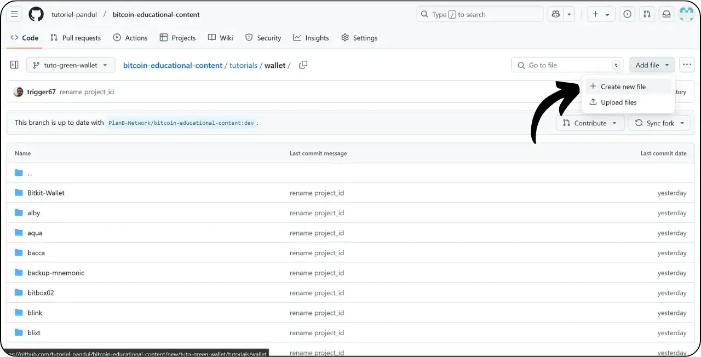
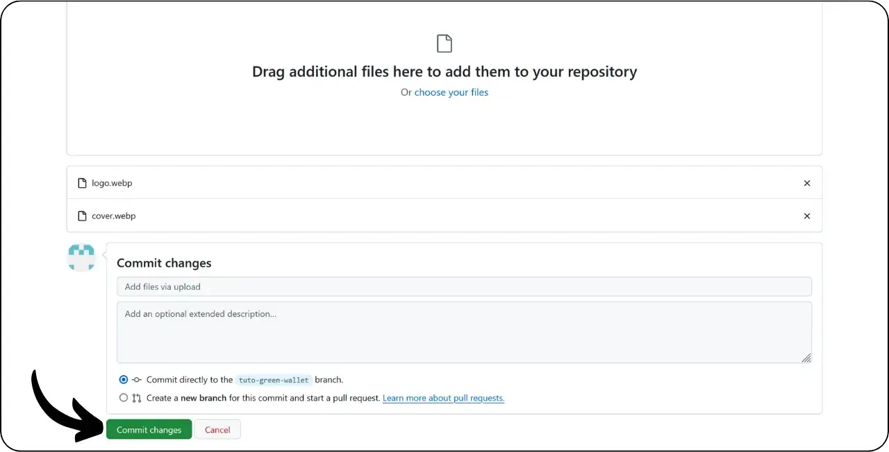
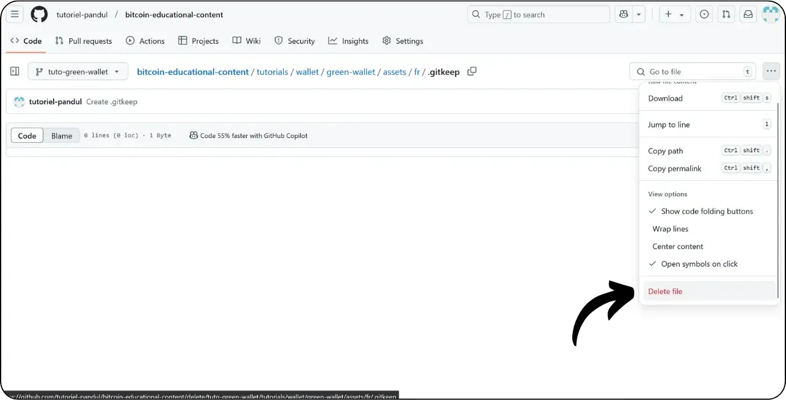
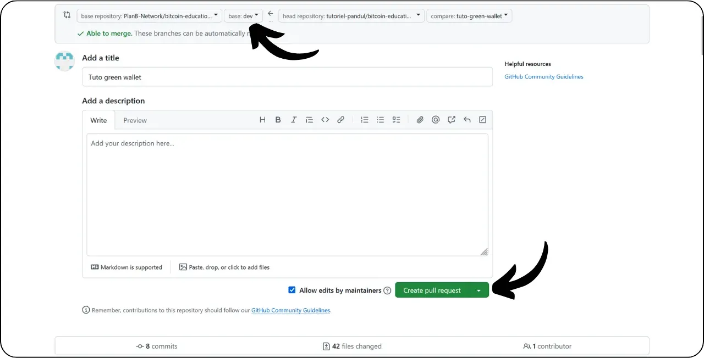

在学习本教程添加新教程之前，您需要完成几个初步步骤。如果您还没有这样做，请先看看这个入门教程，然后再回到这里：

https://planb.network/tutorials/contribution/content/write-tutorials-4d142a6a-9127-4ffb-9e0a-5aba29f169e2

您已经拥有 ：


- 为您的教程选择一个主题；
- 通过 [Telegram 群组](https://t.me/PlanBNetwork_ContentBuilder) 或 paolo@planb.network 与计划 ₿ 网络团队联系；
- 选择您的捐助工具。

在本教程中，我们将介绍如何使用网页版 GitHub 将教程添加到 Plan ₿ Network。如果您已经熟练掌握了 Git，可能就不需要本教程了。相反，我建议你看看另外 2 个教程中的一个，在那里我详细介绍了从本地 .NET Framework 进行修改的指导原则和步骤：


- 经验丰富的用户** ：

https://planb.network/tutorials/contribution/content/write-tutorials-git-expert-0ce1e490-c28f-4c51-b7e0-9a6ac9728410

- 中级（GitHub 桌面）** ：

https://planb.network/tutorials/contribution/content/write-tutorials-github-desktop-intermediate-4a36a052-1000-4191-890a-9a1dc65f8957

## 先决条件

开始教程前的先决条件 ：


- 拥有 [GitHub 账户](https://github.com/signup)；
- 有一个 [Plan ₿ Network source repository](https://github.com/PlanB-Network/bitcoin-educational-content) 的 fork；
- 拥有[Plan ₿ Network 上的教师简介](https://planb.network/professors) （仅当您提供完整教程时）。

如果您在获得这些先决条件方面需要帮助，我的其他教程会有所帮助：


https://planb.network/tutorials/contribution/others/create-github-account-a75fc39d-f0d0-44dc-9cd5-cd94aee0c07c

https://planb.network/tutorials/contribution/others/github-desktop-work-environment-5862003b-9d76-47f5-a9e0-5ec74256a8ba

https://planb.network/tutorials/contribution/others/create-teacher-profile-8ba9ba49-8fac-437a-a435-c38eebc8f8a4

一旦一切就绪，你也有了自己的 Plan ₿ Network 代码库分叉，就可以开始添加教程了。

## 1 - 创建新分支

打开浏览器，导航到计划₿ 网络存储库中的分叉页面。这是您在 GitHub 上建立的分叉。你的分叉的 URL 应该是这样的`https://github.com/[your-username]/bitcoin-educational-content` ：


确保你在主分支 `dev` 上，然后点击 "*同步 fork*"按钮。如果你的分支不是最新的，GitHub 会要求你更新分支。继续更新：


点击 "dev "分支，然后为你的工作分支命名，使其标题清楚地反映其目的，用破折号分隔单词。例如，如果我们的目的是编写使用绿色钱包的教程，分支可以称为tuto-green-wallet-loic`。输入合适的名称后，点击 "*创建分支*"确认基于 `dev` 创建新分支：


现在您应该在新的工作分支上了：


这意味着您所做的任何更改都只会保存在该特定分支上。

每发布一篇新文章，就从 `dev` 中创建一个新分支。

Git 中的分支代表项目的一个并行版本，您可以在不影响主分支的情况下对其进行修改，直到您的工作可以整合到主分支中。

## 2 - 添加教程文件

现在工作分支已经创建，是时候整合新教程了。

在分支文件中，您需要找到合适的子文件夹来放置您的教程。文件夹的组织结构反映了 Plan ₿ Network 网站的不同部分。在我们的例子中，由于我们要添加一个关于绿色钱包的教程，所以请前往以下路径：`bitcoin-educational-content\tutorials\wallet` 对应网站的 `WALLET` 部分：


在 `wallet` 文件夹中新建一个专门用于教程的目录。该文件夹的名称应清楚地表明教程中涉及的软件，使用连字符连接单词。在我的例子中，文件夹将命名为 "green-wallet"。点击 "*添加文件*"，然后点击 "*创建新文件*"：



输入文件夹名称，然后输入斜线 `/`，以确认将其创建为文件夹。


在这个专门用于教程的新子文件夹中，您需要添加几个项目：


- 创建一个 "assets "文件夹，用于存放教程所需的所有插图；
- 在 "assets "文件夹中，根据教程的原始语言代码创建一个子文件夹。例如，如果教程是用英语编写的，该子文件夹应命名为 `en`。将教程的所有视觉资料（图表、图像、截图等）放入该文件夹。
- 必须创建一个 `tutorial.yml` 文件来记录教程的详细信息；
- 必须创建一个标记符文件来编写教程的实际内容。该文件必须根据编写语言的代码命名。例如，对于用法语编写的教程，该文件应称为 `fr.md`。

下面是文件的层次结构（我们将在下一节继续创建它们）：

```
bitcoin-educational-content/
└── tutorials/
└── wallet/ (à modifier avec la bonne catégorie)
└── green-wallet/ (à modifier avec le nom du tuto)
├── assets/
│   ├── fr/ (à modifier selon le code de langue approprié)
├── tutorial.yml
└── fr.md (à modifier selon le code de langue approprié)
```

## 3 - 填写 YAML 文件

让我们从 YAML 文件开始。在创建新文件的框中输入 `tutorial.yml` ：


复制以下模板，填写 `tutorial.yml` 文件：

```
id:
project_id:
tags:
-
-
-
category:
level:
credits:
professor:
# Proofreading metadata
original_language:
proofreading:
- language:
last_contribution_date:
urgency:
contributors_id:
-
reward:
```

以下是必填字段：


- id**：UUID（通用唯一标识符），用于唯一标识教程。您可以使用[在线工具](https://www.uuidgenerator.net/version4)生成它。唯一的限制是该 UUID 必须是随机的，以免与平台上的其他 UUID 冲突；
- project_id** ：教程中介绍的工具背后的公司或组织的 UUID[来自项目列表](https://github.com/PlanB-Network/bitcoin-educational-content/tree/dev/resources/projects)。例如，如果你正在做一个关于绿色钱包软件的教程，你可以在以下文件中找到这个 `project_id` ：bitcoin-educational-content/resources/projects/blockstream/project.yml`。之所以在教程的 YAML 文件中添加此信息，是因为 Plan ₿ Network 维护着一个所有在比特币或相关项目上运营的公司和组织的数据库。将链接实体的 `project_id` 添加到您的教程中，就在两个元素之间建立了链接；
- 标签**：从计划₿ 网络标签列表]中专门选择 2 或 3 个与教程内容相关的关键字(https://github.com/PlanB-Network/bitcoin-educational-content/blob/dev/docs/50-planb-tags.md)；
- 类别** ：根据计划₿ 网络结构（例如钱包："桌面"、"硬件"、"移动"、"备份"），与教程内容相对应的子类别；
- 级别** ：教程难度级别，从 ：
    - 初学者
    - 中级
    - 高级
    - 专家
- 教授**：您在[您的教师简介](https://github.com/PlanB-Network/bitcoin-educational-content/tree/dev/professors)中显示的 "贡献者 ID"（BIP39 字样）；
- original_language** ：教程的原始语言（如`fr`、`en`等）；
- 校对**：有关校对过程的信息。填写第一部分，因为校对自己的教程也算第一次验证：
    - 语言**：校对语言代码（如`fr`、`en`等）。
    - last_contribution_date**：今天的日期。
    - 紧迫性** ：留空。
    - contributors_id** ：您的 GitHub ID。
    - 奖励** ：留空。

有关教师 ID 的详细信息，请参阅相应的教程 ：

https://planb.network/tutorials/contribution/others/create-teacher-profile-8ba9ba49-8fac-437a-a435-c38eebc8f8a4

以下是为 Blockstream Green 钱包教程编写的`tutorial.yml`文件示例：

```
id: e84edaa9-fb65-48c1-a357-8a5f27996143
project_id: 3b2f45e6-d612-412c-95ba-cf65b49aa5b8
tags:
- wallets
- software
- keys
category: mobile
level: beginner
credits:
professor: pretty-private
# Proofreading metadata
original_language: fr
proofreading:
- language: fr
last_contribution_date: 2024-11-20
urgency:
contributors_id:
- LoicPandul
reward:
```

修改完 `tutorial.yml` 文件后，点击 "*提交更改...*"按钮保存文档：


添加标题和描述，并确保提交到本教程开始时创建的分支。然后点击 "*提交更改*"确认。


## 4 - 创建图像子文件夹

再次点击 "*添加文件*"，然后点击 "*创建新文件*"：


输入 "assets"，然后输入斜线"/"，以创建文件夹：


在 `/assets` 文件夹中重复此步骤，创建语言子文件夹，例如，如果教程是法语，则创建 `fr`：


在该文件夹中创建一个虚拟文件，以强制 GitHub 保留您的文件夹（否则该文件夹将为空）。将该文件命名为".gitkeep"。然后点击 "*提交更改...*"。


再次检查您所在的分支是否正确，然后点击 "*提交更改*"。


## 5 - 创建 Markdown 文件

现在，我们要创建一个文件来存放您的教程，该文件根据您的语言代码命名，例如，如果我们用法语编写，则命名为 `fr.md`。进入你的教程文件夹 ：


点击 "添加文件*"，然后点击 "创建新文件*"。


使用语言代码为文件命名。在我的例子中，由于教程是用法语编写的，所以我将文件命名为 `fr.md`。扩展名 `.md` 表示文件为 Markdown 格式。


我们首先要填写文档顶部的 "属性 "部分。手动添加并填写以下代码块（"name:`"和 "description:`"键必须使用英文，但其值必须使用教程中使用的语言编写）：

```
---
name: [Titre]
description: [Description]
---
```


填写教程名称和简短说明：


然后在教程开头添加封面图像的路径。为此，请注意 ：

```

```

当您需要在教程中添加图片时，这种语法就会派上用场。感叹号表示图片，其替代文本 (alt) 指定在方括号之间。图片的路径位于方括号之间：


点击 "*提交更改...*"按钮保存文件。


检查分支是否正确，然后确认提交。


根据语言代码，您的教程文件夹现在应该是这样的：


## 6 - 添加徽标和封面

在 "assets "文件夹中，您需要添加一个名为 "logo.webp "的文件，作为文章的缩略图。该图片必须为 `.webp`格式，大小必须为正方形，以便与用户界面相匹配。

您可以自由选择教程中使用的软件徽标或任何其他相关图片，只要是免版税的即可。此外，请在同一位置添加一张名为 "cover.webp "的图片。这将显示在教程的顶部。请确保该图片与徽标一样，尊重使用权并适合教程的上下文。

要在 `/assets` 文件夹中添加图片，可以从本地文件中拖放图片。确保您在 `/assets` 文件夹中，并且在正确的分支上，然后点击 "*提交更改*"。



现在你应该能看到文件夹中出现图像了。


## 7 - 编写教程

继续编写教程，在带有语言代码的 Markdown 文件中记录内容（在我的例子中，法语文件为 `fr.md`）。转到该文件，点击铅笔图标 ：


开始编写教程。添加副标题时，使用适当的 Markdown 格式，在文本前加上 `##` ：


交替使用 "*编辑*"和 "*预览*"视图，以更好地直观呈现效果图。


要保存您的工作，请点击 "*提交更改...*"，确保您在正确的分支上，然后再次点击 "*提交更改*"确认。


## 8 - 添加视觉效果

`/assets` 文件夹中的语言子文件夹（在我的例子中为 `/assets/en`）用于存储教程中的图表和视觉效果。尽可能避免在图片中包含文字，以便国际受众也能阅读您的内容。当然，所介绍的软件会包含文字，但如果您在软件截图上添加示意图或其他说明，请不要使用文字，如果有必要，请使用英文。

要为图像命名，只需使用与它们在教程中出现的顺序相对应的数字，格式为两位数（如果教程包含 99 张以上的图像，则为三位数）。例如，将第一张图片命名为 `01.webp`，第二张命名为 `02.webp`，以此类推。

您的图片必须是 `.webp` 格式。如有必要，您可以使用 [我的图像转换软件](https://github.com/LoicPandul/ImagesConverter)。


将图片添加到子文件夹后，就可以删除虚拟文件 `.gitkeep`了。打开该文件，点击右上角的三个小圆点，然后点击 "*删除文件*"。



点击 "*提交更改...*"保存更改。


要在编辑文档中插入子文件夹中的图表，请使用下面的 Markdown 命令，注意为您的语言指定适当的替代文本和正确的图像路径：

```

```

开头的感叹号表示图像。方括号之间是备选文本，有助于无障碍访问和引用。最后，图片的路径标注在方括号之间。


如果您想创建自己的示意图，请务必遵循计划 ₿ 网络图形指南，以确保视觉一致性：


- 字体**：使用 [Rubik](https://fonts.google.com/specimen/Rubik)；
- 颜色** ：
 - 橙色#FF5C00
 - 黑色 : #000000
 - 白色#FFFFFF

**在您的教程中集成的所有视觉效果必须是无版权或尊重源文件许可**的。因此，在 Plan ₿ Network 上发布的所有图表均采用 CC-BY-SA 许可，与文本相同。

**-> 提示：** 在公共场合共享图片等文件时，删除多余的元数据非常重要。这可能包含敏感信息，如位置数据、创建日期和作者详情。为了保护你的隐私，最好删除这些元数据。要简化这一操作，可以使用 [Exif Cleaner](https://exifcleaner.com/)等专业工具，只需简单的拖放操作就能清理文档的元数据。

## 9 - 提出教程

当您用自己选择的语言编写完教程后，下一步就是提交**拉动请求**。然后，管理员将使用我们的自动翻译方法和人工校对，将缺失的翻译添加到您的教程中。

要继续拉动请求，在保存所有更改后，点击 "*贡献*"按钮，然后点击 "*打开拉动请求*"：


拉动请求是将您的分支中的更改整合到 Plan ₿ Network 代码库的主分支中的请求，允许在合并之前对更改进行审查和讨论。

在继续之前，请在界面底部仔细检查这些更改是否符合您的预期：


确保在界面顶端，你的工作分支已合并到 Plan ₿ Network 代码库的 `dev` 分支（即主分支）上。

输入一个标题，简要概括您希望与源代码库合并的更改。添加一个简短的注释来描述这些更改（如果您有一个与创建教程相关的问题编号，记得在注释中注明 "关闭 #{ 问题编号}"），然后点击绿色的 "*创建拉取请求*"按钮来确认合并请求：



然后，您的 PR 就会出现在主计划₿ 网络存储库的 "*Pull Request*（*拉取请求*）"选项卡中。您现在所要做的就是等待管理员与您联系，确认您的贡献已被合并，或要求进一步修改。


将 PR 与主分支合并后，我们建议删除工作分支（以我的例子为例：`tuto-green-wallet`），以保持分叉历史的完整性。GitHub 会在 PR 页面自动为您提供这一选项：


如果您在提交 PR 后希望更改会费，应遵循的步骤取决于 PR 的当前状态：


- 如果您的 PR 仍未合并，请在同一工作分支上进行更改。提交的更改将添加到您仍未合并的 PR 中；
- 如果您的 PR 已与主分支合并，则需要从头开始重新创建一个新分支，然后提交一份新 PR。在继续之前，请确保你的分叉与 `dev` 分支上的 Plan ₿ Network 源代码库同步。

如果您在提交教程时遇到技术问题，请不要犹豫，在[我们专门的 Telegram 投稿群组](https://t.me/PlanBNetwork_ContentBuilder)上寻求帮助。非常感谢！
