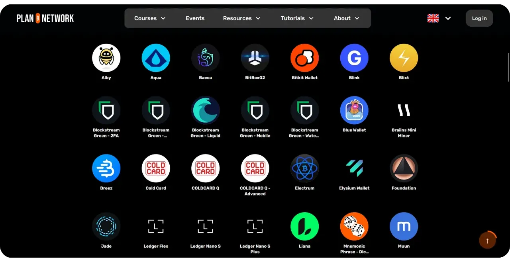
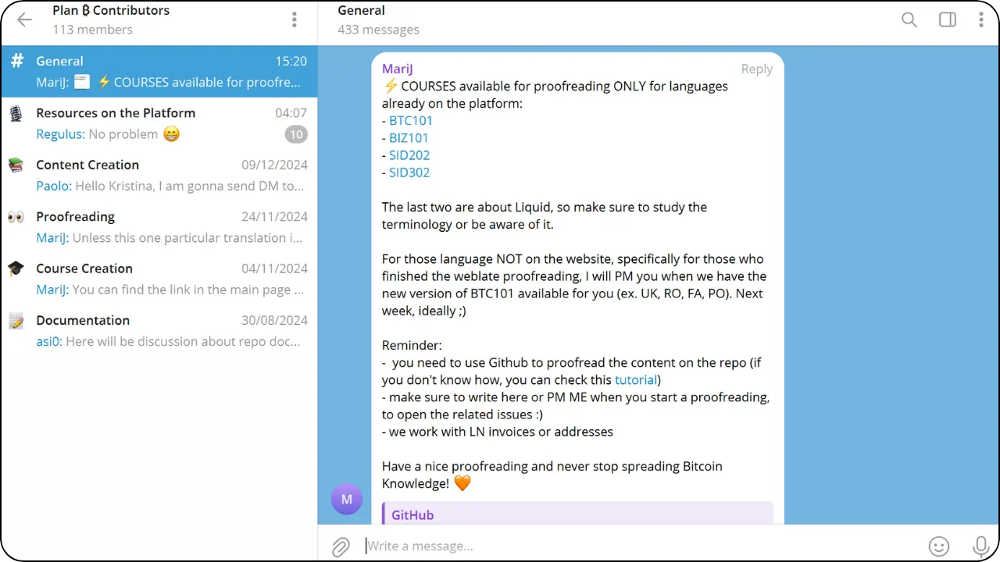

Plan ₿ Network 的使命是以尽可能多的语言提供关于比特币的领先教育资源。网站上发布的所有内容都是开源的，并托管在 GitHub 上，任何人都有机会参与丰富该平台。贡献可以有多种形式：纠正和校对现有文本，翻译成其他语言，更新信息，甚至创建我们网站上尚未提供的新教程。

在本教程中，我们将了解如何在 Plan ₿ Network 平台上添加新内容，如教程或课程。

## 教程和课程有什么区别？

我们平台的两个主要部分是课程和教程。课程提供理论教育资源，而教程则提供实用内容，说明如何使用特定工具（例如硬件钱包或软件）或特定做法（例如保护记忆短语或检查软件的真伪）。

课程自然比教程更长、更有条理。课程应深入、准确、详细地探讨与比特币或其生态系统相关的特定主题。

[探索计划 ₿ 网络课程](https://planb.network/courses)

教程一般较短。这些教程以图片为辅助，一步一步地指导人们如何完成与比特币相关的特定任务。

[发现计划 ₿ 网络教程](https://planb.network/tutorials)

## 如何建议开设新课程？

如果你有一个比特币课程的想法，但平台上还没有，并想编写它，你可以通过以下地址联系我们：

contact@planb.network

在您的信息中，请简要介绍自己并描述您的课程构思。如果您已经有了课程结构的想法，也请附上各个章节的内容。我们将尽快与您联系，向您解释如何进行下一步工作，并在必要时讨论您的课程结构。

## 如何提交新教程？

要向 Plan ₿ Network 添加新教程，您可以直接在 GitHub 上提交 Pull Request。在下面的教程和随附的教程中，我将带您逐步完成这一过程，并告知您应遵循的准则，以确保您的教程与平台兼容，同时保持清晰的贡献历史。

## 1 - 为您的教程选择一个主题

我们主要寻找与比特币或其生态系统相关的工具教程。这些内容可分为六大类：

- 投资组合 ；
- 节点 ；
- 采矿 ；
- 商人
- 交换 ；
- 保密性。

除了这些与比特币具体相关的主题外，Plan ₿ Network 还在寻求有关强调个人主权的主题的投稿，如

- 开源工具；
- IT ；
- 密码学 ；
- 能源 ；
- 数学
- 经济
- DIY
- 生活黑客...

例如，我们目前有关于 Tails、Nostr 和 GrapheneOS 的教程。这些工具与比特币并无直接关系，但它们是我们可能感兴趣的系统，是迈向数字世界主权的一部分。这些内容可以整合到 "其他 "部分的一个子类别中。

您可以从头开始设计一个教程，也可以将以前在您的网站上发布的教程（前提是您拥有版权）复制到 Plan ₿ Network 上共享，并添加原文链接。

无论您选择哪种方式，请记住 Plan ₿ Network 上发布的所有内容均采用免费的 [CC-BY-SA](https://creativecommons.org/licenses/by-sa/4.0/) 许可。该许可授权任何人复制和修改您的内容，唯一条件是必须注明原始出处。

## 2 - 联系计划 ₿ 网络团队

选定教程主题后，下一步就是通知我们您打算将这些内容添加到平台上。如果您有 Telegram 账户，最简单的方法就是 [加入我们的群组](https://t.me/PlanBNetwork_ContentBuilder)。

请在 "General"（一般）频道发送消息，简要介绍自己，并说明您想撰写的具体内容和语言。然后，团队成员将在 GitHub 上创建一个与您的未来贡献相对应的问题。

如果您没有 Telegram 账户，也不想创建账户，也可以通过电子邮件联系我们，地址如下

paolo@planb.network

## 3 - 选择正确的工具做出贡献

要为 Plan ₿ Network 做出贡献，您有三种选择，具体取决于您对 GitHub 的使用经验：

- 有经验的用户**：继续使用您的常规方法，只需参考下面的简短教程，其中概述了计划₿ 网络存储库文件结构、具体要求和工作方法：

https://planb.network/tutorials/contribution/content/write-tutorials-git-expert-0ce1e490-c28f-4c51-b7e0-9a6ac9728410

- 中级（GitHub 桌面）** ：如果您不熟悉 Git 的使用，第一个选择是轻松建立自己的本地环境，为 Plan ₿ Network 做出贡献。对于重大贡献，例如编写完整的教程，建议采用这种方法。为此，请按照下面的教程逐步操作：

https://planb.network/tutorials/contribution/content/write-tutorials-github-desktop-intermediate-4a36a052-1000-4191-890a-9a1dc65f8957

- 初学者（网页界面）** ：您也可以选择直接使用 GitHub 的网页界面，而无需建立完整的本地环境。对于小贡献，可以考虑使用这种方法。但对于重大贡献，比如添加一个完整的新教程，这种方法可能比建立本地环境更复杂。我将在本教程中解释如何做到这一点：

https://planb.network/tutorials/contribution/content/write-tutorials-github-web-beginner-e64f8fed-4c0b-4225-9ebb-7fc5f1c01a79

根据你的知识水平从这三个选项中选择一个，然后开始编写你的第一个 Plan ₿ 网络教程！