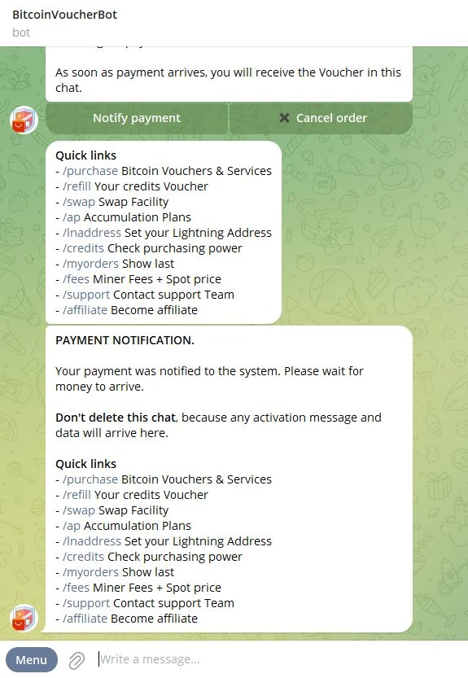
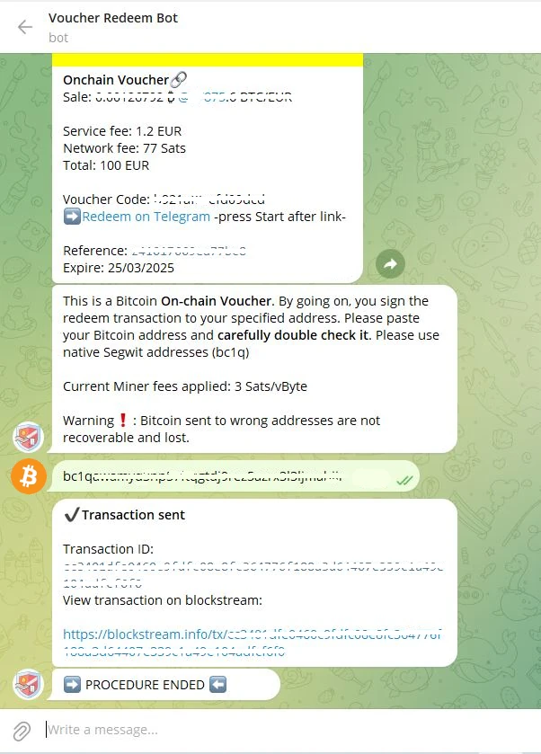

dieses Tutorium wurde geschrieben von_ [Bitcoin Campus] (https://linktr.ee/bitcoincampus_)

# Einführung

Der BitcoinVoucherBot ist ein Tool, mit dem Bitcoins in Exchange für Euro gekauft werden können.

### KYC Licht

Die Aktion, den Euro gegen Bitcoin zu tauschen, ist der erste und grundlegendste Schritt, um mit dem Studium dieses Themas zu beginnen, aber offenbar auch der schwierigste und komplexeste. Es kann viele Möglichkeiten geben: das Anbieten von Bitcoin über zentrale Exchanges, Bitcoin-Treffen, Freunde, Bekannte und mehr. Wir schließen uns der Bitcoiner-Gemeinschaft an und **empfehlen unbedingt die Nutzung zentraler Exchanges**, um mehr Aufmerksamkeit für die eigene Privatsphäre zu gewährleisten.

Obwohl diese Wahl weniger bequem sein mag, ist es wichtig zu verstehen, dass die Börsen die KYC-Verordnung (Know Your Cutomer) durchsetzen und somit jedem Satoshi, der bei ihnen gekauft wird, eine Identität sowie einen physischen Standort zuweisen. "Bequemlichkeit" hat einige auffällige Nebeneffekte.

### Wie kann man das tun?

Hier kommt der [BitcoinVoucherBot:](https://t.me/BitcoinVoucherBot) Dienst, ein Telegram-Bot, der als Vermittler zwischen unseren SEPA-Überweisungen und Sats-Käufen fungiert.

### Voraussetzungen

Um BitcoinVoucherBot zu nutzen, ist es nicht notwendig, sensible persönliche Informationen an die Bot-Mitarbeiter weiterzugeben. **Keine Autorisierung erforderlich**.

Alles, was Sie brauchen, ist ein bereits aktives Telegram-Konto und ein Bankkonto. **Anmerkung**: Ein bei der Poste Italiane (für italienische Kunden) eröffnetes Konto oder generell eine wiederaufladbare Karte ist nicht geeignet.

Im Telegram-Chat bereiten wir eine Bestellung vor, mit einer Banküberweisung bezahlen wir sie, und schließlich erhalten wir über den Bot einen Gutschein, der von einer dritten Firma ausgestellt wird, die den Gegenstand des Kaufs nicht kennt.

### Bot-Aktivierung und Menü

Die Aktivierung ist ein einfacher, einmaliger Vorgang. Suchen Sie in Telegram nach _@BitcoinVoucherBot_ und sobald Sie in den Chat des Bots gelangen, wird unten ein großer _Start/Start_ Button angezeigt. Daraufhin antwortet der Bot und präsentiert ein Menü mit den wichtigsten Befehlen, die ihm zur Verfügung stehen. Außerdem erscheinen die ersten Willkommensnachrichten, die man aufmerksam lesen sollte.

**Warnung**: Es gibt mehrere Betrüger, die sich als Original VoucherBot ausgeben. Wenn Sie sich bei der Suche über Telegram nicht sicher sind, rufen Sie bitte den BitcoinVoucherBot-Link von der [offiziellen Website](https://www.bitcoinvoucherbot.com/) auf

Die Optionen erscheinen, wenn Sie auf die Schaltfläche _Menu_ in der linken unteren Ecke klicken: Sie können auf das Wort klicken, das dem Befehl entspricht, oder in das Nachrichtenfeld den Schrägstrich `/` gefolgt von dem eingegebenen Befehl eingeben.

Zu den wichtigsten Maßnahmen gehören:

- _/purchase_: ist der eigentliche Kaufvorgang. Wenn die Transaktion abgeschlossen ist, wird der QR-Code automatisch vom Bot generiert und steht zur Einlösung bereit.
- _/refill_: zum Zeitpunkt der Erstellung dieses Tutorials verfügbar, aber wir werden nicht darauf eingehen, da diese Option aus technischen Gründen später entfernt werden könnte.
- _/swap_: Öffnet das Swap-Verfahren, das entweder über einen praktischen Telegram-Bot oder über das Web verfügbar ist.
- _/ap_: Akkumulationsplan, der es Ihnen ermöglicht, einen **Konstanten Akkumulationsplan (CAP)** einzurichten.
- _/lnaddress_: mit dem wir aufgefordert werden, einen eigenen LN Address zu verknüpfen, für ein bestimmtes Verfahren, das wir später sehen werden.
- _/credits_: um zu überprüfen, wie viel Guthaben für generate-Gutscheine übrig ist.
- _/myorders_: zeigt die mit dem Bot getätigten Bestellungen an (**Warnung** das System erfasst nur die letzten 10 getätigten Bestellungen und nicht die gesamte Historie).
- _/fees_: ein Befehl zur Überprüfung der Netzgebühren. Um sie zu bewerten, ist es immer am besten, sich auf Mempool.space zu verlassen.
- _/support_: Im Bedarfsfall werden Kontakte angezeigt, um Probleme an das Support-Team zu melden.

# Bitcoin Beschaffungsverfahren

## Vorbereitung der Bestellung

Klicken Sie im Befehlsmenü auf _/Kaufen_

Eine Reihe von Möglichkeiten erscheinen, aber wir wählen _BTC Vouchers_

BitcoinVoucherBot ermöglicht es Ihnen, Bitcoin onchain, Lightning und Liquid zu kaufen.

Wählen Sie in diesem Stadium _Onchain & Lightning 🔗⚡️_

Der Bildschirm ändert sich schnell und VoucherBot schlägt Ihnen Kaufwerte vor. Sie beginnen bei einem Minimum von 100,00 € bis zu 900,00 €.

Bei einem Erstkauf werden nur die Stückelungen 100,00 €, Onchain und Lightning angeboten. Um die Vertraulichkeit zu erhöhen, empfehlen wir, _Lightning ⚡️_ zu wählen

Der VoucherBot weist uns darauf hin, dass eine erste Auswahl getroffen wurde und dass wir zur Bestätigung _Fortfahren_ wählen müssen

Nun geht es darum, die Zahlungsmethode zu wählen. Die Überweisung wird per Banküberweisung **(nur SEPA akzeptiert)** durchgeführt. VoucherBot schlägt als Empfänger ein Unternehmen vor, das zwei Bankkonten zur Verfügung stellt, eines in Großbritannien und das andere in der Schweiz. Die Schweizer Bank wurde für die Durchführung dieses Tutorials gewählt

An dieser Stelle werden wir aufgefordert, unsere IBAN einzugeben, diejenige, von der aus die Überweisung an die gewählte Bank vorgenommen wird. Diese Informationen bilden ein Puzzle, das es dem Bot, d. h. einer Maschine, ermöglicht, einige Informationen zusammenzusetzen, um den Kaufvorgang ohne menschliches Zutun ablaufen zu lassen.

Die IBAN muss in die Nachrichtenleiste geschrieben, überprüft und an den Bot gesendet werden.

Im Chat mit VoucherBot erscheint nun eine Kontrollmeldung.

Wenn alles korrekt ist, klicken Sie auf _Fortfahren_.

## Zahlung

Nach einigen Augenblicken, die für die Verarbeitung der Daten notwendig sind, antwortet VoucherBot mit einer Nachricht, die alle notwendigen Angaben enthält, um die Bestellung abzuschließen. Je nachdem, was Ihre Bank verlangt, sind die relevanten Informationen:

- `IBAN`, die für die Einzahlung notwendig ist, sowie die Address des Empfängers;
- der "gewählte Betrag" wurde zuvor durch die Ausschlussfrist festgelegt, die eingehalten werden muss, damit VoucherBot die Bestellung bei Zahlungseingang erkennen kann;
- zahlungsgrund", das ist der Grund für die Zahlung. **Muss kopiert und eingefügt werden, ohne etwas zu entfernen oder hinzuzufügen, und zwar in das entsprechende Feld Ihrer Überweisung. Jedes "." oder "-" im Zahlungsgrund kann durch ein "Leerzeichen "** ersetzt werden.
- eine eindeutige `OrderID`, auf die Sie sich beziehen können, wenn Sie Hilfe anfordern.

Sie können dann mit der Zahlung über Ihre App oder Ihre Bank fortfahren. Wenn die Zahlung von der Bank akzeptiert wurde, sollten Sie daran denken, im Chat mit VoucherBot auf _Zahlung benachrichtigen_ zu drücken. Dieser einfache Vorgang weist Sie darauf hin, dass eine Zahlung unterwegs ist.

VoucherBot antwortet mit einer Nachricht, die eine sehr wichtige Warnung enthält: **Löschen Sie den Chat nicht**, zumindest nicht, bis der Gutschein eingegangen ist, denn nur so kann die Bestellung rekonstruiert und aufrechterhalten werden.

---
Bitte beachten:

- es werden nur SEPA-Überweisungen akzeptiert;
- die Wartezeiten hängen ausschließlich davon ab, wie die Banken (die nicht wie Bitcoin rund um die Uhr arbeiten) den Gutschein bearbeiten. Es kann ein paar Stunden bis zu 3 Arbeitstage dauern, bis Sie den Gutschein erhalten;
- für alle Bedürfnisse, Bitcoin VoucherBot hat einen ausgezeichneten [Support](https://t.me/BitcoinVoucherGroup) Service auf Telegram.

---
## Erlösung

Sobald die Zahlung erfolgreich ist, sendet Bitcoin VoucherBot den Gutschein direkt in den Chat. Der Blitzgutschein hat die Form eines QR-Codes, der auf einem orangefarbenen Hintergrund gedruckt ist.

Es gibt alle Daten, die man braucht, um sie einzulösen:

- den Betrag in Sats, der dem Betrag entspricht, der per Überweisung gesendet wird, ohne Dienstleistungs- und Netzgebühren;
- eine Referenz-ID des Gutscheins;
- das Datum, bis zu dem der Gutschein eingelöst werden muss, da sonst die Gelder verloren gehen, d. h. 25 Tage nach Ausstellung des Gutscheins.

Sie können den Gutschein einlösen, indem Sie den QR-Code mit der Scanfunktion eines kompatiblen Wallet Lightning Network einrahmen, oder über LNURL, die ebenfalls unter dem QR-Code angezeigt wird.

Für dieses Tutorial haben wir Wallet von Satoshi verwendet, wobei die Scan-Funktion mit der Taste _Senden_ aktiviert wurde

Bei aktivierter Handykamera den QR-Code im Chat einrahmen und Telegram vom PC aus öffnen

Bevor Sie fortfahren, Wallet von Satoshi von einem Verifizierungsbildschirm, der den Betrag enthält, der genau mit dem Betrag auf dem Gutschein und, als Beschreibung, BitcoinVoucherBot ausgedrückt. Um den Gutschein einzulösen, klicken Sie einfach auf _Receive_

Wallet Von Satoshi läuft für einige Augenblicke

und schließlich wird die Einziehung gemeldet und ist sofort in der Bilanz des Wallet verfügbar.

**Wallet von Satoshi ist eine Sorgerechtsanwendung: Unmittelbar nach der Einlösung des Gutscheins ist es ratsam, Sats auf einen Wallet ohne Sorgerecht zu übertragen

### Wie man einen onchain-Gutschein einlöst

Wie wir in der Bestellvorbereitung gesehen haben, ermöglicht VoucherBot den Kauf von Sats direkt auf der Kette, mit der Wahl des gleichnamigen Gutscheins.

**Anmerkung**: Auftragsvorbereitung und Bezahlung ändern sich nicht, sie sind immer gleich. Was sich ändert, ist die Art und Weise, wie ein Onchain-Gutschein eingelöst wird.

Nachdem Sie die Bestellung abgeschlossen, die Zahlung getätigt, auf _Zahlung melden_ geklickt und die technische Zeit der Banken für die Überweisung abgewartet haben, antwortet VoucherBot, indem es den Gutschein direkt in den Chat schickt.

Dieser Gutschein hat ebenfalls die Form eines QR-Codes, aber die Hauptfarbe ist kanariengelb und - was am wichtigsten ist - in der Beschreibung wird gut erklärt, dass es sich um einen Onchain-Gutschein handelt, den Sie direkt auf Ihrer Wallet Onchain einlösen können und um den Auszahlungsvorgang zu starten, müssen Sie auf _Rückzahlung auf Telegramm_ klicken. Der Onchain-Gutschein enthält auch die Informationen, die bereits für den Lightning-Gutschein gelten:

- den Betrag in Sats, der dem Betrag entspricht, der per Überweisung überwiesen wird, ohne Dienstleistungs- und Netzgebühren;
- einen Gutscheincode;
- eine Referenz-ID des Gutscheins;
- das Datum, bis zu dem der Gutschein eingelöst werden muss, da sonst die Gelder verloren gehen, d. h. 25 Tage nach Ausstellung des Gutscheins.

**WARNUNG ⚠️:** wie erklärt angeklickt, öffnet sich das Pop-up eines anderen Bots: **Voucher RedeemBot.**

Voucher RedeemBot ist das Werkzeug, das für diesen Zweck zur Verfügung gestellt wird. Unabhängig davon, ob es sich um die erste Nutzung handelt oder ob es frühere Bestellungen gibt, ist es bei jeder neuen Einlösung notwendig, auf _START_ zu klicken.

An diesem Punkt lädt RedeemBot den Onchain-Gutschein, der anhand des Gutscheincodes und der Referenz-ID leicht zu erkennen ist. Außerdem wird die Leiste zum Schreiben von Nachrichten und zum Starten eines Chats mit dem Bot freigeschaltet, der uns einlädt, ihm einen onchain Address unseres Wallet mitzuteilen.

**Anmerkung**: Dieses Address muss vom Typ SegWit sein.

Wir öffnen an dieser Stelle unseren Wallet und generate einen SegWit Address

wir kopieren es

und fügen Sie es in den Chat mit RedeemBot ein

Wir haben nun einen Kontrollbildschirm, um zu überprüfen, ob der Gutscheincode korrekt ist, sowie die Address, die wir an RedeemBot übermittelt haben. Überprüfen wir das gut, denn wenn wir auf _Fortfahren_ klicken, beginnt die Transaktion, und es gibt keine Möglichkeit, sie wiederzufinden, wenn wir z. B. die falsche Address übermittelt haben.

Die Transaktion hat begonnen und das Redeem-Verfahren des Onchain-Gutscheins ist damit beendet.

während der Betrag in der Geschichte unseres Wallet gesehen werden kann.

